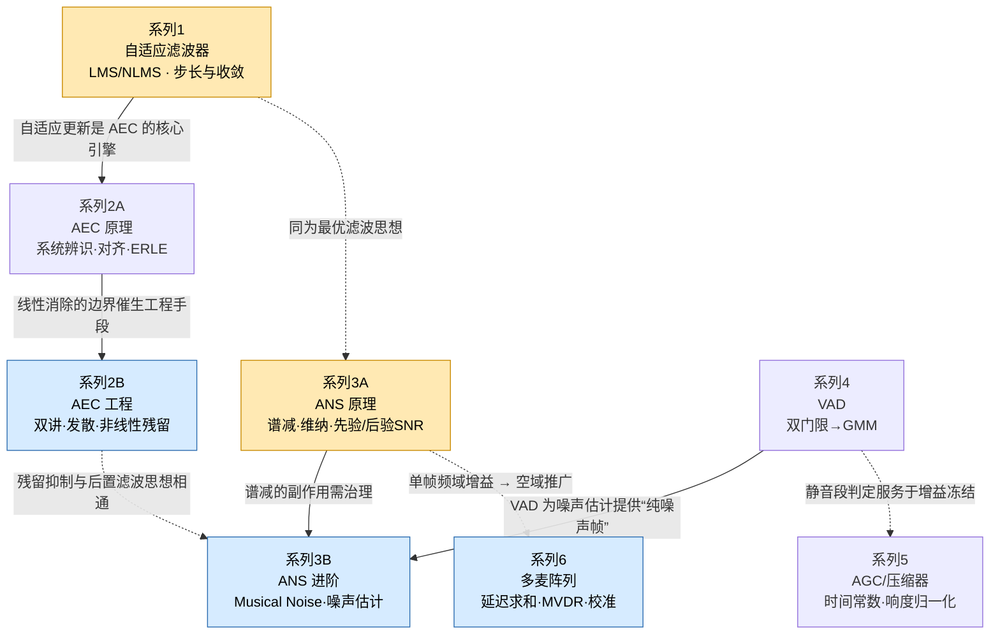

# PLAN.md — 经典 3A 算法原理与工程实战 · 系列规划书

> 主题：面向「驱动工程师 → 算法工程师」转型的系统性博客。
> 目标：把晦涩的原理和公式**讲明白、讲透彻**。
> 符号约定与风格红线见 [`STYLE.md`](./STYLE.md)（本规划书的 C/D 部分）。

---

## 实施方式（真实工作流，非“多 Agent 角色扮演”）

原始提示词为纯对话模型设计，用「大纲/讲解/代码/审稿 Agent 切换」模拟分工。
本项目用**真实步骤**替代：

1. **规划**：本文件 + `STYLE.md`
2. **起草**：`posts/series-N.md`
3. **验证代码**：`code/series-N.py` 由我**实际执行**，报错即修
4. **生成配图**：matplotlib 真实运行产图，存 `figures/`
5. **自评门禁**：`scripts/gate.py` 扫禁用词 + 跑代码 + 核对符号，未过则重写

### 交付物结构
```
3A-classcial/
├── PLAN.md            # 本文件：A + B + 实施方式
├── STYLE.md           # C 符号表 + D 风格红线 + 强制结构 + 自评清单
├── posts/             # series-1.md ... series-8.md 正文
├── code/              # 每篇配套 .py（已验证可跑）
├── figures/           # 自动生成的配图
└── scripts/gate.py    # 自评门禁脚本
```

### 与原提示词的差异（已与作者确认）
- **删除 WebRTC 源码走读**（AECM/NS/VAD），避免额外认知负担；专注原理与教学参考实现。
- 配套代码定位为**教学参考实现**（NumPy/SciPy，讲透原理，不追生产性能）。
- 每篇为**深度长文 + 多图**。

---

## (A) 8 篇博客标题 + 核心问题陈述

> 6 个主题域，共 8 篇。系列 2、3 各拆为两篇（原理篇 + 工程/进阶篇）。

**系列 1 · 自适应滤波器降维拆解 —— 为什么 LMS 至今没死？**
最小均方（LMS）如何靠一条“误差反馈”自动逼近未知系统？步长 `μ` 一调大就发散、一调小就学不动，这对矛盾的数学根源在哪？NLMS 的“归一化”到底归一化了什么？

**系列 2A · AEC 原理篇 —— 把“回声墙”建模成一个待辨识的滤波器**
扬声器播出的远端声音绕回麦克风形成回声，为什么它本质是一次“系统辨识”？远端对齐（时延估计）为何是 AEC 的生死线？ERLE 指标怎么量化“消了多少”？

**系列 2B · AEC 工程篇 —— 双讲、发散与非线性残留**
双方同时说话（double-talk）时滤波器为何会“学歪”甚至发散？如何用双讲检测冻结更新？扬声器非线性带来的残留回声，为什么线性滤波器永远消不干净、必须上后置抑制？

**系列 3A · ANS 原理篇 —— 谱减法与维纳滤波，先验/后验 SNR**
单麦降噪的第一性原理：已知带噪谱，如何“减掉”噪声谱？谱减法为何简单却吵？维纳滤波怎么用先验 SNR `ξ_prior` 得出最优增益 `M(t,f)`？后验 SNR `γ_post` 又是什么？

**系列 3B · ANS 进阶篇 —— Musical Noise 与噪声估计**
为什么谱减后会冒出“水声/音乐噪声”？它的数学成因是什么，判决引导（DD）和过减因子如何压制它？没有 VAD 时，如何用最小值统计 / MCRA 在线估计噪声功率 `λ_d`？

**系列 4 · VAD 语音端点检测 —— 从双门限到统计模型**
如何判断“这一帧到底有没有人说话”？能量 + 过零率双门限为何简单有效又容易被稳态噪声骗？升级到 GMM / 似然比统计模型后，判决依据从“阈值”变成了什么？

**系列 5 · AGC 与压缩器 —— 增益的“自动驾驶”与响度归一化**
为什么录音忽大忽小、需要自动增益（AGC）？压缩器的阈值/压缩比/拐点如何塑形动态范围？Attack/Release 时间常数为何决定“喘息感”？为什么最终要做响度归一化而非峰值归一化？

**系列 6 · 多麦阵列信号处理 —— 从延迟求和到 MVDR**
多个麦克风凭什么能“听清一个方向”？延迟求和波束为何是最朴素的空域滤波？MVDR 如何在“保住目标方向、压掉干扰”之间求最优解？远/近场差异与麦克风一致性校准为何是落地前提？

---

## (B) 知识图谱（依赖关系）



**阅读路径建议**
- 打地基：`系列1`（自适应滤波是 AEC 的引擎，也是最优滤波直觉的起点）。
- 主线 A（回声）：`系列1 → 系列2A → 系列2B`。
- 主线 B（噪声）：`系列3A → 系列3B`，其中 `系列4(VAD)` 为 `3B` 的噪声估计供“纯噪声帧”。
- 收尾：`系列5(AGC)` 处理响度、`系列6(阵列)` 把单帧频域增益推广到空域。

---

## 进度表

| 篇 | 标题 | 状态 |
|---|---|---|
| 1 | 自适应滤波器降维拆解 | ✅ 已过审 |
| 2A | AEC 原理篇 | ✅ 已过审 |
| 2B | AEC 工程篇 | ✅ 已过审 |
| 3A | ANS 原理篇 | ✅ 已过审 |
| 3B | ANS 进阶篇 | ✅ 已过审 |
| 4 | VAD 端点检测 | ✅ 已过审 |
| 5 | AGC 与压缩器 | ✅ 已过审 |
| 6 | 多麦阵列 | ✅ 已过审 |

> 我会在你发出「开始写系列 N」后逐篇撰写，写完更新本表状态。
