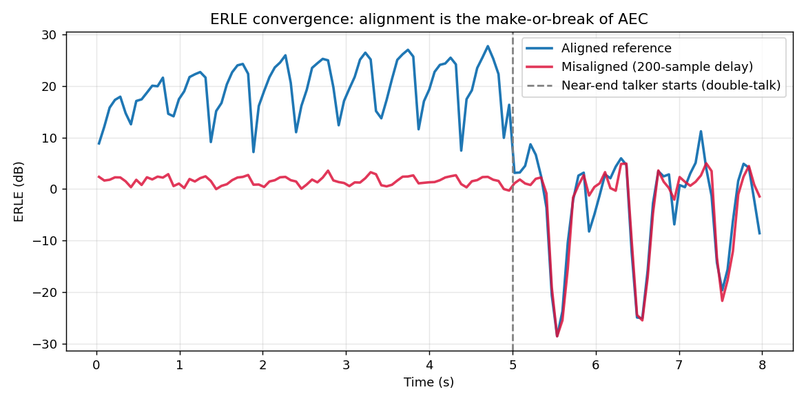
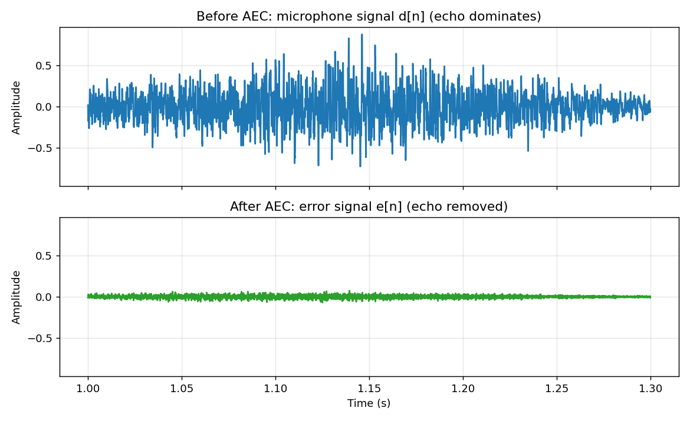
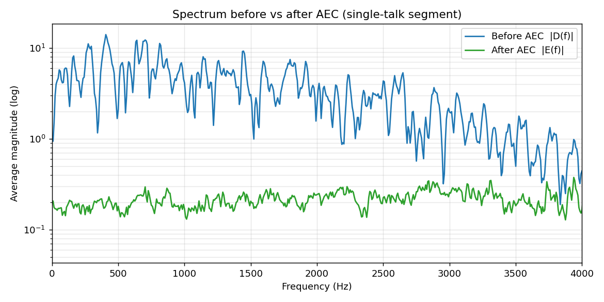
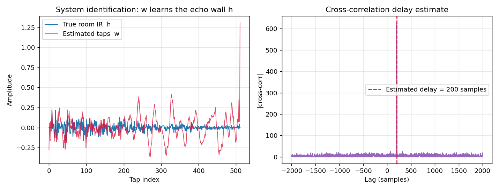

# 系列 2A · AEC 原理篇 —— 把「回声墙」建模成一个待辨识的滤波器

> 前置：本篇的自适应引擎（LMS/NLMS、步长与收敛）来自 [系列 1](./series-1.md)。这里我们把那台「自动逼近未知系统」的机器，直接对准声学回声这堵墙。

---

## 0. TL;DR + 解决什么问题

你在开视频会议，对方却总听见自己刚说过的话，慢半拍飘回来——这就是**声学回声 (Acoustic Echo)**。声学回声消除 (AEC) 要在你这端把「绕回麦克风的对方声音」减掉，只留下你真正想传出去的近端语音。

本篇讲清三件事：

- 为什么 AEC 本质是一次**系统辨识**：用一个自适应滤波器 $\vec{w}$ 去复制「回声路径」这堵墙，再把复制品从麦克风信号里减掉。
- 为什么**远端对齐（时延估计）是 AEC 的生死线**：参考和麦克风没对齐，滤波器根本学不出来。
- 怎么用 **ERLE** 量化「到底消掉了多少 dB 回声」，以及它只能在什么时候评估。

> ⭐ **一句话结论**：AEC = 用远端参考 `x[n]` 做输入、麦克风信号 `d[n]` 做期望，跑一个 NLMS 自适应滤波器辨识回声路径，误差 `e[n]` 就是消回声后的信号。

---

## 1. 工程痛点引入：对方听见了自己的声音

先看一个真实会议室里会发生的故事。

远端同事 A 说话，声音通过网络传到你的设备，从**你的扬声器**播出来。这股声音在房间里弹来弹去——桌面、墙壁、天花板——一部分绕了一圈又钻进**你的麦克风**。于是你的麦克风采集到的，不只是你自己的话，还混进了 A 刚才那句话的「房间混响版」。

这个混进去的信号被你原样传回给 A。A 于是听见：自己 300 毫秒前说的话，裹着你房间的混响，回荡着飘了回来。轻则别扭，重则**啸叫**（声音在两端设备间正反馈，越滚越大，直接爆音）。

问题的物理链条是这样的：

```
远端 A 的话  ──网络──▶  你的扬声器  ──房间空气──▶  你的麦克风  ──网络──▶  回到 A 耳朵
                            （被房间"加工"了一遍：延迟 + 混响）
```

难点在于：这堵「回声墙」不是固定的。你挪一下笔记本、有人开门、房间里坐了几个人，回声路径就变了。它还带着几十到几百毫秒的**延迟**。你没法预先写死一个「减法表」，只能让算法**在线自己学出来、并且随时跟着变**。

---

## 2. 直觉解释：造一面「假墙」，把回声抵消掉

先不碰数学。把房间对远端声音的「加工」想象成一堵**回声墙**：远端信号 `x[n]` 撞上这堵墙，反弹出来的就是回声。这堵墙的「脾气」——延迟多少、混响多长、每个反射多强——完全由房间的物理结构决定。

AEC 的思路朴素得像抄作业：

> 既然我手里**同时握着**送去扬声器的原始远端信号 `x[n]`，那我就在数字世界里**造一面一模一样的假墙**，让 `x[n]` 也撞一遍，算出「我预测的回声」，再从麦克风信号里减掉它。

这面「假墙」就是自适应滤波器 $\vec{w}$。它一开始是一堵白墙（系数全零，什么都不反射），然后靠**误差反馈**一点点修正自己的形状——预测的回声比真回声弱了就加强，强了就减弱——直到它的「反射脾气」和真墙几乎一致。

这里的关键洞察，也是本篇的题眼：

> ⭐ **AEC 的本质是系统辨识**。真墙（房间冲激响应）是一个我们看不见的未知系统；`x[n]` 是探针输入，麦克风里的回声是这个系统的输出。我们要做的，就是用系列 1 那台自适应滤波器，从「输入-输出」这一对数据里把这个未知系统的「传递特性」反推出来。

比喻收束一下：**滤波器 $\vec{w}$ 是一面照着真墙临摹的镜子**。镜子照得越像，减完之后剩下的回声越少。而系列 1 里那条「误差反馈自动逼近未知系统」的机器，正是让这面镜子自己越磨越准的引擎。

---

## 3. 数学推导：从麦克风信号拆出回声

### 3.1 麦克风信号的构成

麦克风在时刻 `n` 采到的信号 `d[n]`（期望信号），是三样东西的叠加：

```
d[n] = y[n] + s[n] + v[n]
```

- `y[n]`：回声（远端声音绕回来的部分）
- `s[n]`：近端语音（你自己说的话，这才是我们想留下的）
- `v[n]`：背景噪声

**人话翻译**：麦克风是个「大锅烩」，回声、你的声音、环境噪声全炖在一起，AEC 的任务就是从这锅里把回声那一勺舀出去。

### 3.2 回声 = 远端参考经房间冲激响应卷积

回声 `y[n]` 是怎么来的？远端参考 `x[n]` 经过房间这个线性系统。线性时不变系统的输出 = 输入与系统**冲激响应** `h[k]` 的卷积：

```
y[n] = Σ_{k=0}^{L-1} h[k] · x[n-k]  =  (h * x)[n]
```

**人话翻译**：`h[k]` 就是那堵「回声墙」的完整履历——第 `k` 个采样点延迟上，房间把声音反射回来多强。把 `x[n]` 按这份履历「延迟、缩放、再全部加起来」，就得到了回声。`h` 越长，说明房间混响拖得越久（`L` 通常要覆盖几百毫秒，16 kHz 下就是几千个抽头级别；本篇为教学取 512 抽头）。

### 3.3 自适应滤波器：用 $\vec{w}$ 估计 h

我们造的「假墙」是一个长度为 `L` 的 FIR 滤波器，抽头系数为 $\vec{w} = [w_0, w_1, \dots , w_{L-1}]^{\top}$。把最近 `L` 个远端样本装进一个输入向量：

```
x[n] = [x[n], x[n-1], …, x[n-L+1]]^T
```

滤波器对回声的预测就是内积：

```
ŷ[n] = w^T x[n]
```

**人话翻译**：把「假墙」的每个抽头，压在最近 `L` 个远端样本上，对应相乘再求和，得到「我猜的回声」`ŷ[n]`。这一步和系列 1 里 FIR 滤波器的输出完全同构——$\vec{w}$ 就是那面待磨的镜子。

### 3.4 误差信号：消回声后的输出

用麦克风信号减去预测回声：

```
e[n] = d[n] - ŷ[n] = d[n] - w^T x[n]
```

代入 3.1 的构成，展开看 `e[n]` 到底剩下什么：

```
e[n] = ( y[n] - ŷ[n] ) + s[n] + v[n]
        └── 残留回声 ──┘
```

**人话翻译**：`e[n]` 里，回声那部分变成了「真回声减假回声」的**残差**——只要 $\vec{w}$ 学得够准（`ŷ ≈ y`），这项就趋近于零，`e[n]` 里就只剩下近端语音 `s[n]` 和噪声 `v[n]`。**所以 `e[n]` 既是我们要传给远端的干净信号，又恰好是驱动滤波器学习的误差**。这是 AEC 最精妙的一处「一鱼两吃」。

### 3.5 用 NLMS 更新这面镜子

怎么让 $\vec{w}$ 逼近 `h`？直接搬系列 1 的 NLMS 更新式（归一化最小均方）：

```
w(n+1) = w(n) + μ · e[n] · x[n] / (||x[n]||² + ε)
```

**人话翻译**：往「误差 × 当前输入」的方向挪一小步修正镜子；分母 $\|\vec{x}[n]\|^{2}$ 把远端音量的影响归一化掉——远端喊得响的时候自动收着点步子，小声时放开点，这样不管对方大声小声，收敛速度都稳。`μ ∈ (0,2)` 是步长，`ε` 防止除零。为什么要归一化、`μ` 大小的收敛-稳定权衡，细节都在系列 1，这里直接复用。

到这里，把回声当成待辨识系统的闭环就成型了：$\vec{x}$ 进、`d` 当参考、`e` 出，`e` 又回头修正 $\vec{w}$。

---

## 3.6 远端对齐：AEC 的生死线

上面的公式默默藏了一个致命前提：滤波器 $\vec{w}$ 的长度 `L`，必须能「够得着」回声的延迟。

从远端信号送进扬声器，到它绕回麦克风被采集，中间隔着一段实打实的延迟：声音在空气里飞行需要时间、扬声器和麦克风的采集缓冲、系统的音频管线排队……几十甚至上百毫秒很常见。这意味着麦克风里 `n` 时刻的回声，对应的其实是**很久以前**送出去的那段 `x`。

如果我们喂给滤波器的参考 `x[n]` 和麦克风 `d[n]` 没有对齐（比如参考整体早了 200 个样本），滤波器就得先「浪费」前面一大堆抽头去补这段纯延迟，甚至当延迟超出 `L` 覆盖范围时——**它根本够不到那段回声，怎么学都对不上**。

**人话翻译**：镜子要照的是墙，但你把镜子摆错了位置、对着天花板照，再怎么磨也照不出墙的样子。对齐，就是先把镜子摆到正对着墙的位置。

**怎么估计这段延迟？** 用远端参考和麦克风信号的**互相关**。回声本质是 `x` 的延迟缩放版，两者在「正确的延迟量」上相关性最强：

```
r_{dx}[τ] = Σ_n d[n] · x[n-τ]
τ̂ = argmax_τ | r_{dx}[τ] |
```

**人话翻译**：把参考信号沿时间轴滑动，滑到某个位移 `τ` 时它和麦克风信号「最像」（相关值最大），这个 `τ̂` 就是估出来的延迟。找到后，把参考按 `τ̂` 对齐，再交给 NLMS，滤波器才有得学。这也解释了为什么远端要用**宽带**信号：宽带信号自相关近似一根尖针，互相关峰唯一而锐利；纯正弦的自相关是周期的，会给出一堆同样高的假峰，延迟估计直接歧义。

> 🔥 **面试追问①**：为什么 AEC 一定要先做远端对齐（时延估计）？不对齐会怎样？
> 答题要点：回声相对参考存在系统延迟（声传播 + 采集缓冲 + 管线），滤波器抽头数 `L` 有限。若不对齐，有效抽头被纯延迟占用甚至完全够不到回声，导致失调量巨大、ERLE 上不去。对齐（互相关粗估 + 滤波器精调）把回声拉进 $\vec{w}$ 的「视野窗口」内，是收敛的前提。

---

## 3.7 ERLE：消掉了多少 dB 回声

有了消回声输出 `e[n]`，怎么量化效果？用 **ERLE (Echo Return Loss Enhancement)**：

```
ERLE = 10 · log10( E[d²[n]] / E[e²[n]] )   (dB)
```

**人话翻译**：分子是「消之前」麦克风信号的功率，分母是「消之后」误差信号的功率，两者之比取对数再乘 10。它回答的就是那句大白话——**「回声能量被压低了多少 dB」**。ERLE = 20 dB 意味着回声功率被压到了原来的 1/100；30 dB 就是 1/1000。数值越大越好。

但 ERLE 有个使用禁忌，也是高频考点：

> 🔥 **面试追问②**：ERLE 多少算好？为什么必须在「单讲段（远端单独说话）」评估，双讲时看 ERLE 会得出错误结论？
> 答题要点：工程上单讲稳态 ERLE 做到 **20~40 dB** 算好用（受房间、非线性、滤波器长度限制，纯线性 AEC 很难更高，剩下的靠系列 2B 的后置抑制）。ERLE 的分母 `E[e²]` 里，正常包含了我们**想保留**的近端语音 `s[n]`；双讲（远近端同时说）时 `e` 里有大量近端能量，`E[e²]` 变大，ERLE 数值被拉低——但这并不代表回声没消好，而是把「保留了近端」误判成了「没消干净」。所以 ERLE 只在**近端静音、远端单讲**的时段才反映真实回声抑制能力。

---

## 4. 代码实战

完整脚本见 本文文末《完整可跑代码》，`python series-2A.py` 可直接跑（cwd 为项目根目录），四张配图自动落到 `figures/`。核心就三步：合成带回声的麦克风信号 → NLMS 辨识 → 评估。

### 4.1 合成「带回声的麦克风信号」

```python
FS = 16000
L  = 512                                    # 滤波器抽头数（>= 冲激响应长度）
h  = make_room_ir(n_taps=L)                 # [L] 真·回声路径（强直达峰 + 混响尾）
x  = make_farend(n)                         # [n] 远端参考（谱着色宽带噪声 + 音节包络）
echo = fftconvolve(x, h, mode="full")[:n]   # [n] 回声 = x * h
s  = make_nearend(n, near_from=5*FS)        # [n] 近端语音（5s 后才开口）
d  = echo + s + 0.002 * noise               # [n] 麦克风信号 d[n]
```

用宽带（而非纯正弦）当远端，既满足系统辨识的**持续激励**要求（激起 `h` 的所有抽头），又让互相关时延估计有唯一尖峰。近端语音故意安排在 5 秒后出现——前 5 秒是「远端单讲」，正好用来干净地评估 ERLE。

### 4.2 NLMS 消回声（AEC 引擎）

```python
def nlms_aec(x, d, L=512, mu=0.5, eps=1e-6):
    w = np.zeros(L)                       # [L] 抽头，初始全零（一堵白墙）
    e = np.zeros(len(x))                  # [n] 误差输出
    x_buf = np.zeros(L)                   # [L] 输入滑动窗
    for k in range(len(x)):
        x_buf[1:] = x_buf[:-1]; x_buf[0] = x[k]   # 压入当前样本
        y_hat = np.dot(w, x_buf)          # ŷ[k] = w^T x[k]  预测回声
        e[k]  = d[k] - y_hat              # e[k] = d[k] - ŷ[k]
        norm  = np.dot(x_buf, x_buf) + eps
        w = w + mu * e[k] * x_buf / norm  # NLMS 更新
    return e, w                           # e 即消回声后信号，w 即学到的墙
```

逐样本走一遍，每步都在「预测回声→算误差→修镜子」。跑完 `w` 就收敛到 `h` 的估计，`e` 就是消回声输出。

### 4.3 ERLE 收敛曲线：对齐 vs 失配

脚本对同一段麦克风信号跑两次 NLMS：一次参考对齐良好，一次人为把参考延迟 200 样本（模拟未对齐）。终端输出：

```
[对齐良好] 单讲段稳态 ERLE ~ 21.0 dB
[时延失配] 单讲段稳态 ERLE ~ 1.6 dB
[互相关估计] 真实时延=200 样本, 估计=200 样本
```



*图 1：横轴为时间 (s)，纵轴为 ERLE (dB)。蓝线（参考对齐）从 0 快速爬升到约 20 dB 并稳住——滤波器成功辨识出回声墙；红线（参考被延迟 200 样本）几乎贴地在 1~2 dB——镜子摆错了位置，怎么学都对不上。灰色虚线标出 5s 处近端开口进入双讲，此后蓝线 ERLE 明显回落，正印证了「双讲时 ERLE 会被近端语音拉低、不能当作消回声变差」的结论。*

### 4.4 消回声前后：波形 + 频谱



*图 2：单讲段（1.0~1.3s）放大。上图为消回声前的麦克风信号 `d[n]`，被回声占满；下图为消回声后的误差 `e[n]`，两图纵轴范围一致。这段近端静音，理想输出应接近零线——`e[n]` 幅度大幅塌缩，说明回声被成功减掉。*



*图 3：单讲段平均幅度谱（纵轴对数）。蓝线（消回声前）能量高；绿线（消回声后）在整个 0~4 kHz 频带整体下沉约一个数量级，回声能量在频域被压下去。*

### 4.5 系统辨识可视化 + 互相关时延估计



*图 4（左）：蓝线是真实房间冲激响应 `h`，红线是 NLMS 学到的抽头 `w`，两者几乎重合——这就是「系统辨识」的字面含义，滤波器把回声墙临摹了下来。图 4（右）：远端参考与延迟后麦克风信号的互相关幅度，峰值精确落在 200 样本处（红虚线），与真实延迟完全吻合，验证了 3.6 的时延估计方法。*


<!-- AUTO-EMBED:BEGIN 完整代码 由 scripts/embed_code.py 生成，勿手改 -->
### 完整可跑代码

> 以下为本篇配套的完整脚本，已实际执行通过。**直接复制保存为 `series-2A.py`，`python series-2A.py` 即可复现上面所有配图**（需 `numpy` / `scipy` / `matplotlib`）。

```python
#!/usr/bin/env python3
# -*- coding: utf-8 -*-
"""系列 2A · AEC 原理篇 配套代码。

把「回声墙」建模成一个待辨识的 FIR 滤波器，用 NLMS 做声学回声消除 (AEC)：
    1) 合成远端参考 x[n] + 随机房间冲激响应 h -> 回声
    2) 叠加近端语音 + 噪声 -> 麦克风信号 d[n]
    3) NLMS 在线辨识回声路径，输出误差 e[n] 即消回声后信号
    4) 画 ERLE 收敛曲线、消回声前后波形/频谱对比
    5) 演示远端未对齐（时延失配）时 ERLE 崩塌，并用互相关估计时延

运行（cwd=项目根目录）：
    python code/series-2A.py
所有配图输出到 figures/，前缀 s2a_。
"""

import matplotlib
matplotlib.use("Agg")  # 无显示环境后端，必须在 pyplot 之前设置

import os
import numpy as np
import matplotlib.pyplot as plt
from scipy.signal import fftconvolve

# ----------------------------------------------------------------------------
# 全局常量（符号遵循 STYLE.md）
# ----------------------------------------------------------------------------
FS = 16000            # 采样率 f_s (Hz)，全系列默认 16k
RNG = np.random.default_rng(2025)  # 固定随机种子，保证配图可复现
FIG_DIR = os.path.join("figures")
os.makedirs(FIG_DIR, exist_ok=True)


# ----------------------------------------------------------------------------
# 1. 信号合成
# ----------------------------------------------------------------------------
def make_room_ir(n_taps=512, rt60_taps=300):
    """生成一条随机房间冲激响应 h（强直达峰 + 指数衰减的早期反射/混响）。

    返回 h  # [n_taps]  —— 这就是我们要辨识的「回声墙」真值。
    """
    h = RNG.standard_normal(n_taps)                 # [n_taps] 白噪声骨架
    decay = np.exp(-np.arange(n_taps) / rt60_taps)  # [n_taps] 指数衰减包络
    h = 0.35 * h * decay                            # 反射/混响部分（弱于直达）
    h[:8] = 0.0                                      # 直达延迟前留空
    h[8] = 1.0                                       # 直达声主峰（第 8 抽头，能量占优）
    h /= np.linalg.norm(h)                           # 归一化能量，方便控制回声强度
    return h.astype(np.float64)


def make_farend(n_samples):
    """合成远端参考信号 x[n]：语音谱着色的宽带噪声 + 音节级调幅包络。

    用宽带（而非纯正弦）激励有两个原因：
      1) 系统辨识需要「持续激励」—— 宽带信号才能激起冲激响应的所有抽头；
      2) 宽带信号自相关近似冲激，互相关时延估计才有唯一尖峰（正弦会周期性歧义）。

    返回 x  # [n_samples]
    """
    t = np.arange(n_samples) / FS                    # [n_samples] 时间轴 (s)
    white = RNG.standard_normal(n_samples)           # [n_samples] 白噪声激励
    # 短低通核做「谱着色」，让能量偏向低频，更像语音谱
    kernel = np.array([0.15, 0.25, 0.30, 0.20, 0.10])
    x = np.convolve(white, kernel, mode="same")      # [n_samples] 有色宽带噪声
    # 2 Hz 音节级调幅包络，制造「说一句停一下」的节奏
    env = 0.5 * (1 + np.sin(2 * np.pi * 2.0 * t))
    x = x * env
    x /= np.max(np.abs(x)) + 1e-12                    # 归一化到 [-1, 1]
    return x.astype(np.float64)


def make_nearend(n_samples, active_from):
    """合成近端语音 s[n]：仅在 active_from 之后出现（模拟单讲->双讲）。

    返回 s  # [n_samples]
    """
    t = np.arange(n_samples) / FS
    s = 0.5 * np.sin(2 * np.pi * 330 * t) + 0.3 * np.sin(2 * np.pi * 700 * t)
    gate = np.zeros(n_samples)                        # [n_samples] 开关门
    gate[active_from:] = 0.5 * (1 + np.sin(2 * np.pi * 3.0 * t[active_from:]))
    s = s * gate
    return s.astype(np.float64)


# ----------------------------------------------------------------------------
# 2. NLMS 自适应滤波器（AEC 核心引擎，源自系列 1）
# ----------------------------------------------------------------------------
def nlms_aec(x, d, L=512, mu=0.5, eps=1e-6):
    """用 NLMS 辨识回声路径并消回声。

    参数:
        x  # [n]  远端参考（滤波器输入）
        d  # [n]  麦克风信号（期望信号 = 回声 + 近端 + 噪声）
        L         滤波器抽头数
        mu        归一化步长 (0,2)
        eps       防止除零的小正数
    返回:
        e  # [n]  误差 = 消回声后信号
        w  # [L]  收敛后的抽头（对回声路径的估计）
    """
    n = len(x)
    w = np.zeros(L)                       # [L] 抽头系数，初始全零
    e = np.zeros(n)                       # [n] 误差输出
    x_buf = np.zeros(L)                   # [L] 输入滑动窗（最近 L 个样本，新样本在前）
    for k in range(n):
        x_buf[1:] = x_buf[:-1]            # 右移一位
        x_buf[0] = x[k]                   # 压入当前样本
        y_hat = np.dot(w, x_buf)          # 标量：滤波器对回声的预测 ŷ[k]
        e[k] = d[k] - y_hat               # e[k] = d[k] - ŷ[k]
        norm = np.dot(x_buf, x_buf) + eps # 输入能量 ||x||^2
        w = w + mu * e[k] * x_buf / norm  # NLMS 更新
    return e, w


# ----------------------------------------------------------------------------
# 3. 评估指标
# ----------------------------------------------------------------------------
def erle_curve(d, e, frame=1024):
    """分帧计算 ERLE = 10*log10(E[d^2]/E[e^2])。

    返回:
        centers  # [n_frames]  每帧中心样本索引（画图横轴）
        erle_db  # [n_frames]  每帧 ERLE (dB)
    """
    n = len(d)
    n_frames = n // frame
    centers = np.zeros(n_frames)
    erle_db = np.zeros(n_frames)
    for i in range(n_frames):
        seg = slice(i * frame, (i + 1) * frame)
        pd = np.mean(d[seg] ** 2) + 1e-12
        pe = np.mean(e[seg] ** 2) + 1e-12
        erle_db[i] = 10.0 * np.log10(pd / pe)
        centers[i] = i * frame + frame / 2
    return centers, erle_db


def estimate_delay_xcorr(x, d, max_lag=2000):
    """用互相关估计麦克风相对参考的时延（样本数）。

    返回 lag_hat（>0 表示 d 落后于 x 若干样本）。
    """
    # 只取前段做估计，够用且省算力
    seg = min(len(x), 40000)
    xc = x[:seg] - np.mean(x[:seg])
    dc = d[:seg] - np.mean(d[:seg])
    corr = fftconvolve(dc, xc[::-1], mode="full")     # [2*seg-1] 互相关
    zero = seg - 1                                     # lag=0 对应的索引
    lags = np.arange(-max_lag, max_lag + 1)
    window = corr[zero - max_lag: zero + max_lag + 1]
    lag_hat = lags[np.argmax(np.abs(window))]
    return int(lag_hat), lags, window


# ----------------------------------------------------------------------------
# 4. 主流程
# ----------------------------------------------------------------------------
def main():
    dur = 8.0                                  # 时长 (s)
    n = int(dur * FS)                          # 总样本数
    L = 512                                    # 滤波器抽头数（>= 冲激响应长度）

    # --- 合成 ---
    h = make_room_ir(n_taps=L)                 # [L] 真·回声路径
    x = make_farend(n)                         # [n] 远端参考
    echo = fftconvolve(x, h, mode="full")[:n]  # [n] 回声 = x * h（卷积后截断）
    near_from = int(5.0 * FS)                  # 5s 后近端才开口（前段是单讲）
    s = make_nearend(n, near_from)             # [n] 近端语音
    noise = 0.002 * RNG.standard_normal(n)     # [n] 背景噪声
    d = echo + s + noise                       # [n] 麦克风信号 d[n]

    # --- 对齐良好情形：NLMS 消回声 ---
    e_ok, w_hat = nlms_aec(x, d, L=L, mu=0.5)
    c_ok, erle_ok = erle_curve(d, e_ok)

    # --- 时延失配情形：把参考人为延迟 200 样本再喂给滤波器 ---
    shift = 200
    x_mis = np.zeros(n)
    x_mis[shift:] = x[:n - shift]              # [n] 错位的参考
    e_bad, _ = nlms_aec(x_mis, d, L=L, mu=0.5)
    c_bad, erle_bad = erle_curve(d, e_bad)

    # --- 互相关时延估计（验证能找回失配量）---
    # 构造一个「麦克风比参考晚 true_delay 样本」的场景来演示时延估计。
    # 回声以直达声为主（延迟 true_delay、带房间衰减），叠加近端 -> 麦克风。
    true_delay = 200
    d_delayed = np.zeros(n)
    d_delayed[true_delay:] = 0.7 * x[:n - true_delay] + s[true_delay:]
    lag_hat, lags, corr_win = estimate_delay_xcorr(x, d_delayed)

    # 单讲段（近端未开口，0~5s）的稳态 ERLE，用于报告
    steady = erle_ok[(c_ok < near_from)]
    steady_erle = float(np.mean(steady[len(steady) // 2:]))  # 取后半段均值
    print(f"[对齐良好] 单讲段稳态 ERLE ~ {steady_erle:.1f} dB")
    print(f"[时延失配] 单讲段稳态 ERLE ~ "
          f"{np.mean(erle_bad[(c_bad < near_from)][2:]):.1f} dB")
    print(f"[互相关估计] 真实时延={true_delay} 样本, 估计={lag_hat} 样本")

    t = np.arange(n) / FS  # [n] 时间轴 (s)

    # ------------------------------------------------------------------
    # 图 1：ERLE 收敛曲线（对齐 vs 失配）
    # ------------------------------------------------------------------
    plt.figure(figsize=(9, 4.5))
    plt.plot(c_ok / FS, erle_ok, label="Aligned reference", lw=2)
    plt.plot(c_bad / FS, erle_bad, label="Misaligned (200-sample delay)",
             lw=2, color="crimson", alpha=0.85)
    plt.axvline(near_from / FS, ls="--", color="gray",
                label="Near-end talker starts (double-talk)")
    plt.xlabel("Time (s)")
    plt.ylabel("ERLE (dB)")
    plt.title("ERLE convergence: alignment is the make-or-break of AEC")
    plt.legend(loc="upper right")
    plt.grid(alpha=0.3)
    plt.tight_layout()
    p1 = os.path.join(FIG_DIR, "s2a_erle_convergence.png")
    plt.savefig(p1, dpi=130)
    plt.close()

    # ------------------------------------------------------------------
    # 图 2：消回声前后波形对比（取单讲段 1.0~1.3s 放大）
    # ------------------------------------------------------------------
    seg = slice(int(1.0 * FS), int(1.3 * FS))
    fig, ax = plt.subplots(2, 1, figsize=(9, 5.5), sharex=True)
    ax[0].plot(t[seg], d[seg], color="tab:blue")
    ax[0].set_title("Before AEC: microphone signal d[n] (echo dominates)")
    ax[0].set_ylabel("Amplitude")
    ax[0].grid(alpha=0.3)
    ax[1].plot(t[seg], e_ok[seg], color="tab:green")
    ax[1].set_title("After AEC: error signal e[n] (echo removed)")
    ax[1].set_xlabel("Time (s)")
    ax[1].set_ylabel("Amplitude")
    ax[1].grid(alpha=0.3)
    # 统一纵轴范围，直观看能量下降
    ymax = np.max(np.abs(d[seg])) * 1.1
    ax[0].set_ylim(-ymax, ymax)
    ax[1].set_ylim(-ymax, ymax)
    plt.tight_layout()
    p2 = os.path.join(FIG_DIR, "s2a_waveform_before_after.png")
    plt.savefig(p2, dpi=130)
    plt.close()

    # ------------------------------------------------------------------
    # 图 3：消回声前后频谱（单讲段平均幅度谱）
    # ------------------------------------------------------------------
    seg2 = slice(int(1.0 * FS), int(4.5 * FS))  # 单讲段
    def avg_spectrum(sig):
        win = 2048
        acc = np.zeros(win // 2 + 1)
        cnt = 0
        for i in range(seg2.start, seg2.stop - win, win // 2):
            frame = sig[i:i + win] * np.hanning(win)
            acc += np.abs(np.fft.rfft(frame))
            cnt += 1
        return acc / max(cnt, 1)
    freqs = np.fft.rfftfreq(2048, 1 / FS)  # [1025] 频率轴 (Hz)
    Sd = avg_spectrum(d)
    Se = avg_spectrum(e_ok)
    plt.figure(figsize=(9, 4.5))
    plt.semilogy(freqs, Sd + 1e-9, label="Before AEC  |D(f)|", color="tab:blue")
    plt.semilogy(freqs, Se + 1e-9, label="After AEC  |E(f)|", color="tab:green")
    plt.xlim(0, 4000)
    plt.xlabel("Frequency (Hz)")
    plt.ylabel("Average magnitude (log)")
    plt.title("Spectrum before vs after AEC (single-talk segment)")
    plt.legend()
    plt.grid(alpha=0.3, which="both")
    plt.tight_layout()
    p3 = os.path.join(FIG_DIR, "s2a_spectrum_before_after.png")
    plt.savefig(p3, dpi=130)
    plt.close()

    # ------------------------------------------------------------------
    # 图 4：真·冲激响应 vs 学到的抽头 + 互相关时延估计
    # ------------------------------------------------------------------
    fig, ax = plt.subplots(1, 2, figsize=(11, 4.2))
    ax[0].plot(h, label="True room IR  h", color="tab:blue", lw=1.2)
    ax[0].plot(w_hat, label="Estimated taps  w", color="crimson",
               lw=1.0, alpha=0.8)
    ax[0].set_title("System identification: w learns the echo wall h")
    ax[0].set_xlabel("Tap index")
    ax[0].set_ylabel("Amplitude")
    ax[0].legend()
    ax[0].grid(alpha=0.3)
    ax[1].plot(lags, np.abs(corr_win), color="tab:purple")
    ax[1].axvline(lag_hat, ls="--", color="crimson",
                  label=f"Estimated delay = {lag_hat} samples")
    ax[1].set_title("Cross-correlation delay estimate")
    ax[1].set_xlabel("Lag (samples)")
    ax[1].set_ylabel("|cross-corr|")
    ax[1].legend()
    ax[1].grid(alpha=0.3)
    plt.tight_layout()
    p4 = os.path.join(FIG_DIR, "s2a_ir_and_delay.png")
    plt.savefig(p4, dpi=130)
    plt.close()

    print("已生成配图：")
    for p in (p1, p2, p3, p4):
        print("  ", p)


if __name__ == "__main__":
    main()
```
<!-- AUTO-EMBED:END -->

---

## 5. 工程踩坑

真正落地 AEC，下面几个坑几乎人人踩过：

- **对齐没做/做偏**：这是头号杀手。哪怕算法再好，参考和麦克风错位就是学不出来（见图 1 红线）。实践中先用互相关粗对齐，再让滤波器的前若干抽头去吸收剩余的小延迟。延迟还会**漂移**（时钟不同步），需要持续跟踪。
- **滤波器长度 `L` 不够**：`L` 要能覆盖房间混响时长（RT60）。会议室常需覆盖 100~300 ms，16 kHz 下就是 1600~4800 抽头。`L` 太短，尾部混响消不掉，ERLE 上限被压死。太长则收敛慢、算力涨，需要权衡（或用分块频域 AEC）。
- **步长 `μ` 与双讲**：单讲时可以放心用较大 `μ` 快速收敛；一旦进入双讲，近端语音会把滤波器「带歪」甚至发散——这正是系列 2B 要用双讲检测冻结更新来解决的问题。
- **只看单讲 ERLE**：上线评估时若不区分单双讲，双讲段的低 ERLE 会让你误判算法退化（见面试追问②）。
- **线性滤波器的天花板**：扬声器在大音量下有**非线性失真**，回声不再是 `x` 的线性卷积，线性 $\vec{w}$ 无论如何都消不干净这部分残留，必须叠加非线性处理 / 后置抑制（系列 2B）。

三连面试追问已分散在 3.6、3.7，这里补一发压轴：

> 🔥 **面试追问③**：ERLE 已经 25 dB 了，为什么对方还是隐约听得到回声？还能怎么继续压？
> 答题要点：(1) 线性 AEC 只消掉了回声的线性部分，扬声器非线性带来的残留回声不在 $\vec{w}$ 的建模能力之内；(2) 房间路径时变，滤波器有跟踪滞后，切换瞬间会有残留；(3) 解决手段是在 AEC 之后接**残余回声抑制 (RES)** / 后置滤波（频域按残留回声与近端的功率比算增益压制），以及双讲检测保护——这些是系列 2B 的主题。ERLE 只反映线性抑制，人耳的主观回声感还受残留的时频结构影响。

---

## 6. 小结 + 下篇预告 + 思考题

**小结**：这一篇我们把「对方听见自己声音」的工程痛点，一路拆成了一个干净的数学问题——

- 麦克风信号 `d[n] = 回声 + 近端 + 噪声`，回声是远端参考 `x[n]` 经房间冲激响应 `h` 卷积的结果；
- AEC 的本质是**系统辨识**：用自适应滤波器 $\vec{w}$（NLMS 引擎来自系列 1）临摹这堵「回声墙」，误差 $e[n] = d[n] - \vec{w}^{\top}\vec{x}[n]$ 既是消回声输出、又是学习信号；
- **远端对齐（时延估计）是生死线**，互相关是最常用的粗估手段；
- **ERLE** 量化「压低了多少 dB 回声」，但只在单讲段才有意义。

> ⭐ **收束结论**：把回声路径看成一个待辨识的 FIR 系统，是理解 AEC 全部工程手段的地基。对齐决定「学不学得到」，滤波器长度与步长决定「学得多准多快」，ERLE 决定「怎么客观打分」。

**下篇预告 · 系列 2B（AEC 工程篇）**：当远近端同时说话（double-talk），本篇那套「误差直接驱动更新」的机制会把滤波器学歪甚至发散——为什么？怎么用双讲检测冻结更新？扬声器非线性带来的残留回声，为什么线性滤波器永远消不干净、必须上后置抑制？

**思考题**：
1. 若房间 RT60 是 250 ms，采样率 16 kHz，滤波器抽头至少要取多长才「够得着」大部分混响？抽头翻倍对收敛速度和算力各有什么影响？
2. 本篇 ERLE 在双讲段回落到较低值，但回声其实消得不错。你会设计一个怎样的评估流程，把「单讲 ERLE」和「双讲近端保真度」分开衡量？
3. 互相关只能估出一个整体延迟。如果房间有多条明显反射路径（多个峰），只对齐主峰够用吗？剩下的反射由谁来消？

---

*配套代码：本文文末《完整可跑代码》（已实际执行通过）。配图均由该脚本真实运行生成，见 `figures/s2a_*.png`。*
