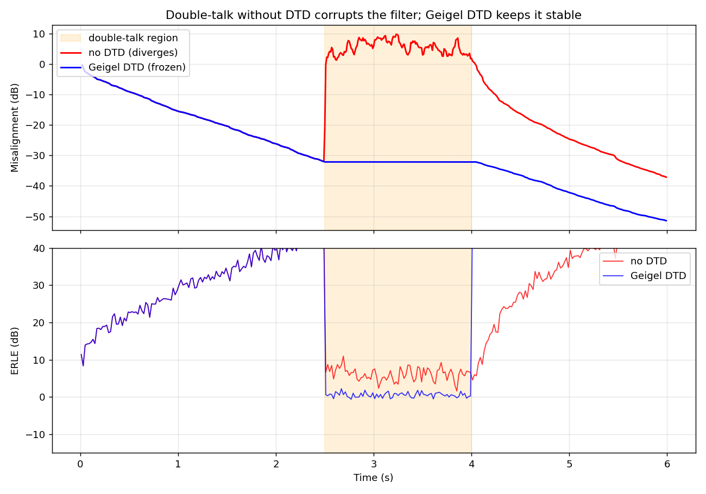
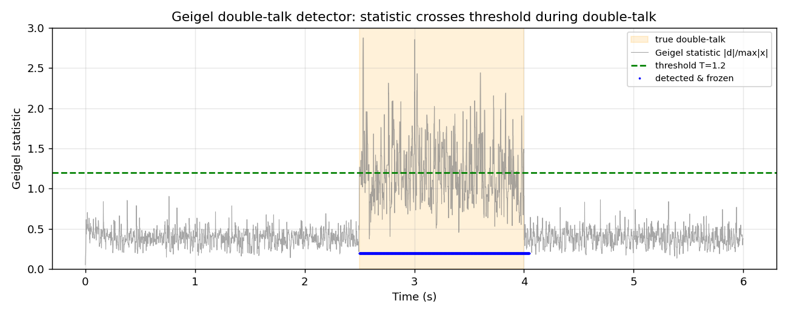
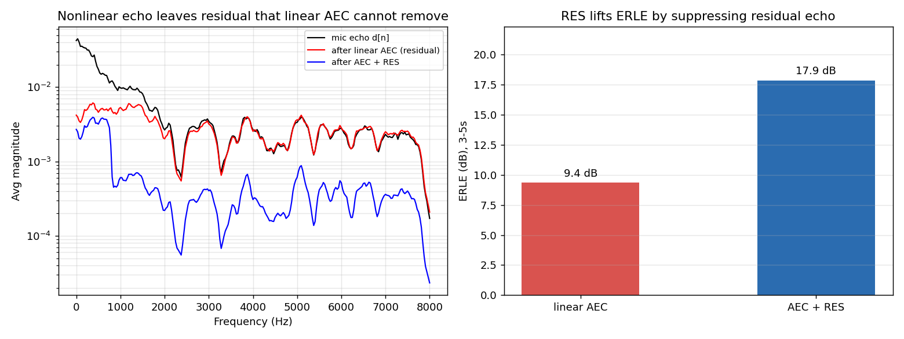

# 系列 2B · AEC 工程篇 —— 双讲、发散与非线性残留

> 前置：本篇接着 [系列 2A](./series-2A.md) 往下走。2A 里我们把回声路径建模成一个待辨识的 FIR 系统，用 NLMS 让滤波器 $\vec{w}$ 临摹这堵「回声墙」，误差 $e[n] = d[n] - \vec{w}^{\top}\vec{x}[n]$ 既是消回声输出、又是学习信号——理想情况下它工作得很漂亮。这一篇专门讲**理想崩塌之后**的事：真人会同时说话，扬声器不是理想的线性器件。

---

## 0. TL;DR + 解决什么问题

系列 2A 那套 AEC 有两个「实验室假设」，一进真实会议室就被打破：

1. **假设只有远端在说话**。可现实里双方经常同时开口（double-talk，双讲）。这时误差 `e[n]` 里混进了近端语音，NLMS 会把「近端语音」误当成「没消干净的回声」，拼命调整滤波器去消它——结果把学好的墙**学歪**，甚至发散。
2. **假设回声是 `x[n]` 的线性卷积**。可扬声器/功放会削波失真，真实回声里带上了 `x[n]` 的谐波成分。线性滤波器再准也复制不出这些非线性分量，于是留下**原理性的残留回声**。

本篇讲清三件事，都配了可跑代码和真实配图：

- 双讲为什么会让滤波器学歪/发散，怎么用**双讲检测（Geigel 算法）**在双讲期间**冻结更新**（`μ→0`）保住滤波器。
- 发散的数学直觉，以及步长限制、能量监控这些**防发散护栏**。
- 扬声器非线性为什么让线性 AEC「永远消不干净」，为什么必须补一级**后置残余回声抑制（RES）**，它的频域增益公式长什么样。

> ⭐ **一句话结论**：线性 AEC 只负责消掉「能被线性模型解释的那部分回声」；双讲检测保护它在学习期不被近端语音带偏，残余回声抑制（RES）负责收拾它原理上够不着的非线性残留。三者合起来才是能上线的 AEC。

---

## 1. 工程痛点引入：一插话，对方那边就漏回声

先讲个会议室里天天发生的故事。

你和远端同事 A 通话，2A 那套 AEC 跑得好好的——A 的声音从你扬声器出来、绕回你麦克风，被滤波器干净地减掉了，A 那头很安静。

然后你俩**同时开口**。就在这零点几秒里，A 突然听见自己的声音「噗」地漏了回来，甚至还带着一声轻微的破音。等你们错开、只剩一个人说话，一两秒后又恢复正常。

更糟的情况：双讲结束后，回声**没有**立刻恢复干净，而是持续漏了好几秒才慢慢压回去。听感上就像 AEC「被打了一拳，缓了半天才回过神」。

这两个现象背后是同一个根子——**双讲期间滤波器被带偏了**：

```
   只有远端说话              双方同时说话                只有远端说话
 (single-talk)   ───▶   (double-talk)      ───▶     (single-talk)
 滤波器安静收敛          e[n] 混进近端语音            滤波器已被学歪，
 回声消得干净           滤波器误把近端当回声去消        要花时间重新收敛
```

还有一类痛点跟双讲无关，是**器件**带来的：你把音量开大，扬声器进入削波区，回声听起来「毛毛的、发闷」。这时哪怕没有双讲、滤波器也收敛得很好，回声就是消不彻底，总留一层「毛边」。这就是非线性残留，本篇第 4 部分的实验三会专门复现它。

---

## 2. 直觉解释：镜子被劣质样本教坏了

沿用 2A 的比喻：滤波器 $\vec{w}$ 是一面照着「回声墙」临摹的镜子，靠误差 `e[n]` 这个「老师」一点点磨准。

**双讲为什么把镜子教坏？**

回想这面镜子的学习逻辑：它假定「麦克风信号里除了回声，剩下的都是我没消干净的误差，我得继续调整去消掉」。这个假定在**只有远端说话**时成立——那时麦克风里确实只有回声（加一点底噪）。

可一旦近端也开口，麦克风信号里多了一大块**近端语音**。这块语音和远端参考 `x[n]` 毫无关系，镜子却依然天真地以为「这是没消干净的回声」，于是拼命扭曲自己去「消掉」这块根本消不掉的东西。近端语音能量越大，镜子被扭得越狠。

> 打个比方：这就像一个临摹高手，本来照着真墙画得很像，突然有人往他的参照物上泼了一桶不相干的颜料（近端语音）。他不知道那是干扰，还当成真墙的新细节，照着把画改得面目全非。

**那怎么办？**——最朴素也最有效的办法：**发现有人泼颜料，就先停笔**。

这就是**双讲检测 + 冻结更新**：一旦检测到近端也在说话，立刻把步长 `μ` 降到 0，滤波器**停止学习、只做消除**（继续用当前系数减回声，但不再更新它们）。等双讲结束、麦克风里重新只剩回声，再恢复学习。停笔期间画没被改坏，双讲一过马上就能接着用。

> ⭐ **结论**：双讲检测的作用不是「消得更干净」，而是**在最容易学坏的时刻按下暂停键**，保住已经学好的滤波器。宁可这一小段不学习，也不能让它被近端语音带跑。

**非线性残留又是另一回事。** 镜子这门手艺有个天生的局限：它只会「线性临摹」——延迟、缩放、叠加。可扬声器一旦削波失真，真实回声里就掺进了 `x[n]` 的谐波（原信号里压根没有的新频率成分）。这些成分不是 `x[n]` 的任何线性组合，镜子无论怎么磨都画不出来。于是必须在 AEC 后面再挂一道「滤水器」——**残余回声抑制（RES）**：按频段判断「这一格里剩下的还像不像回声」，像就把增益拧小，把那层毛边滤掉。

---

## 3. 数学推导

### 3.1 双讲如何污染 NLMS 的梯度

先把 2A 的记号接过来。麦克风信号（沿用 2A 3.1）：

```
d[n] = y[n] + s[n] + v[n]
```

- `y[n]`：回声 = `(h * x)[n]`，远端 `x[n]` 经回声路径 `h` 卷积；
- `s[n]`：近端语音（我们想留下的）；
- `v[n]`：底噪。

误差信号：

```
e[n] = d[n] − w^Tx[n] = (y[n] − ŷ[n]) + s[n] + v[n]
```

**人话翻译**：误差里其实有三块——「没消干净的回声」`y[n]−ŷ[n]`、「近端语音」`s[n]`、「底噪」`v[n]`。AEC 想压小的只是第一块，可它看到的是三块之和。

NLMS 的更新量（来自系列 1）：

```
w ← w + μ · e[n] · x[n] / (||x[n]||² + δ)
```

**人话翻译**：滤波器往「误差 × 当前远端输入」这个方向挪一步，步子大小按远端能量归一化。它的**潜台词是「误差全都是回声引起的」**，所以拿误差去乘远端输入当修正方向。

问题就出在这个潜台词。把 `e[n]` 拆开代进去，更新方向里混进了这么一项：

```
μ · s[n] · x[n] / (||x[n]||² + δ)      ← 近端语音带来的"假梯度"
```

**人话翻译**：只有远端说话时 `s[n]=0`，这项为零，更新是干净的。可双讲时 `s[n]` 是一大块和 $\vec{x}[n]$ 无关的信号，它和远端输入相乘，会给出一个**方向完全随机、幅度还很大**的「假梯度」，把滤波器往错误方向猛推。

**关键洞察**：健康的自适应依赖「误差与近端语音无关」这个前提。双讲直接违反它——`s[n]` 是误差里最大的一块，却和真实回声路径毫无关系。滤波器被这块噪声牵着走，就会失调（misalignment）飙升，严重时发散。

> ⭐ **结论**：双讲的危害不是「暂时消不干净」，而是它会**污染学习过程本身**，把之前辛苦收敛的系数改坏。近端语音相对回声越强（近端-回声比越高），假梯度越猛，学歪越快。

### 3.2 Geigel 双讲检测：一个便宜又好使的判据

要冻结更新，先得**判断此刻是不是双讲**。Geigel 算法用一个朴素观察：近端一说话，麦克风信号 `d[n]` 的幅度会明显超过「它所能对应的最大回声」。而回声幅度上界由最近一段远端信号的幅度决定。判据是：

```
          max( |d[n]|,|d[n-1]|,…,|d[n-L+1]| )
Geigel:   ─────────────────────────────────────   >  T   ⟹  判为双讲
          max( |x[n]|,|x[n-1]|,…,|x[n-L+1]| )
```

**人话翻译**：分子是「近端麦克风最近这一小段有多响」，分母是「远端参考最近这一段有多响」。回声总是被房间衰减过的（比远端弱），所以只有回声时这个比值不会太大；一旦近端插话，麦克风瞬间变响，比值冲过阈值 `T`，就判定「有人插话了」。`T` 由回声路径的最大衰减决定，工程上常取 2 附近（本篇代码因仿真回声较强、并对分子做了短时包络平滑，标定到 `T=1.2`）。

检测到双讲后，把步长设为 0：

```
μ_eff[n] = 0          若 Geigel 判为双讲（含一段迟滞保持期 hold）
μ_eff[n] = μ          否则
```

**人话翻译**：一旦发现插话，这一步不学（只用老系数减回声）；而且为防止判据抖动导致「学一下停一下」，检测到之后再**多冻结一小段**（迟滞 hold），等确认双讲真的结束了再恢复学习。

### 3.3 发散的直觉与防护护栏

即便没有双讲，NLMS 自己也可能发散。系列 1 讲过收敛条件大致是 `0 < μ < 2`（归一化后）。工程里真正让它炸的，往往是**归一化分母被一段极小能量的远端信号「打穿」**：

```
w ← w + μ · e[n] · x[n] / (||x[n]||² + δ)
                              └── 若 ||x[n]||² ≈ 0，这一步会被放大到爆
```

**人话翻译**：远端突然静音时 $\|\vec{x}[n]\|^{2}$ 趋近 0，要是正则项 `δ` 太小，除法结果爆炸，一步就能把系数顶上天。护栏有三道：

- **正则项 `δ` 要够大**：给分母垫一个底，远端安静时更新自然趋近 0（既防除零，也顺带实现「远端不说话就别乱学」）。
- **步长上限**：把 `μ` 限制在安全区间（如 `≤ 1`），别贪快。收敛慢一点，也比发散强。
- **能量监控 / 权重范数看门狗**：实时监控 $\|\vec{w}\|$。真实回声路径能量有界，$\|\vec{w}\|$ 若异常膨胀，就是学歪的信号——触发时可冻结更新、甚至回退到上一个稳定快照或直接重置。

> 🔥 **面试追问**：NLMS 里那个 `δ`（正则项）到底在防什么？
> 表面看是防止分母为零。更深一层，它是**远端静音期的护栏**：远端不说话时 $\|\vec{x}[n]\|^{2}→0$，若没有 `δ`，任何一点底噪都会被归一化放大成巨大的更新量，把滤波器顶飞。`δ` 让分母有个下限，远端安静时更新量自动趋近 0——等价于「没有可靠的远端激励，就别学」。它和双讲冻结是一对孪生护栏：一个管「远端太弱别学」，一个管「近端太强别学」。

### 3.4 非线性残留与后置抑制（RES）

线性 AEC 的模型是 $ŷ[n] = \vec{w}^{\top}\vec{x}[n]$——回声被假定为 `x[n]` 的线性卷积。可扬声器实际发出的是失真版 `g(x[n])`（`g` 是削波等非线性），真实回声是：

```
y[n] = ( h * g(x) )[n]        而滤波器只能拟合  ( h * x )[n]
```

**人话翻译**：真墙加工的是「被扬声器揉过的、长了谐波的信号」，而镜子手里只有「干净的原始信号」去临摹。`g(x)` 里那些原信号没有的新频率成分，`x` 的任何线性组合都凑不出来——这就是**原理性残留**，不是滤波器没学够，是模型天生够不着。

对付这层残留，转到**频域**做后置抑制。设 AEC 之后的残留误差谱为 `E(t,f)`，估计其中「还有多少是残余回声」`R̂(t,f)`，用一个维纳式增益把它压下去：

```
G(t,f) = max( 1 − β · |R̂(t,f)|² / |E(t,f)|² ,  G_min )
E_res(t,f) = G(t,f) · E(t,f)
```

**人话翻译**：逐个时频格子问一句「这格里剩下的，有多大比例像回声？」。像回声的比例（`|R̂|²/|E|²`）越高，增益 `G` 越接近 0，压得越狠；越像近端语音（残留里回声占比小），`G` 越接近 1，尽量原样保留。`β` 是过抑制因子（压狠一点更干净、但更伤近端），`G_min` 是增益地板（别把某个频段彻底掐死，留一线免得听感发死）。这和系列 3A 的维纳滤波是同一套思想，只是这里要压的「噪声」换成了残余回声。

那 `R̂(t,f)` 从哪来？本篇代码用一个够用的工程估计：假定残余回声幅度正比于远端幅度谱，`|R̂(t,f)| = leak(f)·|X(t,f)|`，其中泄漏系数 `leak(f)` 在「只有远端、没有近端」的帧上，用 `|E|/|X|` 的中位数在线估出来。

> 🔥 **面试追问**：RES 会不会把近端语音也一起削掉？
> 会，这正是 RES 最大的代价与调参核心。增益 `G` 是「一刀切」作用在整格频谱上的——它分不清这一格里 `|E|` 到底是残余回声还是近端语音，只按「像不像回声」下手。双讲时近端和残余回声混在同一格，压回声必然连带削近端，导致近端语音发闷、有起伏（俗称「被 RES 咬掉一口」）。所以工程上 `β` 和 `G_min` 要保守，`R̂` 的估计要尽量准，并常与双讲检测联动：确认是双讲时放松抑制、优先保近端。这是**回声残留**与**近端保真**之间的经典权衡，没有免费的午餐。

---

## 4. 代码实战

配套脚本 本文文末《完整可跑代码》 在 2A 的 NLMS 基础上做三件事，全部实际跑通、配图真实生成。核心的 NLMS + Geigel 循环如下（完整版见脚本）：

```python
def nlms_aec(x, d, L=256, mu=0.5, delta=1e-3,
             use_dtd=False, geigel_thr=1.2, hold=800, h_ref=None):
    n = len(x)
    w = np.zeros(L)                                   # [L] 抽头，从零起步
    e = np.zeros(n)                                   # [n] 误差
    dtd_flag = np.zeros(n)                            # [n] 是否判为双讲

    # Geigel 判据: stat = max(|d| 短时包络) / max(|x| 最近 L 点)
    d_env = maximum_filter1d(np.abs(d), size=GEIGEL_ENV)              # [n]
    run_max = maximum_filter1d(np.abs(x), size=L, origin=(L-1)//2)    # [n]
    geigel_stat = d_env / (run_max + 1e-9)                           # [n]

    freeze_counter = 0                                # 冻结迟滞倒计时
    for k in range(L, n):
        xk = x[k-L+1:k+1][::-1]                       # [L] 参考帧(最新在前)
        y_hat = np.dot(w, xk)                         # 标量：估计回声
        ek = d[k] - y_hat                             # 标量：误差
        e[k] = ek

        update = True
        if use_dtd:
            if geigel_stat[k] > geigel_thr:           # 触发双讲
                freeze_counter = hold                 # 重置迟滞窗
            if freeze_counter > 0:
                update = False                        # 冻结更新: μ→0
                dtd_flag[k] = 1.0
                freeze_counter -= 1

        if update:
            norm = np.dot(xk, xk) + delta             # 标量：归一化分母(含护栏 δ)
            w = w + mu * ek * xk / norm               # [L] NLMS 更新
    ...
```

**失调（misalignment）**是本篇的核心度量，直接反映「镜子临摹得准不准」：

```
misalignment = 10·log10( ||w − h_ref||² / ||h_ref||² )   (dB)
```

**人话翻译**：把学到的滤波器 $\vec{w}$ 和真实回声路径 `h_ref` 相减，看差多少。越负说明学得越像（-30 dB 表示误差能量只有真路径的千分之一）；由负转正，就是**学歪/发散**的铁证。

### 实验一 & 二：双讲让滤波器发散，Geigel 检测救回来

构造一段 6 秒信号：远端全程说话，近端只在 **2.5s~4.0s** 插话（且比回声响约 10 dB，模拟「人就在自己麦跟前」）。对比「不做双讲检测」和「Geigel 检测 + 冻结更新」两条曲线。



脚本实测输出：

```
[实验一/二 双讲]
  双讲前失调(2.0-2.5s): 无DTD = -29.0 dB | 有DTD = -29.3 dB (收敛一致)
  双讲中失调(2.5-4.0s): 无DTD = +5.3 dB | 有DTD = -32.1 dB (无DTD学歪)
  双讲后失调(4.5-6s):   无DTD = -27.5 dB | 有DTD = -44.5 dB
  双讲检出率 = 100.0% | 单讲误检率 = 0.0%
```

读图重点：双讲**开始前**两条曲线完全重合（都收敛到 -29 dB，证明差异纯粹来自双讲处理）；双讲**期间**，无 DTD 那条（红）从 -29 dB 一路冲到 **+5 dB**——正的失调意味着 $\vec{w}$ 离真路径比「全零初始」还远，彻底学歪了；而 Geigel（蓝）因为冻结了更新，稳稳停在 -32 dB。双讲结束后，红线要花一两秒重新收敛（这就是第 1 节「漏回声缓好几秒」的由来），蓝线则毫发无伤、继续精进。

再看 Geigel 判据本身工作得怎么样：



统计量在单讲段贴着低位、在双讲段整体抬到阈值线以上，分离得很干净——这正是「近端就在麦跟前、比回声响」这个物理前提带来的红利。

### 实验三：扬声器非线性残留，RES 收拾残局

让远端信号先过一道软削波 `tanh(drive·x)/drive`（模拟扬声器/功放失真）再经房间，得到带谐波的真实回声。此时**没有双讲**，滤波器收敛得很好，但因为参考只有干净的线性 `x`，谐波成分它够不着。收敛后（3~5s）对比 AEC 前 / 线性 AEC 后 / 再加 RES 后：



脚本实测输出：

```
[实验三 非线性 + RES]
  线性 AEC ERLE = 9.4 dB | +RES ERLE = 17.9 dB | 提升 +8.5 dB
```

线性 AEC 只做到 9.4 dB ERLE——不是它没收敛，而是非线性残留卡住了天花板（对比实验一里纯线性回声能到 -29 dB 失调、40+ dB ERLE，差距一目了然）。补一级频域 RES，ERLE 直接抬了 8.5 dB。这就是为什么生产级 AEC 几乎都是「线性 AEC + 非线性后处理」的两级结构。

> ⭐ **结论**：线性 AEC 与 RES 各管一段——线性部分负责消掉能被线性模型解释的主体回声（消得多、且不伤近端），RES 负责压制线性部分原理上够不着的非线性残留（代价是可能伤近端）。指望单靠加长滤波器、调大步长去消非线性残留，是南辕北辙。


<!-- AUTO-EMBED:BEGIN 完整代码 由 scripts/embed_code.py 生成，勿手改 -->
### 完整可跑代码

> 以下为本篇配套的完整脚本，已实际执行通过。**直接复制保存为 `series-2B.py`，`python series-2B.py` 即可复现上面所有配图**（需 `numpy` / `scipy` / `matplotlib`）。

```python
#!/usr/bin/env python3
# -*- coding: utf-8 -*-
"""系列 2B · AEC 工程篇 —— 双讲、发散与非线性残留 · 配套代码

本脚本在系列 2A 的 NLMS 回声消除基础上，演示三件工程上绕不开的事：

  实验一  双讲(double-talk)会污染误差信号，NLMS 若不做双讲检测就会"学歪"→
          失调(misalignment)上升、ERLE 崩塌；
  实验二  用 Geigel 算法做双讲检测，检测到双讲就冻结更新(μ→0)，滤波器恢复稳定；
  实验三  扬声器软削波(soft-clipping)非线性使真实回声 != 线性卷积，线性 AEC 存在
          原理性残留；再挂一级频域残余回声抑制(RES, 维纳式增益)把残留压下去。

运行:
    python code/series-2B.py
产物:
    figures/s2b_divergence.png
    figures/s2b_geigel.png
    figures/s2b_res.png
"""
import os
from pathlib import Path

import numpy as np
import matplotlib
matplotlib.use("Agg")  # 无显示环境后端，必须在 import pyplot 前设置
import matplotlib.pyplot as plt
from scipy.signal import lfilter, stft, istft
from scipy.ndimage import maximum_filter1d

GEIGEL_ENV = 80  # Geigel 分子的短时包络窗(样本)，5ms@16k，抗单点抖动

# ----------------------------------------------------------------------------
# 全局配置
# ----------------------------------------------------------------------------
FS = 16000                       # 采样率 (Hz)，全系列默认 16k
RNG = np.random.default_rng(2024)  # 固定随机种子，保证配图可复现
FIG_DIR = Path(__file__).resolve().parent.parent / "figures"
FIG_DIR.mkdir(parents=True, exist_ok=True)


# ----------------------------------------------------------------------------
# 信号与房间脉冲响应生成工具
# ----------------------------------------------------------------------------
def speech_like(n_samples, seed, active_mask=None):
    """生成"类语音"信号：有色噪声 + 音节起伏包络。

    仅用于教学演示 ERLE / 失调的动态行为，不追求真实语音质量。

    返回 sig  # [n_samples] float64
    """
    rng = np.random.default_rng(seed)
    white = rng.standard_normal(n_samples)                 # [n_samples]
    # AR(1) 着色，让频谱偏低频，像浊音
    colored = lfilter([1.0], [1.0, -0.95], white)          # [n_samples]
    # 音节包络：把慢变随机门限平滑成一段段"说话/停顿"
    gate = (rng.standard_normal(n_samples) > 0.3).astype(float)  # [n_samples]
    env = lfilter(np.ones(1600) / 1600.0, [1.0], gate)     # [n_samples] 100ms 平滑
    sig = colored * env                                    # [n_samples]
    if active_mask is not None:
        sig = sig * active_mask                            # 只在指定区间有能量
    # 归一化到单位标准差，方便后面按 dB 调能量
    sig = sig / (sig.std() + 1e-12)
    return sig


def make_rir(length, seed=7, direct_tap=12):
    """生成一条"有主峰 + 衰减混响尾"的房间脉冲响应(回声路径 h)。

    主峰(直达/最强反射)集中在 direct_tap 处，幅度为 1；后面挂一条指数衰减的
    随机混响尾。有明显主峰，Geigel 那种"看幅度比"的双讲判据才站得住脚。

    返回 h  # [length] float64，峰值归一到 1
    """
    rng = np.random.default_rng(seed)
    h = np.zeros(length)                                   # [length]
    idx = np.arange(length)                                # [length]
    tail = rng.standard_normal(length) * np.exp(-idx / (length / 5.0)) * 0.35  # [length]
    tail[:direct_tap] = 0.0                                 # 主峰之前无能量(纯时延)
    h = h + tail
    h[direct_tap] = 1.0                                     # 直达主峰
    h = h / np.max(np.abs(h))                               # 峰值归一到 1
    return h


def framewise_erle(d, e, frame=320):
    """分帧计算 ERLE = 10log10( E[d^2] / E[e^2] )，单位 dB。

    d  # [n] 麦克风信号(含回声)
    e  # [n] AEC 误差(残留)
    返回 (t_sec[frames], erle_db[frames])
    """
    n = min(len(d), len(e))
    n_frames = n // frame
    d = d[:n_frames * frame].reshape(n_frames, frame)      # [F, frame]
    e = e[:n_frames * frame].reshape(n_frames, frame)      # [F, frame]
    p_d = np.sum(d ** 2, axis=1) + 1e-12                   # [F]
    p_e = np.sum(e ** 2, axis=1) + 1e-12                   # [F]
    erle = 10.0 * np.log10(p_d / p_e)                      # [F]
    t = (np.arange(n_frames) * frame + frame / 2) / FS     # [F] 帧中心时间(s)
    return t, erle


# ----------------------------------------------------------------------------
# NLMS 自适应滤波器（可选 Geigel 双讲检测冻结更新）
# ----------------------------------------------------------------------------
def nlms_aec(x, d, L=256, mu=0.5, delta=1e-3,
             use_dtd=False, geigel_thr=1.2, hold=800,
             h_ref=None, rec_hop=160):
    """NLMS 回声消除，附可选 Geigel 双讲检测。

    x        # [n] 远端参考(扬声器数字信号)
    d        # [n] 麦克风采集(回声 + 可能的近端语音 + 噪声)
    L        # 滤波器抽头数
    mu       # 归一化步长
    delta    # 归一化分母正则项，防止除零
    use_dtd  # 是否启用 Geigel 双讲检测并冻结更新
    geigel_thr  # Geigel 判据阈值 T
    hold     # 检测到双讲后额外保持冻结的样本数(迟滞，防抖)
    h_ref    # [L] 真实回声路径(补零到 L)，用于计算失调；None 则不记录
    rec_hop  # 每隔多少样本记录一次失调/权重范数

    返回 dict:
        e            # [n] 误差
        dtd_flag     # [n] 每样本是否判为双讲(0/1)
        geigel_stat  # [n] Geigel 判决统计量
        rec_t        # [K] 记录点时间(s)
        misalign_db  # [K] 失调(dB)，需 h_ref
        wnorm        # [K] 权重范数
    """
    n = len(x)
    w = np.zeros(L)                                        # [L] 抽头，从零起步
    e = np.zeros(n)                                        # [n]
    dtd_flag = np.zeros(n)                                 # [n]

    # Geigel 判据: stat[k] = max(|d[k-W..k]|) / max(|x[k-L+1..k]|)
    # 分子用短时包络(而非单点 |d[k]|)抗抖动，分母是最近 L 个远端样本的幅度峰值。
    d_env = maximum_filter1d(np.abs(d), size=GEIGEL_ENV)   # [n] 近端短时包络
    run_max = maximum_filter1d(np.abs(x), size=L, origin=(L - 1) // 2)  # [n]
    geigel_stat = d_env / (run_max + 1e-9)                # [n]

    rec_t, misalign_db, wnorm = [], [], []
    freeze_counter = 0                                     # 冻结迟滞倒计时

    for k in range(L, n):
        xk = x[k - L + 1:k + 1][::-1]                     # [L] 参考帧(最新样本在前)
        y_hat = np.dot(w, xk)                             # 标量：估计回声
        ek = d[k] - y_hat                                 # 标量：误差
        e[k] = ek

        update = True
        if use_dtd:
            if geigel_stat[k] > geigel_thr:              # 触发双讲
                freeze_counter = hold                    # 重置迟滞窗
            if freeze_counter > 0:
                update = False                           # 冻结更新: μ→0
                dtd_flag[k] = 1.0
                freeze_counter -= 1

        if update:
            norm = np.dot(xk, xk) + delta                # 标量：参考帧能量
            w = w + mu * ek * xk / norm                  # [L] NLMS 更新

        if h_ref is not None and (k % rec_hop == 0):
            err_vec = w - h_ref                          # [L]
            mis = 10.0 * np.log10(
                (np.dot(err_vec, err_vec) + 1e-12)
                / (np.dot(h_ref, h_ref) + 1e-12))
            rec_t.append(k / FS)
            misalign_db.append(mis)
            wnorm.append(np.sqrt(np.dot(w, w)))

    return {
        "e": e,
        "dtd_flag": dtd_flag,
        "geigel_stat": geigel_stat,
        "rec_t": np.array(rec_t),
        "misalign_db": np.array(misalign_db),
        "wnorm": np.array(wnorm),
    }


# ----------------------------------------------------------------------------
# 实验一 & 二：双讲导致发散，Geigel 检测冻结更新恢复稳定
# ----------------------------------------------------------------------------
def experiment_doubletalk():
    """构造含双讲段的场景，对比 无DTD / 有DTD 两条曲线。"""
    dur = 6.0
    n = int(dur * FS)                                     # [标量] 总样本数
    L, P = 256, 128                                       # 滤波器长 / 回声路径长

    # 双讲区间: 2.5s ~ 4.0s
    dt_start, dt_end = int(2.5 * FS), int(4.0 * FS)
    near_mask = np.zeros(n)                               # [n]
    near_mask[dt_start:dt_end] = 1.0

    # 远端全程活跃
    x = speech_like(n, seed=11)                          # [n]
    # 回声路径 + 线性回声
    h = make_rir(P, seed=7)                              # [P] 带主峰的房间响应
    ECHO = 0.35                                          # 回声路径总增益(相对远端)
    echo = lfilter(h, 1.0, x) * ECHO                     # [n] 线性回声
    # 近端语音仅在双讲区间，且比回声明显更响(近端就在自己麦跟前，约 +10dB)——
    # 这正是 Geigel"看幅度比"判据成立的物理前提。
    near = speech_like(n, seed=29, active_mask=near_mask)  # [n]
    near *= 3.0 * echo[dt_start:dt_end].std() / (near[dt_start:dt_end].std() + 1e-12)
    # 底噪
    noise = 0.001 * RNG.standard_normal(n)               # [n]
    d = echo + near + noise                              # [n] 麦克风信号

    # 真实回声路径补零到 L，用于计算失调
    h_ref = np.zeros(L)                                  # [L]
    h_ref[:P] = h * ECHO                                 # w 应收敛到 ECHO*h

    res_no = nlms_aec(x, d, L=L, mu=0.5, use_dtd=False, h_ref=h_ref)
    res_dtd = nlms_aec(x, d, L=L, mu=0.5, use_dtd=True,
                       geigel_thr=1.2, hold=800, h_ref=h_ref)

    t_no, erle_no = framewise_erle(d, res_no["e"])
    t_dtd, erle_dtd = framewise_erle(d, res_dtd["e"])

    # ---- 图1: 失调 + ERLE 对比 ----
    fig, (ax1, ax2) = plt.subplots(2, 1, figsize=(10, 7), sharex=True)
    dt0, dt1 = dt_start / FS, dt_end / FS

    ax1.axvspan(dt0, dt1, color="orange", alpha=0.15, label="double-talk region")
    ax1.plot(res_no["rec_t"], res_no["misalign_db"], "r-", lw=1.6,
             label="no DTD (diverges)")
    ax1.plot(res_dtd["rec_t"], res_dtd["misalign_db"], "b-", lw=1.6,
             label="Geigel DTD (frozen)")
    ax1.set_ylabel("Misalignment (dB)")
    ax1.set_title("Double-talk without DTD corrupts the filter; Geigel DTD keeps it stable")
    ax1.legend(loc="upper left")
    ax1.grid(True, alpha=0.3)

    ax2.axvspan(dt0, dt1, color="orange", alpha=0.15)
    ax2.plot(t_no, erle_no, "r-", lw=1.0, alpha=0.8, label="no DTD")
    ax2.plot(t_dtd, erle_dtd, "b-", lw=1.0, alpha=0.8, label="Geigel DTD")
    ax2.set_ylabel("ERLE (dB)")
    ax2.set_xlabel("Time (s)")
    ax2.set_ylim(-15, 40)
    ax2.legend(loc="upper right")
    ax2.grid(True, alpha=0.3)

    fig.tight_layout()
    fig.savefig(FIG_DIR / "s2b_divergence.png", dpi=130)
    plt.close(fig)

    # ---- 图2: Geigel 判决统计量 + 检测标志 ----
    t_axis = np.arange(n) / FS                            # [n]
    fig2, ax = plt.subplots(figsize=(10, 4))
    ax.axvspan(dt0, dt1, color="orange", alpha=0.15, label="true double-talk")
    # 抽稀绘制，避免图太密
    step = 20
    ax.plot(t_axis[::step], res_dtd["geigel_stat"][::step], color="gray",
            lw=0.6, alpha=0.7, label="Geigel statistic |d|/max|x|")
    ax.axhline(1.2, color="green", ls="--", lw=1.5, label="threshold T=1.2")
    # 检测到双讲的样本，画在底部
    det = res_dtd["dtd_flag"] > 0.5
    ax.plot(t_axis[det][::step], np.full(det.sum(), 0.2)[::step], "b.",
            ms=2, label="detected & frozen")
    ax.set_ylim(0, 3)
    ax.set_xlabel("Time (s)")
    ax.set_ylabel("Geigel statistic")
    ax.set_title("Geigel double-talk detector: statistic crosses threshold during double-talk")
    ax.legend(loc="upper right", fontsize=8)
    ax.grid(True, alpha=0.3)
    fig2.tight_layout()
    fig2.savefig(FIG_DIR / "s2b_geigel.png", dpi=130)
    plt.close(fig2)

    # 控制台摘要
    def tail_mean(t, v, lo, hi):
        m = (t >= lo) & (t <= hi)
        return float(np.mean(v[m])) if m.any() else float("nan")

    print("[实验一/二 双讲]")
    print(f"  双讲前失调(2.0-2.5s): 无DTD = {tail_mean(res_no['rec_t'], res_no['misalign_db'], 2.0, 2.5):+.1f} dB"
          f" | 有DTD = {tail_mean(res_dtd['rec_t'], res_dtd['misalign_db'], 2.0, 2.5):+.1f} dB (收敛一致)")
    print(f"  双讲中失调(2.5-4.0s): 无DTD = {tail_mean(res_no['rec_t'], res_no['misalign_db'], 2.5, 4.0):+.1f} dB"
          f" | 有DTD = {tail_mean(res_dtd['rec_t'], res_dtd['misalign_db'], 2.5, 4.0):+.1f} dB (无DTD学歪)")
    print(f"  双讲后失调(4.5-6s):   无DTD = {tail_mean(res_no['rec_t'], res_no['misalign_db'], 4.5, 6.0):+.1f} dB"
          f" | 有DTD = {tail_mean(res_dtd['rec_t'], res_dtd['misalign_db'], 4.5, 6.0):+.1f} dB")
    print(f"  双讲检出率 = {(res_dtd['dtd_flag'][int(2.5*FS):int(4.0*FS)] > 0.5).mean():.1%}"
          f" | 单讲误检率 = {(res_dtd['dtd_flag'][:int(2.5*FS)] > 0.5).mean():.1%}")


# ----------------------------------------------------------------------------
# 实验三：扬声器非线性 → 线性 AEC 残留 → 频域 RES 抑制
# ----------------------------------------------------------------------------
def residual_suppression(e, x, fs=FS, nperseg=512, noverlap=384,
                         gain_min=0.1, overest=1.4):
    """频域残余回声抑制(RES)：维纳式增益压残留。

    思路：假设残余回声幅度谱正比于远端幅度谱，
          |R_est(t,f)| = leak(f) * |X(t,f)|，
          leak(f) 从"远端活跃"帧上以 |E|/|X| 的中位数在线估计。
          维纳式增益  G = max(1 - overest * |R_est|^2 / |E|^2 , gain_min)。

    e  # [n] 线性 AEC 残留误差
    x  # [n] 远端参考
    返回 e_res  # [n] RES 之后的残留
    """
    f, t, E = stft(e, fs=fs, nperseg=nperseg, noverlap=noverlap)  # E [F, T]
    _, _, X = stft(x, fs=fs, nperseg=nperseg, noverlap=noverlap)  # X [F, T]
    magE = np.abs(E)                                     # [F, T]
    magX = np.abs(X)                                     # [F, T]

    # 逐频点估计泄漏系数 leak(f)：远端有能量的帧上取 |E|/|X| 中位数
    active = magX > (0.1 * magX.max())                   # [F, T] 远端活跃掩码
    leak = np.ones(magE.shape[0])                        # [F]
    for fi in range(magE.shape[0]):
        m = active[fi]
        if m.sum() > 5:
            leak[fi] = np.median(magE[fi, m] / (magX[fi, m] + 1e-9))
    R_est = leak[:, None] * magX                         # [F, T] 残余回声幅度估计

    # 维纳式增益：残留越像回声(|E|≈|R_est|)压得越狠，越像近端(|E|>>|R_est|)越保留
    gain = 1.0 - overest * (R_est ** 2) / (magE ** 2 + 1e-12)  # [F, T]
    gain = np.clip(gain, gain_min, 1.0)                  # [F, T]

    E_res = gain * E                                     # [F, T] 增益作用于复数谱
    _, e_res = istft(E_res, fs=fs, nperseg=nperseg, noverlap=noverlap)  # [~n]
    e_res = e_res[:len(e)]                               # 对齐长度
    if len(e_res) < len(e):
        e_res = np.pad(e_res, (0, len(e) - len(e_res)))
    return e_res


def experiment_nonlinear():
    """扬声器软削波 → 线性 AEC 残留 → RES 抑制。"""
    dur = 5.0
    n = int(dur * FS)
    L, P = 256, 128

    x = speech_like(n, seed=101)                         # [n] 远端数字信号(AEC 唯一可用参考)
    h = make_rir(P, seed=7)                              # [P] 回声路径

    # 扬声器/功放非线性：软削波(soft clipping)。
    # 把信号推到较高电平，让 tanh 引入明显谐波失真。
    drive = 3.0
    x_loud = np.tanh(drive * x) / drive                  # [n] 扬声器实际发声(失真)
    echo = lfilter(h, 1.0, x_loud) * 0.5                 # [n] 真实回声 = 失真信号过房间
    noise = 0.001 * RNG.standard_normal(n)               # [n]
    d = echo + noise                                     # [n] 单讲(仅回声)，便于量化残留

    # 线性 AEC：参考只有线性的 x，学不到非线性成分
    res = nlms_aec(x, d, L=L, mu=0.5, use_dtd=False)
    e_lin = res["e"]                                     # [n] 线性 AEC 残留

    # 后置 RES
    e_res = residual_suppression(e_lin, x)               # [n]

    # 收敛后段(3-5s)做量化
    seg = slice(int(3.0 * FS), n)
    def erle_seg(err):
        return 10.0 * np.log10(
            (np.sum(d[seg] ** 2) + 1e-12) / (np.sum(err[seg] ** 2) + 1e-12))
    erle_lin = erle_seg(e_lin)
    erle_res = erle_seg(e_res)

    # ---- 图3: 平均幅度谱 + ERLE 对比 ----
    def avg_spec(sig):
        f, _, S = stft(sig[seg], fs=FS, nperseg=512, noverlap=384)  # [F, T]
        return f, np.mean(np.abs(S), axis=1)             # [F]
    f_axis, sp_d = avg_spec(d)
    _, sp_lin = avg_spec(e_lin)
    _, sp_res = avg_spec(e_res)

    fig, (ax1, ax2) = plt.subplots(1, 2, figsize=(12, 4.5))
    eps = 1e-9
    ax1.semilogy(f_axis, sp_d + eps, "k-", lw=1.2, label="mic echo d[n]")
    ax1.semilogy(f_axis, sp_lin + eps, "r-", lw=1.2, label="after linear AEC (residual)")
    ax1.semilogy(f_axis, sp_res + eps, "b-", lw=1.2, label="after AEC + RES")
    ax1.set_xlabel("Frequency (Hz)")
    ax1.set_ylabel("Avg magnitude")
    ax1.set_title("Nonlinear echo leaves residual that linear AEC cannot remove")
    ax1.legend(loc="upper right", fontsize=8)
    ax1.grid(True, alpha=0.3, which="both")

    bars = ax2.bar(["linear AEC", "AEC + RES"], [erle_lin, erle_res],
                   color=["#d9534f", "#2b6cb0"], width=0.5)
    ax2.set_ylabel("ERLE (dB), 3-5s")
    ax2.set_title("RES lifts ERLE by suppressing residual echo")
    for b, v in zip(bars, [erle_lin, erle_res]):
        ax2.text(b.get_x() + b.get_width() / 2, v + 0.3, f"{v:.1f} dB",
                 ha="center", va="bottom", fontsize=10)
    ax2.grid(True, alpha=0.3, axis="y")
    ax2.set_ylim(0, max(erle_lin, erle_res) * 1.25)

    fig.tight_layout()
    fig.savefig(FIG_DIR / "s2b_res.png", dpi=130)
    plt.close(fig)

    print("[实验三 非线性 + RES]")
    print(f"  线性 AEC ERLE = {erle_lin:.1f} dB | +RES ERLE = {erle_res:.1f} dB"
          f" | 提升 {erle_res - erle_lin:+.1f} dB")


def main():
    experiment_doubletalk()
    experiment_nonlinear()
    print("\n配图已生成于 figures/ : s2b_divergence.png, s2b_geigel.png, s2b_res.png")


if __name__ == "__main__":
    main()
```
<!-- AUTO-EMBED:END -->

---

## 5. 工程踩坑

- **双讲检测宁可漏检半拍，不可长期误检**。误检（把单讲当双讲）会白白冻结更新，滤波器跟不上变化的房间；漏检（把双讲当单讲）则直接让近端语音去污染梯度、学歪滤波器。实践中会给检测器加**迟滞**（检测到后多冻结一小段，如本篇的 `hold`）和**双门限**（进入/退出用不同阈值），在两类错误间找平衡。
- **`δ` 和步长是发散的第一道闸**。远端静音、突发底噪、丢包补零都会让 $\|\vec{x}\|^{2}$ 骤降，`δ` 太小就炸。宁可 `δ` 保守、`μ` 保守，配一个 $\|\vec{w}\|$ 看门狗兜底。
- **RES 的 `β` 和 `G_min` 决定「干净」与「自然」的平衡**。`β` 调大、`G_min` 调小，回声压得干净但近端发闷、有「水声」（见系列 3B 的 musical noise）；反之近端自然但残留漏得多。双讲时通常主动放松 RES，优先保近端。
- **别用双讲段的 ERLE 评估 AEC**（承接 2A）。双讲时 `e[n]` 里本就该有近端语音，ERLE 会「假摔」到很低，但这不代表回声没消好。评估要分开：单讲段看 ERLE / 失调，双讲段看近端语音保真度。

> 🔥 **面试追问三连**：
> 1. **双讲漏检和误检，各自的后果是什么？** 漏检 → 近端语音污染 NLMS 梯度，滤波器学歪甚至发散，双讲后要重新收敛（表现为「漏回声、缓好几秒」）；误检 → 无谓冻结更新，房间变化时滤波器跟不上，回声慢慢漏出来。两者不对称，漏检的破坏更持久，所以检测器一般偏保守（宁可误冻结）。
> 2. **为什么线性 AEC 消不干净回声？** 两个原因：其一，扬声器/功放非线性（削波等）让真实回声含 `x[n]` 的谐波，这些成分不是 `x` 的线性组合，线性滤波器原理上够不着；其二，房间时变、滤波器长度有限、时延估计有残差，也会留下线性残差。前者靠 RES/非线性处理，后者靠加长滤波器和更准的对齐。
> 3. **RES 会不会伤近端语音？怎么缓解？** 会。RES 的频域增益一刀切作用在整格频谱上，双讲时会连带削掉与残余回声同格的近端语音，导致近端发闷、有起伏。缓解手段：`β`/`G_min` 取保守值、把 `R̂` 估准、与双讲检测联动（确认双讲就放松抑制）、以及用更细的子带/感知加权减少可听损伤。本质是回声残留与近端保真的权衡。

---

## 6. 小结 + 下篇预告 + 思考题

**小结**：这一篇把 2A 那套「理想线性 AEC」拉回现实，补上了两块最硬的工程拼图——

- **双讲**：近端语音混进误差 `e[n]`，给 NLMS 制造「假梯度」，滤波器学歪甚至发散。用 **Geigel 双讲检测**（比幅度）判断插话，检测到就**冻结更新**（`μ→0`）保住滤波器；配迟滞防抖。
- **发散护栏**：归一化正则项 `δ`（管远端太弱）、步长上限、权重范数看门狗，三道闸防止 NLMS 自炸。
- **非线性残留**：扬声器削波让真实回声带谐波，线性滤波器原理上够不着，留下残余回声。补一级**频域 RES**（维纳式增益 `G(t,f)`）把残留压下去，代价是可能伤近端，需谨慎调参。

> ⭐ **收束结论**：生产级 AEC 从来不是「一个自适应滤波器」，而是「**双讲检测 + 线性 AEC + 非线性后处理（RES）**」的协同体系。线性部分解决主体、不伤近端；检测器保护学习过程；RES 收拾非线性残局、承担保真代价。理解各自的边界与代价，比调某一个参数更重要。

**下篇预告 · 系列 3A（ANS 原理篇）**：AEC 消的是「和远端参考相关的回声」，可麦克风里还有一大类干扰——**和任何参考都无关的背景噪声**。没有参考信号能减，只能从带噪谱里「估出噪声、再减掉」。谱减法为什么简单却吵？维纳滤波怎么用先验/后验 SNR 算出最优增益 `M(t,f)`？你会发现本篇 RES 的频域增益，正是维纳滤波的一个近亲。

**思考题**：
1. Geigel 判据用「幅度比」判双讲，在回声很强（近端-回声比接近 0 dB）时容易失灵。你会换用什么统计量（提示：归一化互相关）？它相比 Geigel 好在哪、贵在哪？
2. 本篇 RES 的泄漏系数 `leak(f)` 在「只有远端」的帧上估计。可如果一直是双讲、始终没有纯远端帧，这个估计会怎样退化？如何设计一个更鲁棒的 `R̂` 估计？
3. 双讲检测冻结更新期间，房间突然变了（有人关门），滤波器因为被冻结而没跟上。等双讲结束，你怎么让它「知道自己过时了」并快速重收敛？

---

*配套代码：本文文末《完整可跑代码》（已实际执行通过）。配图均由该脚本真实运行生成，见 `figures/s2b_*.png`。*
