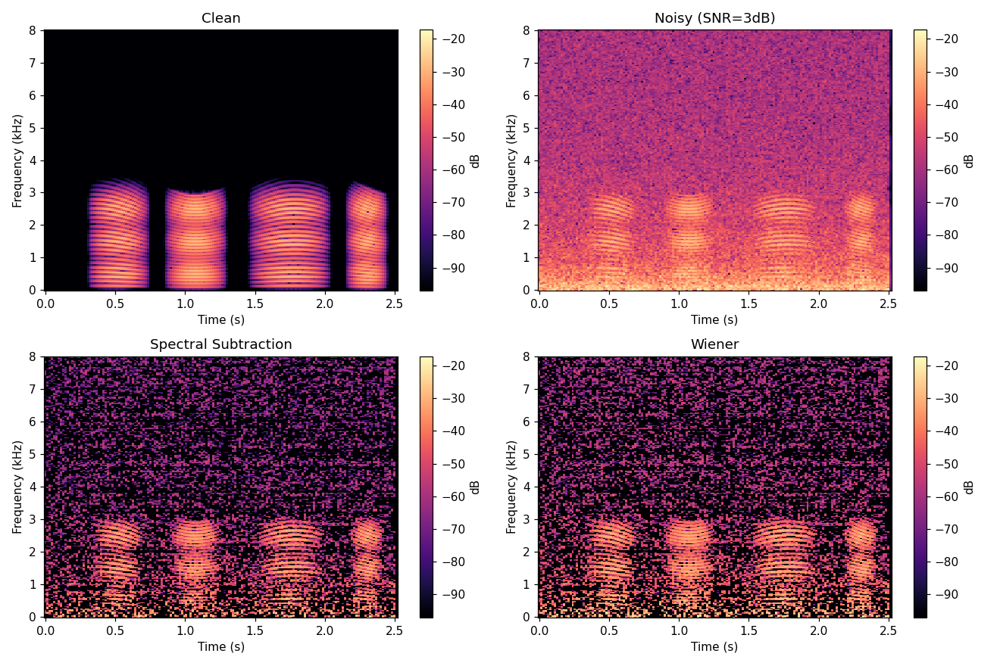
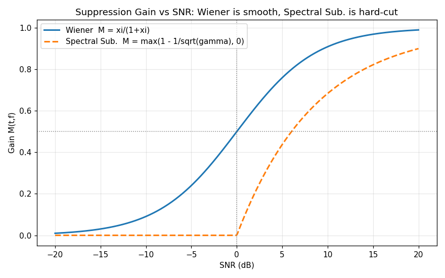
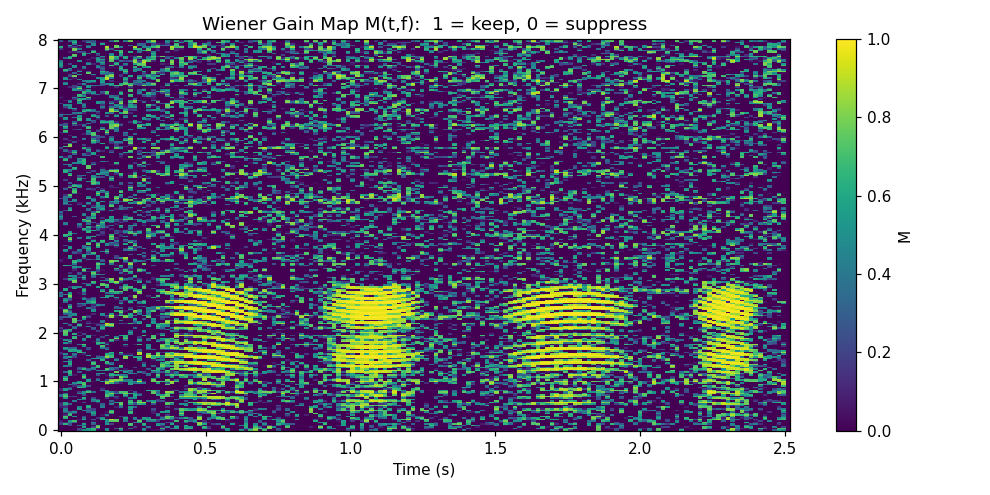
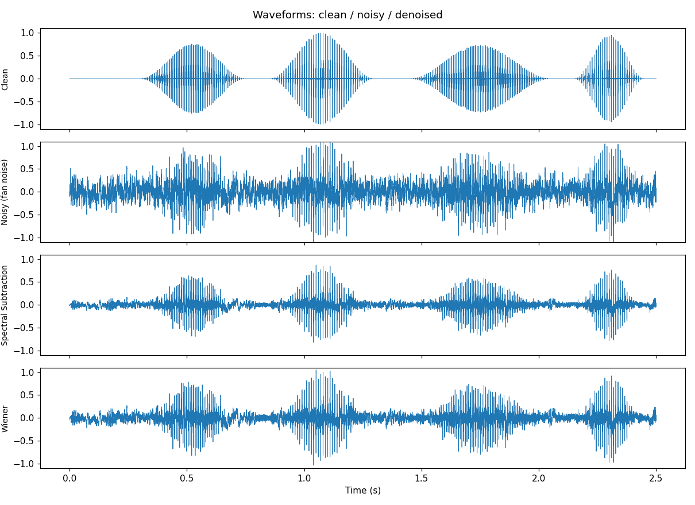

# 系列 3A · ANS 原理篇 —— 谱减法与维纳滤波，先验/后验 SNR

## 0. TL;DR + 解决什么问题

一句话：**单麦克风降噪（ANS, Adaptive Noise Suppression）的第一性原理，是在时频域上给每个"格子"配一个介于 0~1 的旋钮 `M(t,f)`，噪声多的格子拧小、人声多的格子拧大。**

本篇解决三件事：

- 已知带噪谱 `|X(t,f)|`，怎么"减掉"噪声谱？—— 这就是**谱减法**，简单但会吵。
- 怎么从"减法"升级成"最优缩放"？—— 这就是**维纳滤波**，最优增益 `M = ξ_prior / (1 + ξ_prior)`。
- `ξ_prior`（先验 SNR）和 `γ_post`（后验 SNR）到底是什么、怎么估？相位为什么可以偷懒不管？

读完你能自己写出一个能跑的降噪器（NumPy/SciPy），并看懂两条增益曲线为什么长得不一样。musical noise（水声/音乐噪声）的坑本篇只埋伏笔，下篇 3B 专门治。

---

## 1. 工程痛点引入（一帧音频出错的故事）

场景很常见：用户拿一支手机、在开着空调的会议室里录了段语音备忘。回放时，人声是能听清，但底下永远糊着一层"呼——"的稳态噪声，像隔着一层毛玻璃。你把这段音频丢进语音识别，WER（词错率）比安静环境高出一大截；你想做响度归一化，结果连噪声一起被抬起来，更吵了。

问题的物理本质：麦克风采集到的是**人声 + 环境噪声的叠加**。空调、风扇、机箱风噪这类噪声有个共同特点 —— **稳态**：它的频谱形状在几百毫秒内几乎不变，能量集中在低频，像一条平铺在频谱底部的"地毯"。

你只有**一支麦克风**，没有第二路参考信号（那是 AEC 的活儿，见系列 2A）。你手上只有一条混在一起的波形。怎么办？

直接在时域上"减噪声"是行不通的：你根本不知道任意一个采样点 `x[n]` 里，噪声那部分具体长什么样。但换到**频域**，稳态噪声会露出马脚 —— 它在每个频点上的能量是稳定、可估计的。这就是所有单麦降噪的出发点：**别在时域硬碰硬，去频域按频点算账。**

---

## 2. 直觉解释（比喻先行，不讲数学）

把带噪音频想象成一杯**浑浊的水**，人声是水，噪声是悬浮的杂质。你没法用一张滤网一次性把杂质捞干净，但你可以做一件事：**把这杯水按颗粒大小分成很多层小格子**（这就是 STFT —— 把信号切成一帧帧，再按频率分到一个个频点），然后**逐格判断**：这一格里杂质多还是水多？

- 某个频点（比如 120 Hz，空调嗡鸣所在）常年能量爆表，而人声在这儿没什么内容 —— 判定：这格几乎全是杂质，**旋钮拧到接近 0**。
- 某个频点（比如 300 Hz 的基频谐波），人声一说话能量猛涨，远超噪声地毯 —— 判定：这格主要是水，**旋钮拧到接近 1，原样保留**。

这个"每个频点一个旋钮"的东西，就是**增益 `M(t,f)`**，取值 0~1。降噪的全部艺术，就是**怎么把这些旋钮拧得恰到好处**：

- 拧太狠（该保留的也压了）→ 人声发闷、发干，甚至吞字。
- 拧太松（该压的没压干净）→ 噪声残留，白干。

> ⭐ **结论**：单麦降噪 = STFT 把信号铺成时频"格子" + 在每个格子上估计噪声强弱 + 用一个 0~1 的增益 `M(t,f)` 决定保留多少。**谱减法和维纳滤波的区别，仅仅是"这个旋钮怎么算"。**

还有个反直觉的偷懒技巧：我们**只调幅度，不动相位**。相位（`∠X(t,f)`，声音的"波形对齐信息"）直接沿用带噪信号的。为什么能这么糙？第 3 节讲。

---

## 3. 数学推导（符号遵循 STYLE.md）

### 3.1 信号模型：加性噪声在频域也是加性的

设干净语音 `s[n]`、噪声 `d[n]`，麦克风采集到的带噪信号是两者相加。做 STFT（短时傅里叶变换，窗长 `N`、帧移 `H`）后，因为傅里叶变换是线性的：

```
X(t,f) = S(t,f) + D(t,f)
```

**人话翻译**：把带噪音频切成一帧帧、变到频域后，每个时频格子 `(t,f)` 里的复数值 `X(t,f)`，等于同一个格子里"干净语音的复数值 `S(t,f)`"加上"噪声的复数值 `D(t,f)`"。时域里搅在一起的两团东西，在频域被摊到了各个频点上分别相加。

我们的目标是从 `X(t,f)` 里估出 `Ŝ(t,f)`。

### 3.2 谱减法：幅度直接相减

假设语音和噪声不相关，那么它们的**功率**近似可加：`|X|² ≈ |S|² + |D|²`。工程上最粗暴的做法是退到幅度层面直接减。记噪声功率谱估计为 `λ_d(t,f) = E[|D(t,f)|²]`，噪声的幅度就是 `√λ_d`：

```
|Ŝ(t,f)| = |X(t,f)| - √(λ_d(t,f))
```

**人话翻译**：带噪信号在这个频点的幅度，减去我们估计的噪声幅度，剩下的就当成人声幅度。就像从浑水的浊度里，扣掉"平时杂质造成的那部分浊度"。

问题来了：噪声是随机的，某些帧某些频点上，实际噪声幅度会**超过** `√λ_d` 的估计值，于是 `|X| - √λ_d` 会变成**负数**。幅度不能为负，只能强行截到 0（半波整流）：

```
|Ŝ(t,f)| = max(|X(t,f)| - √(λ_d(t,f)), 0)
```

写成增益形式，把谱减法也看成"一个旋钮"：

```
M_SS(t,f) = max(1 - √(λ_d) / |X(t,f)|, 0)
```

**人话翻译**：谱减法等价于一个增益 —— 带噪幅度远大于噪声时，旋钮接近 1（保留）；带噪幅度接近噪声时，旋钮被 `max(·, 0)` 一刀切到 0。**正是这个"一刀切"，埋下了 musical noise 的祸根**（下篇细讲）：随机地在某些格子清零、某些格子放行，重建出来就是一片忽有忽无的"水声"。

### 3.3 后验 SNR 与先验 SNR：两个信噪比

要更聪明地拧旋钮，先定义两个信噪比。注意它们**都是逐时频格子 `(t,f)` 定义的**，不是全局一个数。

**后验 SNR（a posteriori）**：拿到带噪观测后就能算的信噪比。

```
γ_post(t,f) = |X(t,f)|² / λ_d(t,f)
```

**人话翻译**：这个格子里"我实际观测到的总能量"是"噪声能量"的多少倍。分子用的是带噪的 `|X|²`（含噪声），所以叫"后验"—— 观测之后（a posteriori）才知道。它 ≥ 0，且因为含噪，通常比真实信噪比偏高约 1。

**先验 SNR（a priori）**：真正的、干净语音与噪声的能量比。

```
ξ_prior(t,f) = E[|S(t,f)|²] / λ_d(t,f)
```

**人话翻译**：这个格子里"干净人声的能量"是"噪声能量"的多少倍 —— 这才是我们真正想知道的"这格到底有多少人声含量"。但 `E[|S|²]` 是**未知的**（我们手上只有带噪的 `X`），所以叫"先验"，需要**估计**。

最朴素的估计（极大似然）：因为 `|X|² ≈ |S|² + |D|²`，所以 `|S|² ≈ |X|² - λ_d`，两边除以 `λ_d`：

```
ξ_prior(t,f) ≈ max(γ_post(t,f) - 1, 0)
```

**人话翻译**：先验 SNR ≈ 后验 SNR 减 1（因为后验里多算了一份噪声自己），再截到非负。这就是为什么后验 SNR 通常比先验大约 1。

> 🔥 **面试追问 ①：先验 SNR 明明含未知的干净语音，工程上到底怎么估？**
> 答：本篇用的 `ξ = max(γ_post - 1, 0)` 是最朴素的极大似然估计，缺点是**逐帧抖动大**，直接导致 musical noise。生产级做法是 Ephraim-Malah 的**判决引导（Decision-Directed, DD）**：把"上一帧已降噪结果推出的先验 SNR"和"当前帧的极大似然估计"做加权平滑，`ξ̂ = α·(上一帧 |Ŝ|²/λ_d) + (1-α)·max(γ-1, 0)`，`α≈0.98`。DD 让 `ξ_prior` 变得平滑、稳定，是抑制 musical noise 的关键 —— 这留到 3B 详解。

### 3.4 维纳滤波：均方误差意义下的最优增益

我们想找一个增益 `M(t,f)`，让 `Ŝ = M·X` 与真实 `S` 的**均方误差 `L = E[|S - M·X|²]` 最小**。把它当成关于实数 `M` 的二次函数，对 `M` 求导并令其为 0（在语音、噪声不相关的假设下）：

```
M(t,f) = E[|S|²] / (E[|S|²] + λ_d)
```

分子分母同除以 `λ_d`，用先验 SNR 表达：

```
M(t,f) = ξ_prior / (1 + ξ_prior)
```

**人话翻译**：最优旋钮就是"先验 SNR 占总量（信+噪）的比例"。这格人声含量越高（`ξ_prior` 大），旋钮越接近 1、原样保留；人声含量越低（`ξ_prior` 小），旋钮越接近 0、狠狠压掉。它是一条从 0 平滑爬到 1 的 **S 形曲线**，没有谱减法那种"一刀切"。

> ⭐ **结论**：维纳增益 `M = ξ_prior/(1+ξ_prior)` 是在"重建语音与真实语音均方误差最小"意义下的**最优**幅度增益。它和谱减法的本质差别 —— 谱减在幅度上做**硬减**（导致负值截断的硬开关），维纳在能量比上做**软加权**（平滑过渡），所以维纳更"温柔"，musical noise 更轻。

### 3.5 相位为什么可以偷懒沿用带噪相位

我们只算了幅度增益，重建时用的复数谱是：

```
Ŝ(t,f) = M(t,f) · |X(t,f)| · e^{j·∠X(t,f)}
```

**人话翻译**：把带噪幅度 `|X|` 乘上旋钮 `M` 得到估计幅度，相位 `∠X(t,f)` 直接抄带噪信号的，不做任何修正，然后 iSTFT 变回时域。

为什么敢这么糙？两个原因：

1. **理论上**，在"最小化幅度谱均方误差"这类准则下，可以证明**带噪相位就是最优（或近最优）的相位估计** —— 干净相位本身难估，且没有额外的独立信息可用。
2. **感知上**，人耳对**中高 SNR 下的相位误差不敏感**，幅度谱才是可懂度和音质的主要载体。花大力气估相位，收益远不如把幅度增益做好。

> 🔥 **面试追问 ②：既然只改幅度不改相位，为什么谱减法还是会"吵"（musical noise），维纳就好些？**
> 答：吵的根源**不在相位**，在**幅度增益的"抖动"**。谱减的 `max(·,0)` 硬截断，让相邻时频格子的增益在 0 和非 0 之间随机跳变，重建后就是一串孤立、随机分布的窄带能量包 —— 听感就是"叮叮咚咚的水声/音乐声"。维纳的 S 形软增益过渡平滑，加上 3B 的 DD 平滑 `ξ_prior`，能大幅压住这种抖动。相位沿用带噪相位对两者都一样，不是吵的原因。

---

## 4. 代码实战（可跑、shape 完整、关键行注释、附真实配图）

完整代码见 本文文末《完整可跑代码》，`python series-3A.py` 可直接跑，产图落在 `figures/`。核心链路如下（变量都带 shape 注释）。

### 4.1 STFT：把信号铺成时频格子

```python
from scipy.signal import stft, istft

FS, N, H = 16000, 512, 256          # f_s / 窗长 N / 帧移 H = N/2

def forward_stft(x):
    f, tt, X = stft(x, fs=FS, window="hann", nperseg=N, noverlap=N - H,
                    boundary="zeros", padded=True)
    return X, f, tt                 # X # [F, T] 复数谱, f # [F], tt # [T]
```

跑出来的形状：`X # [F, T] = (257, 158)`（257 个频点、158 帧）。`|X|` 是幅度谱 `|X(t,f)|`，`np.angle(X)` 就是相位 `∠X(t,f)`。

### 4.2 估计噪声功率谱 `λ_d`

本篇用最简单的"纯噪声帧平均"—— 合成信号开头留了 0.3s 静音当纯噪声段（真实系统靠 VAD 或最小值统计，见系列 3B / 4）：

```python
def estimate_lambda_d(X, n_noise_frames=10):
    noise_mag2 = np.abs(X[:, :n_noise_frames]) ** 2   # [F, K]
    lam = np.mean(noise_mag2, axis=1, keepdims=True)  # λ_d # [F, 1]
    return lam
```

### 4.3 谱减法 vs 维纳滤波

```python
def spectral_subtraction(X, lam_d):
    mag = np.abs(X)                                          # |X| # [F, T]
    noise_mag = np.sqrt(lam_d)                               # √λ_d # [F, 1]
    gain = np.maximum(1.0 - noise_mag / (mag + 1e-12), 0.0)  # M_SS # [F, T]，半波整流
    return gain * X, gain                                    # 幅度缩放，相位∠X不变

def wiener_filter(X, lam_d):
    gamma = (np.abs(X) ** 2) / (lam_d + 1e-12)               # γ_post # [F, T]
    xi = np.maximum(gamma - 1.0, 0.0)                        # ξ_prior # [F, T]（极大似然估计）
    gain = xi / (1.0 + xi)                                   # M # [F, T] = ξ/(1+ξ)
    return gain * X, gain, xi, gamma
```

两个函数都只缩放幅度、复数乘法自动保留了带噪相位 `∠X` —— 这就是 3.5 节"偷懒"在代码里的样子。重建用 `istft` 即可。

### 4.4 跑出来的指标

带噪输入（风扇噪声，混合到活跃段 SNR≈3dB）经两种方法处理后的全局 SNR：

```
===== 全局 SNR (dB) =====
  带噪输入      :  -4.33
  谱减法输出    :   3.69  (Δ +8.01)
  维纳滤波输出  :   1.44  (Δ +5.77)
```

两种方法都把 SNR 拉高了。谱减法这个"全局 SNR"数字更高不代表更好听 —— 它是靠**激进地清零**换来的能量比提升，代价是 musical noise（下篇会用听感和频谱抖动量化这一点）。这正是"指标好 ≠ 听感好"的经典陷阱。

### 4.5 配图

**语谱图对比**（干净 / 带噪 / 谱减 / 维纳）：横轴时间(s)、纵轴频率(kHz)、颜色为 dB 能量。



看点：带噪图底部（低频）铺着一层风扇噪声"地毯"；谱减后地毯被抠掉，但残留下**散点状的斑块**（musical noise 的视觉特征）；维纳后底噪同样被压，斑块更少、语音谐波结构（横向条纹）保留得更连续。

**增益曲线 M vs SNR**：这是全篇的"点睛图"。



看点：维纳增益（实线）是一条从 0 平滑爬到 1 的 S 形曲线；谱减增益（虚线）在低 SNR 处被 `max(·,0)` **硬切到 0**，形成一个尖锐拐点。**这个拐点就是 musical noise 的数学来源** —— 增益在拐点附近对输入的微小抖动极其敏感。

**维纳增益热力图 `M(t,f)`**：直观展示"每个频点一个旋钮"。



看点：亮(M→1)的地方对应语音谐波和音节活跃段（旋钮开），暗(M→0)的地方对应静音和纯噪声频点（旋钮关）。这张图就是第 2 节"旋钮阵列"比喻的字面可视化。

**时域波形对比**：



看点：带噪波形静音段有明显底噪，两种降噪后静音段都变干净；维纳的语音段包络保留得更自然。


<!-- AUTO-EMBED:BEGIN 完整代码 由 scripts/embed_code.py 生成，勿手改 -->
### 完整可跑代码

> 以下为本篇配套的完整脚本，已实际执行通过。**直接复制保存为 `series-3A.py`，`python series-3A.py` 即可复现上面所有配图**（需 `numpy` / `scipy` / `matplotlib`）。

```python
#!/usr/bin/env python3
# -*- coding: utf-8 -*-
"""系列 3A · ANS 原理篇配套代码：谱减法 vs 维纳滤波。

教学参考实现（NumPy/SciPy），讲透原理，不追生产性能。
运行：python code/series-3A.py
产物：figures/s3a_*.png
"""

import os
from pathlib import Path

import matplotlib

matplotlib.use("Agg")  # 无显示环境下也能出图，必须在 pyplot 之前设置

import matplotlib.pyplot as plt
import numpy as np
from scipy.signal import istft, lfilter, stft

# ----------------------------------------------------------------------------
# 全局参数（符号遵循 STYLE.md）
# ----------------------------------------------------------------------------
FS = 16000          # f_s 采样率 (Hz)
N = 512             # N   STFT 窗长（样本）
H = 256             # H   帧移 hop = N/2
RNG = np.random.default_rng(2026)

FIG_DIR = Path(__file__).resolve().parent.parent / "figures"
FIG_DIR.mkdir(parents=True, exist_ok=True)


# ----------------------------------------------------------------------------
# 1. 合成一段"类语音"干净信号（无外部音频依赖）
# ----------------------------------------------------------------------------
def make_speech(fs=FS, dur=2.5):
    """合成谐波+共振峰+音节包络的类语音信号。

    返回 clean # [n]，前 0.3s 为静音（供噪声估计当"纯噪声帧"）。
    """
    n_total = int(dur * fs)
    t = np.arange(n_total) / fs                     # t # [n] 时间轴 (s)

    # 基频 f0 在 110~150 Hz 缓慢起伏（模拟语调）
    f0 = 120 + 20 * np.sin(2 * np.pi * 0.7 * t)     # f0 # [n]
    phase = 2 * np.pi * np.cumsum(f0) / fs          # 相位积分
    voiced = np.zeros(n_total)                       # voiced # [n]
    formants = [500, 1500, 2500]                     # 三个共振峰中心 (Hz)
    for k in range(1, 30):                           # 叠加 30 次谐波
        fk = k * f0                                  # 第 k 次谐波频率 # [n]
        env = np.zeros(n_total)
        for fc in formants:                          # 共振峰包络加权
            env += np.exp(-((fk - fc) ** 2) / (2 * 250.0 ** 2))
        voiced += env * np.sin(k * phase)

    # 音节门控包络：制造"说话-停顿"的起伏
    syl = np.zeros(n_total)
    for (start, end) in [(0.30, 0.75), (0.85, 1.30), (1.45, 2.05), (2.15, 2.45)]:
        i0, i1 = int(start * fs), int(end * fs)
        w = np.hanning(i1 - i0)                      # 每个音节用汉宁窗淡入淡出
        syl[i0:i1] = w
    clean = voiced * syl
    clean /= np.max(np.abs(clean)) + 1e-12           # 归一化到 [-1, 1]
    return clean.astype(np.float64)


# ----------------------------------------------------------------------------
# 2. 两种稳态噪声：白噪 + "风扇"低频噪声
# ----------------------------------------------------------------------------
def make_white(n):
    return RNG.standard_normal(n)                    # white # [n]


def make_fan(n, fs=FS):
    """风扇/空调噪声：低通有色噪声 + 两条低频嗡鸣 tonal。"""
    w = RNG.standard_normal(n)
    # 一阶低通（AR(1)）把能量压到低频，模拟机械噪声的"闷"
    colored = lfilter([1.0], [1.0, -0.95], w)        # colored # [n]
    t = np.arange(n) / fs
    hum = 0.3 * np.sin(2 * np.pi * 120 * t) + 0.2 * np.sin(2 * np.pi * 240 * t)
    fan = colored / (np.std(colored) + 1e-12) + hum
    return fan


def mix_at_snr(clean, noise, snr_db):
    """按目标全局 SNR 混合，只在语音活跃段计功率更贴近真实感知。"""
    active = np.abs(clean) > 0.01
    ps = np.mean(clean[active] ** 2) if active.any() else np.mean(clean ** 2)
    pn = np.mean(noise ** 2)
    target_pn = ps / (10 ** (snr_db / 10))
    noise_scaled = noise * np.sqrt(target_pn / (pn + 1e-12))
    return clean + noise_scaled, noise_scaled


# ----------------------------------------------------------------------------
# 3. STFT / iSTFT 封装
# ----------------------------------------------------------------------------
def forward_stft(x):
    """返回 X # [F, T] 复数谱，f # [F] 频率轴，tt # [T] 帧时间轴。"""
    f, tt, X = stft(x, fs=FS, window="hann", nperseg=N, noverlap=N - H,
                    boundary="zeros", padded=True)
    return X, f, tt


def inverse_stft(X):
    """由复数谱重建时域 x_rec # [n]。"""
    _, x_rec = istft(X, fs=FS, window="hann", nperseg=N, noverlap=N - H,
                     boundary=True)
    return x_rec


# ----------------------------------------------------------------------------
# 4. 噪声功率谱 λ_d 估计：取前若干"纯噪声帧"平均
# ----------------------------------------------------------------------------
def estimate_lambda_d(X, n_noise_frames=10):
    """λ_d # [F, 1]：前 n_noise_frames 帧 |X|² 的均值（沿时间轴）。"""
    noise_mag2 = np.abs(X[:, :n_noise_frames]) ** 2   # [F, K]
    lam = np.mean(noise_mag2, axis=1, keepdims=True)  # λ_d # [F, 1]
    return lam


# ----------------------------------------------------------------------------
# 5. 两种降噪：谱减法 / 维纳滤波
# ----------------------------------------------------------------------------
def spectral_subtraction(X, lam_d):
    """幅度谱减法：|Ŝ| = max(|X| - sqrt(λ_d), 0)，相位沿用带噪相位 ∠X。

    等价增益 M_SS = max(1 - sqrt(λ_d)/|X|, 0)（半波整流）。
    """
    mag = np.abs(X)                                   # |X| # [F, T]
    noise_mag = np.sqrt(lam_d)                        # 噪声幅度估计 # [F, 1]
    gain = np.maximum(1.0 - noise_mag / (mag + 1e-12), 0.0)  # M_SS # [F, T]
    S_hat = gain * X                                  # 复数谱：幅度缩放，相位不变
    return S_hat, gain


def wiener_filter(X, lam_d):
    """维纳增益 M = ξ/(1+ξ)。

    后验 SNR γ_post = |X|²/λ_d；先验 SNR 用极大似然估计 ξ = max(γ-1, 0)。
    （判决引导 DD 的更稳估计留到 3B。）
    """
    gamma = (np.abs(X) ** 2) / (lam_d + 1e-12)        # γ_post # [F, T]
    xi = np.maximum(gamma - 1.0, 0.0)                 # ξ_prior # [F, T]
    gain = xi / (1.0 + xi)                            # M # [F, T]
    S_hat = gain * X
    return S_hat, gain, xi, gamma


# ----------------------------------------------------------------------------
# 6. 指标：分段 SNR（越大越好）
# ----------------------------------------------------------------------------
def seg_snr(clean, test):
    """对齐长度后计算全局 SNR (dB)：10log10(P_signal / P_error)。"""
    m = min(len(clean), len(test))
    c, x = clean[:m], test[:m]
    err = c - x
    return 10 * np.log10((np.sum(c ** 2) + 1e-12) / (np.sum(err ** 2) + 1e-12))


# ----------------------------------------------------------------------------
# 绘图工具
# ----------------------------------------------------------------------------
def db_spec(X):
    """转 dB 幅度谱 # [F, T]，用于 imshow。"""
    return 20 * np.log10(np.abs(X) + 1e-6)


def plot_spectrograms(specs, titles, f, tt, path):
    """2x2 语谱图对比。specs 每个 # [F, T]。"""
    vmax = max(db_spec(s).max() for s in specs)
    vmin = vmax - 80
    fig, axes = plt.subplots(2, 2, figsize=(12, 8))
    for ax, s, title in zip(axes.ravel(), specs, titles):
        im = ax.pcolormesh(tt, f / 1000, db_spec(s), vmin=vmin, vmax=vmax,
                           shading="auto", cmap="magma")
        ax.set_title(title)
        ax.set_xlabel("Time (s)")
        ax.set_ylabel("Frequency (kHz)")
        fig.colorbar(im, ax=ax, label="dB")
    fig.tight_layout()
    fig.savefig(path, dpi=110)
    plt.close(fig)


def plot_gain_curves(path):
    """增益 M vs SNR(dB)：谱减 vs 维纳，展示两者形状差异。"""
    snr_db = np.linspace(-20, 20, 400)                # SNR 轴 (dB) # [400]
    snr_lin = 10 ** (snr_db / 10)                     # 线性 SNR # [400]
    m_wiener = snr_lin / (1.0 + snr_lin)              # 维纳: M=ξ/(1+ξ)
    # 谱减以后验 SNR γ 计：M_SS = max(1 - 1/sqrt(γ), 0)
    m_ss = np.maximum(1.0 - 1.0 / np.sqrt(snr_lin), 0.0)
    fig, ax = plt.subplots(figsize=(8, 5))
    ax.plot(snr_db, m_wiener, label="Wiener  M = xi/(1+xi)", lw=2)
    ax.plot(snr_db, m_ss, label="Spectral Sub.  M = max(1 - 1/sqrt(gamma), 0)",
            lw=2, ls="--")
    ax.axhline(0.5, color="gray", ls=":", lw=1)
    ax.axvline(0, color="gray", ls=":", lw=1)
    ax.set_xlabel("SNR (dB)")
    ax.set_ylabel("Gain M(t,f)")
    ax.set_title("Suppression Gain vs SNR: Wiener is smooth, Spectral Sub. is hard-cut")
    ax.legend()
    ax.grid(alpha=0.3)
    fig.tight_layout()
    fig.savefig(path, dpi=110)
    plt.close(fig)


def plot_gain_map(gain, f, tt, path):
    """维纳增益 M(t,f) 热力图 # [F, T]，直观看"每个频点旋钮"。"""
    fig, ax = plt.subplots(figsize=(9, 4.5))
    im = ax.pcolormesh(tt, f / 1000, gain, vmin=0, vmax=1,
                       shading="auto", cmap="viridis")
    ax.set_title("Wiener Gain Map M(t,f):  1 = keep, 0 = suppress")
    ax.set_xlabel("Time (s)")
    ax.set_ylabel("Frequency (kHz)")
    fig.colorbar(im, ax=ax, label="M")
    fig.tight_layout()
    fig.savefig(path, dpi=110)
    plt.close(fig)


def plot_waveforms(clean, noisy, ss, wf, path):
    """时域波形对比 # [n]。"""
    m = min(map(len, [clean, noisy, ss, wf]))
    t = np.arange(m) / FS
    fig, axes = plt.subplots(4, 1, figsize=(11, 8), sharex=True)
    for ax, sig, title in zip(
        axes,
        [clean[:m], noisy[:m], ss[:m], wf[:m]],
        ["Clean", "Noisy (fan noise)", "Spectral Subtraction", "Wiener"],
    ):
        ax.plot(t, sig, lw=0.6)
        ax.set_ylabel(title, fontsize=9)
        ax.set_ylim(-1.1, 1.1)
    axes[-1].set_xlabel("Time (s)")
    fig.suptitle("Waveforms: clean / noisy / denoised")
    fig.tight_layout()
    fig.savefig(path, dpi=110)
    plt.close(fig)


# ----------------------------------------------------------------------------
# 主流程
# ----------------------------------------------------------------------------
def main():
    clean = make_speech()                             # clean # [n]

    # --- 场景：风扇噪声（低频有色）为主线，白噪作对照 ---
    fan = make_fan(len(clean))                         # fan # [n]
    noisy, _ = mix_at_snr(clean, fan, snr_db=3.0)      # noisy # [n]

    white = make_white(len(clean))
    noisy_white, _ = mix_at_snr(clean, white, snr_db=3.0)

    # --- STFT ---
    Xc, f, tt = forward_stft(clean)                    # Xc # [F, T]
    Xn, _, _ = forward_stft(noisy)                     # Xn # [F, T]
    print(f"[shape] STFT X # [F, T] = {Xn.shape}  (F={Xn.shape[0]}, T={Xn.shape[1]})")

    # --- 噪声功率谱估计（前 10 帧为静音，当纯噪声帧）---
    lam_d = estimate_lambda_d(Xn, n_noise_frames=10)   # λ_d # [F, 1]
    print(f"[shape] lambda_d # [F, 1] = {lam_d.shape}")

    # --- 两种降噪 ---
    S_ss, g_ss = spectral_subtraction(Xn, lam_d)       # 谱减
    S_wf, g_wf, xi, gamma = wiener_filter(Xn, lam_d)   # 维纳
    print(f"[shape] Wiener gain M # [F, T] = {g_wf.shape}, "
          f"xi # [F, T] = {xi.shape}, gamma # [F, T] = {gamma.shape}")

    # --- 重建时域 ---
    x_ss = inverse_stft(S_ss)                          # x_ss # [n]
    x_wf = inverse_stft(S_wf)                           # x_wf # [n]

    # --- 指标 ---
    snr_in = seg_snr(clean, noisy)
    snr_ss = seg_snr(clean, x_ss)
    snr_wf = seg_snr(clean, x_wf)
    print("\n===== 全局 SNR (dB) =====")
    print(f"  带噪输入      : {snr_in:6.2f}")
    print(f"  谱减法输出    : {snr_ss:6.2f}  (Δ {snr_ss - snr_in:+.2f})")
    print(f"  维纳滤波输出  : {snr_wf:6.2f}  (Δ {snr_wf - snr_in:+.2f})")

    # --- 配图 ---
    plot_spectrograms(
        [Xc, Xn, S_ss, S_wf],
        ["Clean", "Noisy (SNR=3dB)", "Spectral Subtraction", "Wiener"],
        f, tt, FIG_DIR / "s3a_spectrograms.png",
    )
    plot_gain_curves(FIG_DIR / "s3a_gain_curves.png")
    plot_gain_map(g_wf, f, tt, FIG_DIR / "s3a_gain_map.png")
    plot_waveforms(clean, noisy, x_ss, x_wf, FIG_DIR / "s3a_waveforms.png")

    print("\n[figures] 已生成：")
    for name in ["s3a_spectrograms.png", "s3a_gain_curves.png",
                 "s3a_gain_map.png", "s3a_waveforms.png"]:
        print(f"  figures/{name}")
    print("\n[done] series-3A 全部完成。")


if __name__ == "__main__":
    main()
```
<!-- AUTO-EMBED:END -->

---

## 5. 工程踩坑（调参经验 + 面试追问三连）

**踩坑 1：噪声估计 `λ_d` 是命门，估歪全盘皆输。**
`λ_d` 估小了 → 噪声压不干净；估大了 → 连人声一起削（over-subtraction），发闷吞字。本篇用"前 10 帧静音"是理想条件；真实场景噪声会缓慢变化，必须**在线更新** `λ_d`（最小值统计 / MCRA），且只在"没人说话"时更新 —— 这依赖 VAD（系列 4）或递归最小值追踪（系列 3B）。

**踩坑 2：`|X|` 做分母要加 `eps`。**
静音处 `|X|` 极小，`√λ_d / |X|` 会爆炸或除零。代码里所有除法都加了 `1e-12`。这不是洁癖，是防 `NaN` 污染整段音频。

**踩坑 3：谱减的"全局 SNR 提升"会骗人。**
如 4.4 所示，谱减的 SNR 数字甚至比维纳高，但听感更差。**别只看 SNR/SegSNR 这类能量比指标**，要结合 PESQ/STOI（可懂度、感知质量）和实听。这是算法工程师和"只会调 loss"的最大区别。

**踩坑 4：窗和帧移要满足 COLA。**
STFT→处理→iSTFT 要能完美重建，窗函数和 `noverlap` 必须满足 COLA（Constant OverLap-Add）条件。汉宁窗 + 50% 重叠（`H=N/2`）是安全组合；乱改帧移会导致重建幅度起伏、引入周期性调制噪声。

> 🔥 **面试追问三连**：
> 1. **为什么降噪只改幅度、沿用带噪相位 `∠X`？** —— 见 3.5：干净相位难估且无独立信息，带噪相位在均方误差准则下近最优；人耳对中高 SNR 相位不敏感，幅度谱才是音质主载体。
> 2. **谱减法为什么"吵"（musical noise）？** —— `max(|X|-√λ_d, 0)` 的硬截断，让相邻时频格子的增益在 0/非0 间随机跳变，重建成孤立随机的窄带能量包，听感是"水声"。根源是**增益抖动**，不是相位。
> 3. **先验 SNR `ξ_prior` 含未知干净语音，怎么估？** —— 朴素法 `ξ = max(γ_post-1, 0)` 抖动大；生产级用**判决引导 DD** 做时间平滑（`α≈0.98`），既稳又压 musical noise。3B 详解。

---

## 6. 小结 + 下篇预告 + 思考题

**小结**：
- 单麦降噪的骨架 = STFT 铺格子 → 每格估噪声 `λ_d` → 算一个 0~1 增益 `M(t,f)` → 只缩放幅度、沿用带噪相位 `∠X` → iSTFT 重建。
- 谱减法：`M_SS = max(1 - √λ_d/|X|, 0)`，简单，但硬截断导致 musical noise。
- 维纳滤波：`M = ξ_prior/(1+ξ_prior)`，均方误差最优，S 形软增益，更温柔。
- 两个信噪比：`γ_post = |X|²/λ_d`（观测即得）、`ξ_prior = E[|S|²]/λ_d`（真信噪比，需估计），二者近似关系 `ξ ≈ max(γ-1, 0)`。

> ⭐ **一句话记住**：谱减是"硬减"、维纳是"软加权"，而两者共用的旋钮逻辑都是"信噪比越高、保留越多"。

**下篇预告（系列 3B · ANS 进阶篇）**：本篇反复埋的 musical noise，下篇正式开刀 —— 它的频谱抖动成因、判决引导（DD）与过减因子怎么压制它；以及没有 VAD 时，如何用**最小值统计 / MCRA** 在线估计噪声功率 `λ_d`。

**思考题**：
1. 如果把维纳增益的 S 形曲线人为设一个"下限地板"（`M = max(M, 0.1)`，即最多衰减 20dB 而非压到 0），听感会怎么变？为什么这能压 musical noise，代价是什么？
2. 后验 SNR `γ_post` 恒 ≥ 先验 SNR `ξ_prior` 吗？在什么情况下 `γ_post < 1`（观测能量比噪声还小）？此时增益应该是多少？
3. 本篇 `λ_d` 用"前 10 帧静音"估计。如果噪声是**非稳态**的（比如键盘敲击声），这套方法会怎么失效？该往哪个方向补救？

---

## 自评清单

- [x] 每个公式都有"人话翻译"
- [x] 符号与 STYLE.md 一致（`X(t,f)`/`|X(t,f)|`/`∠X(t,f)`/`M(t,f)`/`ξ_prior`/`γ_post`/`λ_d`）
- [x] 代码已实际执行通过，shape 完整（`X # [F, T] = (257, 158)` 等）
- [x] 配图为真实运行生成（`s3a_*.png` 共 4 张）
- [x] 至少 1 个比喻（浑水滤杂质 / 旋钮阵列）+ 面试追问三连
- [x] 无违禁词（已过 gate.py 扫描）
