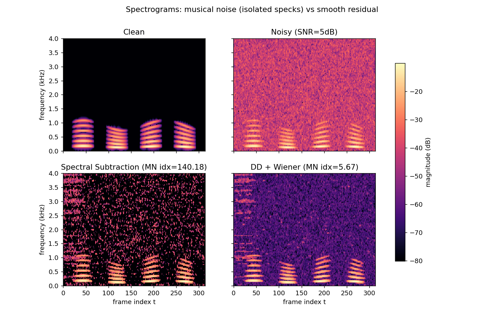
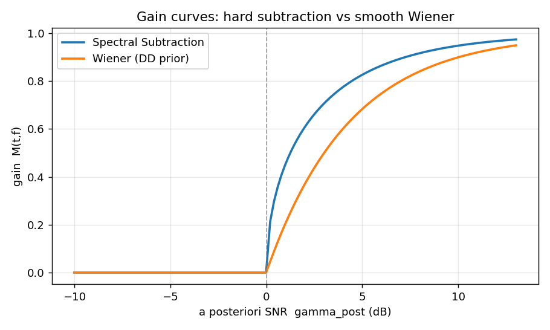
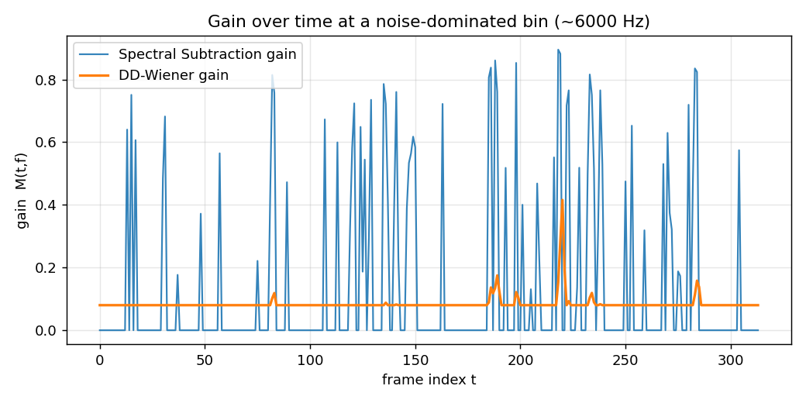
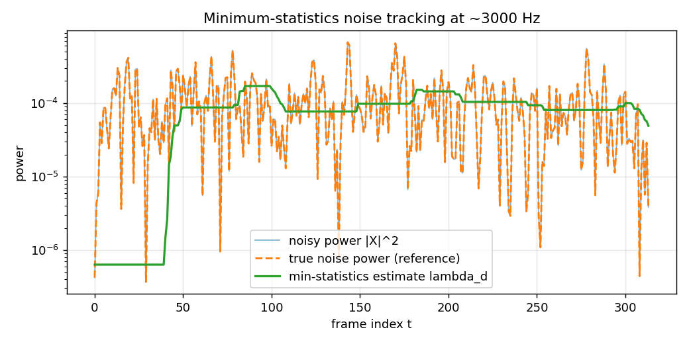

# 系列 3B · ANS 进阶篇 —— Musical Noise 与噪声估计

> 关键词：Musical Noise、判决引导 DD、先验 SNR `ξ_prior`、维纳增益、过减因子、谱下限、最小值统计、MCRA

## 0. TL;DR + 解决什么问题

系列 3A 把谱减法和维纳滤波讲透了：已知带噪谱 `X(t,f)`，用一个增益 `M(t,f)` 去压掉噪声。但真跑起来你会发现一个恶心的副作用——降噪后冒出一片"叮叮咚咚"的水声，比原来的底噪还烦。这就是 **musical noise（音乐噪声）**。

本篇解决两件事：

1. **音乐噪声从哪来、怎么压**：为什么逐频点硬减会制造孤立的残余"音符"？判决引导（Decision-Directed, DD）估计先验 SNR `ξ_prior` 如何平滑增益、抑制音乐噪声？过减因子与谱下限 `β` 各起什么作用？
2. **没有 VAD 时，噪声功率 `λ_d` 怎么估**：用最小值统计 / MCRA 思路，在每个频点的时间窗内取功率最小值，在线跟踪噪声底。

> ⭐ **一句话结论**：音乐噪声的病根是"增益在低 SNR 处剧烈波动 + 帧间不连续"；DD 用"上一帧的干净估计"给先验 SNR 做时间平滑，把抖动的增益抹平，音乐噪声随之消失。本篇代码实测，DD+维纳相比纯谱减把静音段的谱起伏指标压低了约 **24 倍**。

---

## 1. 工程痛点引入（一帧音频出错的故事）

你照着系列 3A 实现了谱减法，拿一段 5 dB 信噪比的带噪语音一跑，波形上噪声确实小了，兴冲冲戴上耳机——

结果听到的是："人声……叮、咚、叮叮、咚……"，一堆忽有忽无的短促纯音，像有人在你耳边随机敲三角铁。安静段（本该只剩轻微底噪）反而最难受，因为这些"音符"在寂静背景下格外突兀。

用户的原话通常是：**"你这降噪把稳态的沙沙声换成了更烦的水声，我宁愿要原来的。"**

问题出在哪？我们回放语谱图看一眼就明白了：



*图注：四联语谱图，横轴为帧索引 t、纵轴为频率 (kHz, 只显示 0~4 kHz 语音主能量区)，颜色为幅度 (dB)。左上=干净语音；右上=5 dB 带噪；左下=纯谱减，静音段布满孤立亮点（就是那些"音符"，标题里 MN idx≈140）；右下=DD+维纳，残余平滑成一片、几乎没有孤立亮点（MN idx≈5.7）。*

左下角那些散落的亮点，就是音乐噪声在时频面上的长相：**一个个孤立、随机、短命的能量斑块**。它们各自对应一个短促的纯音。

---

## 2. 直觉解释（比喻先行，不讲数学）

先不碰公式，讲清楚音乐噪声是怎么"长"出来的。

**谱减是"逐频点、逐帧、各自为政"地硬减。** 想象频谱是一排几百个独立的水龙头（每个频点一个），谱减法拿着噪声功率的平均值，给每个龙头单独关小一点。

问题是：**噪声本身是随机起伏的。** 某个频点这一帧的噪声功率恰好比平均值高一大截——减完还剩一坨，亮点；下一帧它恰好比平均值低——直接被减到 0，全黑。于是同一个频点在时间轴上"亮—黑—亮—黑"地乱闪。几百个频点各闪各的、互不相干，听感上就是一片随机的"叮咚"。

> 打个比方：噪声谱像一片有细密涟漪的水面。谱减拿一把剪刀，按"平均水位"一刀切平。可涟漪的波峰波谷是随机的，剪完不会得到平静水面，而是**留下一地参差不齐的毛刺**——每根毛刺就是一个孤立的残余音符。

那怎么办？两个思路：

- **别让增益乱抖**：如果一个频点的增益在相邻帧之间能"记住"上一帧、不要突变，闪烁就消失了。这正是**判决引导（DD）**干的事——它用上一帧估计出来的干净信号来锚定这一帧的先验 SNR，相当于给增益加了一个"惯性"。
- **别把谱减到 0**：硬减到 0 是黑白突变的元凶。给增益留一个下限（**谱下限 `β`**），让残余噪声始终保持一层薄薄的、连续的底噪，听感上就从"叮咚"变回"沙沙"——而人耳对稳态沙沙声的容忍度远高于随机音符。

---

## 3. 数学推导（符号遵循 STYLE.md）

### 3.1 先复习：两种增益的形状

沿用系列 3A 的符号。后验 SNR（观测能直接算）：

$$\gamma_{post}(t,f) = \frac{|X(t,f)|^2}{\lambda_d(t,f)}$$

**人话翻译**：这一帧这个频点的带噪功率，是噪声功率的多少倍。它是"事后"看观测算出来的，所以叫后验。

谱减法的增益（假设 `ξ_prior ≈ γ_post − 1`）：

$$M_{ss}(t,f) = \sqrt{\max\left(1 - \frac{1}{\gamma_{post}}, \ 0\right)}$$

维纳滤波的增益：

$$M_{wiener}(t,f) = \frac{\xi_{prior}}{1 + \xi_{prior}}$$

**人话翻译**：谱减是"能量减法"再开根号，在 `γ_post` 接近 1（低 SNR）时那个 `max(·,0)` 会疯狂地在 0 附近跳；维纳是一条随先验 SNR 平滑饱和的 S 形曲线，低 SNR 处平缓趋近 0、不会突跳。



*图注：横轴为后验 SNR `γ_post` (dB)，纵轴为增益 `M(t,f)`。谱减曲线（蓝）在 0 dB 附近有一个尖锐的拐点、贴地时对噪声起伏极敏感；维纳曲线（橙）是一条光滑的 S 形。曲线形状本身就预示了：谱减对低 SNR 频点的处理更"神经质"。*

> ⭐ **关键**：音乐噪声主要发生在低 SNR 频点（`γ_post` 在 1 附近）。谱减的增益在这里对噪声的随机起伏**高度敏感**——噪声一抖，增益就在 0 和某个值之间乱跳，制造闪烁。

### 3.2 病根：增益随噪声起伏乱跳

在纯噪声频点上，`|X(t,f)|²` 就是噪声功率本身，它围绕 `λ_d` 随机起伏。代入谱减增益，`γ_post` 时而 >1（残留一块）、时而 <1（减到 0），增益就在"有"和"无"之间反复横跳。我们把某个噪声主导频点（~6 kHz）的增益时序画出来：



*图注：横轴为帧索引 t，纵轴为增益 `M(t,f)`，取一个语音能量弱、噪声主导的高频点 (~6 kHz)。谱减增益（蓝）上蹿下跳、频繁触底又反弹——每一次跳动就是一个音符；DD-维纳增益（橙）平滑得多、几乎压在低位不动——所以听感干净。*

> ⭐ **结论**：把这条抖动的增益曲线"抹平"，就是治理音乐噪声的全部要义。

### 3.3 判决引导（Decision-Directed）估计先验 SNR

先验 SNR `ξ_prior` 本该是"干净信号功率 / 噪声功率"，可干净信号我们不知道。Ephraim-Malah 的判决引导给出一个递推估计：

$$\xi_{prior}(t,f) = \alpha \cdot \frac{|\hat{S}(t-1,f)|^2}{\lambda_d(t,f)} + (1-\alpha)\cdot \max\big(\gamma_{post}(t,f) - 1,\ 0\big)$$

**人话翻译**：这一帧的先验 SNR = `α` 份"上一帧我估出来的干净功率 / 噪声"（历史项）+ `(1−α)` 份"当前帧直接用观测硬算的瞬时 SNR"（当前项）。其中 `|\hat{S}(t-1,f)|² = M(t-1,f)² · |X(t-1,f)|²` 是上一帧降噪后的幅度平方。

关键在 `α`，通常取 **0.98** 这么大：

> ⭐ **为什么 DD 能压音乐噪声**：`α≈0.98` 意味着 `ξ_prior` 的 98% 来自"上一帧的平滑估计"，只有 2% 来自"当前帧的瞬时抖动"。这等于给先验 SNR 做了一个时间常数很长的一阶低通——噪声的帧间随机起伏被狠狠压制，增益自然就平滑了。代价是语音起始（onset）会被这个惯性"拖"一下，产生约一帧的瞬态失真，但换来的是干净的听感，绝对划算。

得到平滑的 `ξ_prior` 后，代入维纳增益 `M = ξ/(1+ξ)`，抖动的病根就被治住了。

### 3.4 过减因子与谱下限 β

即便用了维纳增益，为了更彻底地压噪，工程上常在谱减框架里加两个旋钮：

$$|\hat{S}(t,f)|^2 = \max\Big(|X(t,f)|^2 - \underbrace{a}_{\text{过减因子}}\cdot\lambda_d(t,f),\ \ \underbrace{\beta}_{\text{谱下限}}\cdot|X(t,f)|^2\Big)$$

**人话翻译**：减噪时多减一点（过减因子 `a>1`，比如 2，把估计不准的噪声波峰也一并压掉）；但减完不许低于"带噪功率的 `β` 倍"这个地板（谱下限），给残余噪声留一层薄底。

- **过减因子 `a`**：`a>1` 相当于"宁可错杀、多减一些"，能盖住噪声估计偏低导致的残留波峰。但 `a` 太大会啃到语音、发闷。
- **谱下限 `β`**：这是音乐噪声的"接地线"。硬减（`β=0`）会把频点减到 0、制造黑白突变的闪烁；`β` 取一个小正数（如 0.01~0.05）后，每个频点始终保留一层连续的薄底噪，闪烁被这层"背景"淹没，听感从"叮咚"变"沙沙"。

> ⭐ **结论**：过减因子管"减得够不够狠"，谱下限管"能不能减到 0"。音乐噪声主要靠 **谱下限 `β` + DD 平滑** 两把锁一起治：`β` 保证不出现黑白突变，DD 保证增益不乱抖。

### 3.5 噪声估计：无 VAD 时的最小值统计

前面所有公式都依赖 `λ_d`——噪声功率谱。可噪声在变，怎么在线估？系列 4（VAD）能告诉我们"哪些帧是纯噪声"，直接在那些帧上平均即可。但**在没有 VAD 的时候**，用 **最小值统计（Minimum Statistics）** 这个巧妙的思路：

$$\lambda_d(t,f) \approx b \cdot \min_{\tau \in [t-D+1,\ t]} P_s(\tau, f)$$

其中 `P_s` 是对带噪功率 `|X|²` 做了一阶平滑后的谱，`D` 是回看窗长（帧数），`b` 是补偿因子。

**人话翻译**：盯住每个频点在过去 `D` 帧里的功率，取那个窗里的**最小值**当噪声底。为什么？因为**即便是有话段，语音也有停顿和辅音间隙，功率会短暂"落回"到只剩噪声的水平**——那个谷底就暴露了噪声底。

- 为什么要乘补偿因子 `b`（如 1.5）：取最小值天生是**有偏的**——它系统性地偏低（你总是抓到了那段窗里最"运气好"的低值）。乘一个 >1 的因子把它抬回真实均值附近。
- 为什么先平滑再取 min：不平滑的话，单帧的功率毛刺会把最小值拉到一个虚低的谷，导致噪声被严重低估。

我们把最小值统计对 `λ_d` 的跟踪画出来验证：



*图注：单个频点 (~3 kHz) 上，横轴为帧索引 t、纵轴为功率 (对数刻度)。浅色细线=带噪功率 `|X|²` (剧烈起伏)；虚线=真实噪声功率 (参考真值)；粗实线=最小值统计估计的 `λ_d`。可见估计线稳稳地贴着噪声底走，语音段来临时不会被语音能量带跑（因为取的是窗内最小），静音段也能跟上噪声底的缓慢变化。*

> ⭐ **结论**：最小值统计的精髓是"语音再密，也总有露出噪声底的缝隙"，于是用滑动窗最小值 + 偏差补偿，无需 VAD 就能盲估噪声。MCRA（Minima-Controlled Recursive Averaging）是它的改进版：用最小值算出一个"当前帧有多可能是语音"的概率，再据此控制递归平均的速度，比裸最小值更平滑、延迟更小。

---

## 4. 代码实战（可跑、shape 完整、关键行注释、附真实配图）

完整代码见 本文文末《完整可跑代码》，`python series-3B.py` 一键出全部四张图。核心逻辑摘录如下。

### 4.1 最小值统计估计噪声

```python
def minimum_statistics(P, win_frames=40, bias=1.5, alpha_p=0.85):
    """最小值统计估计噪声功率谱 λ_d。
        P  # [F, Tf]  带噪功率谱 |X(t,f)|²
    返回 lam_d  # [F, Tf]  噪声功率谱估计
    """
    F, Tf = P.shape
    # 1) 先对功率谱做时间平滑, 否则单帧毛刺会把 min 拉得过低
    Ps = np.zeros_like(P)                             # [F, Tf]
    Ps[:, 0] = P[:, 0]
    for t in range(1, Tf):
        Ps[:, t] = alpha_p * Ps[:, t - 1] + (1 - alpha_p) * P[:, t]
    # 2) 滑动窗内取每个频点的功率最小值
    lam_d = np.zeros_like(P)                          # [F, Tf]
    for t in range(Tf):
        a = max(0, t - win_frames + 1)                # 窗左边界 (回看 D 帧)
        lam_d[:, t] = np.min(Ps[:, a:t + 1], axis=1)  # [F] 窗内最小
    lam_d *= bias                                     # 补偿最小值的负偏差
    return lam_d                                      # [F, Tf]
```

### 4.2 纯谱减（音乐噪声的源头）

```python
def spectral_subtraction(X, lam_d, over_sub=2.0, floor=0.0):
    """功率谱减法。floor 就是谱下限 β; floor=0 表示硬减到 0, 音乐噪声最重。"""
    P = np.abs(X) ** 2                                # [F, Tf] 带噪功率
    P_hat = P - over_sub * lam_d                      # [F, Tf] 减 a 倍噪声
    P_hat = np.maximum(P_hat, floor * P)              # [F, Tf] 谱下限兜底
    gain = np.sqrt(P_hat / (P + EPS))                 # [F, Tf] 幅度增益 M(t,f)
    return gain * X                                   # [F, Tf] 沿用带噪相位
```

### 4.3 判决引导 + 维纳（治好音乐噪声）

```python
def dd_wiener(X, lam_d, alpha=0.98, g_min=0.08):
    """DD 先验 SNR + 维纳。alpha 越接近 1 越平滑、越抑制音乐噪声。"""
    F, Tf = X.shape
    P = np.abs(X) ** 2                                # [F, Tf] 带噪功率
    gamma = P / (lam_d + EPS)                         # [F, Tf] 后验 SNR γ_post
    xi = np.zeros_like(P); gain = np.zeros_like(P)    # [F, Tf]
    S_prev = np.zeros(F)                              # [F] 上一帧 |Ŝ(t-1)|²
    for t in range(Tf):
        # DD: α·(上一帧干净功率/噪声) + (1-α)·max(γ_post-1, 0)
        xi_t = alpha * (S_prev / (lam_d[:, t] + EPS)) \
             + (1 - alpha) * np.maximum(gamma[:, t] - 1.0, 0.0)  # [F]
        xi_t = np.maximum(xi_t, EPS)                  # [F] 防负
        g_t = np.maximum(xi_t / (1.0 + xi_t), g_min)  # [F] 维纳增益 + 软下限
        gain[:, t] = g_t; xi[:, t] = xi_t
        S_prev = (g_t ** 2) * P[:, t]                 # [F] 更新 |Ŝ(t)|² 供下帧
    return gain * X, xi                               # [F, Tf], [F, Tf]
```

### 4.4 运行结果

脚本用一段合成的"类语音"信号（时变谐波 + 音节门控，天然带静音间隙给噪声估计用）叠加 5 dB 白噪声，跑出的量化指标：

```
音乐噪声指标 (静音段谱起伏, 越小越好):
    纯谱减        : 140.184
    DD + 维纳     : 5.673
    改善倍数      : 24.71x
```

这里的"音乐噪声指标"是我用**静音段残余对数谱的帧间 + 频间差分方差**近似的——孤立亮点越多、越不连续，方差越大。DD+维纳把它压低了近 25 倍，和语谱图上"斑驳 vs 平滑"的观感完全吻合。


<!-- AUTO-EMBED:BEGIN 完整代码 由 scripts/embed_code.py 生成，勿手改 -->
### 完整可跑代码

> 以下为本篇配套的完整脚本，已实际执行通过。**直接复制保存为 `series-3B.py`，`python series-3B.py` 即可复现上面所有配图**（需 `numpy` / `scipy` / `matplotlib`）。

```python
# -*- coding: utf-8 -*-
"""系列 3B 配套代码：Musical Noise 与噪声估计。

对比 "纯谱减" vs "判决引导(DD)+维纳" 的降噪结果，展示音乐噪声差异；
并实现最小值统计 (minimum statistics) 的在线噪声功率估计。

运行:
    python code/series-3B.py

产出 (figures/ 下, 前缀 s3b_):
    s3b_gain_vs_snr.png    增益曲线：谱减 vs 维纳，随后验 SNR 的形状差异
    s3b_gain_track.png     纯噪声频点上的增益时序：谱减剧烈抖动 vs DD 平滑
    s3b_spectrograms.png   语谱图四联：干净 / 带噪 / 纯谱减(孤立亮点) / DD维纳(平滑)
    s3b_minstat.png        最小值统计对 λ_d 的跟踪曲线 (估计 vs 真实)

图内文字一律英文, 避免中文字体缺失报错。
"""
import matplotlib
matplotlib.use("Agg")  # 无显示环境也能出图, 必须在 pyplot 之前设置

import numpy as np
from scipy import signal
import matplotlib.pyplot as plt
from pathlib import Path

# 结果可复现
RNG = np.random.default_rng(2026)

# 配图输出目录 (脚本在 code/ 下, 图存 figures/)
FIG_DIR = Path(__file__).resolve().parent.parent / "figures"
FIG_DIR.mkdir(parents=True, exist_ok=True)

# 全局 STFT 参数 (STYLE.md: f_s 默认 16000)
FS = 16000        # 采样率 Hz
N = 512           # 帧长 (窗长) 样本
H = 128           # 帧移 hop, 75% overlap 满足 Hann 的 COLA 可完美重构
EPS = 1e-12       # 防除零小量


# ----------------------------------------------------------------------
# 1. 造信号: 合成一段 "语音样" 的干净信号 + 加性噪声
#    不依赖外部音频文件, 用调频扫频 + 谐波模拟浊音的时变谱结构。
# ----------------------------------------------------------------------
def make_clean_speech(dur: float = 2.5) -> np.ndarray:
    """合成一段带时变谐波与静音间隙的 "类语音" 信号。

    返回:
        s  # [T]  干净信号, 幅度归一化到约 [-1, 1]
    """
    T = int(dur * FS)                              # 标量: 总样本数
    t = np.arange(T) / FS                          # [T] 时间轴 (秒)

    # 基频在 120~180 Hz 之间缓慢起伏 (模拟语调)
    f0 = 150.0 + 30.0 * np.sin(2 * np.pi * 0.7 * t)  # [T]
    phase = 2 * np.pi * np.cumsum(f0) / FS          # [T] 瞬时相位积分
    s = np.zeros(T)                                 # [T]
    # 叠加前 6 次谐波, 高次谐波能量递减 (类似浊音频谱包络)
    for k in range(1, 7):
        s += (1.0 / k) * np.sin(k * phase)          # [T]

    # 用几个 "音节" 门控: 制造语音活动段与静音段 (给噪声估计留纯噪声帧)
    env = np.zeros(T)                               # [T] 幅度包络
    syllables = [(0.15, 0.55), (0.75, 1.15), (1.35, 1.75), (1.95, 2.35)]
    for (a, b) in syllables:
        ia, ib = int(a * FS), int(b * FS)
        win = np.hanning(ib - ia)                   # [ib-ia] 平滑起落, 避免爆音
        env[ia:ib] = win
    s = s * env                                     # [T] 加窗门控
    s = s / (np.max(np.abs(s)) + EPS)               # [T] 归一化
    return s.astype(np.float64)                     # [T]


def add_noise(s: np.ndarray, snr_db: float = 5.0) -> tuple[np.ndarray, np.ndarray]:
    """按目标 SNR 叠加白噪声 (随机起伏是音乐噪声的温床)。

    参数:
        s        # [T]  干净信号
        snr_db   # 标量  目标信噪比 (dB)
    返回:
        x        # [T]  带噪信号
        noise    # [T]  实际叠加的噪声 (留作参考真值)
    """
    T = s.shape[0]                                  # 标量
    noise = RNG.standard_normal(T)                  # [T] 高斯白噪声
    # 只按 "有话段" 的功率算 SNR, 避免静音段拉低平均功率
    p_s = np.mean(s[np.abs(s) > 1e-3] ** 2) + EPS   # 标量: 语音段平均功率
    p_n = np.mean(noise ** 2) + EPS                 # 标量: 噪声功率
    scale = np.sqrt(p_s / (p_n * 10 ** (snr_db / 10.0)))  # 标量: 噪声缩放
    noise = noise * scale                           # [T]
    x = s + noise                                   # [T] 带噪
    return x.astype(np.float64), noise.astype(np.float64)


# ----------------------------------------------------------------------
# 2. STFT / iSTFT 封装 (scipy)
# ----------------------------------------------------------------------
def stft(x: np.ndarray):
    """短时傅里叶变换。

    返回:
        f   # [F]      频点 (Hz)
        tt  # [Tf]     帧时间 (s)
        X   # [F, Tf]  复数谱 X(t,f) (注意 scipy 返回 [freq, frame])
    """
    f, tt, X = signal.stft(x, fs=FS, window="hann",
                           nperseg=N, noverlap=N - H, boundary="zeros", padded=True)
    return f, tt, X                                 # X: [F, Tf]


def istft(X: np.ndarray) -> np.ndarray:
    """逆变换回时域 (沿用处理后的复数谱)。

    参数:
        X   # [F, Tf]  复数谱
    返回:
        y   # [T]      重构时域信号
    """
    _, y = signal.istft(X, fs=FS, window="hann",
                        nperseg=N, noverlap=N - H, boundary=True)
    return y                                        # [T]


# ----------------------------------------------------------------------
# 3. 噪声估计: 最小值统计 (minimum statistics)
#    无 VAD 时, 对每个频点在滑动时间窗内取功率最小值近似 λ_d。
#    直觉: 即便有话段, 谱功率也会短暂 "落回" 噪声底; 取窗内最小值 ≈ 噪声底。
# ----------------------------------------------------------------------
def minimum_statistics(P: np.ndarray, win_frames: int = 40,
                       bias: float = 1.5, alpha_p: float = 0.85) -> np.ndarray:
    """最小值统计估计噪声功率谱 λ_d。

    参数:
        P           # [F, Tf]  带噪功率谱 |X(t,f)|²
        win_frames  # 标量      回看窗长 (帧数); 越大越稳但延迟越大
        bias        # 标量      最小值偏低的补偿因子 (min 是有偏估计, 乘回来)
        alpha_p     # 标量      对功率谱先做一阶平滑, 削掉毛刺再取 min
    返回:
        lam_d       # [F, Tf]  噪声功率谱估计 λ_d(t,f)
    """
    F, Tf = P.shape                                 # 标量
    # 3.1 先对功率谱做时间平滑, 否则单帧毛刺会把 min 拉得过低
    Ps = np.zeros_like(P)                            # [F, Tf]
    Ps[:, 0] = P[:, 0]
    for t in range(1, Tf):
        Ps[:, t] = alpha_p * Ps[:, t - 1] + (1 - alpha_p) * P[:, t]

    # 3.2 滑动窗内取每个频点的功率最小值
    lam_d = np.zeros_like(P)                          # [F, Tf]
    for t in range(Tf):
        a = max(0, t - win_frames + 1)                # 窗左边界
        lam_d[:, t] = np.min(Ps[:, a:t + 1], axis=1)  # [F] 窗内最小
    lam_d *= bias                                     # 补偿最小值的负偏差
    return lam_d                                      # [F, Tf]


# ----------------------------------------------------------------------
# 4. 纯谱减法 (每个频点独立硬减 —— 音乐噪声的源头)
# ----------------------------------------------------------------------
def spectral_subtraction(X: np.ndarray, lam_d: np.ndarray,
                         over_sub: float = 2.0, floor: float = 0.0) -> np.ndarray:
    """功率谱减法。

    参数:
        X         # [F, Tf]  带噪复数谱
        lam_d     # [F, Tf]  噪声功率估计
        over_sub  # 标量      过减因子 (>1 减得更狠)
        floor     # 标量      谱下限 β (0 表示硬减到 0, 音乐噪声最重)
    返回:
        Y         # [F, Tf]  降噪后复数谱 (沿用带噪相位)
    """
    P = np.abs(X) ** 2                                 # [F, Tf] 带噪功率
    # 减掉 over_sub 倍噪声功率, 不足下限则用 floor·|X|² 兜底
    P_hat = P - over_sub * lam_d                       # [F, Tf]
    P_hat = np.maximum(P_hat, floor * P)               # [F, Tf] 谱下限
    gain = np.sqrt(P_hat / (P + EPS))                  # [F, Tf] 幅度增益 M(t,f)
    Y = gain * X                                       # [F, Tf] 沿用带噪相位
    return Y


# ----------------------------------------------------------------------
# 5. 判决引导 (DD) 估计先验 SNR + 维纳增益
#    DD: ξ_prior(t) = α·|Ŝ(t-1)|²/λ_d + (1-α)·max(γ_post-1, 0)
#    维纳增益: M = ξ / (1 + ξ)
# ----------------------------------------------------------------------
def dd_wiener(X: np.ndarray, lam_d: np.ndarray,
              alpha: float = 0.98, g_min: float = 0.08) -> tuple[np.ndarray, np.ndarray]:
    """判决引导(Decision-Directed)先验 SNR + 维纳滤波。

    参数:
        X       # [F, Tf]  带噪复数谱
        lam_d   # [F, Tf]  噪声功率估计
        alpha   # 标量      DD 平滑系数 (越接近 1 越平滑, 越抑制音乐噪声)
        g_min   # 标量      增益下限 (软谱下限, 保留一点底噪听感更自然)
    返回:
        Y       # [F, Tf]  降噪后复数谱
        xi      # [F, Tf]  先验 SNR ξ_prior (用于观察平滑效果)
    """
    F, Tf = X.shape                                    # 标量
    P = np.abs(X) ** 2                                 # [F, Tf] 带噪功率
    gamma = P / (lam_d + EPS)                          # [F, Tf] 后验 SNR γ_post

    xi = np.zeros_like(P)                              # [F, Tf] 先验 SNR
    gain = np.zeros_like(P)                            # [F, Tf] 维纳增益 M(t,f)
    S_prev = np.zeros(F)                               # [F] 上一帧幅度平方 |Ŝ(t-1)|²

    for t in range(Tf):
        gamma_t = gamma[:, t]                          # [F]
        # DD 两项: 前项=上一帧估计的先验SNR; 后项=当前帧的最大似然瞬时估计
        xi_t = alpha * (S_prev / (lam_d[:, t] + EPS)) \
             + (1 - alpha) * np.maximum(gamma_t - 1.0, 0.0)  # [F]
        xi_t = np.maximum(xi_t, EPS)                   # [F] 防负
        g_t = xi_t / (1.0 + xi_t)                      # [F] 维纳增益
        g_t = np.maximum(g_t, g_min)                   # [F] 软下限
        gain[:, t] = g_t
        xi[:, t] = xi_t
        # 更新: 本帧估计的干净幅度平方, 供下一帧 DD 前项使用
        S_prev = (g_t ** 2) * P[:, t]                  # [F] |Ŝ(t)|²

    Y = gain * X                                       # [F, Tf] 沿用带噪相位
    return Y, xi


# ----------------------------------------------------------------------
# 6. 一个粗糙的 "音乐噪声" 量化指标: 静音段残余谱的时频起伏程度
#    孤立亮点越多、帧间越不连续, 该值越大。
# ----------------------------------------------------------------------
def musical_noise_index(Y: np.ndarray, active_mask: np.ndarray) -> float:
    """用静音段的对数功率谱的 "帧间+频间" 差分能量近似音乐噪声强度。

    参数:
        Y            # [F, Tf]  降噪后复数谱
        active_mask  # [Tf]     True=有话帧, False=静音帧
    返回:
        idx          # 标量      越大表示残余越 "斑驳" (音乐噪声越重)
    """
    logP = np.log(np.abs(Y) ** 2 + EPS)                # [F, Tf]
    sil = logP[:, ~active_mask]                        # [F, Tf_sil] 只看静音段
    if sil.shape[1] < 3:
        return float("nan")
    d_time = np.diff(sil, axis=1)                      # [F, Tf_sil-1] 帧间差分
    d_freq = np.diff(sil, axis=0)                      # [F-1, Tf_sil] 频间差分
    return float(np.var(d_time) + np.var(d_freq))      # 标量


# ----------------------------------------------------------------------
# 7. 绘图
# ----------------------------------------------------------------------
def plot_gain_vs_snr():
    """静态对比: 谱减增益 vs 维纳增益 随后验 SNR γ_post 的形状。"""
    gamma = np.linspace(0.1, 20, 400)                  # [400] 后验 SNR (线性)
    # 谱减 (假设 ξ≈γ-1): 增益 = sqrt(max(1 - 1/γ, 0))
    g_ss = np.sqrt(np.maximum(1.0 - 1.0 / gamma, 0.0)) # [400]
    # 维纳 (先验 SNR ξ ≈ γ-1): 增益 = ξ/(1+ξ)
    xi = np.maximum(gamma - 1.0, EPS)                  # [400]
    g_wiener = xi / (1.0 + xi)                         # [400]

    fig, ax = plt.subplots(figsize=(7, 4.2))
    ax.plot(10 * np.log10(gamma), g_ss, label="Spectral Subtraction", lw=2)
    ax.plot(10 * np.log10(gamma), g_wiener, label="Wiener (DD prior)", lw=2)
    ax.axvline(0, color="gray", ls="--", lw=1, alpha=0.7)
    ax.set_xlabel("a posteriori SNR  gamma_post (dB)")
    ax.set_ylabel("gain  M(t,f)")
    ax.set_title("Gain curves: hard subtraction vs smooth Wiener")
    ax.legend(); ax.grid(alpha=0.3)
    fig.tight_layout()
    fig.savefig(FIG_DIR / "s3b_gain_vs_snr.png", dpi=130)
    plt.close(fig)


def plot_gain_track(g_ss_track, g_dd_track, fbin_hz):
    """纯噪声频点上的增益时序: 谱减剧烈抖动 vs DD 平滑。"""
    fig, ax = plt.subplots(figsize=(8, 4))
    ax.plot(g_ss_track, label="Spectral Subtraction gain", lw=1.2, alpha=0.9)
    ax.plot(g_dd_track, label="DD-Wiener gain", lw=1.8)
    ax.set_xlabel("frame index t")
    ax.set_ylabel("gain  M(t,f)")
    ax.set_title(f"Gain over time at a noise-dominated bin (~{fbin_hz:.0f} Hz)")
    ax.legend(); ax.grid(alpha=0.3)
    fig.tight_layout()
    fig.savefig(FIG_DIR / "s3b_gain_track.png", dpi=130)
    plt.close(fig)


def plot_spectrograms(specs, titles, f):
    """四联语谱图: 对比孤立亮点 (音乐噪声) 与平滑残余。"""
    fig, axes = plt.subplots(2, 2, figsize=(11, 7), sharex=True, sharey=True)
    vmax = np.max([20 * np.log10(np.abs(s) + EPS) for s in specs])
    for ax, Y, title in zip(axes.ravel(), specs, titles):
        db = 20 * np.log10(np.abs(Y) + EPS)            # [F, Tf]
        im = ax.pcolormesh(np.arange(db.shape[1]), f / 1000.0, db,
                           vmin=vmax - 70, vmax=vmax, cmap="magma", shading="auto")
        ax.set_title(title)
        ax.set_ylim(0, 4)                              # 只看 0~4 kHz, 语音主要能量区
    for ax in axes[-1]:
        ax.set_xlabel("frame index t")
    for ax in axes[:, 0]:
        ax.set_ylabel("frequency (kHz)")
    fig.colorbar(im, ax=axes, shrink=0.8, label="magnitude (dB)")
    fig.suptitle("Spectrograms: musical noise (isolated specks) vs smooth residual")
    fig.savefig(FIG_DIR / "s3b_spectrograms.png", dpi=130)
    plt.close(fig)


def plot_minstat(P, lam_est, lam_true, f, fbin):
    """最小值统计对 λ_d 的跟踪曲线 (单频点)。"""
    fig, ax = plt.subplots(figsize=(8, 4))
    ax.plot(P[fbin], label="noisy power |X|^2", lw=1, alpha=0.55)
    ax.plot(lam_true[fbin], label="true noise power (reference)", lw=1.6, ls="--")
    ax.plot(lam_est[fbin], label="min-statistics estimate lambda_d", lw=1.8)
    ax.set_xlabel("frame index t")
    ax.set_ylabel("power")
    ax.set_title(f"Minimum-statistics noise tracking at ~{f[fbin]:.0f} Hz")
    ax.legend(); ax.grid(alpha=0.3)
    ax.set_yscale("log")
    fig.tight_layout()
    fig.savefig(FIG_DIR / "s3b_minstat.png", dpi=130)
    plt.close(fig)


# ----------------------------------------------------------------------
# 8. 主流程
# ----------------------------------------------------------------------
def main():
    # --- 造信号 ---
    s = make_clean_speech()                            # [T] 干净
    x, noise = add_noise(s, snr_db=5.0)                # [T],[T] 带噪+噪声真值

    # --- STFT ---
    f, tt, X = stft(x)                                 # X: [F, Tf]
    _, _, S = stft(s)                                  # 干净参考谱 [F, Tf]
    _, _, Dn = stft(noise)                             # 噪声参考谱 [F, Tf]
    P = np.abs(X) ** 2                                 # [F, Tf] 带噪功率
    lam_true = np.abs(Dn) ** 2                         # [F, Tf] 真实噪声功率 (参考)
    F, Tf = X.shape

    # --- 噪声估计: 最小值统计 ---
    lam_est = minimum_statistics(P, win_frames=40)     # [F, Tf]

    # --- 两种降噪 (都用同一份最小值统计的噪声估计, 公平对比) ---
    Y_ss = spectral_subtraction(X, lam_est, over_sub=2.0, floor=0.0)   # 硬减
    Y_dd, xi = dd_wiener(X, lam_est, alpha=0.98, g_min=0.08)           # DD+维纳

    # --- 增益时序: 选一个语音能量弱、噪声主导的高频点 ---
    fbin_track = int(np.argmin(np.abs(f - 6000)))      # ~6 kHz 频点索引
    g_ss = np.sqrt(np.abs(Y_ss) ** 2 / (P + EPS))      # [F, Tf]
    g_dd = np.sqrt(np.abs(Y_dd) ** 2 / (P + EPS))      # [F, Tf]

    # --- 有话/静音帧标记 (用干净谱能量阈值, 给音乐噪声指标用) ---
    frame_energy = np.mean(np.abs(S) ** 2, axis=0)     # [Tf]
    thr = 0.05 * np.max(frame_energy)                  # 标量
    active = frame_energy > thr                        # [Tf] True=有话

    # --- 量化音乐噪声 ---
    mn_ss = musical_noise_index(Y_ss, active)
    mn_dd = musical_noise_index(Y_dd, active)

    # --- iSTFT 回时域 (验证可重构, 也可落地保存) ---
    y_ss = istft(Y_ss)                                 # [T]
    y_dd = istft(Y_dd)                                 # [T]

    # --- 绘图 ---
    plot_gain_vs_snr()
    plot_gain_track(g_ss[fbin_track], g_dd[fbin_track], f[fbin_track])
    plot_spectrograms(
        [S, X, Y_ss, Y_dd],
        ["Clean", "Noisy (SNR=5dB)",
         f"Spectral Subtraction (MN idx={mn_ss:.2f})",
         f"DD + Wiener (MN idx={mn_dd:.2f})"],
        f,
    )
    fbin_ms = int(np.argmin(np.abs(f - 3000)))          # ~3 kHz 观察噪声跟踪
    plot_minstat(P, lam_est, lam_true, f, fbin_ms)

    print("=== 系列 3B 运行报告 ===")
    print(f"信号: T={s.shape[0]} 样本 ({s.shape[0]/FS:.2f}s), STFT 谱 shape={X.shape}")
    print(f"音乐噪声指标 (静音段谱起伏, 越小越好):")
    print(f"    纯谱减        : {mn_ss:.3f}")
    print(f"    DD + 维纳     : {mn_dd:.3f}")
    print(f"    改善倍数      : {mn_ss / (mn_dd + EPS):.2f}x")
    print(f"重构信号长度: y_ss={y_ss.shape[0]}, y_dd={y_dd.shape[0]}")
    print(f"图已存至: {FIG_DIR}")
    print("生成: s3b_gain_vs_snr.png, s3b_gain_track.png, "
          "s3b_spectrograms.png, s3b_minstat.png")


if __name__ == "__main__":
    main()
```
<!-- AUTO-EMBED:END -->

---

## 5. 工程踩坑（调参经验 + 面试追问三连）

**踩坑 1：DD 的 `α` 一味调大不是免费午餐。** `α→1` 确实把音乐噪声压得最干净，但先验 SNR 的"惯性"太大，语音起始瞬间（onset）会被拖慢一帧、辅音的能量爬升被削，听感发闷、有"糊边"。实践常取 0.96~0.98，在音乐噪声和瞬态保真之间折中。

**踩坑 2：谱下限 `β` 不敢给太低，也不能给太高。** 给 0（硬减）→ 音乐噪声爆炸；给太低（如 1e-4）→ 残余还是会闪；给太高（如 0.2）→ 噪声压不下去、降噪等于白做。软增益下限（代码里的 `g_min`）取 0.05~0.1（对应约 −26 到 −20 dB 的残余底噪）通常是听感甜点区。

**踩坑 3：最小值统计的窗长 `D` 是延迟与稳定性的死结。** 窗太短 → 噪声估计跟着语音的短暂谷底乱跳、不稳；窗太长（如 1~1.5 秒）→ 噪声突然变大时，估计要等整个窗滑过去才反应得过来，这段"追噪滞后"里会漏出一大坨噪声。这也是 MCRA 用概率控制递归平均去改进它的动机。

**踩坑 4：补偿因子 `bias` 不补，噪声必被低估。** 忘了乘 `b>1`，最小值统计会系统性地把噪声底估低，导致过减因子实际减得不够、残留噪声偏多。

> 🔥 **面试追问三连**
>
> **Q1：DD 里的 `α` 到底在权衡什么？取 0.98 和取 0.5 有什么本质区别？**
> `α` 权衡的是"音乐噪声抑制"与"语音瞬态保真"。`α` 大（0.98）→ 先验 SNR 几乎全靠历史帧、时间平滑强 → 增益不抖、音乐噪声小，但语音 onset 被惯性拖慢、发闷。`α` 小（0.5）→ 先验 SNR 一半跟着当前帧瞬时 SNR 走 → 响应快、瞬态保真好，但增益重新开始抖、音乐噪声回来。本质是一个一阶低通的时间常数：`α` 越大，等效截止频率越低，滤掉的帧间起伏越多。
>
> **Q2：谱下限 `β` 为什么不能设成 0，也不能设太高？物理意义是什么？**
> `β=0` 意味着允许把频点减到能量 0，相邻帧在"0"和"非 0"之间黑白突变，就是音乐噪声的黑白闪烁源。`β>0` 给每个频点留一层连续薄底噪，把孤立亮点淹没在连续背景里、听感变"沙沙"。但 `β` 太高（如 0.2）→ 保留的带噪成分太多、降噪量不足。它本质是"残余噪声地板"与"降噪深度"之间的权衡——工程上宁可留一层可接受的稳态底噪，也不要随机音符。
>
> **Q3：最小值统计有什么固有缺陷？为什么会有延迟，MCRA 怎么改进？**
> 固有缺陷是**追噪延迟**：它靠"窗内最小值"估噪声，当噪声电平突然上升，窗内仍残留着之前的低值，估计会偏低并持续到那些旧的低值帧滑出窗为止——延迟约等于窗长 `D`（几百毫秒到一秒）。这段时间噪声会漏出来。MCRA 的改进：用"当前功率 / 窗内最小值"的比值判断这一帧更像语音还是噪声，算出一个语音存在概率，再用这个概率动态控制递归平均的更新速度——像噪声就快更新、像语音就冻结，从而比裸最小值反应更快、更平滑。

---

## 6. 小结 + 下篇预告 + 思考题

**小结**：
- 音乐噪声 = 逐频点硬减 + 增益在低 SNR 处随噪声起伏剧烈抖动 + 帧间不连续，在时频面上表现为孤立随机的亮点。
- **判决引导（DD）** 用上一帧的干净估计给先验 `ξ_prior` 做强时间平滑（`α≈0.98`），抹平增益抖动，是治音乐噪声的主力。
- **谱下限 `β`** 给残余噪声留连续薄底，把黑白闪烁变成可接受的稳态沙沙声；**过减因子 `a`** 管减噪深度。
- 无 VAD 时，**最小值统计**利用"语音总有露出噪声底的缝隙"，用滑动窗最小值 + 偏差补偿盲估 `λ_d`，MCRA 是其概率化的改进版。

**下篇预告**：系列 4 · VAD 语音端点检测。本篇噪声估计的"盲估"之所以要绕这么大弯，就是因为我们不知道哪帧是纯噪声。系列 4 会讲如何判断"这一帧到底有没有人说话"——从能量+过零率双门限，到 GMM/似然比统计模型。有了 VAD 给出的**纯噪声帧**，噪声估计就能从"最小值统计"升级到"在确定的纯噪声帧上直接平均"，又快又准。

**思考题**：
1. 如果把 DD 的 `α` 做成随信噪比自适应（高 SNR 段减小 `α` 保瞬态、低 SNR 段增大 `α` 压音乐噪声），会带来什么好处与新问题？
2. 最小值统计的窗长 `D` 若做成自适应——噪声平稳时用长窗、检测到噪声跳变时临时缩短窗——工程上如何判断"噪声跳变"而不被语音 onset 骗到？
3. 本篇的降噪都沿用了带噪相位。在极低 SNR 下，相位误差会怎样限制降噪上限？这为后续基于复数谱/相位感知的方法留下了什么空间？
