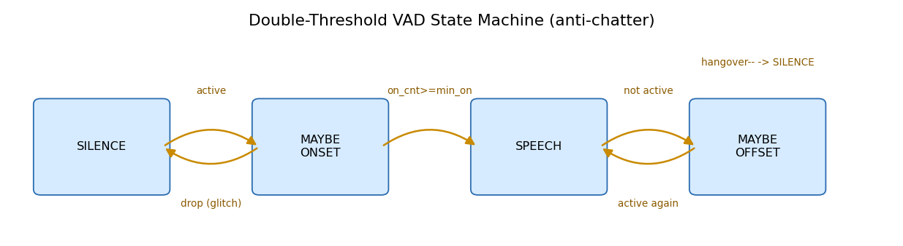
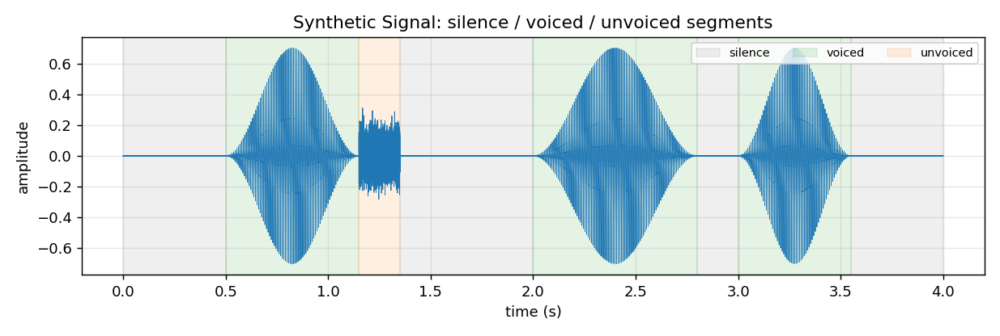
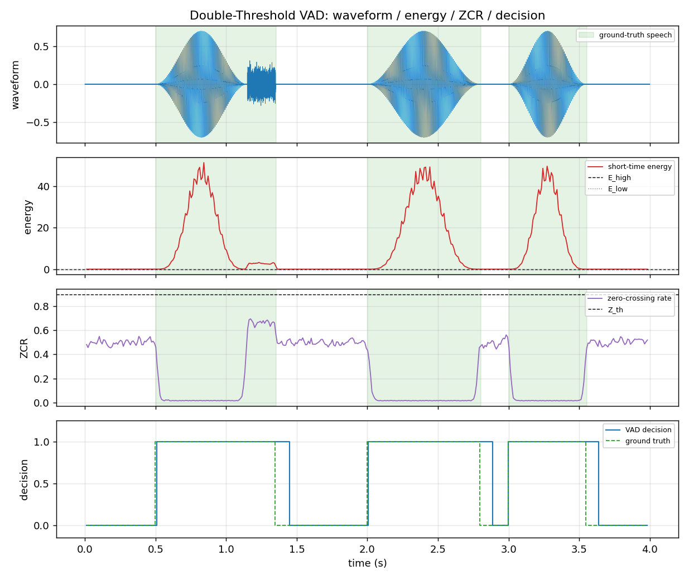
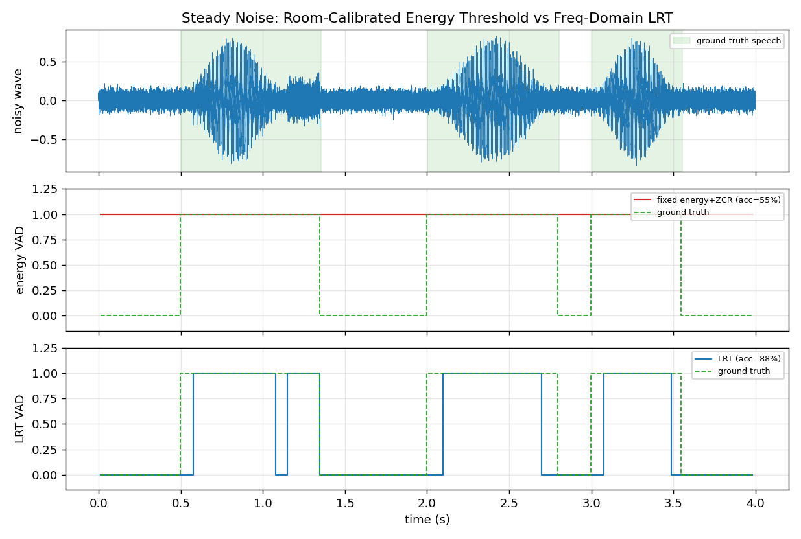

# 系列 4 · VAD 语音端点检测 —— 从双门限到统计模型

> 关键词：VAD / 短时能量 / 过零率 / 双门限状态机 / 似然比检验(LRT) / 先验后验 SNR
> 配套代码：本文文末《完整可跑代码》　|　符号约定见 [`STYLE.md`](../STYLE.md)

---

## 0. TL;DR + 解决什么问题

**一句话**：VAD（Voice Activity Detection，语音端点检测）要回答一个看似简单的问题——**这一帧音频到底有没有人在说话？**

**为什么难**：静音里混着风扇声、键盘声、远处的说话声；语音里又有能量极低的清辅音（`s`、`f`、`sh`）。判早了把噪声当语音送进后级（AEC/降噪/ASR）白白耗算力、还污染噪声估计；判晚了把字头字尾切掉，用户听到「丢字」。

**这篇讲什么**：
- 用**短时能量 + 过零率**搭一个「双门限 + 状态机」的经典 VAD，理解它为什么简单有效、又为什么怕稳态噪声；
- 升级到**频域似然比检验（LRT）**的统计模型，把判决依据从「拍脑袋的能量阈值」换成「哪种假设更可能」；
- 用 NumPy 把两者都跑一遍，在稳态噪声下直观看到 LRT 的鲁棒性优势。

> ⭐ **结论先行**：能量门限判的是「响不响」，统计模型判的是「像不像语音」。前者的阈值绑死在绝对音量上，环境一变就崩；后者在 **SNR 域**判决，噪声底自动被归一化掉，这才是它更抗噪的根。

---

## 1. 工程痛点：一帧音频判错，会发生什么

设想一个会议降噪管线：麦克风每 **10ms** 吐出一帧，VAD 给每帧打个 0/1 标签，下游据此决定：

- **降噪模块**：只在 VAD=0（静音）的帧上更新噪声功率估计 `λ_d`（这正是系列 3B 的 MCRA 需要的「纯噪声帧」）；
- **AEC**：静音帧里冻结/放心更新滤波器；
- **ASR**：只把 VAD=1 的段送去识别，省算力。

现在看两种典型翻车：

**场景 A — 把噪声当语音（false alarm）**：房间里有台老空调，持续「嗡——」。VAD 一直报「有人说话」。后果：降噪模块**永远等不到纯噪声帧**，噪声估计停在初始值，越降越糊；ASR 收到一堆嗡嗡声，蹦出幽灵文字。

**场景 B — 把语音当噪声（miss）**：用户说「**s**tart」，开头那个清辅音 `s` 能量只有元音的百分之几。纯能量门限直接把它划成静音，字头被吞，识别成 "tart"。

> 🔥 **面试追问**：VAD 的漏检（miss）和虚警（false alarm）哪个危害大？
> **答**：看下游。对 **ASR** 前端，漏检（切掉字头字尾）直接掉准确率，通常更痛；对 **降噪的噪声估计**，虚警更致命——它会让「纯噪声帧」永远拿不到，噪声谱估计失效。所以工业界常按下游模块给 VAD 配**不同的偏置**：送 ASR 的 VAD 宁可多报（低漏检），供噪声估计的 VAD 宁可谨慎（低虚警）。

---

## 2. 直觉解释：两块表 + 两道栅栏

先别碰公式。把 VAD 想成一个值班员，桌上摆着两块表：

- **短时能量表**（音量表）：一帧信号平方求和，就是这帧「多响」。浊音（元音）能量大，指针猛跳；静音贴着底。
- **过零率表**（音调粗糙度表）：一帧里波形穿过零轴多少次。低频的浊音波形圆滑、过零少；高频的清辅音和白噪声波形毛糙、过零密。

单看一块表都会被骗：
- 只看能量：清辅音 `s` 能量低 → 被当静音（场景 B）；稳态噪声能量不低 → 被当语音（场景 A）。
- 只看过零率：清辅音和白噪声的过零率都高，分不开。

**两块表一起看**就聪明多了：「能量高」→ 大概率浊音；「能量不高但过零率高」→ 可能是清辅音，别急着丢。

再谈**双门限**这个名字。判决不能拿一个阈值一刀切——信号在阈值附近抖一下，输出就 0101 乱跳（chatter）。于是设**两道栅栏**：

- **高门限 `E_high`**：只有冲破它才敢说「确实开始说话了」；
- **低门限 `E_low`**：一旦进入语音态，要一直掉到它以下才考虑「结束」。

高进低出，中间夹一条「迟滞带」（hysteresis），像**恒温空调**：到 26℃ 才制冷、降到 24℃ 才停，不会在 25℃ 反复开关。再配一个**状态机**（静音 → 可能起始 → 语音 → 可能结束）记住「我现在处于什么阶段」，就能稳稳地防抖。

**统计模型**是思路上的一次跃迁：与其纠结「能量到多少算语音」这个拍脑袋的阈值，不如问——**当前这帧频谱，在「只有噪声」和「语音+噪声」两种假设下，哪种更可能生成它？** 这就从「量音量」升级成了「比似然」。

---

## 3. 数学推导

### 3.1 短时能量与过零率

信号先分帧：帧长 `N`、帧移 `H`（本篇 `f_s=16000`，`N=400`≈25ms，`H=160`≈10ms，符号沿用 STYLE.md）。第 `t` 帧记为 `x_t[n]`，`n=0..N-1`。

**短时能量**：

```
E(t) = Σ_{n=0}^{N-1} x_t[n]²
```

> 人话翻译：把这一帧每个采样点平方后加起来，就是这帧「攒了多少能量」——本质是音量表读数。平方让大值更突出，也让正负不抵消。

**过零率（ZCR）**：

```
ZCR(t) = (1 / 2N) · Σ_{n=1}^{N-1} | sign(x_t[n]) − sign(x_t[n−1]) |
```

> 人话翻译：数这一帧里波形「由正变负 / 由负变正」发生了多少次，再除以样本数归一化到 `[0,1]`。相邻两点符号一样，差为 0；符号相反，差的绝对值为 2，前面的 `1/2` 把它折算成「一次过零」。读数高＝波形毛糙＝高频成分多（清辅音/噪声）。

### 3.2 双门限判决 + 状态机

先从开头假定为静音的 `noise_frames` 帧估出噪声底：`e_noise = mean(E[:K])`、`e_std = std(E[:K])`。三条门限：

```
E_high = e_noise + k_high · e_std      (k_high ≈ 8)
E_low  = e_noise + k_low  · e_std      (k_low  ≈ 2.5)
Z_th   = z_scale · mean(ZCR[:K])       (z_scale ≈ 1.8)
```

> 人话翻译：门限不写死成绝对数值，而是「噪声底 + 若干倍噪声起伏」——相当于让栅栏高度**随噪声底浮动**。高门限站得高（防虚警），低门限站得矮（防漏掉字尾）。

**帧级候选活跃**判据（能量 OR 清辅音补丁）：

```
active(t) = [ E(t) > E_high ]  OR  [ E(t) > E_low  AND  ZCR(t) > Z_th ]
```

> 人话翻译：能量直接冲破高门限，判活跃；或者能量只是过了低门限、但过零率很高（典型清辅音特征），也判活跃——这一条专门救 `s`/`f` 这类低能量高频音。

再把 `active(t)` 喂进 4 态状态机做防抖：

```
静音 SIL ──active──▶ 可能起始 MAYBE_ON ──连续 active ≥ min_on──▶ 语音 SPEECH
   ▲                      │ 不再 active(毛刺)                        │ not active
   │                      ▼                                          ▼
   └───────────── 打回 SIL                     可能结束 MAYBE_OFF ──hangover 帧内没等到 active──▶ SIL
                                                     ▲   │ active
                                                     └───┘ 回到 SPEECH
```



*图注：双门限 VAD 的 4 态状态机。`MAYBE_ON` 要连续 `min_on` 帧活跃才确认起始（滤掉单帧毛刺）；`MAYBE_OFF` 要连续 `hangover` 帧不活跃才判结束（防止字内换气被切断）。这就是双门限「抗抖」的机制来源。*

> ⭐ **结论**：双门限抗抖 = **迟滞（两条门限拉开距离）+ 时间约束（min_on 起始确认、hangover 结束延迟）**。缺了状态机，两条门限也只是两条线，照样在边界抖。

### 3.3 升级到似然比检验（LRT）

把问题搬到频域。每帧做 STFT 得复数谱 `X(t,f)`。对每个频点，设两种互斥假设：

```
H0 (只有噪声)     : X(t,f) = N(t,f)
H1 (语音 + 噪声)  : X(t,f) = S(t,f) + N(t,f)
```

经典统计模型（Sohn 1999）假设语音谱 `S` 与噪声谱 `N` 的实部、虚部都服从**零均值复高斯**，且各频点独立。于是单个频点的观测 `X(t,f)` 在两种假设下的条件概率密度为：

```
p(X | H0) = 1/(π λ_d) · exp( −|X|² / λ_d )
p(X | H1) = 1/(π (λ_d + λ_s)) · exp( −|X|² / (λ_d + λ_s) )
```

其中 `λ_d = E[|N|²]` 是噪声功率（系列 3B 里在线估计的那个），`λ_s = E[|S|²]` 是语音功率。

> 人话翻译：H0 假设这个频点只是噪声，方差是 `λ_d`；H1 假设里面还叠了语音，方差涨到 `λ_d+λ_s`。同一个观测值，在方差更大的 H1 分布里出现「大幅度谱值」的概率更高——所以谱值越大，越像 H1。

定义两个 SNR（沿用 STYLE.md 符号）：

```
后验 SNR:  γ_post(t,f) = |X(t,f)|² / λ_d(t,f)        (观测谱 / 噪声功率)
先验 SNR:  ξ_prior(t,f) = λ_s(t,f) / λ_d(t,f)         (语音功率 / 噪声功率)
```

> 人话翻译：后验 SNR 是「这一帧实测谱比噪声底高多少倍」，能直接算；先验 SNR 是「干净语音本身比噪声高多少倍」，拿不到真值，得估。

**单频点似然比** `Λ(t,f) = p(X|H1)/p(X|H0)`，代入并化简：

```
Λ(t,f) = 1/(1 + ξ_prior) · exp( γ_post · ξ_prior / (1 + ξ_prior) )
```

取对数得到数值更稳的**对数似然比**：

```
log Λ(t,f) = γ_post · ξ_prior / (1 + ξ_prior) − log(1 + ξ_prior)
```

> 人话翻译：这个式子在给每个频点打分——分数由「后验 SNR × 一个随先验 SNR 增大而趋近 1 的权重」减去一个归一化项组成。频点越像「高 SNR 的语音」，得分越高。注意分数是 `|X|²/λ_d` 的函数，**噪声底 `λ_d` 被约掉了**，这就是它不吃「绝对音量」这一套的原因。

**整帧判决**：各频点独立，联合似然比是连乘，取对数变成求和；再对 `F` 个频点取平均（对数域取均值＝似然比的几何平均），与门限 `η` 比较：

```
Λ̄(t) = (1/F) · Σ_f log Λ(t,f)      判决:  Λ̄(t) > η  ⟹  H1 (语音)
```

> 人话翻译：把每个频点的「像不像语音」打分平均成一个整帧分数，超过门限 `η` 就判有语音。用几何平均（对数域求和取平均）而非算术平均，是为了不让个别频点的极端值主导整帧决策。

**怎么估先验 SNR `ξ_prior`？** 用系列 3A/3B 讲过的**判决引导（Decision-Directed, DD）**递推，把上一帧估出的干净谱功率和当前瞬时估计加权平滑：

```
ξ_prior(t) = α · |Ŝ(t−1)|² / λ_d(t)  +  (1−α) · max( γ_post(t) − 1, 0 )      (α ≈ 0.98)
```

> 人话翻译：先验 SNR 一半信「上一帧我认为的干净谱有多强」，一半信「这一帧实测比噪声高出的部分」。`α` 很大＝以历史为主，让估计平滑、抑制音乐噪声式的抖动。

**GMM 思路一句带过**：另一条统计路线不做频域高斯，而是把「能量类特征」用一个**双高斯混合模型**建模——一个高斯拟合静音簇、一个拟合语音簇，在线更新两簇均值方差，判决时比较特征落在哪个高斯下更可能。本质仍是「比似然」，只是把手工阈值换成了数据驱动的分布。

> ⭐ **结论**：LRT/GMM 相比双门限的根本升级，是把判决量从**绝对能量**换成了**归一化后的 SNR 似然**。门限 `η` 是对「SNR 有多高才算语音」的判断，与环境绝对音量解耦——所以换个房间不用重标定。

---

## 4. 代码实战

完整可跑脚本见 本文文末《完整可跑代码》，`python series-4.py` 一键产出全部配图。下面拆讲关键片段（变量均带 shape 注释）。

### 4.1 造一段带真值标签的信号

浊音用基频谐波叠加（低过零率、高能量），清辅音用高通白噪声（高过零率、低能量），静音只留极小本底噪声：

```python
def synth_signal():
    T = int(DURATION * FS)                   # 标量: 总样本数
    x = np.zeros(T)                          # [T]
    gt = np.zeros(T)                         # [T] 样本级真值 1=语音
    x += 1e-3 * RNG.standard_normal(T)       # [T] 录音本底噪声
    for (t0, t1, kind) in SEGMENTS:
        i0, i1 = int(t0 * FS), int(t1 * FS)
        tt = np.arange(i1 - i0) / FS         # [seg] 段内时间
        if kind == "voiced":                 # 浊音: 5 次谐波 + Hann 音节包络
            sig = sum(a * np.sin(2*np.pi*130*k*tt) for k, a in
                      enumerate([1,.7,.5,.35,.2], 1))     # [seg]
            env = 0.5*(1 - np.cos(2*np.pi*np.clip(tt/tt[-1],0,1)))  # [seg]
            x[i0:i1] += 0.35 * env * sig; gt[i0:i1] = 1
        elif kind == "unvoiced":             # 清音: 高通白噪 -> 高 ZCR 低能量
            w = RNG.standard_normal(i1-i0)                # [seg]
            x[i0:i1] += 0.06 * np.diff(np.concatenate([[0.], w]))
            gt[i0:i1] = 1
    return x, gt                             # [T], [T]
```



*图注：横轴时间(s)、纵轴幅度。绿色=浊音段（波形规整、幅度大），橙色=清音段（1.15–1.35s，波形毛糙、幅度小），灰色=静音。1.15–1.35s 那段就是专门用来考验「能量门限会不会吞清辅音」的。*

### 4.2 能量、过零率与双门限判决

```python
def short_time_energy(frames):               # frames # [num, N]
    return np.sum(frames ** 2, axis=1)        # [num]

def zero_crossing_rate(frames):              # frames # [num, N]
    s = np.sign(frames); s[s == 0] = 1.0      # [num, N]
    flips = np.abs(np.diff(s, axis=1))        # [num, N-1] 翻转处=2
    return 0.5 * np.mean(flips, axis=1)       # [num] 归一化到 [0,1]
```

双门限 + 状态机的核心循环（完整版含清辅音补丁与 hangover，见源码）：

```python
active = (E > E_high) | ((E > E_low) & (Z > Z_th))   # [num] 帧级候选
# 状态机: SIL -> MAYBE_ON -(连续 min_on 帧)-> SPEECH -> MAYBE_OFF -(hangover)-> SIL
```



*图注：四行共享时间轴。第 1 行波形、第 2 行短时能量（黑虚线=E_high、灰点线=E_low）、第 3 行过零率（黑虚线=Z_th）、第 4 行判决（蓝实线）对齐真值（绿虚线）。浅绿阴影是真值语音区间。可见清辅音段能量贴着 E_low 却靠高过零率被捞回，浊音段能量远超 E_high。安静环境下帧级准确率约 92.5%。*

### 4.3 频域 LRT VAD

```python
def lrt_vad(x, N, H, noise_frames=15, alpha=0.98, eta=0.4):
    frames, centers = frame_signal(x, N, H)          # [num, N]
    X = np.fft.rfft(frames * np.hanning(N)[None,:], axis=1)  # [num, F] 复数谱
    P = np.abs(X) ** 2                                # [num, F] 功率谱
    lam = np.mean(P[:noise_frames], axis=0) + 1e-10   # [F] 噪声功率 λ_d
    logLR = np.zeros(P.shape[0])                      # [num]
    xi_prev = P[0].copy()                             # [F] 上帧干净谱功率
    for t in range(P.shape[0]):
        gamma = np.minimum(P[t] / lam, 1e3)           # [F] 后验 SNR γ
        xi = alpha*(xi_prev/lam) + (1-alpha)*np.maximum(gamma-1, 0)  # [F] DD 先验 SNR
        xi = np.maximum(xi, 1e-6)                     # [F]
        llr_f = gamma*xi/(1+xi) - np.log1p(xi)        # [F] 每频点 log Λ
        logLR[t] = np.mean(llr_f)                     # 标量: 全频点几何平均
        G = xi/(1+xi)                                 # [F] 维纳增益
        xi_prev = (G**2) * P[t]                       # [F] 供下帧 DD
    return (logLR > eta).astype(float), logLR, centers
```

**关键对照实验**：把能量门限在**安静环境**标定好（`E_high/E_low/Z_th`），然后拿到**叠了稳态白噪 + 220Hz 工频嗡声**的信号上跑，对比它和 LRT：



*图注：三行共享时间轴。第 1 行带噪波形（浅绿=真值语音）；第 2 行「安静环境标定的固定能量门限」判决——稳态噪声把能量底整体抬高，固定门限被持续顶穿，满屏误报为语音，帧准确率坍到约 55%；第 3 行 LRT 判决——因为在 SNR 域判决、噪声功率 `λ_d` 被归一化掉，准确率保持在约 88%。这就是「统计模型比能量门限抗稳态噪声」的直接证据。*

> ⭐ **结论**：能量门限崩不是因为「白噪声太强」，而是因为它的阈值**绑死在绝对能量**上——环境噪声底一抬，标定好的栅栏就失效了。LRT 判的是 `|X|²/λ_d`（归一化 SNR），噪声底抬多少就被除掉多少，所以稳态噪声几乎不影响它。

（注：若在噪声信号上**重新自适应标定**能量门限，它也能恢复不少准确率——但这恰恰说明能量 VAD 严重依赖「当前环境的实时噪声估计」，而 LRT 把这份依赖显式建进了模型里。）


<!-- AUTO-EMBED:BEGIN 完整代码 由 scripts/embed_code.py 生成，勿手改 -->
### 完整可跑代码

> 以下为本篇配套的完整脚本，已实际执行通过。**直接复制保存为 `series-4.py`，`python series-4.py` 即可复现上面所有配图**（需 `numpy` / `scipy` / `matplotlib`）。

```python
# -*- coding: utf-8 -*-
"""系列 4 配套代码：VAD 语音端点检测 —— 从能量+过零率双门限到频域似然比 (LRT)。

运行:
    python code/series-4.py

产出 (figures/ 下, 前缀 s4_):
    s4_signal_overview.png   合成信号总览: 静音/浊音/清音/静音段 + 真值标注
    s4_state_machine.png     双门限判决状态机示意 (静音->可能起始->语音->结束)
    s4_double_threshold.png  波形 / 短时能量 / 过零率 / 判决 四图对齐
    s4_lrt_vs_energy.png     稳态强噪声下 能量门限 vs 频域LRT 的鲁棒性对比

图内文字一律英文, 避免中文字体缺失报错。
"""
import matplotlib
matplotlib.use("Agg")  # 无显示环境也能出图, 必须在 import pyplot 之前

import numpy as np
import matplotlib.pyplot as plt
from matplotlib.patches import FancyBboxPatch, FancyArrowPatch
from pathlib import Path

RNG = np.random.default_rng(2026)  # 结果可复现

FS = 16000                                   # 采样率 (Hz), 全系列默认
FIG_DIR = Path(__file__).resolve().parent.parent / "figures"
FIG_DIR.mkdir(parents=True, exist_ok=True)


# ======================================================================
# 1. 合成一段带 静音 / 浊音 / 清音 / 静音 的信号 (自带真值标签)
# ======================================================================
# 每段: (起始秒, 结束秒, 类型)。voiced=浊音(低ZCR高能量), unvoiced=清音(高ZCR低能量)
SEGMENTS = [
    (0.00, 0.50, "silence"),
    (0.50, 1.15, "voiced"),    # 一段元音
    (1.15, 1.35, "unvoiced"),  # 摩擦清辅音 (能量低但过零率高)
    (1.35, 2.00, "silence"),
    (2.00, 2.80, "voiced"),
    (2.80, 3.00, "silence"),
    (3.00, 3.55, "voiced"),
    (3.55, 4.00, "silence"),
]
DURATION = 4.0                               # 总时长 (秒)


def synth_signal():
    """按 SEGMENTS 合成时域信号, 并生成样本级真值语音掩码。

    返回:
        x     # [T]  干净信号 (仅含极小本底噪声)
        gt    # [T]  样本级真值, 1=语音(浊音或清音) 0=静音
    """
    T = int(DURATION * FS)                   # 标量: 总样本数
    x = np.zeros(T)                          # [T]
    gt = np.zeros(T)                         # [T] 真值掩码
    x += 1e-3 * RNG.standard_normal(T)       # [T] 录音本底噪声 (很小)

    for (t0, t1, kind) in SEGMENTS:
        i0, i1 = int(t0 * FS), int(t1 * FS)  # 段样本下标
        n = np.arange(i1 - i0)               # [seg] 段内局部索引
        tt = n / FS                          # [seg] 段内时间(秒)
        if kind == "voiced":
            # 浊音: 基频 f0 的谐波叠加 + 共振峰包络, 再乘缓慢起落的音节包络
            f0 = 130.0                       # 基频 (Hz)
            sig = np.zeros_like(tt)          # [seg]
            for k, amp in enumerate([1.0, 0.7, 0.5, 0.35, 0.2], start=1):
                sig += amp * np.sin(2 * np.pi * f0 * k * tt)  # 第k次谐波
            env = 0.5 * (1 - np.cos(2 * np.pi * np.clip(tt / tt[-1], 0, 1)))  # [seg] Hann 型音节包络
            x[i0:i1] += 0.35 * env * sig     # 写入浊音
            gt[i0:i1] = 1.0
        elif kind == "unvoiced":
            # 清音: 高通白噪声 -> 高过零率、能量偏低
            w = RNG.standard_normal(i1 - i0)             # [seg]
            hp = np.diff(np.concatenate([[0.0], w]))     # [seg] 一阶差分=简易高通
            x[i0:i1] += 0.06 * hp
            gt[i0:i1] = 1.0
        # silence 段不叠加 (仅保留本底噪声), gt 保持 0
    return x, gt


# ======================================================================
# 2. 分帧 + 短时能量 + 过零率
# ======================================================================
def frame_signal(x, N, H):
    """把一维信号切成重叠帧。

    参数:
        x   # [T]  输入信号
        N   # 标量 帧长(样本)
        H   # 标量 帧移(样本)
    返回:
        frames  # [num_frames, N]
        centers # [num_frames]  每帧中心样本下标 (用于时间对齐)
    """
    T = x.shape[0]
    num = 1 + (T - N) // H                    # 标量: 帧数
    idx = np.arange(N)[None, :] + H * np.arange(num)[:, None]  # [num, N] 每帧样本下标
    frames = x[idx]                           # [num, N]
    centers = H * np.arange(num) + N // 2      # [num]
    return frames, centers


def short_time_energy(frames):
    """短时能量 E(t) = Σ x[n]^2  (逐帧求平方和)。

    参数: frames # [num, N]
    返回: E      # [num]
    """
    return np.sum(frames ** 2, axis=1)         # [num]


def zero_crossing_rate(frames):
    """过零率 ZCR(t) = (1/2N) Σ |sign(x[n]) - sign(x[n-1])|, 取值 [0,1]。

    参数: frames # [num, N]
    返回: zcr    # [num]  每帧符号翻转样本占比
    """
    s = np.sign(frames)                        # [num, N] 符号
    s[s == 0] = 1.0                            # 约定 0 视作正, 避免虚假过零
    flips = np.abs(np.diff(s, axis=1))         # [num, N-1] 相邻符号差 (翻转处=2)
    return 0.5 * np.mean(flips, axis=1)        # [num]


# ======================================================================
# 3. 双门限 + 状态机 VAD
# ======================================================================
def double_threshold_vad(E, Z, noise_frames=15,
                          k_high=8.0, k_low=2.5, z_scale=1.8,
                          min_on=3, hangover=8):
    """能量+过零率双门限, 配 4 态状态机 (静音->可能起始->语音->结束) 做防抖。

    阈值从开头 noise_frames 帧(假设为静音)自适应估计。
    参数:
        E, Z         # [num]  短时能量 / 过零率
        noise_frames # 标量    用于估噪声底的帧数
        k_high/k_low # 能量高/低门限相对噪声底的倍数
        z_scale      # 过零率门限相对静音段 ZCR 的倍数 (抓清音)
        min_on       # 连续多少帧超限才确认起始 (滤毛刺)
        hangover     # 掉到门限下后再挂起多少帧才判结束 (防止字内换气被切断)
    返回:
        decision # [num]  1=语音 0=静音
        info     # dict   记录三条门限, 供画图
    """
    e_noise = np.mean(E[:noise_frames])                       # 标量: 能量噪声底
    e_std = np.std(E[:noise_frames]) + 1e-12
    E_high = e_noise + k_high * e_std                          # 能量高门限
    E_low = e_noise + k_low * e_std                           # 能量低门限
    Z_th = z_scale * (np.mean(Z[:noise_frames]) + 1e-6)       # 过零率门限

    # 帧级“候选活跃”: 能量够高, 或 (能量过低门限 且 过零率高) -> 抓清辅音
    active = (E > E_high) | ((E > E_low) & (Z > Z_th))        # [num] bool

    decision = np.zeros_like(E)                               # [num]
    state = "SIL"                                              # 静音
    on_cnt = 0                                                # 连续活跃计数
    hang = 0                                                  # 挂起倒计时
    onset_idx = 0                                             # 起始候选帧
    for t in range(E.shape[0]):
        if state == "SIL":
            if active[t]:
                state, on_cnt, onset_idx = "MAYBE_ON", 1, t
        elif state == "MAYBE_ON":
            if active[t]:
                on_cnt += 1
                if on_cnt >= min_on:
                    decision[onset_idx:t + 1] = 1.0            # 回填起始段
                    state = "SPEECH"
            else:
                state, on_cnt = "SIL", 0                       # 毛刺, 打回静音
        elif state == "SPEECH":
            decision[t] = 1.0
            if not active[t]:
                state, hang = "MAYBE_OFF", hangover
        elif state == "MAYBE_OFF":
            decision[t] = 1.0                                  # 挂起期仍算语音
            if active[t]:
                state = "SPEECH"
            else:
                hang -= 1
                if hang <= 0:
                    state = "SIL"
    info = dict(E_high=E_high, E_low=E_low, Z_th=Z_th)
    return decision, info


def fixed_threshold_vad(E, Z, E_high, E_low, Z_th, min_on=3, hangover=8):
    """用外部给定的固定门限跑同一套状态机 (模拟安静环境标定后拿去吵环境用)。

    参数:
        E, Z                    # [num]  能量 / 过零率
        E_high, E_low, Z_th     # 标量    预先标定好的固定门限
    返回:
        decision # [num]  1=语音 0=静音
    """
    active = (E > E_high) | ((E > E_low) & (Z > Z_th))       # [num] bool
    decision = np.zeros_like(E)                              # [num]
    state, on_cnt, hang, onset_idx = "SIL", 0, 0, 0
    for t in range(E.shape[0]):
        if state == "SIL":
            if active[t]:
                state, on_cnt, onset_idx = "MAYBE_ON", 1, t
        elif state == "MAYBE_ON":
            if active[t]:
                on_cnt += 1
                if on_cnt >= min_on:
                    decision[onset_idx:t + 1] = 1.0
                    state = "SPEECH"
            else:
                state, on_cnt = "SIL", 0
        elif state == "SPEECH":
            decision[t] = 1.0
            if not active[t]:
                state, hang = "MAYBE_OFF", hangover
        elif state == "MAYBE_OFF":
            decision[t] = 1.0
            if active[t]:
                state = "SPEECH"
            else:
                hang -= 1
                if hang <= 0:
                    state = "SIL"
    return decision


# ======================================================================
# 4. 频域似然比 (LRT) VAD  —— Sohn 统计模型
# ======================================================================
def lrt_vad(x, N, H, noise_frames=15, alpha=0.98, eta=0.4):
    """频域高斯统计模型的对数似然比 VAD。

    每个频点带噪谱在 H0(仅噪声)/H1(语音+噪声) 下建高斯模型,
    似然比 Λ_f = 1/(1+ξ) · exp( γξ/(1+ξ) ), 对全频点取几何平均后与门限 η 比较。
    参数:
        alpha # 判决引导 (DD) 平滑系数, 估计先验 SNR ξ
        eta   # 对数似然比几何平均的判决门限
    返回:
        decision # [num]  1=语音
        logLR    # [num]  每帧对数似然比几何平均 (log Λ)
        centers  # [num]  帧中心样本下标
    """
    frames, centers = frame_signal(x, N, H)         # [num, N]
    win = np.hanning(N)                              # [N] 分析窗
    X = np.fft.rfft(frames * win[None, :], axis=1)   # [num, F] 复数谱
    P = np.abs(X) ** 2                               # [num, F] 功率谱
    num, F = P.shape

    lam = np.mean(P[:noise_frames], axis=0) + 1e-10  # [F] 噪声功率谱 λ_d (开头静音帧估)
    logLR = np.zeros(num)                            # [num]
    xi_prev_pow = P[0].copy()                         # [F] 上一帧估计的“干净谱功率”

    for t in range(num):
        gamma = np.minimum(P[t] / lam, 1e3)          # [F] 后验 SNR γ = |X|²/λ_d
        # 判决引导估计先验 SNR ξ: 平滑上一帧干净谱 + 当前瞬时估计
        xi = alpha * (xi_prev_pow / lam) + (1 - alpha) * np.maximum(gamma - 1.0, 0.0)  # [F]
        xi = np.maximum(xi, 1e-6)                     # [F] 防止 log/除零
        # 每频点对数似然比: log Λ_f = γξ/(1+ξ) - log(1+ξ)
        llr_f = gamma * xi / (1.0 + xi) - np.log1p(xi)  # [F]
        logLR[t] = np.mean(llr_f)                      # 标量: 全频点几何平均 (log 域取均值)
        # 更新: 用维纳增益 G=ξ/(1+ξ) 得到本帧干净谱功率, 供下一帧 DD 使用
        G = xi / (1.0 + xi)                            # [F]
        xi_prev_pow = (G ** 2) * P[t]                  # [F]

    decision = (logLR > eta).astype(float)             # [num]
    return decision, logLR, centers


# ======================================================================
# 5. 工具: 帧级真值 + 准确率
# ======================================================================
def frame_ground_truth(gt_samples, centers, N, H):
    """把样本级真值按帧内语音占比 (>0.5) 转成帧级真值。

    参数:
        gt_samples # [T]   样本级真值
        centers    # [num] 帧中心
    返回:
        gt_frame   # [num]
    """
    frames, _ = frame_signal(gt_samples, N, H)         # [num, N]
    return (np.mean(frames, axis=1) > 0.5).astype(float)  # [num]


def accuracy(pred, gt):
    """帧级判决准确率 (%)。"""
    return 100.0 * np.mean(pred == gt)


def shade_gt(ax, gt_frame, centers, fs=FS, color="tab:green", alpha=0.12, label="ground-truth speech"):
    """在坐标轴上用浅色阴影标出真值语音区间 (帧级)。"""
    t = centers / fs
    on = False
    start = 0.0
    first = True
    for i in range(len(gt_frame)):
        if gt_frame[i] > 0.5 and not on:
            on, start = True, t[i]
        elif gt_frame[i] <= 0.5 and on:
            ax.axvspan(start, t[i], color=color, alpha=alpha,
                       label=(label if first else None))
            on, first = False, False
    if on:
        ax.axvspan(start, t[-1], color=color, alpha=alpha,
                   label=(label if first else None))


# ======================================================================
# 主流程
# ======================================================================
def main():
    N = 400                       # 帧长 25ms @16k
    H = 160                       # 帧移 10ms @16k
    x, gt = synth_signal()        # [T], [T]
    T = x.shape[0]
    t_axis = np.arange(T) / FS    # [T]
    print(f"[info] fs={FS} N={N}({1000*N/FS:.0f}ms) H={H}({1000*H/FS:.0f}ms) 总时长={DURATION}s")

    # ---- 特征 ----
    frames, centers = frame_signal(x, N, H)   # [num, N], [num]
    E = short_time_energy(frames)             # [num]
    Z = zero_crossing_rate(frames)            # [num]
    gt_frame = frame_ground_truth(gt, centers, N, H)   # [num]
    tc = centers / FS                         # [num] 帧中心时间

    # === 图1: 合成信号总览 + 段类型标注 ===
    fig, ax = plt.subplots(figsize=(9.5, 3.2))
    ax.plot(t_axis, x, lw=0.5, color="tab:blue")
    color_map = {"silence": "gray", "voiced": "tab:green", "unvoiced": "tab:orange"}
    seen = set()
    for (t0, t1, kind) in SEGMENTS:
        lab = kind if kind not in seen else None
        seen.add(kind)
        ax.axvspan(t0, t1, color=color_map[kind], alpha=0.12, label=lab)
    ax.set_title("Synthetic Signal: silence / voiced / unvoiced segments")
    ax.set_xlabel("time (s)")
    ax.set_ylabel("amplitude")
    ax.legend(loc="upper right", fontsize=8, ncol=3)
    ax.grid(True, alpha=0.3)
    fig.tight_layout()
    fig.savefig(FIG_DIR / "s4_signal_overview.png", dpi=130)
    plt.close(fig)

    # === 图2: 双门限状态机示意图 (纯示意, 不依赖数据) ===
    fig, ax = plt.subplots(figsize=(9.5, 2.6))
    states = ["SILENCE", "MAYBE\nONSET", "SPEECH", "MAYBE\nOFFSET"]
    xs = [0.5, 3.0, 5.5, 8.0]
    for name, xc in zip(states, xs):
        box = FancyBboxPatch((xc - 0.7, 0.4), 1.4, 1.2,
                             boxstyle="round,pad=0.08", fc="#d6ebff", ec="#2b6cb0")
        ax.add_patch(box)
        ax.text(xc, 1.0, name, ha="center", va="center", fontsize=9)

    def arrow(x0, x1, text, y=1.75, rad=0.0):
        ar = FancyArrowPatch((x0, 1.0), (x1, 1.0),
                             connectionstyle=f"arc3,rad={rad}",
                             arrowstyle="-|>", mutation_scale=14, color="#c98a00", lw=1.4)
        ax.add_patch(ar)
        ax.text((x0 + x1) / 2, y, text, ha="center", fontsize=7.5, color="#8a5a00")

    arrow(1.2, 2.3, "active", rad=-0.35)
    arrow(3.7, 4.8, "on_cnt>=min_on", rad=-0.35)
    arrow(2.3, 1.2, "drop (glitch)", y=0.15, rad=-0.35)
    arrow(6.2, 7.3, "not active", rad=-0.35)
    arrow(7.3, 6.2, "active again", y=0.15, rad=-0.35)
    ax.text(8.0, 2.15, "hangover-- -> SILENCE", ha="center", fontsize=7.5, color="#8a5a00")
    ax.set_xlim(-0.5, 9.5)
    ax.set_ylim(-0.2, 2.6)
    ax.axis("off")
    ax.set_title("Double-Threshold VAD State Machine (anti-chatter)")
    fig.tight_layout()
    fig.savefig(FIG_DIR / "s4_state_machine.png", dpi=130)
    plt.close(fig)

    # === 图3: 波形 / 能量 / 过零率 / 判决 四联图对齐 ===
    dec, info = double_threshold_vad(E, Z)     # [num], dict
    acc_dt = accuracy(dec, gt_frame)
    print(f"[info] double-threshold VAD frame accuracy = {acc_dt:.1f}%")

    fig, axes = plt.subplots(4, 1, figsize=(9.5, 8.0), sharex=True)
    axes[0].plot(t_axis, x, lw=0.4, color="tab:blue")
    shade_gt(axes[0], gt_frame, centers)
    axes[0].set_ylabel("waveform")
    axes[0].legend(loc="upper right", fontsize=7)
    axes[0].set_title("Double-Threshold VAD: waveform / energy / ZCR / decision")

    axes[1].plot(tc, E, color="tab:red", lw=1.0, label="short-time energy")
    axes[1].axhline(info["E_high"], color="k", ls="--", lw=0.8, label="E_high")
    axes[1].axhline(info["E_low"], color="gray", ls=":", lw=0.8, label="E_low")
    shade_gt(axes[1], gt_frame, centers, label=None)
    axes[1].set_ylabel("energy")
    axes[1].legend(loc="upper right", fontsize=7)

    axes[2].plot(tc, Z, color="tab:purple", lw=1.0, label="zero-crossing rate")
    axes[2].axhline(info["Z_th"], color="k", ls="--", lw=0.8, label="Z_th")
    shade_gt(axes[2], gt_frame, centers, label=None)
    axes[2].set_ylabel("ZCR")
    axes[2].legend(loc="upper right", fontsize=7)

    axes[3].plot(tc, dec, color="tab:blue", lw=1.2, drawstyle="steps-mid", label="VAD decision")
    axes[3].plot(tc, gt_frame, color="tab:green", lw=1.0, ls="--", drawstyle="steps-mid", label="ground truth")
    axes[3].set_ylim(-0.15, 1.25)
    axes[3].set_ylabel("decision")
    axes[3].set_xlabel("time (s)")
    axes[3].legend(loc="upper right", fontsize=7)
    for a in axes:
        a.grid(True, alpha=0.3)
    fig.tight_layout()
    fig.savefig(FIG_DIR / "s4_double_threshold.png", dpi=130)
    plt.close(fig)

    # === 图4: 稳态强噪声下 "静音室标定的固定能量门限" vs 频域LRT ===
    # 关键: 能量门限在安静环境标定好 (Ehi/Elo/Zth), 部署时环境变吵。
    # 稳态噪声把能量底整体抬高, 固定门限被持续顶穿 -> 满屏误判为语音;
    # LRT 用噪声功率 λ_d 做归一化(在 SNR 域判决), 门限随噪声自适应, 因此更鲁棒。
    _, info_clean = double_threshold_vad(E, Z)           # 安静环境标定的门限
    Ehi, Elo, Zth = info_clean["E_high"], info_clean["E_low"], info_clean["Z_th"]

    noise = 0.05 * RNG.standard_normal(T)                # [T] 稳态白噪
    hum = 0.05 * np.sin(2 * np.pi * 220 * t_axis)        # [T] 220Hz 稳态嗡声(风扇/工频)
    x_noisy = x + noise + hum                            # [T]

    frames_n, centers_n = frame_signal(x_noisy, N, H)
    E_n = short_time_energy(frames_n)                     # [num]
    Z_n = zero_crossing_rate(frames_n)                    # [num]
    dec_e = fixed_threshold_vad(E_n, Z_n, Ehi, Elo, Zth)  # 用安静环境的固定门限
    dec_l, logLR, centers_l = lrt_vad(x_noisy, N, H, eta=0.4)  # 频域 LRT
    gt_f = frame_ground_truth(gt, centers_n, N, H)
    acc_e = accuracy(dec_e, gt_f)
    acc_l = accuracy(dec_l, gt_f)
    print(f"[info] noisy: fixed-energy-threshold acc={acc_e:.1f}%  |  LRT acc={acc_l:.1f}%")

    tcn = centers_n / FS
    fig, axes = plt.subplots(3, 1, figsize=(9.5, 6.4), sharex=True)
    axes[0].plot(t_axis, x_noisy, lw=0.4, color="tab:blue")
    shade_gt(axes[0], gt_f, centers_n)
    axes[0].set_ylabel("noisy wave")
    axes[0].legend(loc="upper right", fontsize=7)
    axes[0].set_title("Steady Noise: Room-Calibrated Energy Threshold vs Freq-Domain LRT")

    axes[1].plot(tcn, dec_e, color="tab:red", lw=1.2, drawstyle="steps-mid",
                 label=f"fixed energy+ZCR (acc={acc_e:.0f}%)")
    axes[1].plot(tcn, gt_f, color="tab:green", lw=1.0, ls="--", drawstyle="steps-mid", label="ground truth")
    axes[1].set_ylim(-0.15, 1.25)
    axes[1].set_ylabel("energy VAD")
    axes[1].legend(loc="upper right", fontsize=7)

    axes[2].plot(tcn, dec_l, color="tab:blue", lw=1.2, drawstyle="steps-mid",
                 label=f"LRT (acc={acc_l:.0f}%)")
    axes[2].plot(tcn, gt_f, color="tab:green", lw=1.0, ls="--", drawstyle="steps-mid", label="ground truth")
    axes[2].set_ylim(-0.15, 1.25)
    axes[2].set_ylabel("LRT VAD")
    axes[2].set_xlabel("time (s)")
    axes[2].legend(loc="upper right", fontsize=7)
    for a in axes:
        a.grid(True, alpha=0.3)
    fig.tight_layout()
    fig.savefig(FIG_DIR / "s4_lrt_vs_energy.png", dpi=130)
    plt.close(fig)

    print("[done] figures saved to", FIG_DIR)


if __name__ == "__main__":
    main()
```
<!-- AUTO-EMBED:END -->

---

## 5. 工程踩坑 + 面试追问三连

**踩坑 1：帧长 `N` 与延迟的死结。** 帧越长，能量/谱估计越稳（方差小），但 VAD 的时间分辨率越差、算法延迟越大。语音处理常取 **20–32ms**（这里用 25ms）：短于 20ms 谱估计噪，长于 32ms 会糊掉快速的音素边界、字头字尾切不准。

**踩坑 2：`hangover`（挂起）不能省。** 人说话时词内有大量短停顿（塞音闭合段、换气），能量会瞬间掉下去。没有 hangover，一个词会被切成好几段。但 hangover 太长又会把词尾拖出一截噪声。经验值 **50–200ms**（本篇 8 帧≈80ms）。

**踩坑 3：噪声底估计要在线更新。** 本篇 demo 用「开头 15 帧」一次性估 `λ_d`，工程里环境噪声会漂移，必须像系列 3B 的 **MCRA/最小值统计** 那样持续更新，否则空调突然开机，VAD 立刻全线虚警。

**踩坑 4：DD 平滑系数 `α`。** `α` 太小，先验 SNR 抖，判决在边界反复横跳；`α` 太大（如 0.99），起始响应变迟钝，字头延迟。0.95–0.98 是常见折中。

> 🔥 **面试追问一**：双门限为什么能抗抖，只有一个门限行不行？
> **答**：单门限在阈值附近，信号的微小起伏就会让输出 0/1 反复翻转（chatter）。双门限拉开 `E_high`（进入）和 `E_low`（退出）形成**迟滞带**，进入和退出走不同的线，边界抖动被吸收；再加状态机的 `min_on`（连续 N 帧才确认起始，滤毛刺）和 `hangover`（连续 N 帧才确认结束，防切断），时间维度也上了双保险。本质是**空间迟滞 + 时间约束**双管齐下。

> 🔥 **面试追问二**：能量 VAD 为什么怕稳态噪声，而 LRT 不怕？
> **答**：能量 VAD 的判决量是**绝对能量** `E(t)`，阈值也是绝对值。稳态噪声（空调、风扇、工频）把每一帧的能量底整体抬高，固定阈值被持续顶穿，全判成语音。LRT 的判决量是 `log Λ`，它是**后验 SNR** `γ=|X|²/λ_d` 的函数——噪声功率 `λ_d` 出现在分母，噪声底抬高时分子分母同步涨，比值几乎不变。换句话说 LRT 在 **SNR 域**判决，天然对「均匀抬高的稳态噪声」免疫；它真正怕的是**非稳态噪声**（突发敲击、另一个人说话），因为那会让 `λ_d` 估不准。

> 🔥 **面试追问三**：帧长和延迟怎么权衡，实时系统里 VAD 的延迟从哪来？
> **答**：延迟主要两块。① **帧长/前瞻**：要判当前帧往往得等它采满（N 个样本），若还带前瞻窗看未来几帧会更准但更慢。② **hangover**：结束判决被故意延后若干帧以防切断，这部分是「结束延迟」，不影响起始。实时系统里起始延迟最敏感（用户感知「反应慢」），常用短帧 + 小 `min_on` 抢起始，用大 `hangover` 保结束——两端用不对称的时间常数。

---

## 6. 小结 + 下篇预告 + 思考题

**这篇的主线**：
- 短时能量像音量表、过零率像音调粗糙度表，两块表合看能同时抓住浊音（高能量）和清辅音（高过零率）；
- 双门限的抗抖来自「迟滞带 + 状态机的时间约束」，而非门限本身；
- 能量门限的阿喀琉斯之踵是「绑死绝对音量」，稳态噪声一抬底就崩；
- LRT 把判决搬进频域、用 `H0/H1` 高斯模型算对数似然比，在 **SNR 域**判决，天然抗稳态噪声；先验 SNR 用判决引导（DD）递推估计；GMM 则用双高斯把手工阈值换成数据驱动的分布。

**与全局的连接**：VAD 判出的「纯噪声帧」正是系列 3B 噪声估计（MCRA）的输入，静音段判定也服务于系列 5 AGC 的增益冻结。VAD 不是孤立模块，它是整个 3A 管线的「节拍器」。

**下篇预告（系列 5 · AGC 与压缩器）**：录音忽大忽小怎么自动拉平？压缩器的阈值/压缩比/拐点如何塑形动态范围？Attack/Release 时间常数为什么决定「喘息感」？

**思考题**：
1. 本篇 LRT 对全频点取几何平均。如果说话人是女声（能量集中在中高频），只对语音常驻的频段（如 300–3400Hz）加权平均，判决会更准吗？代价是什么？
2. 双门限里若把 `min_on` 设为 1（单帧即确认起始），起始延迟最小，但会带来什么问题？在什么下游场景下这个取舍是划算的？
3. LRT 的噪声底 `λ_d` 在 demo 里只在开头估一次。如果中途有人开了空调（噪声底阶跃抬升），LRT 会怎样误判？该用系列 3B 的哪个机制来补救？
