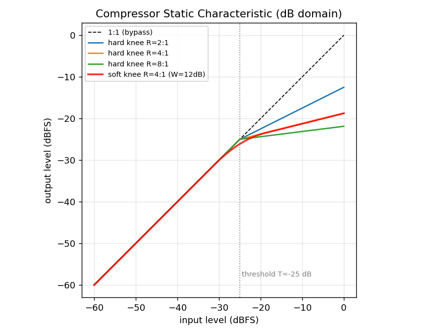
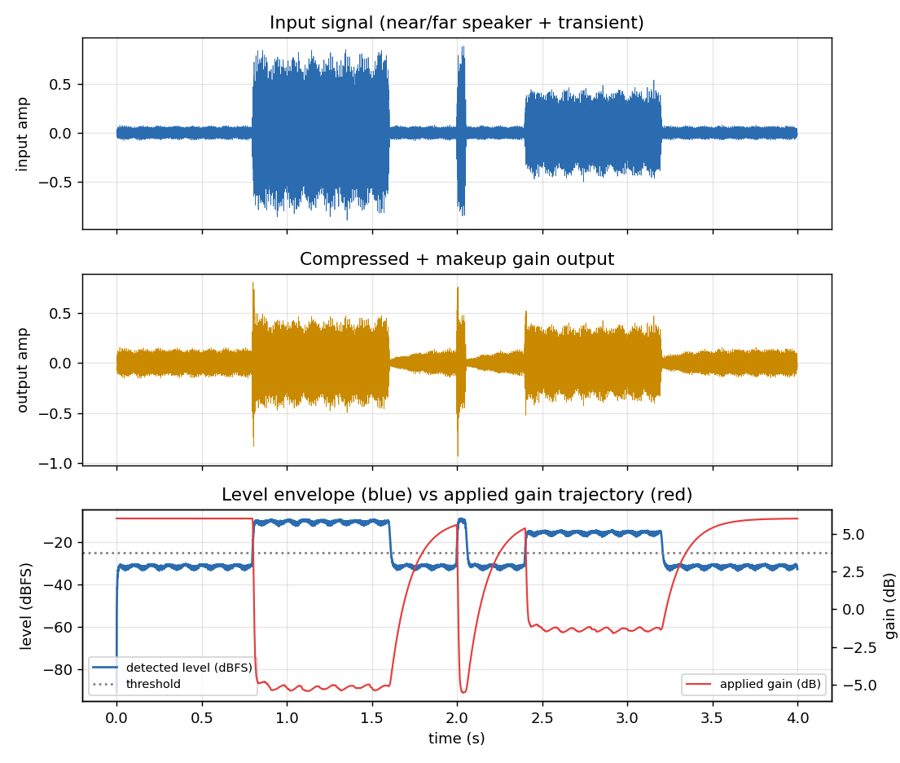
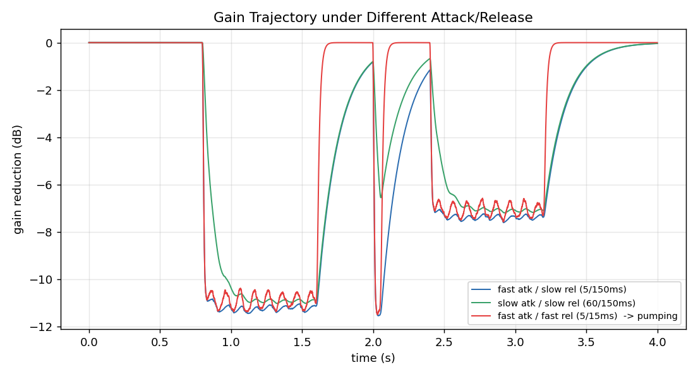
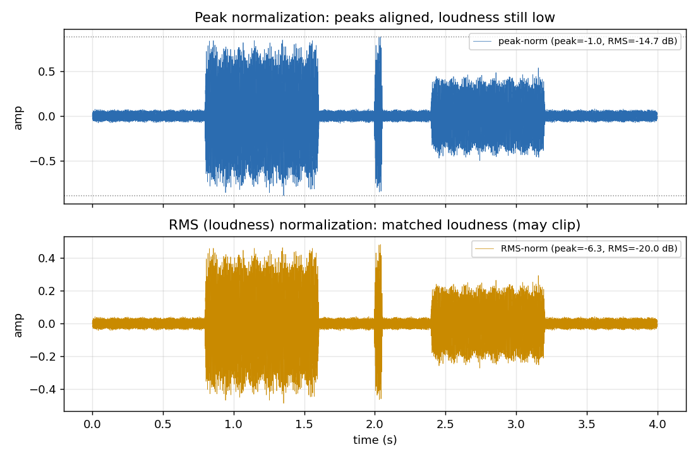

# 系列 5：AGC 与压缩器 —— 增益的"自动驾驶"与响度归一化

## 0. TL;DR + 解决什么问题

**TL;DR**：说话人忽远忽近，录音电平就像坐过山车——远场时对端根本听不清，凑到麦克风前又直接爆音。本篇讲清楚三件事：

- **压缩器（Compressor）** 用一条静态特性曲线（阈值 `T`、压缩比 `R`、拐点 `knee`）把动态范围"装上弹簧"：大声压小、小声不动，再靠补偿增益整体抬起。
- **Attack / Release** 两个一阶时间常数决定增益变化的快慢，也决定了那种恼人的"喘息感"（pumping）从哪来。
- **AGC** 是这套机制的"自动驾驶"外壳；最后为什么要用**响度归一化（RMS/LUFS）**而不是**峰值归一化**——因为人耳听的是能量，不是那一根最高的针。

> ⭐ **一句话结论**：压缩器塑形动态范围（把"忽大忽小"压平），AGC 自动开车（跟随长时电平调总增益），响度归一化对齐听感（让不同素材"一样响"）。三者解决的是同一个痛点的不同时间尺度。

配套代码：本文文末《完整可跑代码》，一键产出全部配图。

---

## 1. 工程痛点引入（一帧音频出错的故事）

先讲个真实场景。你在做一个语音会议 App，测试同事戴着耳机、抱着笔记本满屋子走。后台收到的音频波形长这样：

- **0.0–0.8s**：他在房间另一头，麦克风离嘴 2 米，采集电平大概 -38 dBFS。对端把音量开到最大，还是像蚊子哼。
- **0.8–1.6s**：他凑到屏幕前认真说话，电平飙到 -1 dBFS，逼近满量程。对端耳朵一激灵——**爆音（clipping）**。
- **2.0s**：他一激动拍了下桌子，一个瞬态直接顶到 0 dBFS。
- **2.4–3.2s**：坐回椅子，电平回落到 -6 dBFS 左右。

同一段话，电平差了将近 40 dB（相差 100 倍幅度）。你不可能要求每个用户都当调音师，实时盯着推子。**这就是 AGC（Automatic Gain Control）要解决的问题**：让机器替用户实时调那个"音量推子"。

而 AGC 的核心执行机构，正是**压缩器**——它决定"这一帧电平这么高，我该压多少、多快压下去"。参数没调好，你会遇到两类翻车：

- 压得太狠太快 → 波形被削出棱角，听感发**闷、发脏**（失真）。
- 松得太快 → 每个字的间隙里底噪被"呼"地抬起又压下，像有人在你耳边**喘气**（pumping / breathing）。

本篇就把这套机制从曲线到时间常数拆开讲透。

---

## 2. 直觉解释（比喻先行，不讲数学）

### 压缩器 = 给动态范围装弹簧

想象你家水龙头水压忽大忽小。**限压阀**的作用是：水压低于某个值时完全不管（水照常流），一旦超过阈值，阀门就开始"顶回去"——压力越高，顶得越狠，但不是一刀切断，而是留一条更"硬"的斜坡。

压缩器对音频电平做的是同一件事：

- **阈值 `T`（threshold）**：低于它不管，高于它才开始压。
- **压缩比 `R`（ratio）**：阈值之上，输入每涨 4 dB、输出只涨 1 dB，就是 `R=4:1`。`R` 越大弹簧越硬，`R→∞` 就成了"限幅器（limiter）"，一堵墙。
- **拐点 `knee`**：阀门是"啪"地一下开始顶（硬拐点），还是在阈值附近平滑地渐渐使劲（软拐点）。软拐点听起来更自然。

压完之后大声被摁住了，整段的**峰值**降下来了，这时就有富余空间做**补偿增益（makeup gain）**——把整段统一抬高。净效果：大声没那么炸，小声被抬起来了，**动态范围被压窄**，对端听着舒服。

### Attack / Release = 弹簧的反应快慢

弹簧不是瞬间到位的。

- **Attack（起控时间）**：电平冲高时，压缩器多快"扑上去"把它摁住。快 = 连瞬态（拍桌子那一下）都能抓住；太快 = 连一个个波形周期都跟着压，把正弦削成畸形波，产生失真。
- **Release（释控时间）**：电平回落后，压缩器多快"松手"恢复增益。慢 = 平滑、自然；太快 = 一停顿就猛地把底噪抬起来，一开口又压下去，听感像喘气（pumping）。

> ⭐ **直觉锚点**：Attack 管"抓得多快"，Release 管"松得多稳"。**快抓、慢放**是语音场景最常见的稳妥配置。

### AGC = 音量的自动驾驶

压缩器盯的是"这几十毫秒"的瞬时电平。AGC 站得更高，盯的是"这几秒"的长时平均电平：说话人走远了、整体偏小，AGC 就把总增益缓慢往上推；他凑近了，就缓慢往下收。它像定速巡航——不管路面小颠簸（那是压缩器的活），只管把巡航速度（长时响度）稳住。

---

## 3. 数学推导（符号遵循 STYLE.md）

约定：以满量程幅度 `1.0` 为 `0 dBFS`。线性幅度 `a` 与 dB 电平的换算：

$$
L_\text{dB} = 20\log_{10}(|a| + \epsilon), \qquad a = 10^{L_\text{dB}/20}
$$

> **人话翻译**：dB 只是把"幅度"换算成对数刻度，因为人耳对响度的感知本来就接近对数。`ε` 是个极小数，防止对 0 取对数炸掉。

### 3.1 静态特性曲线（硬拐点）

设输入电平 `x_dB`、阈值 `T`、压缩比 `R`。输出电平 `y_dB`：

$$
y_\text{dB} =
\begin{cases}
x_\text{dB}, & x_\text{dB} \le T \\[4pt]
T + \dfrac{x_\text{dB} - T}{R}, & x_\text{dB} > T
\end{cases}
$$

> **人话翻译**：没超过阈值 `T` 的部分原封不动过去；超过的部分，把"超出量"除以压缩比 `R` 再接回阈值上。`R=4` 就是超出 8 dB 只让它冒出 2 dB。`R=1` 等于没压，`R=∞` 就是死顶在 `T`（限幅）。

由此得到**增益（gain reduction）**，也就是要施加到信号上的增益量（`≤0`，即衰减）：

$$
g_\text{target}(x_\text{dB}) = y_\text{dB} - x_\text{dB}
$$

> **人话翻译**：目标增益 = 想要的输出电平 - 当前输入电平。阈值以下这个值恒为 0（不动），阈值以上是个负数（往下压）。

### 3.2 软拐点（soft knee）

硬拐点在 `x_dB = T` 处斜率从 1 突变到 1/R，听感生硬。软拐点在阈值附近开一个宽度为 `W` 的过渡区 `[T - W/2, T + W/2]`，用二次曲线让斜率**平滑地**从 1 降到 1/R：

$$
y_\text{dB} = x_\text{dB} + \left(\frac{1}{R} - 1\right)\frac{\left(x_\text{dB} - T + \tfrac{W}{2}\right)^2}{2W},
\quad |x_\text{dB} - T| \le \tfrac{W}{2}
$$

> **人话翻译**：在阈值上下各 `W/2` 的这一小段里，用一条抛物线把"不压"和"按 1/R 压"平滑焊接起来，不让弹簧"咯噔"一下才使劲。区间之外仍回到 3.1 的两段式。

### 3.3 电平检测（包络提取）

我们不能直接拿单个采样点的瞬时值当"电平"（它上下乱窜）。先整流再做**单极点平滑**得到包络 `env[n]`：

$$
\text{env}[n] = \alpha_\text{det}\,\text{env}[n-1] + (1-\alpha_\text{det})\,|x[n]|
$$

> **人话翻译**：把信号取绝对值（整流），再做一个"带记忆的滑动平均"，得到一条平缓跟随音量起伏的包络线，这才是拿去查静态曲线的"当前电平"。

### 3.4 增益平滑：Attack / Release 时间常数

静态曲线给出的 `g_target` 是"理想瞬时增益"，直接用会太生硬。用一阶递归平滑：

$$
g[n] = \alpha\, g[n-1] + (1-\alpha)\, g_\text{target}[n]
$$

其中平滑系数由时间常数 `τ` 与采样率 `f_s` 决定：

$$
\alpha = \exp\!\left(-\frac{1}{\tau\, f_s}\right)
$$

关键在于**用哪个 `τ` 取决于增益是在"变小还是变大"**：

$$
\alpha =
\begin{cases}
\alpha_\text{atk} = \exp\!\big(-1/(\tau_\text{atk} f_s)\big), & g_\text{target} < g[n-1] \ (\text{要压得更狠}) \\[4pt]
\alpha_\text{rel} = \exp\!\big(-1/(\tau_\text{rel} f_s)\big), & g_\text{target} \ge g[n-1] \ (\text{要松开})
\end{cases}
$$

> **人话翻译**：这就是那条"一阶低通"。`τ` 是时间常数——大约经过 `τ` 秒，增益走完到目标值的约 63%。电平**冲高、需要更多衰减**时走 Attack（通常几毫秒，快抓瞬态）；电平**回落、要恢复增益**时走 Release（通常上百毫秒，慢放防抽气）。`α` 越接近 1，反应越慢越平滑。

由此推出为什么两头都不能太快：

> ⭐ **结论**：Attack 太快（`τ_atk` 小到接近单个波形周期），增益会跟着每个正弦周期上下抖，等效于给波形做非线性调制 → 谐波失真、发闷；Release 太快，静音间隙里增益猛地弹回最大，把底噪一起抬起来，下一个字又压下去 → 周期性的"呼吸/抽气"感（pumping）。

### 3.5 补偿增益

压缩把峰值摁低后，整段留出了富余动态。补偿增益 `G_makeup`（dB）把整段统一抬起：

$$
y[n] = x[n]\cdot 10^{(g[n] + G_\text{makeup})/20}
$$

> **人话翻译**：压完之后整体偏小了，再乘一个固定的放大倍数把响度补回来。这一步让"大声被压、小声被抬"的净效果真正显现——动态范围变窄、整体更响。

### 3.6 峰值归一化 vs 响度归一化

**峰值归一化**：把整段最大绝对值缩放到目标峰值（如 -1 dBFS）：

$$
a_\text{peak} = \frac{10^{L_\text{target}/20}}{\max_n |x[n]|}
$$

> **人话翻译**：只看那一根最高的针，把它顶到接近满量程。问题是——如果整段只有一个瞬态很高、其余都很小，归一化后**听起来还是很小声**，因为人耳听的是平均能量，不是尖峰。

**响度归一化（RMS 思想）**：按均方根（能量）对齐到目标 RMS 电平（如 -20 dBFS）：

$$
\text{RMS}(x) = \sqrt{\frac{1}{N}\sum_{n} x[n]^2}, \qquad
a_\text{rms} = \frac{10^{L_\text{target}/20}}{\text{RMS}(x)}
$$

> **人话翻译**：按整段的"能量"来对齐，而不是按最高的那根针。这更接近人耳对"响不响"的判断——所以两段 RMS 相同的素材，主观响度也接近。

**LUFS 又是什么？** RMS 平等对待所有频率，但人耳对 2–4 kHz 最敏感、对低频不敏感。**LUFS（Loudness Units Full Scale，ITU-R BS.1770）** 在 RMS 之上加了两样东西：一个模拟人耳频响的 **K 加权滤波器**，以及一套**门限（gating）**机制把静音段排除在平均之外。

> ⭐ **结论**：峰值归一化保证"不爆音"，但不保证"一样响"；响度（RMS/LUFS）归一化保证"一样响"，代价是可能需要配合限幅器兜住偶发峰值。流媒体平台（YouTube/Spotify/播客）统一用 LUFS，就是为了让你切换视频时不用一直去够音量键。

---

## 4. 代码实战

完整脚本见 本文文末《完整可跑代码》，直接 `python series-5.py` 即可复现下面四张图。核心是一个逐样本的增益平滑压缩器：

```python
def compressor(x, T, R, W, atk_ms, rel_ms,
               det_ms=5.0, makeup_db=0.0, gate_db=-np.inf):
    Tn = x.shape[0]                                 # 标量: 样本数
    # 一阶时间常数 -> 平滑系数 alpha = exp(-1/(tau·f_s))
    a_det = np.exp(-1.0 / (det_ms * 1e-3 * FS))     # 标量: 检测器系数
    a_atk = np.exp(-1.0 / (atk_ms * 1e-3 * FS))     # 标量: attack 系数
    a_rel = np.exp(-1.0 / (rel_ms * 1e-3 * FS))     # 标量: release 系数

    env_db = np.empty(Tn)                           # [Tn] 电平包络 (dB)
    g_db = np.empty(Tn)                             # [Tn] 施加增益 (dB)
    env = EPS                                        # 标量: 线性包络状态
    g = 0.0                                          # 标量: 当前增益 (dB)

    for n in range(Tn):
        rect = abs(x[n])                             # 标量: 整流
        env = a_det * env + (1.0 - a_det) * rect     # 标量: 平滑包络
        lvl_db = to_db(env)                          # 标量: 当前电平 (dBFS)
        env_db[n] = lvl_db

        y_db = static_curve(np.array([lvl_db]), T, R, W)[0]  # 标量
        g_target = y_db - lvl_db                     # 标量: 目标增益 (<=0)

        if lvl_db < gate_db:                         # 静音冻结: 不抬噪声
            g_target = g

        # 增益变小(更多压制)用 attack, 变大(松开)用 release
        coef = a_atk if g_target < g else a_rel      # 标量
        g = coef * g + (1.0 - coef) * g_target       # g(t)=α·g(t-1)+(1-α)·g_target
        g_db[n] = g + makeup_db

    y = x * from_db(g_db)                             # [Tn] 施加线性增益
    return y, env_db, g_db
```

注意那句 `if lvl_db < gate_db: g_target = g`——这正是 **[系列 4（VAD）](./series-4.md) 的静音判定服务于增益冻结** 的落地点：当检测电平低于门限（等价于"这一帧没人说话"），我们**冻结增益、不再往上抬**，否则 Release 会把安静间隙里的底噪当成"变小的信号"拼命放大。

### 图 1：静态特性曲线



*横轴输入电平（dBFS）、纵轴输出电平（dBFS）。虚线是 1:1（不压）。阈值 `T=-25 dB` 以下所有曲线贴着对角线；以上则按 `R` 掰弯，`R` 越大越平。红色粗线是 `R=4:1` 的软拐点（`W=12 dB`），可见它在阈值附近平滑过渡，而非硬折角。结论：`R` 决定压制强度，`knee` 决定拐弯是否生硬。*

### 图 2：输入/输出包络 + 增益轨迹



*三联图。上：输入信号（远场很小 → 走近变大 → 2.0s 拍桌瞬态 → 回落）。中：压缩+补偿后的输出，大电平段被明显摁住，动态范围变窄。下：蓝线是检测到的电平包络，红线（右轴）是实际施加的增益——电平一过 -25 dB 阈值，增益立刻向下（Attack 快），电平回落后增益缓慢爬回（Release 慢）。控制台会打印输入/输出的 peak 与 RMS：输出峰值被压到 0 dBFS 以内、不再爆音。*

### 图 3：不同 Attack/Release 对比



*横轴时间、纵轴增益衰减量（dB）。蓝线"快攻慢放"（5/150ms）——干净利落地抓住瞬态又平稳恢复；绿线"慢攻慢放"（60/150ms）——瞬态来了半天才反应过来，会漏过尖峰；红线"快攻快放"（5/15ms）——增益在每个电平波动上剧烈抖动、频繁弹回 0，这就是 **pumping** 的波形证据。结论：语音场景选蓝线那种配置。*

### 图 4：峰值归一化 vs RMS（响度）归一化



*上：峰值归一化后，最高峰贴到 -1 dBFS（灰色虚线），但整段大部分区域依旧很小，图例里 RMS 仍然很低——"顶到头了却还是不够响"。下：RMS 归一化后整段能量对齐到 -20 dBFS RMS，主观响度稳定，代价是个别峰可能更高（生产中要再挂一个限幅器兜底）。控制台打印的两组 peak/RMS 数值印证了这个差异。*


<!-- AUTO-EMBED:BEGIN 完整代码 由 scripts/embed_code.py 生成，勿手改 -->
### 完整可跑代码

> 以下为本篇配套的完整脚本，已实际执行通过。**直接复制保存为 `series-5.py`，`python series-5.py` 即可复现上面所有配图**（需 `numpy` / `scipy` / `matplotlib`）。

```python
# -*- coding: utf-8 -*-
"""系列 5 配套代码：带 Attack/Release 的下压缩器 + 峰值/响度归一化对比。

运行:
    python code/series-5.py

产出 (figures/ 下, 前缀 s5_):
    s5_static_curve.png     压缩器静态特性曲线 (不同压缩比 R + 软/硬拐点)
    s5_envelope_gain.png    动态信号的输入/输出包络 + 增益轨迹 (dB)
    s5_attack_release.png    不同 Attack/Release 时间常数的增益轨迹对比 (pumping)
    s5_peak_vs_rms.png       峰值归一化 vs RMS(响度)归一化的波形与电平对比

图内文字一律英文, 避免中文字体缺失报错。
"""
import matplotlib
matplotlib.use("Agg")  # 无显示环境下也能出图, 必须在 pyplot 之前设置

import numpy as np
import matplotlib.pyplot as plt
from pathlib import Path

# 结果可复现
RNG = np.random.default_rng(2026)

FS = 16000  # 采样率 (Hz), 全系列默认
EPS = 1e-12  # 防 log(0)

# 配图输出目录 (相对项目根: 脚本在 code/ 下, 图存 figures/)
FIG_DIR = Path(__file__).resolve().parent.parent / "figures"
FIG_DIR.mkdir(parents=True, exist_ok=True)


# ----------------------------------------------------------------------
# dB <-> 线性 幅度换算 (以满量程 1.0 为 0 dBFS)
# ----------------------------------------------------------------------
def to_db(amp: np.ndarray) -> np.ndarray:
    """线性幅度 -> dBFS。amp 可为标量或数组。"""
    return 20.0 * np.log10(np.abs(amp) + EPS)


def from_db(db: np.ndarray) -> np.ndarray:
    """dB -> 线性增益。"""
    return 10.0 ** (db / 20.0)


# ----------------------------------------------------------------------
# 压缩器静态特性曲线 (dB 域), 带软拐点 (soft knee)
# ----------------------------------------------------------------------
def static_curve(x_db: np.ndarray, T: float, R: float, W: float = 0.0) -> np.ndarray:
    """输入电平 -> 输出电平 的静态映射 (全部 dB 域)。

    参数:
        x_db  # [K]   输入电平 (dBFS)
        T     # 标量   阈值 threshold (dBFS)
        R     # 标量   压缩比 ratio (>1)
        W     # 标量   拐点宽度 knee width (dB), 0 表示硬拐点
    返回:
        y_db  # [K]   输出电平 (dBFS)
    """
    x_db = np.asarray(x_db, dtype=np.float64)     # [K]
    over = x_db - T                                # [K] 超过阈值的量
    y = np.empty_like(x_db)                        # [K]

    if W <= 0:
        # 硬拐点: 阈值以下原样, 阈值以上按 1/R 斜率压缩
        below = over <= 0
        y[below] = x_db[below]
        y[~below] = T + over[~below] / R
        return y

    # 软拐点: 在 [T-W/2, T+W/2] 内用二次曲线平滑过渡
    lo = 2 * over < -W          # [K] 远低于阈值
    hi = 2 * over > W           # [K] 远高于阈值
    mid = ~(lo | hi)            # [K] 拐点过渡区
    y[lo] = x_db[lo]
    y[hi] = T + over[hi] / R
    # 过渡区: 二次插值, 斜率从 1 平滑降到 1/R
    y[mid] = x_db[mid] + (1.0 / R - 1.0) * (over[mid] + W / 2.0) ** 2 / (2.0 * W)
    return y


# ----------------------------------------------------------------------
# 带 Attack/Release 的下压缩器 (gain-smoothing 拓扑)
# ----------------------------------------------------------------------
def compressor(x: np.ndarray, T: float, R: float, W: float,
               atk_ms: float, rel_ms: float,
               det_ms: float = 5.0, makeup_db: float = 0.0,
               gate_db: float = -np.inf):
    """对时域信号做下压缩, 返回输出与中间轨迹 (用于画图)。

    参数:
        x         # [Tn]   输入时域信号 (线性, 峰值 ~1)
        T,R,W               静态曲线阈值/压缩比/拐点宽度
        atk_ms    # 标量    Attack 时间常数 (ms)
        rel_ms    # 标量    Release 时间常数 (ms)
        det_ms    # 标量    电平检测器 (包络) 时间常数 (ms)
        makeup_db # 标量    补偿增益 (dB)
        gate_db   # 标量    静音冻结门限: 检测电平低于此值时增益保持不变(不抬噪声)
    返回:
        y         # [Tn]   压缩后信号
        env_db    # [Tn]   检测到的输入电平包络 (dBFS)
        g_db      # [Tn]   平滑后施加的增益 (dB, 含 makeup)
    """
    Tn = x.shape[0]                                 # 标量: 样本数
    # 一阶时间常数 -> 平滑系数 alpha = exp(-1/(tau·f_s))
    a_det = np.exp(-1.0 / (det_ms * 1e-3 * FS))     # 标量: 检测器系数
    a_atk = np.exp(-1.0 / (atk_ms * 1e-3 * FS))     # 标量: attack 系数
    a_rel = np.exp(-1.0 / (rel_ms * 1e-3 * FS))     # 标量: release 系数

    env_db = np.empty(Tn)                           # [Tn] 电平包络 (dB)
    g_db = np.empty(Tn)                             # [Tn] 施加增益 (dB)

    env = EPS                                       # 标量: 线性包络状态
    g = 0.0                                         # 标量: 当前增益 (dB, 减量为负)

    for n in range(Tn):
        # --- 电平检测: 对 |x| 做单极点平滑, 得到瞬时电平 ---
        rect = abs(x[n])                            # 标量: 整流
        env = a_det * env + (1.0 - a_det) * rect    # 标量: 平滑包络
        lvl_db = to_db(env)                         # 标量: 当前电平 (dBFS)
        env_db[n] = lvl_db

        # --- 增益计算: 静态曲线给出目标增益(减量) ---
        y_db = static_curve(np.array([lvl_db]), T, R, W)[0]  # 标量
        g_target = y_db - lvl_db                     # 标量: 目标增益 (<=0)

        # --- 静音冻结: 电平过低则不更新增益, 避免把噪声抬起来 ---
        if lvl_db < gate_db:
            g_target = g

        # --- Attack/Release 平滑: 增益变小(更多压制)用 attack, 变大(松开)用 release ---
        coef = a_atk if g_target < g else a_rel      # 标量
        g = coef * g + (1.0 - coef) * g_target       # 标量: g(t)=α·g(t-1)+(1-α)·g_target
        g_db[n] = g + makeup_db

    y = x * from_db(g_db)                             # [Tn] 施加线性增益
    return y, env_db, g_db


# ----------------------------------------------------------------------
# 构造一段动态范围很大的测试信号: 忽远忽近的说话人
# ----------------------------------------------------------------------
def make_dynamic_signal():
    """合成一段电平起伏很大的类语音信号 (远->近->突发瞬态->远)。

    返回:
        x    # [Tn]  时域信号 (峰值约 0.9)
        t    # [Tn]  时间轴 (秒)
    """
    dur = 4.0                                        # 标量: 时长 (秒)
    Tn = int(dur * FS)                               # 标量: 样本数
    t = np.arange(Tn) / FS                           # [Tn] 时间轴

    # 载波: 两个共振峰的和, 模拟浊音基频+谐振
    carrier = (np.sin(2 * np.pi * 180 * t)
               + 0.5 * np.sin(2 * np.pi * 550 * t)
               + 0.3 * np.sin(2 * np.pi * 1200 * t))  # [Tn]
    # 叠一点气声噪声
    carrier = carrier + 0.15 * RNG.standard_normal(Tn)  # [Tn]
    carrier /= np.max(np.abs(carrier))                # [Tn] 归一化到 ~1

    # 电平包络: 分段模拟 远(小) -> 近(大) -> 远(小) + 一个突发大声
    env = np.full(Tn, 0.08)                           # [Tn] 默认远场小音量
    seg = lambda a, b: slice(int(a * FS), int(b * FS))
    env[seg(0.8, 1.6)] = 0.9                           # 走近: 大声
    env[seg(2.0, 2.05)] = 1.0                          # 突发瞬态 (拍桌子)
    env[seg(2.4, 3.2)] = 0.5                           # 中等
    # 平滑包络的硬边沿, 避免click
    k = np.ones(int(0.01 * FS)) / int(0.01 * FS)       # [win] 10ms 平滑核
    env = np.convolve(env, k, mode="same")             # [Tn]

    x = carrier * env                                  # [Tn] 最终信号
    x = 0.9 * x / np.max(np.abs(x))                    # [Tn] 峰值归一到 0.9
    return x, t


# ----------------------------------------------------------------------
# 归一化: 峰值 vs RMS(响度代理)
# ----------------------------------------------------------------------
def peak_normalize(x: np.ndarray, target_db: float = -1.0) -> np.ndarray:
    """峰值归一化到 target_db (dBFS)。"""
    peak = np.max(np.abs(x)) + EPS                     # 标量
    gain = from_db(target_db) / peak                   # 标量
    return x * gain                                    # [Tn]


def rms_normalize(x: np.ndarray, target_db: float = -20.0) -> np.ndarray:
    """RMS(响度)归一化到 target_db (dBFS RMS)。"""
    rms = np.sqrt(np.mean(x ** 2)) + EPS               # 标量
    gain = from_db(target_db) / rms                    # 标量
    return x * gain                                    # [Tn]


def rms_db(x: np.ndarray) -> float:
    """整段 RMS 电平 (dBFS)。"""
    return float(to_db(np.sqrt(np.mean(x ** 2))))


# ----------------------------------------------------------------------
# 主流程
# ----------------------------------------------------------------------
def main():
    # === 图1: 静态特性曲线 (不同 R + 硬/软拐点) ===
    x_db = np.linspace(-60, 0, 400)                    # [400] 输入电平扫描
    fig, ax = plt.subplots(figsize=(6.8, 5.2))
    ax.plot(x_db, x_db, "k--", lw=1.0, label="1:1 (bypass)")
    T = -25.0
    for R in [2, 4, 8]:
        ax.plot(x_db, static_curve(x_db, T=T, R=R, W=0.0),
                label=f"hard knee R={R}:1")
    ax.plot(x_db, static_curve(x_db, T=T, R=4, W=12.0),
            "r", lw=2.0, alpha=0.8, label="soft knee R=4:1 (W=12dB)")
    ax.axvline(T, color="gray", ls=":", lw=1.0)
    ax.text(T + 0.5, -58, f"threshold T={T:.0f} dB", fontsize=8, color="gray")
    ax.set_title("Compressor Static Characteristic (dB domain)")
    ax.set_xlabel("input level (dBFS)")
    ax.set_ylabel("output level (dBFS)")
    ax.legend(fontsize=8, loc="upper left")
    ax.grid(True, alpha=0.3)
    ax.set_aspect("equal")
    fig.tight_layout()
    fig.savefig(FIG_DIR / "s5_static_curve.png", dpi=130)
    plt.close(fig)

    # 构造动态信号
    x, t = make_dynamic_signal()                       # [Tn], [Tn]
    print(f"[info] input: peak={to_db(np.max(np.abs(x))):.1f} dBFS, "
          f"RMS={rms_db(x):.1f} dBFS")

    # === 图2: 输入/输出包络 + 增益轨迹 ===
    y, env_db, g_db = compressor(x, T=-25, R=4, W=6,
                                 atk_ms=5, rel_ms=120,
                                 makeup_db=6, gate_db=-55)
    print(f"[info] output: peak={to_db(np.max(np.abs(y))):.1f} dBFS, "
          f"RMS={rms_db(y):.1f} dBFS")

    fig, axes = plt.subplots(3, 1, figsize=(8.5, 7.2), sharex=True)
    axes[0].plot(t, x, lw=0.4, color="#2b6cb0")
    axes[0].set_ylabel("input amp")
    axes[0].set_title("Input signal (near/far speaker + transient)")
    axes[0].grid(True, alpha=0.3)

    axes[1].plot(t, y, lw=0.4, color="#c98a00")
    axes[1].set_ylabel("output amp")
    axes[1].set_title("Compressed + makeup gain output")
    axes[1].grid(True, alpha=0.3)

    axes[2].plot(t, env_db, label="detected level (dBFS)", color="#2b6cb0")
    axes[2].axhline(-25, color="gray", ls=":", label="threshold")
    ax2b = axes[2].twinx()
    ax2b.plot(t, g_db, label="applied gain (dB)", color="#e53e3e", lw=1.2)
    axes[2].set_ylabel("level (dBFS)")
    ax2b.set_ylabel("gain (dB)")
    axes[2].set_xlabel("time (s)")
    axes[2].set_title("Level envelope (blue) vs applied gain trajectory (red)")
    axes[2].grid(True, alpha=0.3)
    axes[2].legend(fontsize=8, loc="lower left")
    ax2b.legend(fontsize=8, loc="lower right")
    fig.tight_layout()
    fig.savefig(FIG_DIR / "s5_envelope_gain.png", dpi=130)
    plt.close(fig)

    # === 图3: 不同 Attack/Release 的增益轨迹对比 ===
    fig, ax = plt.subplots(figsize=(8.5, 4.6))
    configs = [
        ("fast atk / slow rel (5/150ms)", 5, 150, "#2b6cb0"),
        ("slow atk / slow rel (60/150ms)", 60, 150, "#38a169"),
        ("fast atk / fast rel (5/15ms)  -> pumping", 5, 15, "#e53e3e"),
    ]
    for label, atk, rel, c in configs:
        _, _, g = compressor(x, T=-25, R=4, W=6, atk_ms=atk, rel_ms=rel,
                             makeup_db=0, gate_db=-55)
        ax.plot(t, g, label=label, color=c, lw=1.1)
    ax.set_title("Gain Trajectory under Different Attack/Release")
    ax.set_xlabel("time (s)")
    ax.set_ylabel("gain reduction (dB)")
    ax.legend(fontsize=8, loc="lower right")
    ax.grid(True, alpha=0.3)
    fig.tight_layout()
    fig.savefig(FIG_DIR / "s5_attack_release.png", dpi=130)
    plt.close(fig)

    # === 图4: 峰值归一化 vs RMS(响度)归一化 ===
    xp = peak_normalize(x, target_db=-1.0)             # [Tn]
    xr = rms_normalize(x, target_db=-20.0)             # [Tn]
    print(f"[info] peak-norm : peak={to_db(np.max(np.abs(xp))):.1f} dBFS, "
          f"RMS={rms_db(xp):.1f} dBFS")
    print(f"[info] rms-norm  : peak={to_db(np.max(np.abs(xr))):.1f} dBFS, "
          f"RMS={rms_db(xr):.1f} dBFS")

    fig, axes = plt.subplots(2, 1, figsize=(8.5, 5.6), sharex=True)
    axes[0].plot(t, xp, lw=0.4, color="#2b6cb0",
                 label=f"peak-norm (peak={to_db(np.max(np.abs(xp))):.1f}, "
                       f"RMS={rms_db(xp):.1f} dB)")
    axes[0].axhline(from_db(-1.0), color="gray", ls=":", lw=0.8)
    axes[0].axhline(-from_db(-1.0), color="gray", ls=":", lw=0.8)
    axes[0].set_ylabel("amp")
    axes[0].set_title("Peak normalization: peaks aligned, loudness still low")
    axes[0].legend(fontsize=8, loc="upper right")
    axes[0].grid(True, alpha=0.3)

    axes[1].plot(t, xr, lw=0.4, color="#c98a00",
                 label=f"RMS-norm (peak={to_db(np.max(np.abs(xr))):.1f}, "
                       f"RMS={rms_db(xr):.1f} dB)")
    axes[1].set_ylabel("amp")
    axes[1].set_xlabel("time (s)")
    axes[1].set_title("RMS (loudness) normalization: matched loudness (may clip)")
    axes[1].legend(fontsize=8, loc="upper right")
    axes[1].grid(True, alpha=0.3)
    fig.tight_layout()
    fig.savefig(FIG_DIR / "s5_peak_vs_rms.png", dpi=130)
    plt.close(fig)

    print("[done] figures saved to", FIG_DIR)


if __name__ == "__main__":
    main()
```
<!-- AUTO-EMBED:END -->

---

## 5. 工程踩坑（调参经验 + 面试追问三连）

**踩坑 1：Attack 设成 0.1ms 想"抓得更准"，结果人声发闷发脏。**
Attack 短到和信号周期同量级时，增益开始跟着每个波峰波谷调制，等价于给波形乘了一个快速起伏的包络 → 产生新的谐波（互调失真）。人声基频 100–300 Hz，一个周期 3–10ms，Attack 一般给 5–20ms 才安全；只有做限幅器（保护不爆音）时才用亚毫秒级，且必须配前瞻（look-ahead）。

**踩坑 2：Release 设太短，安静段"呼呼"响。**
Release 太快时，字与字的间隙里增益迅速弹回，把底噪抬起来；下个字一来又压下去，形成周期性的响度起伏。经验值 Release 给 80–200ms，让恢复过程慢到人耳听不出单次动作。

**踩坑 3：AGC 不做静音冻结，越安静底噪越大。**
纯 AGC 追求"把电平拉到目标响度"，一旦进入静音段，它以为"信号太小了要使劲放"，于是把空调声、电流声一路放大到刺耳。必须用 VAD/能量门限（本篇 `gate_db`）在无语音时冻结增益，甚至反向做点衰减（downward expansion）。

**踩坑 4：只做峰值归一化就发布，用户狂按音量键。**
不同录音的峰值/RMS 关系天差地别。只对齐峰值，主观响度可能差 10 dB 以上。批量素材务必按 LUFS 对齐（如播客 -16 LUFS、流媒体 -14 LUFS）。

> 🔥 **面试追问三连**
>
> **Q1：Attack 太快为什么反而产生失真？**
> 因为当 Attack 时间常数缩短到与信号周期同量级，增益不再"平滑跟随包络"，而是跟着单个波形周期起伏——相当于用一个高频信号去调制原信号的幅度，数学上等价于引入乘性非线性，频域里冒出原本没有的谐波和边带，听感就是发闷、发脏。解决办法是把 Attack 拉长到远大于最低基频周期，或改用 look-ahead 限幅只在真正过冲时才瞬间动作。
>
> **Q2：Release 太快为什么会 pumping / 抽气？**
> Release 决定增益"松手"的速度。太快时，每当信号出现短暂停顿（字间、句间），增益立刻弹回接近 0 dB，把停顿里的底噪一起抬起；下一个音一来又被压回去。这种"抬起—压下"以音节节奏周期性重复，就成了听得见的呼吸/喘气声。把 Release 加长、或用双时间常数（快恢复大动作、慢恢复小动作）可缓解。
>
> **Q3：AGC 在静音段为什么要冻结增益？为什么最终用 LUFS 而不是峰值？**
> 静音段没有语音能量，若继续按"拉到目标响度"的逻辑工作，AGC 会把增益推到最大去放大纯噪声，导致底噪泵起、信噪比反而变差——所以要靠 VAD 判静音并冻结（甚至衰减）增益。而选 LUFS 是因为峰值只反映最高瞬间、和主观响度几乎不相关；LUFS 在 RMS 基础上加了模拟人耳灵敏度的 K 加权和排除静音的门限，是目前和"人觉得多响"相关性最好的客观指标，所以流媒体平台统一用它做响度归一化。

---

## 6. 小结 + 下篇预告 + 思考题

**小结**：

- 压缩器 = 动态范围的弹簧，三要素是**阈值 `T`、压缩比 `R`、拐点 `knee`**；静态曲线在 dB 域是分段线性（软拐点则在阈值附近抛物线过渡）。
- **Attack/Release** 是两个一阶时间常数，`α = exp(-1/(τ·f_s))`；快攻抓瞬态、慢放防抽气，两头过火分别导致失真和 pumping。
- **AGC** 是这套机制的自动驾驶外壳，跟随长时电平调总增益，并**必须在静音段冻结增益**（复用 VAD 判定）以免抬噪。
- 交付响度用**响度归一化（RMS→LUFS）**而非峰值归一化——人耳听的是能量与频率加权，不是那一根最高的针。

**下篇预告**：[系列 6 · 多麦阵列信号处理 —— 从延迟求和到 MVDR](./series-6.md)。前面所有篇章都在单麦的时域/频域里做文章，下一篇我们加上"空间"这一维：多个麦克风如何靠相位差"听清一个方向"，延迟求和为何是最朴素的空域滤波，MVDR 又如何在"保住目标、压掉干扰"之间求最优解。

**思考题**：

1. 本篇的检测器用的是对 `|x[n]|` 平滑（近似峰值检测）。如果改成对 `x[n]²` 平滑（RMS 检测），Attack/Release 的最优取值会偏大还是偏小？为什么？
2. 限幅器（`R→∞`）如果只靠调小 Attack 来"绝不过冲"，为什么仍然会漏过极短瞬态？要真正做到零过冲需要引入什么机制？（提示：因果性）
3. 若一段素材 LUFS 已达标但仍有偶发峰接近 0 dBFS，你会把限幅器放在响度归一化之前还是之后？两种顺序对最终 LUFS 各有什么影响？
