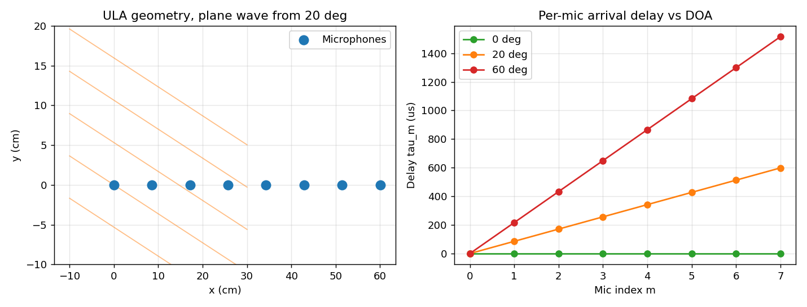
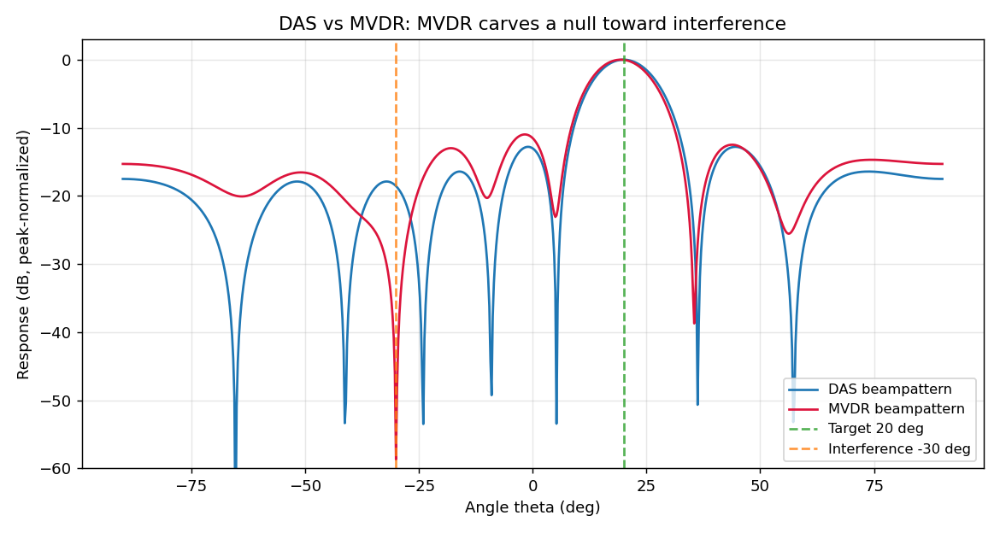
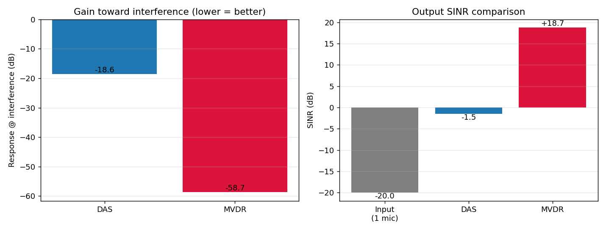
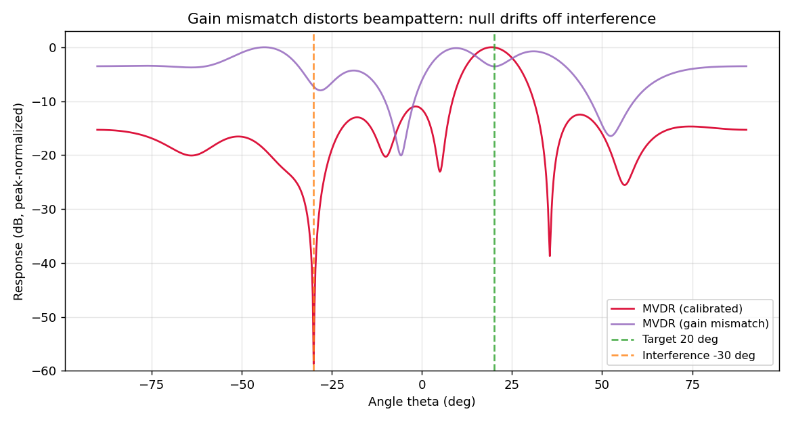

# 系列 6 · 多麦阵列信号处理 —— 从延迟求和到 MVDR

## 0. TL;DR + 解决什么问题

单麦降噪（系列 3A）只能在**时频域**上给每个频点 `X(t,f)` 乘一个增益 `M(t,f)`：噪声和语音在同一频点混在一起时，它没法把它们分开。多麦阵列多了一个全新的维度——**空间**。

> ⭐ **一句话**：如果目标和干扰来自不同方向，我们就能在**空域**上做滤波——保住目标方向的声音、压掉其他方向的声音，哪怕它们频谱完全重叠。这就是波束成形 (beamforming)。

本篇解决三件事：
1. **延迟求和 (Delay-and-Sum, DAS)**：最朴素的空域滤波，把各麦对齐后相加，像"空间上的聚光灯"。
2. **MVDR**：更聪明的自适应波束，在"保住目标方向增益为 1"的前提下，自动把能量最大的干扰方向压到最低。
3. **落地前提**：远场/近场差异、阵元间距与空间混叠、麦克风幅相一致性校准——不校准，再好的算法也会波束畸变。

代码用 NumPy 模拟 8 元均匀线阵，实测：单阵元输入 SINR ≈ **-20 dB**（干扰比目标强），DAS 输出 **-1.5 dB**，MVDR 输出 **+18.7 dB**。

---

## 1. 工程痛点引入

想象一台放在客厅茶几上的远场智能音箱。主人站在沙发边（正前方偏右 20°）说"播放音乐"，但同时：

- 电视机在左前方 -30° 放着新闻，音量比主人说话**还大 20 dB**；
- 空调、冰箱在四面八方发出稳态嗡嗡声。

系列 3A 的单麦维纳滤波在这里彻底歇菜：电视里的人声和主人的人声，**频谱几乎一模一样**。你没法用"这个频点是噪声、那个频点是语音"来区分它们——因为它俩在每个频点上都是语音。单麦掌握的信息只有"混在一起的一路波形"，缺了最关键的一维信息：**声音从哪个方向来**。

主人和电视，明明在**不同方向**。人类靠两只耳朵就能"扭头听清"某个方向，凭什么设备做不到？

答案是：**多放几只麦克风**。一只耳朵只能测响度，两只耳朵（间距几厘米）就能靠"声音先到左耳还是右耳、差多少时间"判断方向。麦克风阵列就是这个思路的工程化——多只"电子耳朵"，靠声音到达各麦的**微小时间差**来定位并聚焦方向。

---

## 2. 直觉解释（比喻先行）

### 多个麦克风 = 多只耳朵

一个来自 20° 方向的平面波，斜着扫过一排麦克风时，会**先到最近的麦、后到最远的麦**。相邻两麦之间差的那一点点时间，就编码了"方向"这个信息。方向越偏，时间差越大；正对阵列（0°）时，声波同时拍到所有麦，时间差为零。

### 延迟求和 = 空间上的聚光灯

假设我们已经知道目标在 20°，那么各麦收到的目标信号只是彼此**延迟了一点**的同一个波。DAS 的做法：

> 把各路信号按各自的延迟**先对齐、再相加**。

对齐后，目标方向的信号**相位一致、相干叠加**，M 个麦相加信号能量涨 M 倍；而其他方向来的干扰，对齐后相位七扭八歪，相加时**相互抵消**。这就像手电筒——DAS 在目标方向打出一束"波束 (beam)"主瓣，主瓣内的声音被放大，主瓣外的被削弱。

缺点：这盏聚光灯的形状是**焊死的**。它照亮目标方向的同时，旁边还漏着一圈圈"旁瓣 (sidelobe)"。要是那台电视恰好蹲在某个旁瓣上，DAS 拿它一点办法都没有——它压根不看干扰在哪。

### MVDR = 会自己"挖坑"的聪明聚光灯

MVDR (Minimum Variance Distortionless Response) 换了个思路：

> 我**先答应你**：目标方向（20°）的增益锁死为 1，一个字都不许失真（Distortionless）。
> 在这个前提下，我去看实际收到的能量都堆在哪个方向，然后**主动把波束方向图在那个方向挖一个深坑（零陷, null）**，让输出总能量最小（Minimum Variance）。

电视在 -30° 特别吵？MVDR 就在 -30° 挖一个几十 dB 的深坑，把电视精准"静音"，同时纹丝不动地保住主人方向。它是**数据驱动、自适应**的——干扰挪到哪，坑就跟到哪。

---

## 3. 数学推导（符号遵循 STYLE.md）

### 3.1 导向矢量 $\vec{a}(\theta )$

设 M 个麦克风排成一条**均匀线阵 (ULA)**，间距 `d`。远场假设下，声源足够远，波前近似为**平面波**（下节讨论近场）。取第 0 号麦为参考，某来向 θ 的平面波到达第 m 号麦，相对参考的额外传播距离是 `m·d·sinθ`，对应时延：

```
τ_m = m · d · sinθ / c
```

**人话翻译**：相邻两麦之间，声音多走了 `d·sinθ` 这么远，除以声速 `c` 就是多花的时间；第 m 个麦累计差了 m 倍。

窄带信号延迟 τ 在频域等价于乘一个相位因子 `e^{-jωτ}`。把 M 个麦的相位因子摞成一列，就是**导向矢量 (steering vector)**：

```
a(θ) = [1, e^{-jωτ₁}, e^{-jωτ₂}, ..., e^{-jωτ_{M-1}}]^T,   τ_m = m·d·sinθ/c
```

**人话翻译**：$\vec{a}(\theta )$ 是一张"方向指纹"——它记录了从 θ 方向来的信号，在各个麦上分别会带上多大的相位。想聚焦哪个方向，就拿哪个方向的指纹去比对。

### 3.2 延迟求和波束权 $\vec{w}$

波束成形的通式：对 M 路信号加权求和，输出 $y = \vec{w}^{\mathsf{H}} \vec{x}$（`ᴴ` 是共轭转置）。DAS 的权就是目标方向指纹的归一化：

```
w_DAS = a(θ_s) / M
```

**人话翻译**：$\vec{w}^{\mathsf{H}}$ 里的共轭相位正好**抵消**目标方向各麦的延迟相位（对齐），再除以 M 做等权平均。代入验证目标方向增益：$\vec{w}^{\mathsf{H}} \vec{a}(\theta _s) = \vec{a}^{\mathsf{H}}\vec{a} / M = M/M = 1$，目标不失真。

**波束方向图 (beampattern)** 定义为权对各扫描角的功率响应：

```
B(θ) = |w^H a(θ)|²
```

**人话翻译**：拿波束权去"照"每一个可能的方向 θ，得到的响应曲线就是聚光灯的形状。θ=θ_s 处是主瓣顶（0 dB），其余是旁瓣。DAS 的 `B(θ)` 是一个和 θ_s、干扰完全无关的固定形状——聚光灯焊死了。

### 3.3 MVDR：带约束的能量最小化

MVDR 把"保目标"写成硬约束，"压干扰+噪声"写成最小化目标，用**空间协方差矩阵 `R`** 描述"实际收到的能量在各方向的分布"：

```
R = E[x x^H]        # [M, M]，厄米特正定
```

**人话翻译**：`R` 是这一批快拍的"空间能量画像"——它的强特征方向就是干扰扎堆的方向。

优化问题：

```
min_w   w^H R w        (输出总功率最小)
s.t.     w^H a(θ_s) = 1  (目标方向增益锁死为 1、不失真)
```

用拉格朗日乘子法，令 $L = \vec{w}^{\mathsf{H}}R\vec{w} - \lambda (\vec{w}^{\mathsf{H}}\vec{a} - 1)$，对 $\vec{w}$ 求导置零得 $\vec{w} = \lambda R^1\vec{a}$，再代回约束定出 λ，得到闭式解：

```
        R^-1 a(θ_s)
w_MVDR = ───────────────
        a^H(θ_s) R^-1 a(θ_s)
```

**人话翻译**：分子 $R^1\vec{a}$ 是核心——`R⁻¹` 会**狠狠压制** `R` 里能量大的方向（干扰），同时把目标方向"抠"出来；分母只是个归一化标量，保证目标增益恰好等于 1。所以 MVDR 一手保目标、一手挖零陷，全自动。

> ⭐ **DAS 与 MVDR 的关系**：把 MVDR 里的 `R` 换成单位阵 `I`（即假设各方向能量均匀、只有白噪声），就退化成 $\vec{w} \propto \vec{a}$，正是 DAS。**DAS 是"假装没有干扰"的 MVDR**；MVDR 是"看清了干扰长啥样"的 DAS。

### 3.4 远场 vs 近场

上面的推导有个隐含前提：**远场平面波**——波前是平的，各麦收到的只差一个纯时延，导向矢量只含相位。

- **远场（平面波）**：声源距离 ≫ 阵列孔径，波前近似平面。方向由单一角 θ 描述，$\vec{a}(\theta )$ 只依赖来向。
- **近场（球面波）**：声源很近（比如贴嘴说话），波前是弯的**球面波**。此时各麦不仅有时延差，**幅度差也不能忽略**（近的麦明显响），导向矢量要同时含方向和**距离**：$\vec{a}(\theta , r)$，且各元幅度不再是 1。

**人话翻译**：远场只需要知道"从哪个角度来"；近场还得知道"离多远"，因为近处声源打在各麦上的响度明显不同。用远场模型去处理近场信号，导向矢量就错了，波束会失焦。

### 3.5 为什么必须做幅相一致性校准

所有推导都假设：各麦克风**除了几何延迟外完全相同**——同样的灵敏度、同样的相位响应。现实里麦克风有制造公差，第 m 个麦实际收到的是 `g_m · (理想信号)`，`g_m` 是复增益（含幅度和相位偏差）。

于是真实导向矢量变成 $g \odot \vec{a}(\theta )$，而我们手里用来设计波束权的还是理想 $\vec{a}(\theta )$——**两者对不上，就是导向矢量失配**。

> ⭐ **失配的后果**：约束 $\vec{w}^{\mathsf{H}} \vec{a}(\theta _s) = 1$ 是按理想指纹算的，可真实目标指纹是 $g\odot \vec{a}(\theta _s)$。MVDR 会把"真实目标"当成一个陌生方向的信号一起压掉——主瓣塌陷、零陷跑偏、目标反而被削弱。代码第 4 张图会看到：失配后 MVDR 对真实目标的响应从 1.0 掉到约 **0.18**，目标被自己人误伤。

所以量产阵列**出厂前必须做幅相校准**：用已知声源测出每个麦的 `g_m`，在算法里补偿掉，让导向矢量重新对齐。校准是波束成形能落地的**前提**，不是可选项。

---

## 4. 代码实战

完整代码见 本文文末《完整可跑代码》，`python series-6.py` 可直接跑通，配图输出到 `figures/`（前缀 `s6_`）。

### 4.1 导向矢量与两种波束权

```python
def steering_vector(theta_deg, m=M, d=D, omega=OMEGA):
    theta = np.deg2rad(theta_deg)
    m_idx = np.arange(m)                    # [M] 阵元索引
    tau = m_idx * d * np.sin(theta) / C     # [M] 各阵元相对时延 (s)
    a = np.exp(-1j * omega * tau)           # [M] 相位对齐因子
    return a.astype(np.complex128)

def das_weights(theta_s):
    a_s = steering_vector(theta_s)          # [M]
    return a_s / M                          # [M]，满足 w^H a = 1

def mvdr_weights(R, theta_s):
    a_s = steering_vector(theta_s)          # [M]
    Rinv_a = np.linalg.solve(R, a_s)        # [M] = R^-1 a（比显式求逆更稳）
    denom = a_s.conj() @ Rinv_a             # 标量 a^H R^-1 a
    return Rinv_a / denom                   # [M]
```

> ⭐ **工程细节**：解 $R^1\vec{a}$ 用 `np.linalg.solve(R, a_s)` 而不是 `np.linalg.inv(R) @ a_s`。前者对复数厄米特矩阵数值更稳、更快；显式求逆在 `R` 接近奇异时误差会放大。

### 4.2 空间协方差与对角加载

```python
def spatial_covariance(X, diag_load=1e-3):
    n_snap = X.shape[1]
    R = (X @ X.conj().T) / n_snap           # [M, M] 样本协方差
    R = R + diag_load * np.trace(R).real / M * np.eye(M)  # 对角加载
    return R
```

**人话翻译**：`R` 用有限快拍估计出来必然有误差，快拍不够或干扰太强时 `R` 会接近奇异，`R⁻¹` 一炸，波束权就发散。往对角线上加一点点"人工白噪声"（对角加载, diagonal loading），相当于告诉算法"别把 `R` 看得太满"，稳健性立刻回来。这是 MVDR 落地最常用的补丁。

### 4.3 阵列几何与到达时延



*图 1：左——8 元均匀线阵（间距 8.58 cm = 2 kHz 半波长）与来自 20° 的平面波波前；右——各麦相对时延随来向 θ 变化，θ 越大斜率越陡，0° 时全为零。横轴麦索引，纵轴时延 (μs)。*

### 4.4 DAS vs MVDR 波束方向图



*图 2：DAS（蓝）与 MVDR（红）的波束方向图。两者都在目标 20°（绿虚线）保住 0 dB 主瓣；但 MVDR 在干扰 -30°（橙虚线）精准挖出一个几十 dB 的深零陷，DAS 在该处只是一个普通旁瓣、几乎没有抑制。横轴来向 θ (deg)，纵轴峰值归一化响应 (dB)。*

这张图是全篇的核心：**同样保目标，MVDR 会主动往干扰方向挖坑，DAS 不会。**

### 4.5 干扰抑制与输出 SINR



*图 3：左——两种波束在干扰方向的响应（越低越好），MVDR 比 DAS 低几十 dB；右——输出 SINR 对比。实测：单阵元输入 -20 dB → DAS -1.5 dB → MVDR +18.7 dB。*

> ⭐ **结论**：干扰比目标强 20 dB 时，DAS 靠 8 个麦相干增益也才把 SINR 从 -20 dB 拉到约 -1.5 dB（听感依旧被电视盖住），而 MVDR 因为精准零陷，直接冲到 +18.7 dB。**面对强定向干扰，DAS 和 MVDR 不是量变而是质变。**

### 4.6 麦克风增益失配导致波束畸变



*图 4：校准良好的 MVDR（红）vs 各麦叠加 ±30% 随机增益失配后的 MVDR（紫）。失配后主瓣变形、零陷从 -30° 漂走，对真实目标的响应从 1.0 掉到约 0.18——目标被自己的波束误伤。横轴 θ (deg)，纵轴响应 (dB)。*

这张图把第 3.5 节的理论坐实了：**没有幅相校准，MVDR 的精度优势会变成缺点**——它太"较真"，会忠实地放大导向矢量的误差。


<!-- AUTO-EMBED:BEGIN 完整代码 由 scripts/embed_code.py 生成，勿手改 -->
### 完整可跑代码

> 以下为本篇配套的完整脚本，已实际执行通过。**直接复制保存为 `series-6.py`，`python series-6.py` 即可复现上面所有配图**（需 `numpy` / `scipy` / `matplotlib`）。

```python
#!/usr/bin/env python3
# -*- coding: utf-8 -*-
"""系列 6 · 多麦阵列信号处理 配套代码。

从「延迟求和 (Delay-and-Sum, DAS)」到「MVDR」，把单帧频域增益推广到空域滤波：
    1) 构造均匀线阵 (ULA) 的几何 + 平面波到达的导向矢量 a(θ)
    2) 合成目标 + 干扰 + 传感器噪声的多通道快拍，估计空间协方差 R
    3) 实现 DAS 与 MVDR 两种波束权 w，画波束方向图 (beampattern) 对比
    4) 定量对比阵列增益 / 干扰抑制 / 输出 SINR
    5) 演示麦克风增益失配 -> 导向矢量失配 -> 波束方向图畸变

运行（cwd=项目根目录）：
    python code/series-6.py
所有配图输出到 figures/，前缀 s6_。复数矩阵运算统一走 np.linalg。
"""

import matplotlib
matplotlib.use("Agg")  # 无显示环境后端，必须在 pyplot 之前设置

import os
import numpy as np
import matplotlib.pyplot as plt

# ----------------------------------------------------------------------------
# 全局常量（符号遵循 STYLE.md：R 空间协方差、θ 到达角）
# ----------------------------------------------------------------------------
C = 343.0                          # 声速 (m/s)，室温近似
F0 = 2000.0                        # 窄带处理的设计频率 (Hz)
OMEGA = 2 * np.pi * F0             # 角频率 ω = 2πf
M = 8                              # 阵元（麦克风）数
D = C / (2 * F0)                   # 阵元间距 = 半波长，避开空间混叠
RNG = np.random.default_rng(2025)  # 固定随机种子，保证配图可复现
FIG_DIR = os.path.join("figures")
os.makedirs(FIG_DIR, exist_ok=True)


# ----------------------------------------------------------------------------
# 1. 导向矢量：均匀线阵 + 远场平面波
# ----------------------------------------------------------------------------
def steering_vector(theta_deg, m=M, d=D, omega=OMEGA):
    """远场平面波下，ULA 对来向 θ 的导向矢量 a(θ)。

    第 m 个阵元相对参考阵元的时延 τ_m = m·d·sinθ / c，
    对应相位 exp(-j·ω·τ_m)。

    返回 a  # [M]  复数导向矢量
    """
    theta = np.deg2rad(theta_deg)
    m_idx = np.arange(m)                          # [M] 阵元索引 0..M-1
    tau = m_idx * d * np.sin(theta) / C           # [M] 各阵元相对时延 (s)
    a = np.exp(-1j * omega * tau)                 # [M] 相位对齐因子
    return a.astype(np.complex128)


# ----------------------------------------------------------------------------
# 2. 多通道快拍合成 + 空间协方差估计
# ----------------------------------------------------------------------------
def simulate_snapshots(theta_s, theta_i, n_snap=2000,
                       snr_db=10.0, inr_db=20.0, gain_mismatch=None):
    """合成阵列接收的窄带复数快拍 X。

    模型：X[:,t] = g ⊙ (a(θ_s)·s_t + a(θ_i)·i_t) + noise_t
        s_t 目标信号、i_t 干扰，均为单位功率复高斯；
        噪声为各阵元独立复高斯（空间白）。
        g 为逐阵元增益失配（None 表示理想一致，全 1）。

    参数:
        theta_s  目标来向 (deg)
        theta_i  干扰来向 (deg)
        snr_db   目标相对噪声的信噪比 (dB)
        inr_db   干扰相对噪声的干噪比 (dB)
        gain_mismatch  # [M] 或 None，逐阵元幅度增益
    返回:
        X  # [M, n_snap]  复数快拍矩阵
    """
    a_s = steering_vector(theta_s)                # [M]
    a_i = steering_vector(theta_i)                # [M]

    amp_s = 10 ** (snr_db / 20.0)                 # 目标幅度（噪声功率归一化为 1）
    amp_i = 10 ** (inr_db / 20.0)                 # 干扰幅度

    # 单位功率复高斯：实虚部各 1/sqrt(2)，合成功率为 1
    def cgauss(shape):
        return (RNG.standard_normal(shape) + 1j * RNG.standard_normal(shape)) / np.sqrt(2)

    s = amp_s * cgauss(n_snap)                    # [n_snap] 目标源
    i = amp_i * cgauss(n_snap)                    # [n_snap] 干扰源
    noise = cgauss((M, n_snap))                   # [M, n_snap] 空间白噪声

    X = np.outer(a_s, s) + np.outer(a_i, i) + noise   # [M, n_snap]

    if gain_mismatch is not None:
        X = X * gain_mismatch[:, None]            # 逐阵元乘增益（广播）[M, n_snap]
    return X.astype(np.complex128)


def spatial_covariance(X, diag_load=1e-3):
    """样本空间协方差 R = X X^H / T，附加对角加载稳健化。

    返回 R  # [M, M]  厄米特正定复矩阵
    """
    n_snap = X.shape[1]
    R = (X @ X.conj().T) / n_snap                 # [M, M] 样本协方差
    R = R + diag_load * np.trace(R).real / M * np.eye(M)  # 对角加载
    return R


# ----------------------------------------------------------------------------
# 3. 两种波束权
# ----------------------------------------------------------------------------
def das_weights(theta_s):
    """延迟求和 (DAS) 波束权：w = a(θ_s) / M。

    对齐目标方向的相位后等权平均，满足 w^H a(θ_s) = 1。
    返回 w  # [M]
    """
    a_s = steering_vector(theta_s)                # [M]
    w = a_s / M                                   # [M]
    return w


def mvdr_weights(R, theta_s):
    """MVDR 波束权：w = R^-1 a / (a^H R^-1 a)。

    在保持目标方向增益为 1 的约束下，最小化输出总功率 w^H R w。
    复数线性方程组用 np.linalg.solve（比显式求逆更稳）。
    返回 w  # [M]
    """
    a_s = steering_vector(theta_s)                # [M]
    Rinv_a = np.linalg.solve(R, a_s)              # [M]  = R^-1 a
    denom = a_s.conj() @ Rinv_a                   # 标量 a^H R^-1 a（实正）
    w = Rinv_a / denom                            # [M]
    return w


# ----------------------------------------------------------------------------
# 4. 波束方向图与指标
# ----------------------------------------------------------------------------
def beampattern(w, angles_deg):
    """波束方向图 B(θ) = |w^H a(θ)|²，随扫描角变化。

    返回 b_db  # [len(angles)]  归一化后的响应 (dB)
    """
    resp = np.array([w.conj() @ steering_vector(t) for t in angles_deg])  # [A]
    p = np.abs(resp) ** 2                          # [A] 功率响应
    b_db = 10 * np.log10(p / np.max(p) + 1e-12)    # 峰值归一化到 0 dB
    return b_db


def output_sinr(w, theta_s, theta_i, snr_db, inr_db):
    """闭式计算波束输出 SINR = 目标功率 / (干扰+噪声功率)。

    返回 sinr_db  标量 (dB)
    """
    a_s = steering_vector(theta_s)                 # [M]
    a_i = steering_vector(theta_i)                 # [M]
    amp_s2 = 10 ** (snr_db / 10.0)                 # 目标功率
    amp_i2 = 10 ** (inr_db / 10.0)                 # 干扰功率
    p_sig = amp_s2 * np.abs(w.conj() @ a_s) ** 2   # 输出目标功率
    p_int = amp_i2 * np.abs(w.conj() @ a_i) ** 2   # 输出干扰功率
    p_noise = np.abs(w.conj() @ w)                 # 输出白噪声功率 (σ²=1) = ||w||²
    return 10 * np.log10(p_sig / (p_int + p_noise + 1e-12))


# ----------------------------------------------------------------------------
# 主流程：生成 4 张配图
# ----------------------------------------------------------------------------
def main():
    theta_s = 20.0     # 目标来向 (deg)
    theta_i = -30.0    # 干扰来向 (deg)，落在 DAS 主瓣旁的高旁瓣处
    snr_db = 10.0
    inr_db = 30.0      # 干扰比目标强 20 dB，逼出 DAS 的软肋
    angles = np.linspace(-90, 90, 721)  # [721] 扫描角网格 (deg)

    # ---- 快拍 + 协方差 + 两种权 ----
    X = simulate_snapshots(theta_s, theta_i, snr_db=snr_db, inr_db=inr_db)  # [M, T]
    R = spatial_covariance(X)                                              # [M, M]
    w_das = das_weights(theta_s)                                          # [M]
    w_mvdr = mvdr_weights(R, theta_s)                                     # [M]

    b_das = beampattern(w_das, angles)     # [721]
    b_mvdr = beampattern(w_mvdr, angles)   # [721]

    sinr_das = output_sinr(w_das, theta_s, theta_i, snr_db, inr_db)
    sinr_mvdr = output_sinr(w_mvdr, theta_s, theta_i, snr_db, inr_db)
    sinr_in = snr_db - inr_db  # 单阵元输入 SINR（干扰远强于目标）

    print(f"[cfg] M={M} mics, d={D*100:.2f} cm (half-wavelength @ {F0:.0f} Hz)")
    print(f"[cfg] target {theta_s:+.0f} deg, interference {theta_i:+.0f} deg, "
          f"SNR={snr_db}dB, INR={inr_db}dB")
    print(f"[SINR] input (single mic) ~ {sinr_in:+.1f} dB")
    print(f"[SINR] DAS  output        = {sinr_das:+.1f} dB")
    print(f"[SINR] MVDR output        = {sinr_mvdr:+.1f} dB")

    # ------------------------------------------------------------------
    # 图 1：阵列几何 + 平面波到达时延示意
    # ------------------------------------------------------------------
    fig, ax = plt.subplots(1, 2, figsize=(11, 4.2))
    mic_x = np.arange(M) * D           # [M] 阵元 x 坐标 (m)
    ax[0].scatter(mic_x * 100, np.zeros(M), s=80, c="tab:blue", zorder=3,
                  label="Microphones")
    # 画一束来自 theta_s 的平面波波前
    th = np.deg2rad(theta_s)
    for off in np.linspace(-0.05, 0.15, 5):
        px = np.array([-0.1, 0.3])
        # 波前垂直于传播方向：x*sin + y*cos = const
        py = (off - px * np.sin(th)) / np.cos(th)
        ax[0].plot(px * 100, py * 100, color="tab:orange", alpha=0.5, lw=1)
    ax[0].set_title(f"ULA geometry, plane wave from {theta_s:.0f} deg")
    ax[0].set_xlabel("x (cm)")
    ax[0].set_ylabel("y (cm)")
    ax[0].legend(loc="upper right")
    ax[0].grid(alpha=0.3)
    ax[0].set_ylim(-10, 20)

    # 各阵元相对时延随来向变化
    for tdeg, col in [(0, "tab:green"), (20, "tab:orange"), (60, "tab:red")]:
        tau = np.arange(M) * D * np.sin(np.deg2rad(tdeg)) / C * 1e6  # [M] μs
        ax[1].plot(np.arange(M), tau, "o-", color=col, label=f"{tdeg} deg")
    ax[1].set_title("Per-mic arrival delay vs DOA")
    ax[1].set_xlabel("Mic index m")
    ax[1].set_ylabel("Delay tau_m (us)")
    ax[1].legend()
    ax[1].grid(alpha=0.3)
    plt.tight_layout()
    p1 = os.path.join(FIG_DIR, "s6_geometry.png")
    plt.savefig(p1, dpi=130)
    plt.close()

    # ------------------------------------------------------------------
    # 图 2：DAS vs MVDR 波束方向图对比
    # ------------------------------------------------------------------
    plt.figure(figsize=(9, 4.8))
    plt.plot(angles, b_das, label="DAS beampattern", color="tab:blue", lw=1.5)
    plt.plot(angles, b_mvdr, label="MVDR beampattern", color="crimson", lw=1.5)
    plt.axvline(theta_s, ls="--", color="tab:green", alpha=0.8,
                label=f"Target {theta_s:.0f} deg")
    plt.axvline(theta_i, ls="--", color="tab:orange", alpha=0.8,
                label=f"Interference {theta_i:.0f} deg")
    plt.ylim(-60, 3)
    plt.xlabel("Angle theta (deg)")
    plt.ylabel("Response (dB, peak-normalized)")
    plt.title("DAS vs MVDR: MVDR carves a null toward interference")
    plt.legend(loc="lower right", fontsize=9)
    plt.grid(alpha=0.3)
    plt.tight_layout()
    p2 = os.path.join(FIG_DIR, "s6_beampattern.png")
    plt.savefig(p2, dpi=130)
    plt.close()

    # ------------------------------------------------------------------
    # 图 3：阵列增益 / 干扰抑制 / 输出 SINR 对比
    # ------------------------------------------------------------------
    fig, ax = plt.subplots(1, 2, figsize=(11, 4.2))
    # 左：干扰方向响应（越低越好）
    resp_i_das = 10 * np.log10(np.abs(w_das.conj() @ steering_vector(theta_i)) ** 2 + 1e-12)
    resp_i_mvdr = 10 * np.log10(np.abs(w_mvdr.conj() @ steering_vector(theta_i)) ** 2 + 1e-12)
    ax[0].bar(["DAS", "MVDR"], [resp_i_das, resp_i_mvdr],
              color=["tab:blue", "crimson"])
    ax[0].set_title("Gain toward interference (lower = better)")
    ax[0].set_ylabel("Response @ interference (dB)")
    ax[0].grid(alpha=0.3, axis="y")
    for k, v in enumerate([resp_i_das, resp_i_mvdr]):
        ax[0].text(k, v, f"{v:.1f}", ha="center",
                   va="bottom" if v < 0 else "top")
    # 右：输出 SINR
    ax[1].bar(["Input\n(1 mic)", "DAS", "MVDR"],
              [sinr_in, sinr_das, sinr_mvdr],
              color=["gray", "tab:blue", "crimson"])
    ax[1].set_title("Output SINR comparison")
    ax[1].set_ylabel("SINR (dB)")
    ax[1].grid(alpha=0.3, axis="y")
    for k, v in enumerate([sinr_in, sinr_das, sinr_mvdr]):
        ax[1].text(k, v, f"{v:+.1f}", ha="center",
                   va="bottom" if v >= 0 else "top")
    plt.tight_layout()
    p3 = os.path.join(FIG_DIR, "s6_suppression.png")
    plt.savefig(p3, dpi=130)
    plt.close()

    # ------------------------------------------------------------------
    # 图 4：麦克风增益失配 -> 波束方向图畸变
    # ------------------------------------------------------------------
    # 理想一致：全 1；失配：±30% 随机幅度扰动
    g_ideal = np.ones(M)                                   # [M]
    g_bad = 1.0 + 0.3 * RNG.standard_normal(M)             # [M] 幅度失配
    g_bad = np.clip(g_bad, 0.3, 1.7)

    X_bad = simulate_snapshots(theta_s, theta_i, snr_db=snr_db, inr_db=inr_db,
                               gain_mismatch=g_bad)         # [M, T]
    R_bad = spatial_covariance(X_bad)                       # [M, M]
    # 波束权仍按「理想」导向矢量设计（因为我们不知道失配）-> 失配
    w_mvdr_bad = mvdr_weights(R_bad, theta_s)               # [M]
    b_mvdr_bad = beampattern(w_mvdr_bad, angles)            # [721]

    plt.figure(figsize=(9, 4.8))
    plt.plot(angles, b_mvdr, label="MVDR (calibrated)", color="crimson", lw=1.5)
    plt.plot(angles, b_mvdr_bad, label="MVDR (gain mismatch)",
             color="tab:purple", lw=1.5, alpha=0.85)
    plt.axvline(theta_s, ls="--", color="tab:green", alpha=0.8,
                label=f"Target {theta_s:.0f} deg")
    plt.axvline(theta_i, ls="--", color="tab:orange", alpha=0.8,
                label=f"Interference {theta_i:.0f} deg")
    plt.ylim(-60, 3)
    plt.xlabel("Angle theta (deg)")
    plt.ylabel("Response (dB, peak-normalized)")
    plt.title("Gain mismatch distorts beampattern: null drifts off interference")
    plt.legend(loc="lower right", fontsize=9)
    plt.grid(alpha=0.3)
    plt.tight_layout()
    p4 = os.path.join(FIG_DIR, "s6_mismatch.png")
    plt.savefig(p4, dpi=130)
    plt.close()

    # 定量：失配后目标方向是否还是 1、干扰是否还压得住
    g_target_bad = np.abs(w_mvdr_bad.conj() @ (g_bad * steering_vector(theta_s)))
    print(f"[mismatch] MVDR response to true target |w^H (g*a_s)| = "
          f"{g_target_bad:.3f} (should be 1.0 if calibrated)")

    print("[figures] generated:")
    for p in (p1, p2, p3, p4):
        print("  ", p)


if __name__ == "__main__":
    main()
```
<!-- AUTO-EMBED:END -->

---

## 5. 工程踩坑 + 面试追问三连

### 踩坑清单

1. **阵元间距别超过半波长**：`d > λ/2` 会引入**空间混叠 (spatial aliasing)**——就像时域采样低于奈奎斯特率会混叠一样，空域欠采样会让波束方向图冒出"栅瓣 (grating lobe)"，把别的方向的干扰误当成目标。代码里取 `d = c/(2·f₀)` 正是半波长。注意宽带信号要按**最高频率**定间距。
2. **`R` 用足够快拍估**：经验上快拍数 `T ≥ 2M` 才能得到像样的 `R`；快拍不够就必须靠对角加载兜底。
3. **对角加载量要适中**：加太少稳不住、加太多 MVDR 退化成 DAS（零陷变浅）。工程上常按噪声功率的百分比自适应设定。
4. **目标导向矢量误差 = MVDR 的软肋**：DOA 估偏、或麦克风未校准，都会让 MVDR 把目标当干扰压掉（self-nulling）。稳健波束（如 RAB、对角加载、导向矢量不确定集约束）就是专门治这个的。
5. **窄带 vs 宽带**：本篇是单频 `f₀` 的窄带推导。真实语音是宽带，工程做法是先 STFT 分频段，**每个频点 `f` 独立算一套 $\vec{a}$、`R`、$\vec{w}$**——这正好把系列 3A 的"逐频点增益 `M(t,f)`"推广成了"逐频点空域权 $\vec{w}(f)$"，空域滤波是频域滤波的自然升维。

> 🔥 **面试追问一：DAS 和 MVDR 到底怎么取舍？**
> DAS：无需估 `R`、无需知道干扰、零参数、绝对稳定，但抑制能力弱（只有固定旁瓣），对强定向干扰无能为力。MVDR：自适应挖零陷、抑制能力强，但依赖准确的 `R` 估计和导向矢量，快拍不足/校准不准时会自伤。**结论：静态白噪声环境或算力/稳定性优先选 DAS；有明确强定向干扰、且能保证校准和快拍选 MVDR。** 生产上常用折中的稳健 MVDR（带对角加载）。

> 🔥 **面试追问二：R 估计有误差怎么办？为什么对角加载能救命？**
> 有限快拍估的 `R̂` 会偏离真值，尤其快拍少或干扰极强时 `R̂` 接近奇异，`R̂⁻¹` 数值爆炸、波束权发散。对角加载 `R̂ + εI` 相当于给协方差加一层人工白噪声地板：数学上它抬高了 `R̂` 的最小特征值、改善条件数；直觉上它让 MVDR "别对着噪声方向死磕"，牺牲一点零陷深度换来大幅稳健性。这是 MVDR 落地最常见的一行补丁。

> 🔥 **面试追问三：阵元间距怎么定？为什么半波长？校准为什么是前提？**
> 间距上限是半波长 `λ/2`（对宽带取最高频），超过就空间混叠、出栅瓣，把旁瓣干扰误当主瓣目标；间距太小则孔径不足、角分辨率差。半波长是分辨率与抗混叠的平衡点。校准之所以是前提：所有波束权都建立在"各麦除几何延迟外完全一致"的假设上，麦克风幅相公差会让真实导向矢量 $g\odot \vec{a}$ 偏离理想 $\vec{a}$，MVDR 会忠实放大这个误差、把目标压掉（图 4）。所以量产阵列出厂必测幅相一致性并做补偿。

---

## 6. 小结 + 下篇预告 + 思考题

**小结**：本篇把系列 3A 的"单帧频域增益"从**时频域**推广到了**空域**。核心链条是：
- 多麦靠**到达时间差**编码方向 → 导向矢量 $\vec{a}(\theta )$ 是"方向指纹"；
- **DAS** 把各路对齐相加，是焊死形状的"空间聚光灯"，$\vec{w} = \vec{a}(\theta _s)/M$；
- **MVDR** 在保目标不失真的约束下最小化输出能量，$\vec{w} = R^1\vec{a} / (\vec{a}^{\mathsf{H}}R^1\vec{a})$，能自动往干扰方向挖零陷，实测比 DAS 高约 20 dB 的输出 SINR；
- **落地前提**：半波长间距防混叠、对角加载稳健化、远场/近场建模匹配、幅相校准防失配。

至此，8 篇经典 3A 主线（自适应滤波 → AEC → ANS → VAD → AGC → 阵列）全部走完：从单通道的时域自适应、频域降噪，一路推广到多通道的空域滤波。它们共享同一套"最优滤波"内核，只是作用的维度不断升级。

**思考题**：
1. 如果目标方向的 DOA 估计偏了 5°，DAS 和 MVDR 谁受影响更大？为什么？（提示：想想约束 $\vec{w}^{\mathsf{H}}\vec{a}(\theta _s)=1$ 建在哪个 θ 上。）
2. 只有 2 个麦克风时，MVDR 最多能挖几个零陷？M 个麦呢？（提示：约束用掉一个自由度。）
3. 把本篇窄带处理搬到宽带语音，STFT 每个频点独立算 $\vec{w}(f)$ 后，如何保证目标语音在各频段不被染色（频响一致）？这和维纳滤波的增益又有什么呼应？
