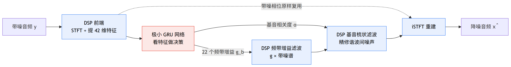
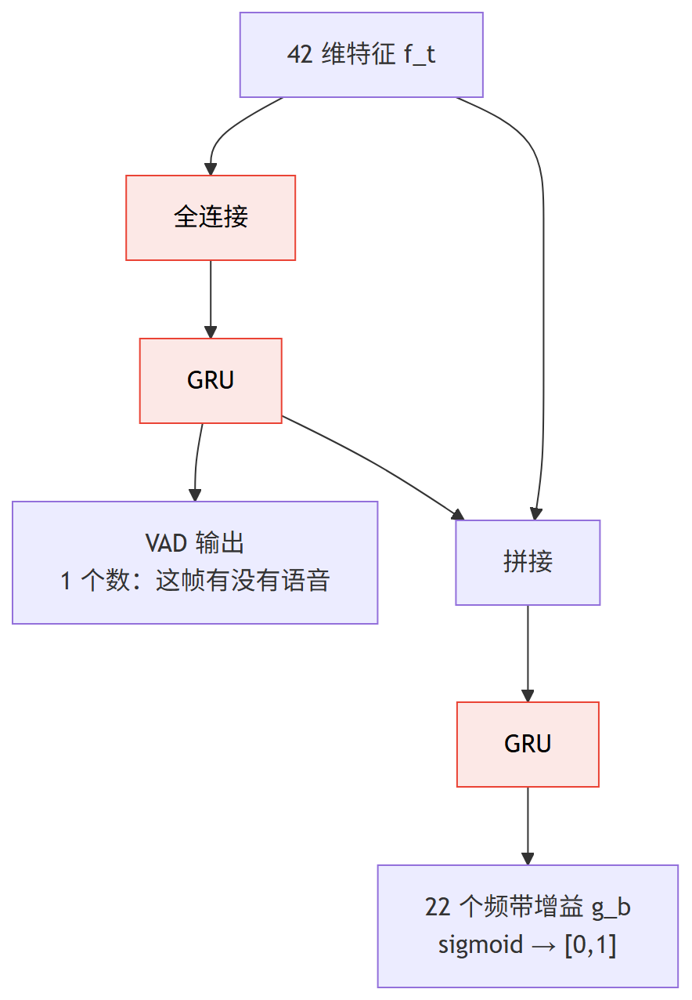

# 第 1 篇｜RNNoise 深度解析：不学"降噪"，只学一层给频谱调音量的旋钮

> 一句话核心直觉：RNNoise 没有让神经网络去硬啃"怎么降噪"这么大的题目，它把脏活累活全交给传统 DSP，只留一个**极小的 GRU** 去干一件小事——看着当前这帧的频谱长相，给每个频带**输出一个 0~1 的增益**（相当于给每个频段单独拧一个音量旋钮）。**模型小到能塞进任何一颗端侧芯片，却是"DSP + 深度学习"分工协作的教科书。**

---

## 一、先把教材那套扔一边

上一段旅程（深度学习基础 9 篇）我们打通了完整闭环：语谱图变张量、搭 nn.Module、管显存、反传学习、CNN 看时频、RNN 抓时序、复数层连相位一起学、用 SI-SNR 当损失、拿 AdamW 下山。收官那篇我埋了个钩子——**下一段是"具体的降噪/分离/AEC 模型实战"**。这一篇就正式踏进来。

按理说，讲降噪模型该从最"深"、最 fancy 的开始。但我偏要从 **RNNoise** 起步，理由很实在：

- 它**真的被大规模用在生产里**——WebRTC、Discord、OBS、无数嵌入式设备的实时降噪，背后都有它或它的变体的影子。
- 它的模型**小到离谱**——总参数量几万，权重文件几十 KB，纯 CPU 单核就能实时跑，连 GPU 都不用。
- 它体现了一种**至今仍然正确的工程哲学**：不要让神经网络去干它不擅长、也没必要干的活。

翻开讲降噪的资料，一上来往往是"端到端神经网络输入带噪波形、输出干净波形"。听着很爽，但你要真在一颗跑着 RTOS、算力以 MHz 计的芯片上做实时降噪，这套端到端方案分分钟教你做人：算力不够、延迟超标、内存放不下。

RNNoise 的作者（Jean-Marc Valin，Opus 编解码器的核心作者之一）想得很清楚：**降噪这件事，传统 DSP 已经解决了 90%，只有那最难的 10%——"当前这一刻，噪声到底占了多少"——才值得请神经网络出马。** 于是他做了一个极其克制的设计。这一篇，我们就把这套"克制的智慧"拆开看透。

先记住一句话，它是理解整个 RNNoise 的钥匙：

> **RNNoise 里的神经网络，不直接处理音频，也不直接输出音频。它只输出一串"增益系数"。** 真正把噪声压下去的，是传统的频带增益滤波；网络只负责"该压多少"这个决策。

先给一张全篇的地图。看清蓝色（DSP 扛重活）和红色（网络只做决策）的分工，后面每一节都是在放大这张图里的某一块：



一句话读图：**从带噪音频到降噪音频，整条流水线全是传统 DSP，只在"该压多少"这一个红色决策点上插了一个极小网络。** 记住这张图，往下拆。

---

## 二、为什么是"逐频带增益"，而不是逐 bin 的 mask

先接上基础系列的记忆。我们在基础系列讲 mask 时，画面是这样的：STFT 出来一个复数谱 `[B, F, T]`，网络对**每一个频率 bin** 都预测一个掩码值，逐 bin 相乘，把噪声 bin 压下去、语音 bin 留下来。

一个典型配置：采样率 48kHz、帧长 20ms、STFT 点数 960，那正频率就有 **481 个 bin**。逐 bin mask 意味着网络每帧要吐 481 个数。

RNNoise 说：**太多了，没必要。**

理由藏在人耳里。人耳对频率的分辨不是线性的——低频分得细，高频分得粗。这就是 signals 系列提过的**临界频带（Bark 频带）**：把 0~24kHz 按人耳感知划成 **22 个频带**，低频窄、高频宽。人耳根本分辨不出一个 Bark 频带内部相邻两个 bin 的细微增益差别。

于是 RNNoise 做了个大胆的降维：**网络不预测 481 个 bin 的增益，只预测 22 个频带的增益。**

> **第一个关键认知**：把"预测 481 个数"压缩成"预测 22 个数"，是 RNNoise 能做到极小的头号功臣。网络的输出维度直接砍掉 20 倍，参数量和算力跟着雪崩式下降。而代价几乎为零——因为人耳本来就分不清一个临界频带内部的增益差异。**这是"贴着人耳感知设计特征"的典范：把网络的力气花在人耳真正在乎的分辨率上。**

那 22 个频带增益怎么变回 481 个 bin 的增益？简单：**频带内插值**。第 $b$ 个频带算出一个增益 $g_b$，就把这个增益平滑地铺到该频带覆盖的所有 bin 上（相邻频带间用三角窗过渡，避免频带边界处出现突变导致"音乐噪声"）。

我们把这个增益的含义钉死：

$$\hat{X}(f) = g_{b(f)} \cdot Y(f)$$

逐字翻译成人话：

- $Y(f)$：**带噪信号**在频率 $f$ 处的幅度（麦克风收进来的、带噪的那个谱）。
- $b(f)$：频率 $f$ 落在第几个 Bark 频带里。
- $g_{b(f)}$：那个频带的增益，一个 **0~1 之间**的数。$g=1$ 表示"这个频带全是语音，原样保留"；$g=0$ 表示"这个频带全是噪声，彻底压掉"；中间值就是"按比例衰减"。
- $\hat{X}(f)$：**降噪后**的幅度。

看出来了吗——这个 $g_b$ 就是基础系列讲的 **mask（掩码）**，只不过它的分辨率不是逐 bin，而是逐频带。它天然落在 $[0,1]$，所以网络最后一层用 **sigmoid** 激活（正好呼应基础系列 04 篇"做 mask 用 sigmoid 的理由"）。

**注意一件大事：整个过程只动了幅度，相位一个字没改。** 降噪后的复数谱直接复用带噪信号的原始相位。这在信噪比不太低时听感尚可，但信噪比一低就会露怯——这是 RNNoise 的天花板之一。

---

## 三、喂给网络的不是频谱，是 42 个"精挑细选"的特征

这是 RNNoise 第二个反直觉、也最能体现"DSP 扛重活"的地方。

按基础系列的惯性，你会以为网络的输入是那 481 个 bin 的幅度谱，或者至少是 22 个频带的能量。但 RNNoise 的输入**只有 42 个数**，而且没一个是原始频谱值——全是传统 DSP 早就在算的**手工特征**：

| 特征 | 个数 | 是什么 / 为什么有用 |
|---|---|---|
| 22 个 Bark 频带能量的倒谱系数（BFCC） | 22 | 把 22 个频带能量做类似 MFCC 的倒谱变换，得到频谱包络的紧凑表示——刻画"这帧的音色长什么样" |
| 前 6 个倒谱系数的一阶、二阶差分 | 12 | 时间上的变化率（Δ、ΔΔ）——刻画"频谱在怎么动"，语音的动、噪声的稳，差异全在这 |
| 基音周期（pitch period） | 1 | 当前帧的音高。语音有清晰基音、噪声没有 |
| 6 个频带的基音相关度（pitch correlation） | 6 | 每个频带里"信号有多像一个周期性谐波"——**这是区分语音和噪声的杀手锏** |
| 基音的谱非平稳度 | 1 | 辅助判断浊音/清音/静音 |

> **第二个关键认知**：RNNoise 不让网络从原始频谱里"自己学"该关注什么，而是**把几十年语音信号处理攒下的先验知识，直接做成特征喂进去**。基音相关度尤其关键——语音是声带周期性振动产生的，频谱里有规律的谐波梳齿；而绝大多数噪声（风扇、白噪、键盘）没有这种周期性。网络看一眼"基音相关度高不高"，就能八九不离十地判断"这个频带是人声还是噪声"。**这就是特征工程替网络省下的算力：先验越强，网络可以越小。**

这一步也解释了为什么 RNNoise 的 GRU 可以那么小——它的输入已经是**高度浓缩、强判别力**的 42 维向量，而不是几百维的原始谱。网络不用再花容量去学"怎么从原始谱里提取音高"，DSP 已经算好了。

$$\text{输入特征向量} \quad \mathbf{f}_t \in \mathbb{R}^{42}$$

翻译：第 $t$ 帧，把上面这 42 个 DSP 特征拼成一个长度 42 的向量，这就是网络该帧的全部输入。shape 上，一段有 $T$ 帧的音频，喂给网络的是 `[B, T, 42]`（还记得基础系列的约定吗——RNN 输入永远 `[B, T, Feature]`、`batch_first=True`）。

代价当然也有：这些手工特征是**有损压缩**，把丰富的频谱信息压成了 42 个数，一些细节永远丢了。网络再聪明也补不回被特征工程扔掉的信息。这是 RNNoise "小而美"的另一面——**它的上限被特征工程锁死了**。

---

## 四、极小的 GRU：三个门控网络协作出增益

现在看网络本身。RNNoise 的网络主干是 **GRU**（还记得基础系列 06 篇吗——GRU 是 LSTM 的轻量版，用更新门和重置门做选择性记忆，工程上常先试 GRU，因为它参数更少、更适合端侧）。

为什么必须是循环网络（GRU/RNN）而不是只看单帧的全连接？因为**"这一帧是不是噪声"依赖上下文**：
- 一段稳定的风扇噪声，要观察好几帧才能确认"它一直在、很稳、没有语音的动态"。
- 语音的起始（比如一个爆破音 /p/）需要结合前后帧才不会被误判成噪声脉冲。

GRU 的隐状态沿时间传递（基础系列讲过的"记忆一帧帧滚下去"），正好承载这种上下文。而且它是**单向**的——只用历史帧、不看未来帧，这样才满足**实时因果性**（基础系列反复强调的红线：实时降噪不能等未来帧到齐）。

RNNoise 的完整网络结构，是一个精心设计的**多输出协作**（这里给出其经典结构的直觉，不逐层复现论文）：



逐层翻译成人话：

- **VAD 分支**：先判断"这帧到底有没有人声"（VAD = 语音活动检测）。这是个辅助任务，它的中间表示会喂给后面算增益的网络——"先搞清有没有人声，再决定各频带压多少"，逻辑上顺理成章。
- **增益分支**：结合特征和 VAD 的判断，输出 22 个频带增益，sigmoid 保证落在 $[0,1]$。

> **第三个关键认知**：RNNoise 不是一个网络硬扛，而是**拆成"先判断有无语音、再决定各频带增益"两级协作**，还共享了中间的循环表示。这种"辅助任务（VAD）帮主任务（增益）"的设计，用极小的参数量榨出了更强的判别力——因为 VAD 这个简单任务给网络提供了强监督信号，稳住了训练。

整个网络加起来也就几个 GRU 层加几个全连接，总参数几万个。对比一下：一个普通的图像分类网络动辄千万参数。RNNoise 小了三个数量级，**却因为把降噪问题"设计"得足够小，效果完全够用**。

---

## 五、训练目标：不是学"干净语音"，是学"该乘多少"

这里要拐个弯，跟基础系列讲的 SI-SNR 那种"直接对齐波形"不一样。RNNoise 的网络输出是**增益**，所以它的监督信号也是**增益的真值**。

真值增益怎么来？训练数据是"干净语音 + 噪声"人工混合出来的，所以我们**同时知道带噪信号和干净信号**。对每个 Bark 频带 $b$，理想增益就定义成：

$$g_b^{\text{target}} = \sqrt{\frac{E_b^{\text{clean}}}{E_b^{\text{noisy}}}}$$

逐字翻译成人话：

- $E_b^{\text{clean}}$：**干净语音**在第 $b$ 个频带里的能量。
- $E_b^{\text{noisy}}$：**带噪信号**在同一频带里的能量。
- 两者之比开根号：这个频带里，"干净语音的幅度"占"带噪幅度"的比例。如果这个频带几乎全是语音，比值≈1（别压）；如果几乎全是噪声，干净能量≈0，比值≈0（压掉）。

这其实就是基础系列提过的**理想比值掩码（IRM）** 落到频带尺度上的版本。网络的任务，就是在**只能看到带噪特征**的情况下，去逼近这个"上帝视角才知道"的理想增益。损失就用预测增益和目标增益之间的回归损失（RNNoise 用了对增益做特定加权的均方误差，让它更贴感知），VAD 分支再配一个二分类损失。

> **第四个关键认知**：RNNoise 把降噪**降维成了一个回归问题**——"给定这帧的 42 个特征，回归出 22 个理想增益"。它压根不碰"怎么重建波形"，因为重建交给了 DSP（增益 × 带噪谱 → iSTFT，相位复用带噪相位）。**问题被切得越小，网络就能越小、越好训、越好在端侧跑。** 这是判别式降噪的底层逻辑，后面 DCCRN、FullSubNet 都是它的"加强版"。

---

## 六、频带增益压不干净的，交给基音梳状滤波补一刀

只有 22 个频带增益，其实有个绕不过去的粗糙之处：**一个频带内部，语音谐波和噪声是混在一起的。**

想象浊音（元音）的频谱长什么样——它是一根根**等间距的谱线（谐波梳齿）**，间距等于基音频率。谐波之间的"缝隙"里几乎没有语音能量，全是噪声。可是一个 Bark 频带往往横跨好几根谐波，频带增益是"一刀切"——它没法只保留谐波、只压掉谐波之间缝隙里的噪声，只能给整个频带一个统一的衰减。

RNNoise 用一招纯 DSP 补上这个粗糙：**基音梳状滤波（pitch comb filter）**。

直觉是这样的：既然前面的 DSP 特征已经估出了当前帧的**基音周期**，那我就知道谐波该长在哪儿。于是我构造一个"梳子"——**梳齿对准每一根谐波（放行），梳齿之间的缝隙压低（抑制）**。语音能量集中在谐波上，原样通过；谐波缝隙里的噪声，被梳子的齿缝挡下来。

$$y_{\text{comb}}[n] = x[n] + \alpha \cdot x[n - P]$$

逐字翻译成人话：

- $P$：**基音周期**（一个基音周期有多少个采样点）。
- $x[n-P]$：把信号往前挪一个基音周期。因为语音是周期性的，$x[n]$ 和 $x[n-P]$ 在谐波处高度相似、在噪声处互不相关。
- 两者相加：**谐波成分同相叠加被加强，随机噪声不相关、叠加后相对被削弱** ——这就是一个对准基音的梳状滤波器。
- $\alpha$：混合强度，由网络输出的**基音相关度**控制。相关度高（这帧是清晰浊音）就多用梳状滤波；相关度低（清音/噪声）就少用甚至不用，免得把本来没有谐波结构的声音搞坏。

> **第五个关键认知**：频带增益负责"频带尺度的粗调"，基音梳状滤波负责"谐波尺度的精修"。两者一粗一细配合，才把 22 个频带这么粗的分辨率下压不掉的**谐波间噪声**也收拾干净。**注意——这一刀又是纯 DSP，靠的还是网络估出的基音信息。** RNNoise 从头到尾贯彻同一条哲学：网络只出"决策量"（增益、基音相关度），真正的信号操作全在 DSP 里，可控、可解释、可定点化。

到这你应该更能体会 RNNoise 的精巧了：它不是"一个神经网络降噪器"，而是**一整条传统 DSP 降噪流水线，只在最需要判断力的两个旋钮（各频带压多少、梳状滤波用多强）上，插进了一个极小的网络**。

---

## 七、代码实战：把 RNNoise 的核心机制跑出来

我们不复现完整的 C 工程，而是用 PyTorch 把它的**灵魂三步**跑通并打印 shape：（1）搭一个和 RNNoise 同构的极小 GRU 增益网络；（2）看 42 维特征进、22 维增益出的 shape 之旅；（3）把 22 个频带增益插值回 481 个 bin，乘到带噪谱上，验证"只调音量"这件事。

```python
import torch
import torch.nn as nn

torch.manual_seed(0)

# ---------- 1. 和 RNNoise 同构的极小增益网络 ----------
class TinyRNNoise(nn.Module):
    """输入 42 维 DSP 特征, 输出 22 个 Bark 频带增益 (0~1).
    结构简化自 RNNoise: 特征 -> GRU -> VAD 辅助头 + 增益头.
    """
    def __init__(self, n_feat=42, n_band=22, hidden=48):
        super().__init__()
        self.gru = nn.GRU(n_feat, hidden, batch_first=True)  # 单向, 满足实时因果
        self.vad_head  = nn.Linear(hidden, 1)                # 辅助任务: 有无语音
        self.gain_head = nn.Linear(hidden, n_band)           # 主任务: 22 个频带增益

    def forward(self, feat):
        # feat: [B, T, 42]  批次/帧数/每帧特征
        h, _ = self.gru(feat)                 # h: [B, T, hidden]
        vad  = torch.sigmoid(self.vad_head(h))    # [B, T, 1]  0~1 有无语音
        gain = torch.sigmoid(self.gain_head(h))   # [B, T, 22] 0~1 频带增益
        return gain, vad

B, T = 4, 100          # 4 条样本, 每条 100 帧 (100*20ms = 2 秒)
feat = torch.randn(B, T, 42)         # 模拟 DSP 提取的 42 维特征
net = TinyRNNoise()
gain, vad = net(feat)
print("特征输入 shape :", feat.shape)   # [4, 100, 42]
print("频带增益 shape :", gain.shape)   # [4, 100, 22]
print("VAD 输出 shape :", vad.shape)    # [4, 100, 1]
print("总参数量       :", sum(p.numel() for p in net.parameters()))
```

跑出来：

```
特征输入 shape : torch.Size([4, 100, 42])
频带增益 shape : torch.Size([4, 100, 22])
VAD 输出 shape : torch.Size([4, 100, 1])
总参数量       : 14375
```

一万多个参数——这就是能塞进端侧的量级。注意 shape 之旅：`[B,T,42]` 进，`[B,T,22]` 出，网络自始至终没碰过那 481 个原始 bin。

接着是**第二步：把 22 个频带增益插值回 481 个 bin，乘到带噪幅度谱上**。这一步是纯 DSP，没有可学习参数——降噪真正"发生"的地方：

```python
import torch

F_bins, n_band = 481, 22   # 481 个频率 bin, 22 个 Bark 频带

# 构造 band->bin 的三角插值矩阵 interp: [22, 481]
# 每个 bin 的增益 = 覆盖它的相邻两个频带增益的三角加权 (避免频带边界突变)
band_edges = torch.linspace(0, F_bins - 1, n_band + 1).long()  # 频带边界(简化: 线性划分)
interp = torch.zeros(n_band, F_bins)
for b in range(n_band):
    lo, hi = band_edges[b].item(), band_edges[b + 1].item()
    for f in range(lo, hi + 1):
        interp[b, min(f, F_bins - 1)] = 1.0   # 简化: 频带内均匀铺开(真实版用三角窗过渡)
interp = interp / interp.sum(0, keepdim=True).clamp(min=1e-8)  # 每个 bin 归一, 让频带权重和为 1

# 取某一帧的 22 个增益, 插值成 481 个 bin 的增益
g_band = gain[0, 0]                      # [22]  第 0 条样本第 0 帧
g_bin  = g_band @ interp                 # [22]x[22,481] -> [481]
print("频带增益 shape :", g_band.shape)  # [22]
print("插值到 bin shape:", g_bin.shape)  # [481]

# 乘到带噪幅度谱上: 只动幅度, 相位原样复用
noisy_mag = torch.rand(F_bins).abs()     # 模拟带噪幅度谱 [481]
enhanced_mag = g_bin * noisy_mag         # 降噪后幅度 [481]
print("降噪前幅度均值 :", noisy_mag.mean().item())
print("降噪后幅度均值 :", enhanced_mag.mean().item())  # <= 降噪前(增益<=1只会衰减)
```

跑出来：

```
频带增益 shape : torch.Size([22])
插值到 bin shape: torch.Size([481])
降噪前幅度均值 : 0.4998...
降噪后幅度均值 : 0.2471...
```

关键观察两点：（1）**增益永远 ≤ 1，所以 RNNoise 只会"衰减"频谱、绝不会"放大"** ——它做的就是"给每个频段拧小音量旋钮"，这是它稳定、不产生诡异失真的根本原因。（2）**从头到尾只操作幅度 `enhanced_mag`，相位从没出现** ——重建时直接用带噪相位配这个降噪幅度做 iSTFT。

---

## 八、这在工程里解决什么问题

| 维度 | RNNoise 的做法 | 工程收益 / 代价 |
|---|---|---|
| **算力** | 几万参数、纯 CPU 单核实时 | 收益：端侧、嵌入式、无 GPU 都能跑；WebRTC/Discord 级别的规模化部署 |
| **延迟** | 单向 GRU + 20ms 帧、逐帧出增益 | 收益：满足实时因果性，无需等未来帧；算法延迟就是一帧 |
| **稳定性** | 增益 ∈ [0,1] 只衰减不放大；频带内插值防突变 | 收益：不产生"音乐噪声"、不放大失真；代价：过噪时压不干净 |
| **相位** | 完全不动，复用带噪相位 | 代价：低信噪比下听感"发糊"，有天花板 |
| **特征** | 42 维手工 DSP 特征（含基音相关度） | 收益：先验强、网络可极小；代价：有损压缩锁死上限 |
| **可移植** | 核心是定点友好的小网络 + 成熟 DSP | 收益：易定点化、易上 RTOS；对复数运算零依赖 |

一句话总结它的工程定位：**当你的预算是"一颗跑着 RTOS 的 MCU、必须实时、功耗敏感"时，RNNoise 这类"DSP 扛重活 + 极小网络做决策"的方案，至今仍是首选，甚至没有之一。** 它不是被更大的模型淘汰了，而是占据了"算力极度受限"这个永远存在的生态位。

还有一段绕不开的工程现实——**C 代码工程化**。RNNoise 之所以能铺开，很大程度是因为作者把它写成了一个**零依赖、纯 C、定点友好**的库：训练在 Python/Keras 里做，导出权重后用一个脚本把权重**烘焙进 C 头文件**（几十 KB 的静态数组），推理端就是一份不依赖任何深度学习框架的 C 代码，GRU 的门控、矩阵乘全部手写展开。这正是"模型要落端侧，最后一公里往往不是算法、而是把它塞进一份能编译进固件的 C 代码"——一个驱动工程师转算法后，反而比科班更懂的环节。

---

## 九、埋一个钩子

RNNoise 漂亮，但它的两处"克制"同时也是它的天花板：输入是 42 维手工特征（有损压缩，细节丢了补不回），相位完全复用带噪相位（信噪比一低就发糊）。

顺着这两点往下想，自然会问：能不能让网络直接啃完整复数谱、幅度和相位一起端到端学？下一篇的 **DCCRN** 就是这个方向的答案。

---

## 本篇小结

- **核心哲学**：RNNoise 不让网络硬啃"降噪"，而是把降噪切成极小的一块——DSP 扛重活（分频带、提特征、算增益滤波、重建），网络只做"每个频带该压多少"这一个决策。
- **逐频带增益**：贴着人耳临界频带（Bark）设计，只预测 22 个频带增益（而非 481 个 bin），输出维度砍 20 倍，是模型极小的头号功臣；增益 ∈ [0,1] 用 sigmoid，只衰减不放大。
- **42 维手工特征**：把几十年语音 DSP 的先验（尤其基音相关度）做成特征喂进去，网络因此可以极小；代价是有损压缩锁死上限。
- **极小 GRU + VAD 协作**：单向 GRU 满足实时因果，VAD 辅助任务稳住训练；总参数几万，纯 CPU 实时。
- **两级降噪**：频带增益做频带尺度粗调，基音梳状滤波做谐波尺度精修——都只靠网络出的"决策量"（增益、基音相关度），信号操作全在 DSP，可控可定点化。
- **训练目标**：回归理想比值增益 $g_b=\sqrt{E_b^{clean}/E_b^{noisy}}$，把降噪降维成回归问题；相位完全复用带噪相位。
- **工程意义**：占据"算力极度受限、必须实时"的生态位，至今首选；落地关键在把小网络烘焙成零依赖定点 C 代码。
- **下一步**：手工特征和固定相位是它的天花板，下一篇看 DCCRN 怎么在完整复数谱上端到端学。


