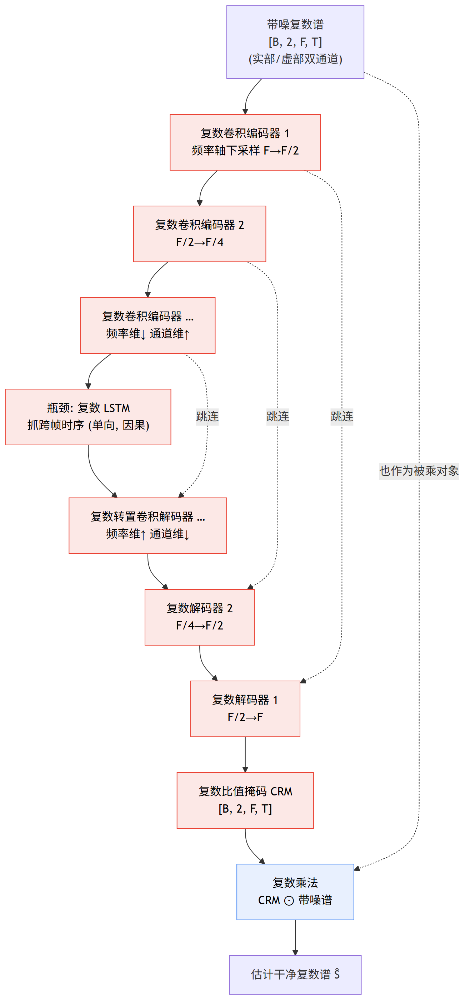
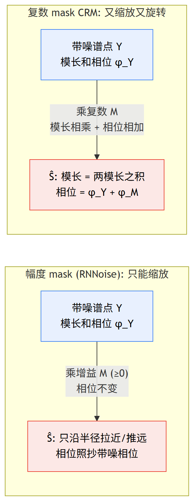
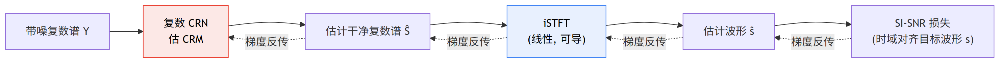

# 第 2 篇｜DCCRN 深度剖析：让网络直接在复数谱上端到端学，幅度和相位一起修

> 一句话核心直觉：RNNoise 只拧幅度的音量旋钮、相位照抄带噪信号；DCCRN 换了个活法——搭一个**复数版的卷积循环网络（CRN）**，直接在完整复数谱上估一个**复数比值掩码 CRM**，一乘就同时修好了幅度和相位，最后用 **SI-SNR** 在时域直接对齐波形来训练，整条链从头到尾可导。

---

## 一、先把教材那套扔一边

上一篇 RNNoise 把降噪切得极小：网络只出几十个增益、相位复用带噪相位——省到极致，天花板也钉死在那了。这一篇我们松开这两道绳子，看 DCCRN 怎么让网络直接啃完整复数谱、把幅度和相位一起端到端学出来。

先说个你在做实时降噪时早晚会撞上的墙：**相位这东西，到底能不能不修？**

信号系列里我们反复念叨过一件事——**波形的结构大部分藏在相位里**。你把一段语音的幅度谱和相位谱拆开，只留幅度、相位换成随机数，重建出来的波形基本是噪声；反过来只留相位、幅度拍平，重建出来的东西居然还能听出话来。这说明相位不是可有可无的装饰。

RNNoise 敢不修相位，是因为它工作在信噪比不太低的场景——这时带噪相位和干净相位差得不多，将就能用。可一旦信噪比掉下来（地铁里、大风里、多人同时说话），带噪相位已经被噪声搅乱，你还拿它去配降噪后的幅度，重建出来的波形就"发糊"、有种说不清的金属感。这时候你就会想：**能不能让网络把相位也一起学了？**

问题是——相位不好学。相位是个"绕圈"的量（$-\pi$ 到 $\pi$，$-\pi$ 和 $\pi$ 是同一个地方），你直接让网络回归一个相位角，损失函数在 $\pm\pi$ 边界处会疯掉；而且相位对幅度小的 bin 极其敏感、几乎是随机的，硬学纯属折磨网络。

DCCRN（Deep Complex Convolution Recurrent Network）给的答案很聪明：**不单独学相位，而是把幅度和相位打包成"复数"一起学。** 复数天然就是"幅度 + 相位"的载体（$z = |z|e^{j\theta}$），你在复数域里做运算，幅度和相位就自动被一起处理了，绕过了"直接回归相位角"那个坑。

> **本篇的钥匙**：DCCRN 的一切设计，都围绕一个核心动作——**在复数域里估一个复数掩码，乘到带噪复数谱上**。复数乘法会同时改变幅度（模长相乘）和相位（辐角相加），所以"一次复数乘法"就把 RNNoise 那个"只调幅度"的动作，升级成了"幅度相位一起调"。理解了这一点，后面的复数卷积、复数 LSTM、CRM 全是这句话的具体实现。

---

## 二、先看实数版的 CRN：一个专治时频图的 U-Net

DCCRN 是"复数版的 CRN"，所以得先把实数 CRN 讲明白。忘掉"复数"，就当我们在处理一张普通的时频图（幅度谱 `[B, C, F, T]`）。

CRN = Convolution Recurrent Network，翻成人话就是**"卷积编码器 + 循环瓶颈 + 卷积解码器"**，长得跟图像分割里的 U-Net 几乎一样，只不过喂进去的不是图片、是语谱图。它干三件事：

**1）卷积编码器：一层层下采样，把时频图压成紧凑表示。**
输入是一张 `[B, 1, F, T]` 的语谱图（1 个通道、F 个频率、T 帧）。编码器是一摞 2D 卷积，每层在**频率轴上下采样**（stride=2），同时把通道数往上翻。直觉上：底层的卷积核看的是"局部几个频率 bin × 几帧"的细节纹理（谐波梳齿、共振峰的边），越往上感受野越大、看到的是"整段频谱的宏观形状"。频率维一步步变小（256→128→64→…），通道维一步步变大（1→16→32→…），信息从"高分辨率、少通道"被拧成"低分辨率、多通道"。

> 为什么只在频率轴下采样、时间轴基本不动？因为**时间轴要留给后面的 LSTM 去抓时序**，而且实时降噪对时间分辨率敏感（你不想把相邻帧糊在一起）。频率轴则可以大胆压缩——相邻频率 bin 高度相关，压掉冗余不心疼。这跟 RNNoise "贴着人耳感知砍频率分辨率"是同一种直觉，只不过这里是让卷积自己学着压。

**2）循环瓶颈：LSTM 在最压缩的地方抓时序依赖。**
编码器把每一帧压成一个低维向量后，在瓶颈处接一个（或两个）LSTM。卷积负责"单帧内的时频结构"，LSTM 负责"跨帧的时间演化"——一段稳定的风扇噪声要看好几帧才能确认它稳，一个爆破音的起始要结合前后帧。这个分工你在基础系列见过：CNN 管空间/局部，RNN 管时间/记忆。**实时降噪里这个 LSTM 必须是单向的**（只吃历史帧），否则就违反了实时因果性红线。

**3）卷积解码器：一层层上采样，还原回原始时频尺寸，并带 U-Net 跳连。**
解码器是编码器的镜像，用转置卷积（反卷积）把频率维一步步放大回去（…→64→128→256），通道维缩回来。关键是**跳连（skip connection）**：把编码器每一层的输出，直接接到解码器对应层的输入上。为什么要跳连？因为编码器下采样时丢了细节（高频纹理、精确的 bin 位置），解码器光靠瓶颈那点压缩信息补不回来；跳连把编码器早期的高分辨率特征直接"抄近路"送给解码器，细节就回来了。这跟图像分割里 U-Net 跳连是完全一样的道理，只是我们分割的是"语音 vs 噪声"。

解码器最后吐出来的，不是干净语谱图本身，而是一个**掩码（mask）**——跟带噪谱同样尺寸的一张"该保留多少"的图。这一点跟 RNNoise 一脉相承：网络学的是"乘数"，不是"结果"。

一句话把实数 CRN 串起来：**卷积编码器把时频图压成紧凑表示 → LSTM 在瓶颈抓时序 → 卷积解码器配合跳连还原并吐出掩码 → 掩码乘带噪幅度谱 = 降噪幅度谱。** 到这里，它还是只处理幅度、不碰相位——跟 RNNoise 一个层次，只是用 CNN+RNN 替代了手工特征+小 GRU。真正的飞跃在下一节：把这整套搬进复数域。

把它画成 U-Net 骨架就一目了然——只不过 DCCRN 里每个方块都是**复数版**（实虚双通道并行），瓶颈的 LSTM 也是复数 LSTM：



一句话读图：**编码器沿频率轴一路下采样、解码器镜像上采样还原，跳连（虚线）把编码器的高分辨率细节抄近路补给解码器**；整条链全程携带实部/虚部两条通道并行流动，最后吐一个复数掩码 CRM，与带噪谱做一次复数乘法（蓝色，固定信号操作）得到干净谱。图里每个红色方块的"复数"含义，正是下一节要拆的。

---

## 三、复数化：一次复数运算 = 几套实数运算按复数乘法接线

现在做那个关键动作——**把 CRN 里每一个"实数模块"换成"复数模块"**。听起来吓人，其实底层就一条规则，就是那个你初中就会、但现在要拿它当接线图的复数乘法：

$$(A + iB)(x + iy) = (Ax - By) + i(Bx + Ay)$$

逐项翻译成人话：

- $x + iy$：**输入**，一个复数。$x$ 是实部、$y$ 是虚部。在我们这就是复数谱某个 bin 的实部和虚部。
- $A + iB$：**权重/变换**，也是个复数。$A$ 是"实权重"、$B$ 是"虚权重"，都是网络要学的参数。
- $Ax - By$：**输出的实部**。注意那个减号——虚乘虚出负号（$i \times i = -1$），这是复数区别于实数的灵魂。
- $Bx + Ay$：**输出的虚部**。

关键洞察在这：**一次复数运算，等于四次实数运算（$Ax, By, Bx, Ay$）按上面这个"实减虚、虚加实"的接线拼起来。** 所以我要把任何一个实数层复数化，都不用发明新算子——**准备两套一模一样的实数层（一套当实权重 $A$、一套当虚权重 $B$），再按复数乘法把它们的输出接起来就行。** 这正是基础系列 07 篇讲 `ComplexLinear` 时的套路，DCCRN 只是把它从"线性层"推广到了"卷积"和"LSTM"。

### 复数卷积

卷积本质就是"滑动的线性变换"，所以复数化跟复数线性层一模一样：准备两套实数卷积核 `conv_r`（当 $A$）和 `conv_i`（当 $B$），输入的实部虚部 $x_r, x_i$ 各过一遍，按复数乘法组合：

$$\text{out}_r = \text{conv}_r(x_r) - \text{conv}_i(x_i), \qquad \text{out}_i = \text{conv}_i(x_r) + \text{conv}_r(x_i)$$

翻译：输出实部 = 实核卷实输入 减 虚核卷虚输入；输出虚部 = 虚核卷实输入 加 实核卷虚输入。就是 $(Ax - By)$ 和 $(Bx + Ay)$ 里把"乘"换成"卷积"。代价你也看到了：**一个复数卷积 = 两套实数卷积的参数 + 四次卷积的算力**。这个"×2 参数、×4 算力"的账，是后面工程视角的关键。

### 复数 LSTM

LSTM 复杂在哪？它内部有输入门、遗忘门、输出门、候选记忆四套线性变换，还有沿时间滚动的隐状态和细胞状态。但**每一个门的核心都是一个线性变换 $Wx + b$**——而线性变换的复数化我们刚讲过。所以复数 LSTM 的做法依然是那一招：**准备两套实数 LSTM（`lstm_r` 当实权重、`lstm_i` 当虚权重），把复数输入的实部虚部分别喂进去，再按复数乘法把输出接起来：**

$$\text{out}_r = \text{LSTM}_r(x_r) - \text{LSTM}_i(x_i), \qquad \text{out}_i = \text{LSTM}_i(x_r) + \text{LSTM}_r(x_i)$$

翻译：还是 $(Ax - By)$ 和 $(Bx + Ay)$，只不过 $A$、$B$ 现在是两个完整的实数 LSTM（各自带全套门控），$x$、$y$ 是复数序列的实部虚部。

这里要点破一个新手容易绕晕的地方：**复数 LSTM 不是去发明"复数的门控激活函数"**，不需要你纠结"sigmoid 门作用在复数上是什么意思"。它的做法朴素得多——把两套实数 LSTM 当成 $A$、$B$ 两个"复数系数"，让复数输入过它们、再按复数乘法接线。**门控该 sigmoid 还是 sigmoid、该 tanh 还是 tanh，全在实数域里正常算**，复数性只体现在"两套实数 LSTM 的输出如何组合"这一步。这样做的好处是稳定、可复用现成的高度优化的 `nn.LSTM`，坏处是它并不是"数学上最纯粹的复数 LSTM"（那种要重新定义复数域的门控和梯度），而是工程上最实用的近似。DCCRN 论文选的就是这个实用版。

把复数卷积和复数 LSTM 都备齐，实数 CRN 的每个零件就都有了复数替身。整个网络从输入到输出，全程携带实部虚部两条通道并行流动，**幅度和相位的信息一路都在，从没被丢弃过**——这就是 DCCRN 区别于 RNNoise 的物理本质。

---

## 四、复数比值掩码 CRM：为什么估"复数 mask"能同时修幅度和相位

现在到了最核心的概念。网络解码器最后吐出来的那个 mask，在 DCCRN 里是个**复数**——叫复数比值掩码（Complex Ratio Mask，CRM）。它跟带噪复数谱做**复数乘法**，得到估计的干净复数谱：

$$\hat{S} = M \odot Y = (M_r + iM_i)(Y_r + iY_i)$$

逐项翻译：

- $Y = Y_r + iY_i$：**带噪复数谱**（麦克风收进来的），实部 $Y_r$、虚部 $Y_i$。
- $M = M_r + iM_i$：**网络估出的复数掩码 CRM**，实部 $M_r$、虚部 $M_i$，跟 $Y$ 逐 bin 一一对应。
- $\odot$：逐 bin 的复数乘法。
- $\hat{S} = \hat{S}_r + i\hat{S}_i$：**估计的干净复数谱**。展开就是 $\hat{S}_r = M_rY_r - M_iY_i$，$\hat{S}_i = M_iY_r + M_rY_i$——又是那个复数乘法接线。

为什么这么一乘就能同时修幅度和相位？把复数乘法换成极坐标看，一眼就通透了。任何复数写成"模长 × 相位"：$M = |M|e^{j\phi_M}$，$Y = |Y|e^{j\phi_Y}$，那么：

$$\hat{S} = |M|\,|Y|\; e^{j(\phi_M + \phi_Y)}$$

翻译：

- **模长相乘** $|\hat{S}| = |M|\cdot|Y|$：$|M|$ 就是"幅度上该乘多少"——这跟 RNNoise 的增益完全是一回事（一个 $\geq 0$ 的缩放）。
- **相位相加** $\phi_{\hat{S}} = \phi_M + \phi_Y$：$\phi_M$ 是"相位上该转多少度"。带噪相位 $\phi_Y$ 加上网络估的旋转量 $\phi_M$，就得到修正后的相位。

看明白了吗——**RNNoise 的幅度 mask，只有 $|M|$ 那一半（还强行令 $\phi_M = 0$，也就是相位不转）；CRM 多出来的 $\phi_M$，正是"相位该转多少"这个 RNNoise 永远给不出的量。** 一个复数 mask，把"缩放幅度"和"旋转相位"两个动作打包进了一次乘法。这就是 DCCRN 能修相位的全部秘密。

> **关键认知**：估复数 mask 而不是幅度 mask，本质是把降噪的"作用对象"从实数轴升级到了复数平面。幅度 mask 只能沿实轴缩放（把点拉近或推远原点），相位永远动不了；复数 mask 能在整个平面上"又缩放又旋转"，把带噪谱的那个点挪到干净谱该在的位置。**低信噪比下，干净谱和带噪谱的相位差得远，这个"旋转自由度"就是听感不发糊的关键。**

这里插一句极坐标 mask 的直觉：既然最终效果是"模长相乘、相位相加"，有些工作干脆让网络**直接输出 $|M|$ 和 $\phi_M$ 两个量**（幅度掩码 + 相位掩码），而不是输出 $M_r, M_i$。两条路殊途同归，各有数值稳定性上的取舍。DCCRN 原版走的是估 $M_r, M_i$（笛卡尔坐标）这条，因为它跟复数卷积/复数 LSTM 的实虚双通道天然对齐——网络里流动的本来就是实部虚部，最后吐实部虚部最顺。

还有个工程细节值得一提：CRM 的取值范围。幅度 mask 用 sigmoid 卡在 $[0,1]$（只衰减），但 CRM 的实部虚部理论上可以是任意实数（因为相位要能转任意角度、幅度有时需要略微放大来补偿），所以 DCCRN 对 mask 的模长做了有界处理（比如用 tanh 限制模长、或对 $M_r, M_i$ 做特定压缩），防止训练早期 mask 爆掉。这是把"复数 mask 能表达更多"这份自由，约束到"数值可训练"的必要一刀。

把"一次复数乘法同时改幅度和相位"画到复平面上，对比就很直观——RNNoise 只能沿半径缩放，CRM 还能转角度：



一句话读图：左边幅度 mask 只有 $|M|$ 一个旋钮，把带噪点沿半径拉近或推远，**相位角一动不动**；右边复数乘法多了 $\phi_M$ 这个旋转量，能把带噪谱那个点在复平面上**又缩放又旋转**地挪到干净谱该在的位置——低信噪比下这个"旋转自由度"就是听感不发糊的关键。

---

## 五、SI-SNR 训练：为什么绕开频谱 MSE，去时域对齐波形

网络会估复数谱了，接下来是怎么训。你的第一反应大概是：估计复数谱 $\hat{S}$ 和干净复数谱 $S$ 都有了，做个 MSE 不就完了？

$$\mathcal{L}_{\text{MSE}} = \|\hat{S} - S\|^2 \quad (\text{看着对, 其实不够好})$$

频谱 MSE 有两个说不出的别扭：

1. **它优化的是"频谱数值接近"，不是"听起来接近"。** 频谱 MSE 会被能量大的低频 bin 主导，而人耳在乎的很多细节在能量小的地方；数值上 MSE 降了，听感未必好。
2. **它没有闭合到最终产物——波形。** 你降噪的终点是一段能播放的波形（复数谱要经过 iSTFT 变回时域）。频谱域 MSE 小，不等于 iSTFT 出来的波形好，因为 iSTFT 里相邻帧的重叠相加（overlap-add）会把频谱误差以复杂的方式耦合到波形上。

DCCRN 的选择是：**把损失一路推到时域波形上算 SI-SNR（尺度不变信噪比）**。先给直觉，再上公式。

想象两个向量：目标波形 $s$（一整段，当成高维空间里的一个向量）和估计波形 $\hat{s}$。SI-SNR 干的事是——**把 $\hat{s}$ 投影到 $s$ 的方向上，投影落下来的那部分叫"目标分量" $s_{\text{target}}$（就是 $\hat{s}$ 里真正跟目标同方向的成分），剩下垂直的那部分叫"残差/噪声" $e_{\text{noise}}$。然后算"目标分量能量 : 残差能量"的比值，取对数变成 dB。** 比值越大，说明估计波形里"对的成分"占压倒性多数、"错的成分"很少，降噪越好。

$$s_{\text{target}} = \frac{\langle \hat{s}, s\rangle}{\|s\|^2}\, s, \qquad e_{\text{noise}} = \hat{s} - s_{\text{target}}, \qquad \text{SI-SNR} = 10\log_{10}\frac{\|s_{\text{target}}\|^2}{\|e_{\text{noise}}\|^2}$$

逐项翻译成人话：

- $\langle \hat{s}, s\rangle$：估计波形和目标波形的**内积**——两者有多"同向"。
- $\dfrac{\langle \hat{s}, s\rangle}{\|s\|^2}\,s$：把 $\hat{s}$ **投影到 $s$ 方向**得到的那根向量。除以 $\|s\|^2$ 是在做投影的归一化，投影系数就是"$\hat{s}$ 在 $s$ 方向上有多长"。
- $s_{\text{target}}$：投影下来的**目标分量**——$\hat{s}$ 里跟目标同方向、"对了的"那部分。
- $e_{\text{noise}} = \hat{s} - s_{\text{target}}$：**残差**——垂直于目标方向、"错了的"那部分。
- 比值取 $10\log_{10}$：把"对 : 错"的能量比换算成分贝。比值大 → SI-SNR 高 → 好。训练时取它的负数当损失（要最大化 SI-SNR，就最小化 $-$SI-SNR）。

**为什么叫"尺度不变"？** 注意那个投影：如果你把 $\hat{s}$ 整体放大 5 倍，$s_{\text{target}}$ 也跟着放大 5 倍，$e_{\text{noise}}$ 同样放大 5 倍，比值里的 5 上下约掉——**SI-SNR 完全不变**。这个性质对降噪太重要了：网络输出的整体音量大小无所谓（后面还有 AGC 管音量），我们只关心"波形形状对不对、噪声压没压干净"。普通 MSE 就没这个好处，输出音量差一点 MSE 就惩罚你，纯属添乱。（这一点后面代码会实测：放大 5 倍，SI-SNR 数值一模一样。）

最关键的一句——**这整条链是可导的**：

$$\text{网络} \to \hat{S}(\text{复数谱}) \xrightarrow{\text{iSTFT}} \hat{s}(\text{时域波形}) \xrightarrow{} \text{SI-SNR}$$

iSTFT（逆短时傅里叶变换）本质是"复数谱做 iFFT、再窗加重叠相加"，全是线性运算，**梯度能顺畅地从 SI-SNR 一路反传回复数谱、再回到网络每个复数卷积核**。所以 DCCRN 是真正的端到端：损失定义在最终产物（波形）上，网络中间产物（复数谱、CRM）全部为这个终极目标服务。这正是 RNNoise 做不到的——它的损失定义在"频带增益的真值"上，隔着好几层 DSP，够不着波形。

把这条"前向出波形、梯度反传回网络"的闭环画出来（红=可学习网络，蓝=固定信号变换，虚线=梯度回流）：



一句话读图：前向一路把复数谱经 iSTFT 变回波形、在时域算 SI-SNR；因为 iSTFT 全是线性可导运算，**梯度能沿虚线一路回流到网络每个复数卷积核**——相位错了波形就对不齐、SI-SNR 立刻变差，网络于是被倒逼着把相位也学好。

> **关键认知**：DCCRN 把"评价标准"直接锚在最终产物上。RNNoise 学的是"增益该是多少"（中间量的真值），DCCRN 学的是"重建出来的波形像不像干净语音"（终极目标）。当相位也进了优化目标（iSTFT 用到了估计的相位），网络就有动力把相位学好——因为相位错了，波形对不齐，SI-SNR 立刻变差。**相位不再靠猜，而是被 SI-SNR 这个时域损失倒逼着学出来。**

---

## 六、为什么 DCCRN 能超过实数 CRN

把前面几节的收益汇总，DCCRN 相对"只修幅度的实数 CRN / RNNoise"的优势就很清楚了：

- **相位不再靠猜。** 复数 mask 带 $\phi_M$、SI-SNR 又把相位纳入优化，重建波形对齐得更准，去掉了低信噪比下的"发糊/金属感"。
- **复数建模更贴合物理。** 声音在物理上就是复数谱（幅度携带能量、相位携带波形的时间结构），实虚双通道并行处理，比"把复数拍扁成幅度"丢的信息少。
- **低信噪比下优势最明显。** 高信噪比时带噪相位本来就接近干净相位，修不修差别小（这也是 RNNoise 能活得好的区间）；一旦信噪比低、相位被搅乱，"能修相位"就成了压倒性优势。这也划出了 DCCRN 的适用场景：它是为"更难的噪声环境"准备的。

代价当然有，而且不小——复数化带来的"×2 参数、×4 算力"，以及复数运算对端侧定点化的挑战。这些留到工程视角那节算账。

---

## 七、代码实战：把复数卷积、复数 LSTM、CRM、SI-SNR 全跑一遍

不复现完整 DCCRN 工程，只把它的**四个灵魂零件**用 PyTorch 跑通、打印 shape 验证接线正确：（1）复数卷积；（2）复数 LSTM；（3）CRM 与带噪谱做复数乘法得到估计干净谱；（4）SI-SNR，并实测它的尺度不变性。

### 1）复数卷积：两套实数卷积按复数乘法接线

```python
import torch
import torch.nn as nn

torch.manual_seed(0)

class ComplexConv2d(nn.Module):
    """复数 2D 卷积. 输入/输出都把复数拆成实部、虚部两条实数张量.
    复数乘法 (A+iB)(x+iy) = (Ax-By) + i(Bx+Ay):
      输出实部 = 实核卷实输入 - 虚核卷虚输入
      输出虚部 = 虚核卷实输入 + 实核卷虚输入
    """
    def __init__(self, cin, cout, kernel, stride=(1, 1), padding=(0, 0)):
        super().__init__()
        # 两套独立实数卷积: conv_r 当"实权重 A", conv_i 当"虚权重 B"
        self.conv_r = nn.Conv2d(cin, cout, kernel, stride, padding)
        self.conv_i = nn.Conv2d(cin, cout, kernel, stride, padding)

    def forward(self, xr, xi):
        # xr, xi: [B, Cin, F, T]  复数谱的实部/虚部各一个实数张量
        yr = self.conv_r(xr) - self.conv_i(xi)   # Ax - By
        yi = self.conv_i(xr) + self.conv_r(xi)   # Bx + Ay
        return yr, yi                             # 各 [B, Cout, F', T']

B, Cin, Fbin, T = 4, 1, 256, 100
xr = torch.randn(B, Cin, Fbin, T)   # 复数谱实部 [4,1,256,100]
xi = torch.randn(B, Cin, Fbin, T)   # 复数谱虚部 [4,1,256,100]
# 编码器风格: 频率轴 stride=2 下采样, 时间轴不下采样(kernel=2 无 padding, 因果地少 1 帧)
cconv = ComplexConv2d(Cin, 16, kernel=(5, 2), stride=(2, 1), padding=(2, 0))
yr, yi = cconv(xr, xi)
print("复数卷积 输入实部 shape:", xr.shape)  # [4, 1, 256, 100]
print("复数卷积 输出实部 shape:", yr.shape)  # [4, 16, 128, 99]
print("复数卷积 输出虚部 shape:", yi.shape)  # [4, 16, 128, 99]
```

跑出来：

```
复数卷积 输入实部 shape: torch.Size([4, 1, 256, 100])
复数卷积 输出实部 shape: torch.Size([4, 16, 128, 99])
复数卷积 输出虚部 shape: torch.Size([4, 16, 128, 99])
```

看 shape 之旅：频率维 `256 → 128`（stride=2 下采样，编码器在压频率），通道维 `1 → 16`（往上翻），时间维 `100 → 99`（kernel 在时间上取 2、无 padding，只吃当前和历史帧，这正是**因果卷积**——不看未来帧）。实部虚部两条通道全程并肩走，形状永远一致。

### 2）复数 LSTM：两套实数 LSTM 按复数乘法接线

```python
class ComplexLSTM(nn.Module):
    """复数 LSTM. 复数输入拆实虚, 过两套实数 LSTM, 按复数乘法组合.
    LSTM 内部核心是线性变换 Wx, 复数化 = 让这个变换变成复数线性:
      out_r = LSTM_r(x_r) - LSTM_i(x_i)
      out_i = LSTM_i(x_r) + LSTM_r(x_i)
    门控(sigmoid/tanh)全在实数域正常算, 复数性只在"两套输出如何组合"这一步.
    """
    def __init__(self, in_size, hidden, batch_first=True):
        super().__init__()
        self.lstm_r = nn.LSTM(in_size, hidden, batch_first=batch_first)  # 当实权重 A
        self.lstm_i = nn.LSTM(in_size, hidden, batch_first=batch_first)  # 当虚权重 B

    def forward(self, xr, xi):
        # xr, xi: [B, T, Feature]  batch_first (瓶颈处把每帧压成的复数特征)
        rr, _ = self.lstm_r(xr)   # A x_r
        ir, _ = self.lstm_i(xr)   # B x_r
        ri, _ = self.lstm_r(xi)   # A x_i
        ii, _ = self.lstm_i(xi)   # B x_i
        out_r = rr - ii           # Ax_r - Bx_i  (实部)
        out_i = ir + ri           # Bx_r + Ax_i  (虚部)
        return out_r, out_i

Bc, Tc, Feat = 4, 100, 64
hr = torch.randn(Bc, Tc, Feat)   # 瓶颈特征实部 [4,100,64]
hi = torch.randn(Bc, Tc, Feat)   # 瓶颈特征虚部 [4,100,64]
clstm = ComplexLSTM(Feat, 128)
or_, oi_ = clstm(hr, hi)
print("复数LSTM 输出实部 shape:", or_.shape)  # [4, 100, 128]
print("复数LSTM 输出虚部 shape:", oi_.shape)  # [4, 100, 128]
```

跑出来：

```
复数LSTM 输出实部 shape: torch.Size([4, 100, 128])
复数LSTM 输出虚部 shape: torch.Size([4, 100, 128])
```

注意输入是 `[B, T, Feature]`、`batch_first=True`（RNN 的老规矩）。四次实数 LSTM 前向（$rr, ir, ri, ii$）按 $Ax-By$、$Bx+Ay$ 拼成复数输出——这就是"一次复数 LSTM = 四份实数 LSTM 算力"的由来，工程账就记在这。

### 3）CRM 与带噪谱做复数乘法，得到估计干净谱

```python
# 解码器最终吐出一个复数 mask (这里直接用随机张量模拟), 与带噪谱逐 bin 复数乘
mask_r = torch.randn(B, Cin, Fbin, T)   # CRM 实部 [4,1,256,100]
mask_i = torch.randn(B, Cin, Fbin, T)   # CRM 虚部 [4,1,256,100]
# 估计干净谱 = mask ⊙ noisy (复数乘法: 模长相乘=修幅度, 相位相加=修相位)
est_r = mask_r * xr - mask_i * xi   # 实部
est_i = mask_r * xi + mask_i * xr   # 虚部
print("估计干净谱 实部 shape:", est_r.shape)  # [4, 1, 256, 100]
print("估计干净谱 虚部 shape:", est_i.shape)  # [4, 1, 256, 100]
```

跑出来：

```
估计干净谱 实部 shape: torch.Size([4, 1, 256, 100])
估计干净谱 虚部 shape: torch.Size([4, 1, 256, 100])
```

mask 跟带噪谱同尺寸、逐 bin 一一对应，复数乘法后得到估计干净谱。这一步就是把"缩放幅度 + 旋转相位"打包进一次乘法的地方。接下来这个 `(est_r, est_i)` 会送进 iSTFT 变回波形，再算 SI-SNR——iSTFT 是标准线性算子（`torch.istft`），此处从略，我们直接在波形上验证 SI-SNR。

### 4）SI-SNR 及其尺度不变性

```python
def si_snr(est, target, eps=1e-8):
    """est, target: [B, T] 时域波形. 返回每条样本的 SI-SNR (dB)."""
    # 零均值化: 去直流, 让"尺度不变"里的投影是纯方向投影
    est = est - est.mean(dim=-1, keepdim=True)
    target = target - target.mean(dim=-1, keepdim=True)
    # 把 est 投影到 target 方向: s_target = <est,target>/||target||^2 * target
    dot = torch.sum(est * target, dim=-1, keepdim=True)            # <est, target>
    tgt_energy = torch.sum(target ** 2, dim=-1, keepdim=True) + eps
    s_target = dot / tgt_energy * target                            # 目标分量(投影)
    e_noise = est - s_target                                        # 残差(垂直分量)
    ratio = torch.sum(s_target ** 2, dim=-1) / (torch.sum(e_noise ** 2, dim=-1) + eps)
    return 10 * torch.log10(ratio + eps)                            # [B], 单位 dB

target = torch.randn(4, 16000)              # 4 条 1 秒 (16kHz) 干净波形
est = target + 0.1 * torch.randn(4, 16000)  # 估计 = 目标 + 少量噪声 -> SI-SNR 应偏高
snr = si_snr(est, target)
print("SI-SNR per sample:", snr)
print("SI-SNR 均值 (dB) :", snr.mean().item())

# 尺度不变验证: 估计整体放大 5 倍, SI-SNR 应完全不变
snr_scaled = si_snr(5.0 * est, target)
print("放大5倍后 SI-SNR :", snr_scaled.mean().item())
```

跑出来：

```
SI-SNR per sample: tensor([19.9842, 20.0221, 19.9341, 20.0433])
SI-SNR 均值 (dB) : 19.99591827392578
放大5倍后 SI-SNR : 19.995920181274414
```

两个观察：（1）估计波形只掺了很小的噪声，SI-SNR 稳定在 20 dB 上下，符合"目标分量能量远大于残差"的预期。（2）**放大 5 倍后 SI-SNR 一模一样**（19.9959 → 19.9959）——投影里的尺度上下约掉，尺度不变性实锤。训练时损失就取 `-si_snr(...).mean()`，最大化 SI-SNR。

---

## 八、这在工程里解决什么问题

| 维度 | DCCRN 的做法 | 工程收益 / 代价 |
|---|---|---|
| **相位** | 复数 mask 带相位旋转，SI-SNR 把相位纳入优化 | 收益：低信噪比下不发糊，去掉金属感；这是相对 RNNoise 的核心飞跃 |
| **算力/参数** | 复数卷积=2套实数卷积、复数 LSTM=2套实数 LSTM | 代价：参数×2、算力约×4；比纯实数 CRN 重得多，端侧要仔细裁通道 |
| **定点化** | 实虚双通道并行，全是标准实数卷积/LSTM 拼接 | 收益：无需专门的"复数算子"，普通推理框架就能跑；代价：×4 乘加对 MCU 仍偏重，量化时实虚两路都要标定 |
| **实时因果** | 编码器用因果卷积(时间轴不看未来帧)、LSTM 单向 | 收益：满足流式实时；代价：因果约束下感受野受限，性能略让步于双向离线版 |
| **训练目标** | 时域 SI-SNR，整条链(复数谱→iSTFT→波形)可导 | 收益：直接对齐最终产物、尺度不变、逼网络学好相位；代价：需在图里接 iSTFT，训练比频谱 MSE 略慢 |
| **表达 vs 稳定** | CRM 实虚可正可负，对 mask 模长做有界处理 | 收益：比 [0,1] 幅度 mask 表达力强(能转相位、能微放大)；代价：不加约束训练易发散 |

一句话总结工程定位：**当 RNNoise 那种"只修幅度"的方案在你的噪声场景下已经触到天花板（信噪比低、听感发糊），而你又还担得起比它重一到两个数量级的算力时，DCCRN 这类"复数谱端到端"方案就是下一站。** 它不像 RNNoise 那样能塞进 MCU，但在手机、耳机 DSP、会议设备这类有一定算力预算的端侧，复数建模+相位修复带来的听感提升，通常对得起那份算力开销。真正上端侧时，最吃功夫的是把复数卷积/复数 LSTM 那"×4 乘加"裁到预算内（减通道数、砍编码器层数），以及实虚两路的量化标定——这又是驱动/嵌入式背景的人反而占便宜的活。

---

## 九、埋一个钩子

DCCRN 修好了相位，但它整套卷积-循环都跑在**单一时频分辨率**上——同一张频谱图，既要看清平稳噪声的稳、又要抓住非平稳噪声的突变，一副眼镜难兼顾。下一篇的 **FullSubNet** 就用"全频带看整体 + 子频带看局部"的多分辨率思路来破这个局。

---

## 本篇小结

- **核心动作**：DCCRN = 复数版 CRN，在完整复数谱上估一个**复数比值掩码 CRM**，与带噪谱做复数乘法，一次就同时修好幅度（模长相乘）和相位（相位相加）。
- **CRN 骨架**：卷积编码器在频率轴下采样、瓶颈 LSTM 抓时序、卷积解码器上采样还原并带 U-Net 跳连，最终吐 mask 而非直接吐干净谱。
- **复数化一招通吃**：靠复数乘法 $(A+iB)(x+iy)=(Ax-By)+i(Bx+Ay)$ 接线——两套实数模块(当 A、B)+ 复数乘法组合，就把卷积、LSTM 全复数化；代价是参数×2、算力约×4。
- **复数 LSTM 要点**：不发明"复数门控"，门控照常在实数域算，复数性只体现在两套实数 LSTM 输出如何按复数乘法组合，稳定又能复用现成 `nn.LSTM`。
- **CRM 为何强**：幅度 mask 只能沿实轴缩放、相位动不了；复数 mask 能在复平面又缩放又旋转，低信噪比下"旋转相位"这个自由度就是听感不发糊的关键。
- **SI-SNR 训练**：把损失一路推到时域波形——把估计投影到目标方向，算"目标分量能量 : 残差能量"取对数；尺度不变、直接对齐最终产物；整条"复数谱→iSTFT→波形"可导，逼网络把相位也学好。
- **工程意义**：相位修复是相对 RNNoise 的核心飞跃，适合信噪比低、算力有一定预算的端侧(手机/耳机/会议设备)；落地关键在裁通道压算力、实虚双路量化标定。
- **下一步**：单一时频分辨率难同时治平稳/非平稳噪声，下一篇看 FullSubNet 的多分辨率融合。
