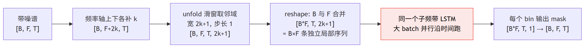
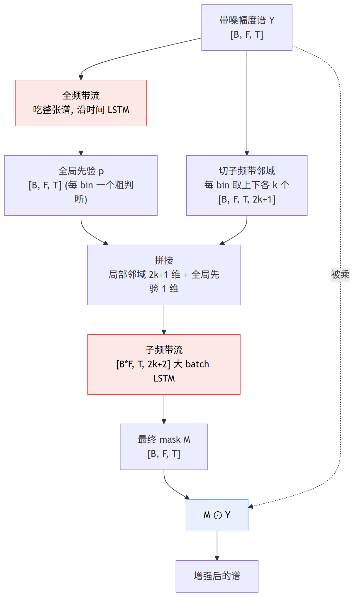

# 第 3 篇｜FullSubNet 全频带·子频带融合：一只眼看整张谱，一只眼盯每根 bin

> 一句话核心直觉：FullSubNet 不再用**一个**分辨率去扛所有噪声，而是让**两条流**分工——全频带流（fullband）看整张幅度谱，把握谐波横跨频带的全局关联，给出一个"哪些地方大概率是语音"的粗判断；子频带流（subband）对**每一个频率 bin** 单独盯着它和上下相邻的几个 bin，沿时间看这一小片频谱怎么演化，专治突然冒出来的非平稳噪声。全局判断引导局部精修，两条流融合成一个 mask。

---

## 一、先把教材那套扔一边

上一篇 DCCRN 已经很能打了：复数 CRN 编解码 + 复数 LSTM，直接在完整复数谱上估复数比值掩码，幅度和相位一起端到端学，用 SI-SNR 训练。听感比 RNNoise 上了一个台阶。

但 DCCRN 有个不太好察觉的软肋，藏在它的骨架里——**它是"单一时频分辨率"的**。卷积核在时频面上滑，感受野一旦定死，就同时定死了"它在频率上看多宽、在时间上看多长"。这个固定的视角，处理**平稳噪声**（风扇、空调、稳态白噪）很舒服，因为这类噪声谱形稳定、慢慢变，用一个不大不小的感受野盯着看，几帧就摸清规律了。

可一旦碰上**非平稳噪声**——键盘敲击、关门、咳嗽、餐具碰撞——麻烦就来了。这类噪声的共同特点是**突发**：谱形在几十毫秒内剧烈变化，某个频段本来干干净净，下一帧突然砸进一坨宽带能量，再下一帧又没了。一个为"平均情况"调好的固定感受野，对这种局部的、剧烈的、瞬时的变化反应总是慢半拍。

FullSubNet 的破局思路，说穿了就一句话：**别指望一个视角包打天下，上两个互补的视角。** 一个专门看全局、一个专门抠局部，各干各擅长的，最后合起来。

这一篇，我们就把这"两条流 + 融合"拆开，看它凭什么能同时治住平稳和非平稳噪声。先记住这把钥匙：

> **FullSubNet 的灵魂不是某个网络结构，而是"多分辨率视角"这个思路本身。** 全频带流负责"频率轴上的全局一致性"，子频带流负责"每个 bin 沿时间的局部细节"，两者拼在一起，覆盖了单一分辨率盖不住的盲区。

---

## 二、平稳 vs 非平稳噪声：为什么单靠全局会漏

先把这两类噪声的画面钉死，这是整篇的动机来源。

**平稳噪声**：谱形随时间基本不变。风扇是一坨稳定的低频加宽带底噪，空调嗡嗡声就那么几个峰。你观察它几百毫秒，它长什么样、下一刻还是什么样。对付它，"统计"就够了——看一段时间的平均谱，减掉就行，传统谱减法都能做个七七八八。

**非平稳噪声**：谱形随时间剧变。键盘"哒"一下，是一个几毫秒的宽带脉冲；关门"砰"一声，低频砸进来又迅速衰减；咳嗽是一段结构复杂、快速变化的能量团。它们的共同点是**没有稳定的谱形可供你"平均"**——你刚统计出一个规律，它已经变成另一副样子了。

现在关键问题来了：**为什么一个"看全局"的模型，对非平稳噪声反应慢？**

想象全频带模型的工作方式：它每一帧都要把整张谱（几百个 bin）一起吞进去，压成一个隐状态，再吐判断。它的注意力被摊平在整个频率轴上——它擅长回答"这一整帧的频谱，整体上像不像语音"这种全局问题。但正因为它要照顾全局，一个只在**某几个 bin、某一两帧**里爆发的键盘声，在整张谱的宏观视角里只是个不起眼的局部扰动，很容易被"平均"掉、被当成无关紧要的细节忽略。等它反应过来，突发噪声已经漏过去了。

> **第一个关键认知**：全局视角天生"重整体、轻局部"。它对缓慢的、结构化的、横跨大片频率的模式（比如稳态噪声、语音谐波结构）很敏感，但对局部的、瞬时的突发扰动迟钝。**要抓突发的非平稳噪声，你需要一个"放大镜"——专门盯住每一小片频率，对局部变化极度敏感。** 这正是子频带流要干的活。

---

## 三、子频带模型：每个 bin 只盯着自己的邻居

子频带流的设计，是 FullSubNet 最反直觉、也最出彩的一步。

先说它拒绝了什么：它**不**把整张谱一起看。它认为，要判断"频率 $f$ 这个 bin 此刻是语音还是噪声"，你根本不需要看几百个 bin，只需要看 **$f$ 自己和它上下相邻的那几个 bin** 就够了。

为什么局部就够？因为语音和噪声在**局部频谱模式随时间的演化**上，露出的马脚不一样。一根语音谐波所在的 bin，它和邻居会呈现一种稳定的、有结构的起伏（谐波是有峰有谷的窄带模式）；而一个键盘噪声砸进来时，某个 bin 和它邻居会同时、突兀地一起跳起来又落下——这种局部的时间演化模式，只看这一小片频谱就能识别，根本用不着全局信息。

具体怎么做？对每一个频率 bin $f$，取它和上下各 $k$ 个邻居，凑成一个宽度 $2k+1$ 的**局部频带**，然后**沿时间**用一个 LSTM 去建模这一小片频谱怎么演化，最后为这个 bin 输出一个 mask 值。

$$\mathbf{s}_f(t) = \big[\,Y(f-k,\,t),\ \dots,\ Y(f,\,t),\ \dots,\ Y(f+k,\,t)\,\big] \in \mathbb{R}^{2k+1}$$

逐字翻译成人话：

- $Y(f, t)$：带噪幅度谱在频率 $f$、第 $t$ 帧的值。
- $\mathbf{s}_f(t)$：把"以 $f$ 为中心、上下各 $k$ 个 bin"这一竖条在第 $t$ 帧的取值，拼成一个长度 $2k+1$ 的向量。这就是 bin $f$ 在第 $t$ 帧看到的"局部频谱切片"。
- 把 $t=1,2,\dots,T$ 这一串切片按时间喂给 LSTM，LSTM 沿时间看这一小片频谱怎么起伏，最后为 bin $f$ 输出它的 mask。

这里有个工程上极妙的点，也是这条流最容易卡住新人的地方：**$F$ 个 bin，每个都要独立地过这套"取邻域 + 沿时间 LSTM"，那不是要跑 $F$ 次 LSTM？** 不用循环。因为每个 bin 的处理**完全独立、结构完全一样**，我们可以把频率维 $F$ **直接甩进 batch 维**——原本 batch 里有 $B$ 条样本，现在当成 $B \times F$ 条独立的"局部频带时间序列"，一次性丢给同一个 LSTM 并行处理。

shape 之旅是这样切的（这是本篇最该盯住的一段）：

- 带噪谱 `[B, F, T]`。
- 沿频率维上下各补 $k$ 个 bin（padding），变成 `[B, F+2k, T]`，好让边缘的 bin 也能取到完整邻域。
- 用 `unfold` 在频率维上开一个宽度 $2k+1$、步长 1 的滑窗，切出每个 bin 的邻域：`[B, F, T, 2k+1]`。
- reshape 把 `B` 和 `F` 合并：`[B*F, T, 2k+1]`——这下就是 $B\times F$ 条长度 $T$、每帧 $2k+1$ 维的序列，标准的 `[B, T, Feature]` 格式，直接喂 LSTM。

> **第二个关键认知**：子频带流用"把 $F$ 甩进 batch 维"这一招，把"每个 bin 独立看局部演化"变成了一次大 batch 的并行 LSTM。它的视角极窄（只看 $2k+1$ 根 bin）但极深（沿整段时间盯着这一小片），**天生对局部、瞬时的频谱变化敏感——这正是非平稳噪声的命门。** 它是那只"放大镜"。

把这段 shape 之旅画出来，"每个 bin 取邻域 + F 甩进 batch"这一招就一目了然：



一句话读图：**不对 $F$ 个 bin 做循环**，而是把频率维 $F$ 直接并进 batch 维，凑成 $B\times F$ 条结构完全相同的"局部频带时间序列"，一次性喂给同一个 LSTM 并行处理——视角窄（$2k+1$ 根 bin）而时间深（整段 $T$）。

---

## 四、全频带模型：给整张谱一个粗判断

放大镜有个天生的缺陷：它看得太局部了，会**只见树木不见森林**。

举个具体的坑：语音的谐波是一整套**横跨很多频带**的结构——基频、二次谐波、三次谐波……它们等间距地分布在整个频率轴上，彼此关联。子频带流只看 $2k+1$ 根 bin 的窄窗，它看得见某一根谐波局部的样子，却**看不到"这根峰和几百 Hz 外那根峰是同一套谐波"这种跨频带的全局关联**。缺了这个全局视野，它容易把一根孤立的窄带噪声误判成语音谐波，或者反过来。

全频带流就是来补这个视野的。它的活儿很直接：**吃下整张幅度谱 `[B, F, T]`，为每个 bin 输出一个"全局先验"** ——可以理解成每个 bin 一个粗略的"这里有多大概率是语音 / 该给多大的初步增益"。因为它每帧把所有 $F$ 个 bin 一起看，它的输出天然携带了**频带之间的全局关联**：谐波结构的整体一致性、语音能量在频率轴上的整体分布，这些跨频带的信息都被它捕捉进这份先验里。

它的结构可以很朴素——就是一个沿时间跑的 LSTM，输入维度是 $F$（把整张谱的 $F$ 个 bin 当成每帧的特征），输出维度也是 $F$（每个 bin 一个先验值）：

$$\mathbf{p}(t) = f_{\text{full}}\big(Y(:,\,t),\ \mathbf{h}(t-1)\big) \in \mathbb{R}^{F}$$

逐字翻译成人话：

- $Y(:, t)$：第 $t$ 帧**整张谱**的全部 $F$ 个 bin。
- $\mathbf{h}(t-1)$：LSTM 到上一帧为止累积的隐状态（携带历史信息，这也保证了它是**因果**的——只用历史帧，实时能跑）。
- $f_{\text{full}}$：全频带 LSTM，把整张谱 + 历史状态映射成……
- $\mathbf{p}(t)$：第 $t$ 帧、$F$ 个 bin 各自的**全局先验**。注意它和输入一样是 $F$ 维——每个 bin 对应一个先验值，稍后会喂回给对应的子频带。

注意，全频带流出的**不是最终 mask**，只是一个"参考意见"。它说"我从全局看，这个 bin 大概是语音"，但它不擅长的局部突发细节，交给子频带去精修。

---

## 五、融合：全局判断引导局部精修

现在两条流各有产出，怎么合？FullSubNet 的融合手法极其朴素，却正中要害——**把全频带的先验，拼接到子频带的输入上**。

具体说：子频带流处理 bin $f$ 时，本来它的每帧输入是那个 $2k+1$ 维的局部切片 $\mathbf{s}_f(t)$。现在，我们把全频带流给 bin $f$ 的那个先验值 $p_f(t)$ **拼**上去，让子频带的每帧输入变成 $2k+2$ 维：

$$\tilde{\mathbf{s}}_f(t) = \big[\ \underbrace{\mathbf{s}_f(t)}_{2k+1\ \text{维局部邻域}}\ ;\ \underbrace{p_f(t)}_{1\ \text{维全局先验}}\ \big] \in \mathbb{R}^{2k+2}$$

逐字翻译成人话：

- $\mathbf{s}_f(t)$：bin $f$ 在第 $t$ 帧看到的 $2k+1$ 维局部频谱切片（子频带流原本的输入）。
- $p_f(t)$：全频带流对 bin $f$、第 $t$ 帧给出的那 1 维全局先验。
- 把两者首尾拼接，得到 $2k+2$ 维的新输入 $\tilde{\mathbf{s}}_f(t)$。子频带 LSTM 现在吃的是"局部细节 + 全局参考"的组合。

这个拼接的物理意义，就是让子频带在做局部精修时，**手边多了一张全局判断的小抄**。它盯着 $2k+1$ 根 bin 抠细节的同时，还知道"全局看下来，这个位置大概率是/不是语音"——遇到模棱两可的局部模式时，全局先验帮它一把定夺。

整个流程串起来，是一个清晰的**两阶段级联**：

$$Y\ \xrightarrow{\ \text{全频带 LSTM}\ }\ \mathbf{p}\ \xrightarrow{\ \text{拼到每个 bin 的局部邻域}\ }\ \tilde{\mathbf{s}}\ \xrightarrow{\ \text{子频带 LSTM}\ }\ M$$

逐段翻译：

1. 带噪谱 $Y$ 先过全频带流，出全局先验 $\mathbf{p}$（每个 bin 一个粗判断）。
2. 把 $\mathbf{p}$ 里对应 bin 的那个值，拼到该 bin 的 $2k+1$ 维局部邻域后面，得到 $\tilde{\mathbf{s}}$。
3. $\tilde{\mathbf{s}}$ 过子频带流，出每个 bin 的最终 mask $M$。
4. $M$ 乘回带噪谱，得到增强后的谱。

拼接后要盯住的 shape：局部邻域 `[B, F, T, 2k+1]`，全局先验 `[B, F, T, 1]`（把 `[B,F,T]` 的先验补一个维度），沿最后一维拼接得到 `[B, F, T, 2k+2]`，再 reshape 成 `[B*F, T, 2k+2]` 喂子频带 LSTM。

把两条流的分工和"全局先验拼进局部输入"的融合点画成一张图：



一句话读图：这是一个**两阶段级联**——带噪谱先过全频带流出"每个 bin 一个全局先验"（粗判断），这个先验被**拼**到对应 bin 的局部邻域后面（$2k+1 \to 2k+2$），再过子频带流出最终 mask。融合不是把两个 mask 平均，而是让局部精修**条件于**全局判断：子频带抠局部细节时，手边多了一张全局小抄。

> **第三个关键认知**：融合就是"拼接"这么朴素，但它把两条流的分工焊死了——**全频带出"全局判断"，子频带在这个判断的引导下做"局部精修"。** 不是简单地把两个 mask 平均，而是让局部决策**条件于**全局先验。这种"粗判断引导细精修"的级联，比任何一条流单干都强。

---

## 六、为什么这样更好：一粗一细，正好互补

把前面几节合起来看，FullSubNet 的强，来自两条流的能力**恰好互补、没有重叠浪费**：

- **全频带流**盯"频率轴上的整体一致性"：谐波跨频带的关联、语音能量的整体分布、平稳噪声的稳定谱形。它对慢的、结构化的、全局的模式敏感。
- **子频带流**盯"每个 bin 沿时间的局部演化"：某一小片频谱怎么突然跳起来、怎么起伏。它对快的、瞬时的、局部的突发模式敏感——正是非平稳噪声的软肋所在。

一个治平稳（看整体统计），一个治非平稳（抓局部突发），单一分辨率盖不住的盲区，被这一粗一细两个视角接力覆盖。而且它俩不是各干各的然后硬拼结果，是**级联**的——全局先判断、局部再精修，局部决策始终带着全局的参考。这就是它能同时压住风扇底噪和键盘敲击的根本原因。

---

## 代码实战：把两条流 + 融合跑出来

我们不复现论文的全部工程细节，只把 FullSubNet 的**灵魂三步**用 PyTorch 跑通并盯住每一步 shape：（1）全频带 LSTM 出全局先验；（2）`unfold` 切子频带邻域；（3）拼接先验后过子频带 LSTM 出每 bin mask。核心就是那趟 shape 之旅：`[B,F,T]` → 全频带先验 `[B,F,T]` → unfold 成 `[B,F,T,2k+1]` → 拼接先验 `[B,F,T,2k+2]` → reshape `[B*F,T,2k+2]` → 子频带 LSTM → `[B,F,T]` mask。

```python
import torch
import torch.nn as nn
import torch.nn.functional as F

torch.manual_seed(0)


class MiniFullSubNet(nn.Module):
    def __init__(self, n_freq=257, k=15, fb_hidden=64, sb_hidden=64):
        super().__init__()
        self.k = k
        self.n_neighbor = 2 * k + 1                 # 局部邻域宽度 2k+1
        # 全频带流: 吃整张谱 [B,T,F], 每个 bin 出一个先验 (单向 LSTM = 因果, 实时能跑)
        self.fb_lstm = nn.LSTM(n_freq, fb_hidden, batch_first=True)
        self.fb_out  = nn.Linear(fb_hidden, n_freq)
        # 子频带流: 每个 bin 吃 (邻域 2k+1 + 全频带先验 1) 维
        self.sb_lstm = nn.LSTM(self.n_neighbor + 1, sb_hidden, batch_first=True)
        self.sb_out  = nn.Linear(sb_hidden, 1)

    def forward(self, mag):
        # mag: [B, F, T]  带噪幅度谱
        B, Fbin, T = mag.shape

        # ---- 全频带流: 看整张谱, 出全局先验 ----
        fb_in = mag.transpose(1, 2)                 # [B, T, F]  把 F 当每帧特征
        fb_h, _ = self.fb_lstm(fb_in)               # [B, T, fb_hidden]
        fb_prior = self.fb_out(fb_h)                # [B, T, F]  每 bin 一个先验
        fb_prior = fb_prior.transpose(1, 2)         # [B, F, T]

        # ---- 切子频带邻域: 每个 bin 取上下各 k 个邻居 ----
        padded = F.pad(mag, (0, 0, self.k, self.k)) # 沿 F 上下各补 k: [B, F+2k, T]
        nb = padded.unfold(1, self.n_neighbor, 1)   # [B, F, T, 2k+1] 滑窗切邻域

        # ---- 融合: 把全局先验拼到每个 bin 的局部邻域后面 ----
        fb_p  = fb_prior.unsqueeze(-1)              # [B, F, T, 1]
        sb_in = torch.cat([nb, fb_p], dim=-1)       # [B, F, T, 2k+2]

        # ---- 把 F 甩进 batch 维, 每个 bin 独立并行过 LSTM ----
        sb_in = sb_in.reshape(B * Fbin, T, self.n_neighbor + 1)  # [B*F, T, 2k+2]
        sb_h, _ = self.sb_lstm(sb_in)               # [B*F, T, sb_hidden]
        mask = torch.sigmoid(self.sb_out(sb_h))     # [B*F, T, 1]  0~1 增益掩码
        mask = mask.reshape(B, Fbin, T)             # [B, F, T]  切回来
        return mask, fb_prior


B, Fbin, T, k = 2, 257, 50, 15      # 2 条样本, 257 个 bin(512点STFT), 50 帧, 邻域半径 15
mag = torch.rand(B, Fbin, T).abs()  # 模拟带噪幅度谱
net = MiniFullSubNet(n_freq=Fbin, k=k)
mask, fb_prior = net(mag)

print("带噪幅度谱 mag   shape :", mag.shape)        # [2, 257, 50]
print("全频带先验 fb    shape :", fb_prior.shape)   # [2, 257, 50]
print("子频带 mask      shape :", mask.shape)       # [2, 257, 50]
print("mask 取值范围         :", round(mask.min().item(), 3), "~", round(mask.max().item(), 3))
enhanced = mask * mag               # 掩码乘回带噪谱 = 增强后幅度谱
print("增强后幅度谱     shape :", enhanced.shape)   # [2, 257, 50]
print("总参数量              :", sum(p.numel() for p in net.parameters()))
```

跑出来：

```
带噪幅度谱 mag   shape : torch.Size([2, 257, 50])
全频带先验 fb    shape : torch.Size([2, 257, 50])
子频带 mask      shape : torch.Size([2, 257, 50])
mask 取值范围         : 0.496 ~ 0.538
增强后幅度谱     shape : torch.Size([2, 257, 50])
总参数量              : 124546
```

`unfold` 这一步是子频带流的机关，单独拎出来看清它到底切了什么：

```python
import torch
import torch.nn.functional as F

# 造一张迷你谱: 1 条样本, 8 个 bin, 3 帧
demo = torch.arange(1 * 8 * 3.).reshape(1, 8, 3)   # [1, 8, 3]
dp = F.pad(demo, (0, 0, 2, 2))                     # 沿 F 上下各补 2: [1, 12, 3]
du = dp.unfold(1, 5, 1)                            # 宽 5 步长 1 滑窗: [1, 8, 3, 5]
print("输入     :", demo.shape)   # [1, 8, 3]   8 个 bin
print("补边后   :", dp.shape)     # [1, 12, 3]  上下各补 k=2
print("unfold后 :", du.shape)     # [1, 8, 3, 5] 每个 bin 一个宽5的邻域
```

跑出来：

```
输入     : torch.Size([1, 8, 3])
补边后   : torch.Size([1, 12, 3])
unfold后 : torch.Size([1, 8, 3, 5])
```

看清了：8 个 bin 补边后成 12，`unfold` 用宽 5 步长 1 的滑窗扫过去，**每个 bin 都得到一个恰好以它为中心、宽 $2k+1=5$ 的邻域**，bin 数不变（还是 8），只是每个 bin 多长出一维长度 5 的邻域。这就是"每个 bin 只盯自己邻居"在张量上的落地。

几个关键观察：

1. **全程只操作幅度谱**：从 `mag` 到 `mask` 到 `enhanced`，相位没出现——最小实现里我们复用带噪相位（真实的 FullSubNet 也可以出复数比值掩码，那是 DCCRN 那套的延伸，机制不冲突）。
2. **`B*F` 这个 batch 是关键**：`reshape(B*Fbin, T, ...)` 之后，257 个 bin 变成了 batch 里 257 条并行的独立序列，一次 LSTM 调用全部算完，不需要对 bin 循环。这是子频带流能高效跑起来的根本。
3. **两条 LSTM 都是单向的**：`nn.LSTM` 默认单向，只吃历史帧、不看未来帧——满足实时因果性红线，流式推理时缓存两条流各自的隐状态即可。

---

## 这在工程里解决什么问题

| 维度 | FullSubNet 的做法 | 工程收益 / 代价 |
|---|---|---|
| **噪声类型** | 全频带治平稳（看整体统计）、子频带治非平稳（抓局部突发） | 收益：同时压住风扇底噪和键盘/关门这类突发噪声，覆盖单分辨率的盲区 |
| **并行/显存** | 子频带把 $F$ 甩进 batch 维，$B\times F$ 条序列并行过一个 LSTM | 收益：无需对 bin 循环，GPU 上高度并行；代价：batch 维膨胀 $F$ 倍，**显存占用随 $F$ 线性上涨**，长序列 + 高频分辨率时吃显存 |
| **实时因果** | 两条流都用单向 LSTM，只用历史帧 | 收益：满足实时红线；流式推理时缓存全频带 + 子频带各自的隐状态；子频带只能看历史帧的局部演化 |
| **计算量** | 全频带 1 次（大特征维）、子频带 $F$ 次并行（小特征维 $2k+2$） | 代价：子频带 LSTM 被调用 $B\times F$ 次(并行)，是计算主体；邻域 $k$ 越大越准也越重 |
| **邻域半径 $k$** | 每个 bin 看上下各 $k$ 个邻居 | $k$ 太小抓不住局部结构，太大退化成"半个全频带"还更耗；是关键超参 |
| **相位** | 最小版复用带噪相位；可扩展成出复数掩码 | 与 DCCRN 的复数掩码机制不冲突，可叠加 |

一句话总结它的工程定位：**当你的降噪要在真实、嘈杂、噪声类型混杂的环境里扛住突发非平稳噪声，而 DCCRN 这类单分辨率模型总在键盘/关门声上翻车时，FullSubNet 的"全局+局部"双流是一个经过 DNS 挑战赛验证、性价比很高的答案。** 它的主要代价是子频带那个 $B\times F$ 的大 batch 带来的显存压力——这也是后续很多工作优化的方向。

---

## 埋一个钩子

FullSubNet 两条流都靠 LSTM 沿时间传递记忆。可 LSTM 的记忆是**一根线**——信息一帧一帧往下滚，隔得越远、衰减越狠，几百帧前那个和当前强相关的语音片段，信号早就被稀释得所剩无几。能不能干脆抛开这根线，让**任意两帧直接对话**、想参考谁就直接去查谁？下一篇的**自注意力**，就是这个想法。

---

## 本篇小结

- **核心思路**：FullSubNet 放弃"单一时频分辨率包打天下"，用**全频带 + 子频带两条流**的多分辨率视角，破 DCCRN 单分辨率难兼顾平稳/非平稳噪声的局限。
- **平稳 vs 非平稳**：平稳噪声（风扇、白噪）谱形稳定、靠统计就能治；非平稳噪声（键盘、关门、咳嗽）突发、谱形剧变，全局模型因"重整体轻局部"对它反应慢。
- **子频带流**：每个 bin 只看上下相邻 $2k+1$ 根 bin 的局部切片，沿时间过 LSTM 出该 bin 的 mask，对局部突发极敏感；靠"把 $F$ 甩进 batch 维"实现并行，不必对 bin 循环。
- **全频带流**：吃整张谱出每 bin 的全局先验，携带谐波跨频带关联等全局信息，但只是"粗判断"，不是最终 mask。
- **融合**：把全局先验**拼接**到子频带每个 bin 的局部邻域输入后面（$2k+1 \to 2k+2$），让局部精修**条件于**全局判断——两阶段级联 $Y \to \mathbf{p} \to \tilde{\mathbf{s}} \to M$。
- **为什么更强**：一粗一细正好互补，全局管整体一致性、局部抓突发细节，且级联而非平均。
- **工程意义**：同时治平稳与非平稳噪声，DNS 挑战赛验证；主要代价是子频带 $B\times F$ 大 batch 的显存开销，两条流单向 LSTM 满足实时因果。
- **下一步**：LSTM 的记忆是"一根线"、远处信息会衰减——下一篇看自注意力如何让任意两帧直接对话。
