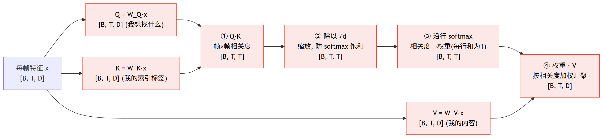
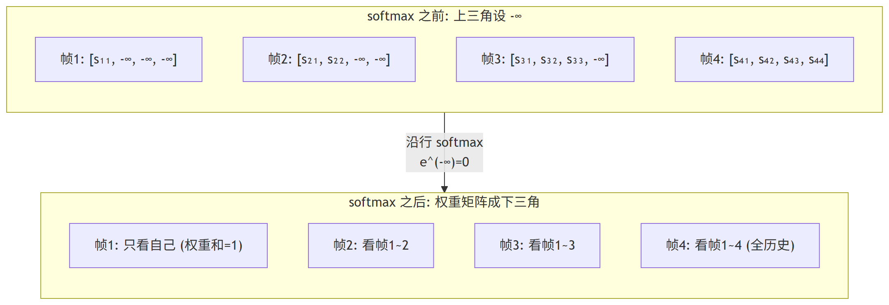

# 第 4 篇｜自注意力机制 Q/K/V：让任意两帧越过时间直接对话

> 一句话核心直觉：注意力就是让当前这一帧**主动举手**去问序列里所有其他帧"你们谁跟我相关"，然后按相关度**加权地把它们的内容汇聚过来**。它给每帧准备了三样东西——**Q（查询：我想找什么）、K（键：我的索引标签）、V（值：我真正的内容）**；两帧的 Q 和 K 点一下积，就是它俩的相关度。**任意两帧的距离从此都是"一步直达"，不再有 RNN 那根越传越弱的记忆线。**

---

## 一、先把教材那套扔一边

前三篇我们一路从 RNNoise、DCCRN 走到 FullSubNet，抓时序的活儿始终压在 RNN/LSTM/GRU 身上——记忆沿时间一根线往下滚，隔得越远越衰减，而且必须一帧接一帧串行算，天生跟并行无缘。这一篇的主角，就是来把这根"记忆线"拆掉的：**自注意力（self-attention）让任意两帧直接对话。**

翻开讲注意力的资料，十有八九一上来就是"翻译英法句子""这个词 attend 到那个词"。别学那套——我们做的是语音前端，序列里流动的不是单词，是**一帧帧的语音特征**。整篇你只要死死记住一张画面：

> 我们的输入永远是 `[B, T, D]`——**B 是批次，T 是语音帧数（不是词数！），D 是每帧的特征维度**。注意力做的所有事，都发生在"第 t 帧要不要参考第 s 帧"这个层面上。

先看清楚 RNN 到底卡在哪，才知道注意力为什么值得请出场。

---

## 二、一帧想回头找"很久以前那个相似的元音帧"

设想一个具体的语音场景。你在处理一段带混响的语音，走到第 800 帧——这是一个元音 /a/ 的稳态段。要判断"这一帧里哪些是干净语音、哪些是噪声/混响拖尾"，一个极有用的参考是：**很久以前，比如第 120 帧，也出现过一个几乎一样的 /a/，而且那会儿信噪比很好、很干净。** 如果能把第 120 帧的信息直接调过来对齐着看，当前帧的判断会稳很多。

再想混响的例子：当前帧听到的一部分能量，其实是**几百毫秒前那个源帧**经过墙壁反射拖过来的尾巴。要把这条拖尾归因、消掉，最好能直接"回头看一眼那个源帧"。

RNN 怎么办这件事？它只能指望隐状态 $h_t$ 把第 120 帧的信息一路 120、121、122……一帧帧滚到第 800 帧。这条路上每过一个 GRU/LSTM 单元，信息就被"更新—遗忘"揉一次，几百步下来，第 120 帧那点线索早被稀释得所剩无几了（这就是基础系列讲烂的**长程依赖衰减**）。更别提它还是串行的——第 800 帧的状态必须等前 799 帧全算完才能出来。

注意力给的答案简单粗暴：**别传了，直接问。** 第 800 帧不需要沿着时间线一步步爬回第 120 帧，它可以**一步**就跟第 120 帧建立连接——就像开会时你有疑问，不用把话一个个传给旁边的人再传到对面，而是**直接举手，冲着全场问一句"谁手上有跟我这个 /a/ 相关的信息"**，谁相关谁应声。

> **第一个关键认知**：RNN 的信息传递是"接力棒"——隔得远就衰减、必须串行。注意力的信息传递是"广播 + 点名"——**任意两帧距离都是 1，且所有帧同时开口、一次算完**。这一条差异，既解决了长依赖，又解锁了并行，是注意力掀翻 RNN 的根本原因。

---

## 三、Q、K、V：每帧同时揣着提问、标签和内容

举手提问这个画面很好，但"怎么问、怎么应"要落到能算的东西上。注意力的做法是：**给每一帧都生成三个向量**，各司其职。

拿第 t 帧的特征向量 $x_t$（长度 D）说话。我们用三个可学习的线性层，把它投影成三样东西：

- **Query（查询）$q_t$**：这一帧"想找什么"。翻译成语音的话：第 800 帧的 Query 大致编码了"我是个 /a/ 稳态、我想找历史上跟我音色相近、信噪比更好的帧"。它是这一帧**发出的提问**。
- **Key（键）$k_t$**：这一帧"给自己贴的索引标签"，用来被别人检索。第 120 帧的 Key 大致编码了"我是个干净的 /a/"。它是这一帧**挂出去等人来匹配的招牌**。
- **Value（值）$v_t$**：这一帧"真正想被别人取走的内容"。别人一旦决定参考我，取走的就是这个 $v_t$。

三者都是从同一个 $x_t$ 线性变换来的，但用三套**不同**的权重，所以能各自专门化——一个专门管"怎么提问"，一个专门管"怎么让自己好被找到"，一个专门管"我要贡献什么内容"。

$$q_t = W_Q\, x_t,\qquad k_t = W_K\, x_t,\qquad v_t = W_V\, x_t$$

逐字翻译成人话：$W_Q, W_K, W_V$ 是三个 `[D, D]` 的权重矩阵（就是三个 `nn.Linear`），把每帧的 D 维特征分别映射成 D 维的查询、键、值。**它们是这个机制里唯一要学的东西**——网络学的不是"该关注哪帧"这种死规则，而是"该怎么提问、怎么贴标签、怎么组织内容"这套通用能力。

那"第 800 帧和第 120 帧到底有多相关"这个分数怎么算？**用第 800 帧的 Query 去和第 120 帧的 Key 做点积。**

$$\text{score}(t, s) = q_t \cdot k_s$$

翻译：两个向量点积，方向越一致、值越大，就代表"我这个提问"和"你这个标签"越对得上，相关度越高。第 800 帧的 Query（找干净 /a/）碰上第 120 帧的 Key（我是干净 /a/），点积就大；碰上某个静音帧的 Key，点积就小。

> **第二个关键认知**：Q、K、V 把"检索"这件事拆成了三个正交的角色——**Q 管提问、K 管被检索、V 管被取用**。为什么不能只用一套向量、拿 $x_t \cdot x_s$ 当相关度？因为"我作为提问方想找什么"和"我作为被查方想展示什么"往往不是一回事：一个元音帧作为查询可能想找同类元音，作为被查标签却想强调"我是浊音、我信噪比高"。拆成 Q/K 两套，让这两个角色能独立学，表达力强得多。

---

## 四、核心公式：一次点积、一次缩放、一次归一、一次汇聚

把上面对"一对帧"的操作，一口气推广到"所有帧对所有帧"，就是那条著名的公式：

$$\text{Attention}(Q, K, V) = \text{softmax}\!\left(\frac{QK^{\top}}{\sqrt{d}}\right) V$$

别被它吓到，它其实就是四个动作串起来。我们盯着 shape 一步步走（设 $Q, K, V$ 都是 `[T, D]`，先不看 batch 维）：

**第一步，$QK^{\top}$——算出"帧 × 帧"的相关度矩阵。**
$Q$ 是 `[T, D]`，$K^{\top}$ 是 `[D, T]`，矩阵乘得到 `[T, T]`。这个 T×T 矩阵的第 $(t, s)$ 个元素，正是第 t 帧 Query 和第 s 帧 Key 的点积——**一整张"每帧对每帧"的相关度表格**。第 800 行第 120 列那个数，就是"第 800 帧有多想参考第 120 帧"。

$$Q_{[T,D]}\;K^{\top}_{[D,T]} \;\longrightarrow\; \text{scores}_{[T,T]}$$

**第二步，除以 $\sqrt{d}$——把分数缩一缩，别让 softmax 饱和。**
$d$ 是 Q/K 的维度。点积是 d 个乘积求和，d 一大（比如 512），点积的数值就容易冲到很大。而下一步的 softmax 对大数值极其敏感——输入一大，它就趋近于"赢家通吃"，几乎全部权重压给一帧、其余全是 0，梯度也跟着几乎消失（softmax 饱和了，学不动）。除以 $\sqrt{d}$ 正好把方差拉回 1 附近，让分数落在 softmax 的"敏感区"。这一步不改 shape，仍是 `[T, T]`。

**第三步，softmax（沿行）——把相关度变成"加起来是 1 的权重"。**
对 `[T, T]` 矩阵的**每一行**做 softmax。第 t 行本来是"第 t 帧对所有 T 帧的原始分数"，softmax 后变成一组非负、和为 1 的权重——**"我这一帧的注意力，百分之多少分给第 1 帧、百分之多少分给第 2 帧……"**。第 800 行里，第 120 帧那一列的权重会很突出。shape 仍是 `[T, T]`。

**第四步，乘 $V$——按权重把内容加权汇聚。**
权重矩阵 `[T, T]` 乘上 $V$ `[T, D]`，得到 `[T, D]`。第 t 行输出 = 用第 t 帧那组权重，对所有帧的 Value 做加权求和。**第 800 帧的输出，就是"以第 120 帧内容为主、掺一点其他相关帧内容"的一个融合向量**——它把散落在整条序列里的相关信息，一步汇聚到了当前帧。

$$\text{weights}_{[T,T]}\;V_{[T,D]} \;\longrightarrow\; \text{output}_{[T,D]}$$

> **第三个关键认知**：输入 `[T, D]`、输出还是 `[T, D]`——**注意力不改变序列长度，它只是把每一帧"重写"成了它所关心的那些帧的加权融合。** 中间那个 `[T, T]` 矩阵是整个机制的灵魂：它显式地、可读地写出了"哪帧在看哪帧、看得多重"。想调试模型关注了什么，把这张图画出来看就行——这是 RNN 那团黑箱隐状态给不了的透明度。

加上 batch 维，全流程 shape 就是：$x$ `[B, T, D]` → Q/K/V 各 `[B, T, D]` → scores `[B, T, T]` → softmax `[B, T, T]` → 输出 `[B, T, D]`。

把这四个动作串成一张计算流图，盯住 shape 怎么变：



一句话读图：每帧先投影出 Q/K/V 三样东西；**① $QK^{\top}$ 得到那张"每帧对每帧"的 `[T,T]` 相关度表 → ② 除 $\sqrt{d}$ 缩一缩 → ③ 沿行 softmax 变成和为 1 的权重 → ④ 拿权重对 $V$ 加权汇聚**。进出都是 `[B, T, D]`，序列长度不变——注意力只是把每帧"重写"成它所关心那些帧的加权融合。

---

## 五、为什么它同时拿下了"长依赖"和"并行"

回头兑现开篇的承诺，看它凭什么两样都占。

**长依赖：任意两帧距离都是 1。**
在那张 `[T, T]` 矩阵里，第 800 帧和第 120 帧的连接，就是第 800 行第 120 列**一个直接的点积**——中间隔了多少帧，完全不影响这个连接的强度。信息不再经过任何中转、不被反复揉搓，自然不衰减。RNN 里第 800 帧要够到第 120 帧得走 680 步，注意力里永远是 1 步。

**并行：整张矩阵一次矩阵乘算完。**
$QK^{\top}$ 是一个大矩阵乘法，$\text{weights}\cdot V$ 又是一个——**所有帧对所有帧的关系，是被一次性同时算出来的**，没有"必须等第 799 帧才能算第 800 帧"的先后依赖。这正好喂饱 GPU 那种"能并行的都给我并行"的算力结构。RNN 的串行递推在这里是硬伤：它算第 t 步必须先有第 t-1 步的隐状态，T 步就得排 T 次队，GPU 再强也只能干瞪眼。

> **第四个关键认知**：注意力用一个 `[T, T]` 矩阵，把"长依赖"和"可并行"这对在 RNN 里此消彼长的矛盾，一次性同时解决了。代价藏在下一节——这张矩阵本身。

---

## 六、代价：这张 T×T 矩阵会吃掉你的显存

天下没有免费的午餐。那张让一切变漂亮的 `[T, T]` 相关度矩阵，正是注意力的软肋：**它的大小随帧数 T 平方增长——复杂度 $O(T^2)$。**

对语音来说这尤其扎心，因为语音的 T 动辄很大。举个量级感：一段 10 秒的音频，按 10ms 帧移算就有 1000 帧；`[T, T]` 就是 1000×1000 = 一百万个元素一张图，还要乘上 batch 和后面要讲的多头。帧数翻倍到 2000，这张图直接翻四倍。长音频、高帧率场景下，**显存和算力是按平方在烧**，很快就爆。

这也是为什么后续一大堆工作（各种稀疏注意力、局部窗口注意力、线性注意力，以及语音里常用的分块/流式注意力）都在跟这个 $O(T^2)$ 死磕。这里先埋一句、不展开：**下一篇会看到，实际用的从来不是我们这里的单个注意力，而是把它复制成"多头"并行——多头在增强表达力的同时，也让这个平方代价更需要精打细算。**

---

## 七、因果掩码：实时场景里，当前帧不许偷看未来

还有一条对语音前端**生死攸关**的约束，前面被我藏起来了：上面那张 `[T, T]` 矩阵是"全连接"的——第 t 帧可以看**所有**帧，包括排在它后面的未来帧。

这在离线处理（整段音频都到齐了再算）没问题。但**实时降噪/AEC 是流式的**：处理第 t 帧时，第 t+1、t+2……帧的声音**还没被麦克风采进来**。你不可能让当前帧去参考一个物理上还不存在的未来帧——这就是基础系列反复敲的**实时因果性红线**。RNNoise 用单向 GRU 天然满足它，而注意力默认是"双向偷看"的，必须动手把未来堵上。

办法很直接：**因果掩码（causal mask）**。在 softmax **之前**，把相关度矩阵里所有"看向未来"的位置（第 $(t, s)$ 且 $s > t$，也就是矩阵的**上三角**）统统设成 $-\infty$。

$$\text{score}(t, s) \leftarrow \begin{cases} \text{score}(t, s), & s \le t \ (\text{当前及历史帧，放行}) \\ -\infty, & s > t \ (\text{未来帧，封死}) \end{cases}$$

翻译：为什么是 $-\infty$ 而不是直接删掉或设 0？因为紧接着要过 softmax，而 $\text{softmax}$ 里 $e^{-\infty} = 0$——**这些未来帧的位置经过 softmax 后权重精确等于 0，一丝一毫都汇聚不进来**，同时其余合法帧的权重仍能正常归一化到和为 1。设成 0 是不行的，$e^{0}=1$ 反而会给未来帧分权重。

> **第五个关键认知**：因果掩码是把注意力从"离线双向"改造成"实时可用"的开关，代价仅仅是加一个上三角的 $-\infty$ 掩码。**这条红线在语音前端是硬指标**——一个模型 PESQ 分数再漂亮，只要它偷看了未来帧，就没法上流式产品线。面试里被问"你这注意力怎么保证实时"，答的就是这个因果掩码（外加分块/缓存策略，后面篇章再说）。

用一张 4 帧的相关度矩阵示意，因果掩码就是把上三角（看向未来）封死、只留下三角（当前及历史）：



一句话读图：矩阵第 $t$ 行代表"第 t 帧参考谁"，上三角 $(s>t)$ 全是未来帧，设 $-\infty$ 后经 softmax 权重精确归零；剩下的下三角保证**每帧只汇聚当前及历史帧**——这就是注意力满足实时因果性的全部手脚。

---

## 代码实战：手写单头自注意力 + 因果掩码

不调 `nn.MultiheadAttention`，我们把上面那条公式**一行行手写**出来跑通，重点盯住三处 shape——`[B,T,T]` 的得分矩阵、softmax 后的权重、`[B,T,D]` 的输出——再演示因果掩码怎么把未来帧的权重压成 0。

```python
import torch
import torch.nn as nn
import math

torch.manual_seed(0)

class SelfAttention(nn.Module):
    """最小单头自注意力: 输入 [B, T, D], 输出 [B, T, D].
    T 是语音帧数, D 是每帧特征维度."""
    def __init__(self, d_model):
        super().__init__()
        self.d = d_model
        # 三个不同的线性层, 分别把每帧特征投影成 Query / Key / Value
        self.W_q = nn.Linear(d_model, d_model, bias=False)  # "我想找什么"
        self.W_k = nn.Linear(d_model, d_model, bias=False)  # "我的索引标签"
        self.W_v = nn.Linear(d_model, d_model, bias=False)  # "我真正的内容"

    def forward(self, x, causal=False):
        # x: [B, T, D]
        B, T, D = x.shape
        Q = self.W_q(x)                       # [B, T, D]
        K = self.W_k(x)                       # [B, T, D]
        V = self.W_v(x)                       # [B, T, D]

        # 第一步: Q·K^T 得到 帧×帧 相关度矩阵, 再除以 sqrt(d) 缩放
        scores = Q @ K.transpose(-2, -1) / math.sqrt(self.d)  # [B, T, T]

        # (可选) 因果掩码: 把 s>t 的未来帧位置(上三角)设成 -inf
        if causal:
            future = torch.triu(torch.ones(T, T), diagonal=1).bool()  # 上三角=未来帧
            scores = scores.masked_fill(future, float('-inf'))

        # 第三步: 沿最后一维(每帧对所有帧的分数)做 softmax -> 权重
        attn = torch.softmax(scores, dim=-1)  # [B, T, T], 每行和为 1

        # 第四步: 用权重对 V 加权汇聚
        out = attn @ V                        # [B, T, D]
        return out, scores, attn


B, T, D = 2, 6, 16          # 2 条样本, 每条 6 帧语音, 每帧 16 维特征
x = torch.randn(B, T, D)
sa = SelfAttention(D)

out, scores, attn = sa(x)   # 默认: 双向(离线)
print("输入 x        shape :", x.shape)       # [2, 6, 16]
print("得分 QK^T     shape :", scores.shape)  # [2, 6, 6]  帧×帧
print("softmax 权重  shape :", attn.shape)    # [2, 6, 6]
print("输出 out      shape :", out.shape)     # [2, 6, 16] 长度不变
print("第0条每行权重和(应≈1):", attn[0].sum(dim=-1))
```

跑出来：

```
输入 x        shape : torch.Size([2, 6, 16])
得分 QK^T     shape : torch.Size([2, 6, 6])
softmax 权重  shape : torch.Size([2, 6, 6])
输出 out      shape : torch.Size([2, 6, 16])
第0条每行权重和(应≈1): tensor([1., 1., 1., 1., 1., 1.])
```

三处 shape 完全对上：`[B,T,D]` 进，中间鼓出一个 `[B,T,T]` 的帧×帧关系矩阵，最后又收回 `[B,T,D]`——序列长度纹丝不动，每帧只是被"重写"成了它关心的帧的加权融合。每行权重和为 1，印证 softmax 把相关度归一成了合法的加权系数。

接着开**因果掩码**，看未来帧是不是真被堵死了：

```python
out_c, scores_c, attn_c = sa(x, causal=True)   # 实时: 只看当前及历史帧

torch.set_printoptions(precision=2, sci_mode=False)
print("因果权重矩阵(第0条样本) [T, T]:")
print(attn_c[0])
print("上三角(未来帧)是否全为 0 :",
      torch.allclose(attn_c[0].triu(diagonal=1), torch.zeros(T, T)))
```

跑出来：

```
因果权重矩阵(第0条样本) [T, T]:
tensor([[1.00, 0.00, 0.00, 0.00, 0.00, 0.00],
        [0.37, 0.63, 0.00, 0.00, 0.00, 0.00],
        [0.23, 0.41, 0.36, 0.00, 0.00, 0.00],
        [0.18, 0.06, 0.12, 0.65, 0.00, 0.00],
        [0.14, 0.27, 0.26, 0.16, 0.17, 0.00],
        [0.10, 0.14, 0.15, 0.19, 0.23, 0.19]])
上三角(未来帧)是否全为 0 : True
```

看这张权重矩阵的形状就全懂了：它是一个**下三角**——

- **第 0 帧**（第一行）只能看自己，权重 1.0 全压在对角线上；它是序列开头，前面没有历史。
- **第 t 帧**（第 t 行）只在第 0 到第 t 列有非零权重，右上方那片未来帧全是 0——被 $-\infty$ 掩码经 softmax 压成了精确的 0。
- 每一行的非零权重加起来仍然是 1（合法帧内部重新归一化），说明堵住未来没有破坏归一。

这就是流式注意力的骨架：**每帧只向左看，绝不偷看右边的未来帧**。把这个掩码去掉，就退回离线双向模式。工程上一个开关的事，语义上却是"能不能上实时产品线"的分水岭。

---

## 这在工程里解决什么问题

把注意力和我们前三篇一直在用的 RNN 放在一张表里对比，它的取舍就清清楚楚：

| 维度 | RNN / LSTM / GRU | 自注意力 |
|---|---|---|
| **长依赖** | 隔得远就衰减，几百帧外的信息基本丢光 | 任意两帧距离都是 1，一步直达、不衰减 |
| **并行** | 必须串行递推，第 t 步等第 t-1 步，GPU 吃不满 | 一次矩阵乘同时算完所有帧对，喂饱 GPU |
| **计算/显存复杂度** | $O(T)$，随帧数线性增长，长音频友好 | $O(T^2)$，`[T,T]` 矩阵随帧数平方膨胀，长音频烧显存 |
| **实时因果** | 单向 RNN 天然只看历史，天生满足红线 | 默认双向偷看未来，**必须加因果掩码**才能上流式 |
| **可解释性** | 隐状态是黑箱，看不出它记住了啥 | `[T,T]` 权重矩阵显式写出"哪帧在看哪帧"，可视化即可调试 |
| **记忆容量** | 隐状态维度固定，是个有损的"信息瓶颈" | 直接检索原始帧，不经压缩瓶颈 |

一句话定位：**注意力用 $O(T^2)$ 的算力代价，换来了"任意两帧直接对话 + 全序列并行 + 透明可读"三样东西。** 对语音前端而言，它最诱人的地方是能一步够到"很久以前那个相似帧""几百毫秒前那个混响源帧"，这正是 RNN 越传越弱、够不着的死角。而它最需要被驯服的地方有两处：一是那张平方膨胀的矩阵在长音频下会烧显存，二是它默认双向、上流式实时前必须先套上因果掩码这条红线。这两点也正是后面篇章要反复处理的工程主题。

---

## 埋一个钩子

我们这里手写的，只是**一个**注意力头。真正的 **Transformer**，是把它复制成**多头**并行、再叠上**位置编码**（注意力本身对帧的先后顺序是"无感"的，得额外把"第几帧"的信息喂进去）和 **FFN** 逐帧加工，才拼成一个完整的块。下一篇我们就把这些零件装起来看整体架构，并直面一个尖锐的问题：**纯注意力对语音——尤其是长混响和局部精细结构——到底哪里吃力？**

---

## 本篇小结

- **核心机制**：自注意力让每一帧主动**查询**所有其他帧、按相关度加权汇聚它们的内容。任意两帧距离都是 1，彻底摆脱了 RNN 那根越传越弱、还必须串行的记忆线。
- **Q/K/V**：每帧用三套不同权重投影出 Query（我想找什么）、Key（我的索引标签）、Value（我的内容）；$Q\cdot K$ 点积就是两帧的相关度。三个角色正交、独立学，表达力远胜单套向量。
- **一条公式四个动作**：$\text{softmax}(QK^{\top}/\sqrt{d})V$——$QK^{\top}$ 得 `[T,T]` 帧×帧相关度、除 $\sqrt{d}$ 防 softmax 饱和、softmax 沿行归一成权重、乘 $V$ 加权汇聚。全程 `[B,T,D]` 进、`[B,T,D]` 出，序列长度不变。
- **两得一失**：一次矩阵乘同时算完所有帧对（并行）、任意距离一步直达（长依赖）；代价是 `[T,T]` 矩阵按 $O(T^2)$ 膨胀，长音频烧显存。
- **实时红线**：默认双向会偷看未来帧，流式场景必须加**因果掩码**——把上三角未来帧位置设 $-\infty$，softmax 后权重精确为 0，权重矩阵变成下三角。这是能否上实时产品线的分水岭。
- **下一步**：单个头 + 多头 + 位置编码 + FFN 才是完整 Transformer，下一篇看它的整体架构，以及它对语音（尤其长混响）的局限。
