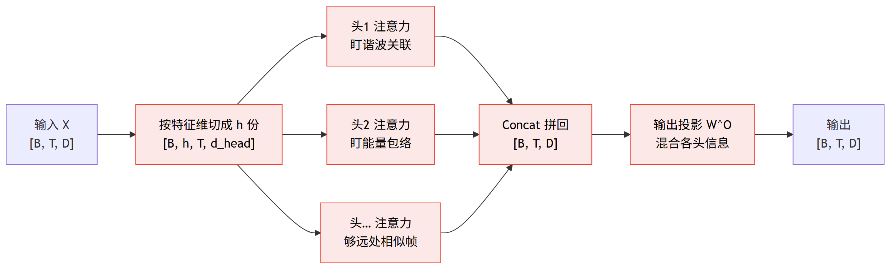
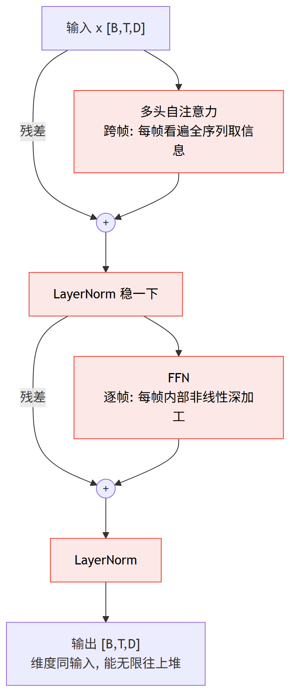

# 第 5 篇｜Transformer 架构与语音局限：把单头注意力堆成大厦，再看它在语音上漏了什么风

> 一句话核心直觉：把上一篇的**单头注意力**扩成**多头**（不同头各盯一种关系）、补上**位置编码**（告诉模型"这是第几帧"）、串上**前馈网络 + 残差 + LayerNorm**，再堆 N 层，就是 Transformer 编码器。它擅长把任意两帧拉到一起做**全局关联**，但对语音有两处硬伤——**局部细粒度**建模弱、**长序列**下 $O(T^2)$ 和位置外推双双吃不消。**看清这两处缺口，才知道下一篇 Conformer 为什么非把卷积缝进来不可。**

---

## 一、先把教材那套扔一边

上一篇我们把**单头注意力**这台机器拆到了螺丝级别：Query 去问、Key 应答、算相似度、softmax 归一、按权重把 Value 加权求和——一帧就这样"看遍全序列、按相关度取信息"。那篇的落点是**一个头**。

但你翻开任何一份讲 Transformer 的资料，扑面而来的是一整张密密麻麻的结构图：Multi-Head、Positional Encoding、Add & Norm、Feed Forward、堆 N 层，还配一个"Attention Is All You Need"的口号。图看着唬人，其实它就是**把单头注意力当积木，按固定套路搭起来的一栋楼**。这一篇的前半程，我们就把这栋楼一层层搭起来；后半程——也是本篇真正的重点——我们把它拉到语音降噪的场景里，冷静地问一句：**它到底哪儿不够用？**

我得先泼一盆冷水，破掉一个流行的错觉。"Attention Is All You Need"这句话是在**机器翻译**的语境里喊出来的，那里的输入是一串离散的词、序列几十上百个 token、讲究的是词与词的长程依赖。语音不是这么回事：

- 语音是**连续信号切出来的帧**，一秒钟就有 100 帧（10ms 一帧），一段 10 秒的音频就是 1000 帧，长混响录音轻松上万帧。
- 语音降噪吃的很多是**局部细节**——相邻几帧之间幅度的精细过渡、一组谐波在时频面上的局部纹理。这些恰恰是纯注意力的软肋。

所以对语音而言，"Attention is all you need" 这句话**不成立**。这一篇的任务，就是先老老实实把 Transformer 搭对，再诚实地标出它在语音上的两道裂缝。

先记住一句总纲，它是本篇的锚：

> **Transformer 编码器 = 多头注意力（谁和谁相关）+ 位置编码（这是第几帧）+ FFN（每帧单独深加工）+ 残差和 LayerNorm（保梯度、稳训练），再堆 N 层。** 它把"全局关联"做到了极致，代价是丢掉了 CNN 那种"天生看局部"的本能，也扛不住语音动辄上万帧的长度。

---

## 二、多头注意力：一个头不够，因为语音里"相关"有好多种

上一篇的单头注意力有个隐含的局限：**一次只能学一种"相关"**。softmax 出来的那张注意力权重图，本质是"每帧该关注哪些帧"的**一种**打分方式。可语音里，"相关"从来不止一种意思。

想象你在盯着一帧浊音的语谱，问"这一帧该参考哪些帧"，答案取决于你**关心哪种关系**：

- 有的关系是**谐波关联**：基频的整数倍那几条谐波之间彼此呼应，一帧的谐波结构和它自己的历史谐波高度相似。
- 有的关系是**能量包络**：这一帧的响度和前后几百毫秒的响度趋势绑在一起（一个音节的起伏）。
- 有的关系是**远处的相似帧**：同一个说话人反复出现的某个音素，散落在序列各处，它们该互相参考。

一个头、一张权重图，没法同时把这三种关系都表达清楚——它只能学出一种折中。**多头注意力的动机就这么简单：与其逼一个头学出万能的"相关"，不如养 $h$ 个头，各自在一个子空间里学一种相关。** 有的头专门盯谐波、有的头专门盯能量包络、有的头专门去够远处的相似帧，最后把各头的结论拼起来。

机制上怎么实现"多个头"？不是复制 $h$ 份全维度的注意力（那太贵），而是**把 $D$ 维特征切成 $h$ 份，每份 $d_{head}=D/h$ 维，各自独立做一次注意力，再拼回 $D$ 维**：

$$\text{MultiHead}(X) = \text{Concat}(\text{head}_1, \dots, \text{head}_h)\, W^O, \quad \text{head}_i = \text{Attention}(XW_i^Q,\, XW_i^K,\, XW_i^V)$$

逐项翻译成人话：

- $X$：输入的一段语音特征序列，shape `[B, T, D]`——$B$ 条样本、$T$ 帧、每帧 $D$ 维。
- $W_i^Q, W_i^K, W_i^V$：第 $i$ 个头**自己的**投影矩阵。它把 $D$ 维特征投到一个 $d_{head}$ 维的小子空间——这一步等于告诉第 $i$ 个头"你只许在这个子空间里看相关"。不同头的投影不同，看的角度就不同。
- $\text{head}_i$：第 $i$ 个头在自己子空间里，跑一遍上一篇讲的那套标准注意力，产出 `[B, T, d_head]`。
- $\text{Concat}$：把 $h$ 个头的 `[B, T, d_head]` 沿最后一维拼回 `[B, T, D]`。
- $W^O$：一个输出投影，把拼回来的结果再混合一次，让各头的信息互相交流，产出 `[B, T, D]`。

shape 之旅盯紧了：`[B,T,D]` 进 → 切成 `[B, h, T, d_head]`（多了个头的维度）→ 每个头算注意力还是 `[B, h, T, d_head]` → 拼回 `[B, T, D]` 出。**维度进出不变，中间偷偷分了工。**



一句话读图：**进出都是 `[B,T,D]`，中间把 D 维切成 h 份、每个头在自己的小子空间里各盯一种"相关"，算完拼回、再用 $W^O$ 混合。** 总算力几乎不变，表达力却从"一种相关"变成"多种相关"。


> **关键认知一**：多头不是"多花 $h$ 倍算力换 $h$ 倍效果"，而是**在总算力几乎不变（$D$ 维切成 $h$ 份）的前提下，让模型同时表达多种"相关"**。对语音这种"谐波、能量、远处相似帧"多种关系并存的信号，多头几乎是必需的——单头会被逼着把这些关系糊成一团。

有一点必须说清楚，它是本篇后半程"局限"的伏笔：**多头再多，每个头干的还是"全局加权求和"这一件事**。它擅长的是"把序列里任意两帧按相关度拉到一起"，也就是**全局关联**。它没有任何机制去偏爱"相邻帧"——在注意力眼里，第 5 帧和第 6 帧的关系，跟第 5 帧和第 500 帧的关系，地位完全平等。这个"人人平等"的特性，下面马上要出问题。

---

## 三、位置编码：注意力压根不知道"帧的先后"

这是最反直觉、也最容易被忽略的一点。我第一次意识到它的时候愣了半天：**纯注意力对帧的顺序完全无感——你把输入的帧顺序打乱，输出只会跟着打乱同样的顺序，每一帧算出来的内容一个字都不变。**

为什么？回看上一篇的注意力公式：一帧的输出 = 对所有帧的 Value 按相关度加权求和。这个"求和"是**集合操作**——加法不分先后，谁先加谁后加结果一样。注意力里没有任何一处依赖"第几帧"这个位置信息。用数学的话说，注意力是**置换等变（permutation-equivariant）**的。

这对语音是致命的。语音的意义**高度依赖时序**：一个爆破音 /p/ 的能量骤起然后回落，和"骤落然后升起"是完全不同的声学事件；混响是"直达声在前、反射声在后"的先后结构。如果模型分不清帧的先后，等于把一段语音当成了一袋无序的帧——全乱套了。

所以必须**显式地把"第几帧"这个信息注入进去**。最经典的做法是**正弦位置编码**：给第 $t$ 帧算一个和它位置绑定的 $D$ 维向量，加到该帧特征上。公式是这样的：

$$PE_{(t, 2i)} = \sin\!\left(\frac{t}{10000^{2i/D}}\right), \qquad PE_{(t, 2i+1)} = \cos\!\left(\frac{t}{10000^{2i/D}}\right)$$

逐项翻译成人话：

- $t$：第几帧（位置）。
- $i$：这个 $D$ 维位置向量里的第几个维度对（偶数维用 sin、奇数维用 cos）。
- $10000^{2i/D}$：一个随维度指数增长的"波长"。$i$ 小的维度波长短、正弦转得快；$i$ 大的维度波长长、正弦转得慢。
- 合起来看：**每一帧都拿到一串"不同频率的正弦采样值"拼成的指纹**。低频那几维给出粗粒度的位置（这帧大概在前段还是后段），高频那几维给出细粒度的位置（精确到相邻帧的差别）。就像用一排不同快慢的时钟指针，联合起来唯一地标定"现在几点"。

为什么偏要用这种正弦指纹，而不是简单地把帧号 0,1,2,… 直接加进去？因为正弦编码有个漂亮性质：**任意两帧的相对位置差 $\Delta t$，可以用位置编码之间的一个固定线性变换表达出来**。这让模型容易学到"关注前 3 帧""参考后 5 帧"这类**相对位置**的模式——而相对位置正是语音里最有用的（一个音素持续几帧、混响拖几帧，都是相对关系）。

> **关键认知二**：注意力天生"不知先后"，位置编码是硬塞给它的时间感。**对语音，这个时间感必须足够准**——因为语音的声学事件本质是"时间上的先后与快慢"。位置编码没做好，Transformer 连"这帧在前还是在后"都分不清。

但这里埋着本篇的第二道裂缝，而且和语音死磕：**正弦位置编码对"训练时没见过的更长序列"外推很差**。你若用最长 1000 帧的音频训练，模型见过的位置戳只到 1000；等推理时来了一段 5000 帧的长录音，那些从没出现过的位置指纹，模型没学过怎么解读，效果会明显掉。而**语音变长恰恰是常态**——会议录音、长语音消息、带长混响的房间，序列长度根本没有上限。这一刀，后面"局限"一节还要再补。

---

## 四、FFN + 残差 + LayerNorm：给每帧单独深加工，并稳住训练

注意力子层负责"帧和帧之间交换信息"，但它本质是加权求和——**线性混合**。光靠它，模型的非线性表达力不够。于是每个 encoder block 里，注意力子层后面都跟一个**前馈网络（FFN）**：

$$\text{FFN}(x) = \max(0,\, xW_1 + b_1)\,W_2 + b_2$$

一句话直觉：FFN 对**每一帧独立**地做"升维 → 非线性（ReLU）→ 降维"——把 $D$ 维（比如 64）先撑到 $d_{ff}$（比如 256）做非线性变换，再压回 $D$ 维。注意它**不跨帧**，每帧各自深加工自己那一份向量。分工很清晰：注意力管"跨帧看谁"，FFN 管"每帧内部想清楚"。

外面再包两样东西，都是为了让"堆很多层"这件事训得动：

- **残差连接**（$x + \text{子层}(x)$）：让梯度有一条"高速公路"直通底层，堆几十层也不至于梯度消失。这是基础系列讲 ResNet 时的老朋友。
- **LayerNorm**：对每一帧的 $D$ 维向量做归一化，稳住每层输入的分布，训练更平顺。注意是 Layer 不是 Batch——它在**特征维**上归一，天然适合变长序列（不依赖 batch 里其他样本，也不受帧数变化影响）。

这几样凑齐，一个 **encoder block** 的数据流就完整了：



关键就在最后一句：**输出 shape 和输入 shape 一模一样，都是 `[B,T,D]`**。所以这个 block 可以像乐高一样一层摞一层，堆 $N$ 层（语音任务常见 4~12 层）就是一个完整的 Transformer 编码器。每往上一层，帧与帧之间就多"对话"一轮，表示越来越抽象。

> **关键认知三**：Transformer 的"深"是靠残差和 LayerNorm 撑起来的——没有这两样，堆到第几层梯度就死了。而它每一层的套路是死的：**跨帧混合（注意力）+ 逐帧加工（FFN）交替**。理解了这个节奏，再花哨的结构图也不过是这两步的重复。

---

## 五、对语音的局限：擅长全局，恰恰漏了语音最吃的"局部"

前面把楼搭好了。现在是本篇的重头戏——**这栋楼用来做语音降噪，到底哪儿不够？** 我把它拆成三条，条条都直指语音。

### 5.1 弱在局部细粒度：注意力眼里"邻居"和"陌生人"平权

回到关键认知一里埋的伏笔：注意力对每帧做的是**全局加权求和**，它天生**不偏爱相邻帧**。第 5 帧和第 6 帧（紧邻）的关系，跟第 5 帧和第 500 帧（八竿子打不着）的关系，在注意力打分器眼里地位完全平等——谁的相关度高就听谁的，跟"是不是邻居"无关。

可语音降噪**极度吃局部细节**：

- **相邻帧的精细过渡**：一个爆破音的能量在两三帧内骤起骤落，一个滑音的共振峰在相邻帧间平滑移动——这些"贴着邻居"的短时纹理，是区分语音细节和噪声毛刺的关键。
- **谐波的局部结构**：浊音在时频面上是一组等间距的梳齿，梳齿之间、梳齿沿时间的连续性，都是**局部**模式。

要让纯注意力捕捉这种局部纹理，它得**通过数据硬学**出"应该重点关注邻近帧"这件事——而这本该是免费的先验。相比之下，CNN 用一个小卷积核滑过去，"只看邻近几帧"是**结构自带**的，不用学。纯注意力在这件事上先天吃亏。

### 5.2 $O(T^2)$ 撞长音频：注意力要算"每帧对每帧"

注意力的核心是那张 `[T, T]` 的打分矩阵——**每一帧都要和其余每一帧算一次相关度**。序列 $T$ 帧，就是 $T^2$ 次打分，算力和显存都是 $O(T^2)$。

代入语音的数字就吓人：10ms 一帧，10 秒音频 = 1000 帧，打分矩阵 $1000^2 = 10^6$；一段 1 分钟的会议录音 = 6000 帧，矩阵 $3.6\times10^7$。**长度翻倍，代价翻四倍。** 而语音场景里"长"是常态——长混响要看很远的历史反射、长录音本身就动辄几分钟。$O(T^2)$ 让纯注意力在长音频上直接吃不消，显存先爆。

### 5.3 位置外推差 + 缺少平移等变的归纳偏置

第三条其实是前面两处的余波，但对语音格外扎心：

- **位置编码外推差**（承接第三节）：训练时见过的最长序列锁死了位置戳的范围，来了更长的音频，那些没见过的位置指纹模型不会解读，性能滑坡。而语音长度没有上限。
- **缺少平移等变的局部归纳偏置**：CNN 有一个语音里极其宝贵的性质——**平移等变**。同一个谐波结构，不管它出现在第 10 帧还是第 800 帧，同一个卷积核都能同样地检出它。这是"把局部模式的检测器在全序列上共享"的先验。纯注意力没有这个先验，它得靠海量数据把"这种局部模式在哪都算数"这件事重新学一遍，数据不够时就学不扎实。

> **关键认知四**：Transformer 的强项（全局关联、任意两帧直连）和它的短板（弱局部、$O(T^2)$、缺平移等变先验）是**同一个设计的一体两面**——它为了"人人平等地全局连接"，主动放弃了 CNN 那种"偏爱局部、平移共享"的归纳偏置。**语音降噪偏偏两样都要**：既要全局关联（长程的说话人一致性、房间混响的整体结构），又要局部细粒度（谐波纹理、瞬态过渡）。这就是为什么"纯 Transformer"在语音前端很少单打独斗。

---

## 代码实战：手搭一个最小语音 Transformer 编码器

不复现论文的完整工程，只把**灵魂四件套**（多头注意力 + 正弦位置编码 + FFN + 残差/LN）拼成一个能 forward、shape 对得上的最小编码器，输入是语音特征序列 `[B, T, D]`。全部可跑，每步打印 shape。

```python
import torch
import torch.nn as nn
import math

torch.manual_seed(0)

# ---------- 1. 正弦位置编码 ----------
class SinusoidalPositionalEncoding(nn.Module):
    """给每帧盖一个"第几帧"的戳: 不同频率的正弦/余弦拼成位置指纹."""
    def __init__(self, d_model, max_len=4096):
        super().__init__()
        pe = torch.zeros(max_len, d_model)                    # [max_len, D]
        pos = torch.arange(0, max_len).unsqueeze(1).float()   # [max_len, 1]
        div = torch.exp(torch.arange(0, d_model, 2).float()
                        * (-math.log(10000.0) / d_model))     # [D/2]
        pe[:, 0::2] = torch.sin(pos * div)   # 偶数维用 sin
        pe[:, 1::2] = torch.cos(pos * div)   # 奇数维用 cos
        self.register_buffer("pe", pe.unsqueeze(0))           # [1, max_len, D]

    def forward(self, x):                    # x: [B, T, D]
        return x + self.pe[:, : x.size(1)]   # 每帧加上它的位置戳


# ---------- 2. 手写多头自注意力 ----------
class MultiHeadSelfAttention(nn.Module):
    def __init__(self, d_model, n_head):
        super().__init__()
        assert d_model % n_head == 0
        self.n_head = n_head
        self.d_head = d_model // n_head
        self.qkv = nn.Linear(d_model, 3 * d_model)   # 一次算出 Q,K,V
        self.out = nn.Linear(d_model, d_model)

    def forward(self, x):
        B, T, D = x.shape
        q, k, v = self.qkv(x).chunk(3, dim=-1)       # each [B, T, D]
        # 把 D 拆成 h 个头: [B, T, D] -> [B, h, T, d_head]
        split = lambda t: t.view(B, T, self.n_head, self.d_head).transpose(1, 2)
        q, k, v = split(q), split(k), split(v)                    # [B, h, T, d_head]
        score = q @ k.transpose(-2, -1) / math.sqrt(self.d_head)  # [B, h, T, T]  <- O(T^2)
        attn = torch.softmax(score, dim=-1)                       # [B, h, T, T]
        ctx = attn @ v                                            # [B, h, T, d_head]
        ctx = ctx.transpose(1, 2).contiguous().view(B, T, D)      # 拼回 [B, T, D]
        return self.out(ctx)                                      # [B, T, D]


# ---------- 3. 一个完整 encoder block ----------
class TransformerEncoderBlock(nn.Module):
    def __init__(self, d_model, n_head, d_ff):
        super().__init__()
        self.attn = MultiHeadSelfAttention(d_model, n_head)
        self.ff = nn.Sequential(                       # FFN: 逐帧升维->非线性->降维
            nn.Linear(d_model, d_ff), nn.ReLU(), nn.Linear(d_ff, d_model)
        )
        self.norm1 = nn.LayerNorm(d_model)
        self.norm2 = nn.LayerNorm(d_model)

    def forward(self, x):
        x = self.norm1(x + self.attn(x))   # 自注意力子层 + 残差 + Norm
        x = self.norm2(x + self.ff(x))     # FFN 子层      + 残差 + Norm
        return x                           # [B, T, D] 进出不变


# ---------- 4. 堆 N 层 ----------
class SpeechTransformerEncoder(nn.Module):
    def __init__(self, d_model=64, n_head=4, d_ff=256, n_layer=4):
        super().__init__()
        self.pos = SinusoidalPositionalEncoding(d_model)
        self.layers = nn.ModuleList(
            [TransformerEncoderBlock(d_model, n_head, d_ff) for _ in range(n_layer)]
        )

    def forward(self, x):
        x = self.pos(x)                    # 先注入位置
        for blk in self.layers:
            x = blk(x)                     # 一层层堆
        return x


B, T, D = 4, 100, 64      # 4 条样本, 每条 100 帧(=1 秒), 每帧 64 维特征
feat = torch.randn(B, T, D)
enc = SpeechTransformerEncoder(d_model=D, n_head=4, d_ff=256, n_layer=4)

# 逐步看 shape 之旅
x1 = SinusoidalPositionalEncoding(D)(feat);  print("加位置编码后 :", x1.shape)
x2 = MultiHeadSelfAttention(D, 4)(x1);       print("多头注意力后 :", x2.shape)
x3 = TransformerEncoderBlock(D, 4, 256)(x1); print("单个block输出:", x3.shape)
out = enc(feat)
print("语音特征输入 :", feat.shape)
print("堆4层后输出  :", out.shape)
print("总参数量     :", sum(p.numel() for p in enc.parameters()))
```

跑出来（shape 全程 `[B,T,D]` 不变，正是能无限堆叠的前提）：

```
加位置编码后 : torch.Size([4, 100, 64])
多头注意力后 : torch.Size([4, 100, 64])
单个block输出: torch.Size([4, 100, 64])
语音特征输入 : torch.Size([4, 100, 64])
堆4层后输出  : torch.Size([4, 100, 64])
总参数量     : 199936
```

再用几行代码**亲眼验证"注意力不知先后"**这件事——把帧顺序打乱喂进去，输出只是跟着换了顺序，内容一字不改（这正是必须有位置编码的铁证）：

```python
mha = MultiHeadSelfAttention(D, 4).eval()
x = torch.randn(1, 5, D)                 # 1 条样本, 5 帧
perm = torch.randperm(5)                 # 随机打乱帧顺序
with torch.no_grad():
    y  = mha(x)                          # 原顺序的输出
    yp = mha(x[:, perm])                 # 打乱后再算
# 打乱输入的输出, 应该等于"原输出按同样顺序打乱"
print("打乱输入=打乱输出?", torch.allclose(yp, y[:, perm], atol=1e-5))
```

```
打乱输入=打乱输出? True
```

`True` 坐实了：**去掉位置编码，Transformer 眼里语音就是一袋无序的帧。** 这也从反面说明位置编码在语音里的分量——它是把"时序"这个语音的命根子还给模型的唯一途径。

（关于工程实践：`self.qkv` 一次性算 Q/K/V 只是省事写法；生产里做**实时因果**时，还要在 `score` 上加一个上三角 mask 屏蔽未来帧，并缓存历史 K/V,这留到后面 AEC 篇再细说。）

---

## 这在工程里解决什么问题

把 Transformer 拉到语音前端，和老将 RNN、CNN 放在一张表上对照，长短板一目了然：

| 维度 | Transformer（纯注意力） | RNN / LSTM | CNN |
|---|---|---|---|
| **全局关联** | 强：任意两帧一步直连，长程依赖不衰减 | 弱：信息沿时间逐帧传递，远了会淡忘 | 弱：感受野受核大小/层数限制 |
| **局部细节** | 弱：邻居和陌生人平权，局部纹理要硬学 | 中：相邻帧天然相连 | 强：小核滑窗天生盯局部、平移等变 |
| **并行度** | 高：所有帧同时算，训练快 | 低：必须一帧帧递推 | 高：卷积天然并行 |
| **复杂度** | $O(T^2)$：长序列吃力 | $O(T)$：随长度线性 | $O(T)$：随长度线性 |
| **实时因果** | 需加因果 mask + 缓存 K/V,$O(T^2)$ 缓存压力大 | 天生因果，隐状态即缓存，端侧友好 | 用因果卷积即可，缓存小 |
| **长序列 / 外推** | 差：位置编码外推弱、显存随 $T^2$ 爆 | 好：状态定长，理论无限长 | 好：滑窗，长度无关 |

读表的方式不是"选一个最强的"，而是看清**没有一个全能**：Transformer 拿下了全局关联和并行度，却在局部细节、长序列、实时因果上集体失分——而这三样恰恰是语音前端天天要面对的。RNN 反过来，长序列和因果性极好，但全局关联和并行度差。CNN 则守着局部这一亩三分地。

于是工程上的真实答案是**混搭**：让擅长局部的和擅长全局的各司其职，缝到一个网络里。这正是下一篇的主角要干的事。

---

## 埋一个钩子

Transformer 的病根就一句话：它把"局部性"这个语音最吃的本能给丢了——而**局部性恰恰是卷积与生俱来的强项**。下一篇的 **Conformer** 就是干脆把卷积模块和注意力模块缝进同一个 block，让它一手抓全局、一手抠局部。

---

## 本篇小结

- **搭楼四件套**：Transformer 编码器 = 多头注意力（跨帧看谁）+ 位置编码（这是第几帧）+ FFN（逐帧深加工）+ 残差和 LayerNorm（保梯度、稳训练），block 进出都是 `[B,T,D]`，所以能堆 N 层。
- **多头**：把 $D$ 维切成 $h$ 份各做一次注意力再拼回，总算力几乎不变却能同时表达多种"相关"——谐波、能量包络、远处相似帧各有头去盯。
- **位置编码**：注意力天生置换等变、不知帧的先后（代码里打乱输入=打乱输出实锤），必须用正弦指纹显式注入时序；但它对训练没见过的更长序列外推差，而语音变长是常态。
- **三处语音局限**（本篇重点）：(a) 弱在局部细粒度——邻居和陌生人平权，谐波纹理和瞬态过渡这类局部模式要硬学；(b) $O(T^2)$ 撞长音频/长混响，显存先爆；(c) 位置外推差、且缺少 CNN 那种平移等变的局部归纳偏置。
- **工程定位**：Transformer 强在全局关联与并行，短在局部、长序列、实时因果——和 RNN/CNN 各有攻守，没有全能选手，实践中要混搭。
- **下一步**：缺的正是"局部性"，下一篇 Conformer 把卷积缝进注意力，全局与局部兼得。
