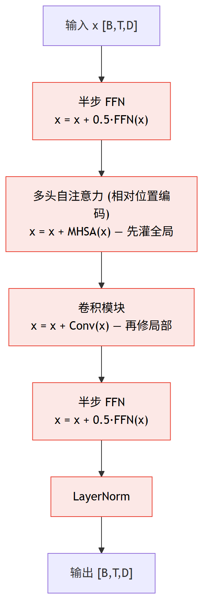
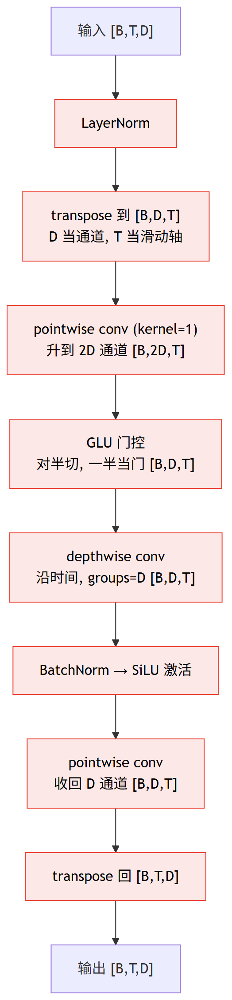

# 第 6 篇｜Conformer 架构精讲：给注意力塞一个卷积模块，全局和局部一起抓

> 一句话核心直觉：纯注意力能让任意两帧直接对话（全局关联强），却对"相邻几帧的精细纹理"迟钝；纯卷积盯着局部窗口看得细，却够不着远处。Conformer 干脆把两者塞进同一个 block——**半步 FFN → 多头自注意力（带相对位置编码）→ 卷积模块 → 半步 FFN**，注意力补全局、卷积补局部，再用**相对位置编码**摆脱"绝对第几帧"的束缚，天然适配语音的变长和平移不变。这套组合，是当今语音识别/增强的主力架构。

---

## 一、先把教材那套扔一边

上一篇我们把多头注意力、位置编码、FFN 堆成完整的 Transformer，末尾留了个不痛快的结论：**纯注意力对"局部性"是天生迟钝的。** 它把整段语音的所有帧一视同仁地丢进一个大池子里互相查询，谁跟谁相关全靠数据学出来——理论上很强大，但语音里有大量"就是相邻这几帧构成的精细结构"，让注意力从零学起既浪费容量又学不扎实。

这一篇的主角 Conformer（Convolution-augmented Transformer）就是冲着这个短板来的。它的思路朴素到近乎粗暴：**既然注意力缺局部性，那就在每个 block 里塞一个卷积模块进去，让卷积专门管局部。** 2020 年 Google 提出它时打的是语音识别（ASR），但很快整个语音圈——识别、增强、分离、AEC——都换上了 Conformer 或它的变体做骨干网络。

为什么值得单独拆一篇？因为它不是"Transformer 加一层卷积"这么随意。它回答了两个真问题：

- **卷积和注意力到底怎么互补，摆在一个 block 里谁先谁后？**（马卡龙式结构）
- **语音是变长的、可以整体平移的，绝对位置编码"这是第 37 帧"这种信息其实是个累赘——怎么换成"两帧相隔多远"？**（相对位置编码）

翻开讲 Conformer 的资料，一上来常常直接甩出那张 block 结构图和一堆子模块名字，看着像搭积木，却没讲清"为什么是这个顺序、为什么要这些零件"。这一篇我们反过来，先把"卷积和注意力为什么必须放一起"想透，再逐个子模块看它在干嘛。

先记住一句话，它是理解整个 Conformer 的钥匙：

> **注意力回答"这一帧该参考远处哪些帧"，卷积回答"这一帧和紧挨着的邻居构成了什么局部图案"。语音两样都缺不得——所以不是二选一，是让它们在同一个 block 里接力。**

---

## 二、卷积和注意力，为什么是互补而不是竞争

先把两者的"性格"摆清楚。都用语音帧序列 `[B, T, D]` 来说话（B 批次、T 帧数、D 每帧的特征维度），别用 NLP 的词。

**注意力擅长什么：任意距离的全局关联。** 上一篇讲过，第 $t$ 帧可以直接向第 $t+200$ 帧发起查询，中间隔多远都是"一跳"。这在语音里非常有用——比如一段拖长的元音，它的起始和结尾隔了几百毫秒，注意力能把它们直接挂上钩；再比如混响的长尾，早期声和后期反射隔得很远，也需要跨帧关联。

**但注意力有两个软肋：**

1. **没有局部性归纳偏置。** 注意力对"第 $t$ 帧和第 $t+1$ 帧是紧挨着的邻居"这件事一无所知——所有帧对它来说都是无序集合里的元素，谁近谁远全靠位置编码和数据硬教。可语音里最基本的结构恰恰是局部的：一个爆破音 /p/ 的冲程、一段清音的摩擦纹理、谐波在相邻几帧内的连续爬升，都是"相邻几帧构成的图案"。让注意力从头学这些，费劲又不稳。
2. **算力随帧数平方增长。** 注意力矩阵是 $T \times T$，1000 帧就是百万级的两两打分。局部的活儿用这么贵的机制去干，纯属浪费。

**卷积擅长的，正好是注意力的软肋。** 回忆基础系列讲的 CNN 三大归纳偏置：

- **局部连接**：一个卷积核只看一个小窗口（比如时间上的 15 帧），天生就在抓局部图案。
- **平移等变**：同一个核在整条序列上滑动、参数共享。这意味着"一个爆破音的时间纹理"不管出现在第 10 帧还是第 500 帧，都用同一套核去识别——这跟语音"同一个音素可以出现在任何时刻"完全对味。
- **参数少、算力线性**：一个核在整条序列上滑，参数和算力都只跟核宽、通道数有关，不随帧数平方爆炸。

> **第一个关键认知**：卷积和注意力不是两条互相替代的路线，而是**两种互补的归纳偏置**。卷积把"局部平移等变"这个语音的强先验白送给网络，让它不用花容量去学"相邻帧很重要"；注意力则负责卷积那个小窗口够不着的远程关联。Conformer 的全部智慧，就是不做二选一，而是让这两种偏置在同一个 block 里各司其职。

一句话对比：

| | 抓什么 | 归纳偏置 | 算力随 T | 语音里的活 |
|---|---|---|---|---|
| 自注意力 | 任意距离全局关联 | 弱（几乎无序） | 平方 $O(T^2)$ | 长元音首尾、混响长尾、跨音节 |
| 卷积 | 局部窗口内的图案 | 强（局部+平移等变） | 线性 $O(T)$ | 瞬态、谐波局部连续、清浊音纹理 |

---

## 三、Conformer block 的马卡龙结构：为什么是这个顺序

Conformer block 的完整数据流是这样五步（输入输出都是 `[B, T, D]`，每一步都带残差连接）：



注意首尾各有一个 FFN，中间夹着注意力和卷积——**两片"饼干"夹着中间的"馅"，作者管这叫马卡龙（macaron）结构**。这个安排有三个要点：

**1. 为什么 FFN 要"半步"（乘 0.5）。** 普通 Transformer 一个 block 只有一个 FFN，走一整步残差。Conformer 把它拆成前后两个，各走半步（$0.5 \times$）。直觉是：一个完整 FFN 的"表达力预算"被拆成两半，一半在注意力/卷积之前给特征做一次非线性预处理，一半在之后做收尾整理。实践中这种"前后夹"的排布训练更稳、效果略好——你现在只需记住它是"把一个 FFN 掰成两半夹在两端"。

**2. 为什么是"先注意力后卷积"。** 顺序是有讲究的：先让注意力把全局信息汇聚进每一帧（这一帧现在"知道"了远处有什么），再让卷积在这个已经融合了全局信息的表示上,去精修局部图案。反过来（先卷积后注意力）也能跑，但主流实现和原论文都用"注意力在前、卷积在后"这个次序。

**3. 每个子模块都带残差 + 各自的 LayerNorm。** 这继承了 Transformer 的老规矩（基础系列讲过：残差保证梯度直通、深层不退化；LayerNorm 稳住每帧特征的分布）。注意每个子模块内部**自己先做 LayerNorm 再做变换**（pre-norm 风格），外面再加残差。

> **第二个关键认知**：Conformer block 不是把卷积随便"加"在 Transformer 旁边，而是设计成 **FFN→注意力→卷积→FFN** 的接力：注意力先把全局关联灌进每一帧，卷积再在带着全局信息的表示上精修局部纹理，两片半步 FFN 在首尾做非线性的"预处理"和"收尾"。四个子模块各带残差，堆多层也不退化。

维度上从头到尾都是 `[B, T, D]`，每个子模块进出 shape 不变——这是残差结构的硬性要求（要相加就得同形）。唯一在内部会变 shape 的是卷积模块，因为 conv1d 需要把张量转成 `[B, D, T]`，我们下一节专门看。

---

## 四、卷积模块内部：pointwise + GLU + depthwise 的精打细算

这是 Conformer 最有工程味的一块。它不是随便一个 conv1d，而是一串精心搭配的操作。完整链条（进来 `[B, T, D]`，出去也是 `[B, T, D]`）：



逐个拆开讲直觉。

**先说 transpose。** PyTorch 的 `nn.Conv1d` 要求输入是 `[B, 通道, 长度]`，也就是通道维在中间。而我们的序列是 `[B, T, D]`（特征维在最后）。所以进卷积前要 `transpose(1,2)` 变成 `[B, D, T]`——**把 D 当通道、T 当卷积滑动的长度轴**。出来再转回去。这个 shape 转来转去是卷积模块里最容易写错的地方，代码里我会把每一步都打出来。

**pointwise conv（逐点卷积，kernel=1）。** kernel size 为 1 的 conv1d，本质就是**对每一帧独立做一个通道维的线性变换**（不跨时间、不看邻居）。第一个 pointwise 把通道从 $D$ 升到 $2D$，是为了给紧跟着的 GLU 备料。

**GLU 门控（Gated Linear Unit）。** 把 $2D$ 个通道沿通道维**对半切**成两份，各 $D$ 个：一份当"内容"，另一份过 sigmoid 当"门"，两者逐元素相乘。

$$\text{GLU}(x) = x_{[:D]} \odot \sigma(x_{[D:]})$$

翻译成人话：$x_{[:D]}$ 是前一半通道（内容），$x_{[D:]}$ 是后一半通道（门控信号），$\sigma$ 是 sigmoid 把门压到 $[0,1]$，$\odot$ 是逐元素相乘。**门开（≈1）就让内容通过，门关（≈0）就掐掉。** 这给了卷积模块一个"数据自适应地决定哪些通道该保留"的开关——比直接一个激活函数更灵活。切完之后通道数从 $2D$ 回到 $D$。

**depthwise conv（逐通道卷积）——这是重点。** 普通 conv1d 的每个输出通道都要看**所有**输入通道（全连接式的跨通道混合），参数量是 `核宽 × 输入通道 × 输出通道`。depthwise 卷积则设 `groups = 通道数`，意思是**每个通道配一根自己独立的卷积核，只在自己这个通道内沿时间滑动，绝不跨通道**。参数量降到 `核宽 × 通道数`——省了整整一个"通道数"的倍数。

为什么这样分工高效？因为**跨通道的混合已经交给两头的 pointwise 卷积去做了**（pointwise 专管通道间的线性组合），depthwise 就专心干"沿时间抓局部上下文"这一件事。这种"pointwise 管通道、depthwise 管时间"的分解，正是 MobileNet 那套深度可分离卷积的思想搬到一维时间序列上——**用极少的参数抓到局部时间图案**。核宽通常取 15、31 这种量级，意味着每帧能看到左右各 7~15 帧的局部上下文。

**depthwise 的因果版本——实时的命门。** 默认卷积是"对称 padding"：算第 $t$ 帧要用到 $[t-7, t+7]$ 共 15 帧，**其中 $t+1$ 到 $t+7$ 是未来帧**。实时语音里这是红线违规（基础系列反复强调：不能等未来帧）。因果化的做法很干脆：**只在左边（历史）补 padding，右边不补，算完再把右侧多出来的部分砍掉**，让第 $t$ 帧的输出只依赖 $[t-14, t]$ 这些历史帧。代价是感受野只往回看、不往前看，但换来了严格的因果性——流式部署时每来一帧就能立刻出一帧。

> **第三个关键认知**：卷积模块的精髓是**功能分解**——pointwise（kernel=1）专管通道间的线性混合，depthwise（groups=通道数）专管沿时间的局部上下文，GLU 提供数据自适应的门控。三者配合，用远少于普通卷积的参数抓住局部图案。而 depthwise 只要把 padding 从"两边对称"改成"只补左边、砍掉右边"，就从"偷看未来"变成严格因果——这一步是 Conformer 能上实时流式的关键。

**BatchNorm 和激活。** depthwise 之后接 BatchNorm（对每个通道跨 batch 和时间做归一化，稳住训练）再接 SiLU 激活（$x \cdot \sigma(x)$，比 ReLU 更平滑，Conformer 里的标配）。最后第二个 pointwise 把通道整理回 $D$，转置回 `[B, T, D]`，加残差。

> 一个流式部署的细节：BatchNorm 在推理时用的是训练期累积的全局均值/方差（固定值），所以流式逐帧推理不受影响；真正需要靠"缓存历史帧"来维持因果的是 depthwise conv——每来一帧，得把它左边 `核宽-1` 帧的历史缓存好，才能算出当前帧的卷积。这个缓存就是流式推理的状态。

---

## 五、相对位置编码：语音不该关心"你是第几帧"

这是本篇的技术重点，也是 Conformer 区别于普通 Transformer 的另一半。

**先说绝对位置编码的问题。** 上一篇讲过，注意力本身对帧的顺序一无所知（它把序列看成无序集合），所以要额外注入位置信息。普通 Transformer 用的是**绝对位置编码**：给第 0 帧、第 1 帧、第 2 帧……各自配一个固定的位置向量，加到输入上。这在很多任务里够用，但对语音有两个别扭的地方：

1. **外推差。** 训练时如果最长只见过 1000 帧，那第 1001 帧往后的位置向量模型压根没见过，一到更长的语音就懵。语音的长度千变万化，这个短板很致命。
2. **语音本该平移不变，绝对位置却在跟它较劲。** 同一段话，你从第 0 帧开始说，还是先静音 200 帧再说，语音内容完全一样——理想情况下模型的行为也该一样。但绝对位置编码会给这两种情况打上完全不同的位置标签（"这是第 5 帧" vs "这是第 205 帧"），逼着模型去区分本不该区分的东西。

**相对位置编码的思路：不关心"你是第几帧"，只关心"你俩隔多远"。** 当第 $i$ 帧向第 $j$ 帧发起查询时，真正有物理意义的不是"$i$ 是第几帧、$j$ 是第几帧"，而是**它们的相对距离 $i-j$**——"你在我前面 3 帧" 和 "你在我后面 10 帧" 这种相对关系，才是语音里稳定的结构（一个音素的时间跨度、谐波爬升的斜率，都是相对的）。相对距离天然平移不变：整段语音往后挪 200 帧，任意两帧的相对距离 $i-j$ 一点没变。

**怎么把"相对距离"塞进注意力得分。** 回忆上一篇的注意力打分核心：第 $i$ 帧的查询向量 $q_i$ 和第 $j$ 帧的键向量 $k_j$ 做点积，得到"$i$ 该多关注 $j$"的分数。普通版本是：

$$\text{score}(i,j) = \frac{q_i^\top k_j}{\sqrt{d}}$$

相对位置编码（Transformer-XL / Conformer 用的这一支）的做法是，在这个点积里额外掺进一个**只跟相对距离 $i-j$ 有关的偏置项**。核心思想可以简化成：

$$\text{score}(i,j) = \frac{q_i^\top k_j + q_i^\top r_{i-j} + \text{（与内容无关的偏置）}}{\sqrt{d}}$$

逐项翻译成人话：

- $q_i^\top k_j$：**老本行**——第 $i$ 帧的查询和第 $j$ 帧的内容有多匹配。这一项跟"隔多远"无关，纯看内容。
- $q_i^\top r_{i-j}$：**新加的关键项**。$r_{i-j}$ 是一个**只由相对距离 $i-j$ 决定**的向量（相隔 3 帧就用 $r_3$，相隔 -10 帧就用 $r_{-10}$，跟 $i$、$j$ 具体是第几帧无关）。它让查询 $q_i$ 去问一句"隔我这么远的帧，我一般该给多少关注"。**这一项就是相对位置的落点**——它编码了"距离偏好"，比如让模型天然更关注邻近几帧、对很远的帧衰减关注。
- 后面那个"与内容无关的偏置"是完整 Transformer-XL 展开里的另外两项（一个全局的内容偏置、一个全局的位置偏置），它们是可学习的向量，用来微调"整体上该多关注内容、多关注距离"。这里不展开完整推导，你抓住"多了个 $r_{i-j}$ 让打分依赖相对距离"这个直觉就够了。

关键在于：**$r_{i-j}$ 是相对距离的函数，而不是绝对位置的函数。** 所以无论这段语音整体平移到哪、有多长，"相隔 3 帧"永远对应同一个 $r_3$。这就同时治好了绝对位置编码的两个病：变长外推（再长的语音，相对距离的种类也就那些）和平移不变（整体平移不改变任何相对距离）。

> **第四个关键认知**：绝对位置编码给每帧钉一个"你是第几帧"的标签，跟语音"变长 + 可整体平移"的本性对着干；相对位置编码把注意力打分改成依赖"两帧相隔多远（$i-j$）"，多出来的 $q_i^\top r_{i-j}$ 项让模型学"距离偏好"。相对量天然平移不变、外推友好——这正是语音需要的位置观。

---

## 六、协同效果：为什么 Conformer 在语音上普遍更强

把前面几块拼起来，就能理解为什么 Conformer 在语音任务里普遍打得过纯 Transformer 和纯 CNN：

- **对比纯 Transformer**：纯注意力要从数据里硬学"相邻帧很重要"这种局部先验，既费容量又学不稳；Conformer 用卷积模块把这个先验白送进去，注意力就能腾出容量专攻真正需要的远程关联。局部纹理（瞬态、谐波连续、清浊音）交给卷积，全局关联（长元音、混响长尾）交给注意力，各用其长。
- **对比纯 CNN**：卷积的感受野受核宽限制，要够到很远得堆很多层，而且再深也难有注意力那种"任意两帧一跳直连"的灵活关联；Conformer 一层里就有注意力兜住全局。
- **相对位置编码**：让整套模型对语音的变长和整体平移免疫，不会因为前面多了段静音就性能抖动，也不会一到长语音就外推失灵。

放到我们本系列的降噪/增强语境里：一段带混响的带噪语音，卷积模块能精修"谐波在相邻帧的局部连续性"（帮着把语音的谐波结构从噪声里拎出来），注意力能关联"直达声和几百毫秒后的反射声"（帮着理解混响、做去混响），相对位置编码保证这套能力不受语音起始时刻和总长度的影响。三者叠加，就是它成为语音骨干网络主力的原因。

---

## 代码实战：手写一个最小 Conformer block

下面用 PyTorch 搭一个最小可跑的 Conformer block。注意力直接用 `nn.MultiheadAttention`（机制上一篇讲透了，这里不重复造轮子），**重点手写卷积模块**——pointwise → GLU → depthwise（`groups=通道数`）→ BN → 激活 → pointwise，并演示 depthwise 的因果 padding。输入 `[B, T, D]`，打印卷积模块内部各步 shape 和 block 输出 shape，最后跑一个因果性自检。

```python
import torch
import torch.nn as nn
import torch.nn.functional as F


class FeedForward(nn.Module):
    """Conformer 的半步 FFN：LayerNorm -> Linear 扩 4 倍 -> SiLU -> Linear 收回。"""
    def __init__(self, d_model, expansion=4, dropout=0.1):
        super().__init__()
        self.ln = nn.LayerNorm(d_model)
        self.fc1 = nn.Linear(d_model, d_model * expansion)
        self.act = nn.SiLU()
        self.fc2 = nn.Linear(d_model * expansion, d_model)
        self.drop = nn.Dropout(dropout)

    def forward(self, x):
        x = self.ln(x)
        x = self.drop(self.act(self.fc1(x)))
        x = self.drop(self.fc2(x))
        return x


class ConvModule(nn.Module):
    """Conformer 卷积模块：pointwise -> GLU -> depthwise(因果) -> BN -> SiLU -> pointwise。"""
    def __init__(self, d_model, kernel_size=15, causal=True, dropout=0.1):
        super().__init__()
        self.causal = causal
        self.kernel_size = kernel_size
        self.ln = nn.LayerNorm(d_model)
        # pointwise：kernel=1 的 conv1d，通道翻倍给 GLU 用
        self.pw_conv1 = nn.Conv1d(d_model, 2 * d_model, kernel_size=1)
        # depthwise：groups=通道数，每个通道一根独立的时间卷积核
        pad = (kernel_size - 1) if causal else (kernel_size - 1) // 2
        self.dw_conv = nn.Conv1d(d_model, d_model, kernel_size,
                                 groups=d_model, padding=pad)
        self.bn = nn.BatchNorm1d(d_model)
        self.act = nn.SiLU()
        self.pw_conv2 = nn.Conv1d(d_model, d_model, kernel_size=1)
        self.drop = nn.Dropout(dropout)

    def forward(self, x, verbose=False):
        # x: [B, T, D]
        x = self.ln(x)
        x = x.transpose(1, 2)                      # -> [B, D, T]，conv1d 要通道在中间
        if verbose: print("  转置到通道维       :", tuple(x.shape))
        x = self.pw_conv1(x)                        # [B, 2D, T]
        if verbose: print("  pointwise 升维(2D) :", tuple(x.shape))
        x = F.glu(x, dim=1)                         # 沿通道对半切，一半当门 -> [B, D, T]
        if verbose: print("  GLU 门控后         :", tuple(x.shape))
        x = self.dw_conv(x)                         # depthwise 卷积
        if self.causal:
            x = x[:, :, :-(self.kernel_size - 1)]   # 砍掉右侧未来帧的 padding，保因果
        if verbose: print("  depthwise(因果)后  :", tuple(x.shape))
        x = self.bn(x)
        x = self.act(x)
        x = self.pw_conv2(x)                        # [B, D, T]
        if verbose: print("  pointwise 收回      :", tuple(x.shape))
        x = self.drop(x)
        x = x.transpose(1, 2)                       # 转回 [B, T, D]
        if verbose: print("  转回序列维          :", tuple(x.shape))
        return x


class ConformerBlock(nn.Module):
    def __init__(self, d_model=144, n_heads=4, kernel_size=15, causal=True, dropout=0.1):
        super().__init__()
        self.ffn1 = FeedForward(d_model, dropout=dropout)
        self.mha_ln = nn.LayerNorm(d_model)
        self.mha = nn.MultiheadAttention(d_model, n_heads, dropout=dropout,
                                         batch_first=True)
        self.conv = ConvModule(d_model, kernel_size, causal, dropout)
        self.ffn2 = FeedForward(d_model, dropout=dropout)
        self.final_ln = nn.LayerNorm(d_model)

    def forward(self, x, attn_mask=None, verbose=False):
        x = x + 0.5 * self.ffn1(x)                  # 半步 FFN（马卡龙前片）
        if verbose: print("半步 FFN 后         :", tuple(x.shape))
        y = self.mha_ln(x)
        y, _ = self.mha(y, y, y, attn_mask=attn_mask, need_weights=False)
        x = x + y                                   # 多头自注意力残差
        if verbose: print("自注意力后          :", tuple(x.shape))
        x = x + self.conv(x, verbose=verbose)       # 卷积模块残差
        if verbose: print("卷积模块后          :", tuple(x.shape))
        x = x + 0.5 * self.ffn2(x)                  # 另半步 FFN（马卡龙后片）
        x = self.final_ln(x)
        return x


torch.manual_seed(0)
B, T, D = 2, 50, 144           # 批2、50 帧语音、模型维 144
block = ConformerBlock(d_model=D, n_heads=4, kernel_size=15, causal=True).eval()
x = torch.randn(B, T, D)
print("输入 [B,T,D]        :", tuple(x.shape))
print("--- 卷积模块内部逐步 shape ---")
with torch.no_grad():
    out = block(x, verbose=True)
print("block 输出          :", tuple(out.shape))

# 因果性自检：改动第 30 帧之后的输入，不该影响前 30 帧的因果卷积输出
conv = block.conv.eval()
with torch.no_grad():
    a = conv(x)
    x2 = x.clone(); x2[:, 30:, :] += 5.0           # 只篡改 30 帧之后（未来）
    b = conv(x2)
print("因果自检(前30帧最大差异, 应≈0):", (a[:, :30] - b[:, :30]).abs().max().item())
```

在已装好的 torch 2.10（CPU）上实际跑出来的输出：

```
输入 [B,T,D]        : (2, 50, 144)
--- 卷积模块内部逐步 shape ---
半步 FFN 后         : (2, 50, 144)
自注意力后          : (2, 50, 144)
  转置到通道维       : (2, 144, 50)
  pointwise 升维(2D) : (2, 288, 50)
  GLU 门控后         : (2, 144, 50)
  depthwise(因果)后  : (2, 144, 50)
  pointwise 收回      : (2, 144, 50)
  转回序列维          : (2, 50, 144)
卷积模块后          : (2, 50, 144)
block 输出          : (2, 50, 144)
因果自检(前30帧最大差异, 应≈0): 0.0
```

几个要盯住的点：

- **整个 block 进出都是 `[2, 50, 144]`**，四个子模块靠残差串起来、shape 全程不变——这是残差结构的硬约束。
- **卷积模块内部先转到 `[2, 144, 50]`**（把 D=144 当通道、T=50 当时间轴），pointwise 把通道升到 288 给 GLU，GLU 对半切回 144，depthwise 保持 144，最后转回 `[2, 50, 144]`。转来转去的 shape 一步不差。
- **因果自检输出 0.0**：我把第 30 帧往后的输入全加了个大扰动，前 30 帧的卷积输出**一点没变**——证明因果 padding 真的做到了"当前帧只看历史、不看未来"。这就是流式实时能跑的直接证据。（注意这一版相对位置编码用的是 `nn.MultiheadAttention` 里内置的注意力，没手写相对位置项——那部分工程实现较长，本篇聚焦讲清直觉和公式，代码重点放在手写卷积模块和因果性上。）

---

## 这在工程里解决什么问题

| 维度 | Conformer 的做法 | 工程收益 / 代价 |
|---|---|---|
| **全局 vs 局部** | 注意力抓远程关联 + 卷积抓局部图案，同 block 接力 | 收益：语音里长时依赖（混响长尾、长元音）和局部纹理（瞬态、谐波连续）一网打尽 |
| **参数/算力分布** | 主要参数在两个 FFN（扩 4 倍最占参数）和注意力投影；卷积模块靠 depthwise 极省参数 | 认知：想瘦身先砍 FFN 扩张倍数或注意力头数；depthwise 本就便宜，别在它上省 |
| **算力随帧数** | 注意力 $O(T^2)$、卷积 $O(T)$ | 代价：长语音注意力是算力大头，常配分块/流式注意力压成线性 |
| **实时流式** | depthwise 用因果 padding（只补左侧、砍右侧）；BN 推理用固定统计量 | 收益：每来一帧即出一帧；需缓存 depthwise 的历史帧作为流式状态；注意力也要限制只看历史窗口 |
| **相对 vs 绝对位置编码** | 相对位置编码：打分依赖 $i-j$ | 收益：变长外推好、对整体平移免疫；代价：实现比绝对位置编码复杂、略增算力 |
| **通用性** | 识别/增强/分离/AEC 都能当骨干 | 收益：一套骨干迁移多任务，工程复用度高 |

一句话工程定位：**当算力预算允许上注意力级别的模型（不是极限受限的 MCU，而是手机/PC/服务端这个量级），又想同时吃到全局关联和局部细节时，Conformer 几乎是当前语音任务的默认骨干选择。** 它的因果版本让"既要 Conformer 的效果、又要实时流式"成为可能，代价是要认真处理 depthwise 的状态缓存和注意力的历史窗口。

---

## 埋一个钩子

到这里，从 RNNoise 到 Conformer，我们讲的模型其实都在做同一类事——**降噪**：麦克风收进来一路带噪信号，模型把噪声压下去。但有一类问题它们天生治不了：回声消除（AEC）。要消掉的不是环境噪声，而是**自己扬声器放出去、又被麦克风收回来的那份声音**（对方的话从你手机喇叭放出，再被你麦克风录进去传回给对方）。这需要把"远端参考信号"一起喂进网络来专门建模——下一篇进入 AEC。

---

## 本篇小结

- **核心思想**：Conformer = Transformer block 里塞进一个卷积模块。注意力补全局关联（弱局部偏置、$O(T^2)$），卷积补局部图案（强局部+平移等变偏置、$O(T)$），语音两者都要，不做二选一。
- **马卡龙 block 结构**：半步 FFN → 多头自注意力(相对位置编码) → 卷积模块 → 半步 FFN → LayerNorm，四个子模块各带残差；顺序是"注意力先灌全局、卷积再修局部"，两片半步 FFN 首尾夹。
- **卷积模块**：pointwise(kernel=1，管通道混合) → GLU(数据自适应门控) → depthwise(`groups=通道数`，管时间局部，极省参数) → BN → SiLU → pointwise；内部要转成 `[B,D,T]` 做 conv1d 再转回。
- **因果化**：depthwise 把 padding 从"两边对称"改成"只补左侧、砍掉右侧"，当前帧只看历史帧——这是上实时流式的命门，代码里因果自检输出 0.0 验证了这点。
- **相对位置编码**：绝对位置编码外推差、跟语音的变长与平移不变较劲；相对位置编码让注意力打分依赖"两帧相隔多远（$i-j$）"，多一项 $q_i^\top r_{i-j}$ 编码距离偏好，天然平移不变、外推友好。
- **工程意义**：手机/PC/服务端量级的语音识别、增强、分离、AEC 的主力骨干；瘦身先砍 FFN 和注意力头，流式要处理 depthwise 状态缓存和注意力历史窗口。
- **下一步**：前面这些模型都在压噪声，而回声消除要消掉"自己扬声器回传的声音"，得把远端参考信号一起喂进网络——下一篇进入 AEC。
