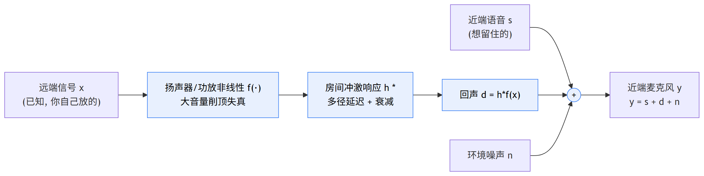
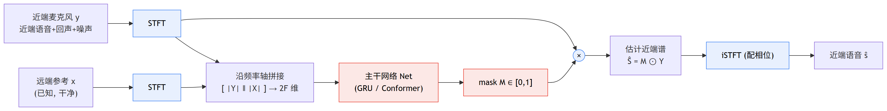
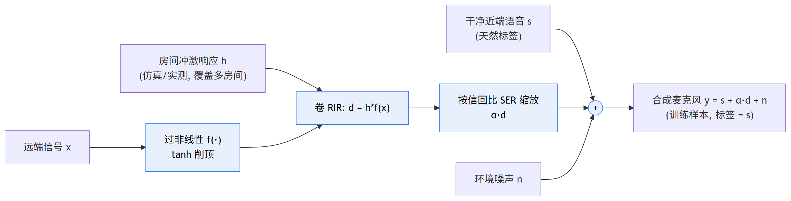

# 第 7 篇｜端到端神经网络 AEC：这次要消的不是噪声，是"你自己扬声器放出来又被麦克风收回去"的回声

> 一句话核心直觉：前六篇一直在降噪——从一团混音里把不想要的东西压下去。AEC（回声消除）看着像降噪，本质却是另一回事：它要消掉的不是环境噪声，而是**你自己扬声器刚放出去的远端声音、绕了一圈房间又被麦克风收回来**的那份回声。而 AEC 手里攥着一张降噪永远没有的底牌——**远端参考信号是已知的**（那声音就是你自己放的）。Deep AEC 的全部功夫，就是把这张底牌喂进网络；而它真正的胜负手，是**双讲**：两端同时说话时，如何抠干净远端回声、又不误伤近端人声。

---

## 一、先把教材那套扔一边

前面六篇——RNNoise、DCCRN、FullSubNet、自注意力、Transformer、Conformer——任务其实是同一个：**降噪**。输入一路带噪信号，输出一路干净语音，中间的活儿是"把不想要的能量压下去"。模型越换越强，但题目没变过。

这一篇换任务。回声消除（AEC）表面上也是"从麦克风信号里去掉不想要的东西"，很容易被归进降噪的大筐里。但只要你真在一台设备上做过免提通话，就会知道它是个**结构完全不同**的问题。

先把场景摆清楚。你在开视频会议，对方（远端）说话，声音从**你的扬声器**放出来。这声音在你房间里弹来弹去，最后**又钻进你的麦克风**。于是你的麦克风收到的，除了你自己（近端）说的话，还混进了一份"对方声音的回传"。如果不处理，这份回传会顺着上行链路送回给对方——对方就会听到**自己的声音延迟一会儿又回来了**，这就是恼人的回声。严重时甚至会在两端设备间来回反馈，"啸叫"起来。

关键的不同点，一句话：

> **降噪面对的噪声是"来路不明"的——风扇、键盘、街道，你事先不知道它长什么样。AEC 面对的回声却是"来路清清楚楚"的——它就是你自己刚从扬声器放出去的那段远端信号，只是被房间和喇叭改了个样。这段远端信号，你手里有一份原始拷贝。**

这份原始拷贝，就是 **参考信号（reference signal）**。它是 AEC 区别于一切降噪任务的核心。降噪模型只有一路输入（带噪麦克风），AEC 模型有**两路**输入：近端麦克风 + 远端参考。这一篇要讲的所有东西，都是围绕"怎么用好这份参考"展开的。

---

## 二、把回声的物理链路拆开：一个信号，被改了三次样

要理解 AEC 在跟什么较劲，得先看清那段远端声音，从扬声器到麦克风，中间经历了什么。

设远端信号（对方说的话，也就是我们要放出去的那段）为 $x$。它进入麦克风前，被依次改了三次样：

1. **扬声器 + 功放的非线性**：小音量时喇叭老实地线性放大，但音量一大，功放会削顶、喇叭振膜会失真——输出不再是输入的等比例放大，而是被"压弯"了。
2. **房间的声学传播**：声音从扬声器出发，有一条直达麦克风的路径，还有无数条撞墙、撞天花板、撞桌面再反射回来的路径。每条路径的**延迟和衰减都不同**。这一整套"从扬声器到麦克风"的传播特性，用一个**房间冲激响应（RIR，Room Impulse Response）** 来描述。
3. **叠加**：这份被改样的回声，和近端人声、环境噪声，一起被麦克风收进来，加成一路信号。

把这条链路写成一个式子（这是全篇的锚，务必逐项吃透）：

$$y = s + \underbrace{h * f(x)}_{\text{回声 } d} + n$$

逐字翻译成人话：

- $x$：**远端信号**，对方说的话，也是从你扬声器放出去的那段。**它是已知的**——这是重点，圈起来。
- $f(\cdot)$：**扬声器/功放的非线性变换**。理想情况 $f$ 是恒等（原样放大），现实里它是个会削顶的非线性函数（后面代码用 $\tanh$ 来模拟）。
- $h$：**房间冲激响应（RIR）**。$*$ 是卷积。$h * f(x)$ 的意思是：把（非线性失真后的）远端信号，按房间里每条反射路径的延迟和衰减叠起来——这就是最终**混进麦克风的那份回声 $d$**。
- $s$：**近端语音**，你自己说的话。这是我们真正想留下、想送给对方的东西。
- $n$：环境噪声。
- $y$：**近端麦克风信号**，实际收到的那一路，是上面三样加起来的和。

AEC 的目标就一句话：**已知 $y$ 和 $x$，把 $s$ 恢复出来。** 也就是从麦克风信号里，精确地减掉那份来自 $x$ 的回声 $d$，同时一根汗毛都别碰近端语音 $s$。

> **第一个关键认知**：AEC 的本质不是"降噪"，是"**已知污染源、做定向减法**"。你手里有污染源的原始拷贝 $x$，任务是估计出它被房间和喇叭改样后的样子 $d = h * f(x)$，然后从 $y$ 里减掉。降噪是"我不知道敌人长什么样，只能猜哪些是敌人"；AEC 是"我手里有敌人的原始照片 $x$，只是这照片经过化妆（$f$）和易容（$h$）了，我要认出化妆后的它"。参考信号 $x$ 就是那张原始照片——**这是 AEC 能做得比降噪精确得多的根本原因，也是它全部难点的来源**。



一句话读图：**回声不过是那份已知的远端 $x$，被喇叭非线性 $f$ 化妆、被房间 $h$ 易容后，混进了麦克风。** AEC 要做的，就是认出化妆后的它、从 $y$ 里定向减掉，一根汗毛别碰 $s$。


---

## 三、传统线性自适应滤波（NLMS）：为什么它撑不住了

在神经网络进场前，AEC 已经被工业界做了几十年，主力是**自适应滤波**，最经典的是 NLMS（归一化最小均方）。它的思路极其符合直觉，值得先讲清楚——因为 Deep AEC 正是从它的失败里长出来的。

既然回声是 $d = h * f(x)$，而 $x$ 已知，那我只要**估计出 $h$**（假装 $f$ 是线性的、可以忽略），就能算出回声估计 $\hat{d} = \hat{h} * x$，从麦克风里减掉：$\hat{s} = y - \hat{d}$。

问题是房间的 $h$ 我不知道，而且人一走动、门一开、椅子一挪，$h$ 就变了。所以要**自适应**：用一个可调的 FIR 滤波器 $\hat{h}$ 去逼近真实 $h$，根据"减完之后还残留多少回声"这个误差，一点点调整 $\hat{h}$ 的系数。误差大就多调，误差小就少调，滚动更新——本质是在做在线的最小二乘拟合。

在**单讲**（只有远端说话、近端安静）时，这套非常好使：麦克风里除了回声几乎啥都没有，误差信号干净，$\hat{h}$ 收敛得又快又准。但它有三处硬伤，恰好都是神经网络的机会：

- **扬声器非线性治不了**。NLMS 假设回声是 $x$ 的**线性**卷积，可现实里那个 $f(\cdot)$ 是非线性的（削顶失真）。线性滤波器再怎么调，也拟合不了非线性产生的那部分回声——这部分减不掉，就成了**残余回声（residual echo）**。
- **双讲直接发散**。这是最致命的。近端一说话，$s$ 就混进了误差信号里。自适应算法分不清"这个误差是因为 $\hat h$ 没调好，还是因为近端在说话"，于是它会把近端语音当成"没调好"，疯狂乱调 $\hat h$——结果滤波器**跑偏甚至发散**，回声反而更响。工程上只能加一个**双讲检测器（DTD）**：一旦检测到双讲，就**冻结**滤波器更新，宁可不调也别调坏。但检测本身有延迟、有误判，冻结期间房间若变了又跟不上。
- **收敛慢、长拖尾吃不消**。混响重的房间 RIR 很长（几百上千个抽头），滤波器阶数就得很高，收敛慢、算力涨。

> **第二个关键认知**：线性自适应滤波的三处死穴——**非线性回声、双讲发散、长混响**——恰好都是"用一个线性模型去套一个非线性、时变、还会被近端语音干扰的系统"必然的失败。神经网络的机会正在这里：它**天生能拟合非线性**（治得了扬声器失真），**能从数据里学到"什么样的能量是回声、什么样的是近端人声"**（不必靠脆弱的双讲检测硬切换），还能把长时依赖交给 RNN/注意力去记。于是问题从"在线拟合一个线性滤波器"，变成了"训练一个网络，输入近端+远端，输出近端语音"。

---

## 四、Deep AEC 的结构：把参考信号一起喂进网络

现在来看神经网络怎么做 AEC。骨架其实和前几篇的降噪模型**惊人地像**——STFT 出谱、网络出 mask、mask 乘谱、iSTFT 重建。唯一但决定性的区别：**输入从一路变成两路**。

降噪网络的输入是近端谱 $Y$ 一路。Deep AEC 的输入是**两路谱**：

- 近端麦克风谱 $Y \in \mathbb{C}^{[B,F,T]}$：里面混着近端语音 + 回声 + 噪声。
- 远端参考谱 $X \in \mathbb{C}^{[B,F,T]}$：你自己放出去的那段，干干净净、已知。

怎么把两路喂进网络？最直接、也最常用的一种：**沿频率轴拼接**。近端谱有 $F$ 个频率 bin，远端谱也有 $F$ 个，拼起来每帧就是 $2F$ 维的特征，送进 RNN（或者 Conformer，用前几篇学的都行）：

$$\hat{S} = M \odot Y, \qquad M = \text{Net}\big(\;[\,|Y| \,\Vert\, |X|\,]\;\big)$$

逐字翻译成人话：

- $[\,|Y| \Vert |X|\,]$：把近端幅度谱和远端幅度谱**沿特征维拼接**（$\Vert$ 表示拼接）。每一帧，网络同时看到"麦克风现在收到啥"和"我刚放出去啥"。
- $\text{Net}(\cdot)$：主干网络（这里用 GRU，你完全可以换成 Conformer）。它吐出一个 mask $M \in [0,1]^{[B,F,T]}$。
- $M \odot Y$：mask 逐元素乘近端谱（$\odot$ 是逐元素乘），把判定为回声/噪声的 bin 压下去、近端语音的 bin 留下来。
- $\hat{S}$：**估计出的近端语音谱**，再配相位做 iSTFT 就还原成波形送给对方。

（也有别的喂法：给远端单独一个编码器、近端一个编码器，在中间层做融合，甚至用注意力让近端帧去"查询"远端帧——但"拼接送进网络"是理解全部变体的地基，先钉死它。）



一句话读图：**骨架和降噪一模一样（STFT→mask→乘→iSTFT），唯一的关键差别是多了一路远端参考 $X$ 拼进输入**——它就是网络那把"对照的尺子"：$X$ 里没有的，$Y$ 里绝不是回声。


关键问题来了：**为什么多喂一路远端参考，网络就能定位回声？**

想想网络的处境。只给它近端谱 $Y$，它看到某个频率某一刻能量很高，它**没法判断**这份能量是近端人声还是回声——两者在谱上可能长得很像。但一旦同时给它远端参考 $X$，它就能做**对照**："这一刻远端 $X$ 在这个频段正好也有一大坨能量，而且 $Y$ 里这坨能量比 $X$ 晚了几帧、还带着房间的染色——那 $Y$ 里这份多半就是 $X$ 的回声，压掉。" 反过来，"$Y$ 里有能量但 $X$ 这会儿是安静的——那这份能量不可能是回声（因为回声必须来自远端），它是近端人声，留下。"

> **第三个关键认知**：远端参考 $X$ 给了网络一把"对照的尺子"。回声的定义就是"来自 $X$ 的能量"，所以**$X$ 里没有的东西，$Y$ 里绝不可能是回声**。网络学的，本质是 $X$ 和 $Y$ 之间那个被房间和喇叭改样的、带延迟的映射关系 $h*f(\cdot)$——但它是隐式地、非线性地学，不像 NLMS 那样非要显式估一个线性 $\hat h$。这就是为什么它能治非线性回声：$f$ 是啥形状，网络就从数据里学啥形状。

---

## 五、双讲：AEC 真正的胜负手

如果通话永远是"你一句我一句、从不重叠"，AEC 会简单得多。真正折磨人的是**双讲（double-talk）**——两端同时说话。这是 AEC 的胜负手，值得单独一节掰开。

把场景分成三类，难度递增：

| 场景 | 麦克风 $y$ 里有什么 | 网络该做什么 | 难度 |
|---|---|---|---|
| **仅远端（单讲）** | 只有回声 $d$（+噪声） | 全压掉，输出接近静音 | 简单 |
| **仅近端** | 只有近端语音 $s$（+噪声） | 原样保留，别误压 | 简单 |
| **双讲** | 回声 $d$ **和** 近端语音 $s$ 混在一起 | 精确抠掉 $d$、完整保住 $s$ | **地狱** |

单讲时闭眼都能做对：只有远端说话，麦克风里除了回声没别的，**全压掉**就行——压过头也无所谓，反正本来就没有近端语音要保。

双讲才是刀尖上跳舞。此刻麦克风里回声和近端人声**同时在响、还在同一批频段上重叠**。网络必须在每一个时频点上做一个极难的判断：**这份能量，多少是该抠掉的回声，多少是该留下的近端人声？** 判轻了——回声没压干净，对方听到自己的声音飘回来（残余回声）；判重了——把近端人声也当回声压了，你的话对方听起来一顿一顿、发闷发虚（近端语音失真）。这两种错误互相拉扯，是所有 AEC 评测里最难看的一栏。

这也正是神经 AEC 相对 NLMS 最大的优势所在。NLMS 遇到双讲只能**冻结**（靠双讲检测器硬切换，检测错了就崩）。神经网络不需要这种脆弱的开关：它在训练时**见过海量双讲样本**，直接从数据里学会了"在双讲里同时保近端、抠回声"这件事——把一个需要显式检测+切换的控制问题，变成了一个端到端的回归问题。

> **第四个关键认知**：AEC 模型的好坏，几乎全看双讲表现。单讲谁都会做，双讲见真章。而**双讲能力不是靠改网络结构堆出来的，是靠训练数据喂出来的**——网络在训练里见过多少种信回比、多少种房间、多少种非线性下的双讲，它在真实双讲里就有多稳。这就把胜负手从"设计更花哨的网络"直接推向了"**造更真实、更全面的双讲数据**"。下一节就讲这个。

---

## 六、双讲数据合成：AEC 工程里最实用的一块

真实双讲数据几乎没法标注——你把麦克风信号 $y$ 录下来了，可你**永远拿不到那条"干净的近端语音 $s$"作为监督标签**，因为它在录制时就已经和回声搅在一起了。没有标签，监督学习没法训。

工程上的破解办法是**合成**：既然 $y = s + h*f(x) + n$ 这条链路我们完全清楚，那就**自己按这条链路把 $y$ 造出来**——用干净的 $s$ 和 $x$ 当原料，$s$ 天然就是标签。整条合成 pipeline 是 AEC 落地里最实用、也最能拉开差距的一环，拆开如下：

1. **备料**：一堆干净的近端语音 $s$、一堆远端信号 $x$（都用公开语音库即可）。
2. **造 RIR**：用声学仿真（image-source method）或实测，生成大量**房间冲激响应 $h$**——覆盖小房间/大会议室、不同混响时间（RT60）、扬声器与麦克风的不同摆位与距离。
3. **过非线性**：把 $x$ 先过一个非线性 $f(\cdot)$（如 $\tanh$ 削顶、多项式失真），模拟功放/喇叭在大音量下的失真。
4. **卷 RIR 生成回声**：$d = h * f(x)$，把非线性远端和房间冲激响应卷积，得到真正混进麦克风的那份回声。
5. **按信回比叠加**：把近端语音 $s$ 和回声 $d$ 按不同的**信回比（SER，Signal-to-Echo Ratio）** 相加。SER 高=近端响回声弱，SER 低=回声压过近端。要覆盖从 $-10$dB 到 $+10$dB 一大片，这是双讲鲁棒性的关键。
6. **加噪、覆盖全场景**：叠上环境噪声 $n$，并按比例混入**三种场景**——仅回声（单讲）、仅近端、双讲。三种都要有，网络才不会在某类场景上偏科。

$$d = h * f(x), \qquad y = s + \alpha\, d + n, \quad \alpha \text{ 由目标 SER 决定}$$

逐字翻译：$f$ 先给远端加非线性失真，$h*$ 再卷上房间的染色与延迟得到回声 $d$；$\alpha$ 是按目标信回比算出的缩放系数，控制这条样本里回声相对近端有多响；加上噪声 $n$，就合成出一条带标签（标签是 $s$）的训练样本。同一对 $(s, x)$ 配不同的 $h$、不同的 $\alpha$、不同的 $f$，能滚出海量、可控、场景齐全的双讲数据。



一句话读图：**整条链路人为可控——同一对 $(s,x)$ 换不同的 $h$、$\alpha$、$f$，就滚出海量场景齐全的双讲数据，而干净的 $s$ 天然就是标签。** 双讲能力就是这么喂出来的。


顺带一提，把真实场景数据和统一评测这件事推向标准化的，是微软发起的 **AEC Challenge**：它提供了大规模真实录制的近端/远端/双讲数据，还有一个能自动打分、和主观听感对齐的指标 **AECMOS**，让"你的 AEC 到底好不好"从各说各话变成了可横向比较。点到即止，第 10 篇讲评估时会再回来。

---

## 代码实战

两段代码，都在 CPU 上就能跑（torch 2.10）。第一段是最小 Deep AEC 的双输入前向：近端谱 + 远端参考谱拼接过网络出 mask、估计近端语音谱。第二段是双讲数据合成的核心：远端过非线性、卷 RIR 成回声、按信回比叠加近端语音。每步都打印 shape。

**第一段：最小 Deep AEC（双输入 → 拼接 → mask → 估计近端谱）**

```python
import torch
import torch.nn as nn

class TinyDeepAEC(nn.Module):
    """双输入 Deep AEC 最小实现:
    近端麦克风谱 y + 远端参考谱 x -> 沿频率轴拼接 -> GRU -> mask -> 估计近端语音谱
    """
    def __init__(self, n_freq=257, hidden=256):
        super().__init__()
        # 输入 = 近端幅度谱 与 远端幅度谱 沿频率轴拼接, 所以是 2*n_freq 维
        self.gru = nn.GRU(2 * n_freq, hidden, batch_first=True)  # 单向, 满足实时因果
        self.mask_head = nn.Linear(hidden, n_freq)               # 每个 bin 一个 mask 值

    def forward(self, near_mag, far_mag):
        # near_mag, far_mag: [B, F, T]  批次/频率/帧
        near = near_mag.transpose(1, 2)          # [B, T, F]  RNN 要 [B,T,Feature]
        far  = far_mag.transpose(1, 2)           # [B, T, F]
        x = torch.cat([near, far], dim=-1)       # [B, T, 2F]  近端+远端拼在特征维
        h, _ = self.gru(x)                       # [B, T, hidden]
        mask = torch.sigmoid(self.mask_head(h))  # [B, T, F]  0~1
        mask = mask.transpose(1, 2)              # [B, F, T]  转回谱的排布
        est_near = mask * near_mag               # 估计的近端语音幅度谱 [B, F, T]
        return est_near, mask

B, F, T = 4, 257, 100                # 4 条样本, 257 个频率 bin, 100 帧
near_mag = torch.rand(B, F, T)       # 近端麦克风谱: 混着 近端语音+回声+噪声
far_mag  = torch.rand(B, F, T)       # 远端参考谱: 你自己扬声器放的, 已知且干净
net = TinyDeepAEC(n_freq=F)
est_near, mask = net(near_mag, far_mag)
print("近端麦克风谱 shape:", near_mag.shape)   # [4, 257, 100]
print("远端参考谱   shape:", far_mag.shape)    # [4, 257, 100]
print("估计近端语音 shape:", est_near.shape)   # [4, 257, 100]
print("mask         shape:", mask.shape)       # [4, 257, 100]
print("总参数量          :", sum(p.numel() for p in net.parameters()))
```

跑出来：

```
近端麦克风谱 shape: torch.Size([4, 257, 100])
远端参考谱   shape: torch.Size([4, 257, 100])
估计近端语音 shape: torch.Size([4, 257, 100])
mask         shape: torch.Size([4, 257, 100])
总参数量          : 658945
```

shape 之旅里最要紧的一步，是 `torch.cat([near, far], dim=-1)` 把特征维从 $F=257$ 变成了 $2F=514$——**远端参考就是在这里进入网络的**。和一个普通降噪 GRU 相比，Deep AEC 的差别几乎只在这一行：多喂了一路远端。其余全是老朋友（GRU 单向保证实时因果、sigmoid 出 $[0,1]$ 的 mask、mask 乘近端谱）。把 `nn.GRU` 换成前几篇的 Conformer，就是一个更强的 Deep AEC——**结构是旧的，输入是新的**。

**第二段：双讲数据合成核心（非线性 → 卷 RIR 成回声 → 按信回比叠加）**

```python
import torch
import torch.nn.functional as Fn

sr, dur = 16000, 1.0
L = int(sr * dur)                       # 波形长度

far         = torch.randn(1, L) * 0.5   # 远端信号 x (对方说话)      [1, L]
near_speech = torch.randn(1, L) * 0.5   # 近端语音 s (你说话, 也是标签) [1, L]

# 1) 房间冲激响应 RIR: 直达 + 几个衰减反射 (真实用声学仿真/实测)
rir_len = 800
rir = torch.zeros(rir_len)
rir[0] = 1.0                             # 直达声
for tap, amp in [(120, 0.6), (300, 0.35), (550, 0.2)]:
    rir[tap] = amp                       # 三个反射抽头: 越晚到、越衰减
rir = rir / rir.norm()                   # 归一化能量
rir = rir.view(1, 1, -1)                 # [1, 1, 800] 当卷积核

# 2) 扬声器非线性 f(): 大音量削顶失真 (线性滤波器治不了的那部分)
far_nl = torch.tanh(1.5 * far) / 1.5

# 3) 回声 d = h * f(x): 非线性远端 与 RIR 卷积 (左侧补零 => 因果 + 等长)
x_pad = Fn.pad(far_nl.view(1, 1, -1), (rir_len - 1, 0))
echo  = Fn.conv1d(x_pad, rir).view(1, -1)   # [1, L]

# 4) 按信回比 SER 叠加: SER = 近端语音功率 / 回声功率
def scale_to_ser(speech, echo, ser_db):
    ps = speech.pow(2).mean()
    pe = echo.pow(2).mean().clamp(min=1e-8)
    target_pe = ps / (10 ** (ser_db / 10))  # 目标回声功率
    return echo * (target_pe / pe).sqrt()

echo_dt = scale_to_ser(near_speech, echo, ser_db=0.0)  # 双讲: SER=0dB, 势均力敌
noise   = torch.randn(1, L) * 0.02
mic     = near_speech + echo_dt + noise    # 近端麦克风 y = s + d + n

print("远端信号 far     shape:", far.shape)       # [1, 16000]
print("RIR             shape:", rir.shape)        # [1, 1, 800]
print("回声 echo        shape:", echo.shape)      # [1, 16000]
print("麦克风 mic=y     shape:", mic.shape)       # [1, 16000]
print("近端语音功率     :", round(near_speech.pow(2).mean().item(), 4))
print("回声(0dB后)功率  :", round(echo_dt.pow(2).mean().item(), 4))
```

跑出来：

```
远端信号 far     shape: torch.Size([1, 16000])
RIR             shape: torch.Size([1, 1, 800])
回声 echo        shape: torch.Size([1, 16000])
麦克风 mic=y     shape: torch.Size([1, 16000])
近端语音功率     : 0.2509
回声(0dB后)功率  : 0.2509
```

三个关键观察：（1）**回声是 $x$ 卷 RIR 卷出来的，不是凭空来的** ——`Fn.conv1d` 这一步就是式子里的 $h*$，`tanh` 就是 $f(\cdot)$。左侧 `pad` 补零保证卷积**因果**（回声只依赖当前和过去的远端样本，不会用到未来）且和原信号**等长**。（2）**SER=0dB 时，回声功率被精确缩放到等于近端语音功率**（0.2509 = 0.2509）——这正是双讲里最难的"势均力敌"场景；把 `ser_db` 改成 $+10$ 或 $-10$，就滚出难度不同的样本。（3）合成出的 `mic` 就是训练输入 $y$，而 `near_speech` 天然就是监督标签 $s$——**这就是合成的全部意义：标签是免费的**。把 `ser_db` 设成很大（近端主导）就近似"仅近端"，把 `near_speech` 置零就是"仅回声/单讲"，三种场景一套代码全覆盖。

---

## 这在工程里解决什么问题

| 维度 | 降噪（前六篇） | AEC（本篇） |
|---|---|---|
| **输入路数** | 一路：近端麦克风 | **两路：近端麦克风 + 远端参考** |
| **要去除的东西** | 来路不明的环境噪声 | 来路已知的自身回声（$x$ 经房间+喇叭改样） |
| **核心底牌** | 无参考，只能猜 | **有参考 $x$**，可做定向减法 |
| **最难场景** | 强非平稳噪声 | **双讲**（同时保近端、抠回声） |

| 方案 | 线性 NLMS | 神经 Deep AEC |
|---|---|---|
| **回声模型** | 假设线性卷积 $\hat h * x$ | 非线性、隐式学 $h*f(\cdot)$ |
| **扬声器非线性** | 治不了，留残余回声 | 从数据里学，能拟合 |
| **双讲处理** | 靠双讲检测器**冻结**更新，脆弱 | 训练里见过海量双讲，端到端学会 |
| **对房间突变** | 自适应，能实时跟随 | 靠泛化，需训练数据覆盖够 |
| **算力/延迟** | 极低，MCU 可跑 | 高得多，端侧要裁剪量化 |

工程上还有两处绕不开的坑，专门点出来：

- **远近端时延对齐**：远端参考 $x$ 从被网络看到，到它变成回声出现在麦克风 $y$ 里，中间隔着**扬声器出声 + 声音飞过房间 + 麦克风采集 + 系统缓冲**的物理与系统延迟，几十甚至上百毫秒。若不先把 $x$ 和 $y$ 在时间上大致对齐（delay estimation），网络就得白白花容量去学这个纯延迟，事倍功半。实践中常先做一步粗延迟估计，把 $x$ 移到和 $y$ 的回声大致对齐再喂网络。
- **实时因果**：AEC 天生是实时应用（通话），红线和降噪一样——**不能看未来帧**。所以主干用单向 RNN 或带因果掩码的注意力/卷积，STFT 用因果分帧，算法延迟压在一帧到几帧。示例里 GRU 单向、卷积左侧补零，都是为了守这条线。
- **双讲检测（DTD）仍有用**：即便神经 AEC 不再靠 DTD 硬切换，工程里常把双讲检测作为**辅助信号或后处理开关**——比如双讲时放宽压制、单讲时收紧，进一步平衡"残余回声 vs 近端失真"。

安全性上多提一句：AEC 处理的是实时通话音频，属于用户隐私数据，合成训练数据用公开语音库即可，别把真实通话录音在未授权情况下留存或外传。

---

## 埋一个钩子

到这里，从 RNNoise 到 Deep AEC，我们所有模型走的都是同一条路：**判别式**——估一个 mask 或一个谱，本质是"从带噪信号里挑出/保留干净的部分"。这条路有个天生的天花板：**它只能保留输入里已经存在的信息，抹掉的细节补不回来**。信噪比极低、或回声把某段频谱彻底盖死时，那里的语音信息已经没了，判别式模型再聪明也变不出来。

那能不能换个范式——不做"挑选"，直接"**生成**"一段干净语音？下一篇就从这个问题出发。

---

## 本篇小结

- **AEC ≠ 降噪**：要消的不是环境噪声，而是"自己扬声器放出的远端声音、经房间和喇叭改样后又被麦克风收回"的回声 $d = h*f(x)$。核心底牌是**远端参考 $x$ 已知**，可做定向减法。
- **物理链路**：远端 $x$ 依次经**扬声器非线性 $f$** → **房间冲激响应 $h$** → 与近端语音 $s$、噪声 $n$ 叠加成麦克风 $y=s+h*f(x)+n$。目标：已知 $y,x$ 恢复 $s$。
- **NLMS 三死穴**：治不了扬声器非线性、双讲会发散（靠脆弱的双讲检测冻结）、长混响收敛慢——正是神经网络的入场机会。
- **Deep AEC 结构**：骨架和降噪几乎一样（STFT→mask→乘→iSTFT），唯一但决定性的差别是**输入两路**——近端谱与远端参考谱拼接后送网络。参考信号给了网络一把"对照的尺子"：$X$ 里没有的，$Y$ 里绝不是回声。
- **双讲是胜负手**：单讲全压即可，双讲要在同一时频点上精确切分"回声 vs 近端人声"，压轻了残余回声、压重了近端失真。AEC 好坏几乎全看这一栏。
- **双讲数据靠合成**：真实双讲拿不到干净近端标签，工程上按 $y=s+\alpha(h*f(x))+n$ 自造——过非线性、卷 RIR、按信回比 SER 叠加、覆盖单讲/仅近端/双讲三场景，标签 $s$ 天然免费。微软 AEC Challenge + AECMOS 把真实数据与评测标准化。
- **工程红线**：远近端时延对齐、实时因果（单向/因果结构）、双讲检测作辅助开关。
- **下一步**：判别式模型只能保留输入里已有的信息，抹掉的补不回来——下一篇换范式，看能不能直接"生成"干净语音。
