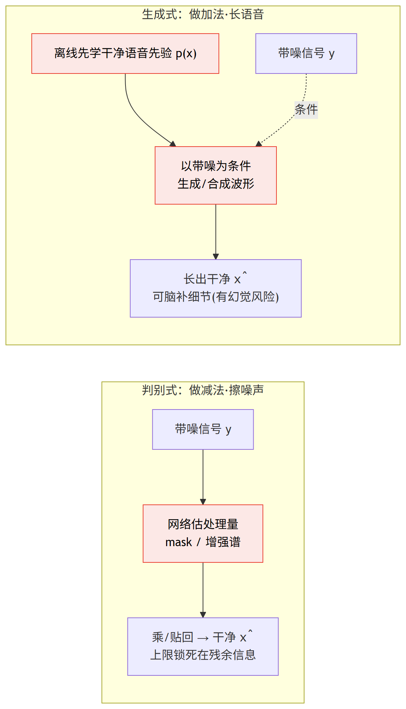
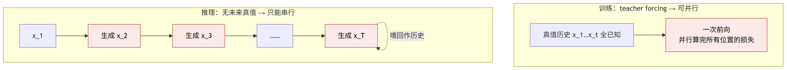
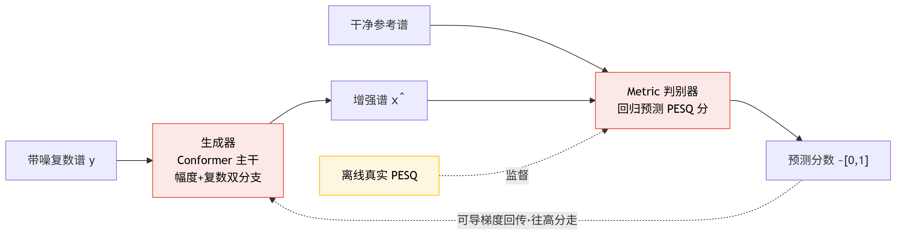

# 第 8 篇｜生成式语音增强·声码器：不"擦掉"噪声，而是把干净语音"长"出来

> 一句话核心直觉：前面所有模型都是判别式的——估个 mask、估个谱，本质是"把噪声擦干净"。可噪声一重，语音细节被连带擦没了，擦不回来。**生成式**换了个念头：先学会"干净语音本来长什么样"这个先验分布，再直接**生成/合成**出干净语音，把被抹掉的细节重新长出来。本篇拆两条路——自回归声码器 **WaveNet**，和对抗式的 **CMGAN**。

---

## 一、先把教材那套扔一边

从 RNNoise 一路到 Deep AEC，我们讲了七篇，模型换了一茬又一茬，但骨子里全是**同一个范式**：网络看着带噪输入，估一个"处理量"——逐频带增益、复数比值掩码、增强谱——然后把这个量乘/贴回带噪信号上。这类模型有个统一的名字：**判别式模型（discriminative model）**。

判别式模型学的是一个**映射**：输入带噪，输出干净（或输出通往干净的那个 mask）。它的世界观是"干净语音藏在带噪信号里，我的活儿是把噪声那部分识别出来、擦掉"。

这个世界观有个天花板，低信噪比时暴露得特别狠。

想象一段被地铁轰鸣盖住的人声。某个频带里，语音能量只有噪声的十分之一——信息几乎被淹没了。判别式模型能怎么办？它顶多把这个频带整体压低，可语音本来的细节（谐波的精确位置、气声的质感）早就被噪声糊成一团，**mask 只能决定"留多少"，没法决定"补什么"**。你乘一个 0.3 的增益，压下去的是噪声也是语音，剩下的还是一团糊。信息一旦被噪声破坏到某个程度，判别式这条路就"补不回来"了——因为它的全部本事就是"擦"，不会"画"。

生成式模型（generative model）换了个根本不同的念头。它不问"这段带噪信号里哪些该擦掉"，它先离线学一件更大的事：**干净语音到底长什么样？** 也就是学一个语音的**先验分布** $p(x)$——什么样的波形/频谱是"像人话的"，什么样的是"不可能出现在人嘴里的"。学会了这个先验，面对一段烂到糊的带噪语音，它做的是：**在所有"像人话"的干净语音里，找/生成一个既符合语音先验、又和这段带噪观测吻合的**。

打个比方。判别式模型像**橡皮擦**——照片上有脏点，它把脏点蹭掉，蹭得太狠连底下的字迹也一起没了。生成式模型像一个**见过千万张人脸的画师**——你给他一张被泼了墨的人脸照片，他不是去蹭那团墨，而是凭着"人脸应该长什么样"的经验，直接**重画**出墨底下那只本该在的眼睛。重画出来的眼睛未必和原来分毫不差，但它是一只**结构完整、细节丰满**的眼睛，而不是一团被蹭花的糊。

> **第一个关键认知**：判别式学的是"带噪→干净"的**映射/回归**，本质是**做减法**（擦掉噪声），能力上限被"观测里还剩多少语音信息"死死锁住；生成式学的是"干净语音长什么样"的**分布**，能**做加法**（合成细节），可以在信息被严重破坏时"脑补"回丰满的语音结构。代价是——它脑补的东西**不一定是真的**（这就是后面要警惕的"幻觉"）。

下面这张图把两种世界观并排放，是本篇的总纲：



一句话读图：**判别式只有"擦"这一招，被观测里的残余信息死死锁住；生成式先学会"人话长什么样"，再把细节"长"回来——能力更强，但会脑补出原本没有的东西。**

本篇讲两条最经典的生成式路线，它们代表了两种截然不同的生成方式：

- **WaveNet**：**自回归**声码器，逐个样本地"念出"波形，一次生成一个采样点。质量极高，慢得感人。
- **CMGAN**：**对抗式**增强，生成器一步吐出整段增强谱，判别器盯着"人耳/指标觉得好不好"来逼它。快，但训练像走钢丝。

---

## 二、声码器是什么：先说清楚这个词

在钻进 WaveNet 之前，先把**声码器（vocoder）** 这个词钉死，不然后面容易懵。

声码器原本的意思是"**从一个紧凑的声学表示（比如梅尔谱、基频等）合成出波形**"的模块。它是 TTS（语音合成）流水线的最后一棒——前面的网络把文字变成梅尔谱，声码器负责把梅尔谱变回你能听见的波形。

那它跟降噪有什么关系？关系在于：**降噪/语音恢复完全可以借用声码器的思路**。把带噪语音（或它的某种表示）当成"条件"，让一个声码器**以这个条件为参照，生成一段干净波形**。生成出来的波形天然是"像人话的"（因为声码器学过语音先验），噪声那部分因为不符合语音先验，自然就被"生成不出来"——相当于用生成的方式绕开了"擦噪声"。

WaveNet 正是最早那批"能直接生成原始波形"的声码器。它牛在哪？在它之前，大家觉得"逐个采样点生成 16kHz 的波形"是天方夜谭——一秒钟一万六千个点，每个点都要模型算一次，还要个个自然连贯。WaveNet 用**自回归 + 因果空洞卷积**把这件事做成了。

---

## 三、WaveNet 的灵魂：逐样本自回归

WaveNet 的核心假设，写成一个概率式子最清楚：

$$p(x) = \prod_{t=1}^{T} p\big(x_t \mid x_1, x_2, \ldots, x_{t-1}\big)$$

逐字翻译成人话：

- $x = (x_1, \ldots, x_T)$：一整段波形，$x_t$ 是第 $t$ 个采样点的值。
- $p(x)$：整段波形"像人话的"概率——也就是我们想学的那个语音先验分布。
- 右边的连乘：把"整段波形的概率"拆成**一个接一个采样点的条件概率**。$p(x_t \mid x_1..x_{t-1})$ 读作"在已经知道前面所有采样点的前提下，第 $t$ 个采样点该是多少"。
- **自回归（autoregressive）** 这个词的全部含义就在这——**生成当前样本时，把之前生成的所有样本当条件**。一个字一个字地念，念下一个字时嘴里含着前面所有字的记忆。

这个拆法很符合直觉：语音波形是高度**连续、相关**的，第 $t$ 个点的值跟它前面几百上千个点密切相关（一个基音周期就有一两百个点）。所以"看着历史猜下一个点"是靠谱的。

WaveNet 把每个采样点的取值**离散化成 256 个类**（μ-law 量化，一种贴合人耳的 8bit 压扩），于是"预测下一个样本"就变成了一个 **256 类的分类问题**——网络每一步输出一个长度 256 的概率分布，从里面采样出下一个样本值。（这也是为什么上面代码里输出通道是 256。）

训练时有个巨大便利叫 **teacher forcing**：因为训练数据是真实干净波形，$x_1..x_{t-1}$ 全是已知的真值，所以整段可以**并行**算——每个位置都拿真值历史去预测下一个真值，一次前向就能算完所有位置的损失。**训练是并行的，爽。**

但**推理**时噩梦来了：你没有未来的真值，只能真的一个点一个点生成——生成 $x_t$，喂回去，再生成 $x_{t+1}$……**16kHz 的一秒语音要串行跑一万六千次前向**。这就是自回归声码器"质量高但慢到没法实时"的根源，后面工程表里会重点算这笔账。

> **第二个关键认知**：自回归的威力和诅咒是同一件事——**"逐样本、条件于全部历史"**。威力是它能建模波形极精细的长程相关，生成的语音自然连贯、细节丰满；诅咒是推理时**天然串行、无法并行**，生成 $N$ 个样本就要跑 $N$ 次前向。训练能并行（teacher forcing），推理不能——这个不对称是自回归模型的命门。

把训练和推理两种模式并排画出来，命门一眼可见：



读图：**同一个模型，训练时拿真值历史一把并行算完，推理时却要一个采样点喂回一个采样点——16kHz 一秒就是串行一万六千次前向。慢，全慢在这条串行链上。**

---

## 四、因果空洞卷积：怎么在几层里看到"很久以前"

自回归有个绕不开的技术难题：$p(x_t \mid x_1..x_{t-1})$ 要求网络在预测第 $t$ 点时，**看得到很久以前的历史**（至少覆盖几个基音周期，上千个采样点），同时**绝对不能偷看未来**（$x_t$ 之后的点还没生成呢）。

"不能偷看未来"这条，正是我们从第一篇就反复强调的**因果性**红线。WaveNet 用的这套卷积，同时解决了"看得远"和"不偷看未来"两件事，叫**因果空洞卷积（dilated causal convolution）**。拆成两半看。

**先看"因果"。** 普通卷积核会同时吃当前点左右两边的邻居——右边就是未来，偷看了。因果卷积的做法很朴素：**只在左边（过去）补零，右边（未来）一个都不补**。这样卷积核的感受野只覆盖当前点和它左边的历史，输出的第 $t$ 个点只依赖输入的第 $\le t$ 个点。代码里那句 `F.pad(x, (left_pad, 0))`——只在左侧 pad、右侧填 0——就是因果性的全部秘密。

**再看"空洞"（dilated，也叫膨胀）。** 问题是：要看到上千个采样点的历史，普通卷积得堆上千层，或者用巨大的卷积核，都不现实。空洞卷积的招数是——**卷积核的抽头之间隔着"空洞"，跳着采样**。膨胀率（dilation）$d=2$ 就是"隔一个点取一个"，$d=4$ 就是"隔三个点取一个"。

真正的妙手在于：**把膨胀率一层层指数翻倍**——$1, 2, 4, 8, 16, \ldots$。这样每往上一层，感受野就翻一倍，**感受野随层数指数增长**。感受野的算式是：

$$R = 1 + \sum_{\ell} (k - 1)\, d_\ell$$

逐字翻译成人话：

- $k$：卷积核大小（WaveNet 常用 $k=2$，一次只看两个抽头）。
- $d_\ell$：第 $\ell$ 层的膨胀率，取 $1, 2, 4, 8, \ldots$。
- $(k-1)d_\ell$：第 $\ell$ 层往历史里多伸出去的采样点数。
- $R$：把每层伸出去的加起来再 +1，就是最终能回望多少个采样点。

代入感受一下：$k=2$，膨胀率取 $1,2,4,8,16$，感受野 $R = 1 + 1\times(1+2+4+8+16) = 32$。只要 5 层。若堆到膨胀率 512，十层就能覆盖一千多个采样点——**用 $O(\log T)$ 层覆盖 $O(T)$ 的历史**。这就是 WaveNet 敢逐样本建模却不至于深不可训的关键。

> **第三个关键认知**：因果空洞卷积把两个矛盾的诉求拧成了一股绳——**"只在左边补零"保证不偷看未来（因果，满足实时红线）**，**"膨胀率 $1,2,4,8,\ldots$ 指数翻倍"让感受野指数增长（少数几层就能回望上千样本）**。普通卷积要么看不远、要么层数爆炸，空洞卷积用"跳着采样"四两拨千斤。注意：它解决的是"感受野"问题，解决不了自回归"逐样本串行"这个推理慢的根本矛盾。

---

## 五、CMGAN：换一种生成方式，让判别器当"裁判"

WaveNet 慢在自回归。有没有办法**一步就吐出整段干净语音**，不用逐样本串行？有——用 **GAN（生成对抗网络）**。CMGAN（Conformer-based Metric GAN）就是把 GAN 用在语音增强上的一个代表。

先讲清楚 GAN 的博弈直觉，因为它和前面所有模型的训练方式都不一样。

GAN 里有两个网络在**互相较劲**：

- **生成器（Generator）**：吃带噪谱，一步吐出增强谱。它想让增强谱"以假乱真"，骗过裁判。
- **判别器（Discriminator）**：当裁判，看一眼谱，判断"这是真·干净语音，还是生成器造出来的假货"。它想练就火眼金睛，别被骗。

两个网络对着训练：生成器越造越真，判别器越看越精，此消彼长，最后生成器被逼得能造出连精明裁判都分不出真假的干净语音。这就是**对抗训练**。比喻是造假币的和验钞机——验钞机越严，逼得造假币的越逼真，直到假币和真钞难分。

普通 GAN 的判别器输出"真/假"二分类。但语音增强有个更聪明的玩法，这正是 **Metric GAN** 的点子。

问题的背景是：我们评价语音增强好不好，最终要看**感知指标**，比如 PESQ（一个模拟人耳打分的客观指标，范围约 -0.5~4.5）。我们最想直接拿 PESQ 当损失去训练——可 **PESQ 的计算过程不可导**（里面全是查表、非线性、时间对齐这类操作），没法反向传播，梯度传不回生成器。这是个老大难。

Metric GAN 的破局思路绝妙：**让判别器去"学习"这个不可导的指标**。也就是——不让判别器做"真/假"二分类，而是让它**回归预测 PESQ 分数**（归一化到 0~1）。判别器变成一个"可导的 PESQ 模拟器"：喂它一对（增强谱，干净参考谱），它输出一个预测分数，训练时用**真实 PESQ**（离线调工具算出来）当监督，逼判别器学得越来越像真 PESQ。

判别器一旦学会了"可导地近似 PESQ"，生成器就有救了：生成器只要**让判别器给自己打的分越高越好**，梯度就能顺着这个可导的判别器一路传回来——**绕开了 PESQ 不可导的墙**。相当于生成器请了个"随身裁判"，这个裁判的评分标准就是 PESQ，而且能给出可导的反馈。

> **第四个关键认知**：Metric GAN 的判别器不是"辨真假"，而是**学着可导地逼近一个不可导的感知指标（如 PESQ）**。这一步把"直接优化人耳指标"这个原本因为不可导而做不到的事，变成了可训练的目标——生成器往判别器打高分的方向走，等价于往"PESQ 高、人耳觉得好"的方向走。**这解决了语音增强长期的痛点：训练损失（MSE/SI-SNR）和真正的听感指标之间总是背离。**

CMGAN 里 "C" 是 Conformer。生成器主干用 **Conformer**（第 6 篇讲过：卷积补局部 + 注意力补全局），而且通常在**复数谱**上工作，走**幅度分支 + 复数分支双分支**——幅度分支管能量的粗轮廓，复数分支连相位一起修（呼应 DCCRN 那套"相位也要学"的思想）。生成器估出增强的复数谱，判别器在谱上打分，对抗训练把它推向感知最优。

这套"生成器出谱、metric 判别器可导地打 PESQ 分"的博弈，画成图是这样：



读图：**判别器不判真假，而是学着可导地模仿不可导的 PESQ；生成器只要往"判别器打高分"的方向走，等价于直接优化人耳指标——绕开了 PESQ 不可导这堵墙。**

代码实战里我们不复现整个 Conformer 主干（太重），只把 **Metric GAN 这个训练回合的骨架**——生成器出谱、判别器打分、两个 loss 怎么算——最小化地跑通，让你看清博弈是怎么落到代码里的。

---

## 六、代码实战

分两段。(a) 把 WaveNet 的**因果空洞卷积残差块**跑出来，验证感受野指数增长和因果性；(b) 把 **Metric GAN 一个训练步**跑出来，看清生成器/判别器/两个 loss 的博弈。都能直接运行，torch 2.x CPU 即可。

### (a) WaveNet 因果空洞卷积残差块

```python
import torch
import torch.nn as nn
import torch.nn.functional as F

torch.manual_seed(0)

class CausalDilatedResBlock(nn.Module):
    """WaveNet 的一个残差块: 因果 + 空洞 的门控卷积.
    输入输出都是 [B, C, T], 时间长度 T 不变(靠因果 padding 补齐)."""
    def __init__(self, channels, kernel_size=2, dilation=1):
        super().__init__()
        self.dilation = dilation
        self.kernel_size = kernel_size
        # 因果关键: 只在左边(过去)补 (kernel-1)*dilation 个零, 右边(未来)不补
        self.left_pad = (kernel_size - 1) * dilation
        # 门控双分支: 一路 tanh(内容), 一路 sigmoid(开关), 逐点相乘 (WaveNet 门控激活)
        self.conv_filter = nn.Conv1d(channels, channels, kernel_size, dilation=dilation)
        self.conv_gate   = nn.Conv1d(channels, channels, kernel_size, dilation=dilation)
        self.conv_res  = nn.Conv1d(channels, channels, 1)   # 1x1 回到残差主干
        self.conv_skip = nn.Conv1d(channels, channels, 1)   # 1x1 到 skip 汇总

    def forward(self, x):
        # x: [B, C, T]
        xp = F.pad(x, (self.left_pad, 0))       # 只在左侧补零 -> 因果
        f = torch.tanh(self.conv_filter(xp))    # [B, C, T]  内容
        g = torch.sigmoid(self.conv_gate(xp))   # [B, C, T]  开关
        z = f * g                                # 门控激活 [B, C, T]
        res  = self.conv_res(z) + x              # 残差相加 [B, C, T]
        skip = self.conv_skip(z)                 # skip 输出 [B, C, T]
        return res, skip

class TinyWaveNet(nn.Module):
    """几个膨胀率指数增长的残差块堆叠, 演示感受野爆炸式增长."""
    def __init__(self, channels=16, kernel_size=2, dilations=(1, 2, 4, 8, 16)):
        super().__init__()
        self.in_conv = nn.Conv1d(1, channels, 1)   # 波形 [B,1,T] -> [B,C,T]
        self.blocks = nn.ModuleList(
            [CausalDilatedResBlock(channels, kernel_size, d) for d in dilations])
        self.out = nn.Sequential(
            nn.ReLU(), nn.Conv1d(channels, channels, 1),
            nn.ReLU(), nn.Conv1d(channels, 256, 1),   # 256 类 mu-law 量化, 逐样本分类
        )
        self.kernel_size = kernel_size
        self.dilations = dilations

    def receptive_field(self):
        return 1 + sum((self.kernel_size - 1) * d for d in self.dilations)

    def forward(self, x):
        # x: [B, 1, T]
        h = self.in_conv(x)          # [B, C, T]
        skip_sum = 0
        for blk in self.blocks:
            h, skip = blk(h)         # 每块时间维不变
            skip_sum = skip_sum + skip
        logits = self.out(skip_sum)  # [B, 256, T]  每个时刻对"下一个样本值"的分类分布
        return logits

B, T = 2, 400
wav = torch.randn(B, 1, T)      # 模拟一段波形 [B,1,T]
net = TinyWaveNet()
logits = net(wav)
print("波形输入 shape  :", tuple(wav.shape))      # (2, 1, 400)
print("逐样本 logits   :", tuple(logits.shape))   # (2, 256, 400) 每时刻 256 类分布
print("膨胀率序列      :", net.dilations)
print("感受野(样本数)  :", net.receptive_field()) # 1 + 1*(1+2+4+8+16) = 32

# 验证因果: 改动"最后一个时刻"的输入, 绝不能影响更早时刻的输出
with torch.no_grad():
    base = net(wav)
    wav2 = wav.clone(); wav2[:, :, -1] += 100.0   # 只扰动最后一帧
    pert = net(wav2)
    diff = (base - pert).abs().sum(dim=1)         # [B, T] 每个时刻的变化量
    print("扰动最后1帧->更早帧最大变化:", diff[:, :-1].max().item())  # 应=0(因果)
```

跑出来：

```
波形输入 shape  : (2, 1, 400)
逐样本 logits   : (2, 256, 400)
膨胀率序列      : (1, 2, 4, 8, 16)
感受野(样本数)  : 32
扰动最后1帧->更早帧最大变化: 0.0
```

三个关键观察：（1）**输出 shape 是 `[B, 256, T]`**——每个时刻吐一个 256 类分布，对应"下一个样本落在哪个 μ-law 量化档"，这就是自回归"逐样本分类"的形态。（2）**5 层就把感受野撑到 32**，膨胀率再往 $32,64,\ldots$ 翻，十层能覆盖上千样本——感受野指数增长的威力。（3）**扰动最后一帧，更早帧的输出变化精确等于 0**——这是因果性的铁证：未来的输入绝不泄漏到过去的输出。真实推理时正因如此才能一个点一个点安全地生成。

### (b) Metric GAN 一个训练步

```python
import torch
import torch.nn as nn
import torch.nn.functional as F

torch.manual_seed(0)
# 复数谱约定: [B, 2, F, T] (实部/虚部两通道)

class Generator(nn.Module):
    """生成器: 带噪复数谱 -> 增强复数谱. 简化为几层卷积(真实 CMGAN 是 Conformer 主干)."""
    def __init__(self, ch=16):
        super().__init__()
        self.net = nn.Sequential(
            nn.Conv2d(2, ch, 3, padding=1), nn.PReLU(),
            nn.Conv2d(ch, ch, 3, padding=1), nn.PReLU(),
            nn.Conv2d(ch, 2, 3, padding=1),   # 回到 2 通道复数谱
        )
    def forward(self, x):
        return self.net(x)   # [B, 2, F, T]

class MetricDiscriminator(nn.Module):
    """判别器: 吃(增强谱, 干净谱)一对, 输出一个 0~1 分数, 学着预测归一化 PESQ."""
    def __init__(self, ch=16):
        super().__init__()
        self.net = nn.Sequential(
            nn.Conv2d(4, ch, 3, stride=2, padding=1), nn.LeakyReLU(0.2),  # 4=两谱拼接
            nn.Conv2d(ch, ch, 3, stride=2, padding=1), nn.LeakyReLU(0.2),
            nn.AdaptiveAvgPool2d(1), nn.Flatten(),
            nn.Linear(ch, 1), nn.Sigmoid(),   # 输出预测的归一化指标分数
        )
    def forward(self, enh, clean):
        pair = torch.cat([enh, clean], dim=1)  # [B, 4, F, T]
        return self.net(pair)                  # [B, 1]

def real_pesq(enh, clean):
    """占位: 真实中调用不可导的 PESQ 工具; 这里用可算的相似度模拟, 范围~[0,1]."""
    err = (enh - clean).pow(2).mean(dim=[1, 2, 3])
    return torch.exp(-err).unsqueeze(1)        # [B, 1] 越接近干净分数越高

B, Fb, T = 4, 129, 50
noisy = torch.randn(B, 2, Fb, T)   # 带噪复数谱 [B,2,F,T]
clean = torch.randn(B, 2, Fb, T)   # 干净复数谱(训练时已知)

G, D = Generator(), MetricDiscriminator()
opt_g = torch.optim.Adam(G.parameters(), lr=1e-3)
opt_d = torch.optim.Adam(D.parameters(), lr=1e-3)

# --- 一个训练步 ---
enh = G(noisy)                                 # 增强谱 [B,2,F,T]
print("带噪谱 shape :", tuple(noisy.shape))    # (4, 2, 129, 50)
print("增强谱 shape :", tuple(enh.shape))      # (4, 2, 129, 50)

# 1) 训练判别器: 让它对齐真实指标(真实 PESQ 作监督) -> 判别器变成"可导 PESQ 模拟器"
score_enh   = D(enh.detach(), clean)           # [B,1] 判别器给增强谱打的分
score_clean = D(clean, clean)                  # [B,1] 干净 vs 干净, 指标应=满分 1
target_enh   = real_pesq(enh.detach(), clean)  # [B,1] 真实指标(增强)
target_clean = torch.ones(B, 1)                # 干净对干净, 指标=1
loss_d = F.mse_loss(score_enh, target_enh) + F.mse_loss(score_clean, target_clean)
opt_d.zero_grad(); loss_d.backward(); opt_d.step()

# 2) 训练生成器: 骗判别器给满分(=让指标变高) + 谱域重建项稳住训练
score_for_g = D(enh, clean)                    # [B,1] 判别器当前给的分
adv_loss   = F.mse_loss(score_for_g, torch.ones(B, 1))  # 逼近满分1 => 往"指标好"走
recon_loss = F.l1_loss(enh, clean)             # 重建项, 防 GAN 训练发散
loss_g = adv_loss + recon_loss
opt_g.zero_grad(); loss_g.backward(); opt_g.step()

print("判别器打分 shape:", tuple(score_enh.shape))   # (4, 1)
print("loss_D:", round(loss_d.item(), 4), "| loss_G:", round(loss_g.item(), 4))
```

跑出来（数值随机初始化会有出入）：

```
带噪谱 shape : (4, 2, 129, 50)
增强谱 shape : (4, 2, 129, 50)
判别器打分 shape: (4, 1)
loss_D: 0.2292 | loss_G: 0.9937
```

盯住这几处，博弈就清楚了：（1）**判别器的 target 是 `real_pesq` 的真值**——它在学"可导地逼近 PESQ"，这是 Metric GAN 的心脏。（2）**生成器的 `adv_loss` 是"让判别器给自己打满分 1"**——梯度顺着可导的判别器传回生成器，等价于往"PESQ 高"的方向走，绕开了 PESQ 本身不可导。（3）**多了一个 `recon_loss`（L1 重建）**——纯对抗损失训练极不稳，加个谱域重建项当"缰绳"拽着，这是 GAN 语音增强能收敛的常见工程手段。（4）判别器那步用 `enh.detach()` 切断了到生成器的梯度——训判别器时不动生成器，两者轮流更新，这是对抗训练的标准姿势。

---

## 七、这在工程里解决什么问题

先看判别式和生成式的范式级对照：

| 维度 | 判别式（RNNoise~AEC 全家桶） | 生成式（WaveNet / CMGAN） |
|---|---|---|
| **学什么** | 带噪→干净的映射（估 mask/谱） | 干净语音的先验分布 $p(x)$ |
| **本质操作** | 做减法：擦掉噪声 | 做加法：合成/脑补细节 |
| **能力上限** | 被"观测里还剩多少语音信息"锁死 | 低信噪比下仍能"长"出丰满语音 |
| **失效模式** | 噪声太重时越擦越糊 | 可能"幻觉"出原本没有的内容 |
| **典型场景** | 中高信噪比实时降噪/AEC | 重度受损语音恢复、TTS 声码 |

再看生成式内部 WaveNet 和 GAN 两条路的取舍：

| 维度 | WaveNet（自回归） | CMGAN（对抗式） |
|---|---|---|
| **生成方式** | 逐样本串行，$p(x_t\mid x_{<t})$ | 一步吐出整段增强谱 |
| **质量** | 极高，波形细节丰满 | 高，且直接对齐感知指标 |
| **速度** | 极慢（16kHz 一秒要跑万次前向） | 快（一次前向出结果） |
| **实时性** | 原生几乎不可能实时 | 可做到实时/近实时 |
| **训练稳定性** | 稳（就是个分类回归，teacher forcing 并行训） | 不稳（对抗博弈，易模式崩溃、难收敛） |
| **主要工程痛点** | 推理串行是死穴 | GAN 训练要靠重建项等技巧兜底 |

几条一线经验值得单独点出：

- **WaveNet 的慢是结构性的**，不是调调超参能救的。自回归"生成 $x_t$ 必须先有 $x_{t-1}$"这个串行依赖没法并行化。工业界后来搞出 Parallel WaveNet、WaveRNN、以及 HiFi-GAN 这类**非自回归声码器**，本质都是在"保住质量的前提下逃离逐样本串行"。所以你在实时降噪产品里几乎见不到原版 WaveNet——它更多活在离线高质量合成、或者作为思想源头。
- **GAN 的不稳是出了名的**。生成器和判别器一旦失衡（一方学太快），训练就崩：要么**模式崩溃**（生成器只会造有限几种样本骗判别器），要么**loss 剧烈震荡不收敛**。CMGAN 这类之所以能训出来，很大程度靠 metric 判别器把目标变"软"（回归分数比二分类稳）、再加重建损失当缰绳。上手 GAN 语音增强，**准备好花大量时间调 G/D 更新比例、学习率、损失权重**。

- **生成式的"幻觉"风险，是判别式从来没有的新问题**。这点必须警惕：判别式模型最坏也就是"擦得不干净/擦过头"，它不会**无中生有**。但生成式会——它在"脑补细节"时，可能生成出**说话人原本没说的音、原本不存在的谐波、甚至改变音色**。在语音识别前端、司法取证、医疗记录这类场景，"听起来干净但内容被篡改"比"有点噪声但忠实"危险得多。所以生成式增强上线前，**保真度（是否引入幻觉）要和感知质量一起评估**，不能只看 PESQ 高就发版。

> **一句话工程定位**：生成式增强是"判别式擦不动了"时的杀手锏——重度受损语音恢复、超低码率声码、TTS 最后一棒，这些场景它无可替代。但它带着两个新麻烦：自回归的慢、对抗的不稳，外加一个判别式没有的伦理/保真风险（幻觉）。选它之前先问一句：**我这个场景，是"宁可有点噪也要忠实"，还是"宁可脑补也要干净"？**

---

## 八、埋一个钩子

WaveNet 慢在自回归的逐样本串行，GAN 稳不住在对抗博弈的走钢丝——两条生成式路线各有各的死结。有没有第三种生成方式，既不用逐样本串行、又不用对抗博弈？下一篇的**扩散模型**给了个漂亮的答案：把生成拆成"往语音里一点点加噪、再一步步去噪捞回来"的**逐步反扩散**过程。

---

## 本篇小结

- **范式之变**：判别式学"带噪→干净"的映射（做减法擦噪声），上限被观测里的残余信息锁死；生成式学"干净语音长什么样"的先验分布（做加法合成细节），能在重度受损时把语音"长"回来。
- **WaveNet（自回归声码器）**：$p(x)=\prod_t p(x_t\mid x_{<t})$，逐样本生成、条件于全部历史；质量极高，但推理天然串行、几乎无法实时。训练可用 teacher forcing 并行，推理不能——这个不对称是命门。
- **因果空洞卷积**：只在左侧补零保证**因果**（不偷看未来、守住实时红线）；膨胀率 $1,2,4,8,\ldots$ 指数翻倍让**感受野指数增长**，少数几层覆盖上千样本。
- **CMGAN（Metric GAN）**：生成器一步出增强复数谱（Conformer 主干、幅度+复数双分支），**判别器学着可导地逼近不可导的感知指标（PESQ）**，让生成器能直接往"人耳觉得好"的方向优化——治好了训练损失与听感背离的老毛病。代价是对抗训练不稳，要靠重建项等技巧兜底。
- **两路取舍**：WaveNet 质量高但慢、难实时、训练稳；GAN 一步快、可实时，但训练不稳（模式崩溃、难收敛）。
- **新增的工程风险**：生成式会"幻觉"——无中生有出原本没有的内容。上线前保真度必须和感知质量一起评估，不能只看指标。
- **下一步**：自回归太慢、GAN 太不稳，扩散模型用"逐步反扩散"另辟蹊径，下一篇讲。
