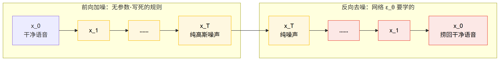
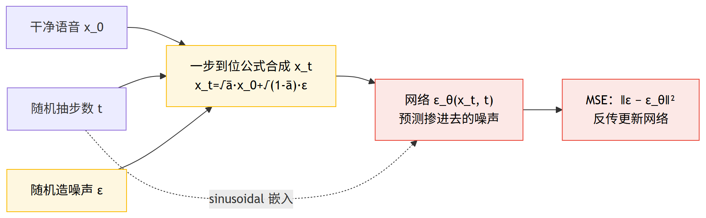
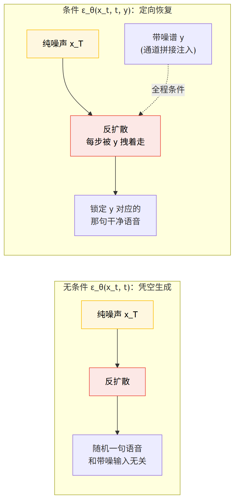

# 第 9 篇｜扩散模型语音恢复前沿：把"生成干净语音"拆成一百次小步去噪

> 一句话核心直觉：扩散模型不硬生生一步"造"出干净语音，而是反过来玩——先想象把干净语音**一点点泡进高斯噪声**，泡到最后变成纯噪声；再训练一个网络学会这条链的**逆过程**：每一步只去掉一丁点噪声。推理时从纯噪声出发，一步步反扩散，最后**捞回**干净语音。做语音增强时，只要把带噪语音作为**条件**喂进去引导反扩散，就能"捞回对应这段带噪输入的那句干净话"。

---

## 一、先把教材那套扔一边

上一篇我们走进了生成式增强：WaveNet 用**自回归**逐样本生成，音质惊艳但慢得令人发指——生成一秒语音要串行跑上万步；CMGAN 用**对抗**训练把细节补回来，但 GAN 那套判别器/生成器的博弈，训起来忽好忽坏、动不动就崩，调参像在走钢丝。收尾我埋了一句：自回归太慢、GAN 太飘，有没有第三条更稳的生成式路线？

这一篇的主角——**扩散模型（diffusion model）**——就是这条路线。它这几年在图像生成上掀翻了天（你听过的那些文生图大模型，内核几乎都是扩散），在语音增强/恢复上也迅速成了前沿。它凭的不是什么玄学，而是一个特别朴素、特别工程的想法。

翻开讲扩散的资料，一上来往往是一整页随机微分方程、变分下界、KL 散度的推导，看得人头皮发麻。**先把那套扔一边。** 扩散模型的核心直觉，一个初中生都能听懂：

> **一步到位太难，那就拆成一百步。** 让网络一口气从纯噪声里"变"出一句干净语音，太难了——这一步跨度太大，网络学不动。那把它拆成一百步、每步只做"去掉一点点噪声"这种小得多的事，网络就学得动了。扩散模型的全部聪明，就是把"生成"这个难题，**拆解成一连串简单到近乎平凡的小步**。

这和上一篇 WaveNet"把生成拆成逐样本"、GAN"用对抗逼近分布"是完全不同的拆法。WaveNet 沿**时间**拆（一个样本一个样本地吐），扩散沿**噪声程度**拆（一个噪声水平一个噪声水平地退）。后面你会看到，正是这个"沿噪声拆"的选择，让训练变得异常稳定——因为它根本不需要对抗，只需要做一件初学者都会的事：**回归**。

先记住这条主线，它是理解整篇的钥匙：

> **扩散模型有两条方向相反的链。前向（加噪）是人为写死的、不含任何学习参数——把干净语音一步步加噪直到纯噪声；反向（去噪）才是网络要学的——一步步把噪声退回去。训练的全部内容，就是让网络学会"这一步里掺进去的噪声长什么样"。**

先给一张全篇的地图——上排前向加噪、下排反向去噪，两条链首尾相接：



一句话读图：**黄色前向链把语音一点点泡进噪声（免费、写死）；红色反向链是网络学出来的，从纯噪声一步步把干净语音捞回来。本篇的全部功夫都在这条红色链上。**

---

## 二、前向过程：把语音一点点泡进噪声

先看那条**不需要学习**的链——前向加噪。

想象你手里有一段干净语音的谱 $x_0$（下标 0 表示"第 0 步，最干净"）。现在你往里一点点掺高斯噪声：第 1 步掺一点点、第 2 步再掺一点点……掺到第 $T$ 步（比如 $T=1000$），原来的语音结构已经被彻底淹没，$x_T$ 就是一片纯高斯噪声，看不出半点语音的影子。

这条链的每一小步，数学上定义成"在上一步的基础上，缩小一丢丢、再加一丢丢噪声"：

$$q(x_t \mid x_{t-1}) = \mathcal{N}\!\left(x_t;\ \sqrt{1-\beta_t}\,x_{t-1},\ \beta_t \mathbf{I}\right)$$

别被 $\mathcal{N}$ 吓到，逐字翻译成人话：

- $q(x_t \mid x_{t-1})$：给定第 $t-1$ 步的谱，第 $t$ 步的谱服从什么分布。
- $\mathcal{N}(\cdot;\ \mu,\ \sigma^2)$：一个高斯分布，分号后第一项是**均值** $\mu$、第二项是**方差**。
- 均值 $\sqrt{1-\beta_t}\,x_{t-1}$：把上一步的谱**按 $\sqrt{1-\beta_t}$ 稍微缩小一点**（$\beta_t$ 是个很小的正数，比如 0.0001~0.02）。
- 方差 $\beta_t$：往里**掺入方差为 $\beta_t$ 的高斯噪声**。

$\beta_t$ 叫**噪声调度（noise schedule）**，是一串你事先写死的小数字，通常随 $t$ 从小到大缓慢增大（前面泡得慢、后面泡得快）。**注意：这整条前向链没有一个可学习参数**，纯粹是拿定死的规则一步步给语音掺噪。

### 任意步一步到位加噪

如果每加一步噪声都要从头串行算 $t$ 次，训练会慢死。扩散有个漂亮的性质：**从 $x_0$ 直接一步跳到任意第 $t$ 步**，不用逐步递推。因为高斯加高斯还是高斯，把上面那条链连乘展开、化简，就得到这篇最该背下来的公式：

$$x_t = \sqrt{\bar{\alpha}_t}\,x_0 + \sqrt{1-\bar{\alpha}_t}\,\varepsilon,\qquad \varepsilon \sim \mathcal{N}(0, \mathbf{I})$$

其中 $\alpha_t = 1-\beta_t$，$\bar{\alpha}_t = \prod_{s=1}^{t}\alpha_s$（连乘）。逐项翻译：

- $x_0$：**干净语音**（谱）。
- $\varepsilon$：一坨**标准高斯噪声**，和 $x_0$ 同形状，每个元素独立采自 $\mathcal{N}(0,1)$。
- $\bar{\alpha}_t$：**累积保留比例**——到第 $t$ 步为止，原始干净信号还"活着"多少。它从 $\bar{\alpha}_0\approx 1$（几乎全是语音）单调降到 $\bar{\alpha}_T\approx 0$（几乎全是噪声）。
- $\sqrt{\bar{\alpha}_t}$：给干净语音的**权重**。$t$ 越大越接近 0，语音被压得越扁。
- $\sqrt{1-\bar{\alpha}_t}$：给噪声的**权重**。$t$ 越大越接近 1，噪声占得越满。

一句话读懂它：**第 $t$ 步的带噪谱，就是"缩了水的干净语音"加上"放大了的噪声"，两者的配比由 $\bar{\alpha}_t$ 一个数说了算。** $t=0$ 时全是语音，$t=T$ 时全是噪声，中间是平滑过渡。

> **第一个关键认知**：前向过程是**免费的**——它没有参数、不用训练，你想要第 $t$ 步的样本，一个公式当场算出来。这个"一步到位"公式是扩散能高效训练的地基：训练时随机抽一个 $t$，直接构造出 $(x_0, x_t, \varepsilon)$ 三元组喂给网络，完全不用跑那条串行的加噪链。真正贵的、要学的，全在反过来那条链上。

---

## 三、反向过程：训练一个网络"认出这步掺了多少噪声"

现在轮到要学习的那条链。反向过程要干的事是：**给我第 $t$ 步的带噪谱 $x_t$，你把它退回到第 $t-1$ 步（噪声少一点）的谱。** 一步步退，退到第 0 步，就还原出干净语音了。

问题是：怎么退？这里有个绝妙的转化。回头看前向那个一步到位公式——

$$x_t = \sqrt{\bar{\alpha}_t}\,x_0 + \sqrt{1-\bar{\alpha}_t}\,\varepsilon$$

如果我**知道**这步掺进去的噪声 $\varepsilon$ 是什么，那我把它减掉、再除回去，不就当场还原出 $x_0$ 了吗？所以问题从"怎么退噪声"变成了一个干净利落的预测题：

> **给定带噪的 $x_t$ 和当前步数 $t$，预测出"这里面掺进去的噪声 $\varepsilon$ 长什么样"。**

这就是要训练的网络，记作 $\varepsilon_\theta(x_t, t)$——输入带噪谱和步数，输出它对噪声的预测。$\theta$ 是网络参数。训练目标简单到令人不敢相信，就是让预测噪声逼近真实噪声的**均方误差**：

$$\mathcal{L} = \mathbb{E}_{x_0,\,\varepsilon,\,t}\left[\,\big\|\,\varepsilon - \varepsilon_\theta(x_t, t)\,\big\|^2\,\right]$$

逐项翻译成人话：

- $\varepsilon$：前向加噪时**实际掺进去的那坨噪声**（我们自己造的数据，当然知道它是啥）。
- $\varepsilon_\theta(x_t, t)$：网络**看着 $x_t$ 和 $t$ 猜出来的噪声**。
- $\|\cdot\|^2$：两者逐元素相减、平方、求和——就是最普通的 MSE。
- $\mathbb{E}_{x_0,\varepsilon,t}$：对所有训练样本 $x_0$、所有随机噪声 $\varepsilon$、所有随机步数 $t$ 取平均。

训练一轮的流程，朴素到像在做小学算术：

1. 拿一段干净语音 $x_0$；
2. 随机抽一个步数 $t$（从 1 到 $T$ 均匀抽）；
3. 随机造一坨噪声 $\varepsilon$，用一步到位公式合成出 $x_t$；
4. 把 $x_t, t$ 喂进网络，得到预测 $\varepsilon_\theta$；
5. 算 $\varepsilon$ 和 $\varepsilon_\theta$ 的 MSE，反向传播更新网络。

> **第二个关键认知**：扩散的训练目标就是**回归噪声**——一个网络、一个 MSE，没有判别器、没有对抗、没有博弈。这正是它比 GAN 稳的根本原因：GAN 的损失是两个网络此消彼长的动态目标，随时可能崩；扩散的损失是一个**固定的、良性的回归目标**，跟你在基础系列里训 mask 回归没有本质区别，Adam 一挂就稳稳往下走。网络要学的，是在**每一个噪声水平上**都练成一个"火眼金睛"——不管噪声多浓多淡，都能认出"这里面哪些是噪声、哪些是信号"。

把这五步训练画成一张环，"随机抽 t、造噪、合成、预测、算 MSE"的闭环一目了然：



读图：**真实噪声 ε 是自己造的、当然知道；网络看着 $x_t$ 和 $t$ 去猜它，用最普通的 MSE 拉近——没有对抗、没有博弈，就是一道回归题。这就是扩散比 GAN 稳的根。**

为什么网络要吃一个"步数 $t$"作为输入？因为同一个网络要应付从"几乎干净"到"几乎纯噪声"的**所有**噪声水平，它得知道"现在是第几步、该退多少"。$t$ 通常先编码成一个 **sinusoidal 时间步嵌入**（跟基础系列位置编码同一个套路，把一个整数变成一串正余弦向量），再注入网络。这一点在代码里会看得很清楚。

---

## 四、条件生成：语音增强的命门

到这里有个巨大的坑，不点破的话，你会以为扩散模型能直接拿来做增强——**它不能。**

上面训出来的是一个**无条件**扩散模型。你从纯噪声出发跑完反扩散，它会给你生成一句语音没错——但那是一句**随机的**、符合训练集统计规律的语音，跟你手里那段带噪录音**八竿子打不着**。这对语音增强毫无用处：增强要的是"把**这一段**带噪语音里的噪声去掉，还原出**这一句**话"，而不是"随便合成一句好听的话"。

所以做语音增强，必须让反扩散**条件于带噪语音**。改动其实很小：把带噪谱 $y$ 作为**额外输入**塞进网络，让它变成 $\varepsilon_\theta(x_t, t, y)$。这样网络在每一步预测噪声时，都被 $y$ 拽着走——它必须生成"和 $y$ 对得上的那句干净语音"，而不能天马行空。

$$\varepsilon_\theta(x_t, t) \ \longrightarrow\ \varepsilon_\theta(x_t, t, \mathbf{y})$$

- $\mathbf{y}$：**带噪观测**（麦克风收进来的那段脏语音的谱），全程作为条件不变。
- 最朴素的融合方式：把 $y$ 和 $x_t$ 沿**通道维拼接**再送进网络（代码里就这么干）；更讲究的做法会把 $y$ 过一个编码器再多尺度注入。

> **第三个关键认知**：无条件扩散是"凭空生成"，条件扩散才是"定向恢复"。语音增强扩散模型的全部戏法，就在于**怎么把带噪语音这个条件，有效地注入反扩散的每一步**。条件越强、注入越到位，生成的语音就越"锁定"在那段带噪输入对应的真值上，而不是飘走成另一句话。

一张对比图钉死这个"命门"——同样从纯噪声出发，有没有条件 $y$，结局天差地别：



读图：**无条件反扩散只会随机吐一句好听的话，对增强毫无用处；把带噪谱 $y$ 作为条件注入每一步，网络才被拽着"捞回这一段带噪输入对应的那句真话"。这一步是扩散能做增强的分水岭。**

这个方向上有两条代表性的技术路线，点到即止、混个脸熟就好：

- **CDiffuSE**：Conditional DiffuSE，在波形/谱域做条件扩散语音增强，把带噪语音同时用进前向和反向过程，是"扩散做增强"的早期代表作之一。
- **SGMSE**：基于**分数（score）** 的生成式语音增强，用的是扩散的连续时间（随机微分方程）视角。"预测噪声 $\varepsilon$"和"预测分数 $\nabla_x \log p(x)$"其实是同一件事的两种写法，你现在不必纠结这个等价，只要知道 SGMSE 这类是把扩散的连续形式用在增强上、效果很强就够了。

这两个名字不用背细节，记住它们代表"扩散在语音增强上真的落地了、而且是条件扩散"这个事实即可。

---

## 五、和 WaveNet / GAN 摆到一起看

三种生成式路线各有各的脾气，横向对一遍你就有全局观了：

- **训练稳定性**：扩散 > WaveNet（自回归）> GAN。扩散就是回归噪声、无对抗，最稳；WaveNet 是逐样本的分类/回归，也稳但慢；GAN 对抗博弈最不稳，最考验调参。
- **生成质量**：扩散和 GAN 都能出很高的音质，扩散尤其擅长**补细节、修重度损伤**（重度降噪、去混响、丢包补偿、超分辨率这类"恢复"任务），因为它是一步步精修，而不是一锤子买卖。
- **推理速度**：这是扩散的**致命短板**。它天生要跑几十到上百步反扩散，每一步都要完整前向一次网络。生成一句话可能要调用网络 100 次以上——比 GAN 那种"一次前向出结果"慢一两个数量级，实时几乎是灾难。

> **第四个关键认知**：扩散拿"推理慢"换来了"训练稳 + 质量高"。它的质量优势在**重度恢复**场景最突出——噪声压得极狠、信号损伤严重时，判别式模型（RNNoise/DCCRN 那些）往往"压过头、把语音也啃掉了"，而扩散能凭生成能力把缺失的语音结构**重新长出来**。但这份能力的代价是几十上百次网络调用，实时性是它落地路上最大的一座山。

这座山不是没人搬。加速采样是扩散研究的绝对热点，主流思路一句话带过：

- **DDIM**：把随机采样改成确定性采样，能在**不重训**的情况下把步数从上千砍到几十步，质量掉得不多。
- **少步蒸馏 / 一致性模型（consistency models）**：把一个训好的多步扩散"蒸馏"成一个几步、甚至**一步**就出结果的学生模型，专门为实时而生。

这些是把扩散往实时推的关键抓手。但即便如此，"扩散能不能在端侧实时降噪里挑大梁"，到今天仍是个开放问题——这一点我们放到工程视角那节细说。

---

## 代码实战

把上面三段核心机制用 PyTorch 跑通：**(a)** 前向加噪（一步到位到任意 $t$）、**(b)** 一个最小去噪网络 $\varepsilon_\theta$ 的前向（含时间步嵌入 + 条件带噪谱）、**(c)** 一步训练 loss（预测噪声 vs 真实噪声的 MSE）。最后附一个 **(d)** 反扩散采样循环，演示"从纯噪声条件生成"。谱统一用 `[B, F, T]`。

```python
import torch
import torch.nn as nn
import torch.nn.functional as F
import math

torch.manual_seed(0)

# ============================================================
# (a) 前向加噪：按调度 alpha_bar 一步到位加噪到任意 t
# ============================================================
T_STEPS = 200                                  # 扩散总步数（真实模型常用 1000，这里为演示取小）
betas = torch.linspace(1e-4, 0.02, T_STEPS)    # 线性噪声调度 beta_t（前小后大）
alphas = 1.0 - betas                           # alpha_t = 1 - beta_t
alpha_bars = torch.cumprod(alphas, dim=0)      # 累积保留比例 alpha_bar_t = 连乘 alpha

def q_sample(x0, t, noise):
    # x_t = sqrt(alpha_bar_t) * x0 + sqrt(1 - alpha_bar_t) * noise
    ab = alpha_bars[t].view(-1, 1, 1)          # [B,1,1] 便于广播到 [B,F,T]
    return torch.sqrt(ab) * x0 + torch.sqrt(1.0 - ab) * noise

B, Fdim, Tframe = 4, 257, 100
x0 = torch.randn(B, Fdim, Tframe)              # 干净语音谱 [B,F,T]（真实场景是 log-幅度谱）
print("x0 (clean spec):", tuple(x0.shape))

# 看不同 t 的加噪程度：干净 -> 半噪 -> 近纯噪
for t_val in [0, 50, 199]:
    t = torch.full((B,), t_val, dtype=torch.long)
    eps = torch.randn_like(x0)
    xt = q_sample(x0, t, eps)                  # [B,F,T]
    keep = torch.sqrt(alpha_bars[t_val]).item()
    noiz = math.sqrt(1 - alpha_bars[t_val].item())
    print(f"  t={t_val:3d}  x_t:{tuple(xt.shape)}  保留 sqrt(ab)={keep:.3f}  噪声 sqrt(1-ab)={noiz:.3f}")
```

跑出来：

```
x0 (clean spec): (4, 257, 100)
  t=  0  x_t:(4, 257, 100)  保留 sqrt(ab)=1.000  噪声 sqrt(1-ab)=0.010
  t= 50  x_t:(4, 257, 100)  保留 sqrt(ab)=0.936  噪声 sqrt(1-ab)=0.353
  t=199  x_t:(4, 257, 100)  保留 sqrt(ab)=0.364  噪声 sqrt(1-ab)=0.932
```

看那三行数字——`保留` 从 1.000 一路掉到 0.364，`噪声` 从 0.010 一路涨到 0.932，语音一步步被噪声吞掉的过程，全写在 $\bar{\alpha}_t$ 这一个调度里。（步数取够大、$T=1000$ 时，末步 `保留` 会进一步逼近 0，真正到"纯噪声"。这里为了采样演示快，只用了 200 步。）

```python
# ============================================================
# (b) 最小去噪网络 eps_theta(x_t, t, y)：条件于带噪谱 y 做增强
# ============================================================
def timestep_embedding(t, dim):
    # 把整数步 t 编成 sinusoidal 向量 [B, dim]（同基础系列位置编码套路）
    half = dim // 2
    freqs = torch.exp(-math.log(10000) * torch.arange(half, dtype=torch.float32) / half)
    args = t.float().unsqueeze(1) * freqs.unsqueeze(0)              # [B, half]
    return torch.cat([torch.cos(args), torch.sin(args)], dim=1)    # [B, dim]

class EpsTheta(nn.Module):
    def __init__(self, Fdim, tdim=64, hidden=128):
        super().__init__()
        self.tdim = tdim
        self.t_mlp = nn.Sequential(nn.Linear(tdim, hidden), nn.SiLU(), nn.Linear(hidden, Fdim))
        # 输入通道 = 2*Fdim：噪声谱 x_t 与 条件带噪谱 y 沿"频率通道"拼接
        self.net = nn.Sequential(
            nn.Conv1d(2 * Fdim, hidden, 3, padding=1), nn.SiLU(),
            nn.Conv1d(hidden, hidden, 3, padding=1), nn.SiLU(),
            nn.Conv1d(hidden, Fdim, 3, padding=1),
        )

    def forward(self, xt, y_cond, t):
        # xt:[B,F,T]  y_cond:[B,F,T]  t:[B]
        temb = self.t_mlp(timestep_embedding(t, self.tdim))        # [B,F] 时间步嵌入
        h = xt + temb.unsqueeze(-1)                                # 把步数信息广播注入每一帧
        h = torch.cat([h, y_cond], dim=1)                          # [B,2F,T] 拼上带噪条件
        return self.net(h)                                         # [B,F,T] 预测这步的噪声

model = EpsTheta(Fdim)
n_param = sum(p.numel() for p in model.parameters())
print(f"EpsTheta params: {n_param/1e3:.1f}K")
```

打印：

```
EpsTheta params: 387.2K
```

一个玩具级去噪网络约 39 万参数（真实语音扩散模型动辄几千万到上亿）。注意 `forward` 里三件事：把 $t$ 编成时间步嵌入并注入、把条件 $y$ 拼进来、Conv1d 沿帧方向做时序卷积输出预测噪声。**时间步嵌入让同一个网络能应付所有噪声水平，条件拼接让它做的是"定向恢复"而非"随机生成"。**

```python
# ============================================================
# (c) 一步训练 loss：预测噪声 vs 真实噪声的 MSE
# ============================================================
y_noisy = x0 + 0.5 * torch.randn_like(x0)      # 带噪观测（作为条件）[B,F,T]
t = torch.randint(0, T_STEPS, (B,))            # 每个样本随机采一个步 t
noise = torch.randn_like(x0)                   # 真实噪声 eps（我们自己造的，是监督真值）
xt = q_sample(x0, t, noise)                    # 用一步到位公式合成 x_t
eps_pred = model(xt, y_noisy, t)               # 网络预测噪声
loss = F.mse_loss(eps_pred, noise)             # 训练目标：就一个 MSE，无对抗
print("xt:", tuple(xt.shape), "eps_pred:", tuple(eps_pred.shape), "loss:", round(loss.item(), 4))

loss.backward()
print("backward OK, grad on first conv:", model.net[0].weight.grad is not None)
```

输出：

```
xt: (4, 257, 100) eps_pred: (4, 257, 100) loss: 1.0042
backward OK, grad on first conv: True
```

初始 loss 约 1.0——因为网络还没学，预测噪声和真实标准高斯噪声毫无关系，MSE 自然在 1 附近（两个独立单位方差信号之差的方差约为 2，逐元素平均后量级如此）。训练久了它会降下来。**整个训练步没有第二个网络、没有判别器——这就是扩散比 GAN 好训的直接体现。**

```python
# ============================================================
# (d) 反扩散采样（DDPM）：从纯噪声出发，条件于 y 捞回语音
# ============================================================
@torch.no_grad()
def p_sample_loop(model, y_cond, n_steps=T_STEPS):
    x = torch.randn_like(y_cond)               # 从纯噪声出发 x_T
    for i in reversed(range(n_steps)):         # 从第 T-1 步一路退到第 0 步
        t = torch.full((y_cond.size(0),), i, dtype=torch.long)
        eps = model(x, y_cond, t)              # 预测这步噪声
        a, ab = alphas[i], alpha_bars[i]
        # x_{t-1} 的均值：把预测噪声按比例减掉，再除回去
        mean = (x - (betas[i] / torch.sqrt(1 - ab)) * eps) / torch.sqrt(a)
        # 除最后一步外，再补一点随机噪声（DDPM 的随机采样）
        x = mean + (torch.sqrt(betas[i]) * torch.randn_like(x) if i > 0 else 0.0)
    return x

sample = p_sample_loop(model, y_noisy, n_steps=T_STEPS)
print(f"reverse sampling done, {T_STEPS} steps, out:", tuple(sample.shape))
```

打印：

```
reverse sampling done, 200 steps, out: (4, 257, 100)
```

**注意最后这行打印背后的代价**：为了生成一批语音，这个循环把网络**前向调用了 200 次**（`n_steps` 次）。训练时一步一个 MSE 快得很，推理时却要串行跑几十上百步——你在这个 `for` 循环里就能亲手摸到扩散"慢"的来源。DDIM/蒸馏那些加速方法，本质就是想办法**把这个循环的次数砍下来**。

---

## 这在工程里解决什么问题

先把三种生成式范式摆成一张表，横向对比（延续上一篇 WaveNet/CMGAN 的视角）：

| 维度 | 扩散（Diffusion） | GAN（CMGAN 等） | 自回归（WaveNet） |
|---|---|---|---|
| **生成质量** | 很高，尤重度恢复/补细节 | 很高，细节锐利 | 很高，音质自然 |
| **训练稳定性** | 最稳（单网络回归噪声，无对抗） | 最不稳（对抗博弈，易崩） | 较稳（逐样本预测） |
| **推理速度** | 最慢（几十~上百步网络调用） | 快（一次前向出结果） | 慢（逐样本串行上万步） |
| **推理步数** | 数十~数百（DDIM/蒸馏可压到个位数） | 1 | 序列长度（每样本一步） |
| **实时可行性** | 差（当前最大障碍），靠少步蒸馏抢救 | 好 | 差（除非并行声码器改造） |

再单独说扩散做语音增强的**落地障碍**，一句话：**推理延迟。**

- **步数 × 网络规模 = 延迟灾难**。实时降噪的红线是"一帧的处理时间必须小于一帧时长"（比如 20ms）。扩散要在一帧内串行跑几十上百次网络前向，端侧算力根本扛不住。这和 RNNoise"单帧一次前向、纯 CPU 实时"是天壤之别。
- **加速采样是必经之路**。要把扩散推向实时，DDIM 少步采样、少步蒸馏、一致性模型几乎是绕不开的门槛——把上百步压到个位数步，才有一线实时的希望。这也是当前语音扩散研究最热的方向之一。
- **它的主场是"离线/重度恢复"**。在**不那么讲实时**、但对质量吹毛求疵的场景，扩散是王者：录音棚级降噪、老录音修复、丢包补偿、带宽扩展（把 8kHz 电话音"脑补"成 16kHz 宽带音）——这些"恢复"任务里，扩散的生成能力能把判别式模型压死的细节重新长出来。
- **相位随幅度一起生成**。扩散在复数谱或波形上直接生成，天然把相位一并恢复，绕开了 RNNoise"复用带噪相位、低信噪比发糊"的天花板——这也是它音质上限高的一个原因。

一句话定位它的生态位：**扩散不是来抢 RNNoise 那颗 MCU 的实时降噪饭碗的，它瞄准的是"质量优先、能容忍延迟"的重度语音恢复。** 实时那道坎一旦被少步蒸馏彻底跨过，格局可能会变——但那是还在进行时的故事。

---

## 埋一个钩子

从第 1 篇的 RNNoise 到这一篇的扩散，我们已经拆了一整排模型：极小 GRU、复数谱、全频带子频带、注意力、Conformer、Deep AEC、声码器、扩散……每个都说自己好。可到底**哪个更好**？"更好"又该怎么**公正地量出来、而不是靠拍脑袋**？下一篇（也是收官篇）就讲评估体系——客观指标、主观 MOS、AB 测试——以及这些东西在面试里该怎么讲。

---

## 本篇小结

- **核心思想**：扩散把"生成干净语音"这个难题，拆成一连串"每步只去掉一点点噪声"的小步。一步到位太难，拆成一百步就学得动。
- **两条链**：前向加噪**无参数、免费**——$x_t=\sqrt{\bar\alpha_t}\,x_0+\sqrt{1-\bar\alpha_t}\,\varepsilon$，$\bar\alpha_t$ 是累积保留比例、$\varepsilon$ 是高斯噪声；反向去噪**才是要学的网络** $\varepsilon_\theta(x_t,t)$。
- **训练目标**：预测噪声与真实噪声的 **MSE**，一个网络、无对抗——这是它比 GAN 稳、比自回归好训的根本原因。时间步 $t$ 用 sinusoidal 嵌入注入，让一个网络应付所有噪声水平。
- **条件生成是增强的命门**：无条件扩散只会随机生成语音；做增强**必须条件于带噪谱** $y$（拼接注入），才能"捞回对应这段带噪输入的那句干净话"。代表作 CDiffuSE、SGMSE。
- **代价与主场**：拿"推理几十上百步、极慢"换来"训练稳 + 质量高 + 相位一起生成"。实时是最大障碍，靠 DDIM/少步蒸馏抢救；当前主场是离线/重度恢复（修复、补丢包、带宽扩展）。
- **下一步**：模型拆了一整排，到底谁更好、怎么公正证明？收官篇讲评估体系与面试。
