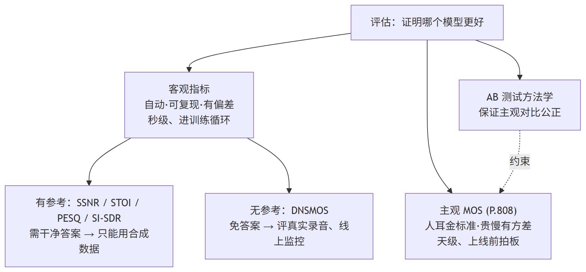
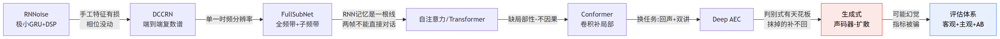

# 第 10 篇｜评估体系与面试冲刺：模型再多，最终都要回答"哪个更好"

> 一句话核心直觉：前面九篇造了一堆降噪/AEC/生成式模型，可"造出来"只是一半，另一半是**证明它更好**。评估分三层——**客观指标**能自动算、可复现，但和人耳有系统性偏差；**主观 MOS** 是人耳金标准，却贵、慢、有方差；**AB 测试方法学**决定你那场主观对比到底公不公正。面试的终极一问，就是让你把这三层和前面所有模型串成一条能讲清楚的主线。

---

## 一、先把教材那套扔一边

前面九篇，我们从 RNNoise 的极小 GRU 一路拆到扩散模型的反扩散。这一篇是收官——不再造新模型，而是回答那个从第一篇就悬在头顶的问题：**这么多模型，到底哪个更好？你凭什么说它更好？** 顺带把面试里怎么把这条主线讲圆，一次交代清楚。

翻开讲语音增强评估的资料，你多半会看到一张指标缩写表：STOI、PESQ、SI-SDR、SSNR、DNSMOS……每个甩一个公式、列一句"越高越好"。背下来能应付选择题，一到真实项目就抓瞎——因为它没告诉你三件要命的事：

- **这个指标要不要"干净参考"？** 直接决定它能不能用在真实录音上：合成数据你有干净语音，真实场景你只有一段带噪录音，压根没参考。
- **它和人耳差多远？** 有些指标能刷得很高，人一听却觉得"发闷、有金属味、字都听不清"。指标和听感的背离，是这行最大的坑。
- **主观对比怎么做才算数？** 随便找俩同事听一听"感觉 A 好点"——这种结论一文不值。没有盲测、没有随机化、没有响度对齐，你测的是偏见不是质量。

这一篇的骨架：先把**客观指标**逐个讲透，再钉死**有参考 vs 无参考**这条工程红线，然后是**主观 MOS**和重头戏**AB 测试方法学**，专门留一节讲**指标与听感的背离**，收尾是**面试冲刺**。

先记住一句贯穿全篇的话：

> **没有任何单一指标能替代人耳。** 客观指标是"便宜的代理"，让你在训练循环里每几百步就能算一次、快速筛掉明显更差的模型；但最终拍板"这版能不能上线"，一定要回到主观听测。**只信一个数，迟早翻车。**

先给一张评估体系的全景——三层从"快而糙"到"慢而准"，各管一段：



一句话读图：**客观指标快而糙、在训练循环里筛模型（还分"有参考只能评合成数据"和"无参考能评真实录音"两支）；主观 MOS 慢而准、上线前拍板；AB 方法学则是保证那场主观对比不掺偏见的规矩。三层配合，缺一不可。**

---

## 二、SSNR：为什么信噪比要"分段"算

先从最朴素的说起。降噪的直觉目标就是"把噪声压下去、语音留下来"，那最自然的度量就是**信噪比（SNR）**——信号能量比上误差能量，取对数变成分贝。

整段算一个全局 SNR 的公式长这样：

$$\text{SNR} = 10 \log_{10} \frac{\sum_n s^2[n]}{\sum_n (s[n] - \hat{s}[n])^2}$$

逐字翻译成人话：

- $s[n]$：**干净语音**在第 $n$ 个采样点的值（合成数据里我们知道它）。
- $\hat{s}[n]$：**增强后**（降噪输出）的信号。
- $s[n] - \hat{s}[n]$：两者之差，也就是**残留误差**——没压干净的噪声 + 被误伤的语音失真，都算在这里。
- 分子是信号总能量，分母是误差总能量，比值越大说明误差相对越小，取 $10\log_{10}$ 变成 dB。

问题来了：**整段算一个 SNR，会被能量大的段落主导。** 一句话里有元音（能量大）、有辅音和停顿（能量小到接近静音）。全局 SNR 的分子分母都是"整句求和"，结果几乎完全由那几个响亮的元音段决定——静音段和微弱辅音段哪怕被噪声淹了，也淹没在求和里看不出来。可人耳恰恰对"安静段落里突然冒出来的噪声"特别敏感。

**SSNR（Segmental SNR，分段信噪比）的修正就一句话：别整句求和，先把语音切成一帧帧（典型 15~30ms），逐帧算 SNR，再对所有帧取平均。**

$$\text{SSNR} = \frac{1}{M} \sum_{m=1}^{M} \text{clamp}\Big( 10 \log_{10} \frac{\sum_{n \in \text{frame } m} s^2[n]}{\sum_{n \in \text{frame } m}(s[n]-\hat{s}[n])^2},\; -10,\; 35 \Big)$$

逐字翻译成人话：

- $m$：第几帧，一共 $M$ 帧；$\text{frame } m$ 是第 $m$ 帧覆盖的那些采样点。
- 中间那一坨和全局 SNR 一模一样，只不过求和范围**缩到单帧内**——每帧算出自己的一个 dB 值。
- $\frac{1}{M}\sum$：把 $M$ 帧的 dB 值**直接平均**。这样静音段那一帧和元音那一帧在最终平均里**权重一样**，安静段里的噪声再也藏不住了。
- $\text{clamp}(\cdot, -10, 35)$：把每帧的值裁到 $[-10, 35]$ dB。**为什么要裁？** 纯静音帧里干净语音能量≈0，SNR 会趋向 $-\infty$；纯语音无噪帧误差≈0，SNR 会趋向 $+\infty$。这两种极端帧不裁掉，平均值会被拉爆。裁到一个合理区间，让指标稳定、可比。

> **第一个关键认知**：SSNR 相对全局 SNR 的唯一改进，就是**"逐帧算、再平均"这个动作本身**——它让每一帧（无论响还是静）平权参与，从而贴近人耳"对安静段落里的残留噪声更敏感"的特性。这是一个反复出现的思想：**评估指标越贴近人耳的时频分辨特性，就越有参考价值。** 后面 STOI、PESQ 都是这个思路走到极致的产物。

SSNR 的局限也很直白：它本质还是"逐样本对齐波形"，对**尺度、微小时移、相位**都敏感——增强信号只要整体响度和参考差一点，或者被延迟了一两个采样点，SSNR 就会莫名其妙掉一大截，哪怕人耳完全听不出区别。这也是为什么后来大家更爱用 SI-SDR（尺度不变，基础系列 08 篇讲过）和下面的 STOI/PESQ。

---

## 三、STOI：不问"像不像"，问"听得清多少字"

SSNR 度量的是"增强信号和干净信号有多接近"。但降噪的真正目的往往不是"还原得多像"，而是**"让人（或识别器）能听清多少字"**——这叫**可懂度（intelligibility）**，和"质量"是两回事。一段语音可以听着很干净（质量高）但含混不清（可懂度低），也可以嘶嘶作响（质量低）却字字能辨（可懂度高）。

**STOI（Short-Time Objective Intelligibility，短时客观可懂度）** 专门估计可懂度，输出一个 $0 \sim 1$ 的数，和"人能听懂百分之几的词"高度相关。它的设计直觉，藏在语音可懂度的一个核心事实里：

> **人听懂一段话，靠的不是每个瞬间的频谱长啥样，而是每个频带里能量"忽大忽小的起伏节奏"（时间包络的调制）。** 音节的抑扬顿挫、辅音的爆破、元音的绵延——这些"包络的形状"才是携带语义可懂度的关键。噪声和失真最伤可懂度的地方，正是**把这个包络的起伏抹平或搅乱**。

于是 STOI 的做法可以拆成三步，每步都对着这个直觉：

1. **切频带、取包络**：把干净和增强信号都做 STFT，把频率 bin 按人耳分辨率合并成约 15 个 **1/3 倍频程频带**，得到每个频带随时间起伏的**能量包络**。
2. **切短时段**：沿时间轴切成约 384ms 的短窗（覆盖一两个音节，这也是"short-time"的由来）。
3. **算相关系数**：在每个"频带 × 短时段"的小块上，算**干净包络**和**增强包络**的相关系数——包络起伏得越一致，相关越接近 1，说明可懂度信息保得越好；被噪声搅乱了，相关就掉下来。最后把所有小块的相关系数一平均，就是 STOI 分。

这里有个 STOI 最精妙、也最容易被漏讲的一步——**归一化 + 裁剪**。算相关之前，STOI 先把增强包络整体缩放到和干净同能量，再逐点**裁掉"超出干净上限太多"的部分**。为什么？相关系数对"整体缩放"不敏感，但对"某几帧被噪声异常抬高"很敏感——**不裁剪，一个残留大量噪声、某些帧能量爆表的增强信号，反而可能因为"起伏更剧烈"骗到虚高相关。** 裁掉超上限的部分，等于告诉指标"比干净语音更响的能量一定是噪声，不许拿它充可懂度"。这一刀让 STOI 对"过噪伪起伏"有了抵抗力，代码实战里我们会亲手验证它如何扭转结果。

STOI 也有变体 **ESTOI（extended STOI）**，在低信噪比、非平稳噪声下更准（考虑了频带间相关），工程里现在多用它，但直觉完全一样。

> **第二个关键认知**：STOI 度量的是**可懂度**（听清多少字），不是**质量**（听着舒不舒服）。它的核心是"比较干净和增强的短时频带包络相关性"。**做语音识别前端、助听器、通信可懂度时，STOI 比 SSNR/PESQ 更对口；但它不告诉你音色好不好听——那是 PESQ 和 MOS 的活。** 选指标前先想清楚：你要优化的是"能听懂"还是"好听"？

---

## 四、PESQ：把"人耳听感"塞进一个复杂感知模型

STOI 管可懂度，那"好不好听"这个**质量**维度谁来管？在电话/通信领域，事实标准是 **PESQ（Perceptual Evaluation of Speech Quality，感知语音质量评估）**，ITU-T P.862 标准。它输出一个约 $-0.5 \sim 4.5$ 的分，刻意对齐人打的 MOS 分（越高越好）。

PESQ 和前两个指标有本质区别：**SSNR/STOI 是几行公式就能写完的"简单代理"，PESQ 是一整套模拟人耳听觉的复杂感知模型。** 它内部大致干这么几件事（细节极多，这里只讲骨架，帮你建立直觉，不必手推）：

- **时间对齐**：先把增强信号和参考信号在时间上对齐（补偿延迟），否则后面全错。
- **感知变换**：把两个信号都变换到**听觉感知域**——不是普通的幅度谱，而是模拟人耳的**Bark 频率刻度 + 响度压缩（幂律）**，因为人对响度的感受是非线性的、对不同频率的敏感度也不同。
- **算感知差异**：在这个感知域里逐帧比较参考和增强的差异，还分别建模**正向失真**（该有的没了）和**负向失真**（多出来不该有的噪声/杂音），两者对听感的伤害权重不同。
- **聚合成一个分**：把逐帧的感知差异按一套经验规则聚合，映射成一个对齐 MOS 的分数。

你不需要记住这些细节，只需要记住 PESQ 的**定位和两个大坑**：

- **它是"有参考"指标**：必须有干净参考信号，且要先做时间对齐——所以只能用在合成/受控数据上。
- **窄带 vs 宽带版本不能混**：PESQ 有 **narrowband（8kHz，P.862）** 和 **wideband（16kHz，P.862.2）** 两个版本，分数**不在一个尺度上、不可直接比较**。你说"我的 PESQ 3.2"，不报采样率和窄/宽带，这个数就是没意义的。这是新人最常踩的坑。

> **第三个关键认知**：PESQ 度量的是**感知质量**（好不好听），是电话语音质量的金标准之一。它不是简单公式而是**模拟人耳的感知模型**，所以别手写、直接调库；用的时候**必须交代采样率和窄带/宽带版本**，否则分数没有可比性。另外 PESQ 是为"通信失真"（编解码、丢包）设计的，用在**生成式模型**输出上有时会失真——这个背离我们第八节专门说。

---

## 五、DNSMOS：神经网络学出来的"无参考"打分器

到这里三个指标（SSNR/STOI/PESQ）有一个共同的致命限制：**它们都要干净参考信号。** 这在工程上是个天大的麻烦——你只有在**合成数据**（干净语音 + 噪声人工混合）上才有参考。可你真正想知道的是模型在**真实录音**（用户在嘈杂地铁里录的那段）上表现如何，而真实录音**根本没有干净参考**。

微软在 DNS Challenge 里力推的 **DNSMOS** 就是来解这个死结的，思路简单粗暴又极其实用：

> **既然人能不看参考、只听一段音频就打出 MOS 分，那就训一个神经网络去模仿人。** 收集海量"音频 → 人打的 MOS 分"数据对，训一个回归网络：输入增强后的音频（不需要任何参考），输出估计的 MOS 分。

这就是**无参考（no-reference）** 指标——它把"评估"本身也变成了学出来的模型。DNSMOS 通常输出**三个分**：SIG（语音本身质量）、BAK（背景噪声干扰程度）、OVRL（综合），比单一分更能定位问题出在"伤了语音"还是"没压住噪声"。它在真实工程里的价值怎么强调都不过分：

- **无参考**：可以直接跑在真实用户录音、线上流量上，这是 SSNR/STOI/PESQ 永远做不到的。
- **可大规模自动评**：一秒钟评成千上万条，契合"每天从线上捞一批真实音频、自动出质量报告"的持续监控场景。
- **和人耳 MOS 相关性不错**：作为主观 MOS 的廉价代理，足够在迭代中用。

但正因为它是**学出来的**，它也带着学出来的东西的通病——**分布外就不可信**。DNSMOS 的训练数据主要是判别式降噪的输出。当你拿它去评一个**生成式模型**（声码器、扩散）的输出时，可能出现**"幻觉骗分"**：生成式模型能造出听着极干净、频谱极自然、但**内容已经偏离原始语音**的音频，DNSMOS 只看"这段听着像不像高质量语音"，看不出"内容被改了"，于是给出虚高的分。这个坑我们下一节展开。

> **第四个关键认知**：DNSMOS 是**无参考**的、用神经网络学出来的 MOS 估计器，它的杀手锏是能评**真实录音**、能大规模自动跑。但"学出来的指标"只在**训练分布内**可信——评生成式模型、评它没见过的失真类型时要格外警惕。**它是最贴近真实场景的客观指标，也是最容易被生成式模型骗过的指标。**

---

## 六、有参考 vs 无参考：一条决定"能不能落地"的红线

上面四个指标反复提到"要不要参考"，现在把这条线单独钉死，因为它直接决定一个指标能不能用在你的真实场景里。

**有参考（intrusive）指标**——SSNR、STOI、PESQ、SI-SDR——都需要成对的 $(\text{干净}, \text{增强})$ 信号。它们的逻辑是"拿增强结果和标准答案比对"。这意味着：

- **只能用在合成数据上**：你手里必须有干净语音，然后自己加噪、过模型，才有"参考 vs 增强"这一对。训练集、验证集这么造没问题。
- **训练循环里的常客**：因为合成数据天然有参考，这些指标可以在每个 epoch 的验证集上自动算，用来选 checkpoint、画曲线、判断有没有过拟合。

**无参考（non-intrusive）指标**——DNSMOS 是代表——只需要一段增强后的音频，不需要标准答案。这意味着：

- **能用在真实录音上**：用户在真实环境录的、你压根没有干净版本的音频，只有无参考指标能评。
- **能做线上监控**：模型上线后，从真实流量里持续采样、自动打分、发现质量回退——这套持续评估闭环，只有无参考指标撑得起来。

> **第五个关键认知**：**合成数据用有参考指标（准、可对齐真值），真实数据只能用无参考指标（唯一选择）。** 一个成熟的评估流水线一定是两者并用：在合成验证集上用 STOI/PESQ/SI-SDR 快速迭代选模型，在真实录音上用 DNSMOS 兜底、确认"合成集上的好"能不能迁移到真实世界。**只在合成集上刷指标，是新手最典型的自欺——合成噪声和真实噪声的分布差异，会让你精心调出的模型一到真实场景就露馅。**

---

## 七、主观 MOS：贵、慢、有方差，但它是金标准

绕了一圈客观指标，最终的裁判还是人耳。**MOS（Mean Opinion Score，平均意见分）** 就是让一群人听音频、每人打一个 $1 \sim 5$ 的分（1=极差、5=极好），再取平均。它是**绝对主观金标准**——所有客观指标存在的意义，都是为了逼近它。

现代 MOS 主要靠**众包**做，标准流程是 ITU-T **P.808**（专门为众包语音质量评测设计）。为什么要专门定标准？因为众包听音质量极难控制：

- **听音环境不可控**：有人用烂耳机、有人在嘈杂环境听、有人开着外放。P.808 规定了耳机检测、环境噪声检测、听力筛查等一整套准入。
- **打分者不认真**：混进去一些"陷阱样本"（比如已知极差的音频），谁给它打高分就剔除，保证数据质量。
- **打分基准漂移**：不同人对"3 分"的理解不一样，需要足够多的听音人 + 统计手段来消化这种个体差异。

MOS 的三宗罪，你必须心里有数：

- **贵**：要付钱给几十上百个众包听音人，评一轮成本不低。
- **慢**：从设计问卷、招募、听音到回收清洗，一轮下来以天计——**绝不可能塞进训练循环**。
- **有方差**：人是有方差的，同一段音频不同人打分能差 1 分以上。所以 MOS 一定要**报置信区间**，而不是光报一个平均值。两个模型 MOS 差 0.05、置信区间大幅重叠，那就是**没有显著差异**，别吹。

正因为 MOS 贵、慢，实际工作流几乎都是**"客观指标筛，主观 MOS 拍板"**：日常迭代靠 STOI/PESQ/DNSMOS 快速淘汰明显更差的版本，到了"决定这版能不能上线"的关键节点，才组织一轮正儿八经的 MOS。而这"一轮正儿八经"的对比怎么组织，就是下一节的 AB 测试方法学——**它决定你这轮 MOS 是真信号还是一堆偏见。**

---

## 八、AB 测试方法学：怎么组织一场公正的主观对比

这是本篇的重头戏。造模型是科学，比模型也是科学——**一场没有方法学的主观对比，测出来的是偏见，不是质量。** 我见过太多"我们听了觉得 A 更好"的结论，最后发现只是因为 A 的音量调大了一点。下面把一场公正对比该控住的变量逐条拆开。

**1. 为什么必须盲测（blind test）。** 只要听音人知道"这条是我们新模型、那条是老基线"，结果就废了——人会不自觉地偏向"新的""自己做的"。所以要**盲测**：听音人完全不知道每条音频出自哪个模型。更严的做法是 **ABX 测试**：给 A、B 两个已知参考和一个未知 X，让听音人判断 X 更接近 A 还是 B，用来检验"两者到底能不能听出区别"。

**2. 样本随机化与顺序平衡（counterbalancing）。** 人有**顺序效应**——先听到的那条容易被当基准，或者听到后面耳朵疲劳了打分下滑。所以每个听音人拿到的样本顺序要**随机**，且要保证"A 在前"和"B 在前"的次数大致相等（平衡），把顺序带来的系统偏差抵消掉。同一句话的 A/B 两个版本也别挨着放，避免直接对比引入的锚定效应。

**3. 响度对齐——最容易被忽略的混淆变量。** 这是坑死人的一条：**人耳普遍觉得"更响"就是"更好"。** 如果 A 模型输出的整体响度比 B 高 2dB，哪怕质量一样，听音人也会系统性偏向 A。所以对比前**必须把所有待测音频归一化到同一响度**（比如统一到相同的 LUFS 或 RMS）。不对齐响度的 AB 测试，测的一大半是响度不是质量。

**4. 听音人数量与统计显著性。** 一两个人的"感觉"没有统计意义。你需要**足够多的听音人 × 足够多的样本**，然后做统计检验（比如配对 t 检验或非参数检验），报出**置信区间**和 **p 值**。核心问题永远是：**"A 比 B 高的这 0.1 分，是真实差异，还是随机噪声？"** 样本量不够，你根本回答不了。

**5. 控制其他变量做公平对比。** 除了响度，还有一堆变量要钉死才叫"公平"：

- **同一批测试音频**：A 和 B 必须在**完全相同**的输入音频集上评测，不能 A 用简单样本、B 用难样本。
- **同样的处理条件**：采样率、量化、有没有经过后处理（比如 AGC）都要一致。
- **覆盖多样场景**：测试集要覆盖平稳/非平稳噪声、不同信噪比、有无混响、单讲/双讲（AEC 场景），别只在"办公室白噪声"这一种场景下比，那样的结论没有泛化性。

> **第六个关键认知**：一场可信的 AB 测试 = **盲测 + 随机化/顺序平衡 + 响度对齐 + 足够样本量 + 统计显著性 + 相同测试条件**。这六条缺任何一条，你的对比结论就有被"偏见/混淆变量"污染的风险。**响度对齐**是新人最常漏、后果最严重的一条。记住：**你不是在比模型，你是在比"控制了所有其他变量之后，只剩模型差异"的那个结果。**

---

## 九、指标与听感的背离：别只信一个数

这一节是整篇最重要的工程认知。**每一个客观指标都是一个"代理"，代理就有被钻空子的时候。** 一个成熟的语音算法工程师，脑子里必须装着这几个经典背离案例：

**1. SI-SNR/SI-SDR 高，但听感差。** SI-SNR 度量的是波形层面的能量对齐（基础系列 08 篇），它对**残留的低能量噪声**惩罚不够，对**人耳敏感但能量很小的失真**（比如高频的金属味、"咕噜"声）也不敏感。于是会出现 SI-SNR 刷得很高、人一听却觉得"有电流声/机器味"的情况。反过来，SI-SNR 对时移和尺度敏感，有时听感明明没差，分数却掉了。**训练用 SI-SNR 当损失没问题（它可导、好优化），但拿它当最终验收标准就危险。**

**2. 过度抑制：指标好，语音失真。** 这是判别式降噪最常见的病。为了把噪声压得干干净净，模型学会了"宁可错杀也不放过"——连语音本身的能量也一起压掉了。结果是：**背景安静了（某些指标看着漂亮），但语音变得发闷、不自然、辅音被吃掉、听感"被掐脖子"。** 尤其当你只盯着"噪声抑制量"这类单一指标优化时，模型会径直奔向"全压掉最省事"的极端。这就是为什么 DNSMOS 要拆出 SIG（语音质量）和 BAK（背景）两个分——单看综合分，你分不清模型是"干净"还是"把语音也一起抹了"。

**3. 生成式模型"幻觉"骗过无参考指标。** 这是最隐蔽、也最前沿的坑，直接呼应第八、九篇。生成式模型（声码器、扩散）不是"压噪声"，而是"重新生成一段干净语音"。它能生成出**听着极自然、频谱极干净、DNSMOS 打分极高**的音频——但生成的内容可能**已经偏离了原始说话人真正说的内容**：吞了个字、改了个音、换了点音色。无参考指标只问"这段像不像高质量语音"，根本看不出"内容被篡改了"，于是给出虚高分。**对生成式模型，光看无参考指标是危险的，必须补上有参考的可懂度指标（STOI/词错误率）和主观听测，确认内容保真。**

**4. 有参考指标在生成式输出上失真。** 反过来也成立：PESQ/SI-SDR 这类为"判别式失真/通信失真"设计的指标，用在生成式输出上会**低估**——因为生成式输出和参考在波形/相位上对不齐（它是重新生成的，不是逐点还原的），逐点对齐类指标会狠狠扣分，哪怕人听着更好。**判别式模型和生成式模型不能用同一套指标横向比**，这是个非常容易犯的错。

> **第七个关键认知**：**指标是代理，代理会被钻空子。** SI-SNR 高 ≠ 好听，噪声压得干净 ≠ 语音没受伤，DNSMOS 高 ≠ 内容没被篡改。**任何时候都要用一组互补的指标（可懂度 + 质量 + 有参考 + 无参考），并且以主观听测为最终仲裁。** "别只信一个数"——这句话你在面试里说出来，面试官会知道你真在一线趟过坑。

---

## 十、代码实战：亲手实现 SSNR 和简化版 STOI

光说不练不算数。我们用 PyTorch/NumPy 把 **SSNR** 和 **简化版 STOI** 的核心计算跑出来，在一对 $(\text{干净}, \text{增强})$ 信号上算出数值、打印 shape，并验证"更干净的增强 → 更高的分"。PESQ/DNSMOS 因为是复杂模型/学出来的网络，工程里一律**调现成库**，本节末尾给调用示意，不手写。

先造一对信号。**注意：不能用纯正弦，那样时间包络是平的，STOI 无从谈起。** 我们造一段"类语音"——多次谐波（模拟浊音的谐波结构）叠加一个 4Hz 的音节起伏包络（模拟说话的抑扬顿挫）：

```python
import torch
import numpy as np

torch.manual_seed(0)
np.random.seed(0)

sr = 16000
t = torch.arange(0, sr) / sr          # 1 秒
# 造一段"类语音": 谐波(基音220Hz及倍频) x 音节调制包络(4Hz忽大忽小)
harmonics = sum(torch.sin(2 * np.pi * 220 * k * t) / k for k in range(1, 6))
envelope  = 0.5 * (1 + torch.sin(2 * np.pi * 4 * t))   # 4Hz 音节起伏
clean     = harmonics * envelope
noise     = 1.5 * torch.randn(sr)
noisy     = clean + noise                  # 带噪(没降噪)
enhanced  = clean + 0.15 * torch.randn(sr) # "增强": 假装降噪只残留少量噪声

print("clean shape   :", clean.shape)      # torch.Size([16000])
print("enhanced shape:", enhanced.shape)   # torch.Size([16000])
```

**第一步：SSNR。** 核心动作就一个——用 `unfold` 把一维波形切成一帧帧，逐帧算 SNR，裁剪后取平均：

```python
def ssnr(clean, enhanced, frame=256, hop=128, floor=-10.0, ceil=35.0):
    # 分帧: unfold 把 [T] 切成 [n_frame, frame]
    cf = clean.unfold(0, frame, hop)      # [n_frame, frame]  干净分帧
    ef = enhanced.unfold(0, frame, hop)   # [n_frame, frame]  增强分帧
    err = cf - ef                         # 每帧残差(误差) [n_frame, frame]
    sig_pow = (cf ** 2).sum(dim=1)        # 每帧信号能量 [n_frame]
    err_pow = (err ** 2).sum(dim=1)       # 每帧误差能量 [n_frame]
    eps = 1e-10
    snr_per_frame = 10 * torch.log10((sig_pow + eps) / (err_pow + eps))  # [n_frame]
    snr_per_frame = snr_per_frame.clamp(floor, ceil)   # 裁掉静音/无噪极端帧
    return snr_per_frame.mean(), cf.shape[0]

val_good, nframe = ssnr(clean, enhanced)
val_bad,  _      = ssnr(clean, noisy)     # 对比: 没降噪的带噪信号
print("SSNR 帧数      :", nframe)          # 124
print("SSNR-增强 (dB) :", round(val_good.item(), 3))  # 5.841
print("SSNR-带噪 (dB) :", round(val_bad.item(), 3))   # -8.424
```

跑出来：

```
SSNR 帧数      : 124
SSNR-增强 (dB) : 5.841
SSNR-带噪 (dB) : -8.424
```

结果符合预期：**残留噪声少的"增强"信号 SSNR 高（5.84 dB），没降噪的带噪信号 SSNR 低（-8.42 dB）**，而且分帧后每帧平权，静音段的噪声也计入了。注意 shape 之旅：`[16000]` 波形 → `unfold` → `[124, 256]` 分帧 → 逐帧求和 → `[124]` 每帧 SNR → 平均成一个标量。

**第二步：简化版 STOI。** 我们实现它的灵魂三步——切频带取包络、切短时段、归一化裁剪后算相关。**归一化+裁剪那一步是重点，下面会专门验证它的作用：**

```python
def stft_mag(x, n_fft=256, hop=128):
    w = torch.hann_window(n_fft)
    S = torch.stft(x, n_fft=n_fft, hop_length=hop, window=w, return_complex=True)
    return S.abs()   # [F, T]  幅度谱

def simple_stoi(clean, enhanced, n_band=15, seg=30, beta=15.0):
    Xc = stft_mag(clean)       # [F, T]
    Xe = stft_mag(enhanced)    # [F, T]
    F, T = Xc.shape
    # (1) 把 F 个 bin 合并成 n_band 个频带能量(近似 STOI 的 1/3 倍频程频带)
    edges = torch.linspace(0, F, n_band + 1).long()
    def to_bands(X):
        return torch.stack([X[edges[b]:edges[b+1]].pow(2).sum(0).sqrt()
                            for b in range(n_band)])   # [n_band, T]
    Bc, Be = to_bands(Xc), to_bands(Xe)
    c = 10 ** (-beta / 20)     # 归一化+裁剪的上限系数
    corrs = []
    # (2) 沿时间切短时段(seg 帧 ~ 384ms), 步长半窗
    for start in range(0, T - seg + 1, seg // 2):
        for b in range(n_band):                 # (3) 逐频带算包络相关
            a = Bc[b, start:start + seg]         # 干净包络
            e = Be[b, start:start + seg]         # 增强包络
            # STOI 关键步: 先把增强包络缩放到与干净同能量, 再逐点裁掉超上限的部分
            # 使"被噪声抬高的能量"不能超过干净上限 -> 噪声无法靠"更响"骗高相关
            e = e * (a.norm() / e.norm().clamp(min=1e-8))
            e = torch.min(e, a * (1 + c))
            va = a - a.mean()
            ve = e - e.mean()
            denom = (va.norm() * ve.norm()).clamp(min=1e-8)
            corrs.append((va @ ve) / denom)      # 相关系数
    return torch.stack(corrs).mean(), Xc.shape

val_good, sh = simple_stoi(clean, enhanced)
val_bad,  _  = simple_stoi(clean, noisy)
print("STFT 幅度 shape :", tuple(sh))                    # (129, 126)
print("简化STOI-增强   :", round(val_good.item(), 4))    # 0.8955
print("简化STOI-带噪   :", round(val_bad.item(), 4))     # 0.8854
```

跑出来：

```
STFT 幅度 shape : (129, 126)
简化STOI-增强   : 0.8955
简化STOI-带噪   : 0.8854
```

两个观察。第一，**ordering 正确**：残噪少的增强信号 STOI 更高（0.8955 > 0.8854）。第二，**STOI 值挤在很窄的高区间**（真实 STOI 也这样——它把可懂度压缩到接近 1 的区间，靠小数点后的差异区分），所以拿 STOI 比模型时，**0.01 的差异也可能是有意义的**，这更凸显了前面讲的"必须做统计显著性检验"。

关于那步归一化+裁剪的作用，你可以自己做个实验：把 `e = torch.min(e, a * (1 + c))` 这行注释掉，再跑一次会发现——**在高噪声下带噪信号的 STOI 反而可能反超增强信号**，因为噪声把某些帧的包络抬得起伏更剧烈、骗到了虚高相关。加上裁剪这一刀，指标才对"过噪伪起伏"有了抵抗力。这正是第三节强调那步"精妙操作"的实证。

**PESQ / DNSMOS 不手写，调库即可**（下面是调用示意，运行需先 `pip install` 对应库和模型）：

```python
# PESQ: 有参考, 必须交代采样率和窄/宽带版本
from pesq import pesq
score_wb = pesq(16000, clean.numpy(), enhanced.numpy(), 'wb')  # 宽带 16k
score_nb = pesq( 8000, clean_8k,      enhanced_8k,      'nb')  # 窄带 8k
# 注意: wb 和 nb 分数不在同一尺度, 不可直接比较

# DNSMOS: 无参考, 只喂增强信号(真实录音也能评)
# 微软官方提供 ONNX 模型, 输入 16k 音频, 输出 SIG/BAK/OVRL 三个分
from dnsmos import DNSMOS          # 示意: 实际按所用实现的 API 为准
scorer = DNSMOS(model_path="dnsmos.onnx")
sig, bak, ovrl = scorer(enhanced.numpy(), sr=16000)
# sig=语音质量, bak=背景噪声干扰, ovrl=综合; 无需任何参考信号
```

> **代码小结**：SSNR 的灵魂是"分帧 + 裁剪 + 平均"，几行 `unfold` 就能写；STOI 的灵魂是"频带包络的相关性 + 归一化裁剪防过噪骗分"。这两个能手写、且看得懂每一步为什么这么设计。PESQ/DNSMOS 是复杂/学出来的模型，工程里直接调库——但你得知道它们在**算什么、要不要参考、有什么坑**，这才是评估这门功课的真正内容。

---

## 十一、这在工程里解决什么问题

把五个指标放一张表里横向对比，这张表值得你贴在工位上：

| 指标 | 有无参考 | 算什么 | 范围（越高越好） | 主要局限 | 适用场景 |
|---|---|---|---|---|---|
| **SSNR** | 有参考 | 分段信噪比：逐帧 SNR 再平均 | 约 -10~35 dB | 逐样本对齐，对尺度/时移/相位敏感；不贴感知 | 合成数据快速 sanity check、经典基线 |
| **STOI/ESTOI** | 有参考 | 可懂度：短时频带包络相关性 | 0~1 | 只管"听清多少字"，不管音色好不好听 | ASR 前端、助听器、通信可懂度 |
| **PESQ** | 有参考 | 感知质量：模拟人耳的复杂感知模型 | 约 -0.5~4.5 | 窄/宽带不可混比；为通信失真设计，评生成式会失真 | 电话/通信语音质量金标准之一 |
| **SI-SDR/SI-SNR** | 有参考 | 尺度不变的信号失真比 | dB（可为负） | 高分≠好听；判别式/生成式不可同表比 | 训练损失、判别式模型客观评测 |
| **DNSMOS** | **无参考** | 神经网络估计的 MOS（SIG/BAK/OVRL） | ~1~5 | 只在训练分布内可信；易被生成式幻觉骗分 | 真实录音评测、大规模线上监控 |
| **主观 MOS (P.808)** | 无参考 | 人耳 1~5 打分取平均 | 1~5 | 贵、慢、有方差，必须报置信区间 | 上线前最终仲裁、金标准 |

落到真实工作流，这套评估体系解决三个层次的问题：

- **训练循环里（秒级、每步）**：用可导的 SI-SNR 当损失下山；用 STOI/PESQ/SI-SDR 在合成验证集上选 checkpoint、画曲线、判断收敛与过拟合。
- **迭代决策里（分钟级、每版）**：用 DNSMOS 在真实录音上批量评，确认"合成集上的好"能迁移到真实世界；发现指标背离时用互补指标交叉验证。
- **上线前后（天级、关键节点 + 持续）**：组织符合 AB 方法学的主观 MOS 拍板能不能上线；上线后用无参考指标做线上质量持续监控，抓质量回退。

一句话总结评估的工程定位：**指标不是用来"证明自己牛"的分数，而是用来"在有限的人力/算力预算下，尽可能快、尽可能可信地做出模型取舍决策"的工具。** 谁能在"快（客观指标）"和"准（主观听测）"之间搭出一条高效流水线，谁就真正掌握了这行的工程内核。

---

## 十二、面试冲刺：把十篇串成一条能讲的主线

面试语音算法岗，最高频的开放题就是"讲讲你对语音增强模型的理解"。这题考的不是背了多少模型，而是**能不能把它们串成一条有因果、有演进逻辑的主线**。下面这条线，你要能张口就来：

> **判别式起步（RNNoise → DCCRN → FullSubNet）→ 注意力革命（自注意力 → Transformer → Conformer）→ 换任务（AEC）→ 换范式（生成式：声码器 → 扩散）→ 怎么证明谁好（评估 + 方法学）。**

这条主线画成图，每一跳"被上一个的什么痛点逼出来"看得最清楚：



读图：**每条箭头上的字，就是"上一个模型的痛点如何逼出下一个"——面试讲这条线，讲的不是模型清单，而是这一串因果。**

把每一跳的"为什么"讲清楚，这条主线就活了：

- **RNNoise**：不硬学降噪，极小 GRU 只学逐频带增益，DSP 扛重活——端侧实时的起点。痛点：手工特征有损、相位没动。
- **DCCRN**：让网络端到端啃**复数谱**，复数 LSTM + 复数比值掩码，幅度相位一起学，用 SI-SNR 训。痛点：单一时频分辨率难同时治平稳/非平稳噪声。
- **FullSubNet**：全频带看整体 + 子频带看局部，两条流融合。痛点：RNN 的记忆仍是"一根线"，任意两帧不能直接对话。
- **自注意力/Transformer**：每帧主动查询其他帧，Q/K/V。痛点：纯注意力缺**局部性**、对长混响和局部细节吃力，且全序列注意力**不因果**。
- **Conformer**：卷积补局部 + 注意力补全局，相对位置编码解决变长。
- **Deep AEC**：换任务——把**远端参考信号**一起喂网络，核心难点是**双讲**。
- **生成式（声码器/扩散）**：换范式——判别式有天花板（抹掉的细节补不回），转而**生成**干净语音。WaveNet 自回归、CMGAN 对抗、扩散逐步反扩散。痛点：可能**幻觉**、评估被无参考指标骗。
- **评估**：客观（SSNR/STOI/PESQ/SI-SDR/DNSMOS）+ 主观（MOS/P.808）+ AB 方法学，回答"哪个更好"。

**几个高频问法 + 回答要点：**

- **Q：降噪为什么用 SI-SNR 当损失，不用 MSE？**
  A：MSE 在幅度谱或波形上逐点算，对**整体缩放**敏感（响度差一点 loss 就大），且它把每个 bin 平权、不贴感知。SI-SNR 先把估计投影到目标方向、做**尺度不变**处理，再算目标能量比残差能量——它直接优化"信号相对失真"，和听感更对齐、对增益缩放鲁棒。（呼应基础系列 08、本篇第九节 SI-SNR 的背离）

- **Q：实时降噪为什么不能用双向 RNN 或全序列注意力？**
  A：因果性红线——实时系统**不能看未来帧**。双向 RNN 要用到整句的未来信息，全序列自注意力每帧都要 attend 到后面所有帧，都会引入等于"未来长度"的延迟，实时场景不可接受。要用只能用**单向 RNN / 因果卷积 / 带掩码的因果注意力（只看过去）**，代价是牺牲一部分性能换低延迟。

- **Q：判别式和生成式怎么选？**
  A：判别式（DCCRN/FullSubNet）**稳、可控、内容保真**，但有天花板——被噪声彻底淹没的细节它补不回来，容易过度抑制导致语音发闷。生成式（扩散/声码器）能**补回细节、听感自然**，但训练/推理更重、可能**幻觉**改变内容。选择看场景：强调**内容保真+低算力+实时**选判别式；强调**极致听感+可离线**且能接受幻觉风险，考虑生成式。评估上两者不能用同一套指标横向比。

- **Q：客观指标好但听感差怎么办？**
  A：这正说明**指标是代理、会被钻空子**（第九节）。SI-SNR 高≠好听、噪声压得干净≠语音没受伤、DNSMOS 高≠内容没被篡改。做法：用一组**互补指标**（可懂度 STOI + 质量 PESQ + 无参考 DNSMOS）交叉验证，拆分 SIG/BAK 看是"伤语音"还是"没压噪"，最终以**符合 AB 方法学的主观 MOS** 为准。别只信一个数。

- **Q：只有真实录音、没有干净参考，怎么评？**
  A：有参考指标（STOI/PESQ/SSNR）全用不了，只能用**无参考指标（DNSMOS）** + 小规模**主观 MOS**。这也是为什么真实工程必须两条腿走路：合成集用有参考指标快速迭代，真实集用无参考指标兜底防"合成集刷分、真实场景露馅"。

- **Q：怎么组织一场公平的模型 AB 对比？**
  A：盲测（听音人不知道出自哪个模型）+ 样本随机化与顺序平衡 + **响度对齐**（最容易漏，人耳觉得响就是好）+ 足够听音人和样本量 + 统计显著性检验（报置信区间/p 值）+ 完全相同的测试条件和覆盖多样场景。

> **面试关键认知**：面试官要听的不是你背了几个模型名，而是**每一跳演进背后"上一个模型的什么痛点逼出了下一个"**，以及**你有没有一线的工程判断**（因果性红线、指标背离、响度对齐这种坑）。能把这条主线连着痛点讲一遍，再补一两个"我踩过的坑"，基本就稳了。

---

## 十三、收束全系列：从零件到落地闭环

到这里，"基于深度学习的语音前端处理 (DL 3A) 前沿解析"十篇走完了。回头看，这不是十个孤立的模型，而是**一条完整的演进链 + 一套能落地的方法论**：

我们从 README 的全景地图出发，把 DL 3A 拆成"基础系列零件的重新组合"；第一个真实模型 **RNNoise** 教会我们"网络只做最该做的那点决策，DSP 扛重活"；**DCCRN** 让网络端到端啃复数谱、幅度相位一起学；**FullSubNet** 用多分辨率融合治非平稳噪声；**自注意力/Transformer/Conformer** 三篇把"任意两帧直接对话 + 卷积补局部"的注意力革命讲透；**Deep AEC** 换到回声消除任务、直面双讲；**声码器与扩散**两篇把范式从"判别式压噪"翻到"生成式重建"；最后这一篇，用**评估体系 + AB 方法学 + 面试主线**回答了贯穿全程的那个问题——**哪个更好，你凭什么说。**

而这一切，最终都要落到一个**真实项目的闭环**里，这也是你把这十篇知识变现的方式：

1. **选模型**：按场景（算力/实时/保真/听感）在判别式和生成式之间取舍——端侧 MCU 就 RNNoise 系，云端离线追听感就上生成式。
2. **定指标**：想清楚要优化"可懂度"还是"质量"，选好有参考（合成集用）+ 无参考（真实集用）的组合，别只盯一个数。
3. **合成/采集数据**：合成数据（干净语音 + 噪声库 + 混响 + 各种信噪比）撑起训练和有参考评测；真实录音撑起无参考评测和线上监控。
4. **训练**：可导损失（SI-SNR/复数掩码损失）下山，守住因果性红线和端侧算力预算。
5. **客观 + 主观评估**：客观指标快速迭代选模型，符合 AB 方法学的主观 MOS 拍板上线。
6. **端侧部署**：把模型烘焙成定点/量化、状态缓存的流式推理，塞进真实固件——这最后一公里，恰是驱动工程师转型者的主场。

十篇讲的是模型，练的是**"看得懂、能落地、能在面试里讲清楚"** 这三件套。现在，去把它用到你手里那个真实的语音项目上吧。

---

## 本篇小结

- **评估分三层**：客观指标（自动、可复现、有偏差）→ 主观 MOS（人耳金标准、贵慢有方差）→ AB 方法学（保证主观对比公正）。三层配合，缺一不可。
- **客观指标**：SSNR（分段信噪比，逐帧算再平均、贴人耳对安静段的敏感）、STOI（可懂度，短时频带包络相关 + 归一化裁剪）、PESQ（感知质量，模拟人耳的复杂模型，窄/宽带不可混比）、SI-SDR（尺度不变信号失真比）。
- **DNSMOS**：无参考、神经网络学出来的 MOS 估计器，能评真实录音、可大规模自动跑；但只在训练分布内可信、易被生成式幻觉骗分。
- **有参考 vs 无参考**：有参考只能用于合成数据、是训练循环常客；无参考能评真实录音、撑起线上监控。成熟流水线两者并用。
- **主观 MOS**：ITU-T P.808 众包流程，1~5 打分；贵、慢、有方差，必须报置信区间。
- **AB 测试方法学**：盲测 + 随机化/顺序平衡 + **响度对齐** + 足够样本量 + 统计显著性 + 相同测试条件；响度对齐最容易漏、后果最严重。
- **指标与听感背离**：SI-SNR 高≠好听、过度抑制指标好但语音失真、生成式幻觉骗过无参考指标、有参考指标在生成式输出上失真。**别只信一个数**，用互补指标 + 主观仲裁。
- **代码**：手写 SSNR（分帧+裁剪+平均）和简化版 STOI（频带包络相关+归一化裁剪），验证"更干净→更高分"；PESQ/DNSMOS 调库。
- **面试主线**：判别式 → 注意力 → AEC → 生成式 → 评估，每一跳讲清"上一个的什么痛点逼出下一个"，再补一线工程判断（因果性、指标背离、响度对齐）。
- **落地闭环**：选模型 → 定指标 → 合成/采集数据 → 训练 → 客观+主观评估 → 端侧部署。这是全系列知识变现的路径，也是收官。


