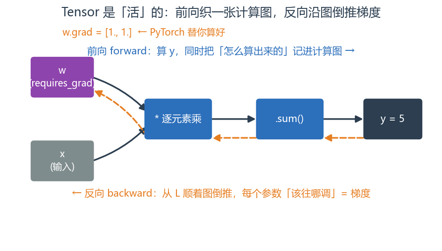
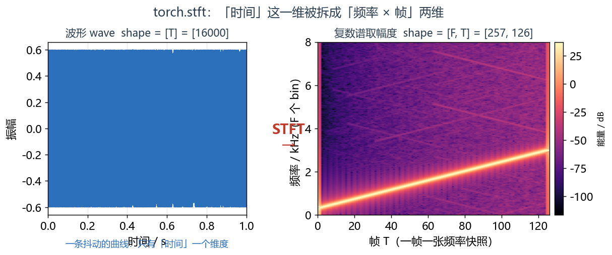
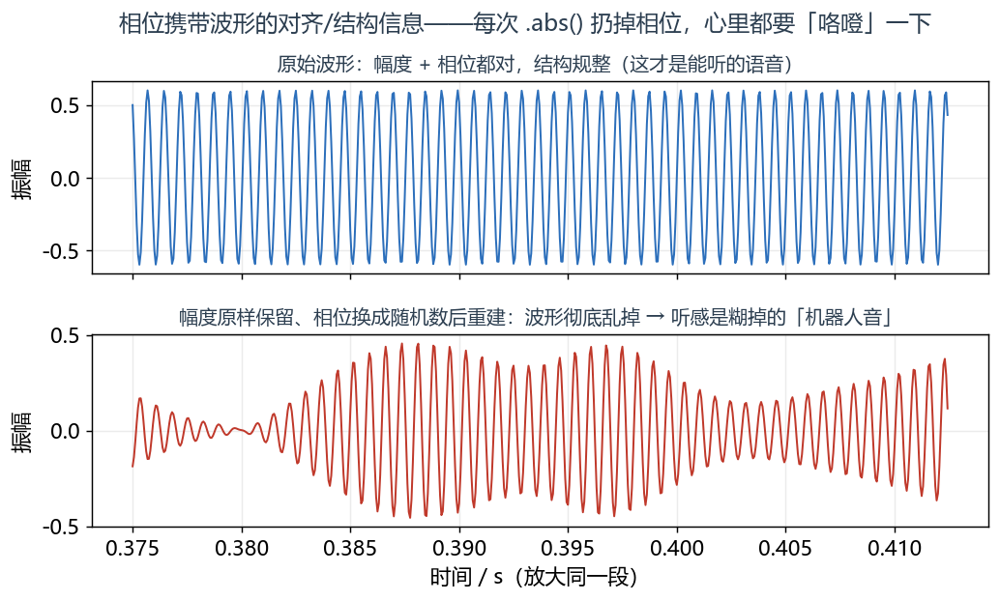
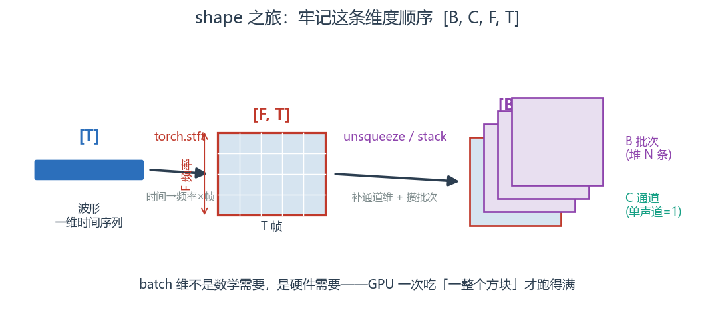
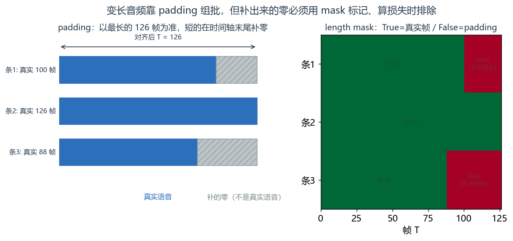

# 第 1 篇｜从 STFT 到 Tensor：把语谱图喂进网络前的第一步

> 一句话核心直觉：你在信号与系统里画出的那张彩色语谱图，本质是一个二维数组；想喂进神经网络，只要给它换个"身份证"——从 `np.ndarray` 变成带 device、dtype、autograd 和 batch 维的 `torch.Tensor`，声音就正式进入了深度学习的世界。

---

## 一、先把教材那套扔一边

翻开任何一本 PyTorch 入门书，第一章讲张量，扑面而来的就是：

```python
torch.tensor([[1, 2], [3, 4]])   # 一个 2x2 的张量
```

然后开始教你 `reshape`、`transpose`、广播规则……全是抽象的数字方块。你会算，但心里没底：**这些方块跟我要做的语音降噪、回声消除，到底有半毛钱关系吗？**

有。而且关系近得超乎你想象。

还记得信号与系统系列第 13 篇结尾那张图吗——我们把一段人声用 STFT 切片、逐帧加窗做 FFT，横着拼成一张彩色语谱图：横轴时间、纵轴频率、颜色深浅是能量。当时我们说，"现代语音算法的第一步，几乎都是先把波形变成这张二维图像，再在图上做文章"。

现在，"在图上做文章"的那个"文章"，就是神经网络。而神经网络吃东西是挑食的：它不认 `np.ndarray`，只认 `torch.Tensor`。

所以这一篇要干的事非常朴素：**把你已经会画的那张语谱图，一步步变成网络能吃的张量。** 你会发现，所谓"张量"，剥开花哨的名字，就是**一个带 shape 的多维 `float32` 数组**——正是你天天打交道的那个东西，只是多穿了几件深度学习专用的"外衣"。

---

## 二、`np.ndarray` → `torch.Tensor`：到底多穿了哪几件外衣

先做个最朴素的对比。你在 signals 系列里算语谱图，得到的是一个 NumPy 数组；换成 PyTorch，几乎一模一样：

```python
import numpy as np
import torch

# 假装这是你算出来的一张语谱图幅度：257 个频率 bin、100 帧
S_np = np.random.rand(257, 100).astype(np.float32)   # NumPy 数组
S_t  = torch.from_numpy(S_np)                         # 零拷贝变成张量

print(type(S_np), S_np.shape, S_np.dtype)   # <class 'numpy.ndarray'> (257, 100) float32
print(type(S_t),  S_t.shape,  S_t.dtype)     # <class 'torch.Tensor'> torch.Size([257, 100]) torch.float32
```

看，数据没变、shape 没变、dtype 也没变——`torch.from_numpy` 甚至和 NumPy **共享同一块内存**（改一个另一个也变）。那 PyTorch 到底多给了什么？多的是下面这四件"外衣"，每一件都对训练至关重要：

| 外衣 | NumPy 有吗 | 张量多的这件东西干嘛用 |
|---|---|---|
| **device** | 无（只在 CPU） | 张量可以搬到 GPU 上，`.to("cuda")`，几百倍加速的前提 |
| **dtype** | 有，但随意 | 深度学习强约束：训练默认 `float32`，混合精度会用到 `float16`（第 3 篇） |
| **autograd** | 无 | 张量能记住"自己是怎么被算出来的"，从而自动求梯度——这是"学习"的命根子 |
| **batch 维** | 靠约定 | 张量的第 0 维通常约定为 batch，GPU 一次并行吃一整批（下文详述） |

其中 **autograd** 最玄，也最关键。看一眼它长什么样：

```python
w = torch.tensor([2.0, 3.0], requires_grad=True)  # 声明:这是要学习的参数,给我盯着它
x = torch.tensor([1.0, 1.0])
y = (w * x).sum()        # y = 2*1 + 3*1 = 5
y.backward()             # 反向:自动算 y 对 w 的梯度
print(w.grad)            # tensor([1., 1.])  ← dy/dw,PyTorch 替你算好了
```

> **第一个关键认知**：`np.ndarray` 是"死"的数据，算完就算完了；`torch.Tensor` 是"活"的——只要挂上 `requires_grad=True`，它会**默默记录自己参与的每一次运算**，织成一张计算图。等你调 `.backward()`，它就能顺着这张图倒推出每个参数"该往哪调"。**这就是网络能"学"的物理基础。** 至于反传具体怎么倒推，是第 4 篇的主角，这里先知道张量身上藏着这个能力即可。



*前向（蓝）算出 `y` 的同时，把"怎么算出来的"记进计算图；反向（橙）从 `L` 顺着图倒推，得到每个参数的梯度——`np.ndarray` 没有这条橙色链路，这正是它学不了的原因。*

设备搬运也顺带说一句，后面每篇都会用到：

```python
device = "cuda" if torch.cuda.is_available() else "cpu"
S_t = S_t.to(device)          # 一句话搬上 GPU(或回退 CPU)
print(S_t.device)             # cuda:0 或 cpu
```

---

## 三、用 `torch.stft` 亲手把波形变成张量

signals 第 13 篇我们手写过 STFT（切帧、加窗、`np.fft.rfft`、拼列）。PyTorch 直接内置了 `torch.stft`，原理一字不差，但它返回的是**张量**，而且默认是**复数张量**——这正是我们要的。

先合成一段测试音频（一段频率上升的啁啾，模拟一句滑调语音），然后走一遍 STFT：

```python
import torch

fs = 16000                                   # 采样率 16 kHz
dur = 1.0
t = torch.arange(int(fs * dur)) / fs         # 时间轴
# 一段 300→3000 Hz 线性扫频的 chirp,当作"一句滑调的人声"
f0, f1 = 300.0, 3000.0
phase = 2 * torch.pi * (f0 * t + (f1 - f0) / (2 * dur) * t ** 2)
wave = 0.6 * torch.sin(phase)                # 这就是波形
print("波形 shape:", wave.shape)              # torch.Size([16000])  → [T],一维时间序列

# ---------- 做 STFT ----------
n_fft = 512                                  # FFT 点数(帧长),2 的幂最快
hop   = 128                                  # 帧移 = 帧长的 1/4,帧间重叠 75%
win   = torch.hann_window(n_fft)             # 汉宁窗,压泄漏(signals 12 篇讲过)

spec = torch.stft(wave, n_fft=n_fft, hop_length=hop,
                  window=win, return_complex=True)   # 关键:返回复数张量
print("复数谱 shape:", spec.shape, spec.dtype)
# torch.Size([257, 126]) torch.complex64  → [F, T]
```

停下来读一眼这个 shape，它是本篇的核心：

- **`257` = F（频率 bin 数）**。为什么不是 512？因为实数信号的频谱共轭对称，`rfft` 只保留一半 + 1，即 `n_fft/2 + 1 = 257`。这和 signals 里 `np.fft.rfft` 完全一致。
- **`126` = T（帧数）**。有多少帧，取决于音频多长、帧移多大：约 `信号长度 / hop`。这就是"连拍了 126 张频率快照"。
- **`complex64`**：每个元素是一个复数（实部 + 虚部各 32 位），因为 FFT 的输出天生是复数——它同时编码了**幅度**和**相位**。

> **第二个关键认知**：一维波形 `[T]` 经过 STFT，变成了二维复数谱 `[F, T]`。**"时间"这一个维度，被拆成了"频率 × 帧"两个维度。** 这一步是所有频域语音网络的入口：从此以后，网络看到的不再是一条抖动的曲线，而是一张有结构的"时频图像"。



*左边是那段 300→3000 Hz 扫频 chirp 的波形（`[T]`，只有时间一维）；`torch.stft` 之后变成右边的语谱图（`[F, T]`）。扫频那条从低到高的亮带清晰可见——这就是"时间"被摊开成"频率 × 帧"后，网络能看到的结构。*

---

## 四、复数张量：幅度与相位，这次相位先别扔

`torch.stft` 给的是复数张量。复数不好直接喂进大多数常规网络（它们是为实数设计的），所以我们通常把它拆开。有两种拆法，都要会：

```python
# 拆法一:实部 / 虚部(view_as_real,零成本换个视角)
spec_ri = torch.view_as_real(spec)     # [F, T] complex → [F, T, 2] real
print("实虚拆开:", spec_ri.shape, spec_ri.dtype)  # [257, 126, 2] float32
# 最后那个维度 2 = (实部, 虚部)

# 拆法二:幅度 / 相位(极坐标,更贴近语谱图)
mag   = spec.abs()      # 幅度 |X| —— 这就是你画语谱图看到的能量
phase = spec.angle()    # 相位 ∠X —— 每个时频点的"相位角"
print("幅度 shape:", mag.shape,   "  相位 shape:", phase.shape)
# 幅度 [257, 126] float32   相位 [257, 126] float32
```

幅度 `mag` 就是你在 signals 第 13 篇画成彩图的那个东西（取个 `20*log10` 就是 dB 语谱图）。绝大多数入门降噪模型，确实就只拿幅度谱去训练，相位原样搬回来重建。

**但请你记住一件事，我会在这里特意埋个伏笔：相位这次先留着，别急着扔。**

signals 第 8 篇讲过，相位绝不是可有可无的噪声——它携带了波形的**对齐/结构信息**。你把一段语音的幅度谱保留、相位换成随机数再重建，听起来会是一团糊掉的"机器人音"。在降噪、语音分离这些任务里，只修幅度、直接套用带噪相位，天花板是肉眼可见的。

```python
# 一个直觉小实验:幅度不动,相位打乱,重建出来会怎样?
mag_keep    = spec.abs()
phase_random = torch.rand_like(phase) * 2 * torch.pi - torch.pi   # 随机相位
spec_bad = mag_keep * torch.exp(1j * phase_random)                # 重新组回复数
wave_bad = torch.istft(spec_bad, n_fft=n_fft, hop_length=hop, window=win)
print("重建波形 shape:", wave_bad.shape)   # torch.Size([16000]) 又变回 [T]
# 听感:幅度全对,但相位乱了,声音会明显失真——相位不是摆设
```

> **第三个关键认知**：复数谱 `[F, T]` 携带**幅度 + 相位**两套信息。为了工程方便，我们常拆成幅度谱来处理，但**相位不是垃圾，是被我们暂时"寄存"起来的宝贝**。这个坑，第 7 篇讲复数神经网络时会正式来填——到时候网络会在幅度和相位上**一起**学。现在你只要养成一个意识：每次 `.abs()` 扔掉相位时，心里都要"咯噔"一下。



*同一段信号：上图幅度、相位都对，波形结构规整；下图幅度**一个数都没改**、只把相位换成随机数再重建，波形立刻乱掉——听感就是糊掉的"机器人音"。可见相位不是摆设，它编码了波形的对齐/结构。*

---

## 五、shape 之旅：从 `[T]` 到 `[B, C, F, T]`

现在把维度一路补齐，这是本系列的教学重点，请跟着每一步的 shape 走一遍。

网络不会一次只吃一条样本。GPU 的算力像一个巨大的流水线，你一次只塞一片语谱图进去，它 99% 的产能都在空转。所以我们要**攒一批**（batch）一起喂。同时，语谱图可以类比成"图像"，图像有通道（channel）维——单声道语谱图就是**单通道**，像一张灰度图。

于是完整的维度约定是（全系列统一，务必记牢）：

$$\underbrace{[\,B,\ C,\ F,\ T\,]}_{\text{批次、通道、频率、帧}}$$

逐字翻译成人话：

- **B（batch）**：这一批有几条音频。GPU 一次并行处理它们。
- **C（channel）**：几个通道。单声道降噪就是 `C=1`；如果把实部虚部当两个通道，就是 `C=2`。
- **F（frequency）**：频率 bin 数，即 `n_fft/2+1`。
- **T（time frame）**：帧数。

从一条 `[F, T]` 的语谱图补齐到 `[B, C, F, T]`，只是"加维度"：

```python
mag = spec.abs()                 # [F, T] = [257, 126]
print("起点:", mag.shape)

mag = mag.unsqueeze(0)           # 加 channel 维 → [C, F, T] = [1, 257, 126]
print("加通道:", mag.shape)

mag = mag.unsqueeze(0)           # 加 batch 维  → [B, C, F, T] = [1, 1, 257, 126]
print("加批次:", mag.shape)      # torch.Size([1, 1, 257, 126]) ← 网络能吃的标准形状
```

真实训练里，batch 维是把**多条独立音频**堆起来得到的：

```python
# 假设我们有 4 条同样长度的语谱图,各是 [C, F, T] = [1, 257, 126]
one = spec.abs().unsqueeze(0)                 # [1, 257, 126]
batch = torch.stack([one, one, one, one], dim=0)   # 沿新的第 0 维堆叠
print("一个 batch:", batch.shape)             # torch.Size([4, 1, 257, 126]) = [B, C, F, T]
```

> **第四个关键认知**：`torch.stack(..., dim=0)` 把 N 条 `[C, F, T]` 摞成 `[N, C, F, T]`。**batch 维不是数学需要，是硬件需要**——GPU 只有一次吃"一整个方块"才跑得满。记住这条维度顺序 `[B, C, F, T]`，后面 CNN（第 5 篇）就是拿卷积核在 `F×T` 这张"图"上滑动。



*一条 `[T]` 波形经 `torch.stft` 拆成 `[F, T]` 的时频图，再 `unsqueeze` 补上通道维、`stack` 攒起批次维，最终成为网络能吃的标准方块 `[B, C, F, T]`。这条维度顺序全系列统一，务必记牢。*

---

## 六、批次化的暗坑：变长音频与 padding

上面 `torch.stack` 能成功，全靠一个隐含前提：**4 条音频的 `[C, F, T]` 形状完全一样**。可现实中，语音天生长短不一——有人说"喂"，有人说"你今天吃了吗"，帧数 T 各不相同。

而 GPU 只吃**整齐的方块**。三条 `[1,257,100]`、`[1,257,126]`、`[1,257,88]` 的谱，没法直接 `stack`——维度对不齐，直接报错。

工程上的标准解法是 **padding（补零）**：以这一批里最长的那条为准，把短的在时间轴末尾补零，补齐成一样长。

```python
# 三条帧数不同的语谱图(单通道)
specs = [torch.rand(1, 257, T) for T in (100, 126, 88)]
Tmax = max(s.shape[-1] for s in specs)        # 这批最长 = 126 帧

padded = []
lengths = []                                   # 记下每条真实长度,后面有大用
for s in specs:
    T = s.shape[-1]
    lengths.append(T)
    pad = torch.zeros(1, 257, Tmax - T)        # 要补的零块
    padded.append(torch.cat([s, pad], dim=-1)) # 在时间轴(最后一维)拼上

batch = torch.stack(padded, dim=0)
print("对齐后 batch:", batch.shape)            # torch.Size([3, 1, 257, 126])
print("各自真实长度:", lengths)                # [100, 126, 88]
```

但补零埋了个雷：那些补出来的零**不是真实语音**，是我们硬塞的填充物。如果算损失时把它们也算进去，网络就会认真地去"拟合一堆零"，白白浪费学习能力，甚至学歪。

解决办法是同时造一个 **length mask（长度掩码）**，标记"哪些帧是真的、哪些是补的"：

```python
# 造 mask:True=真实帧,False=padding 帧
mask = torch.zeros(3, Tmax, dtype=torch.bool)
for i, L in enumerate(lengths):
    mask[i, :L] = True
print("mask shape:", mask.shape)               # torch.Size([3, 126])
print("第 3 条(真实 88 帧)的 mask 尾巴:", mask[2, 85:92])
# tensor([ True,  True,  True, False, False, False, False]) ← 88 帧之后全是 padding
```

> **第五个关键认知**：变长音频要 padding 成方块才能进 GPU，但 **padding 出来的部分必须用 mask 标记、在算损失时排除掉**，否则网络会去拟合毫无意义的零。这个 length mask 我们现在先造出来放着——第 8 篇讲损失函数时，它会正式派上用场（padding 处不计损失）。这又是一个"现在埋、后面填"的坑。



*左：三条长短不一的谱，以最长的 126 帧为准，在时间轴末尾补零（灰色斜纹）对齐成方块，才能 `stack`。右：配套的 length mask 标出哪些帧是真实语音（绿）、哪些是补的零（红）——算损失时只认绿色部分。*

---

## 七、这在工程里，到底解决了什么问题

把这一篇的动作串起来看，它解决的是语音深度学习**最开头、也最容易被轻视**的一环：数据如何进模型。

| 工程场景 | 这一篇的哪一步在起作用 |
|---|---|
| **实时降噪的前端** | 麦克风 PCM → `torch.stft` → `[F,T]` 复数谱，是所有频域降噪网络的入口 |
| **说话人识别的特征** | 波形转幅度谱/梅尔谱张量，堆成 batch 喂进嵌入网络 |
| **语音分离** | 复数谱拆幅度/相位，幅度进网络估 mask，相位（暂时）借用——第 7 篇会改进 |
| **训练吞吐** | batch 维 + GPU 并行，决定你一小时能训多少数据；padding + mask 决定变长数据能否高效组批 |
| **驱动层对接** | ring buffer 里攒够一帧的 PCM 才做一次 STFT，帧移 hop 要和驱动的缓冲区大小对齐 |

一线经验一句：**很多训练跑不动、精度上不去的锅，根本不在模型，而在数据管道**——shape 对错了、padding 没 mask、dtype 不是 float32、忘了搬 GPU。把这一篇的每个 shape 都打印着看，能省掉你后面 80% 的玄学 bug。

---

## 八、埋一个钩子：张量有了，可谁来"装"网络？

现在你手里有了一批规规整整的语谱图张量 `[B, C, F, T]`，还顺手留好了相位和 length mask。万事俱备，只差一件东西：**一个能接收这批张量、对它做变换、并且"带可学习旋钮"的容器**。

你可能会想，那我写个函数不就行了？`def my_net(x): return x @ W + b`。可问题马上来了：那个 `W`、那个 `b`，谁来创建、谁来记住、谁在 `.backward()` 时收集它们的梯度、谁在保存模型时把它们一起存下来？你自己用一堆散落的变量管理几百个参数，写三层就乱成一锅粥。

PyTorch 给了一个专门的"容器"来干这件事——**`nn.Module`**。它是"带可学习参数的函数"，负责登记所有旋钮、定义数据怎么流过（`forward`）、并和 autograd、优化器、存档机制无缝对接。配套的还有 `Dataset` / `DataLoader`，一条把语谱图源源不断喂进来的"传送带"。

下一篇（第 2 篇），我们就来搭这个容器，把今天做好的张量真正喂进一个能跑 `forward` 的小网络。

---

## 本篇小结

- **张量 = 带 shape 的多维 `float32` 数组**，但比 `np.ndarray` 多穿了四件外衣：**device**（能上 GPU）、**dtype**（强约束）、**autograd**（能自动求梯度，是"学习"的基础）、**batch 维**（喂满 GPU）。
- **`torch.stft` 把波形 `[T]` 变成复数谱 `[F, T]`**（`complex64`），一个时间维被拆成"频率 × 帧"两维——这是所有频域语音网络的入口。
- **复数谱拆成幅度 + 相位**；幅度就是你熟悉的语谱图。**相位不是垃圾，先留着别扔**（第 7 篇复数网络会来填这个坑）。
- **shape 之旅**：`[T]` →（stft）→ `[F, T]` →（补通道/批次）→ `[B, C, F, T]`。牢记这条维度顺序。
- **变长音频靠 padding 组批**，但 padding 部分必须用 **length mask** 标记、算损失时排除（第 8 篇会用到）。
- **下一步**：有了张量，得有个"容器"去装网络——`nn.Module` 与数据管道 `Dataset`/`DataLoader`。

