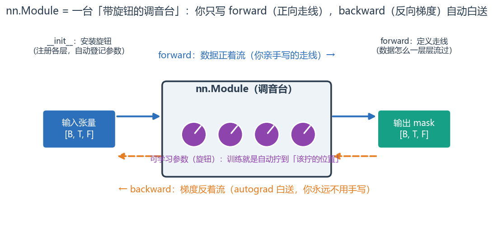
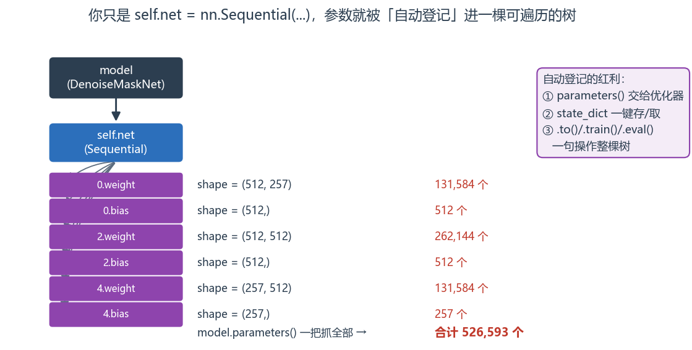
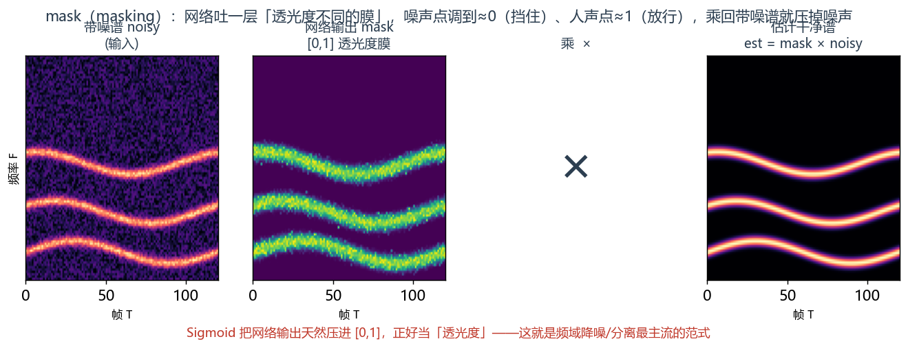
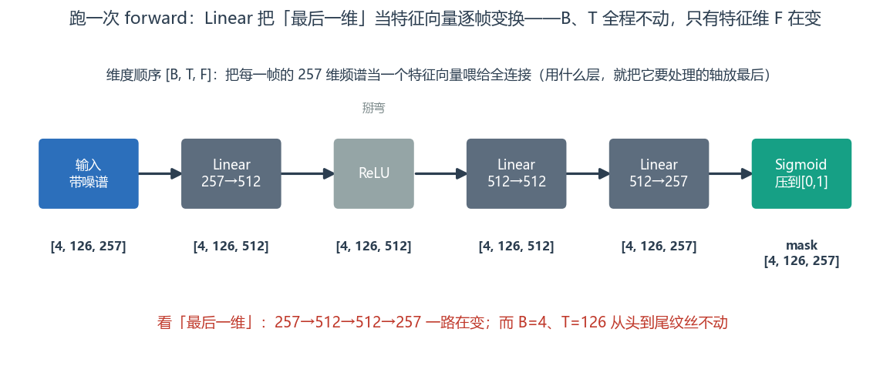
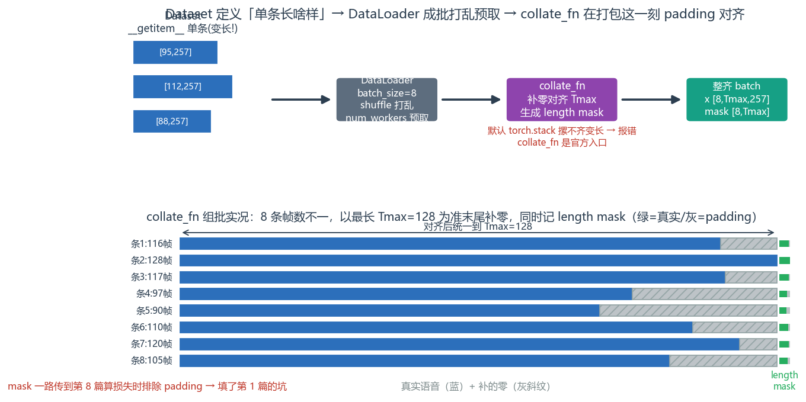

# 第 2 篇｜nn.Module 与数据管道：给网络一个容器，给数据一条传送带

> 一句话核心直觉：`nn.Module` 是一个"带可学习旋钮的函数"——你在 `__init__` 里安上旋钮、在 `forward` 里定义数据怎么流过；`Dataset`/`DataLoader` 则是把一条条语谱图源源不断、成批打包送到网络嘴边的"传送带"。

---

## 一、先把教材那套扔一边

上一篇结尾我们卡在一个问题上：张量有了一整批 `[B, C, F, T]`，可谁来"装"网络？我说自己写个函数 `return x @ W + b` 会乱成一锅粥——这一篇就来兑现，看看为什么会乱，以及 PyTorch 用什么收拾这摊子。

翻开 PyTorch 教程，讲到建模型，第一个例子往往是这样的：

```python
class Net(nn.Module):
    def __init__(self):
        super().__init__()
        self.fc = nn.Linear(784, 10)   # 784?这是把 28x28 的手写数字拍平...
    def forward(self, x):
        return self.fc(x)
```

`784 = 28×28`，一眼就是 MNIST 手写数字。然后你就被带进了"分类 0~9"的世界，跟着敲，能跑，但和你要做的降噪、分离依然隔着一层。

我们不走这条路。这一篇的两个主角——`nn.Module` 和 `DataLoader`——我全程用**一个真实的降噪任务**来讲：输入带噪语音的幅度谱，输出一个 **mask（掩码）**，用它去乘带噪谱、压掉噪声、留下人声。你会看到，这两个"容器"和"传送带"，是怎么让一个语音网络从"一堆散落的张量和参数"变成"能跑起来的流水线"的。

---

## 二、`nn.Module`：一个"带旋钮的函数"

先说清楚 `nn.Module` 到底是什么。别被"模块""基类"这些词唬住。你就把它理解成一个**函数**——给它输入张量，它吐出输出张量。唯一特别的地方是：**这个函数身上带着一堆"旋钮"（可学习参数），训练就是在拧这些旋钮。**

拿"混音台"打个有解释力的比方：一个降噪网络就像一台调音台，上面几百上千个推子和旋钮。原始带噪语音从一头进去，经过这些旋钮的层层调节，从另一头出来变干净。`forward` 定义了信号在台子里的走线，而"旋钮当前拧到哪"就是**参数**——训练的全部意义，就是自动找到"每个旋钮该拧到几"。

它的骨架永远是两件事：

```python
import torch
import torch.nn as nn

class DenoiseMaskNet(nn.Module):
    def __init__(self, n_freq=257):
        super().__init__()                    # 必须调,让 nn.Module 完成内部登记
        # ---- __init__: 在这里"安装旋钮"(注册各层) ----
        self.net = nn.Sequential(
            nn.Linear(n_freq, 512),           # 旋钮组 1: 257 → 512
            nn.ReLU(),                        # 激活:掰弯(第 4 篇细讲)
            nn.Linear(512, 512),              # 旋钮组 2
            nn.ReLU(),
            nn.Linear(512, n_freq),           # 旋钮组 3: 512 → 257,回到频率维
            nn.Sigmoid(),                     # 把输出压到 [0,1],正好当 mask
        )

    def forward(self, x):
        # ---- forward: 在这里定义"数据怎么流" ----
        # x 是带噪幅度谱,形状 [B, T, F](把每一帧当一个 257 维特征向量)
        mask = self.net(x)                    # 逐帧算出一个 [0,1] 的 mask
        return mask
```

两个部分，各司其职，请刻进肌肉记忆：

- **`__init__`：安装旋钮。** 你在这里 `self.xxx = nn.Linear(...)`，PyTorch 会**自动登记**每一层里的参数。
- **`forward`：定义走线。** 输入怎么一层层流到输出。**你永远不用自己写 `backward`**——只要 `forward` 是用张量运算搭的，autograd（第 1 篇那件"外衣"）会自动把反向的路也铺好。

> **第一个关键认知**：你只需要写"数据正着怎么流"（`forward`），PyTorch 就免费送你"梯度反着怎么流"（`backward`）。这就是为什么第 1 篇要强调张量的 autograd 能力——`nn.Module` 把这份能力包装成了"你只管搭正向、反向自动通"。这也是它比"手写一堆散落的 W、b"强的根本原因。



*把 `nn.Module` 想成一台调音台：中间那排旋钮就是可学习参数，`__init__` 负责安装、`forward` 定义信号走线（蓝）。你永远不用碰下面那条橙色的反向链路——autograd 顺着 `forward` 自动铺好，这正是它比"手写散落的 W、b"省心的根本。*

为什么说手写会乱？因为 `nn.Module` 帮你自动干了三件苦活。看一眼它的"旋钮清单"：

```python
model = DenoiseMaskNet(n_freq=257)

# (1) 自动收集所有参数——优化器要靠它才知道该拧哪些旋钮
total = sum(p.numel() for p in model.parameters())
print("可学习参数总数:", total)               # 526593,约 52.7 万个,你一个都不用手动登记

# (2) 自动汇总成 state_dict——存/取模型全靠它
for name, p in list(model.named_parameters())[:2]:
    print(name, tuple(p.shape))
# net.0.weight (512, 257)
# net.0.bias   (512,)

# (3) 自动支持 .to(device) / .train() / .eval() 一键切换整棵网络
model = model.to("cuda" if torch.cuda.is_available() else "cpu")
```

`model.parameters()` 一把抓出全部 52.7 万个旋钮，交给优化器；`state_dict()` 把它们打包成一个字典存盘。这三件事你要是手写管理，三层就崩溃，几十层根本没法维护。这就是"容器"的价值。



*你只是写了 `self.net = nn.Sequential(...)`，三层 `Linear` 的 weight/bias 就被自动登记进一棵能遍历的树（图中 shape 与数量是真实跑出来的）。`parameters()` 沿树一把抓给优化器、`state_dict` 一键存取、`.to()/.train()/.eval()` 一句操作整棵网络——这三样红利，全建立在"自动登记"之上。*

---

## 三、跑一次 forward：先让空网络转起来

网络定义好了，先别急着训练，**先确认数据能顺利流过、shape 对不对**。这是我带新人时的铁律：搭完网络第一件事，喂一个假 batch 跑通 `forward`，把每一步 shape 打出来。

```python
model = DenoiseMaskNet(n_freq=257)

# 造一个假 batch:4 条音频、每条 126 帧、每帧 257 维频率特征
# 注意维度顺序:全连接按帧处理,用 [B, T, F](signals 谱是 [F,T],这里转置过来)
B, T, F = 4, 126, 257
noisy_mag = torch.rand(B, T, F)               # 假装是带噪幅度谱
print("输入 shape:", noisy_mag.shape)          # torch.Size([4, 126, 257])

mask = model(noisy_mag)                        # 直接 model(x) 就会调 forward
print("输出 mask shape:", mask.shape)          # torch.Size([4, 126, 257]) 尺寸不变
print("mask 取值范围:", mask.min().item(), "~", mask.max().item())  # 0.x ~ 0.x,被 Sigmoid 压在 [0,1]

# mask 怎么用:逐点乘回带噪谱,就得到估计的干净谱
est_clean = mask * noisy_mag                   # 逐元素相乘,shape 不变
print("去噪后 shape:", est_clean.shape)         # torch.Size([4, 126, 257])
```

> **第二个关键认知**：mask 是一层"透光度不同的膜"——蒙在带噪谱上，噪声主导的时频点透光度调到接近 0（压掉），人声主导的点透光度接近 1（放行）。Sigmoid 把网络输出天然压进 `[0,1]`，正好当"透光度"。这就是频域降噪/分离最主流的一套思路，学名叫 **masking**。这里的 mask 还没训练，是瞎猜的；等第 8 篇定义好"猜得好不好"（Mask Loss），第 9 篇教会"怎么调旋钮"（优化器），它才会真的学会分辨噪声和人声。



*masking 的直觉：网络吐出一层"透光度膜"（中间那张，越亮越放行），拿它逐点乘带噪谱——噪声主导处透光度≈0 被挡住，人声主导处≈1 被放行，于是右边估计的干净谱里噪底被压下去、谐波带留了下来。Sigmoid 保证膜的取值恰好落在 `[0,1]`。*

维度提醒：为什么这里用 `[B, T, F]` 而不是第 1 篇的 `[B, C, F, T]`？因为全连接层（`nn.Linear`）是"把最后一维当特征向量"来处理的——我们希望它对**每一帧的 257 维频谱**做变换，所以把 F 放最后、T 放中间。等第 5 篇用 CNN，把语谱图当图像，就会切回 `[B, C, F, T]`。**维度顺序永远服务于你用什么层、想让它沿哪个轴运算**，不是死规矩。



*跑一次 `forward` 的 shape 变化：`Linear` 只对"最后一维"（特征维 F）做变换，所以 `257→512→512→257` 一路在变，而批次 B=4、帧数 T=126 从头到尾纹丝不动。这也解释了上面那句——用全连接就把要处理的频率轴 F 放到最后。*

---

## 四、`Dataset`：把"一条训练样本"定义清楚

网络会吃数据了，可数据从哪来？总不能每次手写 `torch.rand`。这就轮到数据管道登场。

第一步是 `Dataset`。它只回答两个问题：

1. **总共有多少条样本？**（`__len__`）
2. **给我第 i 条样本长什么样？**（`__getitem__`）

对降噪任务，一条样本 = **一对**语谱图：带噪的（输入）+ 干净的（监督目标）。真实项目里，这对数据通常是"干净语音 + 噪声"现场混出来的。我们写一个能跑的最小版：

```python
from torch.utils.data import Dataset

class DenoiseDataset(Dataset):
    def __init__(self, n_samples=100, n_freq=257):
        self.n_samples = n_samples
        self.n_freq = n_freq
        # 真实项目里这里会存一堆 .wav 路径;演示就现场合成
        self.clean_pool = [torch.rand(n_freq, torch.randint(80, 130, (1,)).item())
                           for _ in range(n_samples)]  # 每条帧数 80~129 不等(变长!)

    def __len__(self):
        return self.n_samples                  # 回答"共多少条"

    def __getitem__(self, i):
        clean = self.clean_pool[i]             # 干净谱 [F, T]
        noise = 0.3 * torch.rand_like(clean)   # 造一点噪声
        noisy = clean + noise                  # 带噪谱 = 干净 + 噪声
        # 转成 [T, F](按帧喂全连接),并返回"输入, 目标"这一对
        return noisy.T, clean.T                # 各 [T, F]

ds = DenoiseDataset()
print("数据集大小:", len(ds))                   # 100
x0, y0 = ds[0]
print("第 0 条:输入", x0.shape, " 目标", y0.shape)  # 输入 [T0, 257] 目标 [T0, 257]
x1, y1 = ds[1]
print("第 1 条:输入", x1.shape)                 # [T1, 257] ← 注意 T1 != T0,长度不一样!
```

注意最后那行：**每条样本的帧数 T 不一样**（80~129 随机）。这正是第 1 篇埋的坑——变长音频。单看 `Dataset` 没事，一旦要把它们**堆成一个 batch**，维度对不齐的问题就会当场爆炸。

---

## 五、`DataLoader`：传送带，以及变长 padding 的坑

`Dataset` 只管"单条怎么取"，`DataLoader` 负责把它变成一条**自动化传送带**：成批打包、随机打乱、多进程预取。一行就能包起来：

```python
from torch.utils.data import DataLoader

loader = DataLoader(ds, batch_size=8, shuffle=True, num_workers=0)
# batch_size=8: 每次吐 8 条; shuffle: 每轮打乱顺序(防止网络背样本顺序)
# num_workers: 几个子进程在后台预取数据(Windows/调试常设 0,生产可设 4~8)

for batch in loader:
    x, y = batch
    print(x.shape)
    break
```

跑上面这段，你多半会撞见一个报错，类似：

```
RuntimeError: stack expects each tensor to be equal size, but got [95, 257] at entry 0 and [112, 257] at entry 1
```

看到了吗？`DataLoader` 默认用 `torch.stack` 把 8 条摞成一个 batch，可它们帧数不同，摞不起来——**和第 1 篇 `torch.stack` 报错是同一个坑**。解决办法是给 `DataLoader` 传一个自定义的 `collate_fn`（打包函数），在打包这一刻做 padding，并造出 length mask：

```python
def collate_pad(batch):
    """把一批 (noisy[T,F], clean[T,F]) 补零对齐,并返回 length mask。"""
    xs, ys = zip(*batch)                       # 拆成输入列表、目标列表
    lengths = torch.tensor([x.shape[0] for x in xs])   # 每条真实帧数
    Tmax = int(lengths.max())                  # 这批最长
    F = xs[0].shape[1]
    B = len(batch)

    # 预分配全零张量,再把每条真实数据填进去(填不满的尾部自然是 padding)
    x_pad = torch.zeros(B, Tmax, F)
    y_pad = torch.zeros(B, Tmax, F)
    mask  = torch.zeros(B, Tmax, dtype=torch.bool)     # True=真实帧
    for i, (x, y) in enumerate(zip(xs, ys)):
        L = x.shape[0]
        x_pad[i, :L] = x
        y_pad[i, :L] = y
        mask[i, :L] = True
    return x_pad, y_pad, mask

loader = DataLoader(ds, batch_size=8, shuffle=True, collate_fn=collate_pad)

x, y, mask = next(iter(loader))
print("一个 batch 输入:", x.shape)              # torch.Size([8, Tmax, 257])
print("一个 batch 目标:", y.shape)              # torch.Size([8, Tmax, 257])
print("length mask:",     mask.shape)           # torch.Size([8, Tmax])
print("这批各帧数:", mask.sum(dim=1).tolist())   # 每条真实帧数,后几帧是 padding
```

> **第三个关键认知**：**`collate_fn` 是"变长数据进 GPU"这道坎的官方入口**。padding 让形状对齐、能组批；同时吐出的 length mask 记录"哪些是真数据"，一路传下去，等第 8 篇算损失时把 padding 处排除掉。你现在 `DataLoader` 里造好的这个 mask，就是第 1 篇那个坑的正式填埋处。



*上半是传送带全貌：`Dataset` 出变长单条 → `DataLoader` 打乱预取 → `collate_fn` 在打包这一刻补零对齐并造 length mask → 吐出整齐 batch。下半是真实组批实况：8 条帧数不一，以最长 Tmax 为准末尾补零（灰斜纹），右侧同步记下 length mask（绿=真实帧/灰=padding）——它会一路传到第 8 篇算损失时把 padding 排除。*

把网络和传送带接起来，一个完整的"喂数据 + 前向"闭环就通了：

```python
model = DenoiseMaskNet(n_freq=257).to("cpu")
for x, y, mask in loader:
    pred_mask = model(x)                       # [B, Tmax, 257]
    est_clean = pred_mask * x                  # 用 mask 去噪
    print("估计干净谱:", est_clean.shape, " 目标:", y.shape)
    # 下一步就该算 est_clean 和 y 差多少(损失)、再回传更新——那是第 8、9 篇
    break
```

---

## 六、这在工程里，到底解决了什么问题

`nn.Module` 和 `DataLoader` 是你写任何语音深度学习项目都绕不开的两根支柱。

| 工程需求 | 靠谁解决 | 具体怎么帮你 |
|---|---|---|
| **管理成百上千个参数** | `nn.Module` | 自动登记、`parameters()` 一把抓给优化器、`state_dict` 一键存档 |
| **搭深网络不写反向** | `nn.Module` + autograd | 你只写 `forward`，`backward` 自动生成 |
| **整棵网络搬 GPU / 切换训练推理** | `nn.Module` | `.to(device)`、`.train()`/`.eval()` 一句切换 |
| **海量音频高效喂入** | `DataLoader` | 成批、打乱、`num_workers` 多进程预取，喂满 GPU |
| **变长语音组批** | `collate_fn` | padding 对齐 + length mask，第 1 篇的坑在此填 |

再补一段一线视角，这是驱动/嵌入式背景的你最容易踩的**思路差异**：

> **训练时的数据流 vs 推理时的数据流，方向是反的。** 训练时用 `DataLoader` **随机打乱、成大批**地喂——因为要让网络见到多样样本、算力吃满，顺序无所谓。可上线做**实时降噪**时，数据是**严格按时间顺序、一帧一帧**从驱动层 ring buffer 里流出来的，`batch=1`、绝不能打乱、还得考虑因果性（不能用未来帧）。很多人拿训练那套流式思维去理解推理，或反过来，就会困惑。记住：**`DataLoader` 是给"训练"这个离线场景设计的传送带；实时推理是另一套流式管线。** RNN 的因果性约束（第 6 篇）会把这条讲透。

---

## 七、埋一个钩子：网络能跑了，可一开大就"炸"

到这里，容器有了、传送带通了、`forward` 跑得欢。你信心满满地想上真家伙：把 `batch_size` 从 8 调到 64，把网络从 3 层加到 12 层，把音频从 1 秒换成 10 秒的长录音——

然后你会撞上语音深度学习新手的第一堵墙，一行血红的报错：

```
RuntimeError: CUDA out of memory. Tried to allocate 2.00 GiB
(GPU 0; 8.00 GiB total capacity; 7.12 GiB already allocated)
```

**OOM——显存爆了。** 网络逻辑一个字没错，纯粹是"东西太多，工作台放不下"。这时你会冒出一堆问题：显存里到底装了些什么？为什么 batch 大一点、音频长一点就爆？除了含泪把 batch 调小，还有别的办法吗？听说有个"混合精度"能省一半显存，那是什么原理，会不会把精度搞坏？

下一篇（第 3 篇），我们就掀开显存这块"工作台"，看看它到底被什么占满，以及怎么用梯度累积、梯度检查点、混合精度这些工具，在有限的台面上跑起更大的模型。

---

## 本篇小结

- **`nn.Module` = 带可学习旋钮的函数**：`__init__` 里安装旋钮（注册层、自动登记参数），`forward` 里定义数据怎么流；`backward` 由 autograd 免费生成，你永远不用手写。
- **它替你干三件苦活**：`parameters()` 汇总参数交给优化器、`state_dict` 存取模型、`.to()`/`.train()`/`.eval()` 一键操作整棵网络。
- **mask 思路**：降噪网络输出一层 `[0,1]` 的"透光度膜"（Sigmoid 保证范围），乘回带噪谱压掉噪声——频域降噪/分离的主流范式。
- **`Dataset`** 定义"一条样本长啥样"（`__len__`/`__getitem__`），**`DataLoader`** 是成批、打乱、多进程预取的传送带。
- **变长语音靠 `collate_fn`** 在打包时 padding 对齐并生成 length mask（填了第 1 篇的坑，为第 8 篇损失埋点）。
- **训练传送带 ≠ 实时流式管线**：一个随机大批、一个顺序单帧带因果约束。
- **下一步**：网络能跑了，但一开大 batch / 长音频显存就炸（OOM）——得学会管显存与混合精度。

