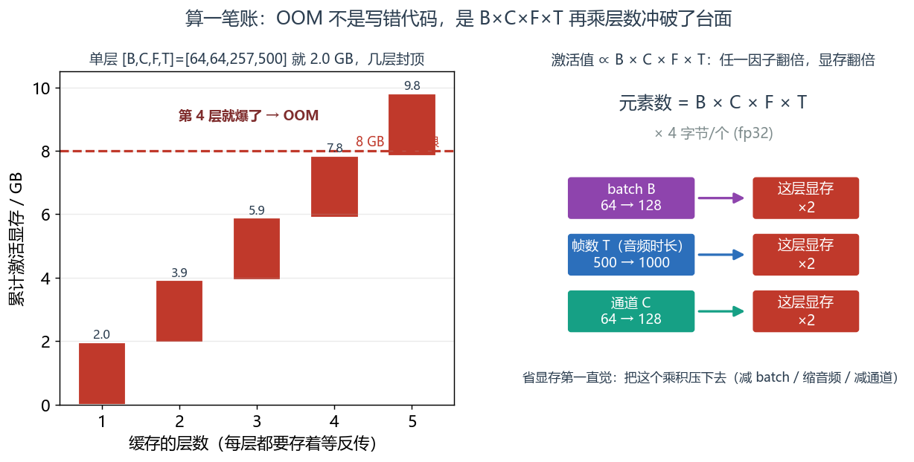
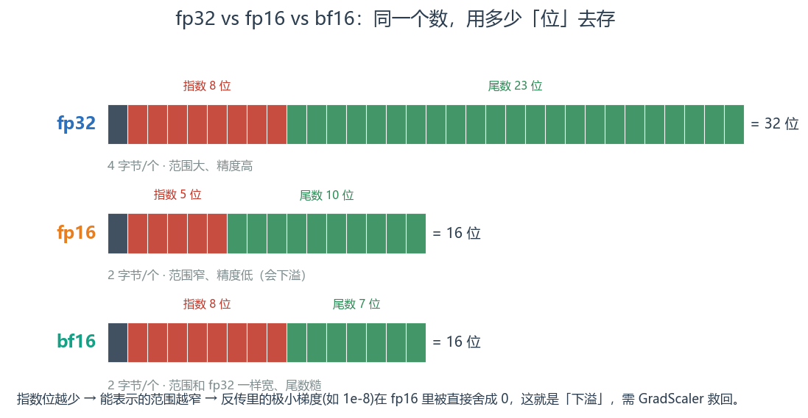
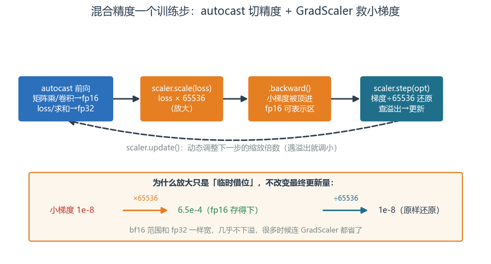
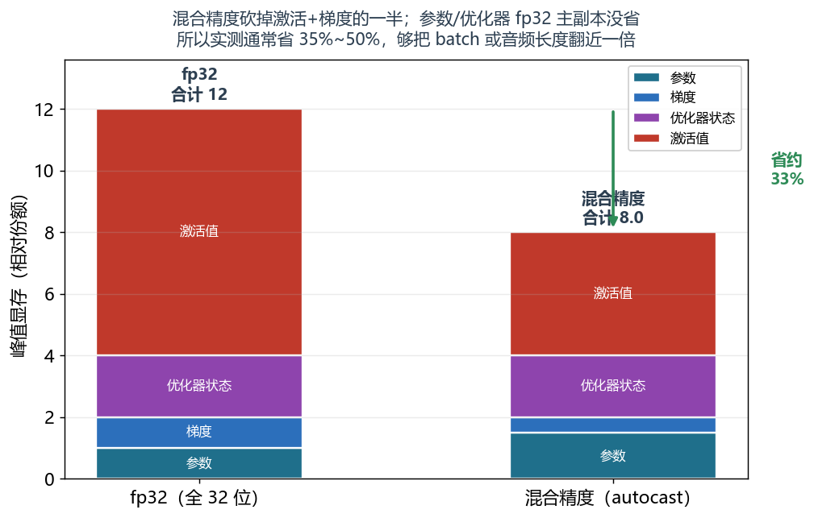

# 第 3 篇｜显存与混合精度：在有限的工作台上跑起更大的模型

> 一句话核心直觉：显存就是你一张有限大小的工作台，参数、梯度、优化器状态、还有最吃地方的激活值全得摊在上面；台面一满就 OOM。混合精度就是把大部分零件从 fp32 换成半个身板的 fp16，一下腾出一倍台面。

---

## 一、先把教材那套扔一边

上一篇结尾，我们把 batch 调大、网络加深、音频加长，然后撞上了那行血红的报错：

```
RuntimeError: CUDA out of memory. Tried to allocate 2.00 GiB
```

网络逻辑没错，代码也没错，纯粹是"东西太多、台面放不下"。这一篇就来兑现上一篇的承诺，掀开显存这块工作台，看它被什么塞满，以及怎么腾地方。

大多数教程讲显存，上来就是一句"减小 batch size 或用梯度累积"，然后就没了——**它没告诉你显存里到底装了什么，你只能靠玄学试。** 结果就是遇到 OOM 只会一路把 batch 往下砍，砍到 batch=1 还爆，就彻底抓瞎。

我们换个讲法。你先在脑子里立一幅画面：**显存 = 一张固定大小的工作台**（比如 8 GB）。你要拼一个大模型这台复杂机器，得同时在台面上摊开四类零件。搞清楚这四类零件各占多大、哪个最能吃地方，你就能对着账本精确地腾地方，而不是瞎砍 batch。这一篇就带你把这本账算明白。

---

## 二、工作台上摊了什么：显存的四类零件

训练时，显存里主要摊着这四类东西。记住它们，OOM 时你才知道砍哪个：

| 零件 | 是什么 | 占多大（fp32） | 特点 |
|---|---|---|---|
| **① 参数** | 网络的旋钮 W、b | 每个 4 字节 | 固定不变，模型多大就多大 |
| **② 梯度** | 每个参数的"该往哪调" | 和参数一样大 | 反传时产生，与参数一一对应 |
| **③ 优化器状态** | Adam 给每个参数存的动量/方差 | **参数的 2 倍** | 最容易被忽视的隐形大户 |
| **④ 激活值** | 前向每层的中间输出 | **随 batch × 序列长度暴涨** | 反传要用它，必须缓存，最吃地方 |

前三类都是"跟着参数走"的，参数量定了它们就定了。用 Adam 优化器时，①②③加起来是参数量的 **4 倍**（1 份参数 + 1 份梯度 + 2 份优化器状态）。一个 1000 万参数的小网络，光这三样就要 `1000万 × 4字节 × 4 = 160 MB`——不算多。


*把显存想成一张 8 GB 的工作台：①参数②梯度③优化器状态三类"跟着参数走"（Adam 时合计 = 参数量×4），第 ④ 类激活值"跟着数据量走"、还乘起来涨——它才是台面上最能吃地方的大户。*


**真正的吃显存大户是第 ④ 类：激活值。** 它不跟着参数走，而是跟着**你喂进去的数据量**走——batch 越大、音频越长、网络越深，激活值就越多，而且是**乘起来涨**。这就是为什么上一篇你一把 batch 从 8 调到 64、音频从 1 秒换成 10 秒，显存立刻爆掉——爆的几乎全是激活值。

> **第一个关键认知**：为什么激活值必须缓存、不能算完就扔？因为**反向传播要用它**。第 4 篇会细讲，但直觉在这：反传要算"每个旋钮该调多少"，用到链式法则，而链式法则的每一环都需要前向时该层的输入值。所以前向经过的每一层，它的中间输出都得**先存着**，等反传倒着走回来时再取用。**网络越深、数据越多，要存的中间结果越多。** 这也解释了下文梯度检查点为什么能省显存——它拿"重算"换"不存"。

顺带点一句上一篇提到的第 ③ 类：Adam 为每个参数额外存两份状态（一阶矩、二阶矩），凭空让参数相关显存翻倍。**优化器凭什么要存这两份、它们又怎么帮网络更聪明地下山，第 9 篇（优化器 AdamW）会专门讲。** 这里你只要记住："选了 Adam，就等于给参数相关显存乘了个 4"。

---

## 三、算一笔账：显存是怎么被乘爆的

别停留在定性。我们拿一个降噪网络实打实算一次激活值的账，你就明白 OOM 的数量级从哪来。

假设一个卷积降噪网络，中间某层的特征图形状是 `[B, C, F, T]`：

- batch `B = 64`
- 通道 `C = 64`
- 频率 `F = 257`
- 帧数 `T = 500`（约 4 秒音频）

这**一层**的激活值元素个数：

$$64 \times 64 \times 257 \times 500 \approx 5.26 \times 10^8 \text{ 个}$$

每个 fp32 占 4 字节，所以**单单这一层**就要：

$$5.26 \times 10^8 \times 4 \text{ 字节} \approx 2.1 \text{ GB}$$

逐字翻译这笔账：**一层就 2 GB，而网络有几十层，每层都得缓存着等反传。** 8 GB 的卡几层就满了。现在你彻底明白 OOM 的机制了——不是哪里写错，是 `B × C × F × T` 这个乘积太大，再乘上层数，轻松冲破台面。

```python
# 把这笔账用代码算一遍,建立数量级直觉
B, C, F, T = 64, 64, 257, 500
elems = B * C * F * T
bytes_fp32 = elems * 4
print(f"单层激活元素数: {elems:,}")
print(f"单层显存(fp32): {bytes_fp32 / 1024**3:.2f} GB")   # ≈ 2.05 GB
print(f"单层显存(fp16): {bytes_fp32 / 2 / 1024**3:.2f} GB")  # ≈ 1.02 GB,减半!

# 看清每个因子的杠杆:哪个翻倍,显存就翻倍
for name, val in [("batch B", B), ("通道 C", C), ("帧数 T(音频时长)", T)]:
    print(f"{name} 翻倍 → 这层显存也翻倍({val} → {val*2})")
```

> **第二个关键认知**：激活值 ∝ `B × C × F × T`。这四个因子任何一个翻倍，显存都跟着翻倍。所以省显存的第一直觉极其朴素：**把这个乘积压下去**——减 batch、缩短音频片段、减通道。搞清楚这个公式，你就从"瞎砍"升级成"照着账本砍"。



*左：`[64,64,257,500]` 这样一层激活就 ≈2 GB，每层都得缓存等反传，第 4 层就撞破 8 GB 台面——OOM 不是代码写错，是乘积太大。右：`B×C×F×T` 里任一因子翻倍，这层显存就翻倍，省显存就是照着这个公式压乘积。*


---

## 四、省显存工具箱：不减模型规模也能腾地方

照着账本，我们有一整套工具，代价各不相同。按"从便宜到讲究"排：

**1）减小 batch —— 最直接，但影响训练稳定性**

`B` 减半，激活值减半。代价是每步看到的样本变少，梯度更"抖"。这是第一反应，但不是唯一手段。

**2）梯度累积 —— 用"小 batch 攒几次"冒充"大 batch"**

想要大 batch 的稳定梯度，又放不下？那就跑几个小 batch、把梯度**攒起来**，攒够了再更新一次。等效于大 batch，但任一时刻台面上只有一个小 batch 的激活值。

```python
accum_steps = 4                    # 4 个小 batch 等效 1 个 4 倍大 batch
optimizer.zero_grad()
for i, (x, y, mask) in enumerate(loader):
    loss = compute_loss(model(x), y, mask)
    (loss / accum_steps).backward()          # 梯度自动累加进 .grad,不清零
    if (i + 1) % accum_steps == 0:
        optimizer.step()                      # 攒够 4 次才更新一次
        optimizer.zero_grad()                 # 再清零,开始下一轮攒
```

**3）推理/验证时关掉 autograd —— 直接省掉激活缓存**

只做前向、不训练时（验证、上线推理），根本不需要为反传缓存激活值。用 `torch.no_grad()` 或 `model.eval()` 告诉 PyTorch"别记账了"，激活值算完即弃：

```python
model.eval()
with torch.no_grad():                # 不建计算图、不缓存激活,显存骤降
    est = model(noisy_mag)           # 推理时显存占用可能只有训练的几分之一
```

**4）梯度检查点（activation checkpointing）—— 拿"重算"换"不存"**

前面说激活值必须缓存等反传。梯度检查点反其道而行：**前向时故意不存中间激活，等反传需要时现场重新前向算一遍。** 拿时间（多一次前向）换空间（不占激活显存），深网络能省下大半激活显存。

```python
from torch.utils.checkpoint import checkpoint
# 把某个吃显存的子模块用 checkpoint 包起来:前向不缓存,反传时重算
def forward(self, x):
    x = checkpoint(self.heavy_block, x, use_reentrant=False)
    return self.head(x)
```

**5）关于 `del` + `empty_cache` 的真相**

网上常见"OOM 就 `torch.cuda.empty_cache()`"。说句实话：**它多半救不了你。** PyTorch 用一个缓存分配器管理显存，`empty_cache()` 只是把 PyTorch 已经不用、但还攥在手里没还给系统的那部分**还给驱动**，它**不会释放你还在用的张量**。真正占着的激活值、参数一点没少。它偶尔能缓解"显存碎片"，但不是 OOM 的解药——别把它当银弹。

| 工具 | 省的是哪类 | 代价 |
|---|---|---|
| 减 batch | 激活值 | 梯度更抖 |
| 梯度累积 | 激活值（等效大 batch） | 训练变慢 |
| `no_grad`/`eval` | 激活值（推理时） | 仅限不训练场景 |
| 梯度检查点 | 激活值 | 多一次前向，变慢 |
| **混合精度** | **激活值 + 梯度全部减半** | 需处理数值下溢（下节） |

最后一行的混合精度，是性价比最高的一招，单独拿一节讲。

---

## 五、混合精度：用 fp16 换一倍台面

前面所有零件我们都默认按 fp32（32 位 float）算。**混合精度的想法极简单：大部分运算改用 fp16（16 位 float），每个数只占 2 字节而非 4 字节，激活值和梯度的显存直接减半，而且 GPU 上 fp16 矩阵运算还更快。** 一石二鸟。

fp32 和 fp16 的区别，一句话：

$$\text{fp32}:\ 4\text{ 字节},\ \text{范围大、精度高} \qquad \text{fp16}:\ 2\text{ 字节},\ \text{范围窄、精度低}$$

逐字翻译：fp16 用一半的位数存一个小数，省一半地方、算得更快，**但能表示的数值范围窄、小数精度粗**。这就带来一个真实的坑——**数值下溢**：

> **第三个关键认知**：反向传播里，很多梯度是非常小的数（比如 `1e-8`）。fp16 能表示的最小正数远大于此，于是这些小梯度在 fp16 里会被直接**舍成 0**——梯度没了，那部分网络就停止学习了。这就是"下溢"。所以混合精度不能无脑全用 fp16，得有个补救机制。



*一个数由符号位+指数位（决定范围）+尾数位（决定精度）组成。fp16 只有 5 个指数位，范围窄，极小梯度会下溢舍成 0；bf16 同样 2 字节却保留 8 个指数位，范围和 fp32 一样宽，几乎不下溢——这就是"能用 bf16 就优先用"的原因。*


补救机制叫 **GradScaler（梯度缩放）**，思路巧妙得很：反传前先把损失**乘上一个大数**（比如 65536），链式法则会让所有梯度跟着放大同样倍数，小梯度就被顶到 fp16 能表示的范围里、不再被舍成 0；等梯度算完、要更新参数前，再**除回**同样的倍数还原。放大只是"临时借位"，不影响最终更新量。

PyTorch 用 `autocast` + `GradScaler` 两件套把这一切自动化：

```python
import torch
from torch import nn, optim

device = "cuda" if torch.cuda.is_available() else "cpu"
model = DenoiseMaskNet(n_freq=257).to(device)   # 沿用第 2 篇的降噪网络
optimizer = optim.AdamW(model.parameters(), lr=1e-3)

use_amp = (device == "cuda")                     # 混合精度主要在 GPU 上受益
scaler = torch.cuda.amp.GradScaler(enabled=use_amp)  # 梯度缩放器

for x, y, mask in loader:
    x, y = x.to(device), y.to(device)
    optimizer.zero_grad()

    # autocast 区域内:PyTorch 自动把合适的运算切成 fp16,不合适的(如求和/loss)留 fp32
    with torch.cuda.amp.autocast(enabled=use_amp):
        pred = model(x) * x                      # 前向,大部分算子跑 fp16
        loss = ((pred - y) ** 2).mean()          # 损失(内部保持 fp32 更稳)

    scaler.scale(loss).backward()                # 先放大 loss 再反传:救回小梯度
    scaler.step(optimizer)                       # 内部先还原梯度、检查有无溢出,再更新
    scaler.update()                              # 动态调整缩放倍数
    break
```

`autocast` 自己知道哪些算子适合 fp16（矩阵乘、卷积）、哪些必须留 fp32（求和、softmax、loss），你不用手动指定。**这就是"混合"精度的含义——不是全 fp16，而是 fp16 与 fp32 各司其职。**



*一个混合精度训练步：`autocast` 把矩阵乘/卷积切成 fp16、loss 留 fp32；`scaler.scale` 先把 loss ×65536 放大，反传时小梯度被顶进 fp16 可表示区，`scaler.step` 更新前再 ÷65536 还原。放大只是"临时借位"，最终更新量不变。*


补一句更省的选择：新一点的 GPU（Ampere 及以后）支持 **bf16**。它和 fp16 一样 2 字节，但**动态范围和 fp32 一样宽**（牺牲了尾数精度），几乎不会下溢，很多时候连 GradScaler 都不用。能用 bf16 就优先用它，省心。

---

## 六、代码实战：fp32 vs 混合精度，量一量显存差多少

空说减半没意思，我们真量一次。用 `torch.cuda.max_memory_allocated` 读峰值显存，同一个网络、同一批数据，跑 fp32 和 autocast 各一遍对比。**没有 GPU 的读者，代码会自动回退到 CPU 并说明——CPU 上测不出显存差异，这段的数值观察需要 CUDA 环境。**

```python
import torch
from torch import nn, optim

def measure(use_amp):
    device = "cuda"
    torch.cuda.reset_peak_memory_stats()          # 清零峰值统计
    model = DenoiseMaskNet(n_freq=257).to(device)
    opt = optim.AdamW(model.parameters(), lr=1e-3)
    scaler = torch.cuda.amp.GradScaler(enabled=use_amp)

    x = torch.rand(64, 500, 257, device=device)   # [B, T, F] 大 batch + 长音频
    y = torch.rand(64, 500, 257, device=device)

    for _ in range(3):                             # 跑几步让显存达到稳定峰值
        opt.zero_grad()
        with torch.cuda.amp.autocast(enabled=use_amp):
            pred = model(x) * x
            loss = ((pred - y) ** 2).mean()
        scaler.scale(loss).backward()
        scaler.step(opt); scaler.update()

    peak = torch.cuda.max_memory_allocated() / 1024**3
    return peak

if torch.cuda.is_available():
    p32 = measure(use_amp=False)
    p16 = measure(use_amp=True)
    print(f"fp32     峰值显存: {p32:.2f} GB")
    print(f"混合精度  峰值显存: {p16:.2f} GB")
    print(f"省了约 {(1 - p16 / p32) * 100:.0f}%")   # 通常 35%~50%
else:
    print("当前无 CUDA,混合精度显存对比需在 GPU 上运行。")
    print("原理不变:激活值和梯度从 4 字节/个 变 2 字节/个,理论上限省一半。")
```

实测通常省 35%~50%（不到理论 50% 是因为参数、优化器状态那部分 fp32 主副本没省，且有固定开销）。**这意味着同样一张 8 GB 卡，开了混合精度，你能把 batch 或音频长度差不多翻一倍**——上一篇那个 OOM，很多时候一行 `autocast` 就压下去了。



*按四类零件拆开看：混合精度把最大头的激活值和梯度砍掉一半，但参数、优化器状态的 fp32 主副本没省（还多一份 fp16 权重副本），所以实测省的是 35%~50% 而非理论满额 50%——已经够把 batch 或音频长度翻近一倍了。*


---

## 七、这在工程里，到底解决了什么问题

显存管理是"能不能训得动、上不上得了线"的现实门槛，尤其对语音——音频序列天生长，激活值特别能吃。

| 场景 | 显存痛点 | 对策 |
|---|---|---|
| **长录音降噪训练** | 音频长 → T 大 → 激活爆 | 切成短片段训练、梯度检查点、混合精度 |
| **大 batch 求稳定梯度** | B 大 → 激活爆 | 梯度累积等效大 batch |
| **深层分离网络** | 层数多 → 激活层层缓存 | 梯度检查点拿重算换显存 |
| **端侧/实时推理** | 设备显存/内存紧张 | `no_grad` + fp16/int8，推理天然比训练省得多 |

一线经验两条：

- **训练显存 ≫ 推理显存**。训练要扛参数+梯度+优化器状态+激活四座大山；推理只有参数+少量激活（还能 `no_grad`）。所以"训练得用 A100，上线一张小卡就够"是常态。
- **实时推理为什么爱用 fp16/int8**：端侧设备显存/算力有限，把模型量化到 fp16 甚至 int8，显存和延迟一起降。代价是精度略损、且第 7 篇会提到的**复数/相位运算对量化格外敏感**——这是后话，先记个名字。

---

## 八、埋一个钩子：机器都齐了，可网络凭什么会"学会"？

盘点一下这三篇你手里攒了什么：第 1 篇把语谱图变成了张量 `[B, C, F, T]`，第 2 篇搭好了 `nn.Module` 容器和 `DataLoader` 传送带，这一篇又学会了在有限显存里把它们跑起来、还能开混合精度跑更大。

**器、数据、显存，训练的硬件条件全齐了。可有一件最核心的事，我们一直在绕着走、反复往后推——网络凭什么会"学会"？**

你有没有注意到，这三篇里我埋了多少个"欠条"：第 1 篇说 autograd 能自动求梯度，"具体怎么倒推是第 4 篇的事"；第 2 篇说 `forward` 写好 `backward` 就免费送你，"反传怎么走后面讲"；这一篇又说激活值必须缓存"因为反传要用它，第 4 篇细讲"。这些欠条指向的是**同一个内核：反向传播**。

网络那几百万个旋钮，一开始全是随机数，输出一团糟。它究竟是**怎么知道**每个旋钮该往哪个方向、拧多少，才能让降噪效果一点点变好的？这背后是一条"顺着责任链往回问：是谁、错了多少"的链式追责机制，再配上"激活函数"这个让网络能掰弯、而不只会画直线的关键零件。

下一篇（第 4 篇），我们就正式还清所有欠条，掀开"学习"的内核——反向传播与激活函数。

---

## 本篇小结

- **显存 = 有限的工作台**，训练时摊着四类零件：**参数、梯度、优化器状态（Adam 是参数的 2 倍）、激活值**。前三类跟参数走，**激活值跟数据量走且最吃地方**。
- **激活值 ∝ `B × C × F × T`**，任一因子翻倍显存翻倍——这就是 OOM 的机制。激活必须缓存是因为反传要用它。
- **省显存工具箱**：减 batch、梯度累积（等效大 batch）、`no_grad`/`eval`（推理省激活）、梯度检查点（重算换不存）；`empty_cache` 不是银弹。
- **混合精度**：大部分算子用 fp16（2 字节）省一半显存还更快；坑是**小梯度下溢**，用 **GradScaler** 放大损失救回；`autocast` 自动分配 fp16/fp32；有 bf16 优先用 bf16。
- **训练显存 ≫ 推理显存**；实时推理常用 fp16/int8。优化器状态吃显存的原理留给第 9 篇。
- **下一步**：器、数据、显存都齐了，但还没讲"学"的内核——网络凭什么会学会？反向传播与激活函数（第 4 篇）。

