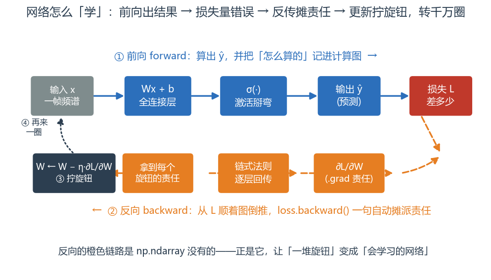
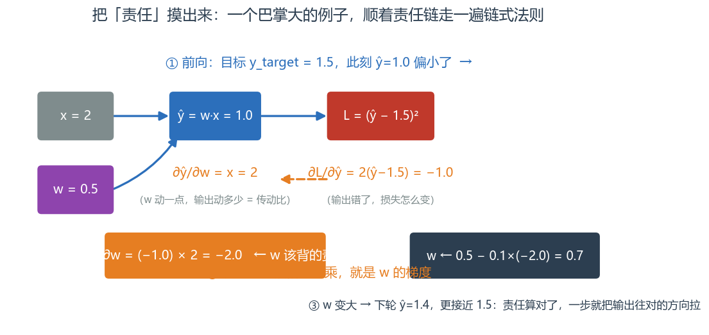
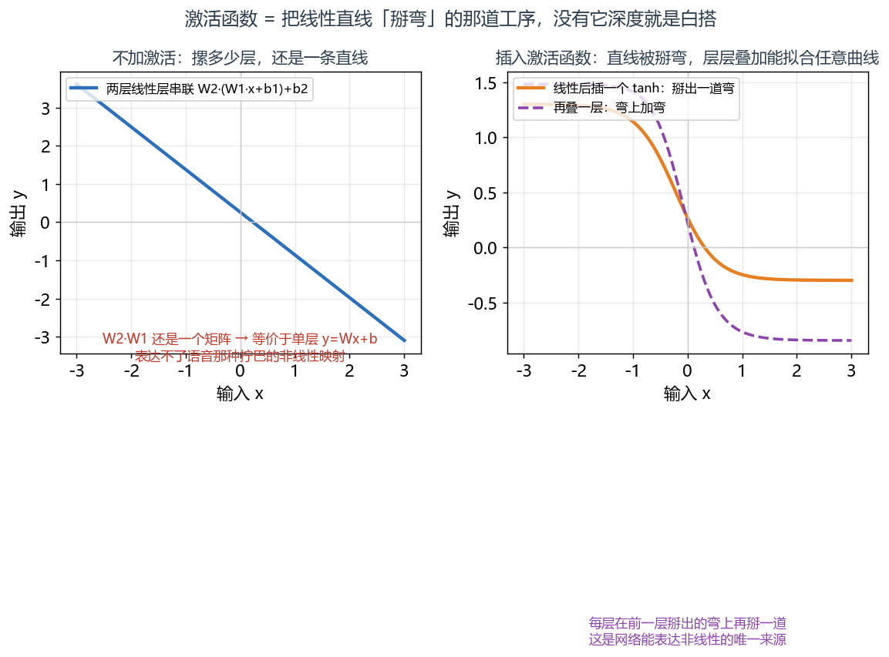
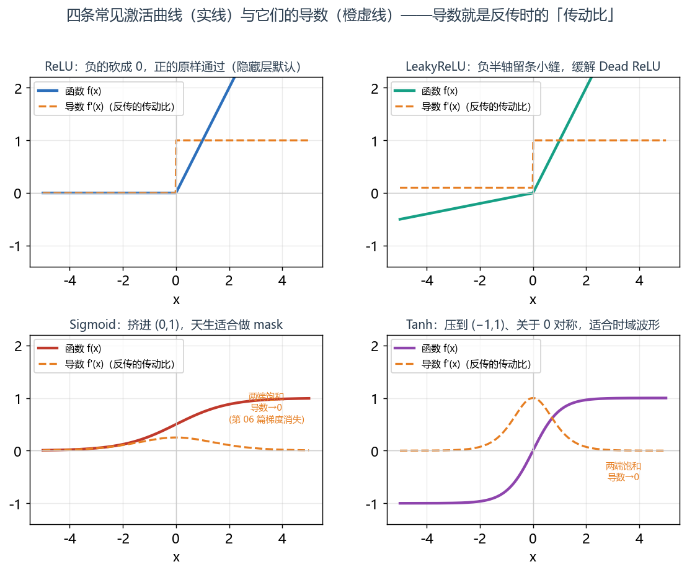
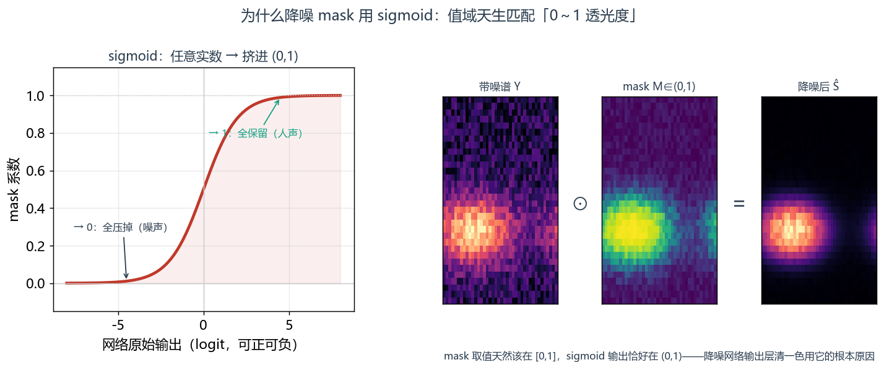

# 第 4 篇｜神经网络基础：网络凭什么会"学会"

> 一句话核心直觉：反向传播就是顺着一条**责任链**往回问"是谁、错了多少"，把这份责任摊派给每个旋钮；而**激活函数**决定了这堆旋钮能不能把一条直线**掰弯**，去贴合语音这种拧巴的信号。

---

## 一、先把教材那套扔一边

上一篇结尾我们把账算清了：网络这个"容器"搭好了（第 02 篇的 `nn.Module`），语谱图能一批批流进来（DataLoader），显存也管住了（第 03 篇的混合精度）。万事俱备，只差一个最要命的问题没回答：

**这网络凭什么会"学会"？** 我喂给它一堆"带噪语谱图 + 干净语谱图"的配对，它怎么就慢慢学会了降噪？

翻开任何一本深度学习教材，讲到这里就是一张神经元的示意图——一个圆圈、几条带箭头的线、旁边标着"树突""轴突"，然后开始类比生物大脑。说实话，当年这套类比对我理解"学习"这件事毫无帮助。生物神经元怎么放电，跟我这台机器怎么把语谱图里的噪声抹掉，隔着十万八千里。

所以我们把这套扔一边。换一个你当驱动工程师时天天干的事来切入：**调参**。

你调过无数次音频链路的增益、滤波器系数、缓冲区大小。调参的套路永远是：跑一遍 → 看结果差多少 → 心里估摸"哪个参数拧大点、哪个拧小点" → 再跑一遍。**神经网络的"学习"，本质就是这件事，只不过参数有几百万个，而"该往哪拧、拧多少"这件事，被一套叫反向传播的机制自动算了出来。**

这一篇，我们就把这套自动调参的内核拆开看。

---

## 二、全连接层：一堆"加权投票"

先看网络里最基础的一块砖：**全连接层（Fully Connected Layer，也叫线性层 `nn.Linear`）**。它的公式简单到你会怀疑：

$$y = Wx + b$$

逐字翻译成人话。假设我们从一张语谱图里拿出**一帧**——就是某个时刻的那一列频谱，它是一个长度为 $F$ 的向量 $x$（$F$ 个频率 bin 的能量）：

- $x$：输入，这一帧的 $F$ 个频率能量值。
- $W$：权重矩阵，形状 $[F_{out}, F]$。它的**每一行**就是一组"投票权重"。
- $Wx$：矩阵乘法，说白了就是——第 $i$ 个输出，等于"拿 $W$ 的第 $i$ 行，对输入的每个频率 bin 加权求和"。
- $b$：偏置，给每个输出加一个可调的基准线。
- $y$：输出，长度 $F_{out}$。

> **第一个关键认知**：一个输出神经元 $y_i = \sum_j W_{ij}x_j + b_i$，就是**对所有输入频率 bin 的一次加权投票**。$W_{ij}$ 大，说明"第 $j$ 个频率 bin 对第 $i$ 个输出很重要"；$W_{ij}$ 是负的，说明"这个 bin 一强，就把第 $i$ 个输出往下压"。降噪网络学的，无非就是这几百万个投票权重——学会"哪些频率组合是人声该保留的，哪些是噪声该压掉的"。

`W` 和 `b` 就是那几百万个"旋钮"。训练，就是把它们一点点拧到对的位置。问题只剩一个：**怎么知道每个旋钮该往哪拧？**

---

## 三、反向传播：顺着责任链往回问"谁错了多少"

假设网络吐出一帧降噪结果 $\hat{y}$，我们手里有对应的干净语谱图那一帧 $y_{\text{target}}$。先算一个**损失（loss）**，衡量"差多少"——最朴素的就是逐点平方差：

$$L = \frac{1}{F}\sum_i (\hat{y}_i - y_{\text{target},i})^2$$

翻译：把每个频率 bin 上"估计值和目标值的差"平方，再求平均。$L$ 越大，说明降噪结果离干净语音越远。（损失函数是第 08 篇的正主，这里先用这个最简单的顶着。）

现在到了核心问题：这个 $L$ 里有百万个旋钮 $W$ 在起作用，**我怎么知道每个旋钮对这份"错误"负多少责任？**

这就是反向传播（backpropagation，简称反传）要干的事。直觉是这样的——想象一条**责任追究链**：

> 最终结果错了 $L$ 这么多。我先问输出层：**你这一层的每个输出，对最终误差贡献了多少？** 输出层答完，再拿着这个答案去问它前面一层：**你又是通过影响输出层，间接贡献了多少？** ……就这样一层层往回追问，一直问到第一层。每个旋钮最后都会拿到一个数：**"你对这次错误负这么多责任。"**

那个"责任数"，就是**梯度（gradient）** $\frac{\partial L}{\partial W}$。而支撑这套追问的数学工具，就是你高数里学过、当时觉得没用的**链式法则**：

$$\frac{\partial L}{\partial W} = \frac{\partial L}{\partial y}\cdot\frac{\partial y}{\partial W}$$

逐字翻译：

- $\frac{\partial L}{\partial y}$：**输出错了，最终损失会跟着变多少**——误差追到输出层这一站的责任。
- $\frac{\partial y}{\partial W}$：**这个旋钮 $W$ 动一点，输出 $y$ 会跟着动多少**——旋钮和输出之间的"传动比"。
- 两者相乘：**旋钮 $W$ 动一点，最终损失会变多少**——这就是 $W$ 该负的责任。

深层网络无非是这条链更长：$\frac{\partial L}{\partial W_1} = \frac{\partial L}{\partial y_3}\cdot\frac{\partial y_3}{\partial y_2}\cdot\frac{\partial y_2}{\partial y_1}\cdot\frac{\partial y_1}{\partial W_1}$——一路把责任乘着传回去。**这个"沿链条连乘"的结构先记住，第 06 篇讲梯度消失时，它会以"沿时间连乘"的面目再回来找你。**

> **第二个关键认知**：你几乎永远不用手推这些偏导。PyTorch 在你做前向计算时，会偷偷把每一步操作记进一张**计算图**；你一句 `loss.backward()`，它就沿着这张图自动把所有旋钮的责任（`.grad`）算出来。你要懂的是**这份 `.grad` 的含义**——它就是"这个旋钮该往哪个方向、拧多用力"的指南针。

拿到责任（梯度）后，更新旋钮就一句话（最朴素的梯度下降）：

$$W \leftarrow W - \eta\cdot\frac{\partial L}{\partial W}$$

翻译：让每个旋钮**朝着让损失变小的反方向**挪一小步，步子大小由学习率 $\eta$ 控制。责任大的旋钮挪得多，责任小的挪得少。（怎么挪最聪明，是第 09 篇优化器的活儿。）

**前向算输出 → 算损失 → 反传摊派责任 → 更新旋钮**，这四步转一圈叫一个 step，转千万圈，网络就"学会"了。这就是全部内核。



*网络"学"的一整圈：蓝色是前向（算 `ŷ`、顺带把计算图织出来），橙色是反向（`loss.backward()` 顺着图倒推每个旋钮的责任 `.grad`），拿到责任后拧旋钮，再转下一圈。那条橙色链路正是 `np.ndarray` 没有、而 `torch.Tensor` 独有的（第 1 篇讲过），它才是"会学习"和"死数据"的分界线。*

### 用一个具体数字，把"责任"摸出来

嘴上说"责任"太虚，我们拿一个巴掌大的例子，把链式法则从头到尾走一遍，让你亲手摸到那个梯度。假设某个降噪神经元只管一个频率 bin：输入 $x=2$，一个权重 $w=0.5$，为方便先不加激活，输出 $\hat{y}=wx=1.0$；这个 bin 的干净目标是 $y_{\text{target}}=1.5$，损失 $L=(\hat{y}-y_{\text{target}})^2$。

现在问：**$w$ 该为这次误差负多少责任？** 顺着责任链拆两段：

- $\dfrac{\partial L}{\partial \hat{y}} = 2(\hat{y}-y_{\text{target}}) = 2(1.0-1.5) = -1.0$ —— "输出错了，损失会怎么变"。这里是负的，意思是"输出**偏小**了，得往大调"。
- $\dfrac{\partial \hat{y}}{\partial w} = x = 2$ —— "$w$ 动一点，输出跟着动多少"，也就是那个"传动比"。

两段一乘，就是 $w$ 该背的责任：

$$\frac{\partial L}{\partial w} = \frac{\partial L}{\partial \hat{y}}\cdot\frac{\partial \hat{y}}{\partial w} = (-1.0)\times 2 = -2.0$$

于是更新（取学习率 $\eta=0.1$）：$w \leftarrow 0.5 - 0.1\times(-2.0) = 0.7$。$w$ 变大了，下一次前向 $\hat{y}=0.7\times2=1.4$，比原来的 1.0 更接近目标 1.5——**责任算对了，一步就把输出往正确方向拉了一截。** 这就是反传的全部魔法，剩下的只是把这套算法在百万个旋钮上并行做一遍而已。



*把"责任"摸出来：前向（蓝）算得 `ŷ=1.0` 偏小；反向（橙）沿责任链拆成两段偏导——`∂L/∂ŷ=−1.0`（输出错了损失怎么变）和 `∂ŷ/∂w=2`（w 动一点输出动多少，即"传动比"），一乘就是 `w` 该背的梯度 `−2.0`；顺着负梯度拧一步，`w` 从 0.5 变 0.7，下轮输出就更贴目标了。*

---

## 四、为什么非要激活函数：不掰弯，堆多少层都是一条直线

现在有个致命问题。如果网络就是一层层 `Wx+b` 摞起来，会发生什么？

把两层线性层串起来算算：

$$y = W_2(W_1 x + b_1) + b_2 = (W_2 W_1)x + (W_2 b_1 + b_2)$$

看出来了吗？$W_2 W_1$ 还是一个矩阵，$W_2 b_1 + b_2$ 还是一个向量。**两层线性层，等价于一层线性层。** 你摞一百层，数学上还是 $y = Wx + b$ 一条直线（准确说是一个线性变换）。

而语音降噪、语音分离这种任务，输入到输出的映射是**极度非线性、拧巴**的——"这个频率在有人声时该保留、在纯噪声时该压掉"，这种带条件的判断，一条直线根本表达不了。

解法就是在每层线性变换后面，插一个**非线性函数**，把直线**掰弯**。这个函数就叫**激活函数（activation）**：

$$y = \sigma(Wx + b)$$

有了这个弯，多层才真正叠出了表达能力——每一层在前一层掰出的弯的基础上再掰一道，层层叠加，就能拟合任意复杂的时频映射。**激活函数是网络"能掰弯"的唯一来源，没有它，深度就是白搭。**



*左：两层纯线性层串联，画出来还是一条直线（$W_2 W_1$ 合并成一个矩阵，等价单层）；右：中间插一个 tanh，直线立刻被掰出一道弯，再叠一层就是"弯上加弯"。语音降噪那种"有人声保留、纯噪声压掉"的拧巴映射，只有这种被反复掰弯的曲线才拟合得了。*

---

## 五、激活函数在音频里到底怎么选

激活函数不是随便挑的，音频任务里每个都有它的坑和它的用武之地。



*四条常见激活曲线（实线，torch 真实画）与它们的导数（橙虚线）。导数就是反传时那个"传动比" $\frac{\partial y}{\partial x}$：ReLU 正半轴导数恒为 1、梯度不衰减，所以适合堆深；Sigmoid/Tanh 两端"饱和"、导数趋 0，梯度一到这里就传不回去了——这个"饱和杀死梯度"的坑，第 06 篇讲梯度消失还会再遇到。*

**ReLU**：$\text{ReLU}(x)=\max(0, x)$——负的全砍成 0，正的原样通过。简单、快、梯度不衰减，是隐藏层的默认选择。但它有个跟音频强相关的坑：

> **一个容易踩的坑**：语谱图的**幅度谱恒为非负**（能量没有负数）。如果你把 ReLU 直接用在"预测幅度谱"的输出层，看似"输出天然非负、正好匹配"，但一旦某个神经元输出恒为 0（Dead ReLU），那块频率就永远哑了，噪声压过头把人声也抹了。隐藏层用 ReLU 没问题，但要当心这种"整块死掉"。

**LeakyReLU / PReLU**：给负半轴留一条小缝 $\text{LeakyReLU}(x)=\max(\alpha x, x)$（$\alpha$ 是小正数，如 0.01；PReLU 让 $\alpha$ 也变成可学习的旋钮）。负值不再被一刀砍死，缓解 Dead ReLU，音频降噪网络里很常用。

**Tanh**：把输出压到 $[-1, 1]$，关于 0 对称。适合输出**有正有负**的场景——比如直接在时域预测波形（波形本来就在 $\pm1$ 之间摆动），或者预测复数谱的实部虚部。

**GELU**：比 ReLU 更平滑的一条弯，Transformer 类模型（语音识别、TTS 的主流架构）里的标配，训练更稳。

**Sigmoid**：$\sigma(x)=\dfrac{1}{1+e^{-x}}$，把任意实数**挤进 $(0, 1)$**。这个"天然落在 0 到 1 之间"的性质，在音频里有一个杀手级用途——**做 mask（掩码）**。

> **第三个关键认知（给第 08 篇埋点）**：语音降噪/分离最主流的做法不是让网络直接吐干净语谱图，而是让它预测一个**mask**——一张和语谱图同尺寸的"透光度膜"，每个时频点一个 0～1 之间的系数，贴到带噪谱上：$\hat{S} = M \odot Y$（$M$ 是 mask，$Y$ 是带噪谱，$\odot$ 是逐点相乘）。系数 1 = 这个时频点全保留（是人声），系数 0 = 全压掉（是噪声），中间值 = 部分衰减。**mask 的取值天然就该落在 $[0,1]$，而 sigmoid 的输出恰好就在 $(0,1)$——这不是巧合，这就是降噪网络输出层几乎清一色用 sigmoid 的根本原因。** 这个"预测 mask"的思路，到第 08 篇讲 Mask Loss 时会正式展开。



*左：sigmoid 把任意实数（可正可负的网络原始输出）挤进 $(0,1)$——大正数趋近 1、大负数趋近 0。右：这条 $(0,1)$ 值域恰好当"透光度"用，$\hat{S}=M\odot Y$ 把 mask 逐点乘到带噪谱上，人声区系数接近 1 保留、噪声区接近 0 压掉。值域天生匹配，这才是降噪输出层清一色选 sigmoid 的理由。*

---

## 六、代码实战：手写两层 MLP，看看"责任"长什么样

我们搭一个最小的两层 MLP（多层感知机），让它对语谱图的一帧做非线性变换、输出一个 mask，然后跑一次完整的"前向 → 损失 → 反传"，把某个权重的 `.grad`（也就是它该负的责任）打印出来看看。

```python
import torch
import torch.nn as nn

torch.manual_seed(0)

# ---- 造一帧语谱图数据（真实里来自 torch.stft 的一列幅度谱）----
F = 257                      # 频率 bin 数（512 点 FFT 的单边谱：512/2 + 1 = 257）
B = 4                        # 批次：一次喂 4 帧
x_noisy = torch.rand(B, F)   # 带噪幅度谱（非负，rand 落在 [0,1)），shape [4, 257]
target  = torch.rand(B, F)   # 干净幅度谱作为目标（示意），shape [4, 257]
print("输入  x_noisy:", x_noisy.shape)   # [4, 257]
print("目标  target :", target.shape)    # [4, 257]

# ---- 两层 MLP：Linear -> ReLU(掰弯) -> Linear -> Sigmoid(挤到[0,1]做mask) ----
class TinyMaskNet(nn.Module):
    def __init__(self, F, hidden=128):
        super().__init__()
        self.fc1 = nn.Linear(F, hidden)   # W1: [128, 257], b1: [128]
        self.act = nn.ReLU()              # 隐藏层掰弯
        self.fc2 = nn.Linear(hidden, F)   # W2: [257, 128], b2: [257]
        self.out = nn.Sigmoid()           # 输出层挤进 (0,1)，天然适合当 mask

    def forward(self, x):
        h = self.act(self.fc1(x))         # [B,257] -> [B,128] -> 掰弯
        m = self.out(self.fc2(h))         # [B,128] -> [B,257] -> mask ∈ (0,1)
        return m

net = TinyMaskNet(F)

# ---- 前向：算出 mask，贴到带噪谱上得到降噪估计 ----
mask = net(x_noisy)              # shape [4, 257]，每个元素都在 (0,1)
est  = mask * x_noisy            # 逐点相乘：mask 蒙在带噪谱上，shape [4, 257]
print("mask      :", mask.shape, " 取值范围:", (mask.min().item(), mask.max().item()))
print("降噪估计 est:", est.shape)

# ---- 算损失：估计谱和目标谱差多少（MSE，第08篇会换更好的）----
loss = ((est - target) ** 2).mean()
print("loss:", loss.item())

# ---- 反传：一句话，沿计算图把每个旋钮的“责任”都算出来 ----
loss.backward()

# ---- 看看第一层权重的“责任”（梯度）长什么样 ----
g = net.fc1.weight.grad          # 和 W1 同形状 [128, 257]
print("fc1.weight     shape:", net.fc1.weight.shape)  # [128, 257]
print("fc1.weight.grad shape:", g.shape)              # [128, 257]，每个旋钮一个责任值
print("责任绝对值的均值:", g.abs().mean().item())      # 平均每个旋钮该挪多少的量级
print("责任最大的那个旋钮:", g.abs().max().item())     # 谁背锅最多
```

跑完你会看到几件事，每件都对应前面的直觉：

- `mask` 的取值严格落在 $(0,1)$——sigmoid 的功劳，它天然就是一张"透光度膜"。
- `fc1.weight.grad` 和 `fc1.weight` **形状完全一样**（都是 `[128, 257]`）——因为**每个旋钮都要分到一份责任**，责任张量当然和旋钮张量同形。
- `.grad` 里数值大的那些位置，就是"这次错误里，该重点拧的旋钮"。你要是接着写 `optimizer.step()`，它就会按这份责任把每个旋钮挪一小步。

这就是第三节那套"责任链"的代码化身。`loss.backward()` 这一句背后，是链式法则沿着计算图默默把责任摊派到了每一个 `.grad` 里。

### 把循环转起来：亲眼看 loss 掉下去

单看一次反传还不够过瘾。把"前向 → 损失 → 反传 → 更新"这四步塞进一个 `for` 循环转几百圈，就能亲眼看着网络"学会"——loss 一路往下掉。这里让小网络学一个具体任务：**把带噪谱压向目标谱**（用固定的一对数据，纯粹为了看收敛）。

```python
import torch, torch.nn as nn
torch.manual_seed(0)

F, B = 257, 4
x_noisy = torch.rand(B, F)
target  = torch.rand(B, F)

net = TinyMaskNet(F)                                  # 复用上面的网络
opt = torch.optim.SGD(net.parameters(), lr=5.0)       # 最朴素的梯度下降（第09篇会讲更聪明的）

for step in range(301):
    est  = net(x_noisy) * x_noisy         # 前向：mask 贴到带噪谱 -> 降噪估计
    loss = ((est - target) ** 2).mean()   # 损失：离目标多远
    opt.zero_grad()                       # 清掉上一步的责任（梯度默认累加，必须清）
    loss.backward()                       # 反传：算出这一步每个旋钮的责任
    opt.step()                            # 更新：按责任把每个旋钮挪一小步
    if step % 100 == 0:
        print(f"step {step:3d}  loss = {loss.item():.5f}")
```

打印出来的 loss 会一路走低（比如从 ~0.17 掉到 ~0.09，前 100 步降得最猛，之后放缓）——**这就是"学会"的全部真相**：没有任何魔法，就是这四步转了 300 圈，每圈都按 `.grad` 给出的责任把百万旋钮朝对的方向挪一点点。（这里目标是随机谱、又只靠一个 mask 去凑，所以 loss 降到某个地板就到头了；真实降噪的目标是有结构的干净语音，能降得低得多。）真实降噪训练无非把这个循环换成"一批批不同的语谱图对 + 上百万参数 + 第 09 篇更聪明的优化器"，内核一模一样。

> **一个新手必踩的坑**：`opt.zero_grad()` 千万别忘。PyTorch 的 `.grad` 是**累加**的（为的是支持梯度累积省显存，见第 03 篇），不清零的话，这一步的责任会叠在上一步没清的责任上，梯度越滚越大，训练直接跑飞。

---

## 七、这在工程里解决什么问题

| 工程场景 | 神经网络基础怎么用上 |
|---|---|
| **语音降噪** | 全连接层把带噪谱帧映射成 mask，sigmoid 保证 mask∈(0,1)，反传自动学"哪些频率是噪声" |
| **说话人识别** | 末端全连接层把高层特征投影成"说话人打分向量"，加权投票哪个人最像 |
| **关键词唤醒** | 小 MLP 对特征帧做非线性判决，输出"是不是唤醒词"的概率（sigmoid） |
| **调试训练不收敛** | 打印各层 `.grad`：全是 0 说明责任传不回来（激活饱和/Dead ReLU），爆炸的大值说明梯度爆炸 |
| **选激活函数** | 幅度谱输出用 sigmoid 做 mask、时域波形输出用 tanh、隐藏层用 ReLU/GELU——不是玄学，是值域匹配 |

> **一句话记住**：网络会"学会"，靠的就是"前向出结果 → 损失量错误 → 反传摊责任 → 更新拧旋钮"这个循环转千万遍；而激活函数是它能表达非线性映射的唯一来源。你以后每写一个降噪网络，脑子里都该浮现这条责任链在千万个旋钮间来回流动的画面。

---

## 八、埋一个钩子：可我们刚才把语谱图"拍扁"了

回头看第六节的代码，有个动作被我悄悄带过了：我们喂进网络的是**一帧** `[B, F]`——一列孤零零的频谱。可真实的语谱图是二维的 `[B, C, F, T]`（频率 × 时间），充满了结构：谐波是**一条条平行的横纹**、共振峰是**几个频率上的亮团**、爆破音是**一根贯穿全频的竖条**（还记得 signals 第 13 篇教你读语谱图那节吗？）。

如果我硬要用全连接层处理整张语谱图，就得先把这张二维图 `[F, T]` **拍扁**成一根长向量 `[F×T]`，再喂给 `nn.Linear`。这一拍，灾难就来了：

- **时频的空间结构全丢了**。原本"频率相邻""时间相邻"的点，拍扁后被打散成一维，网络再也看不出"这两个点在语谱图上是挨着的"。谐波那种平行横纹的规律、共振峰那种局部聚集的模式，全被拍没了。
- **参数爆炸**。一张 `257×100` 的语谱图拍扁就是 25700 维，接一个隐藏层就是上千万个旋钮，显存直接顶不住（第 03 篇的痛还记得吧）。
- **同一个模式换个位置就不认识了**。谐波在低频出现和在高频出现，本是同一种模式，全连接层却要为每个位置单独学一套旋钮，蠢到家。

问题的根子是：**全连接层平等对待每一个输入，完全不懂"时频局部结构"这回事。** 我们需要一种运算，它能像滑动窗口一样在语谱图上**局部地、平移不变地**扫描，专门捕捉"谐波斜率""共振峰团""瞬态竖条"这些局部时频模式——而且它其实是你老朋友。

它就是**卷积**（还记得 signals 第 05 篇在山洞里拍的那下手吗？）。下一篇（第 05 篇），我们就把卷积搬进神经网络，看看**CNN 是怎么不拍扁语谱图、直接在二维时频图上做文章的**。

---

## 本篇小结

- **全连接层 $y=Wx+b$**：一堆"加权投票"，$W$ 和 $b$ 就是待学的百万旋钮。
- **反向传播**：顺着责任链往回问"谁错了多少"，靠链式法则把损失的责任（梯度 `.grad`）摊派到每个旋钮；`loss.backward()` 一句自动完成，你要懂的是 `.grad` 的含义。这条"沿链连乘"结构，第 06 篇会以"沿时间连乘"重现。
- **激活函数**：把线性直线掰弯，是网络能表达非线性映射的唯一来源；不加它，堆多少层都还是一条直线。
- **音频里怎么选**：隐藏层 ReLU/LeakyReLU/GELU；时域波形用 tanh；**幅度谱做 mask 用 sigmoid（天然落在 (0,1)）**——这个 mask 思路第 08 篇会正式展开。
- **工程意义**：降噪、说话人识别、关键词唤醒的末端判决都是全连接 + 合适激活；调试不收敛先看 `.grad`。
- **下一步**：全连接处理语谱图要先"拍扁"，把时频结构和参数量都毁了——CNN 不拍扁，直接在二维时频图上局部扫描。
