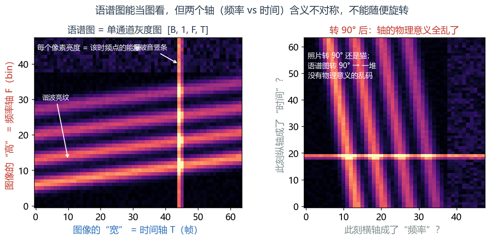
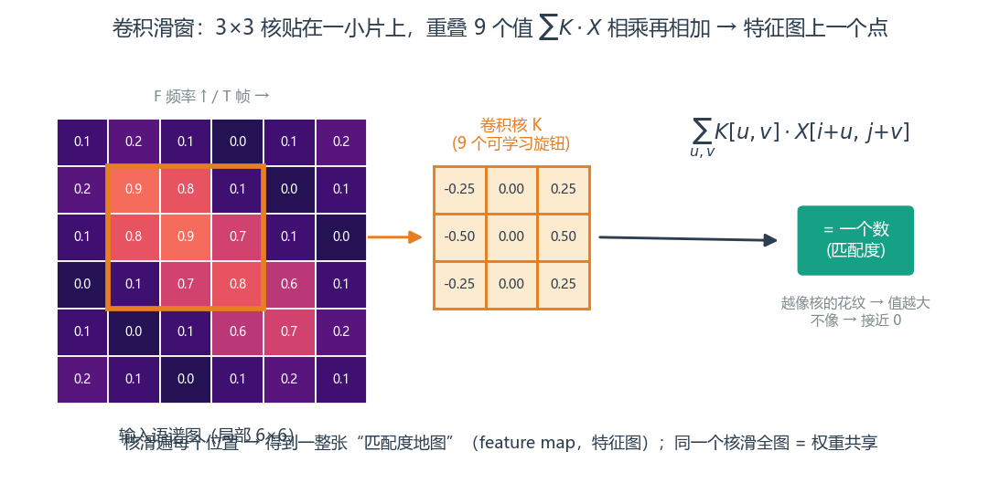
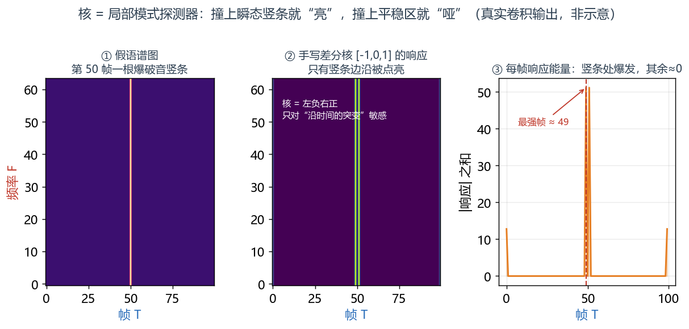
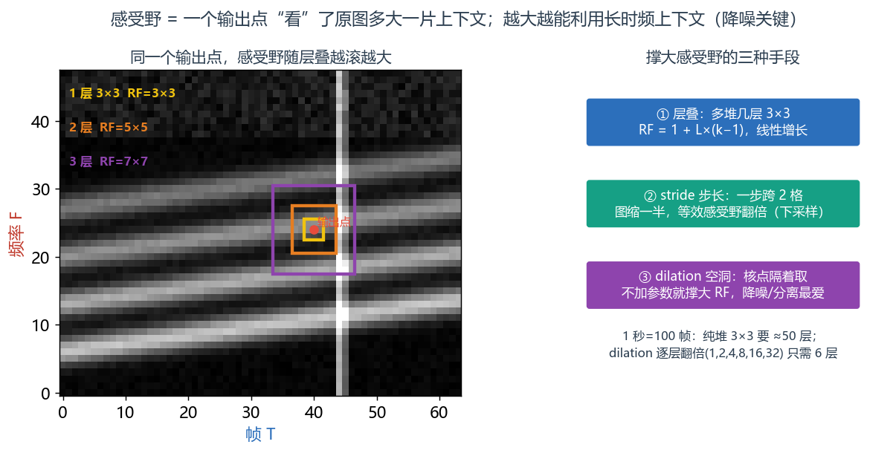
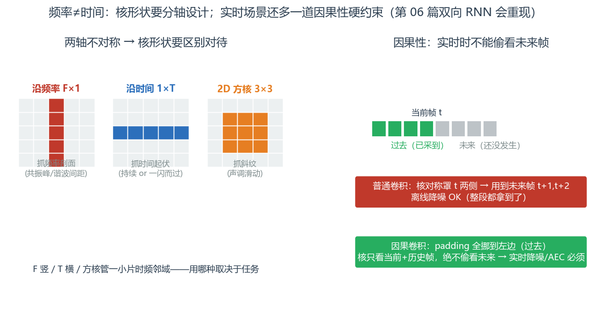

# 第 5 篇｜CNN 处理语谱图：把语谱图当一张图来看

> 一句话核心直觉：语谱图就是一张**单通道灰度图**，而卷积核是一个可学习的**"局部时频模式探测器"**——它像滑动窗口一样在图上扫，专门找谐波斜率、共振峰团、瞬态竖条这些局部花纹；层层叠起来，网络"看到"的上下文就越来越大，这片上下文的大小就叫**感受野**。

---

## 一、先把教材那套扔一边

上一篇结尾我们卡在一个尴尬处：用全连接层处理语谱图，得先把二维的 `[F, T]` **拍扁**成一根长向量。这一拍，时频结构全丢、参数量爆炸、同一个模式换个位置就不认识了。

翻开任何一本讲 CNN 的教材，开篇又是那套——猫狗分类、手写数字、ImageNet。一张彩色图片进去，输出"这是猫还是狗"。作为要做语音的人，你可能会想：**这跟我处理声音有半毛钱关系？**

关系大了，而且桥梁你早就修好了。回到 signals 第 13 篇，你已经把声音变成了那张彩色语谱图——**横轴时间、纵轴频率、颜色深浅是能量**。把那张图的"彩色"去掉，留下"能量强弱"这一个数值通道，它就是一张**单通道灰度图像**：

- 图像的"高" = 频率轴 $F$
- 图像的"宽" = 时间轴 $T$
- 每个像素的"亮度" = 那个时频点的能量

所以 CNN 处理语谱图，跟它处理照片是**同一套运算**。区别只在于：照片里的花纹是猫耳朵、狗鼻子；语谱图里的花纹是谐波、共振峰、瞬态。CNN 不管你花纹叫什么，它只干一件事——**在图上找重复出现的局部模式**。这一篇，我们就把 CNN 这套"看图"的本事，用在语谱图上。

---

## 二、语谱图是图，但两个轴的含义并不对称

先泼一盆冷水，免得你把类比用过头。语谱图**是**一张图，但它和照片有个本质区别：

> **第一个关键认知**：照片的横轴和纵轴是**同质**的——都是空间，把猫的照片转 90 度它还是只猫。可语谱图的两个轴**含义完全不同**：纵轴是**频率**（物理量是 Hz），横轴是**时间**（物理量是秒）。你把语谱图转 90 度，它就成了一堆没有物理意义的乱码。频率轴上"往上挪一格"意味着音调变高，时间轴上"往右挪一格"意味着时刻推后——两者不能混为一谈。

这个不对称会带来实际的设计后果，我们在第五节会看到（比如"沿频率卷积"和"沿时间卷积"要区别对待，比如时间轴上还牵扯因果性）。先把这个认知记住：**语谱图能当图看，但别当成一张可以随便旋转的普通照片。**



*左：语谱图就是一张单通道灰度图 `[B,1,F,T]`——高是频率 F、宽是时间 T、像素亮度是能量。右：转 90° 后两轴的物理含义全乱——照片转 90° 还是猫，语谱图转 90° 却成了没有物理意义的乱码。这就是"能当图看，但别当可旋转的普通照片"。*

维度约定上，沿用本系列第 01 篇定下的规矩，语谱图喂进 CNN 是 **`[B, C, F, T]`**：批次、通道、频率、帧。单通道幅度谱就是 `[B, 1, F, T]`——那个 `1` 就是"单通道灰度图"里的"单"。

---

## 三、卷积核：一个可学习的"局部时频模式探测器"

现在讲 CNN 的心脏——**卷积核（kernel，也叫滤波器）**。

一个 $3\times3$ 的卷积核，就是一个 $3\times3$ 的小数字方块（9 个可学习的旋钮）。它的工作方式：**贴在语谱图的一小片 $3\times3$ 区域上，把重叠的 9 个值对应相乘再相加，得到一个数；然后滑到下一个位置，再算一个数……扫遍整张图，得到一张新图（叫 feature map，特征图）。**

写成公式（离散二维卷积，实际框架里算的是这个）：

$$Y[i, j] = \sum_{u}\sum_{v} K[u, v]\cdot X[i+u,\; j+v]$$

逐字翻译成人话：

- $X[i+u, j+v]$：语谱图上以 $(i,j)$ 为中心的那一小片邻域（$u,v$ 在核的范围内扫）。
- $K[u, v]$：卷积核里的 9 个权重。
- 相乘再求和：**核和这一小片"有多匹配"**——如果这片区域的花纹长得跟核很像，乘加出来的值就很大；不像，就接近 0。
- 滑遍所有 $(i,j)$：把这个"匹配度检测"做到语谱图的每一个位置。



*卷积核就是一个 3×3 的小数字方块（9 个可学习旋钮）：贴在语谱图的一小片上，把重叠的 9 个值 $\sum K\cdot X$ 相乘再相加，得到一个数——这个数就是"这片区域和核有多匹配"。核滑遍每个位置，得到一整张匹配度地图（feature map）。同一个核滑遍全图，就是"权重共享"。*

停一下——你有没有觉得这个 $\sum K\cdot X$ 眼熟？**它就是 signals 第 05 篇你在山洞里推出来的卷积**（严格说 CNN 里是互相关，少了个翻转，但形状和思想一模一样）。当年是"输入和冲激响应做叠加"，现在是"语谱图和一个可学习的小核做匹配"。同一个运算，换了个战场。

那这个核到底在"探测"什么？关键在于：**核里那 9 个数不是人设定的，是网络自己学出来的。** 训练下来，不同的核会自发变成不同花纹的专职探测器：

| 学出来的核长这样 | 它专门探测语谱图里的 | 对应 signals 第 13 篇读图那节 |
|---|---|---|
| 一条斜的亮纹 | 谐波的**斜率**（音调在滑动，如中文声调） | 浊音谐波、上下滑动的语调轨迹 |
| 一团局部高值 | **共振峰**（某几个频率上的能量团） | 区分 a/i/u 的 formant 亮团 |
| 一根竖直的条 | **瞬态/爆破音**（能量瞬间铺满全频段的竖条） | "p""t"那种贯穿全频的宽带竖条 |
| 高频区的杂乱花纹 | **擦音/噪声**（无谐波结构的"雾"） | "s""sh"那片模糊的高频雾 |

> **第二个关键认知**：卷积核就是一个**可学习的局部时频模式探测器**。你不用告诉它"谐波长啥样"，它自己在降噪训练里就会学出一批专门认谐波、认共振峰、认瞬态的核。而且因为**同一个核滑遍全图**（权重共享），"谐波"这个模式无论出现在低频还是高频、出现在句首还是句尾，同一个核都认得——这正好治好了上一篇全连接层"换个位置就不认识"的病，参数量也从上千万降到每个核区区 9 个。

---

## 四、代码实战：一个小 CNN 扫语谱图，看 shape 怎么变

我们搭一个两层的小 CNN，喂一张 `[B, 1, F, T]` 的语谱图进去，一路打印 shape，看看 feature map 是怎么变的、卷积核长什么样。

```python
import torch
import torch.nn as nn

torch.manual_seed(0)

# ---- 造一张语谱图 batch（真实里来自 torch.stft 取幅度）----
B, C, F, T = 8, 1, 257, 100      # 8条样本、单通道、257个频率bin、100帧
spec = torch.rand(B, C, F, T)    # 幅度谱恒非负，用 rand 模拟
print("输入语谱图:", spec.shape)  # [8, 1, 257, 100]  = [B, C, F, T]

# ---- 两层 2D 卷积 ----
conv1 = nn.Conv2d(in_channels=1,  out_channels=16, kernel_size=3, padding=1)
conv2 = nn.Conv2d(in_channels=16, out_channels=32, kernel_size=3, padding=1)
act = nn.ReLU()

# conv1 的权重形状 = [out_ch, in_ch, kH, kW]
print("conv1 核权重:", conv1.weight.shape)  # [16, 1, 3, 3] —— 16个3x3探测器，每个看1个输入通道
print("conv2 核权重:", conv2.weight.shape)  # [32, 16, 3, 3] —— 32个探测器，每个看16个输入通道

# ---- 前向：一层层扫 ----
h1 = act(conv1(spec))     # padding=1 + kernel=3 -> F,T 尺寸不变，只是通道从1变16
print("conv1 输出:", h1.shape)   # [8, 16, 257, 100] —— 16张feature map，每张是一种模式的“匹配度地图”

h2 = act(conv2(h1))       # 通道 16 -> 32
print("conv2 输出:", h2.shape)   # [8, 32, 257, 100]

# ---- 加一个 stride=2 的卷积，看它怎么“缩图”（下采样）----
conv_ds = nn.Conv2d(32, 32, kernel_size=3, stride=2, padding=1)
h3 = conv_ds(h2)
print("stride=2 输出:", h3.shape)  # [8, 32, 129, 50] —— F、T 各减半，感受野随之翻倍

# ---- 单独看一个卷积核的 9 个可学习旋钮 ----
print("conv1 第0个核（看输入通道0）:\n", conv1.weight[0, 0])  # 3x3，训练后会长成某种花纹探测器
```

盯着打印结果，把几个直觉对上号：

- `conv1.weight` 是 `[16, 1, 3, 3]`——**16 个** $3\times3$ 探测器，每个只有 9 个旋钮。对比上一篇全连接层动辄上千万旋钮，参数量天差地别。
- `conv1` 输出 `[8, 16, 257, 100]`——通道从 1 变成 **16**，意思是"我用 16 种不同的探测器各扫了一遍，得到 16 张匹配度地图"。因为 `padding=1`，F、T 尺寸没变。
- `stride=2` 那层把 F、T **各砍一半**变成 `[..., 129, 50]`——这就是下采样，也是下一节要讲的"扩大感受野"的主力手段。

### 亲手做一个"瞬态探测器"，看它怎么点亮竖条

光说"核会学成探测器"太抽象。我们**手动**塞一个专抓竖条的核（不训练，直接写死权重），造一张带"爆破音竖条"的假语谱图，看它是不是真能把竖条点亮。

```python
# 造一张假语谱图：一片平缓背景，第50帧插一根贯穿全频的竖条（模拟爆破音瞬态）
fake = torch.ones(1, 1, 64, 100) * 0.2   # 背景能量0.2
fake[:, :, :, 50] = 1.0                  # 第50帧整列拉满 -> 一根竖条  shape [1,1,64,100]

# 手写一个“时间方向的差分核”：左负右正，只对“沿时间的突变”敏感
edge = torch.tensor([[-1., 0., 1.]]).view(1, 1, 1, 3)  # 形状[out=1,in=1,kH=1,kW=3]
resp = torch.conv2d(fake, edge, padding=(0, 1))        # 手动卷积  shape [1,1,64,100]

# 看响应在哪一帧最强
energy_per_frame = resp.abs().sum(dim=2).squeeze()     # 每帧的响应能量  shape [100]
print("响应最强的帧:", energy_per_frame.argmax().item())   # -> 49或50附近：正好卡在竖条边沿
print("竖条附近响应:", energy_per_frame[48:52])            # 竖条两侧被点亮，平缓区≈0
```

打印会告诉你：响应几乎只在**第 50 帧那根竖条的边沿**爆发，平缓背景区一片死寂（≈0）。这就是"核 = 局部模式探测器"最直白的证据——**这个左负右正的核，对"沿时间的突变"极度敏感，撞上瞬态竖条就亮，撞上平稳区就哑。** 真实 CNN 里没人手写这些数，训练会自动把某些核学成这种瞬态探测器、把另一些学成谐波探测器、共振峰探测器——你只管堆结构，花纹让它自己长。



*上面那段代码的真实卷积输出（非示意）：①一张平缓背景里第 50 帧插了根爆破音竖条；②手写的左负右正差分核 `[-1,0,1]` 只对"沿时间的突变"敏感，响应图里只有竖条边沿被点亮；③每帧响应能量在竖条处爆发、其余处≈0。这就是"核 = 局部时频模式探测器"最直白的证据。*


---

## 五、感受野：这个神经元到底"看"了多大一片上下文

CNN 里最该建立的直觉，是**感受野（receptive field）**——feature map 上的一个点，到底是由**原始语谱图上多大一片区域**算出来的。

单看一层 $3\times3$ 卷积，输出上的一个点只"看"了输入上 $3\times3$ 的一小片。但把两层 $3\times3$ 叠起来呢？第二层的一个点看第一层的 $3\times3$，而第一层每个点又各自看了原图的 $3\times3$——**叠加后，第二层这个点实际看到了原图 $5\times5$ 的范围。** 层越叠越多，感受野越滚越大：

- 层叠（多堆几层 $3\times3$）：感受野线性增长。
- **stride（步长）**：像第四节那样一步跨两格，图缩小一半，等效感受野翻倍。
- **dilation（空洞卷积）**：核的 9 个点不再挨着取，而是隔着取（比如隔一个点），一个 $3\times3$ 核就能罩住 $5\times5$ 的范围，**不增加参数就撑大感受野**——降噪/语音分离网络里非常常用。

为什么死磕感受野？因为它直接决定了**网络能利用多长的上下文**：

> **第三个关键认知**：降噪要判断"当前这个时频点是人声还是噪声"，光看这一个点是判不准的——得看它**前后左右一片**。比如判断某根竖条是爆破音（该保留）还是键盘敲击噪声（该压掉），得看它周围的谐波上下文。感受野太小，网络只能盯着眼前巴掌大的地方做局部判断，抓不住"这段是持续的人声、那段是稳态风扇噪声"这种稍大范围的规律。**降噪效果好不好，很大程度上取决于感受野够不够罩住足够的时频上下文。** 这就是为什么降噪 CNN 要么堆深、要么用空洞卷积——都是为了在不炸显存的前提下把感受野撑大。



*左：同一张语谱图上，一个输出点的感受野随层叠越滚越大——1 层看 3×3、2 层看 5×5、3 层看 7×7。右：撑大感受野的三种手段——①层叠（`RF = 1 + L×(k−1)`，线性增长）、②stride 步长（下采样，等效感受野翻倍）、③dilation 空洞卷积（不加参数就撑大 RF）。想看 1 秒（100 帧）上下文，纯堆 3×3 要约 50 层，dilation 逐层翻倍只需 6 层。*

### 算一笔感受野的账：为什么空洞卷积这么香

给个能上手的公式，算一算"要罩住 1 秒上下文得付多少代价"。$L$ 层卷积、每层核宽 $k$、无 stride 时，时间轴上的感受野是：

$$\text{RF} = 1 + L\times(k-1)$$

翻译：每加一层，感受野就往外扩 $(k-1)$ 格。拿真实数字算——STFT 帧移 10ms 时，1 秒 = 100 帧。想让网络看到 1 秒上下文（RF≈100）：

- **纯堆 $3\times3$ 卷积**（$k=3$，每层 +2）：要 $L\approx 50$ 层。五十层卷积，参数和显存都很吓人。
- **改用空洞卷积**，dilation 逐层翻倍（1,2,4,8,16…）：感受野**指数级**膨胀，$1+2\times(1+2+4+8+16+32)=127$，**6 层**就罩住了 1 秒还有富余，参数量只有前者的零头。

这就是为什么现代降噪/分离网络（如 TCN、Conv-TasNet 那一脉）几乎清一色用**空洞卷积堆栈**——它是"用最少的层和参数换最大感受野"的标准答案。前面代码里那句 `dilation` 参数，威力就在这儿。

---

## 六、频率轴和时间轴，不能一视同仁

回到第二节那个"两轴不对称"的认知，现在它要还债了。$3\times3$ 这种**方核**默认假设"频率方向和时间方向该同等对待"，但很多时候这个假设不成立：

- **沿频率的卷积**（核形状如 $F\times1$，只在频率方向铺开）：专门捕捉"某一时刻，频率轴上的能量分布形状"——比如共振峰的相对位置、谐波的间距（间距对应基频）。说话人识别里很看重这种"频率剖面"。
- **沿时间的卷积**（核形状如 $1\times T$，只在时间方向铺开）：专门捕捉"某个频率上，能量随时间的起伏"——比如某个谐波是持续的（人声）还是一闪而过的（瞬态噪声）。
- **2D 方核**：同时管一小片时频邻域，抓的是"斜纹"这种时频联合模式（如声调滑动）。

到底用哪种、怎么搭配，取决于任务，这里不展开。但有一个跨越时间轴的硬约束必须点明——**因果性**：

> **第四个关键认知（为第 06 篇埋点）**：普通卷积在计算当前帧 $t$ 的输出时，核会同时用到**未来的帧**（比如 $t+1$、$t+2$，因为 padding 让核对称地罩在当前帧两侧）。离线降噪（整段音频拿到手再处理）无所谓，你爱看多少未来看多少。但**实时降噪、实时 AEC** 里，未来的帧**还没发生**——你在处理第 $t$ 帧时，麦克风还没采到第 $t+1$ 帧。这时候必须用**因果卷积（causal convolution）**：把 padding 全挪到左边（过去），保证核只看当前和历史帧，绝不偷看未来。代价是感受野"只往过去伸"，且严格受实时延迟预算约束。



*左：两轴不对称 → 核形状要分轴设计——`F×1` 沿频率抓"频率剖面"（共振峰/谐波间距），`1×T` 沿时间抓"能量随时间的起伏"，`3×3` 方核抓"斜纹"这种时频联合模式。右：普通卷积核对称罩在当前帧两侧、会用到未来帧（离线 OK）；因果卷积把 padding 全挪到左边，只看当前和历史帧——实时降噪/AEC 必须这么做。这个"能不能看未来"的两难，第 06 篇双向 RNN 会原样重现。*

这个"能不能看未来帧"的因果性纠结，不是卷积独有的。到下一篇讲双向 RNN 时，你会看到**一模一样的两难**——离线能双向、实时只能单向。到时候我们再回头呼应这里。

---

## 七、这在工程里解决什么问题

| 工程场景 | CNN 在语谱图上怎么用 |
|---|---|
| **语音降噪** | 多层卷积（常配空洞卷积撑大感受野）在语谱图上提取局部时频模式，末端输出 mask（接第 04 篇 sigmoid、第 08 篇 Mask Loss） |
| **语音分离** | CNN 编码器提时频特征，分辨"哪片能量属于说话人 A、哪片属于 B" |
| **关键词唤醒** | 小卷积核扫描语谱图找唤醒词特有的时频花纹，参数少、能塞进端侧芯片 |
| **说话人识别** | 沿频率的卷积抓"频率剖面/声纹特征"，对说话人身份敏感 |
| **实时 vs 离线** | 实时用因果卷积（只看过去帧）+ 控制层数压延迟；离线可用双向大感受野 |

> **一句话记住**：现代音频算法极少直接啃波形，而是把声音摊成语谱图这张"二维图像"，再用 CNN 的可学习卷积核在上面扫描局部时频模式。看懂"卷积核=模式探测器、感受野=上下文大小、因果性=能不能看未来"，是把 CNN 用到语音上的三把钥匙。

---

## 八、埋一个钩子：可 CNN 的"视野"终究是有限的

CNN 靠堆层、stride、空洞卷积把感受野一点点撑大，看似能覆盖越来越长的上下文。但你有没有发现一个别扭的地方：**要抓多长的依赖，就得堆多少结构去够。**

语音里有些依赖是**很长**的。比如混响的拖尾能拖好几百毫秒（几十上百帧），比如判断"这段停顿是句子结束还是说话人换气"要参考好几秒前的语气，比如一个字的发音会受到它前面整句话语速的影响。**这种跨越几秒、上百帧的长时依赖，用 CNN 去够，要么感受野堆到天上（层数爆炸、显存顶不住），要么空洞卷积把中间信息漏得千疮百孔。** CNN 的视野本质上是"局部的、有限半径的"——它天生擅长抓局部花纹，却不擅长记住"很久以前发生了什么"。

我们需要一种**天生就沿着时间轴、把"记忆"一帧帧往下传递**的结构：处理到第 $t$ 帧时，它手里攥着一份浓缩了"从开头到现在发生过的一切"的记忆，用它来帮判断当前帧。这样，多久以前的信息理论上都能顺着时间链传到现在，不用靠堆感受野硬够。

这种沿时间递推、带记忆的结构，就是**循环神经网络（RNN）**。下一篇（第 06 篇），我们就从语音"是一段时间序列"这个最朴素的事实出发，看 **RNN/LSTM/GRU 是怎么沿时间递推、又怎么和上一篇的反传直觉扯上"沿时间连乘"的梯度麻烦**。

---

## 本篇小结

- **语谱图 = 单通道灰度图 `[B,1,F,T]`**：CNN 处理它和处理照片是同一套运算，只是花纹换成了谐波、共振峰、瞬态。但两轴（频率 vs 时间）含义不对称，别当可旋转的普通照片。
- **卷积核 = 可学习的局部时频模式探测器**：$\sum K\cdot X$ 就是 signals 第 05 篇那个卷积；核里的旋钮自学成谐波/共振峰/瞬态探测器；权重共享让"同一模式换位置也认得"，参数量比全连接小几个数量级。
- **感受野 = 看多大一片上下文**：靠层叠/stride/dilation 撑大；降噪要够大的感受野才能抓住足够的时频上下文。
- **两轴不对称 + 因果性**：沿频率卷积抓频率剖面、沿时间卷积抓时间起伏；实时场景必须用因果卷积（不偷看未来帧）——这个两难第 06 篇双向 RNN 会重现。
- **工程意义**：降噪、分离、唤醒、说话人识别都在语谱图上跑 CNN；实时/离线的分野落在因果性和感受野预算上。
- **下一步**：CNN 感受野有限、难抓跨越几秒的长时依赖——RNN 沿时间递推、把记忆一帧帧传下去。
