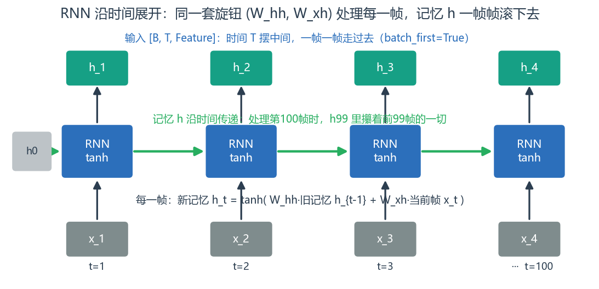
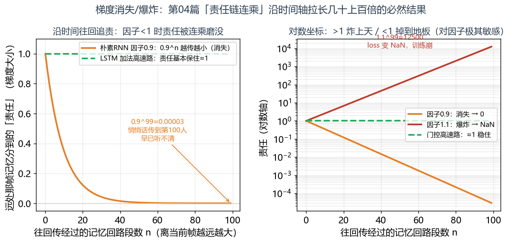
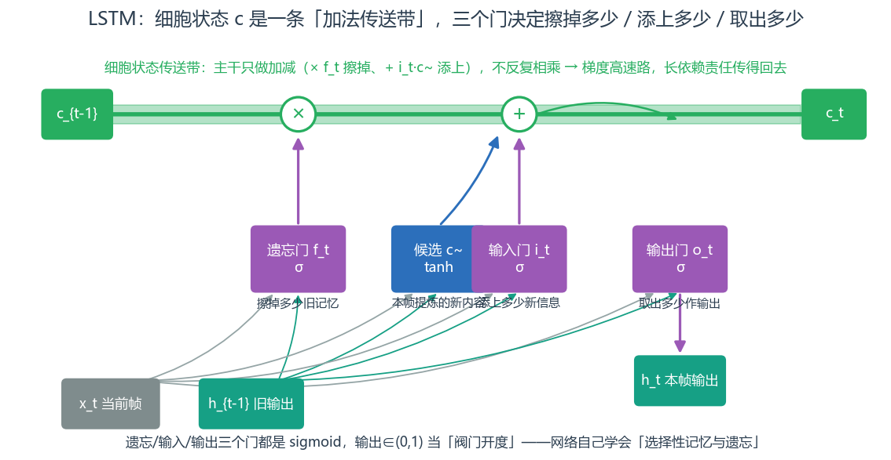
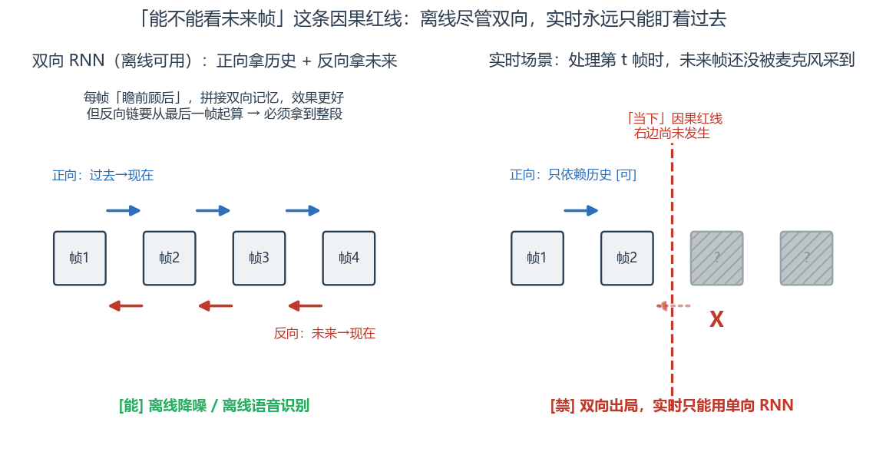

# 第 6 篇｜RNN / LSTM / GRU 与时序：让网络"记住"刚才说了什么

> 一句话核心直觉：RNN 就是把一份**记忆（隐状态）**沿着时间轴一帧帧往下传，处理当前帧时手里攥着"从开头到现在发生过的一切"；可这份记忆在长序列上会因**梯度沿时间连乘**而悄悄消失或炸掉——LSTM/GRU 用**门控**给记忆开一条高速路，才把长依赖救活。

---

## 一、先把教材那套扔一边

上一篇结尾我们承认了 CNN 的软肋：它的视野是局部的、有限半径的，要抓跨越几秒、上百帧的长时依赖，就得把感受野堆到显存顶不住。而语音里这种长依赖遍地都是——混响拖尾、语速对发音的影响、句子层面的语气。

翻开教材讲 RNN，又是那张"展开成一长串的网络图"，配一个下标满天飞的公式 $h_t = \tanh(W_{hh}h_{t-1} + W_{xh}x_t + b)$，然后直接开始推 BPTT（沿时间反向传播）。当年我看着那串下标，完全 get 不到它到底比全连接强在哪。

所以还是老规矩，扔一边。换个你天天打交道的东西切入：**驱动层的 ring buffer 和流式处理**。

你写实时音频处理时，数据是一帧一帧来的。你不会（也没法）等一整段音频到齐再处理，而是**来一帧、处理一帧**。而且关键是——**处理这一帧时，你手里往往还攥着"上一帧留下的状态"**：上一帧的滤波器内部状态、上一帧的能量估计、AEC 里上一帧更新到一半的权重……你**把状态从上一帧带到这一帧，一帧帧滚下去**。

**RNN 干的就是这件你无比熟悉的事。** 它处理语音序列时，来一帧、更新一次"记忆"，把记忆传给下一帧。所谓"记忆"，就是一个向量——它浓缩了"到目前为止这段语音发生了什么"。这一篇，我们就把这套"带记忆的流式处理"讲透，顺便解决它那个著名的老毛病。

---

## 二、RNN：把记忆沿时间一帧帧传下去

先把维度定清楚。RNN 吃的是**序列**，按本系列第 01 篇的约定、且全系列统一用 `batch_first=True`，输入形状是 **`[B, T, Feature]`**：批次、时间帧数、每帧的特征维度。注意这和 CNN 的 `[B, C, F, T]` 不同——RNN 把**时间 T 摆在中间当"要一帧帧走过去的轴"**，每一帧是一个长度 `Feature` 的向量（比如一帧幅度谱的 $F$ 个 bin）。

RNN 的核心就一个递推公式：

$$h_t = \tanh(W_{hh}\,h_{t-1} + W_{xh}\,x_t + b)$$

逐字翻译成人话：

- $x_t$：**当前这一帧**的输入（比如第 $t$ 帧的频谱）。
- $h_{t-1}$：**上一帧传下来的记忆**（隐状态，hidden state）——这就是从上一帧滚过来的"状态"。
- $W_{xh}x_t$：当前帧带来的**新信息**。
- $W_{hh}h_{t-1}$：把**旧记忆**做一次变换，决定它有多少延续到现在。
- 两者相加再 $\tanh$ 掰弯：**融合"旧记忆 + 新信息"，得到当前帧的新记忆 $h_t$**。
- $h_t$ 接着传给下一帧，如此滚下去。

> **第一个关键认知**：RNN 和全连接层最大的区别，是它多了一条 $h_{t-1}\to h_t$ 的**记忆回路**。处理第 100 帧时，它手里的 $h_{99}$ 理论上浓缩了前 99 帧的全部信息——所以"很久以前发生的事"能顺着这条记忆链一路传到现在，不用像 CNN 那样靠堆感受野硬够。而且注意 $W_{hh}$、$W_{xh}$ 这套旋钮**所有时刻共享**（就像 CNN 卷积核滑遍全图一样），所以序列多长，参数量都不变。



*把 RNN 按时间步「拉开」看：同一套旋钮 $(W_{hh}, W_{xh})$ 重复处理每一帧，绿色那条水平链就是记忆 $h$——它从 $h_0$ 出发，一帧帧滚下去，处理第 100 帧时 $h_{99}$ 里攥着前 99 帧的一切。输入 `[B, T, Feature]`、时间 T 摆中间，正是「来一帧、更新一次记忆」的流式处理。*

看起来很美。但这条记忆链有个致命隐患，藏在"沿时间连乘"这五个字里。

---

## 三、梯度消失与爆炸：第 04 篇那条责任链，被拉长成了时间轴

还记得第 04 篇的反传吗？我们顺着一条**责任链**往回问"谁错了多少"，靠链式法则**把责任一路连乘着传回去**。当时我特意提醒你记住"沿链连乘"这个结构——现在它要还债了。

RNN 训练时，误差不光要在层之间往回传，还要**沿着时间轴一帧帧往回传**（这就是 BPTT，沿时间反向传播）。假设序列有 100 帧，要把第 100 帧的误差追责到第 1 帧的记忆，链式法则就得穿过 $h_{100}\to h_{99}\to\cdots\to h_1$ 整整 99 段记忆回路。每穿过一段，责任就要乘上一个跟 $W_{hh}$ 有关的因子。写意一点：

$$\frac{\partial L}{\partial h_1} \;\propto\; \underbrace{(W_{hh})\times(W_{hh})\times\cdots\times(W_{hh})}_{\text{约 99 个因子连乘}}$$

逐字翻译：**当前帧的误差要追责到很久以前的那份记忆，得连乘几十上百个因子。** 而连乘几十个数，结果对每个因子的大小极其敏感：

- 如果这些因子普遍**小于 1**（比如 0.9），$0.9^{99}\approx 0.00003$——责任传到远处几乎归零。这就是**梯度消失（vanishing gradient）**。
- 如果普遍**大于 1**（比如 1.1），$1.1^{99}\approx 12500$——责任传到远处炸成天文数字。这就是**梯度爆炸（exploding gradient）**。

> **第二个关键认知**：梯度消失/爆炸不是什么新妖怪，它就是第 04 篇那条"责任链连乘"沿时间轴拉长了几十上百倍的必然结果。打个比方——梯度消失像**一句悄悄话传了 100 个人，传到最后早已听不清**：远处那份记忆到底对当前的错误负多少责任，网络根本算不清，于是它**学不会长依赖**（几秒前的语气、混响拖尾的因果，全丢）。梯度爆炸则相反，责任大到把旋钮一步拧飞，loss 直接变 `NaN`，训练当场崩掉。



*用 numpy 真跑连乘：从最后一帧往回追责，每穿过一段记忆回路就乘一个因子。左图线性坐标——因子 0.9 时 $0.9^{99}\approx0.00003$，责任传到远处几乎归零（消失）；右图对数坐标同时摆出两个极端——因子 1.1 时 $1.1^{99}\approx12500$ 炸上天（loss 变 NaN）。绿色虚线是 LSTM 的加法高速路：责任沿途稳在 1 附近，长依赖救得回来。*

爆炸相对好治：**梯度裁剪（gradient clipping）**——给梯度范数设个上限，超了就按比例缩回去，简单粗暴但有效，RNN 训练几乎必开。消失才是真正难缠的，因为它是"信息悄悄流失"，不报错、不崩溃，只是模型学不好长依赖，你还查不出哪错了。真正治好消失的，是下一节的门控结构。

---

## 四、LSTM / GRU：给记忆修一条"梯度高速路"

梯度消失的病根，在于那条记忆回路每传一帧就要**乘**一次 $W_{hh}$、再过一次 $\tanh$——反复相乘，信息就在连乘里被磨没了。

LSTM（长短期记忆网络）的破局思路极其漂亮：**另开一条记忆通道，让信息在上面主要靠"加法"流动，而不是反复相乘。** 这条通道叫**细胞状态（cell state）** $c_t$，你可以把它想象成一条**沿时间铺开的传送带**——信息放上去后，默认就一路平移传下去，中途只做"擦掉一点、添上一点"的**加减**，不做反复相乘。因为主干靠加法，梯度沿这条带子往回传时不会被连乘磨没，长依赖的责任就能传得回去。这就是那条**梯度高速路**。

而"什么时候该擦、擦多少、添什么"，由三个**门（gate）**控制。每个门就是一个 sigmoid（还记得第 04 篇吗？sigmoid 输出落在 $(0,1)$，天然是个"阀门开度"），逐门翻译成人话：

- **遗忘门 $f_t$**：看着当前帧和旧记忆，决定**传送带上的旧信息该擦掉多少**（0 = 全忘，1 = 全留）。比如说话人从 A 换成 B 了，就该把 A 的一些记忆擦掉。
- **输入门 $i_t$**：决定**当前帧的新信息，该往传送带上添多少**。遇到有信息量的浊音帧就多添点，遇到静音帧就少添。
- **输出门 $o_t$**：决定**从传送带上取多少信息，作为当前帧对外输出的 $h_t$**。记着不代表每帧都要用。

传送带的更新核心就一句（其余细节先略）：

$$c_t = f_t \odot c_{t-1} + i_t \odot \tilde{c}_t$$

逐字翻译：**新的传送带内容 = 遗忘门决定留下的旧内容（$f_t\odot c_{t-1}$）+ 输入门决定添上的新内容（$i_t\odot\tilde c_t$）。** 注意主运算是**加法**——这就是梯度不被连乘磨没的关键。$\odot$ 是逐点相乘（门开度 × 内容）。

> **第三个关键认知**：门控的本质是让网络**自己学会"选择性记忆和遗忘"**——该记的（人声的谐波演化）用输入门放进传送带、遗忘门保住；该忘的（过时的噪声瞬态）用遗忘门擦掉。信息在传送带上主要靠加减流动，避开了反复连乘，梯度消失就被治住了，几十上百帧的长依赖终于学得动。



*顶部那条绿色粗线就是细胞状态 $c$ 的「传送带」：主干只做 $\times f_t$（遗忘门擦掉旧的）和 $+\,i_t\cdot\tilde c_t$（输入门添上新的）这两个加减运算，不反复相乘，梯度沿它往回传不会被磨没——这就是那条梯度高速路。底部 $x_t$ 与 $h_{t-1}$ 汇入三个紫色的门（都是 sigmoid，开度 $\in(0,1)$）：遗忘门管擦、输入门管添、输出门管从传送带取多少作本帧输出 $h_t$。*

**GRU（门控循环单元）**是 LSTM 的精简版：把三个门砍成两个（更新门 + 重置门），并把细胞状态和隐状态合并成一条。参数更少、算得更快，长依赖能力和 LSTM 相当。工程上一个朴素经验：**先上 GRU，它更轻更快；效果差一口气或序列特别长，再换 LSTM。**

---

## 五、代码实战：LSTM 建模序列，亲眼看梯度沿时间衰减

先跑通一个 LSTM 对 `[B, T, Feature]` 序列的建模，打印各种 shape；再做个小实验，**亲眼看普通 RNN 的梯度是怎么沿时间越传越小的**（梯度消失的实锤）。

```python
import torch
import torch.nn as nn

torch.manual_seed(0)

# ==== Part 1: 一个 LSTM 对语音序列建模，看清 shape ====
B, T, Feat = 4, 100, 257     # 4条样本、100帧、每帧257个频率bin（幅度谱一列）
x = torch.rand(B, T, Feat)   # 全系列统一 batch_first：时间T在中间
print("输入序列 x:", x.shape)  # [4, 100, 257] = [B, T, Feature]

hidden = 128
lstm = nn.LSTM(input_size=Feat, hidden_size=hidden,
               num_layers=1, batch_first=True)   # batch_first=True 是全系列铁律

out, (hN, cN) = lstm(x)
# out : 每一帧都吐一个隐状态 h_t —— 用于逐帧任务（如逐帧mask）
print("每帧输出 out:", out.shape)   # [4, 100, 128] = [B, T, hidden]
# hN/cN : 只有最后一帧的隐状态/细胞状态 —— 用于整段级任务（如说话人识别）
print("末帧隐状态 hN:", hN.shape)   # [1, 4, 128] = [num_layers, B, hidden]
print("末帧细胞态 cN:", cN.shape)   # [1, 4, 128] —— 这就是那条“传送带”传到最后的内容

# ==== Part 2: 用普通 RNN 亲眼看梯度沿时间衰减（梯度消失实锤）====
Tlong = 80
rnn = nn.RNN(input_size=8, hidden_size=8, batch_first=True)  # 朴素RNN，无门控
xs = torch.randn(1, Tlong, 8, requires_grad=True)
outs, _ = rnn(xs)                     # outs: [1, 80, 8]
loss = outs[:, -1, :].sum()           # 损失只定义在【最后一帧】
loss.backward()                       # 误差要沿时间一路传回第1帧

# 看输入端每一帧拿到的梯度范数：越靠前（离最后一帧越远）应越小
gnorm = xs.grad.norm(dim=2).squeeze() # 每帧一个梯度范数，shape [80]
print("第 1  帧梯度范数:", gnorm[0].item())    # 离损失最远 -> 极小（责任传丢了）
print("第 40 帧梯度范数:", gnorm[39].item())
print("第 80 帧梯度范数:", gnorm[-1].item())   # 离损失最近 -> 最大
print("末帧/首帧 比值:", (gnorm[-1] / (gnorm[0] + 1e-12)).item())  # 通常大得离谱
```

盯着 Part 2 的打印，梯度消失就摆在你眼前：

- **第 1 帧的梯度范数远小于第 80 帧**——损失定义在最后一帧，误差沿时间往回传时被连乘磨得越来越弱，传到第 1 帧几乎归零。这就是第三节公式的实锤：**远处那份记忆的责任，网络根本算不清。**
- "末帧/首帧比值"通常大到离谱，直观说明"越久以前的帧，越使不上劲"。
- 把 `nn.RNN` 换成 `nn.LSTM` 再跑，这个衰减会明显缓和——门控的传送带把长依赖的责任救回来了。

Part 1 里要特别记住 `out` 和 `hN` 的分工：**逐帧任务（降噪要给每帧出 mask）用 `out`（每帧都有输出），整段任务（说话人识别只要一个身份判断）用 `hN`（末帧的浓缩记忆）。** 选错了 shape 就对不上。

### 顺手做两件工程上天天做的事：数参数、裁梯度

第四节说"GRU 比 LSTM 轻"、第三节说"爆炸用梯度裁剪治"，都别停在嘴上，用两行代码坐实：

```python
# 1) 数一数 LSTM vs GRU 的参数量，看"GRU更轻"轻多少
feat, hid = 257, 128
n_lstm = sum(p.numel() for p in nn.LSTM(feat, hid, batch_first=True).parameters())
n_gru  = sum(p.numel() for p in nn.GRU (feat, hid, batch_first=True).parameters())
print(f"LSTM 参数量: {n_lstm}   GRU 参数量: {n_gru}   GRU/LSTM = {n_gru/n_lstm:.2f}")
# GRU≈LSTM的3/4：LSTM有4组门权重(遗忘/输入/输出/候选)，GRU只有3组(更新/重置/候选)

# 2) 梯度裁剪：治梯度爆炸的标准动作，RNN 训练几乎必开
#    在 loss.backward() 之后、optimizer.step() 之前插一句：
#    torch.nn.utils.clip_grad_norm_(model.parameters(), max_norm=5.0)
#    含义：把所有梯度拼成一个大向量，若其范数超过5.0就整体按比例缩回5.0，
#    相当于给"责任"设了个天花板——责任再大，一步也不许把旋钮拧飞。
grads = torch.tensor([3.0, 4.0])          # 假设某步梯度范数=5（=√(9+16)）
clipped = grads * (5.0 / max(grads.norm(), 5.0))  # max_norm=5，未超则不动
print("裁剪前范数:", grads.norm().item(), " 裁剪后范数:", clipped.norm().item())
```

`GRU/LSTM≈0.75` 这个比值就是"GRU 更轻"的量化版——门少一组，参数省四分之一，实时端侧模型很吃这点。梯度裁剪那句 `clip_grad_norm_` 更是 RNN 训练的保命符：它不改梯度方向、只压过大的幅度，专治第三节那个"$>1$ 连乘炸成天文数字、loss 变 NaN"的爆炸。

---

## 六、双向 RNN：离线降噪的利器，实时场景的禁区

前面的 RNN 都是**单向**的——记忆只从过去流向现在（$h_{t-1}\to h_t$）。但有些判断，光看历史不够，得**参考未来**：判断第 $t$ 帧那个音到底是什么，往往要看它后面接了什么。

**双向 RNN（bidirectional RNN）**就是为此生的：跑两条 RNN，一条从头到尾（正向，拿历史），一条从尾到头（反向，拿未来），把两个方向的记忆拼起来。每一帧都同时"瞻前顾后"，效果通常比单向好一截。语音里离线降噪、离线语音识别都爱用。

但这里藏着一个**必须点破的工程陷阱**：

> **第四个关键认知**：双向 RNN 的反向那条链，要从**序列最后一帧**开始算——也就是说，**你必须拿到整段音频，才能算出任何一帧的输出**。这对离线处理（整段录音拿到手再跑）毫无问题；但对**实时降噪、实时 AEC 是致命的**——处理第 $t$ 帧时，未来的帧还没被麦克风采到，反向链根本无从算起。所以**实时/低延迟场景里，双向 RNN 直接出局，只能用单向 RNN**（只依赖历史）。



*左边离线：正向链（蓝，拿历史）+ 反向链（红，拿未来）双管齐下，每帧瞻前顾后——但反向链要从最后一帧起算，必须整段到齐。右边实时：处理到「当下」红线时，右侧未来帧还没被采到（灰色打叉），反向链无从算起，双向直接出局，只能退回单向。这条「能不能看未来」的红线，和第 05 篇因果卷积是同一道两难。*

这个纠结你是不是觉得眼熟？**这正是上一篇第六节因果卷积那个两难的翻版**——普通卷积会偷看未来帧，实时就得换因果卷积（padding 全挪到过去）；同理，双向 RNN 会依赖未来帧，实时就得退回单向 RNN。**"能不能看未来"这条红线，横在所有实时音频模型面前，不管你用的是 CNN 还是 RNN。** 记住这条因果性约束：离线可以为所欲为地双向、大感受野；实时永远只能盯着过去。

---

## 七、这在工程里解决什么问题

| 工程场景 | RNN/LSTM/GRU 怎么用 | 单向还是双向 |
|---|---|---|
| **实时语音降噪** | 单向 LSTM/GRU 逐帧出 mask，只依赖历史帧，压低延迟 | 单向（因果） |
| **离线语音降噪/分离** | 双向 LSTM 瞻前顾后，效果更好 | 双向 |
| **说话人识别** | 取末帧隐状态 `hN` 作为整段声纹的浓缩表示 | 视场景 |
| **语音识别 / TTS 时长建模** | LSTM/GRU 建模音素/字的时序演化与长依赖 | 离线双向、流式单向 |
| **训练崩成 NaN** | 十有八九是梯度爆炸——加梯度裁剪（clip norm） | —— |
| **学不动长依赖** | 用朴素 RNN 遇到梯度消失——换 LSTM/GRU（门控高速路） | —— |

> **一句话记住**：语音是时间序列，RNN 靠一条沿时间传递的记忆链去建模"当前依赖历史"；朴素 RNN 会被梯度沿时间连乘打垮（消失/爆炸），LSTM/GRU 用门控给记忆开加法高速路救活长依赖。而"能不能看未来帧"这条因果红线，决定了你只能用单向还是能上双向。

---

## 八、埋一个钩子：等一下，我们从头到尾扔掉了一半信息

到这里，处理声音的三种视角我们凑齐两种了——CNN 把语谱图当图看、RNN 沿时间递推。但如果你回头把前面几篇串起来看，会发现一个从第 01 篇就埋下、我们一直假装没看见的问题：

**从头到尾，我们喂给网络的都是语谱图的「幅度」。**

第 04 篇的 mask 贴在幅度谱上、第 05 篇 CNN 扫的是幅度谱、这一篇 RNN 建模的还是幅度谱那一列列 bin。可 signals 第 08 篇早就讲透了：STFT 出来的是**复数谱**，它有幅度、**也有相位**。我们从进模型的第一步（第 01 篇 `torch.stft` 拿到 complex64 时，我特意提醒过"相位先留着别急着扔"）就把相位 `.abs()` 掉了，一路只玩幅度。

问题是——**相位真的能扔吗？** 降噪时，你预测出一个干净的幅度谱，可要把它变回能听的波形（iSTFT），得配一个相位。工程里长期用**带噪信号的相位**来凑，结果就是：幅度降得再干净，那个从噪声里借来的相位一叠加，音质就有种说不出的"金属感、毛刺感"。因为相位里藏着波形的对齐结构、藏着谐波之间的相对位置关系——**它根本不是可以随便丢的噪声，它是语音的一半。**

那能不能让网络**直接在复数上学**，幅度和相位一起建模？这就要求我们的线性层、卷积、激活全都得能吃复数、吐复数。下一篇（第 07 篇），我们就推开**复数神经网络**的门，看看 $y=Wx+b$ 在复数世界里长什么样、为什么说"语音离不开复数网络"。

---

## 本篇小结

- **RNN**：把记忆（隐状态 $h_t$）沿时间一帧帧传下去，处理当前帧时手握"至今发生的一切"，天生适合语音这种时间序列；输入统一 `[B, T, Feature]` + `batch_first=True`。
- **梯度消失/爆炸**：就是第 04 篇"责任链连乘"沿时间轴拉长的版本——因子 <1 越乘越小（记忆传丢、学不动长依赖），>1 越乘越炸（loss 变 NaN）。爆炸用梯度裁剪治，消失靠门控治。
- **LSTM/GRU**：用细胞状态这条"加法传送带"当梯度高速路，配遗忘/输入/输出门做选择性记忆与遗忘，救活长依赖；GRU 是 LSTM 的轻量版，工程上常先试 GRU。
- **双向 RNN**：瞻前顾后、效果更好，但要拿到整段才能算——离线可用、**实时禁用**（只能单向）。这条"能不能看未来"的因果红线，和第 05 篇因果卷积是同一个两难。
- **工程意义**：实时降噪用单向门控 RNN 逐帧出 mask、离线用双向；说话人识别取末帧记忆；训练崩了先查梯度爆炸。
- **下一步**：前面从头到尾只用幅度谱、把相位扔了——可相位是语音的一半，下一篇让网络直接在复数上学。
