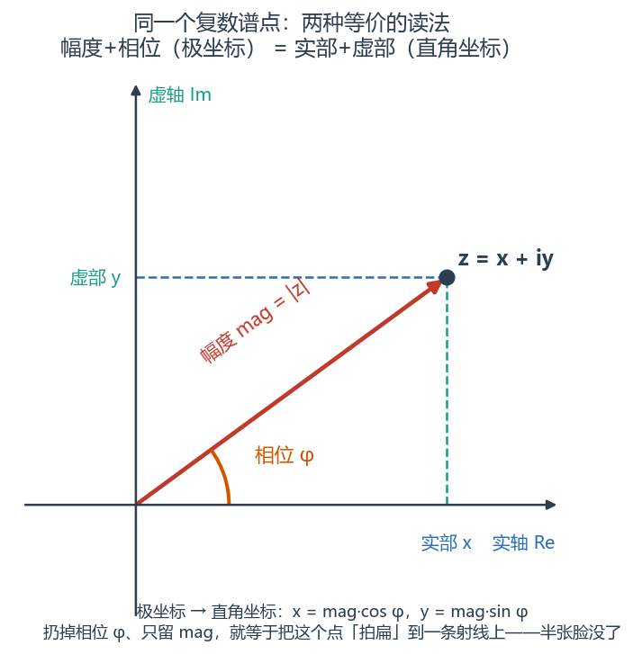
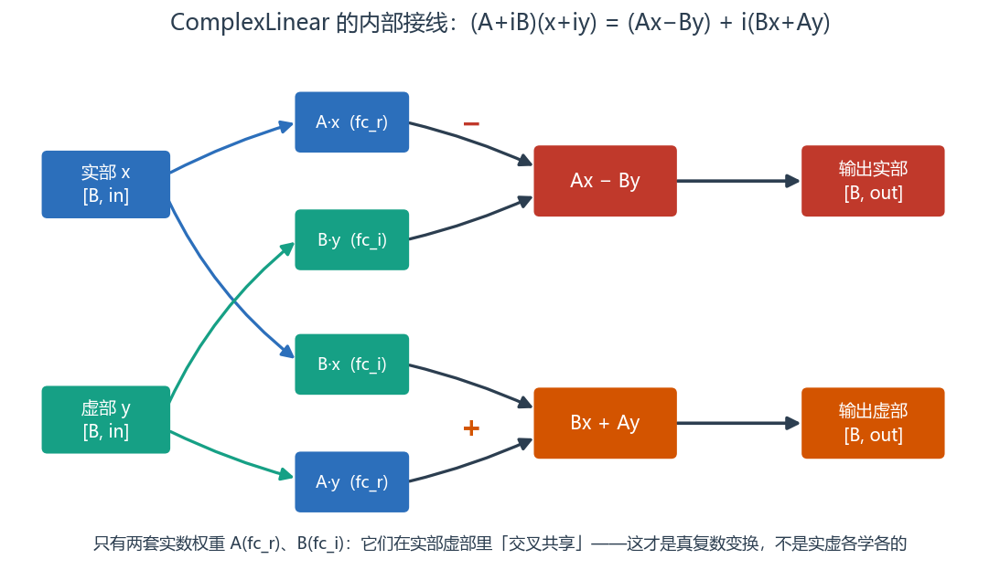
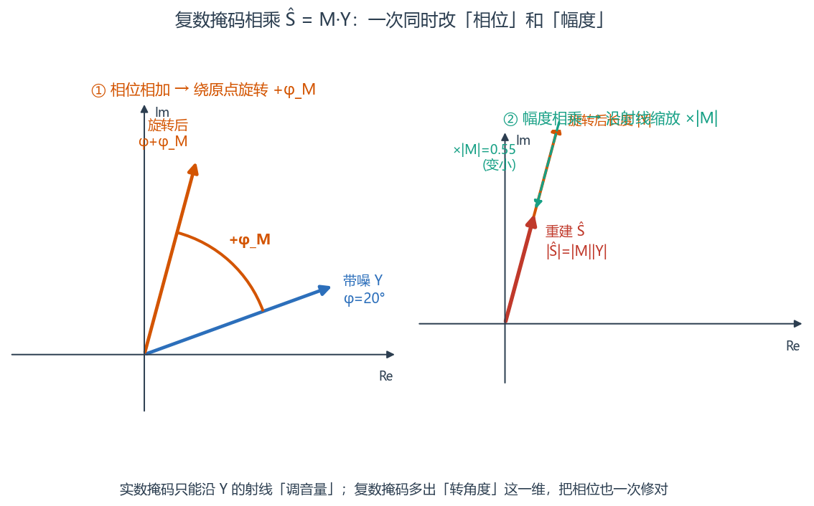
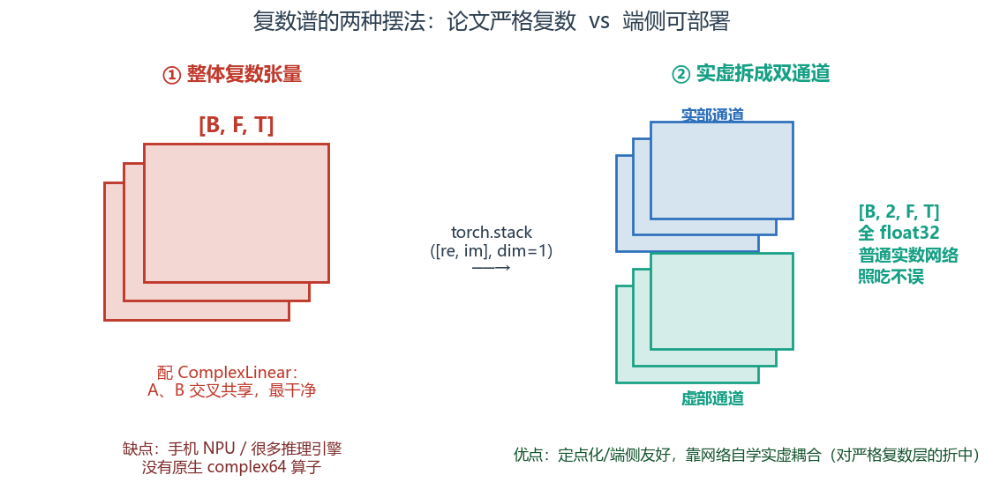

# 第 7 篇｜复数神经网络基础：语音离不开的那半张脸

> 一句话核心直觉：前六篇我们一直在喂网络"幅度谱"，把相位当垃圾扔了。可复数谱本来是一个整体，硬拆掉相位就像把一段录音只留音量、抹掉节奏。**复数线性层，就是让网络在幅度和相位上一起学的那把钥匙。**

---

## 一、先把教材那套扔一边：我们一直在丢掉半张脸

上一篇讲 RNN/LSTM 时，我埋了个钩子：**前面所有网络，输入的都是幅度谱 `[B, C, F, T]`，相位被我们随手扔了。** 这一篇就来还这笔债。

先回忆一下你在信号与系统第 8 篇亲手做过的那个"后背发凉的实验"：把两段声音的**幅度谱**和**相位谱**交叉互换、再重建，结果听起来更像**提供相位**的那一段。当时的结论掷地有声——

> 相位承载了信号的时间结构，也就是"内容"本身。瞬态、节奏、方位、拼接，命都攥在相位手里。

可我们前六篇是怎么干的？`stft` 出来一个复数谱，我们 `.abs()` 取幅度，喂进 CNN、喂进 LSTM，训练出一个 mask，再把 mask 乘回幅度谱……**相位呢？** 绝大多数入门降噪流程里，相位是直接"借用"带噪信号的原始相位——反正听不太出来，先凑合。

这个"凑合"，就是今天要正面刚的问题。

先摆清楚三件事，你就明白相位为什么不能一直凑合下去：

1. **降噪/分离要恢复的是干净语音，它的相位和带噪相位并不一样。** 信噪比越低，两者差得越远。你用带噪相位去配干净幅度，重建出来的波形就是拧巴的——幅度对了，时间结构还是脏的。
2. **幅度谱 MSE 再小，波形也可能不对。** 因为同一份幅度谱配不同相位，能重建出千差万别的波形（这正是第 8 篇实验的另一面）。只优化幅度，等于放任相位自由发挥。
3. **人耳对相位失真并非无感。** 尤其是瞬态丰富的辅音、打击乐、多说话人分离的边界处，相位一乱，就"糊"。

> **第一个关键认知**：复数谱 `X = mag · e^{jφ}` 是一个不可分割的整体。把它拆成幅度和相位、只喂幅度给网络，等于一开始就把一半信息扔进了垃圾桶。**复数神经网络的出发点，就是让网络直接吃下完整的复数谱，在实部虚部（等价于幅度相位）上一起学。**



*复平面上的一个点有两种等价读法：极坐标（幅度 mag + 相位 φ）和直角坐标（实部 x + 虚部 y），`x = mag·cos φ、y = mag·sin φ` 在两者间换算。每次 `.abs()` 只留幅度、扔掉相位 φ，就等于把这个点「拍扁」到一条射线上——这就是被丢掉的那半张脸。*

那怎么让一个只会做实数矩阵乘法的网络，去处理复数？这就要请出复数线性层。

---

## 二、复数线性层：一次复数乘法，拆成四次实数乘法

普通的全连接层（第 4 篇）你已经很熟了：

$$y = Wx + b$$

翻译成人话：拿一个权重矩阵 $W$ 去乘输入向量 $x$，再加个偏置。$W$、$x$、$y$ 全是实数。

现在把它复数化。输入不再是实数向量，而是一个**复数向量** $z$；权重也变成**复数矩阵** $W$。我们把它们各自拆成实部和虚部：

$$z = x + iy, \qquad W = A + iB$$

逐字翻译：

- $z = x + iy$：复数输入。$x$ 是它的实部（比如复数谱的实部通道），$y$ 是虚部。两者都是实数张量。
- $W = A + iB$：复数权重。$A$ 是权重的实部矩阵，$B$ 是虚部矩阵。两者都是实数矩阵，**都是可学习参数**。

复数线性层要算的，就是复数乘法 $Wz$。按中学复数乘法规则展开：

$$Wz = (A + iB)(x + iy) = \underbrace{(Ax - By)}_{\text{实部}} + i\underbrace{(Bx + Ay)}_{\text{虚部}}$$

这个式子是整篇的核心，逐项翻译成人话：

- **实部 $Ax - By$**：输出的实部，由"实权重乘实输入"减去"虚权重乘虚输入"得到。
- **虚部 $Bx + Ay$**：输出的虚部，由"虚权重乘实输入"加上"实权重乘虚输入"得到。
- 一次复数矩阵乘法，落到工程上就是 **4 次实数矩阵乘法**（$Ax$、$By$、$Bx$、$Ay$）再做两次加减。

> **第二个关键认知**：我们根本不需要一个"会算复数"的特殊算子。一个复数线性层 = **两套普通的实数 `nn.Linear`（一套是 $A$，一套是 $B$），按上面的加减法拼起来**。这就是为什么复数网络能跑在任何只支持实数的框架/硬件上——它本质是实数运算的一种特定接线方式。



*一次复数乘法在工程上落成 4 次实数矩阵乘法（$Ax、By、Bx、Ay$）：实部走 $Ax-By$、虚部走 $Bx+Ay$。整层只有两套实数权重 $A$（`fc_r`）、$B$（`fc_i`），它们在实部虚部两条输出线里「交叉共享」——正是这种耦合让它成为真正的复数变换，而不是实虚各学各的双通道。*

注意一个容易被忽略的点：$A$ 和 $B$ 在实部和虚部里是**交叉共享**的（实部用到了 $A$ 和 $B$，虚部也用到了 $A$ 和 $B$）。正是这种交叉耦合，让网络学到的变换是"真正的复数线性变换"，而不是把实部虚部当成两个互不相干的实数通道各学各的。这一点，是复数网络和"实虚双通道普通网络"的本质区别。

---

## 三、代码实战：手写 ComplexLinear，并验证它真的在算复数

我们用两套实数 `nn.Linear` 拼一个 `ComplexLinear`，然后拿它处理一段复数谱，最后用 PyTorch 原生的复数张量手算一遍，验证两条路结果一致。

```python
import torch
import torch.nn as nn

torch.manual_seed(0)

class ComplexLinear(nn.Module):
    """复数线性层: 输入复数, 输出复数.
    内部用两套实数 Linear 表示复权重 W = A + iB.
    """
    def __init__(self, in_features, out_features, bias=True):
        super().__init__()
        # fc_r 承载权重实部 A, fc_i 承载权重虚部 B
        self.fc_r = nn.Linear(in_features, out_features, bias=bias)  # A
        self.fc_i = nn.Linear(in_features, out_features, bias=bias)  # B

    def forward(self, x_real, x_imag):
        # 输入: 实部 x_real, 虚部 x_imag, 各 shape [B, in_features]
        # (A + iB)(x + iy) = (Ax - By) + i(Bx + Ay)
        out_real = self.fc_r(x_real) - self.fc_i(x_imag)   # 实部 Ax - By
        out_imag = self.fc_i(x_real) + self.fc_r(x_imag)   # 虚部 Bx + Ay
        return out_real, out_imag                          # 各 [B, out_features]

# 造一段"复数谱的一帧": 假设频率维 F=257, 批次 B=4
B, F_in, F_out = 4, 257, 128
z_real = torch.randn(B, F_in)   # 复数谱实部, shape [4, 257]
z_imag = torch.randn(B, F_in)   # 复数谱虚部, shape [4, 257]

clin = ComplexLinear(F_in, F_out, bias=False)  # 先关掉 bias 便于对拍
y_real, y_imag = clin(z_real, z_imag)
print("输入实部 shape:", z_real.shape)   # [4, 257]
print("输出实部 shape:", y_real.shape)   # [4, 128]
print("输出虚部 shape:", y_imag.shape)   # [4, 128]
```

现在验证：把两套实数权重拼成一个 `torch.complex` 复权重矩阵，用 PyTorch 原生复数乘法算一遍，看是否与手写层一致。

```python
# 取出 A、B (nn.Linear 权重是 [out, in], 前向做的是 x @ W.T)
A = clin.fc_r.weight.detach()   # [128, 257]
Bm = clin.fc_i.weight.detach()  # [128, 257]

# 拼成复权重与复输入
W_complex = torch.complex(A, Bm)                 # [128, 257] complex64
z_complex = torch.complex(z_real, z_imag)        # [4, 257]   complex64

# 原生复数线性: z @ W^T
y_complex = z_complex @ W_complex.T              # [4, 128]   complex64
print("原生复数输出 shape/dtype:", y_complex.shape, y_complex.dtype)

# 对拍: 手写层的 (实部, 虚部) 应与原生复数结果一致
err_real = (y_real - y_complex.real).abs().max()
err_imag = (y_imag - y_complex.imag).abs().max()
print("实部最大误差:", err_real.item())   # ~1e-6, 浮点误差量级
print("虚部最大误差:", err_imag.item())   # ~1e-6
```

跑出来两个误差都在 `1e-6` 量级，纯浮点舍入。**这就证明了：所谓"复数线性层"，不过是两套实数 `Linear` 按 $(Ax-By,\ Bx+Ay)$ 接线的结果。** 你完全掌握了它的内部构造。

再把它接到我们熟悉的复数谱维度上。信号与系统里 `torch.stft` 给你的复数谱是 `[B, F, T]`（complex64），做复数网络时常见两种摆法：

```python
# 一整条复数谱: [B, F, T] complex64
Bsz, Fbins, Tframes = 2, 257, 100
spec = torch.randn(Bsz, Fbins, Tframes, dtype=torch.complex64)
print("复数谱 shape/dtype:", spec.shape, spec.dtype)  # [2,257,100] complex64

# 拆成实虚双通道: [B, 2, F, T] —— 很多推理框架只认这种实数摆法
spec_ri = torch.stack([spec.real, spec.imag], dim=1)
print("实虚双通道 shape:", spec_ri.shape)              # [2, 2, 257, 100]

# ComplexLinear 作用在频率维: 把 [B, T, F] 的 F 维映射到新维度
xr = spec.real.transpose(1, 2)   # [B, T, F] = [2, 100, 257]
xi = spec.imag.transpose(1, 2)   # [2, 100, 257]
clin2 = ComplexLinear(Fbins, 128)
# ComplexLinear 只作用在最后一维, 前面的 [B, T] 自动当成批
yr, yi = clin2(xr.reshape(-1, Fbins), xi.reshape(-1, Fbins))
yr = yr.reshape(Bsz, Tframes, 128)
yi = yi.reshape(Bsz, Tframes, 128)
print("变换后实部 shape:", yr.shape)   # [2, 100, 128]
```

维度约定完全沿用本系列第 3 节：复数谱要么整体 `[B, F, T]` complex64，要么实虚拆开 `[B, 2, F, T]`。到底用哪种，取决于你的下游框架认不认复数——这就引出工程视角。

---

## 四、复数比值掩码 CRM：复数网络到底吐出什么

说了半天"让网络一起学幅度和相位"，落到降噪任务上，网络最终输出的是什么？答案是**复数比值掩码（Complex Ratio Mask, CRM）**。

回忆第 4、8 篇的降噪套路：网络吐一个掩码，乘到带噪谱上得到干净谱。过去我们的掩码是实数的、$[0,1]$ 的，只能缩放幅度。现在把它升级成复数：

$$\hat{S} = \hat{M} \odot Y, \qquad \hat{M},\, Y,\, \hat{S} \in \mathbb{C}$$

逐项翻译：

- $Y$：带噪复数谱（complex）。
- $\hat{M}$：网络预测的**复数**掩码，它自己也有实部虚部。
- $\hat{M} \odot Y$：**复数逐点相乘**——注意，两个复数相乘，幅度相乘、相位相加。所以一次复数掩码相乘，**同时**改了每个时频点的幅度和相位。
- $\hat{S}$：重建的干净复数谱。

这就是复数网络的价值兑现点：实数掩码只能"调音量"，复数掩码能"调音量 + 调时机"。相位不再借用带噪信号的，而是被网络主动修正。



*复平面上看 $\hat{S} = M \cdot Y$：结果的幅度是两者幅度之积（沿射线**缩放**），结果的相位是两者相位之和（绕原点**旋转**）。实数掩码只能沿带噪谱 $Y$ 的射线调幅度；复数掩码多出「转角度」这一维，把相位也一次修对——这正是它比实数掩码强的地方。*

```python
# 复数掩码作用: 幅度相乘、相位相加, 一次搞定两件事
Y = torch.randn(2, 257, 100, dtype=torch.complex64)   # 带噪复数谱 [B,F,T]
M = torch.randn(2, 257, 100, dtype=torch.complex64)   # 网络预测的复数掩码
S_hat = M * Y                                          # 复数逐点相乘
print("重建谱 shape/dtype:", S_hat.shape, S_hat.dtype) # [2,257,100] complex64
# 验证: 结果幅度 = 两者幅度之积, 结果相位 = 两者相位之和
lhs_phase = torch.angle(S_hat)
rhs_phase = torch.angle(M) + torch.angle(Y)
# 相位在 ±π 处会绕圈, 用复指数比较更稳
print("相位相加一致:", torch.allclose(torch.exp(1j*lhs_phase),
                                      torch.exp(1j*rhs_phase), atol=1e-5))
```

---

## 五、把复数层摞起来：一个最小复数块

单层不够用，得摞。摞的时候，线性层、激活、乃至下游全要成对处理实虚部。我们把第三节的 `ComplexLinear` 配上 CReLU，拼一个能连续前向的最小复数块，感受一下"数据在实虚两条线上并排流动"的样子：

```python
class CReLU(nn.Module):
    """复数 ReLU: 实部虚部各走一遍 ReLU"""
    def forward(self, xr, xi):
        return torch.relu(xr), torch.relu(xi)   # 各 [B, F]

class ComplexBlock(nn.Module):
    """两层复数 MLP: ComplexLinear -> CReLU -> ComplexLinear"""
    def __init__(self, d_in, d_hid, d_out):
        super().__init__()
        self.l1 = ComplexLinear(d_in, d_hid)
        self.act = CReLU()
        self.l2 = ComplexLinear(d_hid, d_out)

    def forward(self, xr, xi):
        xr, xi = self.l1(xr, xi)     # 复数线性
        xr, xi = self.act(xr, xi)    # 复数激活
        xr, xi = self.l2(xr, xi)     # 复数线性
        return xr, xi

block = ComplexBlock(257, 512, 257)
# 一帧一帧地喂: 把 [B,F,T] 的复数谱 reshape 成 [(B*T), F]
spec = torch.randn(2, 257, 100, dtype=torch.complex64)
xr = spec.real.transpose(1, 2).reshape(-1, 257)   # [(2*100), 257] = [200,257]
xi = spec.imag.transpose(1, 2).reshape(-1, 257)
yr, yi = block(xr, xi)
print("复数块输出实部 shape:", yr.shape)   # [200, 257]
print("复数块输出虚部 shape:", yi.shape)   # [200, 257]
# 关键观感: 全程实部虚部两条张量并排走, 靠 ComplexLinear 内部的交叉项耦合
```

> **关键认知**：复数网络在实现层面，永远是"实部一条张量、虚部一条张量并排流动"，两条线只在 `ComplexLinear` 的 $(Ax-By,\ Bx+Ay)$ 交叉项处交换信息。**正是这些交叉项，让它区别于"把实虚部当两个无关通道各学各的"的普通双通道网络**——后者两条线永不交换，学不到真正的复数结构。

---

## 六、复数激活与复数 BN：思路点到为止

有了复数线性层，只解决了"线性"那一半。第 4 篇讲过，光有线性层掰不弯，得有激活函数。复数激活怎么办？

最省事的思路是 **CReLU**：对实部、虚部各自独立做一次 ReLU。

$$\text{CReLU}(z) = \text{ReLU}(\text{Re}\,z) + i\,\text{ReLU}(\text{Im}\,z)$$

翻译：实部走一遍 ReLU，虚部走一遍 ReLU，再拼回复数。简单、好用，但它不保护相位（实虚部各自截断，相位会被改动）。另一种 **modReLU** 则对幅度做非线性、尽量保住相位，思路是"只压幅度、少动相位"。这里点到为止，你知道"激活也得复数化、且有多种折中"就够了。

复数批归一化（Complex BN）更麻烦：实部虚部有协方差，严格做要对 2×2 协方差矩阵做白化。工程上很多实现直接对实虚部各自做普通 BN 求简，虽不严谨但能跑。

> **关键认知**：复数网络不是把每个算子都重造一遍那么玄乎——线性层是两套实数 Linear，激活是实虚部各走一遍。真正的难点不在"能不能算"，而在"怎么在非线性和归一化里尽量不破坏相位"。这也是复数网络论文之间的主要分歧点。

---

## 七、这在工程里解决什么问题

复数网络在语音里不是炫技，是刚需。几个真实落点：

| 任务 | 复数网络解决了什么 |
|---|---|
| 语音降噪（DCCRN 等） | 直接预测**复数比值掩码**（CRM），同时修幅度和相位，不再借用带噪相位 |
| 语音分离 | 分离边界处相位一致性差会"串音"，复数建模显著改善 |
| 声学回声消除（AEC） | 残余回声的相位结构对消除效果敏感，复数域更贴合物理 |
| 声码器/TTS | 相位重建质量直接决定合成语音的自然度、有没有"金属味" |

再补一段一线视角，也是第 3 节点名要讲的折中：

> **定点化 / 推理框架对复数支持很差。** 手机 NPU、很多嵌入式推理引擎压根没有原生 complex64 算子。所以工程上极常见的做法，就是我们代码里那第二种摆法——**把复数谱拆成实虚双通道 `[B, 2, F, T]`，用普通实数网络处理**，靠网络自己去学实虚之间的耦合。这是"完整复数线性层"和"部署可行性"之间的妥协：理论上不如严格复数层干净，但能落地。选哪种，看你是刷论文指标还是要塞进端侧。



*同一份复数谱的两种摆法：① 整体 `[B, F, T]` complex64，配 ComplexLinear 最干净，但很多端侧引擎没有原生复数算子；② 拆成实虚双通道 `[B, 2, F, T]` 全 float32，普通实数网络照吃不误、便于定点化落地。选哪种是"论文指标"与"端侧可部署"之间的权衡。*

---

## 八、埋一个钩子：网络会算了，可"算得好不好"由谁说了算？

到这一篇为止，我们的工具箱已经很齐了：语谱图能变张量（01）、能搭 Module、能喂数据（02）、显存管得住（03）、会反传学习（04）、CNN 看时频局部（05）、RNN 抓时序（06）、复数层连相位一起学（07）。

网络现在**会算**了——给它一段带噪复数谱，它能吐出一个复数掩码、重建出一段"它认为干净"的语音。

可问题是：**它凭什么知道自己算得好不好？**

我们说"重建得像干净语音"，这个"像"到底怎么量化成一个数字？是逐点比幅度差？还是比信噪比？还是比人耳听感？这个"打分标准"，就是**损失函数**——它是网络唯一的老师，定义了什么叫"对"、什么叫"错"。

选错了损失，网络会朝着一个数值好看、听感却糟糕的方向拼命优化。下一篇，我们就来看：为什么降噪不能只用 MSE，Mask Loss 和 SI-SNR 又是怎么把"人耳觉得好"翻译成一个可求导的数字的。

---

## 本篇小结

- **相位不能扔**：复数谱是幅度与相位的整体，只喂幅度等于开局丢掉一半信息；降噪/分离要恢复的干净相位，和带噪相位并不相同。
- **复数线性层**：$Wz = (Ax - By) + i(Bx + Ay)$，一次复数乘法 = 4 次实数矩阵乘法，等价于两套实数 `nn.Linear` 的特定接线；$A$、$B$ 交叉共享是它区别于"实虚双通道普通网络"的关键。
- **复数激活/BN**：实虚部各走一遍是最省事的做法，难点在于非线性里尽量不破坏相位。
- **工程意义**：DCCRN 等复数降噪直接预测复数掩码同修幅度相位；但定点化/端侧框架对复数支持差，常折中拆成实虚双通道 `[B, 2, F, T]`。
- **下一步**：网络会算了，但"算得好不好"要靠损失函数来定义——MSE 为何不够、Mask Loss 与 SI-SNR 登场。
