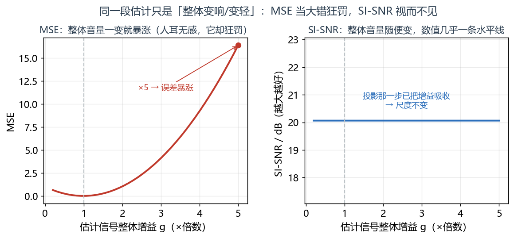
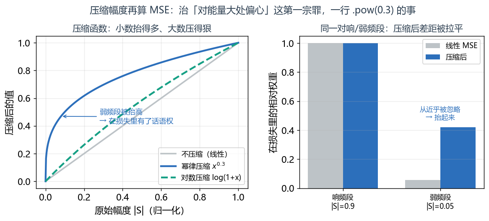
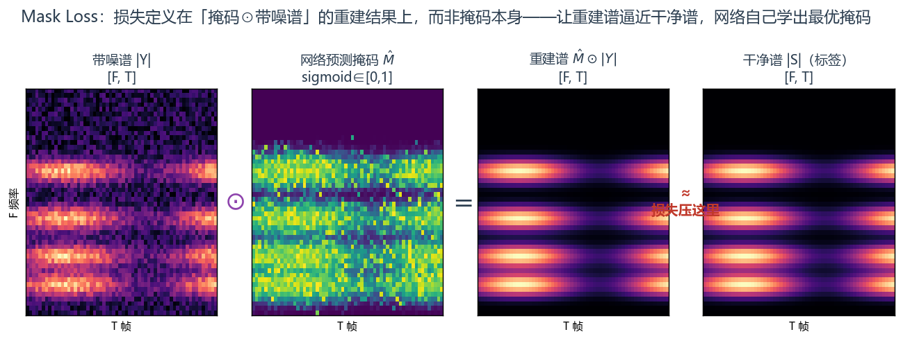
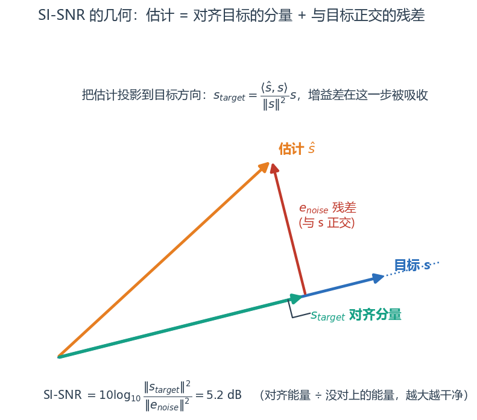

# 第 8 篇｜损失函数：网络唯一的老师，别请错了

> 一句话核心直觉：损失函数是网络**唯一**的老师——它说什么是"好"，网络就朝什么方向使劲。降噪任务里用 MSE 当老师，网络会学出一个数值漂亮、听起来却发闷的结果。**SI-SNR 和 Mask Loss，才是把"人耳觉得干净"翻译成可求导数字的那位好老师。**

---

## 一、先把教材那套扔一边：损失不是"求个差"那么简单

上一篇结尾我留了个问题：网络会算了，能吐出一段"它认为干净"的语音，可**它凭什么知道自己算得好不好？**

答案是损失函数。但很多人对损失的理解停在"预测和真值求个差、平方一下"，也就是均方误差 MSE。教材里回归问题一律 MSE，顺手就用了。

我要先把这个惯性打断：**损失函数不是数学附属品，它是你给网络下的全部命令。** 网络在训练里做的唯一一件事，就是让这个数字变小。你写下的损失，等于你对"什么叫好语音"的完整定义。定义歪了，网络就往歪处狂奔，而且奔得又快又坚定。

在降噪里，这个坑特别深。我们来看 MSE 到底歪在哪。

---

## 二、MSE 为什么不够用

先写出它，别怕，就一个求和：

$$\mathcal{L}_{\text{MSE}} = \frac{1}{N}\sum_{n}\big(\hat{s}[n] - s[n]\big)^2$$

逐字翻译：

- $\hat{s}[n]$：网络输出的第 $n$ 个值（可以是波形采样，也可以是谱上某个点）。
- $s[n]$：对应的干净目标值。
- $(\hat{s}[n]-s[n])^2$：两者差一点就罚一点，差得越多罚得越狠（平方）。
- $\frac{1}{N}\sum$：所有点的罚分求平均。

看着挺合理，问题也全藏在这份"合理"里。用在语音（尤其是幅度谱）上，MSE 有三宗罪：

1. **对能量大处偏心。** 平方误差里，一个响的频段（幅度大）哪怕相对误差很小，绝对误差也远大于安静频段。网络为了压低总损失，会拼命讨好那几个响的频段，而人耳敏感的中高频弱成分被冷落。
2. **对整体缩放极其敏感。** 如果网络输出的波形整体音量是目标的 0.5 倍——听起来一模一样，只是小声了——MSE 会算出巨大的误差。可这个"误差"对人耳毫无意义，纯粹是增益差。MSE 逼着网络去死磕一个人耳根本不在乎的量。
3. **在幅度谱上做 MSE，等于完全放任相位。** 第 7 篇刚讲过，只优化幅度就是把相位交给运气。

> **第一个关键认知**：MSE 衡量的是"逐点数值贴不贴合"，而人耳关心的是"听起来干不干净、是不是同一句话"。这两件事**不是一回事**。尤其"整体音量差一个倍数"这种人耳无感的差异，MSE 会当成大错来罚——这条，正是 SI-SNR 要专门解决的。



*同一段估计信号只是整体乘上不同增益 g（人耳只觉得变响/变轻，结构没变）：左图 MSE 随 g 一变就急剧上升，在 ×5 处误差暴涨；右图 SI-SNR 几乎是一条水平线——它在投影那一步就把增益吸收掉了。两条曲线都是真实跑数画出来的。*

### 一个便宜的补救：压缩幅度再算 MSE

在跳到更高级的损失之前，先说一个工程上极常用、成本极低的补丁，专治 MSE 的第一宗罪（对能量大处偏心）。既然问题出在"大幅度点主导了损失"，那就先把幅度**压缩**一下再比：

$$\mathcal{L} = \big\| \,|\hat{S}|^{\,c} - |S|^{\,c}\, \big\|^2, \quad c \approx 0.3 \quad\text{或}\quad \big\|\log(1+|\hat S|) - \log(1+|S|)\big\|^2$$

翻译：给幅度加一个 $c<1$ 的幂（幂律压缩），或者取 $\log$。两种做法都是把"大数压得多、小数压得少"，让响频段和弱频段在损失里的话语权拉平——这恰好贴合人耳的对数响度感知。很多降噪工作里的"压缩谱 MSE"就是这么来的，一行 `.pow(0.3)` 的事，却能明显改善弱成分的恢复。它治不了 MSE 的缩放敏感和相位问题，但把最刺眼的能量偏心先摁住了。



*左：幂律 $x^{0.3}$ 与对数 $\log(1+x)$ 都把小数抬得多、大数压得狠，弱频段因此在损失里拿回话语权。右：一对响频段（|S|=0.9）与弱频段（|S|=0.05），线性 MSE 下弱频段几乎被忽略，压缩后两者的相对权重被拉平。*

---

## 三、Mask Loss：把损失定义在"重建出来的谱"上

回忆前几篇的降噪套路：网络不直接吐干净谱，而是吐一个**掩码 mask**，用它去乘带噪谱，滤掉噪声。第 4 篇也讲过，mask 用 sigmoid 挤到 $[0,1]$，天然就是"每个时频点该保留多少"的透光度。

那损失该定义在**掩码**上，还是定义在**掩码乘出来的结果**上？

答案是后者，这就是 Mask Loss 的核心思想：

$$\mathcal{L}_{\text{mask}} = \big\| \hat{M} \odot |Y| - |S| \big\|^2$$

逐项翻译：

- $|Y|$：带噪语音的幅度谱（网络的输入之一）。
- $\hat{M}$：网络预测的掩码，`sigmoid` 输出，$[0,1]$，shape 和谱一样。
- $\hat{M} \odot |Y|$：掩码逐点乘带噪谱 = **网络重建出的干净幅度谱**（$\odot$ 是逐元素相乘）。
- $|S|$：真正的干净幅度谱（训练标签）。
- 整体：让"重建谱"逼近"干净谱"，而不是让掩码去逼近某个预先算好的"理想掩码"。

为什么定义在重建谱上更好？因为我们**真正在乎的是重建结果**，不是掩码长什么样。如果硬去拟合一个"理想掩码"，还得先问：理想掩码是什么？这里有两个经典定义，值得建立直觉：

- **理想二值掩码 IBM**：每个时频点，语音比噪声强就给 1、否则给 0。非黑即白，像一道硬门。
- **理想比值掩码 IRM**：按能量比给一个 $[0,1]$ 的软值，$\sqrt{\frac{|S|^2}{|S|^2+|N|^2}}$，语音占比多就多留点。柔和，通常比 IBM 听感好。

Mask Loss 的高明之处在于：你**不用**纠结该拟合 IBM 还是 IRM，直接让重建谱贴近干净谱，让网络自己去学出最优的掩码形状。



*四张谱从左到右：带噪谱 $|Y|$ ⊙ 网络预测掩码 $\hat{M}$ = 重建谱 $\hat{M}\odot|Y|$ ≈ 干净谱 $|S|$。损失压的是最后那个"≈"——重建谱与干净谱之差，而不是让掩码去拟合某个预先算好的理想掩码。*

现在接上第 1 篇埋的那个坑——**length mask**。训练时一个 batch 里音频长短不一，短的要 padding 补齐成整齐方块喂 GPU。可 padding 出来的那些帧是**假数据**（全是补的零），绝不能计入损失，否则网络会去"优化一堆零"，白白带偏。

> **第二个关键认知**：这里有**两种 mask，别搞混**。一种是网络**预测**的降噪掩码 $\hat{M}$（要学的东西）；另一种是数据管道里标记"哪些帧是真的、哪些是 padding"的 **length mask**（一个 0/1 的有效性标记）。计算损失时，必须先用 length mask 把 padding 帧的损失清零，再对有效帧求平均。这是第 1 篇变长音频批次化埋下的债，在这里还。

---

## 四、SI-SNR：对增益不敏感的那把尺

降噪和语音分离领域现在的默认损失，是**尺度不变信噪比 SI-SNR**（Scale-Invariant Signal-to-Noise Ratio）。它直接冲着 MSE 的第二宗罪去——**对整体音量缩放完全免疫**。

它工作在**时域波形**上（不是谱），思路分三步。设网络输出估计 $\hat{s}$、干净目标 $s$（都是波形向量）：

**第一步：把估计信号投影到目标方向上，取出"真正对齐目标的那一份"。**

$$s_{\text{target}} = \frac{\langle \hat{s}, s\rangle}{\|s\|^2}\, s$$

翻译：$\langle \hat{s}, s\rangle$ 是两个信号的内积（相关程度），除以 $\|s\|^2$ 得到一个缩放系数，再乘回 $s$。这一步的意义是：**不管你输出的音量是目标的几倍，我都把它按比例缩放对齐到目标上**——增益差异在这一步被自动吸收掉了。这就是"尺度不变"四个字的来源。

**第二步：剩下的部分，就是噪声/失真。**

$$e_{\text{noise}} = \hat{s} - s_{\text{target}}$$

翻译：估计信号减掉"对齐目标的那一份"，剩下的就是没对上的残差——即失真和残余噪声。

**第三步：算目标能量与残差能量的比值，取对数变成分贝。**

$$\text{SI-SNR} = 10\log_{10}\frac{\|s_{\text{target}}\|^2}{\|e_{\text{noise}}\|^2}$$

翻译：分子是"对齐目标的能量"，分母是"没对上的能量"，比值越大说明输出越干净。取 $10\log_{10}$ 变成分贝，符合人耳对响度的对数感知。

训练时我们要**最大化** SI-SNR，而优化器只会最小化，所以损失取负号：$\mathcal{L} = -\text{SI-SNR}$。

> **第三个关键认知**：SI-SNR 那个"先把估计投影到目标方向"的动作，就是它对增益不敏感的全部秘密——它只问"你输出的**形状/结构**对不对"，不问"你音量开多大"。这恰好治好了 MSE 的病：网络不必再浪费力气去死磕一个人耳无感的整体音量，可以专心把语音结构恢复对。这就是语音分离/降噪几乎人人用它的原因。



*把估计 $\hat{s}$ 沿目标 $s$ 方向做正交投影：落在目标方向上的那一份是对齐分量 $s_{target}$（增益差在此被吸收），垂直方向剩下的是残差 $e_{noise}$。SI-SNR 就是这两段能量的比值取对数——投影几何用 numpy 真实算出，直角标记表明残差与目标严格正交。*

---

## 五、代码实战：同一对信号上，三种损失的数值与梯度

我们在同一对 `(估计, 目标)` 上算 MSE、Mask Loss、SI-SNR，重点看两件事：**数值**和**对增益缩放的反应**。

```python
import torch
import torch.nn.functional as F

torch.manual_seed(0)

# 造一段"干净目标"波形和一段"网络估计"波形
B, T = 2, 16000              # 批次2, 每条1秒@16k
s = torch.randn(B, T)        # 干净目标 [2, 16000]
est = s + 0.1 * torch.randn(B, T)   # 估计 = 目标 + 少量误差
print("目标 shape:", s.shape, " 估计 shape:", est.shape)

# ---------- 1) MSE ----------
mse = F.mse_loss(est, s)
print("MSE:", mse.item())

# ---------- 2) SI-SNR ----------
def si_snr(est, s, eps=1e-8):
    # 先去均值(零均值化), 让内积只反映结构
    est = est - est.mean(dim=-1, keepdim=True)
    s   = s   - s.mean(dim=-1, keepdim=True)
    # 第一步: 把 est 投影到 s 方向, 吸收掉增益差
    dot = (est * s).sum(dim=-1, keepdim=True)          # <est,s>  [B,1]
    s_energy = (s * s).sum(dim=-1, keepdim=True) + eps # ||s||^2  [B,1]
    s_target = dot / s_energy * s                      # 对齐目标分量 [B,T]
    # 第二步: 残差
    e_noise = est - s_target                           # [B,T]
    # 第三步: 能量比取 log
    ratio = (s_target**2).sum(-1) / ((e_noise**2).sum(-1) + eps)
    return (10 * torch.log10(ratio + eps)).mean()      # 标量, 越大越好

sisnr = si_snr(est, s)
print("SI-SNR (dB, 越大越好):", sisnr.item())
print("SI-SNR 损失 = -SI-SNR:", (-sisnr).item())
```

现在做关键实验——**把估计信号整体放大 5 倍**，看两种损失的反应天差地别：

```python
est_scaled = est * 5.0        # 音量放大5倍, 人耳只是觉得"变响", 结构没变

mse_scaled   = F.mse_loss(est_scaled, s)
sisnr_scaled = si_snr(est_scaled, s)

print("放大5倍后 MSE:   ", mse_scaled.item(), " (暴涨!)")
print("放大5倍前 SI-SNR:", sisnr.item())
print("放大5倍后 SI-SNR:", sisnr_scaled.item(), " (几乎不变!)")
```

跑出来你会看到：**MSE 暴涨了几十倍**（它把音量差当成大错狂罚），而 **SI-SNR 几乎纹丝不动**（它在第一步就把增益吸收掉了）。这就是"尺度不变"最直观的证据——也是 MSE 不适合直接当语音损失的铁证。

再补 Mask Loss，并演示 length mask 如何屏蔽 padding 帧：

```python
# ---------- 3) Mask Loss (定义在重建谱上, 带 length mask) ----------
Bsz, Fbins, Tframes = 2, 257, 100
noisy_mag = torch.rand(Bsz, Fbins, Tframes) + 0.1   # 带噪幅度谱 |Y|
clean_mag = torch.rand(Bsz, Fbins, Tframes)         # 干净幅度谱 |S|
pred_mask = torch.sigmoid(torch.randn(Bsz, Fbins, Tframes))  # 网络预测掩码, [0,1]
print("带噪谱/掩码 shape:", noisy_mag.shape)          # [2, 257, 100]

recon = pred_mask * noisy_mag       # 重建谱 = 掩码 ⊙ 带噪谱  [2,257,100]
sq_err = (recon - clean_mag) ** 2   # 逐点平方误差 [2,257,100]

# length mask: 第2条样本只有前60帧是真的, 后40帧是 padding
length_mask = torch.ones(Bsz, 1, Tframes)
length_mask[1, :, 60:] = 0.0        # padding 帧标 0
sq_err = sq_err * length_mask       # padding 处误差清零, 不计入损失

# 只在有效点上求平均(除以有效点数, 不是总点数)
mask_loss = sq_err.sum() / (length_mask.expand_as(sq_err).sum() + 1e-8)
print("Mask Loss(已屏蔽padding):", mask_loss.item())
```

最后看一眼梯度行为，印证"损失决定网络往哪走"：

```python
est_v = (s + 0.1*torch.randn(B, T)).clone().requires_grad_(True)
loss_a = F.mse_loss(est_v, s);          loss_a.backward()
g_mse = est_v.grad.clone(); est_v.grad = None
loss_b = -si_snr(est_v, s);             loss_b.backward()
g_sisnr = est_v.grad.clone()
print("MSE 梯度范数:   ", g_mse.norm().item())
print("SI-SNR 梯度范数:", g_sisnr.norm().item())
# 两者方向/尺度不同 —— 换损失, 等于换了给网络指路的方向
```

---

## 六、这在工程里解决什么问题

| 场景 | 该用什么损失 | 为什么 |
|---|---|---|
| 时域降噪 / 语音分离 | SI-SNR（负号做损失） | 对增益不敏感、直接对齐目标结构，端到端听感好 |
| 掩码法频域降噪 | Mask Loss（重建谱 MSE） | 损失落在真正在乎的重建结果上，省去纠结拟合哪种理想掩码 |
| 变长 batch 训练 | 任何损失 + length mask | padding 帧是假数据，必须清零否则带偏（接第 1 篇的坑）|
| 追求感知质量 | 组合损失 | 见下 |

**组合损失**是工程常态：单一损失往往顾此失彼。比如 SI-SNR 保结构，但可能在某些频段留下细碎噪声；于是常见 `SI-SNR + α·(幅度谱 L1)` 这类组合，一个管时域结构、一个管频域细节。写出来也就几行：

```python
def combined_loss(est_wave, s_wave, est_mag, s_mag, alpha=0.5):
    # est_wave/s_wave: 时域波形 [B,T];  est_mag/s_mag: 幅度谱 [B,F,T]
    time_loss = -si_snr(est_wave, s_wave)          # 时域: 保整体听感与相位
    freq_loss = F.l1_loss(est_mag, s_mag)          # 频域: 抠幅度细节
    return time_loss + alpha * freq_loss           # 加权合成一个标量
# alpha 是旋钮: 调大偏向频域细节, 调小偏向整体听感
```

注意一个坑：SI-SNR 是分贝（可能几十的量级），L1 幅度差可能是零点几的量级，两者**量纲天差地别**，$\alpha$ 就是用来把它们拉到同一个尺度上平衡的。直接相加而不加权，等于让大数那项一家独大。

**时域 vs 频域损失怎么选**？一句话总结：

> **关键认知**：**时域损失**（SI-SNR）直接对齐波形，天然把相位管住了，端到端最省心；**频域损失**（Mask Loss、谱 L1）对幅度细节更敏感、更好调，但要额外操心相位。实战里两者常常搭配使用——用时域损失兜住整体听感，用频域损失抠幅度细节。选择的依据永远是：你的任务里，人耳最在乎什么。

### 那为什么不直接拿 PESQ/STOI 当损失？

你可能会问：既然我们真正在乎人耳听感，语音质量不是有 PESQ、STOI 这些"官方"感知评分吗？直接拿它们当损失训练不就完了？

问题在于：**损失函数必须可求导**。梯度是网络学习的唯一途径（第 4 篇），而 PESQ/STOI 内部有大量不可导的操作（分段、取整、查表、非线性映射），你没法对它们 `backward()`。所以它们只能当**评测指标**（训练完拿来打分），不能当**训练损失**。

于是就有了一个长期的错位：**我们优化的（SI-SNR/MSE）和我们真正想要的（PESQ/STOI）不是同一个东西**。学界为此做了很多努力——比如训练一个可导的神经网络去逼近 PESQ 打分、再拿它当损失，或者用对抗损失让判别器学习"什么像真语音"。这些点到为止，但你要记住这个根本约束：

> **关键认知**：能当损失的必须可求导，所以训练目标往往是真实感知目标的一个"可导代理"。SI-SNR 就是"波形结构相似度"的可导代理，压缩谱 MSE 是"人耳对数响度"的可导代理。理解这层代理关系，你就不会盲目相信"损失降了模型就一定更好听"——还得拿不可导的 PESQ/STOI 复核。

---

## 七、埋一个钩子：有了这座山，怎么下山最快？

现在我们手里有了一个好老师：损失函数把"什么是干净语音"翻译成了一个可求导的数字。第 4 篇也讲了反向传播，能算出损失对每个参数的梯度——也就是**在参数空间里，哪个方向是下坡**。

于是训练就变成了一件事：**站在损失这座山上，一步一步往山谷（损失最小处）走。**

可问题来了：**每一步该迈多大？该朝哪个方向迈？** 直接顺着梯度走（最朴素的 SGD）行不行？会不会在陡峭处震荡、在平缓处龟速、在鞍点卡住不动？梯度只告诉你"当前脚下哪边是下坡"，可它没告诉你怎么走才最快、最稳。

这就是**优化器**要回答的问题。从最原始的 SGD，到加了惯性的 Momentum，再到给每个参数自适应步长的 Adam，最后到把权重衰减修对了的 AdamW——这是一部"怎么下山越来越聪明"的进化史。下一篇，也是本系列的收官篇，我们把这最后一块拼图拼上，让"从 STFT 张量到能训练的完整闭环"真正闭合。

---

## 本篇小结

- **损失是网络唯一的老师**：它定义什么叫"好"，网络只会让这个数字变小。选错损失，网络会又快又坚定地奔向错误方向。
- **MSE 三宗罪**：对能量大处偏心、对整体缩放极敏感（人耳无感的音量差被当大错罚）、在幅度谱上放任相位。
- **Mask Loss**：损失定义在"掩码×带噪谱"重建结果上而非掩码本身，省去纠结 IBM/IRM；配 length mask 屏蔽 padding 帧（接第 1 篇）；掩码用 sigmoid（接第 4 篇）。
- **SI-SNR**：先把估计投影到目标方向吸收增益差，再算目标能量与残差能量比取 log——对整体缩放免疫，是语音分离/降噪的默认损失。
- **组合与取舍**：时域损失（SI-SNR）管相位与整体听感，频域损失（谱 L1/Mask）抠幅度细节，常搭配使用。
- **下一步**：有了损失这座山和下坡方向（梯度），怎么迈步才最快最稳——优化器登场，SGD → AdamW。
