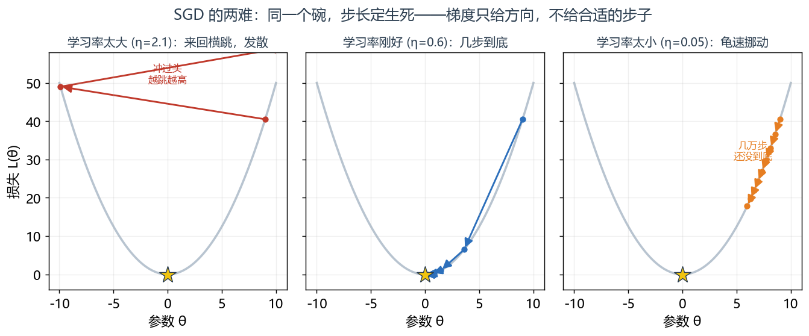
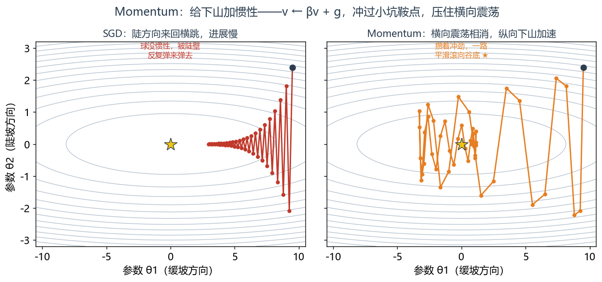
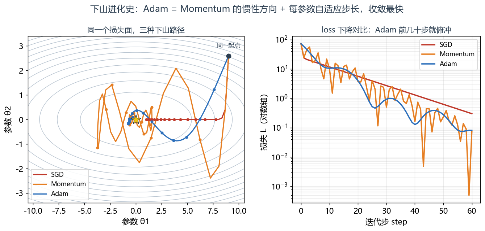
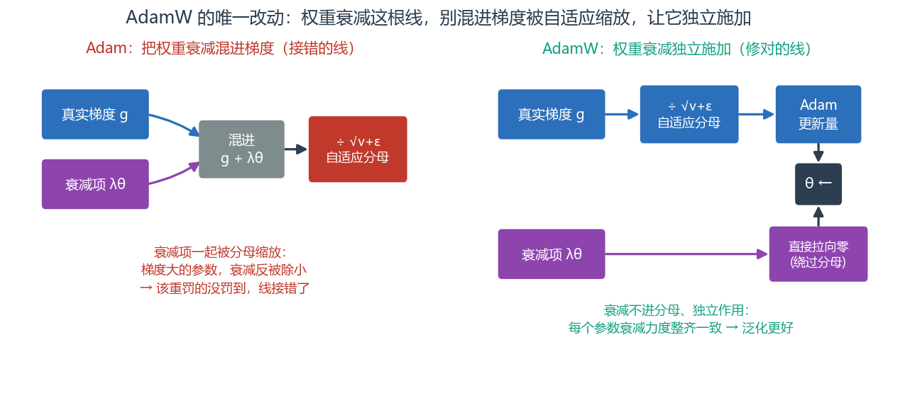
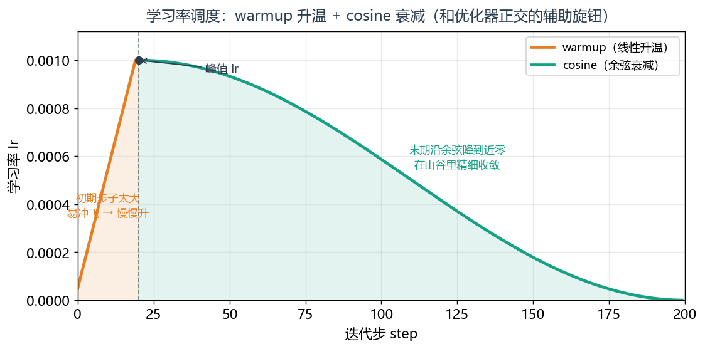

# 第 9 篇｜优化器 AdamW：怎么下山，是一门越来越聪明的手艺

> 一句话核心直觉：损失是一座山，梯度告诉你脚下哪边是下坡。但"怎么迈步"是另一门学问——SGD 是闷头顺坡走，Momentum 给你加了惯性，Adam 给每个参数配了自适应步长，AdamW 则把一个被前人接错的线修好了。**这是一部"下山越来越聪明"的进化史，也是本系列的收官。**

---

## 一、先把教材那套扔一边：梯度告诉你方向，没告诉你怎么走

上一篇我们请到了一个好老师——损失函数，它把"什么是干净语音"变成一个可求导的数字。第 4 篇又给了我们反向传播，能算出损失对每个参数的梯度。

于是很多人以为训练就结束了：**顺着梯度往下走不就行了？** 梯度指向上坡最陡的方向，取个负号就是下坡最陡，沿着它走呗。

这就是最朴素的**随机梯度下降 SGD**，写出来是这样：

$$\theta \leftarrow \theta - \eta \cdot g$$

逐字翻译：

- $\theta$：网络的参数（那些要学的权重）。
- $g$：损失对参数的梯度（这一步反传算出来的，指向上坡最陡方向）。
- $\eta$：学习率，就是"每步迈多大"。
- 整体：往梯度的反方向（下坡）挪一小步，步长由 $\eta$ 定。

看着无懈可击。可真拿它去训一个降噪网络，你立刻会撞上现实的墙：

- **学习率大了，震荡**。在陡峭的山壁上一步迈太大，直接冲到对面山壁，来回横跳、损失上蹿下跳不收敛。
- **学习率小了，龟速**。小心翼翼一点点挪，几万步了 loss 还纹丝不动，显卡电费烧光了模型还没学会。
- **鞍点和平原卡死**。深度网络的损失面上有大量又平又长的区域，梯度趋近于零，SGD 走到这里几乎不动，像陷进泥潭。

> **第一个关键认知**：梯度只回答"当前脚下哪个方向是下坡"，它**不回答**"该迈多大步、这个方向可不可信"。SGD 把这两个问题全甩给一个固定的学习率 $\eta$，所以它又笨又倔。优化器的进化史，就是一部不断给"迈步"这件事加智能的历史。



*同一个损失碗，只换学习率：太大就冲过头越跳越高（发散），太小就几万步还挪不到底，只有刚好那档能几步到底。梯度给了方向，可"步子多大"这道题它压根没回答——这正是 SGD 又笨又倔的根子。*

---

## 二、Momentum：给下山加惯性

第一个改进朴素得像常识：**下山时带上惯性。**

想象一个球从山上滚下来。它不会每一步都只看当前脚下的坡度，而是攒着之前滚下来的**冲劲**。遇到一个小坑，惯性能让它冲过去而不是卡住；方向一直往下，速度就越滚越快。

$$v \leftarrow \beta v + g, \qquad \theta \leftarrow \theta - \eta v$$

逐项翻译：

- $v$：速度，是历史梯度的累积（一开始为 0）。
- $\beta$：惯性系数，通常 0.9，表示"保留多少上一步的冲劲"。
- $\beta v + g$：把旧速度打个九折，加上当前梯度——**过去的方向和当前的方向做加权融合**。
- $\theta \leftarrow \theta - \eta v$：用这个带惯性的速度去更新，而不是用裸梯度。

这一下就解决了 SGD 的两个痛点：

- **冲过小坑与鞍点**：即便某一步梯度很小（平原），累积的速度还推着你继续走，不至于卡死。
- **抑制震荡**：在来回横跳的方向上，正负梯度相互抵消（速度里正负相消），而在一致下坡的方向上梯度不断累加——净效果是横向震荡被压住、纵向下山被加速。



*狭长峡谷型损失面：陡的那个方向 SGD 被山壁反复弹来弹去、进展慢（左）；Momentum 攒着历史冲劲，横向正负梯度相消、纵向持续累加，一路平滑滚向谷底（右）。这就是"给下山加惯性"的直观效果。*

Momentum 是个巨大的进步，但它还有个遗留问题：**所有参数共用同一个学习率 $\eta$**。可网络里不同参数的梯度尺度天差地别——有的频段权重梯度一直很大，有的一直很小。用同一个步长伺候所有参数，显然不合理。

### 插一句 RMSProp：自适应步长的前身

在跳到 Adam 之前，先认识它的半个亲爹 **RMSProp**，因为它把"自适应步长"这个想法单独讲得最清楚。RMSProp 只干一件事：**盯着每个参数梯度平方的滑动平均，用它来归一化步长。**

$$v \leftarrow \beta v + (1-\beta) g^2, \qquad \theta \leftarrow \theta - \eta \cdot \frac{g}{\sqrt{v}+\epsilon}$$

翻译：$v$ 记录"这个参数的梯度一贯有多大"（平方是为了只看大小、不看正负）；更新时用 $g$ 除以 $\sqrt v$——梯度一贯大的参数，分母大、步子被压小；梯度一贯小的，分母小、步子被放大。**每个参数因此有了自己的有效步长**，不再吃大锅饭。

看出来了吗？RMSProp 有了自适应步长，但丢了 Momentum 的惯性方向。Adam 的思路就呼之欲出了：**把 Momentum 的惯性和 RMSProp 的自适应步长，合到一起。**

---

## 三、Adam：给每个参数配一把自己的尺

Adam 的核心洞见是：**每个参数都该有自己的自适应步长**。梯度一直很大的参数，步子迈小点（别冲过头）；梯度一直很小的参数，步子迈大点（别磨蹭）。它把上面 RMSProp 的自适应分母和 Momentum 的惯性方向合二为一，同时维护两样东西——一阶矩（方向）和二阶矩（尺度）：

$$m \leftarrow \beta_1 m + (1-\beta_1) g \qquad (\text{一阶矩：梯度的滑动平均})$$
$$v \leftarrow \beta_2 v + (1-\beta_2) g^2 \qquad (\text{二阶矩：梯度平方的滑动平均})$$

逐项翻译：

- $m$：**一阶矩**，梯度的滑动平均——本质就是 Momentum 那个"惯性方向"。$\beta_1$ 通常 0.9。
- $v$：**二阶矩**，梯度**平方**的滑动平均——衡量"这个参数的梯度一贯有多大"。$\beta_2$ 通常 0.999。
- $g^2$ 是逐元素平方，所以 $v$ 是每个参数各自一份，这正是"每个参数一把尺"的来源。

因为 $m$、$v$ 初始为 0，前期会偏小，Adam 做一个偏差校正（把它们放大回正常量级）：

$$\hat{m} = \frac{m}{1-\beta_1^t}, \qquad \hat{v} = \frac{v}{1-\beta_2^t}$$

翻译：$t$ 是当前步数，训练初期 $\beta^t$ 还比较大，除法把偏小的估计"顶"回真实量级；训练久了 $\beta^t \to 0$，校正自动失效。然后是最终的更新式：

$$\theta \leftarrow \theta - \eta \cdot \frac{\hat{m}}{\sqrt{\hat{v}} + \epsilon}$$

这是 Adam 的心脏，逐项翻译：

- 分子 $\hat{m}$：往哪个方向走（带惯性的梯度方向）。
- 分母 $\sqrt{\hat{v}}$：这个参数梯度一贯多大。**梯度一贯大 → 分母大 → 实际步长被压小；梯度一贯小 → 分母小 → 步长被放大**。这就是"自适应步长"的全部机制。
- $\epsilon$：一个很小的数（如 `1e-8`），防止分母为零。
- 净效果：每个参数都被自动调成"不快不慢"的合适步长，$\eta$ 只是个总体基准。

> **第二个关键认知**：Adam = Momentum（一阶矩给方向）+ 自适应步长（二阶矩把每个参数的步长按其梯度历史归一化）。它对学习率不那么敏感、开箱即用收敛快，所以成了深度学习的**默认优化器**——你不知道该用什么时，用 Adam 基本不会错。



*同一起点、同一损失面：SGD 慢吞吞、Momentum 带惯性快一截、Adam 靠每参数自适应步长前几十步就俯冲下去（左图轨迹、右图 loss 对数曲线一致印证）。这就是"下山进化史"浓缩在一张图里。*

但"默认"不等于"最优"。Adam 有一个流传多年、被无数人接错的线，AdamW 就是来修它的。

---

## 四、AdamW：把接错的那根线修对

要讲清 AdamW，得先说**权重衰减（weight decay）**是干嘛的。它是防止过拟合的正则手段，直觉是"别让权重长得太大"——每步都把权重往零轻轻拉一点：

$$\theta \leftarrow \theta - \eta \cdot (\dots) - \eta\lambda\theta$$

那个 $-\eta\lambda\theta$ 就是"往零拉"的力，$\lambda$ 是衰减强度。

历史上大家图省事，把权重衰减实现成了 **L2 正则**——即在损失里加一项 $\frac{\lambda}{2}\|\theta\|^2$，让它自然产生一个 $\lambda\theta$ 的梯度，混进上面的 $g$ 里。在 SGD 里，这两种做法**完全等价**，所以长期没人在意。

问题出在 Adam 上。如果把 $\lambda\theta$ 混进梯度 $g$，它就会一起进入 Adam 的分母 $\sqrt{\hat v}$ 被"自适应缩放"。结果是：**梯度大的参数，它的权重衰减反而被分母除小了**——衰减力度被 Adam 的自适应机制扭曲，本该被大力约束的参数反而衰减得轻。这根线，接错了。

AdamW（W = Weight decay 解耦）的修法极其干净：**别把权重衰减混进梯度，让它在更新的最后单独作用。**

$$\theta \leftarrow \theta - \eta \cdot \frac{\hat{m}}{\sqrt{\hat{v}}+\epsilon} - \eta\lambda\theta$$

逐项翻译：

- 第一项 $-\eta\frac{\hat m}{\sqrt{\hat v}+\epsilon}$：还是原汁原味的 Adam 更新（只含真实损失的梯度，**不含**衰减项）。
- 第二项 $-\eta\lambda\theta$：权重衰减**独立**施加，直接把权重往零拉，**不经过** Adam 的自适应分母。
- 净效果：每个参数受到的衰减力度整齐一致，不再被二阶矩扭曲。

> **第三个关键认知**：Adam 和 AdamW 的差别，只在权重衰减这一根线怎么接——一个混进梯度被自适应缩放（错），一个独立施加（对）。这点差异在**泛化**上是实打实的：在同样超参下，AdamW 训出来的模型往往验证集表现更好、更不容易过拟合。所以现在训练 Transformer、大模型、乃至认真调的语音模型，**默认就该用 AdamW**，`torch.optim.AdamW` 一行的事。



*左：Adam 把衰减项 λθ 混进梯度，一起被自适应分母 √v̂ 缩放——梯度大的参数衰减反被除小，该重罚的没罚到。右：AdamW 让衰减绕过分母、独立把权重拉向零，每个参数衰减力度整齐一致。唯一的改动，就是这根线怎么接。*

至于学习率调度（scheduler），一句带过：训练初期用 **warmup**（学习率从小慢慢升，避免一开始梯度乱、步子大冲飞），中后期用 **cosine 衰减**（学习率沿余弦曲线平滑降到接近零，让模型在山谷里精细收敛）。它和优化器是两个正交的旋钮，配合使用。落地也就一行注册、一行 `step`：



*学习率不必全程恒定：先用 warmup 线性升温（避免初期步子太大冲飞），到峰值后沿 cosine 余弦曲线平滑降到近零（末期在山谷里精细收敛）。这根曲线和优化器是正交的两个旋钮，叠加使用。*

```python
model = make_model()
opt = torch.optim.AdamW(model.parameters(), lr=1e-3, weight_decay=0.01)
# cosine 调度: 200 步内把 lr 沿余弦曲线从 1e-3 平滑降到接近 0
sched = torch.optim.lr_scheduler.CosineAnnealingLR(opt, T_max=200)
for step in range(200):
    # ... forward / loss / backward / opt.step() ...
    sched.step()                       # 每步更新学习率
    if step % 50 == 0:
        print(f"step {step:3d}  lr = {sched.get_last_lr()[0]:.6f}")
# 输出可见 lr 从 1e-3 一路平滑降下来
```

### 一个几乎人人踩过的坑：别给 bias 和 norm 加权重衰减

AdamW 的 `weight_decay` 会作用到**所有**参数上——包括偏置 `bias` 和归一化层（BatchNorm/LayerNorm）的缩放/平移参数。可这些参数**本就不该被往零拉**：把 norm 的缩放拉向零，等于削弱归一化本身；把 bias 拉向零，也没有正则意义。正确做法是用**参数分组**，只对权重矩阵施加衰减：

```python
decay, no_decay = [], []
for name, p in model.named_parameters():
    if p.ndim <= 1 or name.endswith(".bias"):   # 1维参数=bias/norm的γβ
        no_decay.append(p)
    else:
        decay.append(p)                          # 2维以上的权重矩阵才衰减
opt = torch.optim.AdamW([
    {"params": decay,    "weight_decay": 0.01},
    {"params": no_decay, "weight_decay": 0.0},   # bias/norm 免疫衰减
], lr=1e-3)
print("受衰减参数张量数:", len(decay), " 免疫的:", len(no_decay))
```

这是训练 Transformer、语音大模型时的标准操作，不做的话泛化会莫名其妙差一截。记住它，比记住任何超参默认值都值钱。

---

## 五、代码实战：四种优化器在同一个"降噪小问题"上赛跑

我们造一个贴近语音的极简回归问题：学一个线性变换，把"带噪幅度谱帧"映射到"干净幅度谱帧"。然后让 SGD / Momentum / Adam / AdamW 在同一初始点、同一数据上赛跑，画出 loss 下降曲线。

```python
import torch
import torch.nn as nn

torch.manual_seed(0)

# 造数据: 一个未知的"干净化"线性映射 W_true, 输入带噪谱帧, 目标干净谱帧
F_in, F_out, N = 257, 257, 512          # 频率维 257, 样本数 512
W_true = torch.randn(F_out, F_in) * 0.1
noisy = torch.randn(N, F_in)            # 带噪幅度谱帧 [512, 257]
clean = noisy @ W_true.T + 0.01*torch.randn(N, F_out)  # 目标 [512, 257]
print("输入 shape:", noisy.shape, " 目标 shape:", clean.shape)

def make_model():
    torch.manual_seed(42)               # 同一初始点, 公平比较
    return nn.Linear(F_in, F_out, bias=False)

def train(opt_name, steps=200):
    model = make_model()
    if   opt_name == "SGD":
        opt = torch.optim.SGD(model.parameters(), lr=0.05)
    elif opt_name == "Momentum":
        opt = torch.optim.SGD(model.parameters(), lr=0.05, momentum=0.9)
    elif opt_name == "Adam":
        opt = torch.optim.Adam(model.parameters(), lr=0.05)
    elif opt_name == "AdamW":
        opt = torch.optim.AdamW(model.parameters(), lr=0.05, weight_decay=0.01)
    losses = []
    for _ in range(steps):
        pred = model(noisy)                       # [512, 257]
        loss = nn.functional.mse_loss(pred, clean)
        opt.zero_grad()
        loss.backward()                           # 反传算梯度(第4篇)
        opt.step()                                # 优化器迈一步
        losses.append(loss.item())
    return losses

curves = {name: train(name) for name in ["SGD", "Momentum", "Adam", "AdamW"]}
for name, c in curves.items():
    print(f"{name:9s} 初始loss={c[0]:.4f}  第50步={c[50]:.4f}  末尾={c[-1]:.6f}")
```

典型输出会呈现清晰的梯队：**SGD 降得最慢**（闷头走），**Momentum 明显快一截**（有惯性），**Adam/AdamW 最快**（自适应步长，前几十步就俯冲下去）。这就是进化史在一张表里的直观呈现。想画曲线的话：

```python
import matplotlib.pyplot as plt
for name, c in curves.items():
    plt.plot(c, label=name)
plt.xlabel("step"); plt.ylabel("MSE loss"); plt.yscale("log")
plt.legend(); plt.title("四种优化器收敛对比"); plt.show()
```

再看一眼优化器**吃了多少显存**——这直接呼应第 3 篇：

```python
model = make_model()
n_params = sum(p.numel() for p in model.parameters())
print("参数量:", n_params)
print("SGD      需存: 参数本身 (0 份额外状态)")
print("Momentum 需存: +1 份 (速度 v)         ≈", n_params, "个float")
print("Adam/AdamW 需存: +2 份 (m 和 v)        ≈", 2*n_params, "个float")
# 结论: Adam 系列的优化器状态 = 2倍参数量的额外显存
```

---

## 六、这在工程里解决什么问题

| 优化器 | 什么时候用 | 代价 |
|---|---|---|
| SGD | 经典 CV、想要极致泛化且愿意精调 lr | 收敛慢、难调、易卡鞍点 |
| SGD + Momentum | SGD 的标配增强，图像任务常见 | +1 份状态显存 |
| Adam | 不确定用什么时的安全默认，收敛快 | +2 份状态显存；泛化有时略逊 |
| AdamW | **当代默认**：语音/大模型/Transformer | +2 份状态显存，泛化更好 |

两段呼应第 3 篇的一线视角：

> **优化器状态是显存刺客（接第 3 篇）。** 第 3 篇算显存账时提过：显存里不只装参数和激活，还装**优化器状态**。现在你彻底懂了——Adam/AdamW 的 $m$ 和 $v$ 各是一份和参数等大的张量，**光优化器状态就吃掉 2 倍参数量的显存**。一个 100M 参数的模型，参数本身占 400MB(fp32)，Adam 状态再吃 800MB，还没算激活值。这就是为什么大模型训练里显存那么紧张，也是为什么会有各种省显存优化器（如 8-bit Adam 把状态量化）。选 SGD 还是 AdamW，有时不是精度问题，是显存问题。

> **混合精度下的 GradScaler（接第 3 篇）。** 第 3 篇讲混合精度时提过 `GradScaler`，现在它的位置清楚了：fp16 下小梯度会下溢成 0，GradScaler 在反传前把损失放大一个系数、让梯度落进 fp16 能表示的范围，等优化器 `step` 之前再把梯度按同样系数缩回来。它夹在 `loss.backward()` 和 `optimizer.step()` 之间，是混合精度训练能跑通的关键一环。标准写法是 `scaler.scale(loss).backward()` → `scaler.step(opt)` → `scaler.update()`。

---

## 七、收束：从一张语谱图，到一个能训练的闭环

到这里，本系列九篇的河流终于汇入大海。我们回头看看走了多远：

- **第 1 篇**：你在信号与系统里画出的那张语谱图，变成了带 shape 的张量 `[B, C, F, T]`，相位我们特意留着没扔。
- **第 2–3 篇**：nn.Module 装下网络、DataLoader 把语谱图源源不断喂进来、显存和混合精度让训练跑得动。
- **第 4 篇**：反向传播——网络"学会"的内核。
- **第 5–7 篇**：三种看数据的视角——CNN 看时频局部、RNN 抓时序依赖、复数网络把当初留着的相位一起学了回来。
- **第 8 篇**：损失函数，给网络请了个懂人耳的好老师。
- **第 9 篇**：优化器，教会网络怎么高效地下山。

现在，**一个完整的可训练闭环彻底打通了**：

> 语谱图 → 张量批次 →（喂进）网络 →（前向）输出 →（损失）打分 →（反传）算梯度 →（优化器）更新参数 →（循环）。

这个闭环，就是所有语音深度学习模型跑起来的骨架，一个也不少。你已经不再是"会调 API 但不知道里面发生什么"的状态了——从张量的每个维度含义，到梯度怎么流、显存怎么涨、损失为什么这么选、优化器为什么这么迈步，你都能讲清机制。

**下一段旅程，是把这个骨架填成真正的血肉**：具体的降噪模型（比如 CRN/DCCRN 怎么把 CNN+RNN+复数层拼起来）、语音分离模型（Conv-TasNet、DPRNN 怎么用 SI-SNR 端到端训练）、回声消除的深度学习方案。那时你会发现，每一个看似复杂的模型，拆开来都是这九篇里的零件在重新组合——而你，已经认识每一个零件了。

信号与系统教你听懂了声音，这九篇教你让机器学会处理声音。工具已经齐备，接下来，是去造真正的东西了。

---

## 本篇小结

- **SGD**：$\theta \leftarrow \theta - \eta g$，最朴素地顺坡走；学习率大了震荡、小了龟速、遇鞍点卡死。
- **Momentum**：给下山加惯性 $v \leftarrow \beta v + g$，冲过小坑与鞍点、抑制横向震荡。
- **Adam**：一阶矩给方向 + 二阶矩给每个参数自适应步长，$\theta \leftarrow \theta - \eta\hat m/(\sqrt{\hat v}+\epsilon)$，开箱即用收敛快，深度学习默认。
- **AdamW**：把权重衰减从梯度里解耦、独立施加，修正了 Adam 里 L2 正则被自适应分母扭曲的老毛病，泛化更好，当代默认。
- **工程意义**：Adam/AdamW 的优化器状态吃 2 倍参数量显存（接第 3 篇）；GradScaler 夹在反传与 step 之间撑起混合精度训练（接第 3 篇）；warmup + cosine 调度是正交的辅助旋钮。
- **收束全系列**：从 STFT 张量到可训练闭环已彻底打通，下一段旅程是具体的降噪/分离/AEC 模型实战——每个复杂模型，都是这九篇零件的重新组合。
