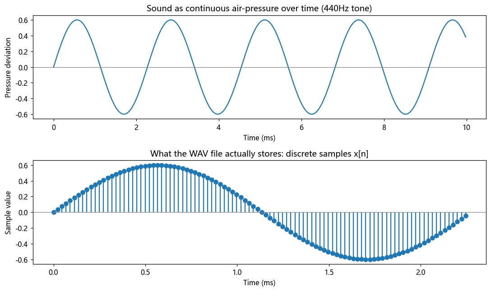

# 第 1 篇｜信号是什么？声音只是"随时间抖动的气压"

> 一句话核心直觉：**信号，就是某个量随时间变化的记录。** 而声音这个信号，记录的是你耳膜前那团空气的**气压**，每一秒钟上下抖动几百上千次。

---

## 一、先把教材那句定义扔一边

翻开《信号与系统》第一页，你大概率会读到这么一句：

> "信号是一个或多个自变量的函数，它携带着某种信息。"

没错，但这句话对着背，你什么也没懂。它太抽象，抽象到可以指任何东西，于是它什么直觉都没给你。

我们换个方式。你现在闭上眼，回忆一件事：**体温计。** 早上量 36.5℃，中午 37.1℃，晚上 36.8℃。如果你每隔一小时量一次，把这些数连成一条曲线——**这条"体温随时间变化"的曲线，就是一个信号。**

再想一个：股票价格随时间的涨跌曲线，是信号；心电图纸上那条上下起伏的线，是信号；你手机计步器里"每分钟走了多少步"的记录，也是信号。

**它们的共同点只有一个：有个量，它随着时间在变，我们把这个"变化的过程"记录下来。** 这就是信号。没有比这更玄的东西。

用符号写出来就是 $x(t)$——括号里的 $t$ 是时间，$x$ 是那个"会变的量"在时刻 $t$ 的取值。仅此而已。别怕这个记号，它就是"体温曲线"四个字的数学缩写。

---

## 二、那声音呢？声音是什么量在变？

现在把镜头对准我们的本行：声音。

**声音这个信号，随时间变化的那个量，是气压。**

我们来把这件事讲透。你现在所在的房间，空气看似静止，其实塞满了空气分子，它们均匀地挤在一起，形成一个稳定的**大气压**。这时候万籁俱寂。

现在你说一个字，或者音箱纸盆往前推一下。它把紧挨着它的那层空气**压紧**了一点点——局部气压略高于大气压。这团"被压紧"的空气会去挤压旁边的空气，旁边的再去挤下一层……于是一个"压紧—回弹—压紧"的波动，像推倒的多米诺骨牌一样，以约 340 米每秒的速度往你耳朵跑过来。

传到你耳边时，你的**耳膜**就是那个"体温计"。空气压紧一点，耳膜被往里推一点；空气变稀疏一点，耳膜被往外吸一点。**耳膜前的气压，每秒上下抖动几百到几千次，这串抖动就是声音信号 $x(t)$。**

- $x(t) > 0$：这一刻气压高于静止值（空气被压紧），耳膜往里凹；
- $x(t) < 0$：这一刻气压低于静止值（空气变稀疏），耳膜往外鼓；
- $x(t) = 0$：这一刻恰好是静止气压，耳膜不动。

> **关键认知**：我们平时说的"声波波形图"，那条上下起伏的曲线，纵轴**不是**音量大小的抽象数值，它就是**实实在在的气压偏离静止值的多少**。波形往上冲得越高，说明那一刻空气被压得越狠，你听着就越响。

抖动得快（每秒次数多）= 音调高；抖动幅度大 = 声音响。就这么直接。

---

## 三、从连续的气压，到 WAV 文件里的一串数字

真实世界的气压是**连续**变化的——在任意一个时间点它都有一个确定的值，时间可以无限细分。这叫**连续时间信号**（或"模拟信号"）。

但电脑不认识"连续"。电脑只会存一串一串的数字。于是麦克风把气压变化转成电压后，声卡会做一件事：**每隔极短的固定时间，就量一次当前气压，记下一个数。** 这个"量一次记一个数"的动作叫**采样 (sampling)**。

比如 CD 音质，每秒采样 44100 次。于是一秒钟的声音，就变成了 44100 个数字排成的一队：

```
x = [0.0, 0.08, 0.15, 0.21, 0.19, 0.05, -0.11, -0.23, ...]
```

**这就是 WAV 文件里存的东西——一长串数字，每个数字代表某一瞬间的气压偏离值。** 一首 3 分钟的立体声歌曲，就是两队（左右声道）各约 800 万个这样的数字。

这种"一个个离散数字排队"的信号，叫**离散时间信号**，写作 $x[n]$——注意括号变成了方括号，$n$ 是第几个采样点（0、1、2、3……的整数），不再是连续的时间 $t$。

那这串数字最后怎么变回声音？**倒着来一遍。** 播放时，声卡按每秒 44100 个的节奏，把这些数字一个个送给扬声器。数字大，就把纸盆往前推得多；数字小或为负，就把纸盆往回拉。

> **把整条链路串起来**：WAV 里第 $n$ 个数字 → 决定扬声器纸盆在第 $n$ 个瞬间往前/往后移动多少 → 纸盆推动空气产生气压起伏 → 气压波传到你耳膜 → 耳膜复现出几乎一样的抖动 → 你听到了原声。**这一串数字，本质就是"扬声器纸盆运动的说明书"。**

你作为音频工程师每天打交道的 `float32` 数组、`int16` PCM 数据，物理上就是这个意思。理解到这一层，后面所有的处理——滤波、混响、变调——你都可以在脑子里翻译成"我在改扬声器纸盆的运动方式"。

---

## 四、代码实战：亲手造一个信号，看它长什么样

空谈概念不如亲手造一个。我们用 Python 造一个最简单的声音信号——一个 440Hz 的纯音（就是乐器调音用的标准音 A），然后把它的波形画出来，看看"气压随时间抖动"到底长什么模样。

```python
import numpy as np
import matplotlib.pyplot as plt

fs = 44100          # 采样率：每秒采样 44100 次(CD 音质)
dur = 0.01          # 只画 10 毫秒,好看清每一次抖动
t = np.arange(int(fs * dur)) / fs   # 每个采样点对应的时刻(秒)

# 造一个 440Hz 的纯音:气压按正弦规律上下抖动,每秒抖 440 次
x = 0.6 * np.sin(2 * np.pi * 440 * t)

# ---------- 画图:连续曲线 vs 离散采样点 ----------
fig, ax = plt.subplots(2, 1, figsize=(10, 6))

# 上图:把它当成连续的气压曲线看
ax[0].plot(t * 1000, x)
ax[0].set_title("Sound as continuous air-pressure over time (440Hz tone)")
ax[0].set_xlabel("Time (ms)"); ax[0].set_ylabel("Pressure deviation")
ax[0].axhline(0, color='gray', lw=0.8)   # 这条零线 = 静止大气压

# 下图:放大看电脑真正存的是一个个离散数字
t2 = t[:100]; x2 = x[:100]
ax[1].stem(t2 * 1000, x2, basefmt=" ")
ax[1].set_title("What the WAV file actually stores: discrete samples x[n]")
ax[1].set_xlabel("Time (ms)"); ax[1].set_ylabel("Sample value")
ax[1].axhline(0, color='gray', lw=0.8)

plt.tight_layout()
plt.show()

# 顺手看看这串数字本身
print("前 8 个采样值:", np.round(x[:8], 3))
print("一秒钟一共有", fs, "个这样的数字")
```

跑一下，你会看到两张图。**上图**是一条光滑起伏的正弦曲线——这就是理想中连续的气压变化，往上是空气被压紧，往下是空气变稀疏，中间那条灰线是静止大气压。**下图**是同一段声音，但画成了一根根竖线（`stem` 图）：每根竖线就是 WAV 文件里存的一个数字。电脑眼里的声音，就是下图这一队离散的数字，不多不少。



> **动手升级**：把 `x` 写进一个 `.wav` 文件听一下——`from scipy.io.wavfile import write; write("tone.wav", fs, x.astype(np.float32))`。你会听到一个持续的"嘟——"声。再把频率 `440` 改成 `880`，抖动快一倍，你会听到音调高了整整八度。**改的只是一串数字，变的却是你真实听到的音高**，这就是信号的力量。

---

## 五、这在音频工程里，到底意味着什么

这一篇看起来最"基础"，但它奠定了你之后所有工作的世界观。落到实处：

| 你熟悉的东西 | 用信号的眼光重新理解 |
|------|------|
| **WAV / PCM 数据** | 一串 $x[n]$，每个数就是某一瞬间扬声器纸盆该移动多少 |
| **采样率 (44.1k / 48k / 96k)** | 每秒把连续气压"量"多少次；量得越密，能还原的抖动越快(音越高) |
| **位深 (16bit / 24bit)** | 每个气压值用多精细的数字来记，决定了最小能分辨的气压变化 |
| **音量归一化 / 增益** | 把整串数字同乘一个系数，纸盆运动幅度整体放大或缩小 |
| **削波失真 (clipping)** | 气压值超出了数字能表示的上限,波形顶被"削平",听感变脏 |

> **一句话记住**：从今往后，当你看到一段音频，不要只把它当"文件"，要看见它背后那条**随时间抖动的气压曲线**，以及**驱动扬声器纸盆运动的一串数字**。你后面学的每一个操作，改的都是这条曲线。

---

## 六、埋一个钩子：如果信号只是"一串数字"……

既然声音已经变成了一串我们能随便读写的数字，那么一个诱人的念头就冒出来了：**我能不能直接动手改这串数字，来改变听感？**

- 把每个数字**往后挪几位**，会发生什么？(声音会……延迟?)
- 把这串数字**抽掉一半、或者塞进两倍**，又会怎样？(变快?变调?)
- 把整串数字**前后倒过来**播放呢？(倒放特效!)

这些"对一串数字动手动脚"的操作，其实全都是《信号与系统》里有名有姓的**基本信号操作**——时移、时间缩放、翻转。你每天在 DAW 里拖来拖去干的活，背后就是这几个操作。下一篇，我们就来把它们一个个拆开。

---

## 本篇小结

- **信号**：某个量随时间变化的记录，写作 $x(t)$。没有比这更复杂的定义。
- **声音信号**：随时间变化的那个量是**耳膜前的气压**；波形纵轴就是气压偏离静止值的多少，抖得快=音高，抖得大=音响。
- **连续 vs 离散**：真实气压是连续的 $x(t)$；采样后变成一串数字 $x[n]$，这就是 WAV 文件的本质。
- **完整链路**：一串数字 → 扬声器纸盆运动 → 气压波 → 耳膜抖动 → 听到声音。
- **下一步**：既然声音是一串数字，对它做时移、缩放、翻转，就得到了延迟、变速、倒放——这是下一篇的主角。
