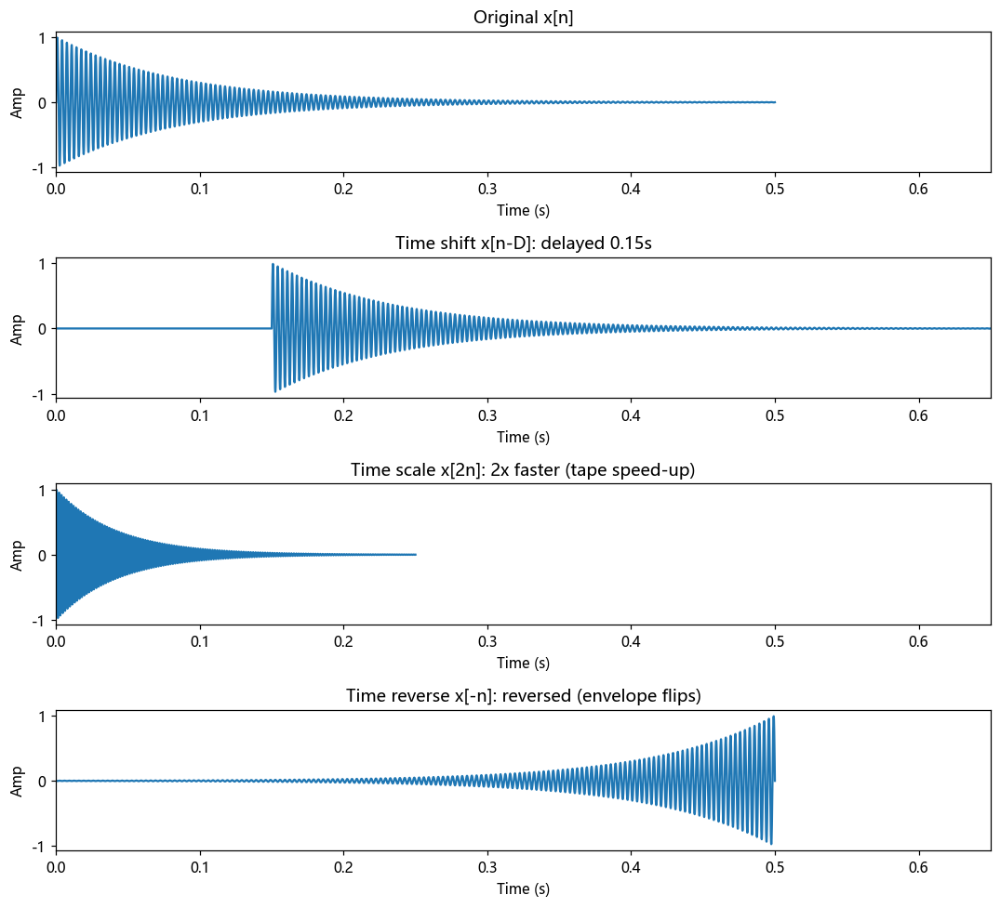

# 第 2 篇｜信号的基本操作：延迟、变速、倒放都是同一回事

> 一句话核心直觉：教材里那三个吓人的记号——$x(t-t_0)$、$x(at)$、$x(-t)$——翻译成人话就是**延迟、变速、倒放**。你在 DAW 里拖音轨、做变速、玩磁带倒放特效时，每天都在用它们。

---

## 一、别背公式，先想想你在 DAW 里干的活

当年学"信号的基本运算"，我面对的是一整页令人窒息的符号：$x(t-t_0)$ 是"时移"，$x(at)$ 是"尺度变换"，$x(-t)$ 是"反褶"，还配着一堆坐标平移压缩的图。我能把图画对，但完全不知道这些操作**在现实里对应什么**。

结果转头打开 DAW（数字音频工作站，比如 Reaper、Pro Tools），我其实一直在用它们，只是没人告诉我"你拖动这条音轨的行为，数学名字叫时移"。

这一篇要做的事很简单：**把那三个符号，一个个焊死在你已经熟悉的操作上。** 学完你会发现，教材整章内容，你早就会了，只差一层窗户纸。

我们先回到上一篇的结论：一段声音就是一串数字 $x[n]$（或连续视角下的曲线 $x(t)$），它是"扬声器纸盆运动说明书"。**所谓基本操作，就是对这份说明书做几种最简单的改写。** 一共就三招。

---

## 二、第一招：时移 $x(t-t_0)$ —— 延迟，就是整段往后挪

先看最简单的：**在音轨上把一段声音整体往右拖 0.5 秒。**

你在 DAW 里天天这么干：录了一段人声，觉得它进得太早，鼠标一拖，整条往后挪，让它晚半秒再响。

这个"整体往后挪 $t_0$ 秒"的操作，数学写法就是：

$$y(t) = x(t - t_0)$$

**为什么是减号？** 这是最反直觉、也最容易背错的一点，我们用大白话彻底讲清楚。

假设原声音在 $t=0$ 时刻有个鼓点（$x(0)$ 是那一击）。我想让这个鼓点**推迟到 $t_0=0.5$ 秒**才响。那么新信号 $y$ 在 $t=0.5$ 这个时刻，应该等于原来鼓点的值：

$$y(0.5) = x(0)$$

对照 $y(t) = x(t - t_0)$，代入 $t=0.5, t_0=0.5$：$y(0.5) = x(0.5 - 0.5) = x(0)$。对上了！

> **一句话破解减号**：$x(t-t_0)$ 里减去 $t_0$，意思是"当前时刻 $t$ 想听的内容，得去原信号**更早 $t_0$ 秒**的地方取"。当前时刻要播的，是过去的内容，所以听感上就是**延迟**。反过来 $x(t+t_0)$ 是超前（往左挪），去未来取内容——现实里没法对实时声音这么干，但对录好的文件可以。

在离散世界（一串数字）里更直观，延迟 $D$ 个采样就是：

$$y[n] = x[n - D]$$

说白了就是**在这串数字前面塞 $D$ 个零**，把原来的数整体往后推。这正是数字延迟效果器（Delay）最核心的一步。回声、拍子对齐、声像延时……底层都是这个 $x[n-D]$。

---

## 三、第二招：时间缩放 $x(at)$ —— 变速，快放和慢放

再看一招：**把一段声音放快或放慢。**

老式磁带机你按下快进键放音，声音会变得又快又尖，像花栗鼠说话；把磁带转速调慢，声音变得又慢又闷，像妖怪讲话。这个"整体加速/减速"的操作，数学写法是：

$$y(t) = x(at)$$

- $a > 1$（比如 $a=2$）：**快放**。$y(1) = x(2)$，意思是新信号播到第 1 秒时，播的已经是原信号第 2 秒的内容了——一半时间就把全曲放完，时间被**压缩**。
- $0 < a < 1$（比如 $a=0.5$）：**慢放**。原信号被**拉伸**，播得又慢又长。

> **注意别绕晕**：$a>1$ 是快放，但在时间轴上是把波形**压扁**（同样的内容挤进更短的时间）；$a<1$ 是慢放，波形被**拉宽**。"$a$ 大反而变窄"，这点和时移的减号一样，是考试爱挖的坑，理解了就不会错。

**这里藏着一个音频工程师必须搞懂的关键区别：**

老式磁带快放，会同时改变**速度**和**音调**——放快了不仅时长缩短，音调还整体升高（花栗鼠效应）。原因很直接：$x(at)$ 把所有抖动都挤密了，原来每秒抖 440 次的音，快放 2 倍后每秒抖 880 次，音调自然升八度。**纯粹的时间缩放 $x(at)$，速度和音调是绑死的。**

但你在现代 DAW 里做"变速不变调"（Time-Stretch）或"变调不变速"（Pitch-Shift）时，明明能只改一个、不动另一个。这怎么做到的？

**答案是：变速不变调 / 变调不变速，已经不是简单的 $x(at)$ 了。** 它们是更复杂的算法（相位声码器 Phase Vocoder、WSOLA 等），本质是把声音切成小片、重叠拼接或在频域重构。简单的 $x(at)$ 只能做到"磁带式"的速度音调联动。

> 记住这个分野：**$x(at)$ = 磁带变速（速度音调一起变）；解耦二者需要专门的时间/音高伸缩算法。** 这也解释了为什么 DAW 里的 Time-Stretch 有时会有"金属感"的失真——那是算法在拼接时留下的痕迹，而不是简单缩放会有的。

---

## 四、第三招：翻转 $x(-t)$ —— 倒放，把说明书从后往前念

最后一招最好玩：**倒放。**

$$y(t) = x(-t)$$

把时间轴取负号，意思是"新信号在 $t=1$ 秒播的，是原信号 $-1$ 秒（也就是往前数）的内容"。整段声音的播放顺序被**前后颠倒**了。

在离散世界里，这操作简单到极致——**把那串数字的顺序整个倒过来**：

```
原始:  [0.1, 0.5, 0.9, -0.3, -0.7]
倒放:  [-0.7, -0.3, 0.9, 0.5, 0.1]
```

在 NumPy 里就是 `x[::-1]`，一行搞定。这就是磁带倒放特效、以及无数迷幻摇滚里"倒放藏彩蛋"的技术原理。

有意思的是，倒放后的声音**音调不变**（抖动的快慢没变，只是顺序反了），但**听感面目全非**：因为自然界的声音大多是"先冲后衰"（比如钢琴：一敲，砰地一声然后慢慢消失）。倒过来就成了"先弱后强，突然截断"——这种"倒吸气"式的包络，我们的耳朵极其敏感，一听就知道"这是倒放的"。

> **这揭示了一个深刻的点**：声音的辨识，很大程度依赖它的**时间包络**（音头怎么起、尾巴怎么落），而不只是频率成分。倒放没动频率，只反转了时间顺序，听感就天翻地覆。

---

## 五、代码实战：一段声音，三种变身

我们把三招放在一起，对同一段声音各来一下，用图看清它们的区别。

```python
import numpy as np
import matplotlib.pyplot as plt

fs = 44100
dur = 0.5
t = np.arange(int(fs * dur)) / fs

# 造一段有明显"音头-衰减"包络的声音:一记敲击(方便看出倒放)
env = np.exp(-t * 12)                       # 先强后弱的包络
x = env * np.sin(2 * np.pi * 300 * t)       # 300Hz 带衰减

# ---------- 三招 ----------
D = int(fs * 0.15)
x_delay = np.concatenate([np.zeros(D), x])  # 时移:延迟 0.15s(前面塞零)
x_fast  = x[::2]                            # 时间缩放 a=2:快放(隔点取样)
x_rev   = x[::-1]                           # 翻转:倒放

# ---------- 画图 ----------
sigs = [(x, "Original x[n]"),
        (x_delay, "Time shift x[n-D]: delayed 0.15s"),
        (x_fast,  "Time scale x[2n]: 2x faster (tape speed-up)"),
        (x_rev,   "Time reverse x[-n]: reversed (envelope flips)")]

fig, ax = plt.subplots(4, 1, figsize=(10, 9))
for a, (sig, title) in zip(ax, sigs):
    a.plot(np.arange(len(sig)) / fs, sig)
    a.set_title(title); a.set_xlabel("Time (s)"); a.set_ylabel("Amp")
    a.set_xlim(0, 0.65)
plt.tight_layout()
plt.show()
```

看这四张图：

- 第 2 张（延迟）：波形整体**往右平移**，前面多了一段静默——这就是 $x[n-D]$。
- 第 3 张（快放）：波形被**横向压扁**，同样的内容挤进一半的时间，注意它的抖动也变密了（音调升高）——这就是 $x[2n]$。
- 第 4 张（倒放）：包络**前后颠倒**，从"先强后弱"变成"先弱后强、戛然而止"——这就是 $x[-n]$。



> **动手听一下**：把这四个数组分别 `write` 成 wav 文件听。倒放那个的"倒吸气"感、快放那个的花栗鼠音调，会比看图更震撼。这就是把冷冰冰的符号，变成你耳朵能验证的现实。

---

## 六、这在音频工程里，到底解决了什么问题

这三招是所有音频编辑与效果的原子操作。你日常用的功能，几乎都是它们的组合：

| 你熟悉的功能 | 背后的基本操作 |
|------|------|
| **音轨对齐 / 延时插件 (Delay)** | 时移 $x[n-D]$，往后挪 $D$ 个采样 |
| **回声 (Echo)** | 时移 + 缩放 + 叠加：$y[n]=x[n]+0.5\,x[n-D]$(把延迟的自己叠回来) |
| **磁带变速 / 老式加速减速** | 时间缩放 $x(at)$，速度音调联动 |
| **变速不变调 / 变调不变速** | 超出简单缩放,需相位声码器等算法(但直觉源头是 $x(at)$) |
| **倒放特效 / 反向镲片** | 翻转 $x[-n]$，`x[::-1]` |
| **声像立体声延时** | 左右声道用不同的 $D$ 做时移,制造空间感 |

> **一句话记住**：$x(t-t_0)$、$x(at)$、$x(-t)$ 不是三个要背的公式，而是你对"扬声器纸盆运动说明书"能做的三种最基本改写——**挪位置、改快慢、倒顺序**。把它们叠起来，就是你 DAW 工具栏里一半的功能。

---

## 七、埋一个钩子：能不能反过来问——什么声音最"简单"？

我们已经会摆弄声音了：挪、缩、翻。但有个更根本的问题一直没碰：**声音本身，最基础的"原材料"是什么？**

一段复杂的人声、一段交响乐，波形看着乱七八糟毫无规律。可如果我告诉你：**再复杂的声音，都能用一堆最简单的"纯音"（正弦波）拼出来**——就像任何颜色都能用红绿蓝三原色调出来——你信吗？

这不是比喻，这是傅里叶给出的、能被严格证明的事实，也是整个数字信号处理大厦的地基。下一篇，我们就来认识信号世界的"乐高积木"：正弦波，以及它那个看起来吓人、实则是为了让计算变简单的记账工具——复指数 $e^{j\omega t}$。

---

## 本篇小结

- **时移 $x(t-t_0)$**：整段挪位置。减号=延迟(去更早处取内容)，加号=超前。离散版 $x[n-D]$ 就是前面塞零。
- **时间缩放 $x(at)$**：改快慢。$a>1$ 快放(波形压扁、音调升高)，$a<1$ 慢放。速度与音调联动，解耦需专门算法。
- **翻转 $x(-t)$**：倒放。数字顺序反转 `x[::-1]`，音调不变但时间包络颠倒，听感剧变。
- **工程意义**：Delay、Echo、变速、倒放特效、立体声延时，全是这三招的组合。
- **下一步**：把复杂声音拆成最简单的原材料——正弦波与复指数。