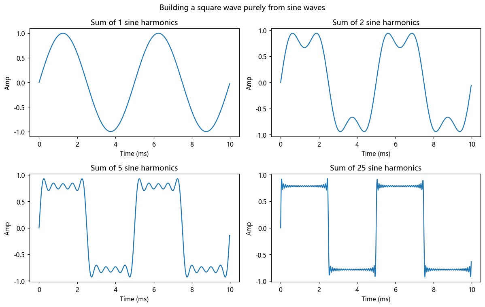
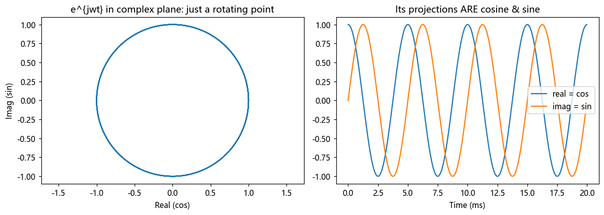

# 第 3 篇｜正弦波与复指数：信号世界的"乐高积木"

> 一句话核心直觉：**任何声音，都能用一堆纯音（正弦波）拼出来**，就像乐高能拼出任何形状。而那个吓人的复指数 $e^{j\omega t}$，不是什么高深物理，它只是**"旋转的正弦波"**——一个让计算变简单的记账工具。

---

## 一、为什么合成器都从正弦波开始

你玩过合成器（Synth）的话，一定见过那几个基础波形按钮：正弦波（Sine）、方波（Square）、锯齿波（Saw）、三角波。而所有的声音设计教程都会告诉你：**正弦波是最"纯"的声音，其他波形都是它的叠加。**

这不是玄学，这是本篇要讲透的核心事实。我们先建立直觉。

拿出手机下一个调音 App，播放一个 440Hz 的**纯音**（标准音 A）。你会听到一个"嘟——"的声音，非常干净、单薄，没有任何"音色"可言，像是从真空里发出来的。这个声音的波形，就是一条完美的正弦曲线：

$$x(t) = A\sin(2\pi f t + \phi)$$

三个参数，对应你耳朵能感知的三件事：

- **$A$（幅度）**：气压抖动的**幅度**——决定**响度**。$A$ 越大，声音越响。
- **$f$（频率）**：每秒抖动多少次（单位 Hz）——决定**音高**。$f$ 越大，音调越高。440Hz 是标准音 A，翻一倍到 880Hz 就高八度。
- **$\phi$（相位）**：抖动的**起始位置**——决定波形从哪个点开始。单独听一个音，相位你几乎听不出来，但两个信号叠加时，相位决定了它们是相互增强还是相互抵消（这点后面极重要）。

**为什么正弦波这么特殊、配当"原材料"？** 因为它是自然界最"纯粹"的振动：单摆的摆动、吉他弦某一根谐波的振动、音叉的发声，物理上都严格遵循正弦规律。它是振动的"素数"，没法再被分解成更简单的东西。

---

## 二、核心事实：复杂声音 = 一堆正弦波相加

现在是关键一步。为什么真实乐器（钢琴、小提琴）的声音那么丰满，而纯音那么单薄？

**因为真实乐器发出的不是单个正弦波，而是一大堆不同频率正弦波的叠加。**

拉一根小提琴的 A 弦（440Hz），它振动时不只以 440Hz 抖动，还同时以 880Hz、1320Hz、1760Hz……（440 的整数倍）在抖，这些叫**谐波（泛音）**。你听到的"小提琴的音色"，本质就是**基频 440Hz 加上一堆强弱不同的谐波，叠加出来的那个复杂波形**。

- 音高（440Hz）由**基频**决定——所以小提琴和长笛都能奏出 A，音高一样；
- 音色由**各谐波的强弱配比**决定——所以你能一耳朵分辨出这是小提琴还是长笛，尽管音高相同。

> **这就是傅里叶的核心思想**：任何周期性的声音，都能唯一地拆解成"基频 + 各次谐波"这一堆正弦波的叠加。反过来，给你一堆正弦波，按合适的幅度和相位加起来，你能拼出任意波形。**这跟三原色调色是一个道理**——正弦波就是声音的"原色"。

我们等到频域那几篇会把"怎么拆"（傅里叶变换）讲透。这一篇你只需要牢牢建立一个信念：**正弦波是乐高积木，复杂声音是拼出来的成品。**

---

## 三、复指数 $e^{j\omega t}$：一个吓退无数人的记账工具

好，现在面对那个让无数人当场放弃的东西：

$$e^{j\omega t} = \cos(\omega t) + j\sin(\omega t)$$

（这里 $\omega = 2\pi f$，叫角频率，只是把"每秒几次"换算成"每秒转多少弧度"；$j$ 是虚数单位，$j^2=-1$；工程里用 $j$ 不用 $i$，因为 $i$ 留给电流了。）

先破除恐惧：**复指数不是什么新的物理现象，它就是正弦波和余弦波打了个包。** 它没有描述任何声音里没有的东西。那我们为什么要用这么个"带虚数"的怪物？

**因为它能把恼人的三角函数运算，变成简单的加减乘除。**

### 直觉：它是一个旋转的点

$e^{j\omega t}$ 最好的图像，是**一个在复平面上匀速转圈的点**。

想象一个时钟的秒针，针尖是一个点，绕着圆心匀速旋转。$\omega$ 就是它转多快（角速度），$t$ 是时间。任意时刻，这个针尖的位置由两个坐标决定：

- 水平方向（实部）= $\cos(\omega t)$
- 垂直方向（虚部）= $\sin(\omega t)$

**看到没？你要的正弦波和余弦波，就是这个旋转点在两个坐标轴上的投影（影子）。** 一个正弦波是这个旋转点投在竖直墙上的影子——影子上下往复运动，正是正弦振动。

> **一句话破解复指数**：$e^{j\omega t}$ 就是一个匀速旋转的点，正弦波是它投下的影子。我们与其去追踪那个上下往复、算起来很麻烦的影子，不如直接追踪那个转圈的点——**因为"旋转"用指数表示后，运算规则极其漂亮。**

### 它凭什么让计算变简单？

举个你马上能体会的例子：两个信号延迟后叠加，用三角函数得套一堆和差化积公式，繁琐易错。但用复指数，**延迟 $t_0$ 只是乘上一个固定的复数 $e^{-j\omega t_0}$**——旋转的点转个固定角度而已，乘法就搞定了。

还有更狠的：对复指数求导、积分，结果还是它自己乘个常数（$\frac{d}{dt}e^{j\omega t} = j\omega\, e^{j\omega t}$）。微积分运算退化成了乘法。这就是为什么整个信号与系统理论，宁可绕道复数，也要用 $e^{j\omega t}$ 当基本单元——**它是让数学变省力的记账符号，不是新的物理。**

真实声音当然是实数（气压不可能是虚数）。复指数里那个虚部只是"记账用的辅助列"，最后取实部，或者把 $+\omega$ 和 $-\omega$ 两个旋转点配对（一个逆时针转、一个顺时针转），虚部正好抵消，还原成实实在在的正弦波。这个细节现在不用深究，记住"复指数是工具，声音终归是实数"就够了。

---

## 四、代码实战：亲手用正弦波"拼"出一个方波

空谈无益。我们干一件震撼的事：**只用正弦波，一层层叠加，拼出一个方波**，亲眼见证"复杂波形是纯音拼出来的"。

数学上，方波等于一堆奇次谐波的叠加：$\sin(\omega t) + \frac{1}{3}\sin(3\omega t) + \frac{1}{5}\sin(5\omega t) + \dots$

```python
import numpy as np
import matplotlib.pyplot as plt

fs = 44100
dur = 0.01
t = np.arange(int(fs * dur)) / fs
f0 = 200      # 基频 200Hz

# ---------- 一层层叠加奇次谐波,逼近方波 ----------
fig, ax = plt.subplots(2, 2, figsize=(11, 7))
for a, n_harm in zip(ax.flat, [1, 3, 9, 49]):
    x = np.zeros_like(t)
    for k in range(1, n_harm + 1, 2):           # 只取奇次谐波 1,3,5,...
        x += (1 / k) * np.sin(2 * np.pi * f0 * k * t)
    a.plot(t * 1000, x)
    a.set_title(f"Sum of {(n_harm+1)//2} sine harmonics")
    a.set_xlabel("Time (ms)"); a.set_ylabel("Amp")
plt.suptitle("Building a square wave purely from sine waves")
plt.tight_layout()
plt.show()
```

跑一下看四张图：只用 1 个正弦波时，就是一条光滑的正弦曲线；加到 5 个、25 个谐波时，波形越来越"方"，顶部越来越平、边沿越来越陡。**这就是活生生的证据：一个听起来完全不同的方波，纯粹是一堆正弦波按 $1, \frac13, \frac15\dots$ 的配比叠加出来的。** 反过来，这也是傅里叶分析的逆过程——合成。



我们再验证复指数就是"旋转的正弦波":

```python
# 复指数的实部=余弦,虚部=正弦,它就是旋转点的两个投影
t2 = np.arange(0, 0.02, 1/fs)
z = np.exp(1j * 2 * np.pi * 200 * t2)   # 一个旋转的复指数
fig, ax = plt.subplots(1, 2, figsize=(11, 4))
ax[0].plot(z.real, z.imag)              # 复平面里:一个圆(旋转轨迹)
ax[0].set_title("e^{jwt} in complex plane: just a rotating point")
ax[0].set_xlabel("Real (cos)"); ax[0].set_ylabel("Imag (sin)"); ax[0].axis('equal')
ax[1].plot(t2 * 1000, z.real, label="real = cos")
ax[1].plot(t2 * 1000, z.imag, label="imag = sin")
ax[1].set_title("Its projections ARE cosine & sine")
ax[1].set_xlabel("Time (ms)"); ax[1].legend()
plt.tight_layout()
plt.show()
```

左图是一个正圆——复指数在复平面里就是匀速转圈；右图是它在两个轴上的投影，一条余弦一条正弦，严丝合缝。**复指数 = 旋转的正弦波，这张图就是铁证。**



---

## 五、这在音频工程里，到底解决了什么问题

正弦波和复指数不是数学家的玩具，它们是你本行工具的根基：

| 你熟悉的东西 | 背后就是正弦波/复指数 |
|------|------|
| **调音标准音 A=440Hz** | 一个纯正弦波,频率决定音高 |
| **合成器的 Sine/Saw/Square** | 基础波形,加法合成(Additive Synth)就是叠正弦波 |
| **音色的区别(音色=泛音结构)** | 基频相同,各次谐波幅度配比不同 → 不同乐器 |
| **纯音测试信号 / 扫频信号** | 测设备频响、房间共振,用的就是单频或变频正弦 |
| **FFT 频谱分析仪** | 把声音拆回一堆正弦波,显示每个频率的强弱(下模块详解) |
| **相位问题(两轨叠加变闷/抵消)** | 相位 $\phi$ 决定同频正弦波叠加是增强还是抵消 |

> **一句话记住**：正弦波是声音的原色，任何声音都是它们的叠加；复指数是描述正弦波的省力记账法（旋转的点），它让延迟、微分这些操作退化成简单的乘法。理解了这两个，你就拿到了打开频域大门的钥匙。

---

## 六、埋一个钩子：声音进了"黑盒"，会发生什么？

到这里，信号本身我们已经拆解得差不多了：它是随时间抖动的气压（第 1 篇），能被挪缩翻（第 2 篇），能拆成正弦波原料（本篇）。

但音频工程的核心，从来不只是"声音是什么"，而是"**我们拿声音干什么**"——加个混响、过个均衡器、上个压缩、做个失真。这些处理，本质上都是把声音**送进一个"黑盒"，再吐出一个新声音**。

这个"黑盒"，在信号与系统里叫**系统**。而工程师们发现，有一类特别"乖"的黑盒——**线性时不变（LTI）系统**——它们好用到我们几乎只研究它们。为什么？因为只有对 LTI 系统，我们前面辛苦建立的"正弦波拆解"才真正管用，频域分析才成立。

下一篇，我们就来搞懂：什么是系统？为什么工程师对"线性时不变"如此执着？理想均衡器和失真效果器，谁才是 LTI？

---

## 本篇小结

- **正弦波**：声音的最简原材料，三参数——幅度(响度)、频率(音高)、相位(起始位置)。
- **核心事实**：任何复杂声音都能拆成一堆正弦波的叠加；音高由基频定，音色由谐波配比定。
- **复指数 $e^{j\omega t}$**：不是新物理，是"旋转的点",正弦/余弦是它的投影。用它把延迟、微分等运算简化成乘法，纯粹是省力的记账工具。
- **工程意义**：调音、合成器、音色分析、频谱仪、相位叠加，根子都在这里。
- **下一步**：声音送进"黑盒"会怎样——认识系统，以及工程师最偏爱的 LTI。