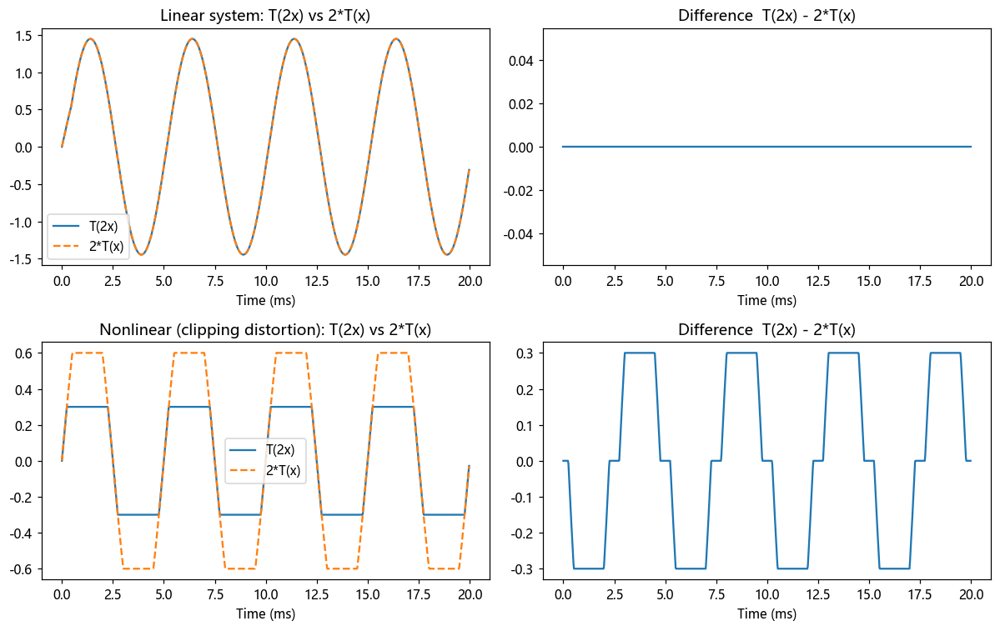

# 第 4 篇｜系统与 LTI：为什么工程师只关心"线性时不变"

> 一句话核心直觉：**系统就是"声音进、声音出"的黑盒**（混响、均衡器、失真都是）。而 **LTI** 说的是两条朴素的好脾气：**音量翻倍，输出也翻倍；今天处理和明天处理，结果一模一样**。工程师几乎只研究 LTI，因为只有它，才能用频域和正弦波来分析。

---

## 一、系统是什么？你插件链上的每一个格子

前三篇我们一直在聊"声音本身"。现在换主角：**声音被拿去干什么。**

打开你的 DAW，一条人声音轨上挂着一串插件：EQ → 压缩器 → 混响 → 限幅器。每一个插件，都是**吃进一段声音，吐出一段新声音**。这个"吃进吐出"的东西，在信号与系统里就叫**系统 (system)**。

用最朴素的话说：

$$\text{输入信号 } x[n] \;\longrightarrow\; \boxed{\text{系统 } T} \;\longrightarrow\; \text{输出信号 } y[n]$$

- 一个均衡器：输入干声，输出调整过高低频的声音。
- 一个混响：输入干声，输出带空间感的声音（回顾第 5 篇的山洞——空间本身也是个系统）。
- 一个失真效果器：输入干净吉他，输出咆哮的过载音色。

**系统就是一个处理声音的黑盒，一个函数：给它一段声音，它还你另一段声音。** 就这么简单。你的整条插件链，就是一串系统首尾相接。

问题是，世界上的系统五花八门，行为千奇百怪。要是每个都得单独研究，信号处理这门学科根本没法建立。于是工程师做了一件聪明事：**先挑出一类"脾气最好、最可预测"的系统重点研究——这就是 LTI。**

---

## 二、L：线性 —— 输入翻倍，输出就翻倍；分开处理再相加，结果不变

**线性 (Linear)** 听着高大上，其实就是两条你凭本能就觉得"理应如此"的规矩。

### 规矩一：齐次性（缩放）—— 音量翻倍，输出也翻倍

你把一段人声的音量调大一倍，送进均衡器。输出会怎样？**理应是原来输出的一倍**，音色形状不变，只是整体响了一倍。

$$\text{输入 } x \to \text{输出 } y \quad\Rightarrow\quad \text{输入 } 2x \to \text{输出 } 2y$$

一个理想均衡器满足这条：它对声音做的"塑形"不该因为你把总音量拧大就变样。

### 规矩二：可加性（叠加）—— 分开处理再相加 = 一起处理

你有两段声音：一段人声 $x_1$、一段吉他 $x_2$。

- 做法 A：先把它们混在一起 $(x_1 + x_2)$，再一起送进系统。
- 做法 B：分别送进系统得到 $y_1$、$y_2$，再把输出混在一起。

如果系统是线性的，**两种做法结果完全一样**：

$$T(x_1 + x_2) = T(x_1) + T(x_2) = y_1 + y_2$$

合起来，线性就是一句话：**$T(a\,x_1 + b\,x_2) = a\,y_1 + b\,y_2$。** 缩放和叠加，系统都"照单全收、互不干扰"。

> **为什么这条对音频这么关键？** 因为一首歌就是几十条音轨叠加而成的。如果混响是线性的，那"整个混音送进混响"就等于"每条轨单独混响再相加"——你可以放心地分轨处理。更重要的是（记住这句，第 5 篇要用）：**既然任何声音都能拆成一堆简单成分的叠加（比如一堆正弦波，或一堆冲激），线性保证了我"分别处理每个成分、再把结果加起来"就等于处理整个复杂声音。** 复杂问题被拆成了简单问题之和。

### 谁不是线性的？失真效果器

**失真（Distortion）就是典型的非线性系统。** 它的原理正是"削波"——把超过某个阈值的波形顶部削平。你把输入音量翻倍，输出**不会**乖乖翻倍，而是被削得更狠、谐波更多、听感更脏。$T(2x) \neq 2T(x)$，齐次性直接破功。

这也解释了失真的音乐用途：它**主动制造原信号里没有的新谐波**，把干净的吉他变成咆哮。而这种"无中生有造新频率"的能力，恰恰是非线性的标志——**LTI 系统永远不会产生输入里不存在的新频率**（这点太重要了，是频域分析的命根子，下面还会提）。

---

## 三、TI：时不变 —— 今天处理和明天处理，结果一样

**时不变 (Time-Invariant)** 更好懂：**系统的行为不随时间改变。**

你今天把一段人声送进这个混响，得到某个结果。明天、后天、下周，只要送进同样的声音，得到的结果**分毫不差**。系统不会"看心情"，不会随时间漂移。

更严谨一点：**如果你把输入延迟 $D$ 个采样再送进去，输出也只是原输出延迟 $D$ 个采样，形状不变。**

$$x[n] \to y[n] \quad\Rightarrow\quad x[n-D] \to y[n-D]$$

回顾第 5 篇的山洞：你现在拍手和 1 秒后拍手，回响的**形状**完全一样，只是整体晚了 1 秒。山洞不会因为"现在几点了"就改变它的回响方式——**这就是时不变。**

> **谁不是时不变的？** 一个"自动音量控制"（AGC）或随时间扫动的 auto-wah、LFO 调制的滤波器——它们的处理参数本身在随时间变化，同样的输入在不同时刻送进去，结果不同。它们不是时不变系统。（注意：这类系统在音乐上非常有用，非 LTI 不等于"坏"，只是不能用我们下面要讲的 LTI 工具去分析。）

---

## 四、为什么工程师"偏心"到只研究 LTI？

把两个词合起来：**LTI = 线性（Linear）+ 时不变（Time-Invariant）。** 一个系统只要同时满足这两条好脾气，我们就有近乎"作弊"的强大工具来对付它。到底强在哪？三点：

### 1. 正弦波进去，还是同频正弦波出来（只是变了幅度和相位）

这是 LTI 最神奇、最有用的性质：**你喂给一个 LTI 系统一个纯正弦波，它吐出来的一定还是同一个频率的正弦波**，绝不会变成别的频率，系统能做的只有两件事——把它**放大/缩小**（改幅度）、**延迟一点**（改相位）。

这为什么惊天动地？回顾第 3 篇：任何声音都是一堆正弦波的叠加。既然 LTI 对每个正弦波只做"缩放 + 相移"，又因为它是线性的（可以分开处理再相加），那么：

> **我只要知道这个系统对每一个频率的正弦波分别"放大多少、延迟多少"，我就完全掌握了它对任何声音的作用。** 这个"每个频率放大多少"的曲线，就是你天天在看的**频率响应（频响曲线）**——EQ 面板上那条画出来的曲线，就是它！

而非线性系统（失真）会产生新频率，这套分析立刻崩塌——你没法用"每个频率放大多少"来描述一个会无中生有造频率的东西。**这就是为什么"能否用频域分析"这件事，取决于系统是不是 LTI。**

### 2. 一个系统的全部信息，压缩进一段"冲激响应"

因为线性 + 时不变，我们不需要拿无数种声音去测一个系统。**只要测它对一次"冲激"（理想瞬间脉冲，比如一次拍手）的响应，就掌握了它对任何输入的反应。** 这段响应叫**冲激响应 $h[n]$**——这正是第 5 篇的主角。

### 3. 复杂的处理，变成一次"卷积"

这是我们要为下一篇埋的**核心钩子**，现在就把逻辑链铺好，让你到第 5 篇一看就通：

**LTI 的两条性质，恰好足够推出"任何 LTI 系统的输出 = 输入与冲激响应的卷积"。** 推理链条是这样的——

1. **拆解**（来自第 1、3 篇）：任何输入声音 $x[n]$，都能看成一连串"不同时刻、不同强度的冲激"的叠加。第 $k$ 个采样 $x[k]$，就是"在第 $k$ 时刻拍了一个强度为 $x[k]$ 的手"。
2. **时不变管"平移"**：系统对"第 0 时刻一次拍手"的响应是 $h[n]$。由时不变，对"第 $k$ 时刻那次拍手"的响应，就是 $h[n]$ 整体**平移**到第 $k$ 时刻，即 $h[n-k]$。
3. **线性管"缩放 + 叠加"**：由齐次性，强度为 $x[k]$ 的那次拍手，响应就是 $x[k]\cdot h[n-k]$；由可加性，所有拍手的总响应，就是把它们**全部加起来**。

三步拼起来，输出就是：

$$y[n] = \sum_{k} x[k]\,h[n-k]$$

**这就是卷积。** 你看，我们没有凭空发明它——它是"线性 + 时不变"这两条好脾气被逼出来的**必然结果**。这也是为什么工程师如此偏爱 LTI：一旦确认系统是 LTI，它对世间一切声音的行为，就被一段 $h[n]$ 和一个卷积公式彻底锁定了。

---

## 五、代码实战：亲手验证谁是 LTI，谁不是

我们造两个系统：一个线性的（简单增益+延迟叠加，模拟一个极简回声/滤波），一个非线性的（削波失真），用代码检验齐次性 $T(2x) = 2\,T(x)$ 是否成立。

```python
import numpy as np
import matplotlib.pyplot as plt

fs = 44100
t = np.arange(int(fs * 0.02)) / fs
x = 0.5 * np.sin(2 * np.pi * 200 * t)     # 测试信号:一个 200Hz 正弦

# ---------- 系统 A:线性(输出 = 输入 + 0.5*延迟版),类似简单滤波/回声 ----------
def linear_sys(x):
    D = 20
    y = x.copy()
    y[D:] += 0.5 * x[:-D]
    return y

# ---------- 系统 B:非线性(削波失真) ----------
def distortion(x):
    return np.clip(x, -0.3, 0.3)          # 超过 0.3 就削平

# ---------- 检验齐次性: T(2x) 是否等于 2*T(x) ----------
fig, ax = plt.subplots(2, 2, figsize=(11, 7))
for row, (sys, name) in enumerate([(linear_sys, "Linear system"),
                                    (distortion, "Nonlinear (clipping distortion)")]):
    left  = sys(2 * x)          # 先放大2倍再处理
    right = 2 * sys(x)          # 先处理再放大2倍
    ax[row, 0].plot(t*1000, left,  label="T(2x)")
    ax[row, 0].plot(t*1000, right, '--', label="2*T(x)")
    ax[row, 0].set_title(f"{name}: T(2x) vs 2*T(x)")
    ax[row, 0].legend(); ax[row, 0].set_xlabel("Time (ms)")
    ax[row, 1].plot(t*1000, left - right)
    ax[row, 1].set_title("Difference  T(2x) - 2*T(x)")
    ax[row, 1].set_xlabel("Time (ms)")
plt.tight_layout()
plt.show()

print("线性系统   T(2x)-2T(x) 最大误差:", np.max(np.abs(linear_sys(2*x) - 2*linear_sys(x))))
print("失真系统   T(2x)-2T(x) 最大误差:", np.max(np.abs(distortion(2*x) - 2*distortion(x))))
```

跑出来你会看到：**线性系统**那一行，$T(2x)$ 和 $2T(x)$ 两条线完全重合，差值恒为 0——它满足齐次性，是线性的。而**失真系统**那一行，两条线明显对不上，差值图上有一堆非零的波动——因为削波会把大信号"削"得更厉害，翻倍输入并不等于翻倍输出，齐次性破功，它是非线性的。打印出的最大误差也印证：线性的约等于 0，失真的明显不为 0。



> **动手延伸**：给两个系统各喂一个 200Hz 纯音，做 FFT 看输出频谱。线性系统输出还是只有 200Hz（可能幅度相位变了）；失真系统会冒出 400Hz、600Hz……一堆新的谐波——**非线性"无中生有造频率"，这就是它听起来"脏"、以及无法用频响曲线描述的根本原因。**

---

## 六、这在音频工程里，到底意味着什么

"是不是 LTI"直接决定了你能用什么工具、能做什么分析：

| 系统 | 是否 LTI | 工程含义 |
|------|------|------|
| **理想均衡器 / 线性相位 EQ** | 是 | 可用频响曲线完整描述,可频域分析,可拆分轨处理 |
| **混响 / 空间(卷积混响)** | 是(近似) | 可用一段冲激响应 $h[n]$ + 卷积完整刻画(第5篇) |
| **FIR / IIR 滤波器** | 是 | 有明确频响,是数字信号处理的核心工具 |
| **失真 / 过载 / 饱和** | 否(非线性) | 主动造新谐波,不能用频响曲线描述,需非线性建模 |
| **压缩器 / 限幅器 / AGC** | 否(时变+非线性) | 增益随信号动态变化,不满足 LTI |
| **auto-wah / LFO 调制滤波** | 否(时变) | 参数随时间变,同输入不同时刻结果不同 |

> **一句话记住**：LTI = 线性(翻倍就翻倍、可拆分叠加) + 时不变(行为不随时间变)。**只有 LTI 系统，才能用"频响曲线"和"冲激响应+卷积"这套强大工具来分析**。这不是数学家的偏好，而是工程能不能"用频域思考"的分水岭。你插件链里，哪些能安心用频域分析、哪些不能，就看这一条。

---

## 七、埋一个钩子：那条"冲激响应"到底长什么样？

我们已经反复提到一个关键角色：只要系统是 LTI，它的**全部秘密都藏在冲激响应 $h[n]$ 里**，而输出就是**输入与 $h[n]$ 的卷积**。

可是——冲激响应到底是个什么东西？为什么对系统"拍一下手"，录下的那段回响，就能预言它对任何声音的反应？那个折磨了无数考研人的卷积积分 $\int x(\tau)h(t-\tau)d\tau$，翻转平移到底在描述现实中的什么？

下一篇（也就是本系列已经写好的第 5 篇），我们就带着今天推出的这两条 LTI 性质，走进一个山洞，拍一下手——把冲激响应和卷积，一次性讲到你再也不会忘。

---

## 本篇小结

- **系统**：吃进一段声音、吐出另一段声音的黑盒；你的每个插件、每个空间都是系统。
- **线性 (L)**：翻倍输入就翻倍输出(齐次)，分开处理再相加=一起处理(可加)。失真是典型非线性。
- **时不变 (TI)**：行为不随时间改变，延迟输入只会延迟输出。压缩器、auto-wah 是时变的。
- **LTI 为何被偏爱**：正弦波进出不变频(可用频响曲线)、全部信息压进冲激响应、任何处理都等价于一次卷积。
- **核心钩子**：LTI 的"线性 + 时不变"两条性质，恰好推出 $y[n]=\sum_k x[k]h[n-k]$——卷积是它们的必然结果，这是第 5 篇的地基。
- **下一步**：走进山洞拍一下手，彻底搞懂冲激响应与卷积。