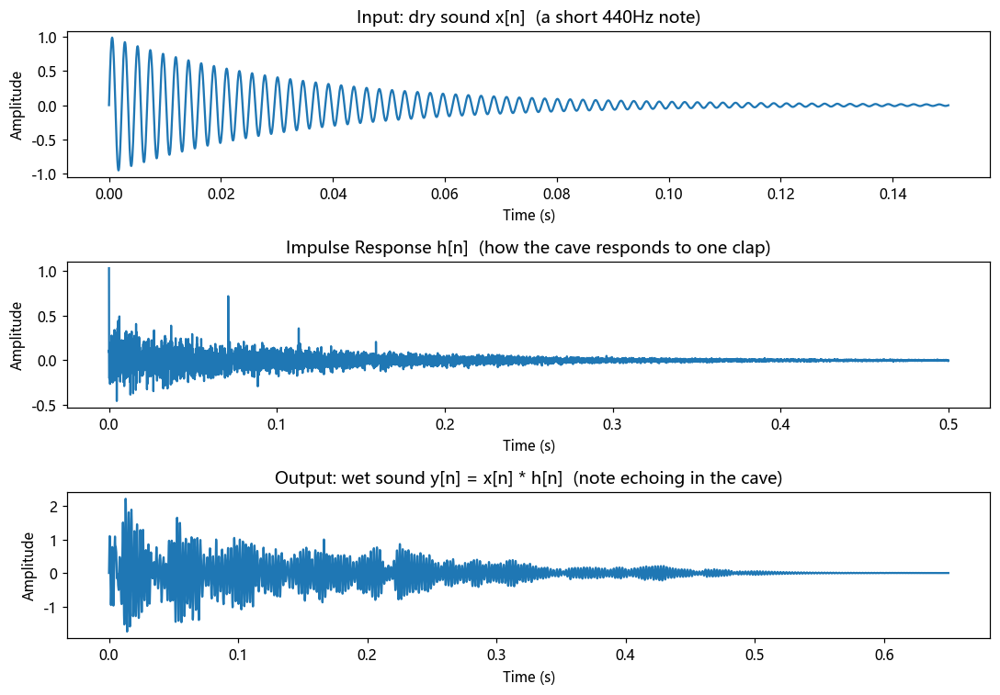

# 第 5 篇｜冲激响应与卷积：一次拍手，听懂整个房间

> 一句话核心直觉：在山洞里拍一下手，回声不断叠加衰减——这段完整的回响就是**冲激响应**，而**卷积**就是把你的声音跟这段回响"叠加"出来的过程。

---

## 一、先别看公式，我们进个山洞

翻开任何一本《信号与系统》，讲到卷积，扑面而来的就是这个：

$$y(t) = \int_{-\infty}^{+\infty} x(\tau)\,h(t-\tau)\,d\tau$$

一个积分，里面还有个 $t-\tau$ 的翻转平移。当年我背下了"翻褶、平移、相乘、积分"的口诀，考试能算，但心里一直有个疙瘩：**这玩意到底在描述现实里的什么事？**

现在我告诉你，它描述的就是一件你亲身经历过无数次的事：**在一个空间里发出声音，然后听到它的回响。**

我们做个思想实验。你站在一个空旷的山洞里，**啪**地拍了一下手。

- 直达声先到你耳朵。
- 紧接着，声音撞到左边石壁，弹回来一个稍弱、稍晚的"啪"。
- 又撞到右边、顶上、洞底，一个个更弱、更晚的"啪"陆续到达。
- 这些反射还会再反射，越来越密、越来越弱，最后拖出一条长长的"嗡……"的尾巴，慢慢消失。

**这段从"啪"到彻底安静的完整回响，完整记录了这个山洞对声音的处理方式。**

在信号与系统里，它有个正式名字：**冲激响应 (Impulse Response, IR)**。

---

## 二、冲激响应：给系统"拍一张 X 光片"

拍手这个动作，为什么这么特殊？

因为一次理想的拍手，是一个**极短、极尖**的能量爆发——时间上几乎没有宽度，却包含了所有频率的成分（下一篇讲频域时你会更深刻地理解这一点）。数学上把这个理想化的"瞬间脉冲"叫做**冲激 (impulse)**，记作 $\delta(t)$。

你可以把它想象成体检时的一次 X 光曝光：一瞬间打出一束"全谱"的光，照过身体，底片上就留下了你身体结构的完整信息。

**用冲激去"敲打"一个系统，系统吐出来的响应，就完整刻画了这个系统的全部行为。** 山洞、教堂、浴室、录音棚——每个空间被拍一下手，都会给出一段独一无二的 $h(t)$。IR 变了，空间就变了。

> **第一个关键认知**：一个 LTI 系统（回顾第 4 篇：线性 + 时不变），它的**全部秘密都藏在冲激响应 $h(t)$ 里**。你不需要知道山洞的三维建模、石壁材质、空气湿度——只要有那段"啪……嗡"的录音，你就掌握了它的一切。

为什么"全部秘密"这么大的话敢说出口？这就要靠 LTI 那两条朴素性质，我们马上用它们推出卷积。

---

## 三、从"一次拍手"到"放一首歌"——卷积的诞生

问题来了。山洞对**一次拍手**的反应我知道了（就是 $h(t)$）。可我要是在山洞里**放一整首歌**呢？山洞会怎么回应？

这就是卷积要回答的问题。而答案，完全可以用大白话推出来，不需要背公式。

### 第 1 步：任何声音，都是无数个"拍手"排起来的

先看一个核心事实。数字音频里，一段声音就是一串采样点：

```
x = [0.3, 0.7, -0.2, 0.5, ...]
```

这一串数字，你可以换个角度看：它是**一连串"迷你拍手"的排队**——

- 在第 0 个时刻，拍了一个强度为 0.3 的手；
- 在第 1 个时刻，拍了一个强度为 0.7 的手；
- 在第 2 个时刻，拍了一个强度为 -0.2 的手；
- ……

也就是说，**任何一段声音，都能拆解成"一堆不同时刻、不同强度的冲激的叠加"**。这不是近似，这在离散世界里是严格成立的恒等式。

### 第 2 步：LTI 的两条性质，让我们能"逐个拍手"分别处理

现在轮到第 4 篇讲的 LTI 出场了。它的两条性质在这里是决定性的：

- **时不变**：山洞的回响不随时间变。你**现在**拍手和**1 秒后**拍手，得到的回响形状完全一样，只是整体延后了 1 秒。→ 所以第 $k$ 时刻那个拍手，激起的回响就是 $h$ 整体**平移**到第 $k$ 时刻。
- **线性（缩放 + 叠加）**：拍手用力一倍，回响就响一倍；同时拍好几下，总回响就是各自回响**简单相加**，互不干扰。→ 所以强度为 $x[k]$ 的那个拍手，激起的回响就是 $x[k]\cdot h$；而所有拍手的总效果，就是把它们各自的回响**全部加起来**。

把这两句话拼起来：

> 输入声音的第 $k$ 个采样 $x[k]$，会在系统里激起一段"缩放了 $x[k]$ 倍、并平移到第 $k$ 个时刻"的冲激响应副本。把**所有**采样激起的这些副本**逐点相加**，就是最终听到的输出。

**这，就是卷积。** 你看，我们一个积分符号都没用，纯靠"回声会叠加"这个生活常识，就把它推出来了。

### 第 3 步：现在再看那个公式，它突然就顺眼了

离散形式（电脑真正在算的）：

$$y[n] = \sum_{k} x[k]\,h[n-k]$$

逐字翻译成人话：

- $x[k]$：第 $k$ 时刻那一下拍手的**强度**；
- $h[n-k]$：那一下拍手激起的回响，在**平移到第 $k$ 时刻后**、于当前时刻 $n$ 贡献了多少（$n-k$ 就是"距离那次拍手过了多久"）；
- $\sum_k$：把**所有**过去的拍手在此刻 $n$ 的残留回响，**全加起来**。

连续形式 $y(t)=\int x(\tau)h(t-\tau)d\tau$ 只是把"求和"换成"积分"、把"一个个采样"换成"连续的每一瞬间"，思想一模一样。

**当年折磨我的那个 $h(t-\tau)$ 的"翻转平移"，物理意义无非是：站在当前时刻 $t$ 回头看，越久以前的拍手（$\tau$ 越小），它的回响已经衰减到 $h$ 曲线越靠后的位置了。** 翻转不是数学家故意刁难，它是"回头看历史"这个视角的自然结果。

---

## 四、代码实战：亲手把干声"扔进"一个空间

光说不练假把式。我们用 Python 做三件事：

1. 造一个山洞的冲激响应（离散几声回声 + 衰减尾巴）；
2. 用卷积把一段干声"放进"这个山洞；
3. 画出输入、IR、输出三张图，**看见**回响是怎么叠出来的。

```python
import numpy as np
import matplotlib.pyplot as plt

fs = 16000  # 采样率 16 kHz

# ---------- 1. 造一段"干声"：一个短促的音符(衰减正弦) ----------
dur = 0.15
t = np.arange(int(fs * dur)) / fs
dry = np.sin(2 * np.pi * 440 * t) * np.exp(-t * 30)   # 440Hz, 快速衰减

# ---------- 2. 造一个"山洞"的冲激响应 ----------
# 直达声(t=0) + 几个离散早期反射 + 一条指数衰减的混响尾巴
ir = np.zeros(int(fs * 0.5))
ir[0] = 1.0                       # 直达声
for delay_ms, gain in [(37, 0.6), (71, 0.45), (113, 0.35), (159, 0.25)]:
    ir[int(fs * delay_ms / 1000)] = gain      # 早期反射
# 叠加一条随机的、指数衰减的稠密尾巴(模拟无数次后期反射)
tail_t = np.arange(len(ir)) / fs
ir += 0.15 * np.random.randn(len(ir)) * np.exp(-tail_t * 8)

# ---------- 3. 卷积：把干声"放进"山洞 ----------
wet = np.convolve(dry, ir)        # 就这一行,魔法发生了

# ---------- 画图 ----------
fig, ax = plt.subplots(3, 1, figsize=(10, 7))
ax[0].plot(np.arange(len(dry)) / fs, dry)
ax[0].set_title("Input: dry sound x[n]  (a short 440Hz note)")
ax[1].plot(np.arange(len(ir)) / fs, ir)
ax[1].set_title("Impulse Response h[n]  (how the cave responds to one clap)")
ax[2].plot(np.arange(len(wet)) / fs, wet)
ax[2].set_title("Output: wet sound y[n] = x[n] * h[n]  (note echoing in the cave)")
for a in ax:
    a.set_xlabel("Time (s)"); a.set_ylabel("Amplitude")
plt.tight_layout()
plt.show()
```

**你会在第三张图里清清楚楚看到**：原本一个孤零零的短音符（第一张图），经过卷积后，变成了一串逐渐衰减的重复回响（第三张图）——每一个回声，就是干声在 IR 每根"钉子"处激起的一个缩放平移副本，全部叠加的结果。这跟你在混响插件里听到的，是同一件事。



> **想真正"听"到它**：把上面的 `dry` 换成任意一段人声 `.wav`（用 `scipy.io.wavfile.read` 读入），跑一遍 `np.convolve`，再写回文件。你会听到干巴巴的人声瞬间"住进"了一个空间。这，就是所谓的**卷积混响 (Convolution Reverb)** 的完整原理。

---

## 五、这在音频工程里，到底解决了什么问题

理论讲完，落回你的本行。卷积和冲激响应不是考试用的，它们是这些真实技术的地基：

| 技术 | 背后就是卷积 |
|------|-------------|
| **卷积混响插件**（Altiverb、Waves IR1 等） | 事先在真实教堂/名录音棚采集好 IR，把你的干声与之卷积，就"搬"进了那个空间 |
| **房间脉冲响应 (RIR) 采集** | 用扫频信号或发令枪在房间里激励，录下响应，就得到了这个房间的 $h(t)$ |
| **FIR 滤波器**（第 15 篇会亲手写） | 一个 FIR 滤波器的系数，本质上**就是它的冲激响应**；滤波 = 输入与这组系数卷积 |
| **音箱/话筒校正** | 测出设备的 IR，设计一个"逆"响应与之卷积，抵消设备染色 |

> **一句话记住**：在音频世界里，**"把声音送进任何一个 LTI 处理（空间、滤波器、设备）"这件事，数学上永远是一次卷积。** 你以后每用一个混响、每加一个 FIR EQ，脑子里都可以浮现出"干声正在和一段冲激响应做叠加"这幅画面。

---

## 六、埋一个钩子：卷积其实"很贵"

细心的你可能已经算过账了：如果干声有 100 万个采样，IR 有 5 万个采样，那按上面的求和公式，要做大约 **500 亿次乘加**。实时处理时这慢得吓人。

那为什么现在的混响插件能在你的笔记本上实时跑？

因为有一个惊人的定理在等着我们：**时域里昂贵的卷积，到了频域，竟然会变成简单的逐点乘法。**

$$x(t) * h(t) \quad\xrightarrow{\text{傅里叶变换}}\quad X(f)\cdot H(f)$$

这句话现在看像天书，但它是整个数字信号处理效率的命脉。而要理解它，我们必须先推开**频域之门**——这正是下一模块（第 6～9 篇）要做的事：搞懂声音是怎么被拆成一堆频率的。

到那时，你会回头感激今天在山洞里拍的这一下手。

---

## 本篇小结

- **冲激 $\delta$**：理想的"瞬间全频拍手"，用来探测系统。
- **冲激响应 $h(t)$**：系统对一次拍手的完整回响，是 LTI 系统的"完整身份证"。
- **卷积**：输入的每个采样各自激起一个"缩放 + 平移"的 IR 副本，全部叠加即输出。它是"回声会叠加"这个常识的数学表达，不是天书。
- **工程意义**：卷积混响、FIR 滤波、设备校正，本质都是同一次卷积。
- **下一步**：频域会把昂贵的卷积变成廉价的乘法——推开频域之门。

