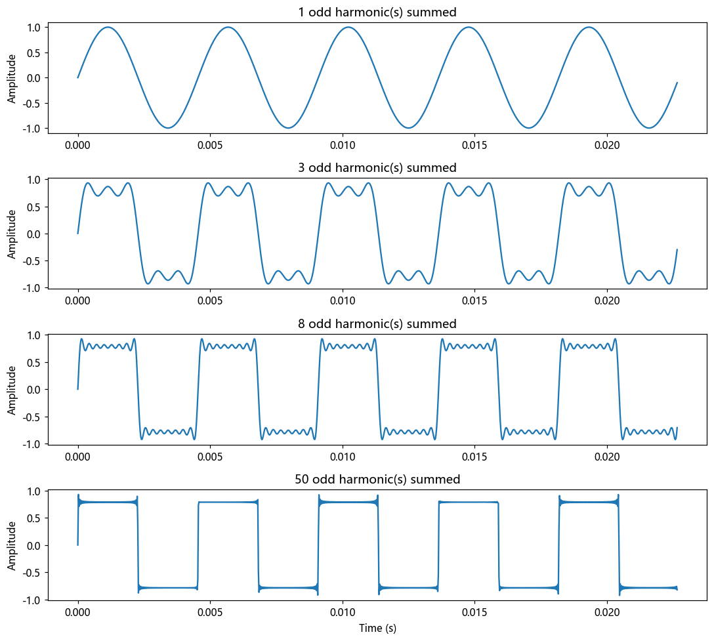
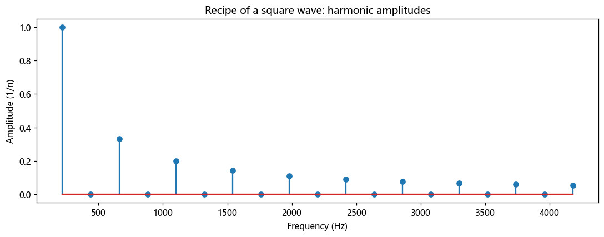

# 第 6 篇｜傅里叶级数：把"音色"拆成一堆纯音

> 一句话核心直觉：同样弹中央 C，钢琴和小提琴听起来天差地别——因为它们由**不同比例的谐波（泛音）叠加**而成。傅里叶级数，就是写下"这个音色由哪些纯音、各占多少"的那张**配方表**。

---

## 一、先别看公式，我们先弹一个音

上一模块我们在山洞里拍了一下手，搞懂了时域里的卷积。现在推开频域之门，第一个要回答的问题特别朴素：

**为什么钢琴的中央 C 和小提琴的中央 C，明明是同一个音高，听起来却完全是两回事？**

你可能会说：音色不同嘛。对，但"音色不同"只是给现象起了个名字，没解释任何东西。我们要往下挖一层：音色这个东西，物理上到底是什么？

答案出乎意料地干净：

> 一个稳定的乐音，其实是**一大堆频率严格成整数倍关系的纯正弦波，按不同比例叠加**出来的。这些正弦波里，最低的那个决定了你听到的**音高**，其余更高的那些决定了你听到的**音色**。

钢琴的中央 C，基频约 261.6 Hz，同时还含有 523 Hz、785 Hz、1046 Hz……这一长串。小提琴的中央 C，基频同样是 261.6 Hz——所以你觉得它俩"一样高"——但那一长串高频成分的**强弱配比**完全不同，于是音色两样。

**傅里叶级数说的就是这件事：任何一个周期性的声音，都可以被唯一地拆成一组频率为基频整数倍的正弦波之和。** 拆出来的这组"每个频率各占多少"的清单，就是这个音色的配方表。

---

## 二、谐波与泛音：音色的物理来源

先把两个词理清楚，后面全篇都用得到。

设基频为 $f_0$（决定音高）。那么频率为 $f_0, 2f_0, 3f_0, 4f_0, \dots$ 的这些成分，就叫**谐波 (harmonics)**：

- $f_0$：第 1 谐波，也叫**基波 (fundamental)**；
- $2f_0$：第 2 谐波；
- $3f_0$：第 3 谐波；
- ……

而"**泛音 (overtones)**"是乐器演奏者的说法，指基波**以上**的所有成分——第 1 泛音就是第 2 谐波，往上顺延。两套词说的是同一批频率，只是起点差一个。

**为什么真实乐器会自动产生这一整列谐波？** 因为发声体是有边界的。一根两端固定的琴弦，它能稳定振动的模式，只能是那些"两端恰好是波节"的驻波——半个波长、一个波长、一个半波长……刚好对应 $f_0, 2f_0, 3f_0$。物理边界条件强制频率只能取基频的整数倍，于是谐波列自然涌现。管乐器里的空气柱、声带的振动，道理相同。

> **关键认知**：音高来自基频，音色来自谐波配比。这就是为什么你能在嘈杂中一耳朵认出是钢琴还是小提琴——你的听觉系统天生在读那张"谐波配方表"。傅里叶级数只是把这张表用数学写了下来。

顺带一提，为什么这些谐波"好听"、能融成一个音，而随便两个频率放一起就刺耳？因为整数倍关系让它们的波形每隔一个基频周期就精确重合一次——叠加结果仍是一个周期为 $1/f_0$ 的稳定周期波。这也正是傅里叶级数只适用于**周期信号**的原因。

---

## 三、配方表长什么样：把公式压到最低

现在可以摆公式了，但只摆一个，而且它就是上面那段话的直译。

一个周期为 $T$（基频 $f_0 = 1/T$）的信号 $x(t)$，可以写成：

$$x(t) = \sum_{n=0}^{\infty} A_n \cos\!\big(2\pi n f_0 t + \varphi_n\big)$$

逐字翻译成人话：

- $n$：第几谐波（$n=1$ 是基波，$n=2,3,\dots$ 是各泛音）；
- $A_n$：**第 $n$ 谐波有多强**——这就是配方表里的"用量"，决定音色；
- $\varphi_n$：第 $n$ 谐波的**相位**——它此刻的起跑位置（第 8 篇会告诉你这个被忽视的量其实很重要）；
- $\sum$：把所有谐波**加起来**，还原出完整的音色。

那一组 $A_n$（每个频率的强度），画成一根根竖线，就是你在频谱仪上看到的**频谱**的雏形。傅里叶级数干的活，本质就是从时域波形 $x(t)$ 反推出这组 $A_n$ 和 $\varphi_n$。

至于"怎么反推"——教材会用一堆积分（正交性、投影）来算 $A_n$。它的直觉是：**拿一个已知频率的纯正弦当"探针"，去和原信号相乘再累加，如果原信号里含这个频率，结果就大；不含，就抵消成零。** 这就是后面第 7 篇傅里叶变换的核心机制，我们到那篇再细讲。这里你只要记住配方表的样子。

---

## 四、代码实战：亲手合成一个方波音色，看谐波涌现

空谈无益。我们用一个最经典的例子——**方波**——来亲眼看谐波是怎么叠出音色的。方波的傅里叶配方表特别漂亮：**只含奇数谐波，且第 $n$ 谐波的强度是 $1/n$。**

我们做三件事：

1. 一根根谐波往上叠，看波形怎么从正弦逐渐逼近方波；
2. 画出它的配方表（频谱）；
3. 顺便合成一段能听的声音。

```python
import numpy as np
import matplotlib.pyplot as plt

fs = 44100          # 采样率
f0 = 220.0          # 基频 220Hz (大约是小字组的 A)
dur = 1.0
t = np.arange(int(fs * dur)) / fs

# ---------- 1. 一根根奇次谐波叠加,逼近方波 ----------
def square_partial(n_harmonics):
    y = np.zeros_like(t)
    for k in range(n_harmonics):
        n = 2 * k + 1                      # 只取奇数谐波: 1,3,5,7...
        y += (1.0 / n) * np.sin(2 * np.pi * n * f0 * t)
    return y

fig, ax = plt.subplots(4, 1, figsize=(10, 9))
for i, N in enumerate([1, 3, 8, 50]):
    y = square_partial(N)
    ax[i].plot(t[:1000], y[:1000])       # 只画前 1000 个点看波形细节
    ax[i].set_title(f"{N} odd harmonic(s) summed")
    ax[i].set_ylabel("Amplitude")
ax[-1].set_xlabel("Time (s)")
plt.tight_layout()
plt.show()
```

跑完你会看到一个几乎会让人上瘾的画面：**只有 1 根谐波时是光滑的正弦；加到 3 根，肩膀开始变方；加到 8 根，已经像模像样；加到 50 根，一个棱角分明的方波跃然纸上**（边角那点挥之不去的小抖动叫吉布斯现象，是有限项逼近尖锐跳变时的固有副产品）。



这张图就是傅里叶级数最直观的证据：**方波不是什么"另一种波形"，它就是一堆正弦按 $1/n$ 配方叠出来的。**

再把配方表本身画出来：

```python
# ---------- 2. 画方波的配方表(频谱): 每根谐波的强度 ----------
harmonics = np.arange(1, 20)
amplitudes = np.where(harmonics % 2 == 1, 1.0 / harmonics, 0.0)  # 偶次为0

plt.figure(figsize=(10, 4))
plt.stem(harmonics * f0, amplitudes)
plt.title("Recipe of a square wave: harmonic amplitudes")
plt.xlabel("Frequency (Hz)"); plt.ylabel("Amplitude (1/n)")
plt.tight_layout()
plt.show()
```



你会看到一排高度按 $1/n$ 递减的竖线，且偶数谐波位置全是空的。**这排竖线，就是方波的"音色配方表"。** 任何一个周期音色，都对应这样一张独一无二的表。

```python
# ---------- 3. 合成能听的声音,写成 wav ----------
from scipy.io import wavfile
tone = square_partial(50)
tone = np.int16(tone / np.max(np.abs(tone)) * 32767 * 0.8)
wavfile.write("square_220.wav", fs, tone)
```

放出来听——那种略带嗡嗡、偏"电子"感的音色，就是丰富奇次谐波的听感。你也可以试着改配方：把 `1.0/n` 换成 `1.0/n**2`（三角波配方），或者只留前几根谐波，听音色如何变化。**你现在已经在做音色合成（加法合成）了。**

---

## 五、这在音频工程里，到底解决了什么问题

傅里叶级数不是拿来考试的。它是这些真实技术的地基：

| 技术 | 背后就是傅里叶级数的思想 |
|------|------------------------|
| **加法合成器**（如经典的 Hammond 风琴、各类 additive synth） | 直接给你一堆谐波的滑块，让你亲手调配方表来"画"出音色 |
| **乐器音色识别 / 音源分离** | 不同乐器的谐波配比就是它的身份特征，机器靠读这张表来区分声源 |
| **谐波失真分析 (THD)** | 功放、编解码器引入的非线性会凭空长出本不该有的谐波，测这些多余谐波占比就是 THD |
| **基频检测 (Pitch Detection)** | 谐波列的间距就是基频，找到这个间距就找到了音高，是变调、自动修音的第一步 |
| **物理建模合成** | 弦、管的驻波模式直接决定谐波列，反过来用这套关系来合成逼真乐器 |

> **一句话记住**：在音频世界里，**"一个稳定的乐音"数学上永远等于"一组谐波正弦的加权和"。** 你以后每调一次 EQ、每分析一次音色、每做一次修音，脑子里都可以浮现出那张按频率排开的配方表。

---

## 六、埋一个钩子：可现实里的声音不是周期的

傅里叶级数很美，但它有个硬前提：信号必须是**周期的、无限长的**——一个永远重复下去的稳定乐音。

可你想想真实的声音：一句话、一声鼓击、一段旋律，它们都是**有始有终、不断变化**的。一个字的元音刚稳定又滑向下一个辅音，哪来的"无限重复"？

那么问题来了：对这些**非周期**的、活生生的声音，我们还能不能拆出"它含哪些频率、各占多少"？

能。而且方法惊人地自然——把周期 $T$ 一路拉长到无穷大，相邻谐波的间距 $f_0 = 1/T$ 就越来越密，最后那一根根离散的竖线糊成一条**连续的曲线**。离散的"配方表"就升级成了连续的**频谱**，求和也变成了积分。

这就是下一篇要推开的门：**傅里叶变换**——它是一把棱镜，能把任意一段声音（不只是周期乐音）分解成它的频率成分。

---

## 本篇小结

- **音高 vs 音色**：音高由基频决定，音色由谐波（泛音）的强弱配比决定。
- **谐波列**：真实发声体的边界条件强制频率只能取基频的整数倍，谐波列自然涌现。
- **傅里叶级数**：任何周期信号 = 一组频率为基频整数倍的正弦波之和；那组强度 $A_n$ 就是音色的"配方表"，也是频谱的雏形。
- **代码验证**：方波 = 奇次谐波按 $1/n$ 叠加；一根根加上去就亲眼看它逼近方波。
- **工程意义**：加法合成、音色识别、THD、基频检测，本质都在读或写这张配方表。
- **下一步**：把周期拉到无穷大，离散的配方表升级成连续的频谱——傅里叶变换。
