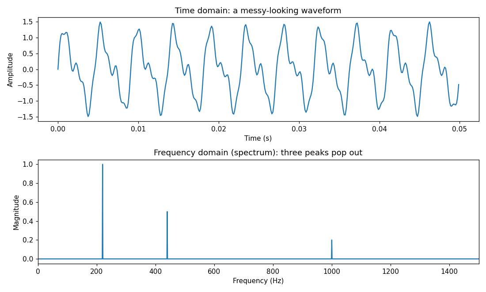
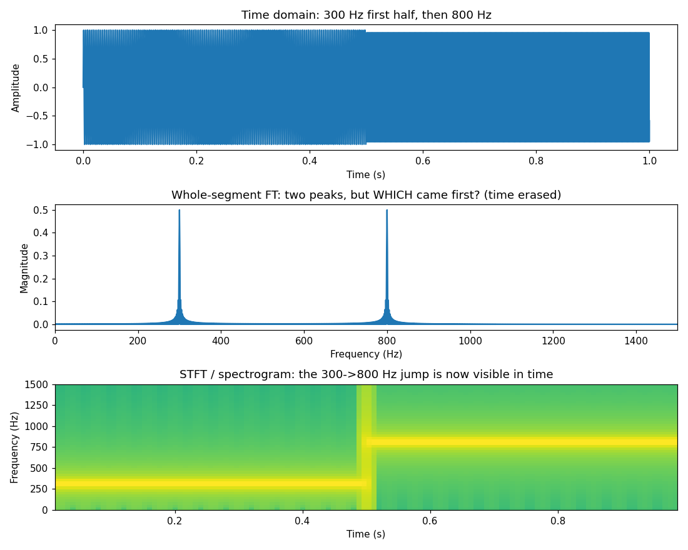

# 第 7 篇｜傅里叶变换：从时域波形到频谱

> 一句话核心直觉：傅里叶变换是一把**棱镜**。阳光看着是白的，穿过棱镜就摊成红橙黄绿的光带；一段声音看着是杂乱起伏的波形，穿过傅里叶变换就摊成"哪些频率、各有多强"的频谱。这一篇我们不满足于"棱镜"这一个比喻——要从**物理直觉、数学机制、工程实现**三个角度把它吃透，甚至会亲手拆掉棱镜这个比喻，看清它骗人的地方。

---

## 一、先别看公式，我们看一台频谱仪

上一篇我们把**周期**乐音拆成了一张离散的谐波配方表。但结尾留了个钩子：真实世界的声音——一句话、一声鼓、一段旋律——都不是无限重复的周期波。对这些活生生的声音，还能不能问"它含哪些频率"？

能。而且你天天都在看这个问题的答案。

打开任何一个音频软件，那个随音乐上下跳动、横轴是频率、纵轴是能量的彩色滚动图（语谱图 / spectrogram），或者调音台上那条 EQ 分析曲线——**它们展示的就是傅里叶变换算出来的结果**。低频段鼓点一响就凸起，人声一来中频段就亮，镲片一敲高频段就炸开。

这台"仪器"到底在干什么？它在回答一个问题：

> 此刻这段随时间起伏的波形，如果要用一堆不同频率的纯正弦波拼出来，**每个频率各需要用多少**？

把每个频率"需要用多少"沿频率轴画出来，就是**频谱 (spectrum)**。傅里叶变换，就是从波形算出这张频谱的数学过程。棱镜分解白光，它分解声音——干的是同一件事。

先记住这个画面。但我得提前打个预防针：**"棱镜"是个便于起步的比喻，它有一个会把人带沟里的破绽，第四节我们会专门回来拆它。** 在那之前，先让直觉从这里长出来。

这一篇的路线跟第 5 篇一样——**同一个傅里叶变换，从三个角度各讲一遍**：

- **物理角度**（第一、二节）：棱镜分光，把一段声音摊成频谱；
- **数学角度**（第三节）：棱镜内部到底怎么运作——用一根"旋转探针"去和信号相乘累加，对上的频率不抵消、对不上的转圈抵消成零。这一节我们会先手算一个小数组，再上连续积分；
- **工程角度**（第六节）：电脑里的信号是离散、有限的，所以你真正算的是 DFT，靠 FFT 算得飞快。

三个角度讲的是同一件事，只是站的位置不同。

---

## 二、从配方表到连续频谱：把"周期趋于无穷"推出来

第 6 篇结尾我甩了一句话："把周期 $T$ 拉到无穷大，离散的配方表就升级成连续的频谱。"那句话一带而过，这一节我们把它**一步步推出来**——因为这正是傅里叶级数变成傅里叶变换的全过程，看懂了，你就知道频谱那条连续曲线是从哪冒出来的。

### 2.1 先看清楚：级数的频谱为什么是"离散竖线"

第 6 篇的傅里叶级数，给周期信号拆出的是**一根根离散的竖线**（只在 $f_0, 2f_0, 3f_0\dots$ 处有值）。为什么必须是离散的、只能落在这些点上？

因为周期 $T$ 卡死了这件事。一个周期为 $T$ 的信号，能拼出它的正弦波**必须自己也在 $T$ 内正好走完整数个周期**——不然拼出来的东西周期就不是 $T$ 了。频率满足"$T$ 内走整数个周期"的，只有 $f_0 = 1/T$ 的整数倍：$f_0, 2f_0, 3f_0, \dots$。所以频谱的竖线只能落在这些格点上，**相邻竖线的间距恰好是 $f_0 = 1/T$。**

记住这个间距：$\Delta f = f_0 = 1/T$。整个极限过程的关键就攥在它身上。

### 2.2 思想实验：把周期一路拉长

现在做一个思想实验。取一段声音——比如一个"啊"的元音，它有始有终，本来是非周期的。我们先**假装**它每隔 $T$ 秒重复一次，硬把它当成周期信号，用傅里叶级数拆。然后把这个假想的周期 $T$ 慢慢拉长：从 1 秒，到 10 秒，到 100 秒……

盯住频谱看会发生什么：

- 竖线间距 $\Delta f = 1/T$ 越来越小，竖线越来越密；
- $T=1$ 秒时，竖线每隔 1 Hz 一根；$T=100$ 秒时，每隔 0.01 Hz 就一根，已经密密麻麻；
- 当 $T \to \infty$（那两个"重复的副本"被推到无穷远，信号回归成一段独一无二、非周期的声音），间距 $\Delta f \to 0$，**离散的竖线密到糊成一片，连成了一条连续的曲线**。

这就是频谱从"离散竖线"变成"连续曲线"的物理过程。不是数学家规定的，是"周期没了"逼出来的：**周期消失 = 频率格点消失 = 频谱连续化。**

### 2.3 顺便把"求和变积分"也看明白

不只是竖线连成曲线，级数里那个**求和号 $\sum$ 也会在这个极限里变成积分号 $\int$**。这一步很多教材直接跳过，其实它就是微积分第一课的老套路，我们点一下。

傅里叶级数是"把每根谐波竖线的贡献加起来"：

$$x(t) = \sum_{n} c_n\, e^{\,j 2\pi (n f_0) t}$$

（这里换成了复指数写法，比第 6 篇的 $\cos$ 更紧凑，道理一样——每一项是一根频率为 $n f_0$ 的谐波，$c_n$ 是它的复系数。）

现在相邻竖线间距是 $\Delta f = f_0$。把上式凑成"高度 × 宽度"再求和的形状——这是所有"求和变积分"的通用手法：

$$x(t) = \sum_{n} \Big(\frac{c_n}{\Delta f}\Big)\, e^{\,j 2\pi (n f_0) t}\,\Delta f$$

当 $T\to\infty$、$\Delta f\to 0$ 时，离散的频率点 $n f_0$ 变成连续变量 $f$，那个"高度" $c_n/\Delta f$ 收敛成一个连续函数——**这个函数就是频谱 $X(f)$**（这也解释了一个技术细节：级数系数 $c_n$ 本身趋于零，但除以越来越小的 $\Delta f$ 后，比值保持有限，正好长成 $X(f)$）。而"$\sum \cdots \Delta f$"这个"高度乘宽度再累加"的形状，正是黎曼积分的定义，极限下变成 $\int \cdots df$：

$$x(t) = \int_{-\infty}^{+\infty} X(f)\, e^{\,j 2\pi f t}\, df$$

这就是**傅里叶逆变换**——从频谱 $X(f)$ 把时域波形拼回来。而反过来、从波形算频谱的那个式子，就是我们下一节的主角：**傅里叶变换**。

> **关键认知**：**傅里叶级数**处理周期信号，给出**离散**频谱（一根根谐波竖线）；**傅里叶变换**处理非周期信号，给出**连续**频谱（一条覆盖所有频率的曲线）。二者不是两个东西，而是同一件事在 $T$ 有限 / $T\to\infty$ 两种情形下的样子。一句话：**傅里叶变换 = 周期拉到无穷大的傅里叶级数。** 从"这个音色由哪几根谐波组成"升级成了"这段声音在每一个频率上各有多少能量"。

---

## 三、棱镜的内部机制：用"旋转探针"相乘累加去检测频率

上一节我们知道了频谱是什么、从哪来。但那条连续曲线**具体怎么算**？棱镜的玻璃里到底发生了什么？这一节是全篇的心脏——我们要把"检测一个频率"这件事，从一个能手算的小数组开始，一路推到那个让人头皮发麻的积分公式。

### 3.1 先问一个能听懂的问题：这段声音里含不含 440 Hz？

别一上来就想"算出整条频谱"。先把问题缩到最小：**给你一段声音，你怎么判断它里面含不含 440 Hz 这个频率？**

答案朴素得惊人，就一句话：

> **拿一个标准的 440 Hz 纯正弦波当"探针"，让它和这段声音逐点相乘，再把结果全部累加起来。累加值大，就含；接近零，就不含。**

为什么这招管用？关键在正弦波的一个性质，用两种情形一对比就清楚了：

- 声音里**真含** 440 Hz 成分：它和 440 Hz 探针"步调一致"，波峰对波峰、波谷对波谷。相乘之后，正对正得正、负对负也得正，**结果几乎全是正数**，累加起来是一个**大数**。
- 声音里**不含** 440 Hz（比如只有 300 Hz）：它和探针步调时而对齐、时而相反，相乘的结果一会儿正、一会儿负。累加时这些正负值**相互抵消**，结果趋近于 **0**。

这就是棱镜的全部秘密——它不神秘，就是**拿各种频率的尺子逐一去比对**：探针频率对上了信号里真实存在的频率，累加就亮（大数）；对不上，就在正负抵消里灭成零。换上不同频率的探针逐个问一遍，得到的一串"响应强度"，就是频谱。

### 3.2 手算一遍：用一个 4 点小数组把"抵消"看清楚

上面的"正负抵消"听着像口号。我们拿一个只有 4 个采样的玩具信号，真刀真枪手算一次，你会亲眼看到抵消是怎么发生的。

设采样信号 $x = [\,1,\; 0,\; -1,\; 0\,]$，一共 4 个点。这其实是一个采完 4 个点的余弦：它先 1、再 0、再 -1、再 0，正好是"半周期一个来回"——也就是**每 4 个采样走 1 个周期的那个频率**。我们用两根探针去问它。

先约定：探针也是 4 个点的采样序列。为了先避开复数，我们暂时只用**余弦探针**（实数），感受抵消，复数版下一小节补上。

**探针 A：频率 = "每 4 个采样 1 个周期"**，采样值 $\cos(2\pi \cdot \tfrac{0,1,2,3}{4}) = [\,1,\;0,\;-1,\;0\,]$。逐点相乘再累加：

```
x:      1     0    -1     0
探针A:   1     0    -1     0
逐点积:  1     0     1     0     ->  累加 = 1 + 0 + 1 + 0 = 2   (大数, 亮!)
```

对上了，累加得 2——信号里**真含**这个频率。

**探针 B：频率 = "每 4 个采样 2 个周期"**（频率翻倍），采样值 $\cos(2\pi \cdot \tfrac{2\cdot(0,1,2,3)}{4}) = [\,1,\;-1,\;1,\;-1\,]$。逐点相乘再累加：

```
x:      1     0    -1     0
探针B:   1    -1     1    -1
逐点积:  1     0    -1     0     ->  累加 = 1 + 0 - 1 + 0 = 0   (抵消, 灭!)
```

对不上，正负恰好抵消成 0——信号里**不含**这个频率。

看清楚了吗？**"抵消成零"不是玄学，就是探针 B 那一列里 `+1` 和 `-1` 数值相等、符号相反，加起来归零。** 频率对不上的探针，逐点积必然正负参半，累加冲销。频率对上的探针，逐点积全正，累加累积成大数。这就是傅里叶变换检测频率的**唯一机制**，从头到尾没有第二个魔法。

> **关键认知**：傅里叶变换的核心动作只有一个——**"拿一根已知频率的探针，和信号逐点相乘，再把乘积累加。"** 累加值就是"信号里含多少这个频率"。含则不抵消（累积成大数），不含则正负抵消（归零）。整条频谱，就是把这个动作对所有频率各做一遍的结果。

### 3.3 为什么探针得是复数、还带个负号：$e^{-j2\pi ft}$ 的来历

上面的余弦探针有个悄悄埋下的毛病。回看探针 A 那一步——如果信号是 $x=[0,1,0,-1]$（一个**正弦**，跟余弦同频率但相位差 90°），用余弦探针 $[1,0,-1,0]$ 去问：

```
x:      0     1     0    -1
余弦探针: 1     0    -1     0
逐点积:  0     0     0     0     ->  累加 = 0   (?!)
```

累加是 0——余弦探针会一口咬定"信号里不含这个频率"。**可它明明含！** 只是相位偏了 90°，跟余弦探针"错开了步子"，才被误判成不含。

这就是单用一根余弦探针的致命伤：**它只能测出"和自己同相"的那部分，跟它差 90° 的成分会被漏掉。** 怎么办？很简单——**再配一根正弦探针，专门去接那个差 90° 的方向。** 两根探针一根管 $\cos$、一根管 $\sin$，任何相位的成分都逃不掉。

而"同时携带一根 $\cos$ 和一根 $\sin$ 探针"这件事，数学上有个极其顺手的打包方式，就是**复指数**（欧拉公式，第 3 篇讲过）：

$$e^{-j2\pi f t} = \cos(2\pi f t) - j\,\sin(2\pi f t)$$

它的实部是余弦探针，虚部是正弦探针，两根探针捆成了一个复数。用它当探针，相乘累加得到的结果自然也是复数：**实部是"信号里同相的分量有多少"，虚部是"正交（差 90°）的分量有多少"。** 两个方向一次性测全，再也不会因为相位错位而漏判。

回到刚才那个被余弦探针漏判的信号 $x=[0,1,0,-1]$，我们用复数探针再算一次。复数探针在这 4 个采样上的取值是 $\cos - j\sin$，即 $[\,1,\; -j,\; -1,\; j\,]$。逐点相乘再累加：

```
x:        0      1      0     -1
复数探针:  1     -j     -1      j
逐点积:    0     -j      0     -j     ->  累加 = -2j
```

累加得到 $-2j$——**模长是 2，不再是 0！** 余弦探针漏掉的那个 90° 分量，被复数探针的虚部稳稳接住了（结果落在虚轴上，正说明这个成分相对余弦"纯虚"、差了 90°）。这就是复数探针的价值：**不管信号里那个频率的相位偏到哪，模长 $|X(f)|$ 都能如实测出它的强度，而幅角 $\angle X(f)$ 则记下它偏了多少。** 两根实探针捆成一根复探针，漏判的窟窿就补上了。

那**为什么是负号** $e^{-j2\pi ft}$，而不是正号？这里给一个直觉性的交代（严格证明留给积分正交性）：探针的作用是把信号里频率为 $f$ 的那个"旋转"给**反向拧回原点**，好让它累加时不打转、稳稳积累成一个大数。信号里的成分朝 $+f$ 方向转（$e^{+j2\pi ft}$），探针就得朝 $-f$ 方向转（$e^{-j2\pi ft}$）去抵消它的旋转，两者一乘变成 $e^{0}=1$（不再旋转的常数），累加才不抵消。频率对不上的成分，乘完仍在旋转，累加一圈圈转回来自己抵消掉——**这正是 3.2 里"抵消归零"的复数版说法：不转的累积，转圈的抵消。** 至于逆变换（2.3 那个把波形拼回来的式子）里用的是 $+$ 号，因为那一步是"把旋转装回去"，方向正好相反。

### 3.4 现在再看那个吓人的公式，它只是上面这段话的直译

把 3.2 的"离散逐点相乘累加"里的求和换成积分（连续信号每一瞬间都要乘、都要累加），把探针换成 3.3 的复指数，就得到了教科书里那个公式：

$$X(f) = \int_{-\infty}^{+\infty} x(t)\, e^{-j 2\pi f t}\, dt$$

逐字翻译成人话：

- $x(t)$：待分析的那段声音波形；
- $e^{-j2\pi ft}$：频率为 $f$ 的那根**复数探针**（一次携带 $\cos$、$\sin$ 两个方向，负号负责把该频率的旋转拧回原点）；
- 相乘再 $\int dt$（积分）：就是"逐点相乘再累加"的连续版，问一遍"信号里含多少 $f$"；
- $X(f)$：对每个频率 $f$ 问完得到的答案，一整条连续频谱。

那个曾经让人头皮发麻的 $e^{-j2\pi ft}$，本质不过是"频率为 $f$ 的探针"。积分号也不过是 3.2 那个累加号的连续版。你在 4 点小数组上已经亲手算过它了。

### 3.5 频谱的两张脸：$|X(f)|$ 和 $\angle X(f)$ 各是什么

3.3 说 $X(f)$ 是复数——一个复数可以写成"模长 + 幅角"。这两部分各有名字，也各有含义：

- **模长 $|X(f)|$**（**幅度谱**）：频率 $f$ 这个成分**有多强**。就是 3.2 里累加出来的那个"大数"的大小。这是频谱仪、EQ 曲线画出来的东西。
- **幅角 $\angle X(f)$**（**相位谱**）：频率 $f$ 这个成分的**相位**——它此刻的"起跑位置"、在时间上被推迟了多少。这正对应 3.3 里"实部 vs 虚部"记录的那个方向信息。

> **一个必须澄清、且大多数人忽视的点**：频谱天生有**两张脸**。$|X(f)|$ 告诉你"每个频率多强"，$\angle X(f)$ 告诉你"每个频率何时到达"。这一篇我们画频谱时会全程只取 $|X(f)|$——这是几乎所有教程的默认做法，也悄悄扔掉了一半信息。被扔掉的相位其实更关键，那是第 8 篇要专门翻案的主角。

---

## 四、等等，棱镜这个比喻会害你

到这里直觉、公式都有了。但基石文章不能停在一个比喻上——**只用"棱镜"想傅里叶变换，会让你在实际做语音时栽跟头。** 这一节我们主动把棱镜这块玻璃砸开，看看它藏了什么。

### 4.1 棱镜是"一次性静态分光"，可语音一直在变

想象你把一束阳光射进棱镜——阳光的成分是**恒定**的，摊出来的那条彩带也是**静止**的，你可以慢慢看。棱镜天然假设"被分解的东西不随时间变"。

可语音呢？一句"你好"，声音**每一瞬间都在变**：先是"n"的鼻音，接着"i"的元音，再滑到"h"的气音、"ao"的复元音。频率成分随时间不停流动。

问题来了：**傅里叶变换公式里的积分是 $\int_{-\infty}^{+\infty}$——它把整段声音从头到尾一次性吃进去、揉成一条频谱。那这条频谱到底描述的是哪个瞬间？** 答案是：哪个瞬间都不是。它描述的是**整段声音里各频率的总账**。

举个能吓到你的例子（第六节的第二张图会画出来）：一段声音，前半段是纯 300 Hz，后半段突然跳成纯 800 Hz。你对整段做傅里叶变换，得到的频谱上会老老实实立着**两根峰：300 Hz 和 800 Hz**。看着没错。可是——**频谱完全没法告诉你到底是 300 先来还是 800 先来。** 把这段声音时间倒放（先 800 后 300），幅度谱几乎一模一样。

> **关键认知**：对整段信号做傅里叶变换，会把**时间信息彻底抹平**。它只回答"这段声音里一共有哪些频率、各多强"，绝不回答"某个频率在什么时候出现"。棱镜的静态分光假设，配不上语音这种时刻在变的信号。

### 4.2 一个更深的前提：傅里叶变换假设信号"无限长且平稳"

上面这个"抹平时间"的毛病，根子在傅里叶变换的两条隐藏假设上，值得挑明：

1. **无限长**：那个积分限是 $-\infty$ 到 $+\infty$。理论上的 $X(f)$ 眼里的信号是从宇宙诞生响到宇宙末日的。
2. **平稳**：既然是一条不随时间变的频谱，它默认信号的频率成分**从头到尾不变**（这种信号叫平稳信号）。

语音**两条都违反**：它有始有终（不是无限长），而且每个音素都在换频率（极度不平稳）。所以"对整句话做一次傅里叶变换"这个操作，物理上是没意义的——你得到的是一锅把所有音素炖烂的糊。

### 4.3 出路：切碎了再分光——短时分析

那语音工程师实际怎么办？很简单，也很聪明：**既然长了不行，那就切短。**

把声音切成一小片一小片（比如每片 20~30 毫秒）。在这么短的一片里，声音**近似平稳**——一个元音在 25 毫秒内频率基本没变。于是对**每一小片**单独做傅里叶变换，得到那一小片的瞬时频谱；再把这些频谱按时间顺序排成一列，就得到了"频率如何随时间变化"的完整画面。

这就是**短时傅里叶变换 (Short-Time Fourier Transform, STFT)**，它排出来的那张"横轴时间、纵轴频率、颜色是能量"的图，就是你天天看的**语谱图 (spectrogram)**。

换个说法：**棱镜是给静止的白光用的；语音这种流动的光，得用一排棱镜，一片接一片地分光，才能看清它怎么流。** STFT 的完整机制——窗口怎么选、片切多长、时间分辨率和频率分辨率为什么互相打架（测不准）——是第 13 篇的正题，这里只埋钩子：**记住"整段 FT 会抹平时间，所以要切片短时分析"就够了。**

---

## 五、工程角度：电脑里算的根本不是那个积分

前面第三节推的公式 $X(f)=\int x(t)e^{-j2\pi ft}dt$ 很美，但你打开电脑是**没法算它**的——原因很实在：

- 那个积分要求 $x(t)$ 是**连续**的（每一瞬间都有值），可你手里的音频是 ADC 采样后的**离散数组** `float32[]`；
- 积分限是 $-\infty$ 到 $+\infty$，可你的录音就 3 秒、**有限长**；
- 它要对**每一个**实数频率 $f$ 都算一个值，可实数有无穷多个，电脑只能算有限个。

所以真实世界里，你算的是这个连续傅里叶变换的**离散、有限版本**。这里必须把三个长得像、极易混淆的名字分清楚——这是一条严谨红线：

| 名字 | 输入 | 输出频谱 | 谁在用 |
|------|------|----------|--------|
| **连续傅里叶变换 (FT)** | 连续、无限长 $x(t)$ | 连续频谱 $X(f)$ | 本篇讲的理论直觉 |
| **DTFT** | 离散、无限长 $x[n]$ | 连续频谱（对频率仍连续） | 理论桥梁，第 12 篇 |
| **DFT** | 离散、**有限长** $x[n]$ | **离散**频谱（有限个频率点） | 电脑真正算的东西，第 12 篇 |

**一句话理清脉络**：$x(t)$ 先被采样（时间离散化）变成 DTFT 的对象，再被截断成有限长、频率也只取有限个点，就成了 DFT——**只有 DFT 是电脑能真正落地计算的**。本篇讲的是最上面那层连续 FT 的直觉；**离散化的全部细节（采样怎么影响频谱、DFT 和连续频谱差在哪、频率分辨率 $=f_s/N$）留给第 12 篇**，这里点到为止，不展开。

### 5.1 直接算 DFT 有多贵：$O(N^2)$

DFT 干的事，本质就是第 3.2 节那个"逐点相乘累加"——只不过要对 $N$ 个频率点各做一遍，每一遍都要把长度 $N$ 的信号和探针逐点相乘再累加：

$$X[k] = \sum_{n=0}^{N-1} x[n]\, e^{-j 2\pi k n / N}, \qquad k=0,1,\dots,N-1$$

算一算成本：**每个频率点 $k$** 要做 $N$ 次复数乘加，一共 $N$ 个频率点，总共约 $N^2$ 次运算。这就是 $O(N^2)$。

代到语音里感受一下：一段 1 秒、16 kHz 的音频，$N=16000$。$N^2 = 2.56$ 亿次运算——就为算这 1 秒的频谱。要是做 STFT，一句话切成几百片、每片都来一发，再加上实时处理要每秒重复几十上百次……$O(N^2)$ 直接把 CPU 拖垮。**这跟第 5 篇结尾算卷积 $O(N^2)$ 太慢是同一种焦虑。**

### 5.2 为什么需要 FFT：把 $O(N^2)$ 砍到 $O(N\log N)$

救星是 **FFT (Fast Fourier Transform，快速傅里叶变换)**。它**不是**另一种变换，算出来的结果和 DFT 一模一样——它只是一套**聪明的算法**，利用 $e^{-j2\pi kn/N}$ 里大量重复、对称的旋转值，把重复计算合并掉，从而把 $O(N^2)$ 降到 $O(N\log N)$。

差距有多大？还是 $N=16000$：

| 方法 | 运算量量级 | $N=16000$ 时 |
|------|-----------|--------------|
| 直接 DFT | $N^2$ | ≈ 2.56 亿 |
| FFT | $N\log_2 N$ | ≈ 22 万 |

**上千倍的差距。** 正因为有 FFT，实时频谱仪、实时降噪、实时变声才成为可能——你手机里语音识别的第一步（切片做 STFT 得到语谱图），底下全靠 FFT 在飞快地转。**FFT 的具体分治原理（蝶形运算、为什么长度取 2 的幂最爽）是第 13 篇的正题**，本篇你只需要记住一句：

> **关键认知**：连续傅里叶变换是**理论**，电脑落地算的是 **DFT**，而让 DFT 快到能实时的是 **FFT** 算法。三者关系：DFT 是"离散有限版的傅里叶变换"，FFT 是"算 DFT 的快速方法"，结果完全相同，只是快了上千倍。

### 5.3 驱动层视角：实时里 FFT 是"一帧一帧"喂的

上面说的还是"拿一整段离线音频算一次"。可你在驱动/实时音频里遇到的傅里叶变换，姿势不太一样，有几个坑值得先打预防针——这些和第 5 篇卷积那节的 ring buffer 是同一类工程物件。

**它是按帧 (frame) 跑的，不是等整段录完。** 音频回调每次只丢给你一小块样本（比如 `float32[256]` 或 `[512]`），你攒够一帧就地做一次 FFT，出一列频谱，再滑到下一帧。这正是 STFT 的实现骨架：**帧长 = 一次 FFT 吃多少样本**，直接定了频率分辨率（$\Delta f = f_s/N$，第 12 篇细讲）；**帧移 (hop) = 每次往前滑多少**，定了时间上多久出一列谱。相邻帧通常要**重叠**（像 6.2 代码里 `noverlap`），否则帧与帧接缝处的信息会漏。

**帧长是一笔延迟账。** 要攒够 $N$ 个样本才能开算，$N=512$、$f_s=16$ kHz 就意味着**至少 32 ms** 的固有延迟——这在低延迟通话/AEC 场景是要斤斤计较的。帧长越大，频率分辨率越好，但延迟越高；这对矛盾第 13 篇会正面展开。

**还有两个一线常踩的坑**：一是**加窗**——直接截一帧等于乘了个矩形窗，频谱会"漏"出一堆假的旁瓣（频谱泄漏），实际都要先乘个平滑窗（汉宁等），这也是第 13 篇的内容；二是**别在音频回调里现算 FFT 计划**，`np.fft` 每次调用开销还好，但用 FFTW/KissFFT 这类库时，plan 要预先建好、缓冲区复用，实时线程里只做纯计算，不做内存分配——和写 ring buffer 一个纪律。

> **关键认知**：离线是"整段算一次 FFT"，实时是"攒一帧算一次、滑到下一帧"。帧长同时决定了**频率分辨率**和**固有延迟**，这两者天生打架——这正是把傅里叶变换用到活语音上时，工程师真正要权衡的东西。

---

## 六、代码实战：亲手把波形送进棱镜

理论到此为止，动手看。我们做两个实验：第一个证明"棱镜能把混在一起的频率干净拎出来"，第二个亲手复现第四节那个"整段 FT 抹平时间、STFT 才救得回来"的现象。

### 6.1 实验一：造一段混了三个频率的声音，看 FFT 拎出它们

电脑用 `numpy.fft.rfft`（对实数信号的 FFT）一步算出频谱。我们造一段混了三个频率的声音，看频谱能不能精准把它们仨分开：

```python
import numpy as np
import matplotlib.pyplot as plt
from scipy.io import wavfile

fs = 8000                      # 采样率 8kHz
dur = 1.0
t = np.arange(int(fs * dur)) / fs

# ---------- 1. 造一段混了 3 个频率的声音 ----------
# 220Hz(强) + 440Hz(中) + 1000Hz(弱)
x = (1.0 * np.sin(2 * np.pi * 220 * t)
     + 0.5 * np.sin(2 * np.pi * 440 * t)
     + 0.2 * np.sin(2 * np.pi * 1000 * t))

# ---------- 2. 送进棱镜: FFT (rfft 只保留正频率, 实信号足够) ----------
X = np.fft.rfft(x)                     # 每个频率的复数响应 X(f)
freqs = np.fft.rfftfreq(len(x), 1/fs)  # 每个 bin 对应的真实频率(Hz)
mag = np.abs(X) / len(x) * 2           # 只取模长|X(f)|(幅度谱), 并归一化

# ---------- 3. 画: 时域看不出, 频域一目了然 ----------
fig, ax = plt.subplots(2, 1, figsize=(10, 6))
ax[0].plot(t[:400], x[:400])
ax[0].set_title("Time domain: a messy-looking waveform")
ax[0].set_xlabel("Time (s)"); ax[0].set_ylabel("Amplitude")

ax[1].plot(freqs, mag)
ax[1].set_title("Frequency domain (spectrum): three peaks pop out")
ax[1].set_xlabel("Frequency (Hz)"); ax[1].set_ylabel("Magnitude")
ax[1].set_xlim(0, 1500)
plt.tight_layout()
plt.savefig("fig_07_1_1.png", dpi=110)
plt.show()

# 顺手存一段能听的 wav (用 scipy, 不依赖 soundfile)
wavfile.write("mix_tone.wav", fs,
              (x / np.max(np.abs(x)) * 0.9 * 32767).astype(np.int16))
```



对比两张图，冲击力就出来了：**上面那条波形你盯着看半天也数不出里面藏了几个频率**（三个正弦叠在一起，波形已经面目全非）；**可下面的频谱里，220、440、1000 Hz 处赫然立着三根尖峰，高度还恰好是 1.0、0.5、0.2**——正是我们放进去的配比。棱镜把混在一起的成分，干净利落地摊开了。注意这里我们用的是 `np.abs(X)`，**只取了模长（幅度谱），相位被扔掉了**——正是 3.5 节说的那半张脸。

### 6.2 实验二：亲手看"整段 FT 抹平时间"，再用 STFT 救回来

现在复现第四节那个例子：一段声音，前半段 300 Hz、后半段 800 Hz。我们对比"整段做一次 FFT"和"切片做 STFT"，亲眼看时间信息怎么丢、又怎么找回来：

```python
# 前半段 300Hz, 后半段突然跳到 800Hz
half = len(t) // 2
seg = np.zeros_like(t)
seg[:half] = np.sin(2 * np.pi * 300 * t[:half])
seg[half:] = np.sin(2 * np.pi * 800 * t[half:])

S = np.fft.rfft(seg)
sfreqs = np.fft.rfftfreq(len(seg), 1/fs)
smag = np.abs(S) / len(seg) * 2

fig, ax = plt.subplots(3, 1, figsize=(10, 8))
ax[0].plot(t, seg)
ax[0].set_title("Time domain: 300 Hz first half, then 800 Hz")
ax[0].set_xlabel("Time (s)"); ax[0].set_ylabel("Amplitude")

# 整段 FT: 两根峰都在, 但看不出谁先谁后 -- 时间被抹平了
ax[1].plot(sfreqs, smag)
ax[1].set_title("Whole-segment FT: two peaks, but WHICH came first? (time erased)")
ax[1].set_xlabel("Frequency (Hz)"); ax[1].set_ylabel("Magnitude")
ax[1].set_xlim(0, 1500)

# STFT/语谱图: 切成小片逐片FFT, 300->800 的跳变在时间轴上现形
ax[2].specgram(seg, NFFT=256, Fs=fs, noverlap=192)
ax[2].set_title("STFT / spectrogram: the 300->800 Hz jump is now visible in time")
ax[2].set_xlabel("Time (s)"); ax[2].set_ylabel("Frequency (Hz)")
ax[2].set_ylim(0, 1500)
plt.tight_layout()
plt.savefig("fig_07_2_1.png", dpi=110)
plt.show()
```



中间那张图坐实了第四节的断言：**整段 FT 老老实实给出 300 和 800 两根峰，却死活不肯说谁先来**——时间被抹平了。而底部的语谱图（STFT）把声音切成小片逐片分光，**300→800 的那一跳在时间轴上清清楚楚**。这就是为什么语音工程不用整段 FT、而用 STFT：语音的信息，大半藏在"频率如何随时间变"里。`specgram` 底层每一小片都在调 FFT，切多长、窗怎么加，是第 13 篇的活。

---

## 七、这在音频工程里，到底解决了什么问题

| 技术 | 背后就是傅里叶变换 |
|------|------------------|
| **频谱仪 / EQ 分析曲线** | 实时对信号做 FFT，把幅度谱画出来给你看 |
| **均衡器 (EQ)** | 到频域里精准地抬高或压低某些频率成分，再变回时域 |
| **降噪 / 语音增强** | 在语谱图上找出噪声所在的频率区块，压制它，保留人声频段 |
| **音频压缩 (MP3/AAC)** | 变到频域后，扔掉人耳听不到的频率成分来省码率（心理声学） |
| **语音识别前端** | 先做 STFT 得到语谱图，再提取 MFCC 等特征喂给模型（第 17 篇） |
| **快速卷积** | 时域卷积 = 频域逐点乘法，见下一小节 |

> **一句话记住**：**时域是"声音随时间怎么变"，频域是"声音由哪些频率组成"，傅里叶变换就是这两个世界之间的双向门。** 很多在时域里束手无策的问题（比如"去掉 50 Hz 电源哼声但保留人声"），换到频域就变得轻而易举。

### 7.1 顺便，兑现第 5 篇的承诺

第 5 篇结尾我埋了个钩子：时域里昂贵的卷积，到频域会变成廉价的乘法：

$$x(t) * h(t) \quad\xrightarrow{\text{傅里叶变换}}\quad X(f)\cdot H(f)$$

现在你能看懂它成立的直觉了：时域卷积是"每个频率成分各自被系统如何缩放"的叠加结果，而一旦到了频域——每个频率被单独拎出来——系统对它的作用就退化成"乘一个数 $H(f)$"。于是几亿次乘加的卷积，变成了"FFT → 逐点相乘 → 逆 FFT"。这就是混响插件能在笔记本上实时跑的秘密：**快速卷积 (fast convolution)**。（这条"卷积定理"的严格身份和它在滤波里的地位，是第 10 篇频率响应的正题。）

---

## 八、埋一个钩子：频谱有两张脸，我们只看了一张

这一篇画频谱时，用的全是 `np.abs(X)`——**只取了模长（幅度）**。这是绝大多数教程、绝大多数人默认的做法：频谱嘛，不就是"每个频率多强"？

但你还记得 3.5 节吗，$X(f)$ 是个**复数**。取模长，我们只用了它一半的信息。另一半——**相位 $\angle X(f)$**——被我们悄悄扔掉了。

那扔掉的这一半重要吗？教材往往一笔带过，好像它只是个无关紧要的附属品。

**大错特错。** 下一篇我会用一个让你后背发凉的实验证明：**把两段不同声音的幅度谱和相位谱交叉互换，你最后听到的，是提供了"相位"的那一段。** 相位——那个被忽视的、决定"每个频率何时到达"的量——才是决定声音瞬态、空间感、乃至"这到底是谁在说话"的关键。（再往后，第 9 篇会回头补上更根基的一环：麦克风究竟怎么把连续声波"偷"成离散采样，采样率不够时频谱会被骗成什么样。）

推开门的另一半，我们下一篇见。

---

## 本篇小结

- **傅里叶变换是棱镜**：把随时间起伏的波形，分解成"哪些频率、各有多强"的频谱。全篇从物理、数学、工程三个角度讲同一件事。
- **它是周期趋于无穷的傅里叶级数**：$T\to\infty$ 时竖线间距 $\Delta f=1/T\to 0$，离散谐波竖线连成连续频谱曲线，求和 $\sum$ 也随之变成积分 $\int$。
- **核心机制（数学角度）**：用复数探针 $e^{-j2\pi ft}$ 和信号逐点相乘再累加——含该频率就不抵消（累积成大数），不含就正负抵消归零。4 点小数组能手算验证。探针用复数是为一次接住 $\cos$/$\sin$ 两个方向，负号负责把该频率的旋转拧回原点。
- **频谱有两张脸**：$X(f)$ 是复数，$|X(f)|$ 是幅度谱（每个频率多强），$\angle X(f)$ 是相位谱（何时到达）。本篇只画了幅度。
- **拆掉棱镜比喻**：整段做 FT 会**抹平时间**（假设信号无限长且平稳），说不出频率的先后。语音时刻在变，必须切片做**短时分析 STFT**——第 13 篇正题。
- **工程角度**：电脑算不了连续积分，算的是离散有限的 **DFT**（区别于 FT、DTFT，细节见第 12 篇）；直接算 $O(N^2)$ 太慢，靠 **FFT** 降到 $O(N\log N)$，结果相同、快上千倍——第 13 篇讲原理。
- **工程意义**：EQ、降噪、音频压缩、语音识别前端、快速卷积（第 10 篇卷积定理），全都建立在这道时域↔频域的门上。
- **下一步**：频谱是复数，有幅度和相位两张脸——我们只看了幅度，被忽视的相位其实更关键（第 8 篇）。

