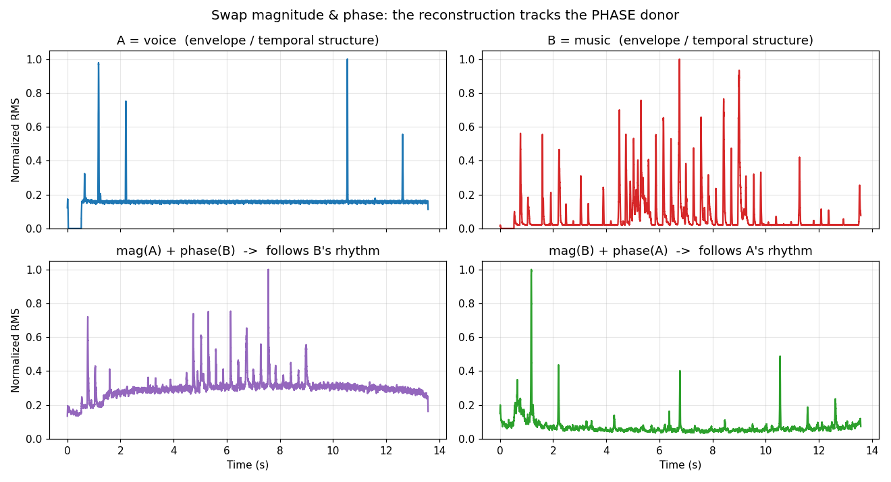

# 第 8 篇｜幅度与相位：频谱的两张脸，被冷落的那张才是主角

> 一句话核心直觉：傅里叶变换给你的 $X(f)$ 是个**复数**，它有两张脸——**幅度谱**说"每个频率有多强"，**相位谱**说"每个频率何时到达"。上一篇我们只画了幅度（`np.abs`），把相位悄悄扔了。这一篇我们要证明：被扔掉的那一半，恰恰藏着"这声音是谁、内容是什么"。所以不能只用一个比喻打发它，得从**物理直觉、数学骨架、工程落地**三个角度各吃透一遍。

---

## 一、先别看公式：一个让人后背发凉的实验

上一篇结尾我下了个狠话：把两段不同声音的**幅度谱**和**相位谱**交叉互换，重建出来，你听到的是提供**相位**的那一段。这一篇我们头一件事就是把它做出来，用结果先把"相位无所谓"这个流行误解按在地上，再回头讲道理。

实验很简单，四步：

1. 拿两段声音：$a$ 是一句人声，$b$ 是一段音乐。
2. 各做一次 FFT，得到复数谱 $A(f)$、$B(f)$。每个都拆成"幅度 × 相位"。
3. 交叉重组：把 $a$ 的幅度配 $b$ 的相位（记作 `magA_phaseB`），把 $b$ 的幅度配 $a$ 的相位（记作 `magB_phaseA`）。
4. 各做一次逆 FFT 变回时域，存成 wav，放出来听。

代码在第六节给全（工作目录里的 `magA_phaseB.wav`、`magB_phaseA.wav` 就是它跑出来的产物）。这里先看结论。

直觉上你会赌：幅度谱是"频谱的主体"，谁提供幅度，就该像谁。**结果恰好相反。** `magA_phaseB.wav`（人声的幅度 + 音乐的相位）听起来更像**音乐**；`magB_phaseA.wav`（音乐的幅度 + 人声的相位）更像**人声**。谁提供**相位**，重建结果就跟谁走。

光凭"听起来像"太主观，我们量化一下。把每段信号的**短时能量包络**（20 ms 窗的 RMS，反映"节奏/时间结构"）算出来，比对相关系数：

```
corr( magA_phaseB , 人声A )  = +0.15
corr( magA_phaseB , 音乐B )  = +0.70   ← 明显更像相位提供方 B
corr( magB_phaseA , 人声A )  = +0.63   ← 明显更像相位提供方 A
corr( magB_phaseA , 音乐B )  = +0.00
```

数字很干脆：重建信号的时间结构，跟**相位提供方**的相关性（0.70、0.63）远高于跟幅度提供方（0.15、0.00）。这就是下面这张图——上排是原始两段的能量包络，下排是两个重建结果的包络，各自"长得像"哪一列的原始信号，一眼可见。



> **关键认知**：相位不是幅度谱的"附属品"或"装饰"。它承载了信号的**时间结构**——什么时候起、什么时候落、各频率成分怎么对齐。而时间结构，往往就是"内容"本身。一句话：**幅度决定"听起来什么音色"，相位决定"听起来是什么事件"。**

后背发凉的地方在于：我们上一篇画了那么多频谱图，全用 `np.abs(X)`，理直气壮地把相位丢了。现在发现，丢掉的那一半可能比留下的还重要。接下来三节，我们把"相位为什么这么重要"从三个角度讲透。

---

## 二、物理角度：幅度是"响度配方"，相位是"进场时机"

先把两者的分工用现象讲透，一个公式不用。

### 2.1 幅度谱：每个频率开多大音量

这个第 6、7 篇一直在讲：钢琴和小提琴弹同一个音，基频一样，区别在**谐波的强弱配比**——那正是幅度谱。你在 EQ 插件里抬高 3 kHz、压掉 200 Hz，改的就是幅度谱。一个持续的元音 /a/ 之所以是 /a/ 而不是 /i/，也主要看它的**共振峰**（能量集中在哪几个频段）——还是幅度谱。

所以静态的、持续的**音色**，主要归幅度管。这也是为什么只画幅度谱（语谱图的亮度）能活得不错：看清了能量分布，音色八九不离十。

### 2.2 相位谱：每个频率几点几分进场

相位管的是另一件事——**时间对齐**。想弄明白"相位为什么等于时机"，盯住一个纯正弦：

$$\cos(2\pi f t + \varphi)$$

那个 $\varphi$（相位）干了什么？它把整根余弦波沿时间轴**平移**。$\varphi$ 变大，波形提前；$\varphi$ 变小，波形推迟。所以对单个频率成分来说，**相位就是"这根波被推迟了多少"**。

一段声音是无数个频率成分叠加而成的。相位谱 $\angle X(f)$，就是记录**每个频率成分各自被推迟了多少**的那张表——也就是它们彼此之间的**时间对齐关系**。

打个乐队的比方（注意这比方只到这儿为止，边界在 2.4 说）：幅度谱是总谱上"每种乐器音量开多大"，相位谱是"每种乐器几点几分进场"。同一份音量表，各声部进场时机全乱套，出来的绝不是同一首曲子。

### 2.3 为什么相位决定瞬态和空间感

相位管"时机"，直接后果有两个，都是幅度管不了的：

**瞬态 (transient)。** 一声鼓击、一个字的起音、吉他的拨片声——这些"啪"一下的能量爆发，物理上靠的是**大量频率成分在同一瞬间对齐地冲上来**。这种"同时到达"本身就是一种特定的相位关系（各频率的相位恰好排成一条线，2.2 里的 $\varphi$ 全都对齐在起跑点）。如果保持幅度不变、只把相位打乱，各频率成分的到达时间就错开了，那个干脆的"啪"会糊成软绵绵的"噗"——**能量一点没少（幅度没变），但瞬态没了**。第一节实验里人声可懂性被破坏，根子就在这儿：辅音的爆破全靠相位对齐。

**空间感。** 你两只耳朵听同一个声源，因为到左右耳距离不同，声音到达两耳的**时间**略有差异——这个时间差，换到频域就是**相位差**（2.5 会看到时移严格等价于相位）。大脑正是靠解读这种双耳相位差来判断声源方位。相位，是空间定位的物理基础。

> **关键认知**：静态音色（持续元音、持续琴音）主要由幅度决定，只看幅度谱能活；但凡涉及**变化**——起音、节奏、方位、动态、拼接——相位就成了主角。语音里辅音的爆破、音乐里鼓组的冲击力，命都攥在相位手里。

### 2.4 主动拆台：那个"乐队进场"的比方，边界在哪

我用了"幅度=音量表、相位=进场时机"的比方，它好懂，但会误导——必须自己把台拆了，否则你会带着一个片面理解往下走。

**误区一：以为幅度和相位是两份独立的信息，可以随便拆开单看。** 不对。它们是**同一个复数** $X(f)$ 的两种坐标表示（2.5 讲清楚），就像一个平面上的点既能用"到原点的距离 + 角度"描述，也能用"横坐标 + 纵坐标"描述。距离和角度不是两个独立零件，是同一个点的两个侧面。

**误区二：以为"进场时机"是各乐器随便一个出场时间。** 更准确的说法是：相位是每个频率成分**相对彼此**的时间偏移。你把整段声音统一延迟 10 ms，听感完全不变（只是晚到），但每个频率的绝对相位其实都变了——变的是**绝对相位**，不变的是**相对相位**。人耳基本听不出整体的绝对相位偏移，敏感的是**相对**关系被打乱（瞬态糊掉、空间错乱）。第一节实验破坏的正是相对关系。

**误区三："相位比幅度重要"是不是普适真理？** 也不是。第一节实验用的是**整段长时 FFT**——把整段声音当成一个巨大的复数谱来交换。这种设定下相位携带了几乎全部时间结构，所以相位赢。但如果换成**短时分析**（第 13 篇 STFT，把声音切成几十毫秒的小片），每小片内部信号近似平稳，幅度谱（那一小片的音色）就重新变得举足轻重——很多经典语音识别前端（MFCC，第 17 篇）甚至**只用每帧的幅度、丢掉帧内相位**照样跑得不错。

所以正确的结论不是"相位 > 幅度"，而是：**幅度和相位各管一摊，谁重要取决于你在多长的时间尺度上看问题。** 长时看全局结构，相位主导；短时看局部音色，幅度够用。这个"尺度决定谁重要"的观念，会一路贯穿到你以后做语音特征工程。

---

## 三、数学角度：一个复数为什么非得拆成"模 × 相位"

物理直觉建好了，现在把它落到公式上。别怕，我们一步一停。

### 3.1 复数的两种坐标：这不是新东西

上一篇的傅里叶变换：

$$X(f) = \int_{-\infty}^{+\infty} x(t)\,e^{-j2\pi f t}\,dt$$

对每个频率 $f$，积出来的 $X(f)$ 是一个**复数**。复数有两种等价的写法，就像平面上一个点有两套坐标：

$$X(f) = \underbrace{a + jb}_{\text{直角坐标}} = \underbrace{r\,e^{j\theta}}_{\text{极坐标}}$$

- **直角坐标** $a + jb$：实部、虚部。FFT 直接吐出来的就是这个。
- **极坐标** $r\,e^{j\theta}$：$r$ 是这个点到原点的**距离**（模长），$\theta$ 是它跟正实轴的**夹角**（辐角）。

两套坐标描述同一个点，换算就是初中三角：

$$r = |X(f)| = \sqrt{a^2 + b^2}, \qquad \theta = \angle X(f) = \operatorname{atan2}(b,\, a)$$

于是傅里叶变换的每个频率点，都能写成：

$$\boxed{\;X(f) = |X(f)|\; e^{\,j\angle X(f)}\;}$$

- $|X(f)|$ 就是**幅度谱**——那个点离原点多远，对应"这个频率有多强"。取模，是因为强度是个非负的长度，跟方向无关。
- $\angle X(f)$ 就是**相位谱**——那个点指向哪个角度，对应"这个频率成分的起跑相位"。取辐角，是因为方向信息全在角度里。

**为什么幅度取模、相位取辐角，不是约定，是被极坐标的结构逼出来的。** 一个复数天生就带"大小"和"方向"两个自由度，模长量大小、辐角量方向，各取所需，一个不多一个不少。

代码里就是两行，`np.abs` 和 `np.angle` 把这两套坐标一分为二：

```python
X = np.fft.rfft(x)
mag   = np.abs(X)      # |X(f)|，幅度谱
phase = np.angle(X)    # ∠X(f)，相位谱，单位弧度，范围 (-π, π]
```

注意 `np.angle` 底层就是 `atan2`，返回值被夹在 $(-\pi, \pi]$ 里——这个"夹"以后会咬你一口，3.4 讲。

### 3.2 我们到底想推什么：时移 = 线性相位

物理角度反复说"相位管时机、时移会改相位"。这话能不能变成一个精确的公式？能。目标是推出这条关系：

$$x(t - t_0) \;\longleftrightarrow\; e^{-j2\pi f t_0}\, X(f)$$

翻译成人话：**把信号在时间上整体推迟 $t_0$，等价于在频域给每个频率 $f$ 的相位减去 $2\pi f t_0$。** 幅度分毫不动（$|e^{-j2\pi f t_0}| = 1$，纯旋转不改长度），只有相位被改；而且改的量 $2\pi f t_0$ 跟频率 $f$ 成**正比**——这就是"**线性**相位"这个词的来历。先记住这个目标，再动手。

### 3.3 先手算一个具体小例子，再抽象

按方法论，抽象公式之前先上具体的。取一个纯余弦，延迟 $t_0$，看相位怎么变。

原信号 $x(t) = \cos(2\pi f_0 t)$。延迟 $t_0$ 后：

$$x(t - t_0) = \cos\big(2\pi f_0 (t - t_0)\big) = \cos\big(2\pi f_0 t \,-\, 2\pi f_0 t_0\big)$$

对照标准形式 $\cos(2\pi f_0 t + \varphi)$，一眼看出多出来的相位是 $\varphi = -2\pi f_0 t_0$。

停一下，盯住这个 $\varphi = -2\pi f_0 t_0$，三件事全在里面：

- **幅度没变**：还是那根余弦，振幅是 1。延迟不改一个频率有多强。
- **相位变了**：多了 $-2\pi f_0 t_0$，负号表示"推迟"（相位滞后）。
- **相位正比于频率**：同样延迟 $t_0$，频率 $f_0$ 越高，相位挪得越多。频率翻倍，相位挪动量翻倍。这就是"线性"。

这个小例子已经把结论摆出来了。现在只差把"一根余弦"换成"任意信号"。

### 3.4 抽象成通式：换元一步到位

任意信号也一样，因为傅里叶变换是线性的——任意信号是无数个不同频率成分的叠加，每个成分都按 3.3 那样各自挪相位，合起来就是通式。直接算延迟信号的傅里叶变换：

$$\mathcal{F}\{x(t-t_0)\} = \int_{-\infty}^{+\infty} x(t - t_0)\, e^{-j2\pi f t}\, dt$$

令 $\tau = t - t_0$（也就是 $t = \tau + t_0$，$dt = d\tau$），换元：

$$= \int_{-\infty}^{+\infty} x(\tau)\, e^{-j2\pi f (\tau + t_0)}\, d\tau
 = e^{-j2\pi f t_0} \int_{-\infty}^{+\infty} x(\tau)\, e^{-j2\pi f \tau}\, d\tau$$

后面那个积分正是 $X(f)$ 的定义。于是：

$$\boxed{\;\mathcal{F}\{x(t-t_0)\} = e^{-j2\pi f t_0}\, X(f)\;}$$

推完了。$e^{-j2\pi f t_0}$ 这个因子模长恒为 1、辐角是 $-2\pi f t_0$——**它只旋转相位、不碰幅度，旋转量随 $f$ 线性增长**。跟 3.3 手算的小例子完全吻合，只是从"一根余弦"推广到了"任意信号"。

> **关键认知**：**时域的平移 = 频域的线性相位。** 延迟一段声音，幅度谱纹丝不动，只在相位上叠加一条斜率为 $-2\pi t_0$ 的直线。反过来，如果你看到一段信号的相位谱是一条漂亮直线，基本就能断定它是某个东西的纯延迟版本。

代码里验证一下这条关系，顺手把它画出来（完整脚本第六节）。给一个延迟 64 个采样的单位脉冲，它的相位谱应该是一条直线，斜率能反推出延迟量：

```python
N = 2048
imp = np.zeros(N); imp[64] = 1.0          # 延迟 64 个采样的脉冲
X = np.fft.rfft(imp)
freqs = np.fft.rfftfreq(N, d=1/44100)
phase = np.unwrap(np.angle(X))            # 关键：先 unwrap！见 3.5
slope = np.polyfit(freqs, phase, 1)[0]    # 直线斜率
delay = -slope / (2*np.pi) * 44100        # 反推延迟 -> 64.00 个采样
```

跑出来 `delay = 64.00`，跟设定的延迟严丝合缝。相位谱真的是一条直线，斜率真的编码着延迟量。

### 3.5 相位缠绕 (wrapping)：一个会咬你的坑

上面代码里那句 `np.unwrap` 不是可有可无的。这是相位在工程里最常见的坑，必须单独说。

`np.angle` 底层是 `atan2`，返回值被夹在 $(-\pi, \pi]$。可真实的相位（比如 3.4 里 $-2\pi f t_0$）随频率一路减到 $-100\pi$ 都正常。当它减过 $-\pi$，`atan2` 会把它"折"回 $(-\pi,\pi]$——本该笔直往下的直线，被切成了锯齿状的来回跳。这就是**相位缠绕 (phase wrapping)**。

```
真实相位(线性递减):  \
                      \
                       \___________  (一路向下)

atan2 折回后(缠绕):  \   \   \   \
                      \   \   \   \   (每跌过 -π 就 +2π 蹦回顶上)
```

看下图右上角：原始 `np.angle` 输出（红点）是锯齿；`np.unwrap` 之后（左上角）才是那条能读出斜率的直线。


`np.unwrap` 干的事：扫过相位序列，只要相邻两点跳变超过 $\pi$，就给后面整体补 $\pm 2\pi$，把锯齿接回连续曲线。**任何要从相位里读延迟、算群延迟、做相位声码器的代码，第一步几乎都是 unwrap。** 忘了它，你算出来的延迟、群延迟全是垃圾——这类 bug 出奇地常见。

### 3.6 群延迟：相位对频率的导数，驱动味的抓手

有了线性相位，"群延迟 (group delay)"就水到渠成。定义是相位对频率求导取负：

$$\tau_g(f) = -\frac{1}{2\pi}\frac{d\,\angle X(f)}{df}$$

别被导数吓到，含义极朴素：**群延迟就是"频率 $f$ 附近这一撮成分，实际被延迟了多少秒"。** 拿 3.4 的结论验一下——纯延迟系统相位是 $-2\pi f t_0$，对 $f$ 求导取负：

$$\tau_g = -\frac{1}{2\pi}\cdot(-2\pi t_0) = t_0$$

群延迟恒等于 $t_0$，对所有频率都一样。**这正是"线性相位"的定义性特征：相位是 $f$ 的直线，导数（斜率）是常数，所以每个频率延迟相同。** 这跟第 5 篇 4.3 节提过的"对称钟形 FIR 引入约 $N/2$ 个采样群延迟"是同一件事——那种滤波器的相位就是线性的，群延迟是一个恒定的常数 $N/2$。

反过来，如果相位**不是**直线（比如 IIR 滤波器），群延迟就随频率变化：低频延迟多、高频延迟少之类。不同频率被延迟不同的量，原本对齐冲上来的瞬态就被拆散了——这就是**相位失真**，也是第四节工程视角的核心。

> **关键认知**：**幅度谱看 $|X(f)|$，相位谱看斜率。** 相位的绝对值人耳基本无感，人耳在意的是相位的**斜率随频率变不变**——斜率恒定（线性相位）= 各频率同步延迟 = 瞬态完好；斜率乱变（非线性相位）= 各频率延迟不一 = 瞬态糊掉。群延迟就是把"斜率"这件事量化成了"延迟多少秒"，让你能直接拿数字说话。

---

## 四、工程角度：相位在真实系统里怎么坑你、怎么帮你

物理讲了"是什么"，数学讲了"为什么"，现在讲"在 CPU 和信号链里到底怎么打交道"。

### 4.1 相位抵消 / 梳状滤波：多话筒录音的头号敌人

回到第一节没细讲的一个现象。两支话筒录同一个声源，摆位导致到达两支话筒有时间差 $t_0$。按 3.4 的结论，这个延迟等价于给第二路信号叠了一条线性相位。两路相加时会发生什么？

拿一个 500 Hz 纯音手算。原信号 $\sin(2\pi\cdot500\cdot t)$，延迟 $t_0$ 后相加：

- 若延迟恰好半个周期（$t_0 = 1$ ms 时，$500 \times 0.001 = 0.5$ 周期），两路正好**反相**，相加**抵消**，这个频率消失。
- 若延迟恰好整周期，两路**同相**，相加**加倍**。

关键在于：**两路的幅度完全一样（同一个 500 Hz、同样响），仅仅相位差就能把合成结果从"翻倍"推到"归零"。** 下图下排就是这个实验——延迟 0.5 ms 和 1.0 ms，同样两路信号，合成波形振幅天差地别（回看上面那张 `fig_08_2_1.png` 的下排两格）。

对一段**宽频**声音，不同频率对应的"半周期延迟"各不相同，于是有的频率被抵消、有的被加强，频响上出现一排均匀的凹陷，形状像梳子齿——这就是**梳状滤波 (comb filter)**，听感是声音发"空"、发"薄"。混音师给多话筒鼓组做的第一件事就是**相位对齐**：把各话筒信号在时间上对齐，消掉这些抵消。

```python
fs = 44100
t = np.arange(int(fs * 0.05)) / fs
tone = np.sin(2*np.pi*500*t)
d = int(fs * 0.001)                 # 1 ms 延迟 = 500Hz 的半周期
mixed = tone + np.roll(tone, d)     # 反相 -> 500Hz 被抵消，振幅塌下去
```

改延迟量试试（`0.0005`、`0.001`、`0.002`），你会看到合成振幅从近乎翻倍一路滑到接近归零。**这就是录音棚"相位问题"的本质。**

### 4.2 线性相位 FIR：为什么它在音频里备受推崇

3.6 的群延迟给了这个术语一秒钟的解释。

普通滤波器（常见的 IIR EQ、模拟味的滤波器）相位是**非线性**的——群延迟随频率变，低频延迟多、高频延迟少之类。结果：原本对齐冲上来的各频率成分，被滤波器打乱了到达时间，**瞬态被抹糊**。鼓的冲击力、辅音的清晰度就受损。这是相位失真的典型代价。

**线性相位 FIR** 的相位是 $f$ 的直线（3.6），群延迟是一个**恒定常数**。所有频率整体推迟同样多，彼此相对时间关系纹丝不动，于是瞬态被完整保留。它靠**对称的冲激响应**做到这点：

```python
from scipy.signal import firwin, group_delay
h = firwin(101, cutoff=4000, fs=44100)   # 对称 FIR -> 天然线性相位
# h[k] == h[N-1-k]，对称性保证相位严格线性
w, gd = group_delay((h, 1), fs=44100)
# gd 是一条水平线，恒等于 (101-1)/2 = 50 个采样
```

$N=101$ 个抽头的对称 FIR，群延迟恒为 $(N-1)/2 = 50$ 个采样，对所有频率都一样——这正是 3.6 那句"斜率恒定 = 各频率同步延迟"的代码版。代价是这 50 个采样的固定延迟（$N$ 越长延迟越大），以及冲激前会有轻微"预振铃"。母带处理、需要保护瞬态的场合，这个特性极其珍贵；实时低延迟场合则要在延迟预算和相位平直之间权衡。

> **驱动视角的坑**：线性相位带来的 $(N-1)/2$ 群延迟是**实打实的算法延迟**，会叠加在你的 ring buffer 缓冲延迟之上。做实时唤醒词、AEC 这类对齐敏感的系统时，滤波器长度直接吃掉你的延迟预算。这跟第 5 篇 4.3 节说的"$h$ 长度决定延迟预算"是同一本账。

### 4.3 unwrap 在 CPU 里怎么算，以及别忘了它

3.5 说了 wrapping 会咬人，这里补工程实现。`np.unwrap` 的算法一句话能说清：顺序扫过相位数组，维护一个累积偏移量，每当相邻两点差超过 $\pi$，就把后续全体补 $\mp 2\pi$。$O(N)$ 一遍扫完，成本可忽略。

真正的坑不在算法，在**边界情况**：

- **频谱有零点时相位无意义**。某个频率幅度接近 0（比如梳状滤波抵消掉的那些频率），它的相位是 $\operatorname{atan2}(\approx0, \approx0)$——纯噪声，乱跳。unwrap 会被这些噪声点带偏，注入虚假的 $2\pi$ 跳变。工程上常见做法是**幅度加权**或在低幅度处**跳过 unwrap**。
- **采样太稀疏，两点间真实相位跳变就超过 $\pi$**，unwrap 无从判断该不该补——它只能假设"跳变小于 $\pi$"。频率分辨率不够时（FFT 点数太少），unwrap 可能补错方向。
- **相位声码器 (phase vocoder)** 做变速不变调，核心难点正是逐帧维护相位的连续性（相位累积、相位锁定）。unwrap 是它的基本功，处理不好声音就"糊"或有"金属味"。

### 4.4 全通滤波器：只改相位、不碰幅度

有一类滤波器专门用来"单独动相位"：**全通滤波器 (all-pass filter)**。它的幅度响应对所有频率恒等于 1（$|H(f)| = 1$，什么都不放大不削弱），但相位随频率变化。

它存在的意义正好印证本篇主题：**幅度和相位是两个可以独立操纵的自由度。** 全通滤波器一个音量都不改，却能重塑瞬态、制造相位失真或补偿别处的相位失真。用途包括：均衡多路信号的群延迟、做相位声码器的构件、混响算法里打散相位制造扩散感。它是"相位是一份独立信息"这件事最直白的工程证据——你能在完全不动幅度谱的前提下，把声音的时间结构改得面目全非。

### 4.5 工程场景速查

| 场景 | 相位在其中扮演的角色 |
|------|--------------------|
| **多话筒相位对齐** | 各话筒到达时间不同 → 相位不齐 → 叠加后某些频率被抵消，声音变空。混音第一步就是对齐（4.1） |
| **梳状滤波 / 相位抵消** | 直达声与延迟副本相加，特定频率反相相消，频响出现梳齿状凹陷（4.1） |
| **立体声 / 空间感** | 左右声道的相位差、时间差是营造声像宽度与定位的核心（2.3） |
| **线性相位 FIR** | 群延迟恒定，保住相对时间关系，保护瞬态（4.2） |
| **全通滤波器** | 只改相位不改幅度，用于群延迟均衡、相位失真补偿（4.4） |
| **相位声码器** | 变速不变调 / 变调不变速，难点是拉伸时保持相位连贯，否则声音"糊"（4.3） |
| **MFCC / 语音识别前端** | 反而**丢掉帧内相位**、只留幅度包络——短时尺度下音色够用（呼应 2.4，详见第 17 篇） |

---

## 五、代码实战：把三个角度跑成一张图

前面的片段都是节选，这里给第一节那个"幅度相位交换"实验的完整可运行版。它不依赖任何外部音频——工作目录里有 `Test-voice.wav` / `Test_music.wav` 就用真的，没有就自动合成两段声音，保证复制粘贴就能跑。产物是 `magA_phaseB.wav`、`magB_phaseA.wav` 和 `fig_08_1_1.png`。

```python
import os
import numpy as np
import matplotlib.pyplot as plt
from scipy.io import wavfile

def load_mono(path):
    fs, x = wavfile.read(path)
    x = x.astype(float)
    if x.ndim > 1:           # 立体声塌成单声道
        x = x.mean(axis=1)
    return fs, x

fs = 16000
if os.path.exists("Test-voice.wav") and os.path.exists("Test_music.wav"):
    fs, a = load_mono("Test-voice.wav")   # 一句人声
    _,  b = load_mono("Test_music.wav")   # 一段音乐
else:                                     # 没有 wav 就合成两段不同的声音
    t = np.arange(int(fs * 1.5)) / fs
    a = (np.sin(2*np.pi*160*t) + 0.5*np.sin(2*np.pi*320*t)
         + 0.3*np.sin(2*np.pi*480*t)) * (1 + 0.3*np.sin(2*np.pi*3*t))
    b = (np.sin(2*np.pi*220*t) + 0.6*np.sin(2*np.pi*277*t)
         + 0.6*np.sin(2*np.pi*330*t)) * (0.5 + 0.5*(np.sin(2*np.pi*2*t) > 0))

n = min(len(a), len(b)); a = a[:n]; b = b[:n]   # 截成一样长

# 各做 FFT，拆成 幅度 × 相位（3.1 的极坐标分解）
A = np.fft.rfft(a); B = np.fft.rfft(b)
mag_a, pha_a = np.abs(A), np.angle(A)
mag_b, pha_b = np.abs(B), np.angle(B)

# 交叉重组：一方的幅度 × 另一方的相位
mix1 = mag_a * np.exp(1j * pha_b)     # A 的幅度 + B 的相位
mix2 = mag_b * np.exp(1j * pha_a)     # B 的幅度 + A 的相位

y1 = np.fft.irfft(mix1, n)            # 变回时域
y2 = np.fft.irfft(mix2, n)

for name, y in [("magA_phaseB", y1), ("magB_phaseA", y2)]:
    yi = np.int16(y / (np.max(np.abs(y)) + 1e-12) * 32767 * 0.9)
    wavfile.write(f"{name}.wav", fs, yi)

# 量化验证：短时能量包络（反映时间结构）跟谁更像
def envelope(x, win=320):
    p = np.sqrt(np.convolve(x**2, np.ones(win)/win, mode="same"))
    return p / (p.max() + 1e-12)

def corr(u, v):
    u = u - u.mean(); v = v - v.mean()
    return float((u @ v) / (np.linalg.norm(u)*np.linalg.norm(v) + 1e-12))

ea, eb, e1, e2 = map(envelope, (a, b, y1, y2))
print("mix1(magA+phaB) vs A / B:", round(corr(e1,ea),3), round(corr(e1,eb),3))
print("mix2(magB+phaA) vs A / B:", round(corr(e2,ea),3), round(corr(e2,eb),3))
```

跑出来的相关系数（第一节那组 0.70 / 0.63 vs 0.15 / 0.00）和听感一致：**重建信号的时间结构跟着相位提供方走。** 把 `mix1`、`mix2` 里的相位来源对调，你可以亲手验证"谁给相位，就像谁"这条铁律。

想更直观，可以把 `y1`、`y2` 用系统播放器放出来，或用第 7 篇画语谱图的代码看它们的频谱——你会发现 `magA_phaseB` 的**幅度谱**确实等于 A（我们就是这么造的），可它听起来、看时间结构却像 B。幅度和相位是两份能各自作主的信息，这张图和这两段 wav 就是铁证。

---

## 六、埋一个钩子：可这一切，都建立在"把声波偷成数字"之上

级数、变换、幅度相位——这三篇我们一直在频域里畅游，交换相位、算群延迟、拆复数，玩得不亦乐乎。但有个根基性的问题，我们从头到尾跳过了：

我们分析的、FFT 的、交换相位的，**全都是电脑里的一串数字**。可声音本身是**连续**的空气振动，无限精细、没有"下一个样本"的说法。**麦克风到底怎么把连续声波，变成一串离散数字的？** 这个"偷"的过程，会不会偷漏、偷错？

会，而且错起来非常诡异——**一个真实存在的高频，可能被"偷"成一个根本不存在的低频**，凭空出现在你的频谱里。这种鬼影叫**混叠 (aliasing)**。为什么 CD 是 44.1 kHz、专业录音是 48 kHz？为什么每个 ADC 前面都杵着一个抗混叠滤波器？为什么有人故意制造混叠做 lo-fi 效果？

这一切的答案，是整个数字音频的地基定理——**采样定理**。下一篇（第 9 篇），我们把频域之门的最后一块砖砌上。

---

## 本篇小结

- **频谱是复数，有两张脸**：$X(f) = |X(f)|\,e^{j\angle X(f)}$。幅度谱 $|X(f)|$ 说"每个频率多强"，相位谱 $\angle X(f)$ 说"每个频率何时到达"。它们是同一个复数的极坐标两坐标，不是两份独立零件（第三节 3.1）。
- **三个角度看同一件事**：物理上，幅度是"响度配方"（音色）、相位是"进场时机"（瞬态、空间感）；数学上，时移严格等价于线性相位 $x(t-t_0)\leftrightarrow e^{-j2\pi f t_0}X(f)$，群延迟 $\tau_g=-\frac{1}{2\pi}\frac{d\angle X}{df}$ 把"相位斜率"量化成"延迟多少秒"；工程上，相位抵消、线性相位 FIR、全通滤波、unwrap 都是天天打交道的物件。
- **实验证据**：交换两段声音的幅度与相位，重建结果的时间结构跟着**相位提供方**走（能量包络相关性 0.70 / 0.63 远高于幅度方 0.15 / 0.00）。相位承载信号的时间结构，也就是"内容"。
- **主动拆台（2.4）**："相位比幅度重要"不是普适真理——它成立于**长时全局**分析；到了**短时**尺度（STFT、MFCC），帧内幅度重新主导，语音识别前端甚至直接丢掉帧内相位。谁重要，取决于你在多长的时间尺度上看。
- **相位缠绕的坑（3.5）**：`np.angle` 把相位夹在 $(-\pi,\pi]$，读延迟/群延迟前必须 `np.unwrap`；低幅度频点相位是噪声，unwrap 要加权或跳过。
- **工程金句**：幅度谱看模长、相位谱看斜率；凡是和节奏、冲击、方位、拼接有关的问题，先怀疑相位。
- **下一步**：这一切都建立在"把连续声波采成数字"之上——采样不当会产生混叠，采样定理登场（第 9 篇）。


