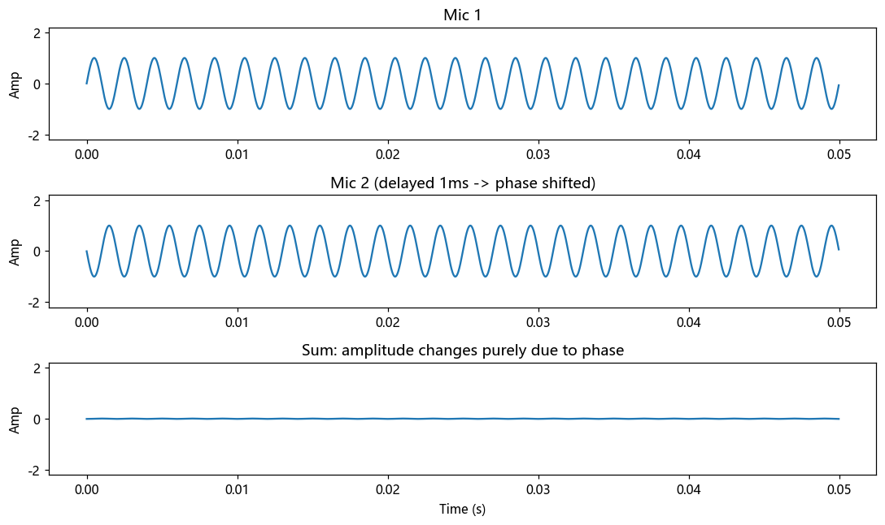

# 第 8 篇｜幅度与相位：频谱的两张脸，被忽视的那张更重要

> 一句话核心直觉：频谱不只告诉你"每个频率有多响"（幅度），还告诉你"每个频率何时到达"（相位）。幅度决定**音色**，相位决定**瞬态和空间感**。大多数人只盯着前者，可真正让声音"活"起来的，是后者。

---

## 一、先别看公式，我们做一个后背发凉的实验

上一篇结尾我下了个狠断言：把两段不同音乐的**幅度谱**和**相位谱**交叉互换，你听到的是提供**相位**的那一段。这一篇我们先把这个实验做出来，用结果把"相位不重要"这个流行误解按在地上。

先说清楚频谱那"两张脸"到底是什么。傅里叶变换给出的 $X(f)$ 是个复数，一个复数可以拆成两部分：

- **幅度谱 $|X(f)|$**：频率 $f$ 这个成分**有多强**。这是我们上一篇一直在画的东西。
- **相位谱 $\angle X(f)$**：频率 $f$ 这个成分**在时间上被推迟了多少**——它此刻的"起跑位置"。

一个直观的比方：一支管弦乐队里，幅度谱规定了"每种乐器音量开多大"，相位谱规定了"每种乐器几点几分进场"。同样一份音量表，如果各声部进场时机全乱套，出来的绝不是同一首曲子。

**为什么相位管的是"何时到达"？** 因为一个正弦波 $\cos(2\pi f t + \varphi)$ 里的 $\varphi$，本质就是把这根波沿时间轴平移。平移，就是"提前"或"推迟"。所以相位谱记录的，是每个频率成分彼此之间的**时间对齐关系**。

---

## 二、为什么幅度决定音色，相位决定瞬态

先把两者的分工用现象讲透，公式一个不用。

**幅度谱决定音色。** 这个第 6 篇就铺垫过了：钢琴和小提琴的区别，在于谐波的强弱配比——那正是幅度谱。你调 EQ，抬高或压低某些频段，改的也是幅度谱。所以"音色"这件事，主要归幅度管。

**相位谱决定瞬态和空间感。** 这个更微妙，分两层看：

1. **瞬态（transient）**：一声鼓击、一个字的起音、吉他的拨片声——这些"啪"一下的能量爆发，靠的是**大量频率成分在同一瞬间对齐地冲上来**。这种"同时到达"就是一种特定的相位关系。如果把相位打乱，各频率成分到达时间错开，那个干脆利落的"啪"就会糊成一团软绵绵的"噗"——能量还在（幅度没变），但瞬态没了。
2. **空间感**：你的两只耳朵听同一个声源，因为距离差，声音到左右耳的**时间**略有不同——这个时间差就是相位差。大脑正是靠解读这种双耳相位差来判断声音来自哪个方向。相位，是空间定位的物理基础。

> **关键认知**：幅度谱是"配方"，相位谱是"时机"。静态的音色（一个持续的元音、一个持续的琴音）主要由幅度决定，所以只看幅度谱能活得不错；但凡涉及**变化**——起音、节奏、方位、动态——相位就成了主角。语音里辅音的爆破、音乐里鼓组的冲击力，命都攥在相位手里。

---

## 三、代码实战：交换幅度与相位，听谁说了算

直接上那个后背发凉的实验。我们拿两段不同的声音，把它们的幅度谱和相位谱交叉组合，看重建出来的是谁。

```python
import numpy as np
from scipy.io import wavfile

# 读入两段真实录制的音频(采样率一致,长度截成一样)
# 若手头没有 wav,下面会自动合成两段不同的声音,保证代码能直接跑
import os

def load_mono(path):
    fs, x = wavfile.read(path)
    x = x.astype(float)
    if x.ndim > 1:              # 立体声取双声道平均,collapse 成单声道
        x = x.mean(axis=1)
    return fs, x

fs = 16000
if os.path.exists("Test-voice.wav") and os.path.exists("Test_music.wav"):
    fs, a = load_mono("Test-voice.wav")   # 实际录制的一句人声
    _,  b = load_mono("Test_music.wav")   # 实际录制的一段音乐
else:
    t = np.arange(int(fs * 1.5)) / fs
    # a: 一段"嗓音"——基频 + 几个谐波,带缓慢起伏
    a = (np.sin(2*np.pi*160*t) + 0.5*np.sin(2*np.pi*320*t)
         + 0.3*np.sin(2*np.pi*480*t)) * (1 + 0.3*np.sin(2*np.pi*3*t))
    # b: 一段"音乐"——不同的和弦组合与节奏
    b = (np.sin(2*np.pi*220*t) + 0.6*np.sin(2*np.pi*277*t)
         + 0.6*np.sin(2*np.pi*330*t)) * (0.5 + 0.5*(np.sin(2*np.pi*2*t) > 0))
    a = (a * 20000).astype(np.int16)
    b = (b * 20000).astype(np.int16)
n = min(len(a), len(b))
a = a[:n].astype(float); b = b[:n].astype(float)

# 各自做 FFT,拆出幅度与相位
A = np.fft.rfft(a); B = np.fft.rfft(b)
mag_a, pha_a = np.abs(A), np.angle(A)
mag_b, pha_b = np.abs(B), np.angle(B)

# 交叉重组: 甲的幅度 + 乙的相位
mix1 = mag_a * np.exp(1j * pha_b)     # A的幅度, B的相位
mix2 = mag_b * np.exp(1j * pha_a)     # B的幅度, A的相位

y1 = np.fft.irfft(mix1, n)
y2 = np.fft.irfft(mix2, n)

for name, y in [("magA_phaseB", y1), ("magB_phaseA", y2)]:
    y = np.int16(y / np.max(np.abs(y)) * 32767 * 0.9)
    wavfile.write(f"{name}.wav", fs, y)
```

放出来听，结论往往让人吃惊：**`magA_phaseB.wav`（甲的幅度 + 乙的相位）听起来更像乙，`magB_phaseA.wav` 更像甲。** 提供相位的那一段，主导了"这听起来是什么"。相位远不是可有可无的附属品——它承载了信号的时间结构，也就是"内容"本身。

再做个更贴近工程的实验：**相位抵消**。两支话筒录同一个声源，若摆位导致某些频率到达两支话筒时正好反相，相加后这些频率就被抵消——声音变"空"、变薄。

```python
import numpy as np
import matplotlib.pyplot as plt

fs = 44100
t = np.arange(int(fs * 0.05)) / fs
tone = np.sin(2 * np.pi * 500 * t)          # 一个 500Hz 纯音

# 话筒2 的信号延迟 1ms (模拟两话筒间距造成的到达时间差)
delay = int(fs * 0.001)
tone2 = np.roll(tone, delay)

mixed = tone + tone2                          # 两路直接相加(如单声道叠加)

fig, ax = plt.subplots(3, 1, figsize=(10, 6))
ax[0].plot(t, tone);   ax[0].set_title("Mic 1")
ax[1].plot(t, tone2);  ax[1].set_title("Mic 2 (delayed 1ms -> phase shifted)")
ax[2].plot(t, mixed);  ax[2].set_title("Sum: amplitude changes purely due to phase")
for a_ in ax: a_.set_ylim(-2.2, 2.2); a_.set_ylabel("Amp")
ax[-1].set_xlabel("Time (s)")
plt.tight_layout()
plt.show()
```



两路信号**幅度完全一样**（都是 500 Hz、同样响），仅仅因为**相位差**（1 ms 延迟），相加后的振幅就大变。改变延迟量（试试 `0.001`、`0.0005`、`0.002`），你会看到相加结果从几乎翻倍（同相加强）一路变到接近抵消（反相相消）。**这就是录音棚里"相位问题"的本质，也是为什么多话筒录音必须做相位对齐。**

---

## 四、这在音频工程里，到底解决了什么问题

| 场景 | 相位在其中扮演的角色 |
|------|--------------------|
| **多话筒录音相位对齐** | 一套鼓用十几支话筒，各话筒到达时间不同→相位不齐→叠加后某些频率被抵消，声音变空。混音第一步就是对齐相位 |
| **相位抵消 / 梳状滤波** | 直达声与反射声（或延迟副本）相加，特定频率反相相消，形成一梳齿状的频响凹陷，声音发"空"发"薄" |
| **立体声 / 空间感** | 左右声道的相位差、时间差是营造声像宽度和定位的核心手段 |
| **线性相位滤波器** | 见下一节，音频里备受推崇的一类滤波器 |
| **相位声码器 (phase vocoder)** | 变速不变调、变调不变速，核心难点正是如何在拉伸时保持相位连贯，否则声音会"糊" |

### 为什么"线性相位滤波器"备受推崇

这是个高频出现的术语，用相位视角一秒就懂。

普通滤波器（如常见的 IIR EQ）对不同频率的成分施加**不同的延迟**——低频延迟多、高频延迟少之类。结果：原本对齐冲上来的那些频率成分，被滤波器打乱了到达时间，**瞬态被抹糊**了。鼓的冲击力、辅音的清晰度就受损。

**线性相位滤波器**的特点是：对所有频率施加**相同的延迟**（相位随频率线性变化，故名）。所有频率整体推迟同样多，彼此的相对时间关系**纹丝不动**，于是瞬态被完整保留。代价是整体延迟较大且可能有"预振铃"，但在母带、需要保护瞬态的场合，这个特性极其珍贵。

> **一句话记住**：**幅度谱管"是什么音色"，相位谱管"什么时候到、从哪来"。** 凡是和节奏、冲击、方位、拼接有关的问题，先怀疑相位。

---

## 五、埋一个钩子：可这一切，都建立在"数字采样"之上

这三篇（级数、变换、幅度相位）我们一直在频域里畅游。但有个根基性的问题被我们跳过了：

我们分析的、变换的、交换相位的，全都是电脑里的**一串数字**。可声音本身是**连续**的空气振动。**麦克风到底是怎么把连续、无限精细的声波，变成一串离散数字的？** 这个"偷"的过程，会不会偷漏、偷错？

会。而且错起来非常诡异——**一个真实存在的高频，可能被"偷"成一个根本不存在的低频**，凭空出现在你的频谱里。这种鬼影就叫**混叠 (aliasing)**。为什么 CD 是 44.1 kHz、专业录音是 48 kHz？为什么每个 ADC 前面都杵着一个抗混叠滤波器？为什么有人故意制造混叠来做 lo-fi 效果？

这一切的答案，是整个数字音频的地基定理——**采样定理**。下一篇，我们把频域之门的最后一块砖砌上。

---

## 本篇小结

- **频谱有两张脸**：幅度谱 $|X(f)|$（每个频率多强）和相位谱 $\angle X(f)$（每个频率何时到达）。
- **分工**：幅度决定音色，相位决定瞬态与空间感。静态音色靠幅度，一切"变化"靠相位。
- **实验证据**：交换两段声音的幅度与相位，听起来更像提供**相位**的那段——相位承载了信号的时间结构。
- **相位抵消**：幅度相同的两路信号，仅因相位差就能从加强变成抵消，这是多话筒录音的核心问题。
- **线性相位滤波器**：对所有频率施加相同延迟，保住相对时间关系，从而保护瞬态，故受推崇。
- **下一步**：这一切都建立在"把连续声波采成数字"之上——采样不当会产生混叠，采样定理登场。
