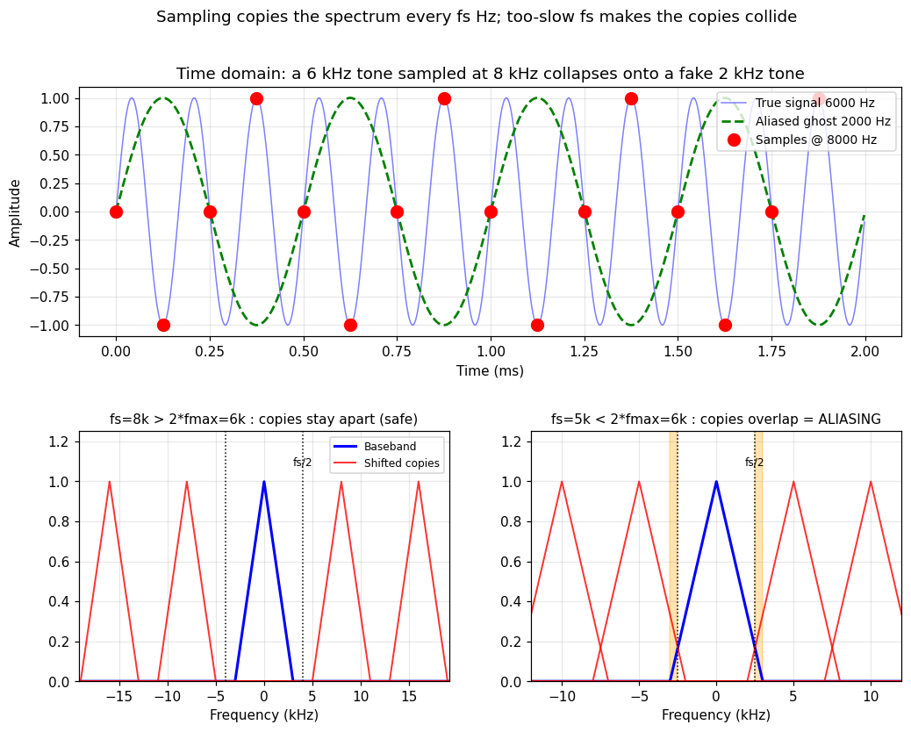

# 第 9 篇｜采样定理：麦克风如何把连续声波"偷"成一串数字

> 一句话核心直觉：采样，就是给连续的声波**拍连拍照片**。拍得够快，一串照片就能忠实还原运动；拍得太慢，飞快的运动会被拍成假象——一个真实的高频被"偷"成了一个根本不存在的低频，这就是**混叠 (aliasing)**。这一篇是整个"频域之门"模块的收尾，我们不满足于"车轮倒转"这一个比喻，而要把采样与奈奎斯特 $f_s > 2f_{\max}$ 从**物理直觉、频域数学、工程落地**三个角度都吃透——尤其要亲手把那条"两倍"的底线**推导出来**。

---

## 一、先别看公式，我们看车轮倒转

上一篇（第 8 篇）我们在频域里聊透了幅度与相位，结尾埋了个根基性的钩子：这一切频谱分析，都建立在"把连续声波采成数字"之上。可麦克风到底是怎么把**连续**的空气振动，变成电脑里**离散**的一串数字的？这一步没做好，前面第 6～8 篇的频谱分析全是空中楼阁。

先看一个你在电影里一定见过的怪现象：镜头里飞驰的汽车，车轮有时看起来**在倒转**，甚至静止不动。车明明在往前冲，轮子怎么会倒着转？

原因在于摄影机是**一帧一帧拍**的（比如每秒 24 帧）。如果车轮转得太快，在两帧之间轮子转过了大半圈，那么连续的画面看起来就像轮子只往回退了一点点——**快速的真实运动，被稀疏的采样"看"成了一个缓慢的、方向相反的假运动。**

声音采样面临一模一样的问题。麦克风 + ADC 不是连续记录声波，而是每隔一个固定的小间隔"看一眼"当前的声压值，记下一个数。每秒看的次数，就是**采样率 $f_s$**（CD 是 44100 次/秒）。如果声音里有个频率太高的成分，在两次采样之间它已经振动了大半个周期，那么这串采样点连起来，看着就像一个**频率低得多的、根本不存在的**波——高频被伪装成了低频。

**车轮倒转，是眼睛被采样率骗了；混叠，是频谱被采样率骗了。**

这个画面先记住。但我得提前打个预防针：**车轮只是个便于起步的特例**，它是一个窄带的周期运动，而语音是宽带、非周期的信号——车轮比喻会在第六节被我们亲手拆掉。真正把混叠讲死的，是频域里一张"频谱被复制了无数份"的图。我们一步步走过去。

---

## 二、采样，在数学上到底是把连续声波"乘"上了什么

要用频域讲清混叠，得先把"采样"这个动作翻译成一个数学操作。凭直觉，采样就是"每隔 $T_s$ 秒记一个数"，$T_s = 1/f_s$ 叫**采样周期**。但"记一个数"这个动作，怎么写成公式？

这里有个建模上的关键选择，也是采样定理全部魔法的来源。我们**不**把采样想成"每隔 $T_s$ 取一个孤零零的数"，而是想成：**拿一把"采样梳子"去乘原信号。**

### 2.1 冲激串：一把间距为 $T_s$ 的"采样梳子"

回到第 5 篇那个老朋友——冲激 $\delta$。把无穷多个冲激按固定间距 $T_s$ 排成一排，就得到一个**冲激串 (impulse train)**，教材里常记作 $\text{ш}$（读作 shah）：

$$s(t) = \sum_{n=-\infty}^{+\infty} \delta(t - nT_s)$$

它长这样，一根一根等距的尖刺，像一把梳子：

```
s(t):  |     |     |     |     |     |     |
       ↑     ↑     ↑     ↑     ↑     ↑     ↑
     -3Ts  -2Ts  -Ts    0    Ts   2Ts   3Ts
       └─ 间距 Ts = 1/fs ─┘
```

**采样，就是把连续声波 $x(t)$ 乘上这把梳子：**

$$x_s(t) = x(t)\cdot s(t) = \sum_{n} x(t)\,\delta(t - nT_s) = \sum_{n} x(nT_s)\,\delta(t - nT_s)$$

最后一步用了第 5 篇讲过的**筛选性质**：$\delta$ 在 $t=nT_s$ 处是根尖刺，别处全为零，所以 $x(t)$ 乘上它，只在 $t=nT_s$ 那一瞬间留下 $x(nT_s)$ 这个高度。于是采样后的信号 $x_s(t)$，就是一串**位置在 $nT_s$、高度为 $x(nT_s)$ 的冲激**——每根尖刺的高度，正好是那一刻的声压值。这跟电脑里存的数组 `x[n] = x(n*Ts)` 完全对应。

你可能会皱眉：**"我明明只是记了些孤立的数，你非要说成乘一把无穷长的梳子，是不是把简单事搞复杂了？"** 你的感觉没错，就时域而言这确实有点绕。但请记住我们的目的：**我们想知道采样对"频谱"做了什么。** 而"乘法"这个动作，一到频域就会兑现成一个极其漂亮的结果——那才是我们绕这一圈的全部理由。下一节揭晓。

> **关键认知（建模）**：采样 = 原信号**乘上**一把间距 $T_s=1/f_s$ 的冲激梳子。选择"乘梳子"而不是"取孤立点"，是因为乘法在频域有我们要的性质。


---

## 三、把"两倍"这条底线推导出来：频谱被复制了无数份

现在到了本篇的心脏。我们要回答的不是"采样定理说了啥"，而是**"$f_s > 2f_{\max}$ 这条线，是被什么逼出来的"**。答案全藏在一句频域口诀里。

### 3.1 时域相乘 = 频域卷积

第 5 篇结尾、第 7 篇兑现过一条对偶规律：**时域卷积 ↔ 频域相乘**。它反过来也成立，这正是我们现在要用的：

$$\text{时域相乘} \quad\longleftrightarrow\quad \text{频域卷积}$$

采样在时域是 $x_s(t) = x(t)\cdot s(t)$（乘一把梳子）。那么在频域，就是原频谱 $X(f)$ 去**卷积**那把梳子的频谱 $S(f)$：

$$X_s(f) = X(f) * S(f)$$

所以问题归结为一件事：**那把冲激梳子 $s(t)$，它的频谱 $S(f)$ 长什么样？**

### 3.2 关键事实：梳子的频谱，还是一把梳子

这是全篇唯一需要你"接受"的一个结论（推导要用傅里叶级数，第 6 篇的工具，这里只给结果和直觉）：**时域里间距为 $T_s$ 的冲激梳子，它的频谱也是一把冲激梳子，间距为 $f_s = 1/T_s$。**

$$s(t)=\sum_n \delta(t-nT_s) \quad\xrightarrow{\ \mathcal{F}\ }\quad S(f)=f_s\sum_{k}\delta(f-kf_s)$$

直觉上为什么？一把等间距梳子是**周期**信号（周期 $T_s$），第 6 篇说过：周期信号的频谱是**离散谱线**，只在基频 $1/T_s=f_s$ 的整数倍处有值。而梳子是"最尖"的周期信号，每根谐波强度都一样，于是谱线也排成了等强的一把梳子。**记住这个对偶：时域梳子密（$T_s$ 小），频域梳子就疏（$f_s$ 大）；采样越快，频域这把梳子的齿距 $f_s$ 越宽。** 这个"疏密反转"待会儿是关键。

### 3.3 卷积一把冲激梳子 = 把频谱复制、粘贴到每根齿上

现在把两块拼起来。频域是 $X(f)$ 卷积 $S(f)$，而 $S(f)$ 是一把间距 $f_s$ 的冲激梳子。**用一个冲激去卷积任何东西，只会把那个东西原封不动搬到冲激的位置**（这又是筛选性质，第 5 篇讲卷积时的核心）：

$$X(f) * \delta(f - kf_s) = X(f - kf_s)$$

对梳子上每一根齿（$k=\dots,-1,0,1,2,\dots$）都做一遍，再叠起来：

$$\boxed{\;X_s(f) = f_s\sum_{k=-\infty}^{+\infty} X(f - kf_s)\;}$$

**读出这个公式在说什么：采样后的频谱，就是把原始频谱 $X(f)$ 每隔 $f_s$ 复制一份、粘贴一份，无穷无尽地铺满整条频率轴。** 一份在 0 处（原版），一份搬到 $f_s$，一份搬到 $2f_s$，一份搬到 $-f_s$……

> **关键认知（数学核心）**：**采样在频域 = 把原频谱以 $f_s$ 为周期无限复制。** 这不是比喻，是"时域乘梳子 → 频域卷积梳子 → 复制粘贴"这条链一步步推出来的必然结果。整个采样定理，就是在管这些副本"别打架"。


### 3.4 副本什么时候会"打架"——两倍从这里冒出来

假设原信号是**带限**的：它的频谱只在 $[-f_{\max},\, +f_{\max}]$ 这段区间里有值，再高就没有了（语音、音乐都近似满足，人耳听得到的能量有上限）。那基带那份频谱，就是一个宽度为 $2f_{\max}$ 的"包"，从 $-f_{\max}$ 到 $+f_{\max}$。

采样后，这个包被复制到每根齿上：$0$ 处一个、$f_s$ 处一个、$2f_s$ 处一个……相邻两个包的中心，相隔正好 $f_s$。现在问一个纯几何问题：**相邻两个包会不会重叠？**

- 中心在 $0$ 的那个包，右边缘伸到 $+f_{\max}$。
- 中心在 $f_s$ 的那个包，左边缘伸到 $f_s - f_{\max}$。
- **两个包不重叠，当且仅当"左边包的右边缘"没越过"右边包的左边缘"：**

$$f_{\max} \;\le\; f_s - f_{\max}$$

把它整理一下：

$$2f_{\max} \;\le\; f_s \quad\Longleftrightarrow\quad f_s \;\ge\; 2f_{\max}$$

**"两倍"就是这么冒出来的**——它不是谁拍脑袋定的经验值，而是"两个相隔 $f_s$、各宽 $f_{\max}$ 的包不许重叠"这个几何约束的唯一解。相邻副本一旦重叠，高频副本的裙边就爬进了基带，和真信号的频谱**加在一起，分不开了**——这就是混叠在频域的真面目：不是"高频消失"，而是"高频副本折进来污染了低频"。

> **关键认知**：奈奎斯特-香农采样定理——**要能从采样点无失真地重建带限信号，必须 $f_s > 2f_{\max}$。** 它在频域的含义只有一句话：让复制出来的频谱副本互不重叠。$f_s/2$ 有个名字叫**奈奎斯特频率**，它是这套系统能干净记录的最高频率上限；信号最高频 $f_{\max}$ 必须低于它。

### 3.5 边界那一下：$f_s = 2f_{\max}$ 为什么危险，是严格不等号

上面几何推导里，我写的是 $f_{\max} \le f_s - f_{\max}$，等号似乎允许 $f_s = 2f_{\max}$ 恰好卡边。但采样定理的标准表述用的是**严格不等号 $f_s > 2f_{\max}$**，这不是笔误，边界那一下藏着真陷阱。

在 $f_s = 2f_{\max}$ 时，相邻副本的边缘**恰好贴上**，理论上"点接触、不重叠"。但这有两个致命前提：其一，信号必须**严格带限**在 $f_{\max}$ 以内、且在 $f_{\max}$ 处能量为零；其二，重建时得有一个**理想砖墙滤波器**把边界那个点切得分毫不差。现实里两个都做不到。

更直白的反例：用 $f_s = 2f_0$ 去采一个频率恰好 $f_0 = f_s/2$ 的正弦。如果你不巧每次都采在它的**过零点**上，采到的全是 0，这个正弦就凭空消失了；相位偏一点，采到的又是一串忽大忽小、幅度全错的值。**边界频率的采样结果依赖于相位，重建不出唯一答案。** 所以工程上永远留出余量，把 $f_{\max}$ 卡在奈奎斯特频率**以下**，绝不贴边——这也正是下一节 44.1k 为什么比 40k 多留 4kHz 的根由。


---

## 四、拿具体数字算一遍：8k 采 6k，鬼影落在哪

抽象的"副本重叠"讲完了，按方法论的规矩，我们该上一个**能手算验证**的小例子，把它坐实。

设采样率 $f_s = 8000$ Hz（奈奎斯特频率 $f_s/2 = 4000$ Hz），去采一个 $f = 6000$ Hz 的纯正弦。$6000 > 4000$，越线了，必混叠。混叠成多少？

### 4.1 混叠频率公式，以及它从"副本复制"怎么来的

第三节说采样后频谱 = 原谱每隔 $f_s$ 复制一份。原信号在 $\pm 6000$ Hz 各有一根谱线。复制粘贴后，$+6000$ 这根线的各个副本落在：

$$\dots,\; 6000-8000=-2000,\quad 6000,\quad 6000+8000=14000,\;\dots$$

$-6000$ 这根线的副本落在：

$$\dots,\; -6000,\quad -6000+8000=+2000,\quad \dots$$

我们能听到、能重建的，只有奈奎斯特频率以内那段 $[-4000, +4000]$。往这段里看，落进来的是 $-2000$ 和 $+2000$——**一对 $\pm 2000$ Hz 的谱线，正好是一个 2000 Hz 正弦的频谱。** 于是 6000 Hz 被"偷"成了 2000 Hz。

把这套折返归纳成一个背得住的公式：

$$f_{\text{alias}} = \min_{k\in\mathbb{Z}} \; \big|\, f - k f_s \,\big|$$

也就是"$f$ 减去 $f_s$ 的整数倍，取落进 $[0, f_s/2]$ 的那个"。代进数字：$|6000 - 1\cdot 8000| = 2000$ Hz。手算验证完毕。

### 4.2 几个能秒算的小例子

拿 $f_s = 8000$（电话带宽那档，奈奎斯特 4000）练手：

| 真实频率 $f$ | $\lvert f - k f_s\rvert$ 里落进 $[0,4000]$ 的 | 听到的鬼影 | 越线了吗 |
|---|---|---|---|
| 1000 Hz | $1000$ | 1000 Hz（原样） | 没越线，安全 |
| 3500 Hz | $3500$ | 3500 Hz（原样） | 没越线，安全 |
| 5000 Hz | $\lvert 5000-8000\rvert=3000$ | 3000 Hz | 越线，混叠 |
| 6000 Hz | $\lvert 6000-8000\rvert=2000$ | 2000 Hz | 越线，混叠 |
| 7000 Hz | $\lvert 7000-8000\rvert=1000$ | 1000 Hz | 越线，混叠 |
| 8000 Hz | $\lvert 8000-8000\rvert=0$ | 0 Hz（直流！） | 越线，塌成直流 |

看最后几行的规律：越接近 $f_s$ 的频率，混叠后越低。7000 Hz 和 1000 Hz 采完**长得一模一样**，电脑再也分不清谁是谁——这就是"aliasing / 别名"这个词的由来：两个不同的真实频率，共用了同一个采样"别名"。第五节的代码会把这对"撞名"画出来给你看。

> **关键认知**：混叠不是信号变模糊，而是**高频精确地折返成一个低频**，$f_{\text{alias}}=\min_k|f-kf_s|$。它是可计算、可预测的，也正因如此，一旦发生，真假频率精确重合，**采完就分不开、救不回来**。


---

## 五、回到耳朵：44.1k 为什么够用，8k 电话为什么闷

数学推完，我们把它落回你天天听到的声音上——这是同一件事的**物理/直觉角度**。

人耳能听到的频率上限约 **20 kHz**（还随年龄下降）。要把人能听到的全部频率都干净装进数字里，按 $f_s > 2f_{\max}$，采样率至少得 $2\times 20 = 40$ kHz。于是：

- **44.1 kHz（CD）**：在 40 kHz 之上留了 4.1 kHz 余量，给抗混叠滤波器一段"过渡带"从通过滑到截止（第六节讲为什么必须留），外加早期数字录音绑定视频设备的一些历史原因。这就是 3.5 节说的"绝不贴边"落到产品上的样子。
- **48 kHz（专业音视频）**：余量更足，且便于跟视频帧率做整数换算，是影视和专业音频的行业标准。
- **96 / 192 kHz**：录音制作阶段用，留足处理余量，让多级加工的失真不至于堆到听得见。

那 **8 kHz 的电话为什么一听就"闷"、辅音发糊？** 现在你能从频域精确回答，而不是含糊说一句"采样率低"。8 kHz 采样，奈奎斯特频率只有 **4 kHz**——这套系统能干净记录的最高频率就是 4 kHz，再高的全被滤掉（或混叠掉）。而人声里：

- 元音的基频和主要共振峰（决定"这是谁、这是啥元音"）大多在 4 kHz 以下，所以电话里你还能听清对方说啥、认得出是谁；
- 但辅音——尤其 /s/ /f/ /sh/ 这些擦音、爆破音的**送气噪声**——能量主要在 **4～8 kHz 甚至更高**。这一段被 4 kHz 的天花板整个砍掉了，于是 "s" 和 "f" 在电话里常常分不清，语音听着发闷、发糊。

**同一条奈奎斯特线，44.1k 把它划在 22 kHz（够高，人耳无损），8k 把它划在 4 kHz（够用来听懂，但丢了辅音的亮度）。** 这就是采样率在你耳朵里的真实差别——不是玄学音质，而是一条能算出来的频率天花板。

> **关键认知**：采样率不是越高越"好听"（人耳听不到 20 kHz 以上）。它是一道**工程底线**：奈奎斯特频率 $f_s/2$ 决定了这套系统的频率天花板，天花板压得越低，越靠近人声关键频段，音质损失就越"听得见"。

---

## 六、等等，车轮是周期转动，可语音是宽带非周期的——比喻在哪破？

到这里"车轮倒转"这个比喻已经陪我们走了半篇。但方法论有条铁律：**只用一个比喻必然片面，得主动拆自己的台。** 车轮比喻至少在三个地方会把人带偏，逐个戳破。

### 6.1 车轮只有"一个频率"，语音是一整片频率同时混叠

车轮转动是**单一频率**的周期运动（每秒转 $N$ 圈就是 $N$ Hz），所以它混叠后也只变成**一个**假频率，看着就是"倒转"。可语音、音乐是**宽带**信号——同一时刻有几十上百个频率成分并存。采样不足时，**每一个越线的频率都各自按 $\min_k|f-kf_s|$ 折返一次，然后全叠在一起。**

这意味着混叠对语音的破坏，远不是"变个调"那么简单：高频区一整片能量被折回来，胡乱叠加到低频区，和原本就在那儿的真实成分搅在一起。结果不是"音高变低"，而是**音色被一层说不清来路的杂音污染**——你听到的 lo-fi 破音、金属味的沙沙声，就是这一大堆折返副本互相打架的动静。车轮的"优雅倒转"完全没法预告这种脏。

### 6.2 "一个周期采两个点就够"——这只是必要条件，不是充分

车轮比喻常被简化成一句口诀："一次振动至少采两个点，一个抓上一个抓下。"这个直觉方向对，但**危险地不完整**。3.5 节已经见过反例：恰好每次都采在过零点，两个点全是 0，正弦照样消失。

真相是：$f_s > 2f_{\max}$ 保证的是"**存在**唯一的带限信号能穿过这些采样点"，但把这些点重新连成原波，**不是拿直线连、也不是随便插值**——需要一把非常特殊的插值尺子。这就引出比喻藏得最深的一个坑。

### 6.3 采样点之间那些"没采到的时刻"，是怎么被填回来的——sinc 才是主角

车轮比喻让人以为：只要点采得够密，把点"连起来"就还原了。可连续声波在两个采样点之间是有值的，采样时并没记下来，凭什么能填对？

答案是**理想重建公式**，它才是采样定理真正的另一半（前半是"采得够快"，后半是"怎么把点变回连续波"）：

$$x(t) = \sum_{n} x[n]\,\operatorname{sinc}\!\Big(\frac{t - nT_s}{T_s}\Big),\qquad \operatorname{sinc}(u)=\frac{\sin(\pi u)}{\pi u}$$

读它：每个采样点 $x[n]$ 不是被画成一个孤立的点，而是**摊开成一条 $\operatorname{sinc}$ 曲线**——在自己那一刻 $t=nT_s$ 处等于 $x[n]$、值最大，在**其它所有采样时刻恰好为零**（$\operatorname{sinc}$ 的零点正好落在整数间隔上）。把所有采样点各自的 sinc 曲线叠加，它们在采样时刻互不干扰、在采样点之间平滑地补上曲线，就精确重建出原始连续波。

为什么偏偏是 sinc？因为 sinc 在**频域是一个理想矩形**（砖墙低通）——用它插值，等价于第 3.3 节那堆频谱副本里，只留下基带那一份、把其余副本全切掉。**时域的 sinc 插值 = 频域的理想低通,是同一件事的两面。** 这也把 3.5 节"边界需要理想砖墙滤波器"那句话闭环了。

代价是：理想 sinc **无限长**、双向拖尾到 $\pm\infty$，现实中根本存不下、也不能等未来的样本。所以真实的 DAC / 重采样器用的是**有限长的近似插值核**（截断加窗的 sinc、多相滤波器等），拿"够长"换"能实时、能因果"。这跟第 5 篇那个"IIR 的 $h$ 无限长、工程上必须截断或递推"的味道一模一样——理想公式很美，落地永远是有限阶的妥协。

> **关键认知（比喻的边界）**：车轮倒转能让你**感觉到**混叠，但它讲不了三件事——语音是一整片频率同时折返、"两点采样"只是必要非充分、以及采样点之间靠**无限长 sinc 插值**填回（现实用有限阶近似）。比喻用来起步，机制得靠"频谱复制 + sinc 重建"这两把尺子。


---

## 七、工程落地：抗混叠为什么必须在 ADC 之前，重采样有哪些坑

三个角度的最后一个——工程。混叠这件事在产品里最要命的一句话是：**它是一道单向门，采完就没有回头路。** 围绕这句话，有几个必须钉死的工程结论。

### 7.1 抗混叠滤波器为什么非得是"模拟的、在 ADC 之前"

现实世界的声音含有大量超过奈奎斯特频率的成分（超声、电子噪声，人耳听不到但真实存在）。直接采样，它们会按第三节的机制**折返进基带**，和真信号缠死。

解决办法强硬而唯一：**在采样之前，用一个低通滤波器把所有超过奈奎斯特频率的成分砍掉。** 这个守在 ADC 门口的低通，就叫**抗混叠滤波器 (anti-aliasing filter)**。关键在"之前"两个字——它必须是**模拟**滤波器，动作发生在信号还是连续电压、还没被采样的那一刻。

为什么不能等采完了在数字域再滤？因为**混叠在采样那一瞬间就已经发生**：第 3.3 节的频谱复制是采样动作本身造成的，副本一旦重叠，基带里 2000 Hz 处的能量已经是"真 2000 Hz + 折返来的 6000 Hz"之和，它俩加成了一个数存进数组。数字滤波器再厉害，也只能对这个已经相加的和动手——**它没法把一个 `float32` 拆回"这部分是真的、那部分是鬼影"**。信息在相加时就永久丢了。

> **关键认知**：抗混叠只能"预防"，不能"治疗"。滤波必须在模拟域、在 ADC 之前完成。数字域拿到的已是采样结果，混叠若已发生，任何后期处理都救不回来。这也回答了 3.5/五节的余量问题：模拟滤波器做不出理想砖墙，从通带滑到阻带需要一段过渡带，所以采样率要在 $2f_{\max}$ 之上多留余量（40k→44.1k），把过渡带塞进奈奎斯特频率和 $f_{\max}$ 之间那条缝里。

### 7.2 驱动层重采样：降采样前必须先低通，否则自己给自己造混叠

转语音算法岗后，你会天天遇到**重采样 (resampling)**：设备采进来是 48 kHz，模型要 16 kHz；或者 44.1k 和 48k 两条流要对齐。这里藏着一个新手必踩的坑。

**降采样（decimation）不是"每隔几个点抽一个"那么简单。** 假设 48k 降到 16k（抽取因子 3，每 3 个点留 1 个）。新采样率 16k 的奈奎斯特频率只有 8 kHz，可原信号里 8～24 kHz 那一整段还在。你要是直接抽点，等于用 16k 去采一个含 24 kHz 成分的信号——**第三节的混叠会精确地在你自己的代码里重演**，8～24 kHz 全折进 0～8 kHz，污染语音。

正确姿势是两步，顺序不能反：

1. **先**用一个数字低通滤波器（截止在新奈奎斯特频率 8 kHz 附近）把高频砍掉；
2. **再**抽点降到 16k。

这就是为什么所有正经重采样库都不让你裸抽点。`scipy.signal.resample_poly`、`resampy`、`soxr` 这些内部都内置了这道抗混叠低通——**这是"数字域的抗混叠"，和 7.1 的模拟抗混叠是同一个道理，只是发生在两次不同采样率之间。** 升采样（interpolation）则相反，要在插零后用低通滤掉镜像。别自己 `x[::3]` 图省事，那一行就是一个混叠 bug。

### 7.3 过采样：用"采得远超需要"换更便宜的模拟滤波器

7.1 说模拟抗混叠滤波器难做（要陡峭的过渡带，硬件贵、还引入相位失真）。业界有个漂亮的绕法叫**过采样 (oversampling)**：先用远高于需求的采样率去采（比如目标 48k，先按 256 倍即 ~12 MHz 采）。

采得这么快，奈奎斯特频率被顶到极高（6 MHz），需要砍掉的高频离基带**非常远**，于是模拟抗混叠滤波器只需要一个**平缓、廉价**的低通就够了。采进来之后，抗混叠的"精细活"改在**数字域**做——数字滤波器又准又便宜，还能做线性相位（回顾第 8 篇：线性相位不破坏波形对齐）——最后再降采样到 48k。**把难做的模拟陡峭滤波，换成了廉价模拟缓坡 + 精密数字滤波。** 你手机、声卡里的 ADC 基本都这么干（sigma-delta 调制器就是过采样的典型）。

### 7.4 混叠也不总是敌人：lo-fi 是故意让它发生

最后留个反直觉的：混叠并非永远要消灭。**lo-fi / 复古音色**就是**故意**降低采样率且**跳过**抗混叠滤波，让折返的鬼影和量化噪声成为一种粗糙、颗粒感的审美（想想 8-bit 游戏音乐、老采样器的味道）。第五节的代码就是这么干的——它是一个"缺陷"，但用对场合就成了风格。合成器里的**数字振荡器**则相反：方波、锯齿波理论上含无穷高谐波，超过奈奎斯特的谐波会混叠成刺耳杂音，所以要专门做**抗混叠振荡器**（band-limited oscillator）把高次谐波压掉。同一条定理，一边躲着它、一边玩着它。

---

## 八、代码实战：亲手制造一次混叠，再听它掉头往下滑

光说不信。我们做两件事：先在时域把"6 kHz 被偷成 2 kHz"画出来（对应第四节手算的例子），再造一段**能听见**的混叠。

### 8.1 时域：看采样点如何精确落在假波上

```python
import numpy as np
import matplotlib.pyplot as plt

# 用一个"高分辨率"时间轴模拟连续的真实声波
fs_true = 400000
T = 0.002                                    # 2 ms 窗口
t_fine = np.arange(0, T, 1 / fs_true)

f_sig = 6000                                 # 真实信号 6 kHz
true_wave = np.sin(2 * np.pi * f_sig * t_fine)

# 用一个太低的采样率去采它: fs = 8000 Hz, 奈奎斯特频率只有 4000 Hz
# 6000 Hz > 4000 Hz, 必将混叠
fs_low = 8000
t_samp = np.arange(0, T, 1 / fs_low)
samples = np.sin(2 * np.pi * f_sig * t_samp)

# 混叠频率 = min_k |f - k*fs| = |6000 - 8000| = 2000 Hz
f_alias = abs(f_sig - fs_low)                # = 2000 Hz
alias_wave = np.sin(2 * np.pi * f_alias * t_fine)

plt.figure(figsize=(10, 4))
plt.plot(t_fine * 1000, true_wave, 'b-', alpha=0.4, label=f"True {f_sig} Hz")
plt.plot(t_fine * 1000, alias_wave, 'g--', lw=1.8, label=f"Aliased ghost {f_alias} Hz")
plt.plot(t_samp * 1000, samples, 'ro', ms=9, label=f"Samples @ {fs_low} Hz")
plt.title("A 6 kHz tone sampled at 8 kHz becomes a fake 2 kHz tone")
plt.xlabel("Time (ms)"); plt.ylabel("Amplitude"); plt.legend()
plt.tight_layout(); plt.show()
```



看那张图的上半部分：**红点（采样点）明明是从蓝色 6000 Hz 波上取下来的，可把它们连起来，却完美地落在了绿色 2000 Hz 假波上。** 电脑拿到这串红点，根本无从知道它们来自 6000 Hz——它只会认为这是个 2000 Hz 的声音。下半部分两张频谱图，就是第 3.3～3.4 节推导的可视化：左边 $f_s=8\text{k} > 2f_{\max}$，复制出的频谱副本乖乖分开；右边 $f_s=5\text{k} < 2f_{\max}$，相邻副本的橙色区域**撞在一起**——那片重叠就是混叠。

想验证"够快就没事"，把 `fs_low` 改成 `16000`（奈奎斯特 8000 > 6000），红点就会重新落回蓝色真波，鬼影消失。这就是 $f_s > 2f_{\max}$ 那条底线的意义。想验证第 4.2 节的"撞名"，把 `f_sig` 改成 `2000`（本就在线下），你会发现它和 6000 Hz 的采样红点长得一模一样——两个频率共用一个别名。

### 8.2 听得见的混叠：扫频升上去，音高却掉头下滑

```python
import numpy as np
from scipy.io import wavfile

# 造一段扫频, 频率从 200 Hz 一路线性升到 8000 Hz
fs = 44100
dur = 3.0
t = np.arange(0, dur, 1 / fs)
f0, f1 = 200.0, 8000.0
sweep = np.sin(2 * np.pi * (f0 * t + (f1 - f0) / (2 * dur) * t ** 2))

# 粗暴降采样到 6000 Hz (奈奎斯特 3000 Hz), 且故意不做抗混叠滤波
fs_out = 6000
factor = fs // fs_out                        # 44100 // 6000 = 7
bad = sweep[::factor]                         # 直接抽点 -> 制造混叠 (7.2 节的坑)
bad = bad / np.max(np.abs(bad))               # 归一化, 防写 int16 时削顶
wavfile.write("aliased_sweep.wav", fs_out, np.int16(bad * 32767))
print(f"wrote aliased_sweep.wav: {len(bad)} samples @ {fs_out} Hz")
```

放出来听 `aliased_sweep.wav`：扫频从 200 Hz 稳稳往上升，可一旦升过 **3000 Hz**（这个 6 kHz 流的奈奎斯特频率），音高不再继续升高，反而**掉头往下滑**——因为再高的频率都按 $\min_k|f-kf_s|$ 折返了回来。这就是听得见的混叠，和电影里车轮倒转是同一个鬼。注意 `sweep[::factor]` 这一行正是 7.2 节警告的裸抽点 bug——这里是**故意**留着它来演示混叠；真实重采样请用 `scipy.signal.resample_poly`，它会替你先滤波再抽点。


---

## 九、这在音频/语音工程里，到底解决了什么问题

| 场景 | 采样定理在其中的角色 |
|------|--------------------|
| **ADC / 麦克风前端** | ADC 前必挂**模拟**抗混叠低通，先砍掉奈奎斯特频率以上成分再采样；采完再滤已无用 |
| **44.1k / 48k 的由来** | 人耳上限 ~20 kHz，采样率取两倍再留滤波过渡余量，是 $f_s>2f_{\max}$ 的直接产物 |
| **重采样 (resampling)** | 降采样必须"先低通、再抽点"，裸 `x[::N]` 会自造混叠；用 `resample_poly`/`soxr` |
| **过采样 (oversampling)** | 用远超需求的采样率采，把陡峭的模拟抗混叠换成廉价模拟缓坡 + 精密数字滤波 |
| **语音识别前处理** | 16 kHz 是 ASR 常用采样率（奈奎斯特 8 kHz，够覆盖语音关键频段）；从 48k 降下来必须正确重采样 |
| **合成器 / 虚拟乐器** | 方波、锯齿波含无穷高谐波，超奈奎斯特的会混叠成刺耳杂音，故需抗混叠振荡器 |
| **lo-fi / 复古效果** | 故意降采样且跳过抗混叠，让折返鬼影 + 量化噪声成为一种粗糙复古的音色审美 |

> **一句话记住**：采样把连续声波变成一串数字，代价是频谱被以 $f_s$ 为周期无限复制；采样率的一半（奈奎斯特频率）是这套系统的频率天花板；越过天花板的频率不会消失，只会精确折返、伪装成低频溜进来，且采完就救不回来。抗混叠滤波器就是那个在 ADC 门口把关、绝不让高频溜进来的模拟保安。

---

## 十、埋一个钩子：频谱天花板知道了，那"系统对每个频率什么态度"呢

至此，"频域之门"这个模块（第 6～9 篇）四块砖砌齐了，串成一条线：

- **第 6 篇 傅里叶级数**：周期乐音 = 一堆谐波正弦按配方叠加，音色就是那张配方表；
- **第 7 篇 傅里叶变换**：把周期拉到无穷，棱镜把任意声音摊成连续频谱，兑现了第 5 篇"卷积在频域变乘法"的承诺；
- **第 8 篇 幅度与相位**：频谱有两张脸，幅度管音色、相位管瞬态与空间感；
- **第 9 篇 采样定理**：这一切分析的对象——数字采样——本身有条不可逾越的底线 $f_s>2f_{\max}$，越线就混叠。

你现在已经完整拥有了在**连续时域、离散时域、频域**三个世界之间穿梭的地图：真实声音是连续的，靠采样请进数字世界（第 9 篇），靠傅里叶在时域频域间来回翻译（第 6～8 篇），靠卷积描述它穿过任何空间与滤波器（第 5 篇）。

但有个问题还悬着。第 5 篇说 LTI 系统的全部秘密都在冲激响应 $h[n]$ 里；第 7 篇说时域卷积在频域变成乘法 $Y(f)=X(f)H(f)$。那这个 $H(f)$——系统在**频域**的那张脸——到底长什么样、怎么读？EQ 插件里那条你拖来拖去的曲线，凭什么就代表一个滤波器？**"系统对每一个频率到底是放大还是削弱、挪多少相位"**，这正是下一篇——第 10 篇《频率响应》——要回答的，也是从"频域之门"迈进"系统与滤波器"模块的第一步。

顺带留个伏笔：本篇反复出现的"频谱以 $f_s$ 为周期无限复制"，其实是离散信号频谱的**普遍规律**，不止采样时才有。等第 12 篇讲 DTFT，你会看到离散信号的频谱**天生就是周期的**（周期正是 $f_s$）——今天推的这套复制粘贴，就是那条规律的源头。

---

## 本篇小结

- **采样 = 乘一把冲激梳子**：不是"取孤立点"，而是 $x_s(t)=x(t)\cdot s(t)$，$s(t)$ 是间距 $T_s=1/f_s$ 的冲激串。选"乘梳子"是为了借频域的性质。
- **频域核心（推出来的）**：时域乘梳子 ↔ 频域卷积梳子，而梳子的频谱还是梳子 ⇒ **采样后频谱 = 原谱每隔 $f_s$ 复制粘贴** $X_s(f)=f_s\sum_k X(f-kf_s)$。
- **奈奎斯特是几何逼出来的**：宽 $2f_{\max}$ 的频谱包每隔 $f_s$ 复制一份，"相邻包不重叠"给出 $f_s\ge 2f_{\max}$；边界会因相位而重建失败，故取**严格** $f_s>2f_{\max}$。
- **混叠可精确计算**：越线频率折返成 $f_{\text{alias}}=\min_k|f-kf_s|$（8k 采 6k → 2k）；两个真实频率可共用一个"别名"，采完分不开、救不回来。
- **三个角度同一件事**：物理上是车轮倒转 / 44.1k 够用、8k 电话丢辅音；数学上是频谱复制 + sinc 重建；工程上是 ADC 前的模拟抗混叠、重采样"先滤后抽"、过采样。
- **比喻的边界**：车轮只有单一频率、"两点采样"只是必要非充分、点之间靠**无限长 sinc 插值**填回（现实用有限阶近似 = 理想低通的时域面孔）。
- **工程意义**：44.1k/48k/16k 的由来、重采样的坑、过采样、抗混叠振荡器，乃至故意做混叠的 lo-fi，全由这条定理主宰。
- **下一步**：地图集齐（时域/离散/频域），下一篇看系统在频域的脸——频率响应 $H(f)$，也就是你在 EQ 里拖的那条曲线。

