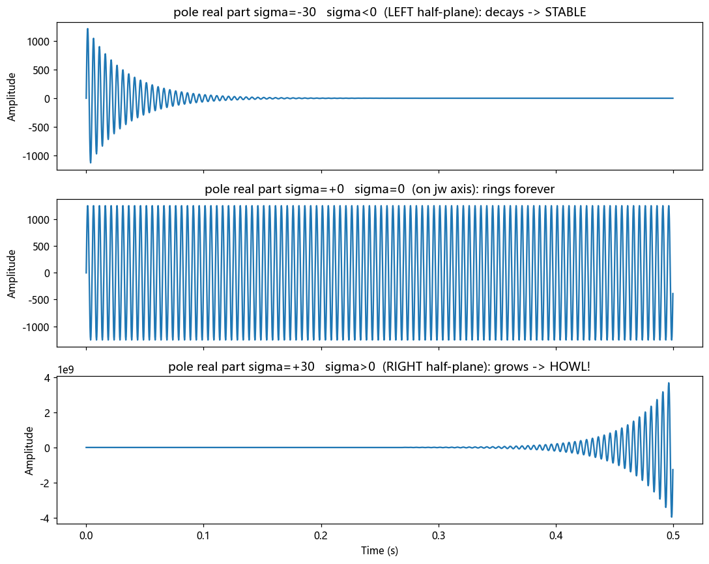

# 第 11 篇｜拉普拉斯变换与极点零点：稳定性从哪来

> 一句话核心直觉：傅里叶变换只肯看"永不衰减的纯正弦"，拉普拉斯变换把视野扩到"边振荡边增长或衰减"的信号。在这张更大的地图上，会冒出一些**山峰（极点）**和**洼地（零点）**——它们的位置，直接决定了滤波器长什么样、稳不稳、会不会自己啸叫起来。

---

## 一、先别看公式，我们让话筒"啸叫"一次

你一定听过这个刺耳的场面：演出现场，主持人把话筒举到音箱前，"咦——"的一声尖啸瞬间盖过全场，越来越响，直到工程师冲过去把音量拉下来。

这声啸叫（feedback howl，声反馈啸叫）里，藏着上一篇那条 EQ 曲线**回答不了**的问题。

想想这个回路：话筒收到声音 → 功放放大 → 音箱放出来 → 又被话筒收回去 → 再放大……某个频率的声音每绕一圈就更响一点，能量像滚雪球一样自我叠加，**从一个微小扰动自己长成失控的尖啸**。

上一篇讲的频率响应，描述的是"喂一个稳定的正弦，稳定地输出一个缩放的正弦"。可啸叫压根不是稳定的——它是**自己无中生有地增长**。傅里叶变换只盯着"幅度恒定的纯正弦"看，天生就看不见"正在指数增长"的东西。

要描述"会不会自己长起来"，我们需要一个能看见"增长/衰减"的工具。它就是**拉普拉斯变换**。

---

## 二、拉普拉斯 = 傅里叶的"加强版"

傅里叶变换的核心，是拿一堆**纯正弦** $e^{j2\pi f t}$ 去分析信号。这些正弦有个共同点：**幅度永远不变**，从过去到未来一直是那么大。

但现实里的声音很少这样。一个钢琴音符是**边振荡边衰减**的；一次啸叫是**边振荡边增长**的。纯正弦这套"标尺"，量不了这种"带包络"的信号。

拉普拉斯变换的做法非常朴素：**给正弦乘上一个指数包络，让标尺本身也能增长或衰减。** 它用的基本信号是

$$e^{st}, \qquad s = \sigma + j\omega$$

拆开看这个复数 $s$：

- $\omega$（虚部）：老熟人，**振荡频率**——转多快。
- $\sigma$（实部）：新成员，**增长/衰减速率**——包络是往上冲还是往下掉。
  - $\sigma < 0$：$e^{\sigma t}$ 衰减 → 边振荡边**变小**（钢琴音符那样）。
  - $\sigma = 0$：不增不减 → 就是傅里叶那根**纯正弦**。
  - $\sigma > 0$：$e^{\sigma t}$ 增长 → 边振荡边**变大**（啸叫那样）。

于是所有可能的信号，被摊在一张二维地图上——横轴 $\sigma$（衰减/增长），纵轴 $\omega$（频率）。这张地图叫 **s 平面**。

**关键认知**：s 平面正中间那条竖线（$\sigma=0$ 的虚轴），恰好就是傅里叶变换看的那些"纯正弦"。所以——

> **傅里叶变换，只是拉普拉斯变换在虚轴（$\sigma=0$）上的一个切片。** 拉普拉斯把视野从"一条线"扩展成"一整个平面"，多出来的左右两侧，正是描述"衰减"和"增长"的地盘。上一篇看不见的啸叫，就住在右半平面（$\sigma>0$）。

---

## 三、极点与零点：地图上的山峰和洼地

有了 s 平面，一个滤波器的系统函数 $H(s)$ 就成了这张地图上空的一个"地形高度"——每个位置 $s$ 对应一个值 $|H(s)|$。这个地形，通常写成两个多项式相除：

$$H(s) = \frac{\text{分子多项式}}{\text{分母多项式}} = K\frac{(s-z_1)(s-z_2)\cdots}{(s-p_1)(s-p_2)\cdots}$$

这里有两组特殊的点，它们几乎定义了整个地形：

- **零点 $z_i$**：让分子为 0 的点。在这里 $H(s)=0$，地形被摁到海平面——像地图上的**洼地/深坑**。物理意义：靠近某个频率的零点，会把那个频率**削掉**。
- **极点 $p_i$**：让分母为 0 的点。在这里 $H(s)\to\infty$，地形冲向无穷高——像地图上拔地而起的**山峰**。物理意义：靠近某个频率的极点，会把那个频率**大幅抬高（共振）**。

**为什么只要知道极点零点，就知道滤波器长什么样？** 因为上一篇的频率响应 $H(f)$，就是沿着虚轴走一遍看到的地形起伏。虚轴附近哪里有座极点山峰，EQ 曲线在对应频率就顶起一个包（共振峰）；哪里有个零点深坑，曲线就砸下一个凹槽。**极点零点的位置，一笔就勾出了整条频响曲线的骨架。**

这也直接对上了语音里的**共振峰（formant）**：人的声道就是一组共振腔，每个腔体在特定频率放大能量，在频响上顶出一个包——数学上，那正是一对靠近虚轴的极点。元音 /a/ 和 /i/ 听起来不同，本质是它们的极点长在了不同的频率高度上。

---

## 四、稳定性从哪来：极点必须待在左半平面

现在可以回答开头的啸叫了。极点是"山峰"，代表系统天然爱在那个位置共振。而这座山峰长在 s 平面的**哪一侧**，决定了系统的生死：

- **极点在左半平面（$\sigma<0$）**：这个模态自带衰减包络，敲一下会响、然后**自己安静下去**。系统**稳定**。
- **极点在虚轴上（$\sigma=0$）**：不增不减，永远振荡不停（理想振荡器），处在**临界**。
- **极点在右半平面（$\sigma>0$）**：这个模态自带增长包络，一点风吹草动就**自己越长越大**——这就是啸叫，系统**不稳定**。

> **稳定性判据一句话**：一个（连续时间）系统稳定，当且仅当它**所有的极点都待在 s 平面的左半边**。有任何一个极点越过虚轴跑到右边，系统就会自激、失控。

回到话筒啸叫：把音量（环路增益）一点点调大，等效于把整个反馈系统的极点**从左半平面往右推**。音量小时极点在左边，偶发的声音会自己衰减掉；音量过了临界点，某个频率的极点越过虚轴进入右半平面，那个频率就开始指数增长——"咦——"就来了。这就是为什么调音师控反馈的办法，是**降增益**（把极点拉回左边）或**用陷波 EQ 在啸叫频率挖个零点**（用洼地摁平那座作乱的山峰）。

---

## 五、代码实战：把极点从左半平面推过虚轴，看它啸叫

我们造一个只有一对共振极点的简单系统，把极点实部 $\sigma$ 从负（稳定）慢慢推到正（不稳定），直接看它的冲激响应从"衰减振铃"变成"失控啸叫"。

```python
import numpy as np
import matplotlib.pyplot as plt
from scipy import signal

fs = 4000
t = np.arange(int(0.5 * fs)) / fs
f0 = 200                                 # 共振/啸叫频率 200 Hz
w0 = 2 * np.pi * f0

fig, ax = plt.subplots(3, 1, figsize=(10, 8), sharex=True)
for i, sigma in enumerate([-30.0, 0.0, +30.0]):   # 极点实部:左 / 虚轴 / 右
    # 一对共轭极点 p = sigma ± j*w0, 用二阶连续系统实现
    poles = [sigma + 1j * w0, sigma - 1j * w0]
    b, a = signal.zpk2tf([], poles, w0**2 + sigma**2)  # 无零点,增益归一
    sys = signal.TransferFunction(b, a)
    _, h = signal.impulse(sys, T=t)      # 冲激响应
    ax[i].plot(t, h)
    tag = {-30: "sigma<0  (LEFT half-plane): decays -> STABLE",
             0: "sigma=0  (on jw axis): rings forever",
            30: "sigma>0  (RIGHT half-plane): grows -> HOWL!"}[sigma]
    ax[i].set_title(f"pole real part sigma={sigma:+.0f}   {tag}")
    ax[i].set_ylabel("Amplitude")
ax[-1].set_xlabel("Time (s)")
plt.tight_layout()
plt.show()
```

三张图讲了一个完整的故事：极点在左半平面时，冲激响应是一段自己衰减掉的振铃（稳定）；落在虚轴上时，它永远振荡不停（临界）；一旦推进右半平面，振幅指数级暴涨——**这就是啸叫在时域里的样子**。你看到的，正是"极点位置决定生死"这句话的实证。



想看它对应的频响山峰？把左半平面那组极点用 `signal.freqs(b, a)` 画幅频曲线，会在 200 Hz 处看到一个尖锐的共振包——极点离虚轴越近（$\sigma$ 越接近 0），这个包越高越尖，系统也越"危险"。

---

## 六、这在音频工程里，到底解决了什么问题

| 场景 | 极点/零点在其中的角色 |
|------|--------------------|
| **模拟滤波器设计**（Butterworth、Chebyshev 等） | 设计就是在 s 平面上**摆极点零点**：极点定通带形状与陡度，零点定阻带凹陷 |
| **反馈啸叫抑制** | 啸叫 = 极点被推进右半平面；对策是降环路增益或在啸叫频率**挖零点**（陷波） |
| **参量均衡 / peaking EQ** | 一对靠近虚轴的极点顶出增益包，零点挖出凹槽，Q 值就是极点离虚轴的远近 |
| **共振峰（formant）合成** | 每个共振峰是一对复极点，挪动极点频率就换元音，是声码器与语音合成的基础 |
| **稳定性校验** | 设计完任何递归（IIR）滤波器，必查所有极点是否都在左半平面（数字域是单位圆内） |

> **一句话记住**：极点是"爱共振、想放大"的山峰，零点是"要削掉、想抑制"的洼地；它们在 s 平面的位置，同时决定了滤波器的**频响形状**和**稳不稳**。

---

## 七、埋一个钩子：数字世界里，这张地图会怎么变

拉普拉斯和 s 平面，是为**模拟（连续时间）**世界准备的——它假设时间是连续流动的。可你我干的是数字音频：声音是一串采样点，时间是离散跳着走的。

那问题来了：**离散世界里，还有没有"极点零点决定一切"这套地图？稳定性判据还是"左半平面"吗？**

答案是有，但地图会发生一次奇妙的形变——s 平面那条"生死分界"的**虚轴**，会被卷成一个**圆**。届时判定稳定的标准，从"极点在左半平面"变成"极点在**单位圆内**"。这个专为采样信号打造的工具，叫 **Z 变换**，也是我们真正动手写数字滤波器（IIR）前的最后一块地基。

下一模块，我们就把这张地图，从连续卷到离散。

---

## 本篇小结

- **拉普拉斯变换**：傅里叶的加强版，用 $e^{st}$（$s=\sigma+j\omega$）当标尺，既能量频率 $\omega$，又能量增长/衰减 $\sigma$；傅里叶只是它在虚轴上的切片。
- **s 平面**：横轴衰减/增长、纵轴频率的地图；系统函数 $H(s)$ 是这张图上的地形。
- **极点/零点**：极点是拔高的山峰（共振、放大），零点是下陷的洼地（削掉、抑制）；它们的位置一笔勾出频响骨架，也对应语音的共振峰。
- **稳定性**：所有极点在左半平面才稳定；越过虚轴进入右半平面，系统自激啸叫。
- **下一步**：Z 变换把这张连续地图卷成离散版，虚轴变单位圆，为数字滤波器铺路。
