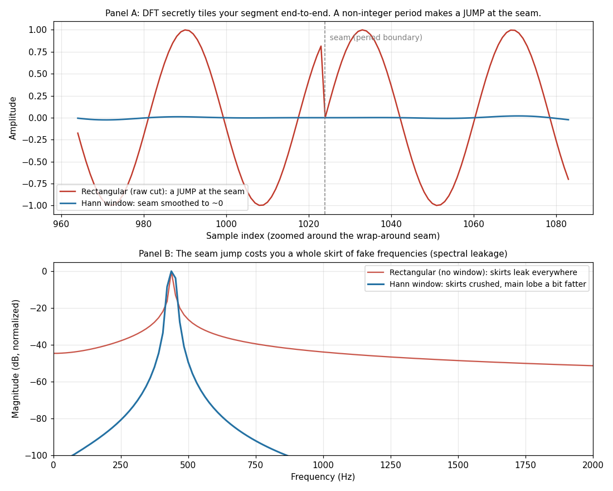

# 第 12 篇｜DTFT 与 DFT：从"理论上正确"到"电脑真能算"

> 一句话核心直觉：第 7 篇那台傅里叶"棱镜"是个理想数学对象——它要吃连续的、无限长的信号。可你电脑里只有**离散 + 有限**的一串数字。这一篇把"从理想到能算"的链条走完：时间离散逼出 **DTFT**（频谱变成一条 $2\pi$ 周期的连续曲线），频率再离散、信号再截断逼出 **DFT**（$N$ 个数进、$N$ 个数出，终于能进内存）。我们照例从**物理直觉、数学骨架、工程落地**三个角度把它吃透——并且主动拆两个大坑：**频谱泄漏**和**循环卷积**，那正是"DFT 不等于理想 FT"的边界。

---

## 一、先认清一个尴尬的落差

第 7 篇我们推开了频域的门：任何声音都能摊成一堆正弦的叠加，傅里叶变换就是那台"棱镜"：

$$X(f)=\int_{-\infty}^{+\infty}x(t)\,e^{-j2\pi ft}\,dt$$

这台棱镜很美，但它是**数学家的理想对象**，不是工程师手里的工具。它有两个前提，你电脑里的信号一个都满足不了：

- 它吃的是 $x(t)$——一条**连续**的、时间上没有任何缝隙的函数。可你手里只有 ADC 吐出来的采样点 $x[0], x[1], x[2], \dots$，一串离散的 `float32`。
- 它的积分从 $-\infty$ 到 $+\infty$，要求信号**无限长**。可你录的音频再长也是有限的——几秒钟、几十万个样本，到头了。

所以那个课本公式，电脑一行都跑不了：它既没有"连续"可积，也没有"无限"可加。

这一篇要做的事，就是架一座桥：从"理论上正确但算不了"的连续傅里叶变换，分两步走到"能真正在 NumPy 里 `np.fft.fft` 一下跑出来"的 DFT。走完这段路，你才算真正拿到了分析声音的那把手术刀——也才明白，为什么你在每个音频软件里看到的频谱，都不是"真实频谱"，而是一个带着脾气和取舍的近似。

先把要出场的四位主角摆上台，免得后面混成一锅粥。这是本篇的严谨红线，请先扫一眼，不用记，后面每一位都会单独讲：

| 变换 | 时间 | 频率 | 和是有限还是无限 | 电脑能算吗 |
|------|------|------|-----------------|-----------|
| **FT**（连续傅里叶变换，第 7 篇） | 连续、无限长 | 连续 | 积分 | 不能 |
| **DTFT**（离散时间傅里叶变换） | 离散、无限长 | **连续、$2\pi$ 周期** | 无限和 $\sum_{-\infty}^{+\infty}$ | 不能（频率是连续曲线，且求和无限） |
| **DFS**（离散傅里叶级数） | 离散、**周期** | 离散、周期 | 有限和 | 能（但要求信号本身周期） |
| **DFT**（离散傅里叶变换） | 离散、**有限长 $N$ 点** | **离散、$N$ 个点** | 有限和 $\sum_{0}^{N-1}$ | **能** |

本篇主讲 **DTFT 与 DFT** 这两位。DFS 只是个过路的——它和 DFT 长得几乎一样（都是有限和），区别只在"看世界的姿势"：DFS 认定信号本来就是周期的，DFT 认定信号是有限长的一段。后面讲泄漏时你会看到，DFT 其实是**偷偷把那有限一段当成了一个周期**——那一刻它就借用了 DFS 的世界观，坑也就从这里长出来。

---

## 二、第一刀砍时间：从 FT 到 DTFT

从连续 FT 到电脑能算的东西，中间隔着两刀。把这两刀想明白，后面所有的坑（周期性、分辨率、泄漏、加窗）就都是水到渠成。这一节先砍第一刀。

### 2.1 把积分换成求和：DTFT 是怎么来的

第一刀砍在时间轴上。我们没有连续的 $x(t)$，只有每隔采样周期 $T_s=1/f_s$ 记一个数的采样点 $x[n]=x(nT_s)$（第 9 篇那把"采样梳子"干的事）。

连续 FT 是"在每个时刻 $t$，把信号乘上探针 $e^{-j2\pi ft}$，再沿时间**积分**累加"。现在时间不连续了，只有一个个离散的点，那"沿时间累加"这个动作，自然就从积分退化成**求和**：

$$\int_{-\infty}^{+\infty}(\cdots)\,dt \quad\longrightarrow\quad \sum_{n=-\infty}^{+\infty}(\cdots)$$

把探针里的连续频率也换成离散信号习惯的写法（用归一化角频率 $\omega$，单位是"弧度/样本"），就得到 **DTFT（离散时间傅里叶变换）**：

$$X(e^{j\omega}) = \sum_{n=-\infty}^{+\infty} x[n]\,e^{-j\omega n}$$

逐项念一遍：**把每个采样点 $x[n]$，乘上探针 $e^{-j\omega n}$（一个转速为 $\omega$、随样本序号 $n$ 旋转的复数单位向量），再全部加起来。** 加出来是个大数，就说明信号里含大量 $\omega$ 这个频率的成分；加出来接近 0，就说明正负旋转相互抵消、没有这个频率。这套"探针相乘再累加"的直觉，和第 7 篇一模一样，只是把连续积分换成了离散求和。

### 2.2 为什么写成 $X(e^{j\omega})$ 而不是 $X(\omega)$——离散信号的频谱天生 $2\pi$ 周期

你可能会问：这记号怎么这么别扭，明明是频率 $\omega$ 的函数，为什么括号里塞的是 $e^{j\omega}$ 而不是 $\omega$？

这不是数学家故意找茬，这个写法在**提醒你一件要命的事**：DTFT 的频谱是**周期的**，周期正好是 $2\pi$。写成 $e^{j\omega}$ 就是在强调"我只认 $\omega$ 转了多少圈这个信息，转满 $2\pi$ 我就回到原点"。

为什么周期是 $2\pi$？把 $\omega$ 换成 $\omega+2\pi$ 代进去，一步就看出来：

$$e^{-j(\omega+2\pi)n} = e^{-j\omega n}\cdot\underbrace{e^{-j2\pi n}}_{=1,\ n\text{ 为整数}} = e^{-j\omega n}$$

因为 $n$ 是整数，$e^{-j2\pi n}$ 恒等于 1。**探针转多转少 $2\pi$ 的整数倍，在每一个采样点上都长得一模一样**——离散采样根本分不清"每样本转 $\omega$ 弧度"和"每样本转 $\omega+2\pi$ 弧度"这两个转速。于是 $X(e^{j(\omega+2\pi)})=X(e^{j\omega})$，频谱以 $2\pi$ 为周期无限重复。

> **关键认知**：**离散信号的频谱天生就是周期的，周期是 $2\pi$（换算成真实频率就是 $f_s$）。** 这不是巧合。还记得第 9 篇末尾埋的伏笔吗——采样在频域等于"把原谱每隔 $f_s$ 复制粘贴、无限铺满频率轴"。那条复制粘贴规律，正是 DTFT 频谱周期性的源头：时域一采样，频域就周期化。所以我们只需要看**一个周期**（通常取 $\omega\in[-\pi,\pi]$，对应真实频率 $[-f_s/2,\,f_s/2]$，也就是奈奎斯特区间），其余全是复制品。

### 2.3 DTFT 还是算不了，它只是理论上的中间站

DTFT 把时间离散化了，但它有两个地方电脑还是咽不下去：

- **频率还是连续的**。$X(e^{j\omega})$ 是一条关于 $\omega$ 的光滑曲线，横轴上有无穷多个频率点。电脑存不下一条"连续曲线"，它只能存有限个数字。
- **求和还是无限的**。$\sum_{n=-\infty}^{+\infty}$ 要求你把过去到未来所有采样点都加进去。可你手里只有有限长的一段录音。

所以 DTFT 依然算不了，它是一座**理论上的中间站**——用来说清"离散化对频谱做了什么"（答案：让频谱变周期），但你没法真的在 NumPy 里跑一个 `dtft()`。要真能算，还得再砍第二刀。

---

## 三、第二刀砍频率：从 DTFT 采样出 DFT

### 3.1 我们到底想干嘛

先说清目标，别急着写公式。DTFT 卡在两件事上：频率连续、求和无限。那就对症下药，两刀一起下：

1. **信号截断**：不要"无限长"，只取实际录到的那 $N$ 个采样点 $x[0],\dots,x[N-1]$，求和范围就从 $0$ 到 $N-1$，有限了。
2. **频率采样**：不要"连续曲线"，只在一个周期 $[0,2\pi)$ 里等间隔挑 $N$ 个频率点去看。既然连续曲线存不下，那就在它身上**打 $N$ 个采样点**——注意，这一步是"对 DTFT 这条曲线再采样一次"，只不过这次采样发生在频率轴上。

那"等间隔挑 $N$ 个点"具体挑哪些？把一个周期 $2\pi$ 均分成 $N$ 份，第 $k$ 个频率点就落在：

$$\omega_k = \frac{2\pi}{N}\,k,\qquad k=0,1,\dots,N-1$$

### 3.2 把 DFT 从 DTFT 里"采"出来

现在动手。拿上面截断后的有限求和当 DTFT（$n$ 只跑 $0$ 到 $N-1$），把频率点 $\omega_k=\frac{2\pi}{N}k$ 代进去：

$$X(e^{j\omega})\Big|_{\omega=\frac{2\pi}{N}k} = \sum_{n=0}^{N-1} x[n]\,e^{-j\omega_k n} = \sum_{n=0}^{N-1} x[n]\,e^{-j\frac{2\pi}{N}kn}$$

把这 $N$ 个频率点上的值记成 $X[k]$，就得到了电脑真正在算的 **DFT（离散傅里叶变换）**：

$$\boxed{\,X[k] = \sum_{n=0}^{N-1} x[n]\,e^{-j\frac{2\pi}{N}kn},\qquad k=0,1,\dots,N-1\,}$$

看清楚它跟 DTFT 的血缘关系：**DFT 不是一个新变换，它就是 DTFT 这条连续曲线上、等间隔取的 $N$ 个采样值。** 输入是 $N$ 个数，输出也是 $N$ 个数，求和范围是有限的 $0$ 到 $N-1$。没有无穷，没有连续，全是有限个数字——这才是一台电脑能咽下去的东西。

> **关键认知**：DFT $=$ 对"截断后信号的 DTFT"在 $N$ 个等间隔频点上采样。它的每一个"缺陷"，都能追溯到这两刀：**信号截断**（只看有限一段）和**频率采样**（只看 $N$ 个频点）。理解这条来路，比背下公式重要一百倍——泄漏来自第一刀，循环卷积来自"时间离散+频率离散必然对应时间周期化"，全在这条链上。

---

## 四、别抽象，先拿 N=4 的小数组手算一遍

方法论第一条：抽象公式之前，先上一个具体到能手算的小例子。我们取 $N=4$、$x=[1,2,3,4]$，把四个 $X[k]$ 一个一个算出来，看每个 bin 到底在问什么。

DFT 里的探针 $e^{-j\frac{2\pi}{N}kn}$，在 $N=4$ 时特别干净。记 $W=e^{-j\frac{2\pi}{4}}=e^{-j\pi/2}=-j$，那么探针就是 $W^{kn}=(-j)^{kn}$，而 $(-j)$ 的幂只在 $\{1,-j,-1,j\}$ 四个值里打转。逐个 $k$ 算：

**$k=0$（直流 bin）**：探针 $W^{0}=1$，全是 1。

$$X[0]=1+2+3+4=10$$

这就是所有样本**直接相加**。$X[0]$ 永远是信号的总和，物理含义是**直流分量**（0 Hz，信号的平均水平乘以 $N$）。语音里它对应"整段的直流偏置"，通常先减掉。

**$k=1$**：探针 $W^{n}=(-j)^{n}=[1,\,-j,\,-1,\,j]$（对应 $n=0,1,2,3$）。

$$X[1]=1\cdot1+2\cdot(-j)+3\cdot(-1)+4\cdot j=(1-3)+(-2+4)j=-2+2j$$

**$k=2$（奈奎斯特 bin）**：探针 $W^{2n}=(-j)^{2n}=[1,\,-1,\,1,\,-1]$，正负交替。

$$X[2]=1-2+3-4=-2$$

这个 bin 探针是 $[1,-1,1,-1,\dots]$——每两个样本翻一次号，正是采样率能表达的**最高频率**（每样本反相一次 = $f_s/2$，奈奎斯特频率）。它衡量信号里"一上一下最快抖动"的成分有多少。

**$k=3$**：探针 $W^{3n}=(-j)^{3n}=[1,\,j,\,-1,\,-j]$。

$$X[3]=1\cdot1+2\cdot j+3\cdot(-1)+4\cdot(-j)=(1-3)+(2-4)j=-2-2j$$

汇总 $X=[10,\ -2+2j,\ -2,\ -2-2j]$。用 NumPy 对一下：

```python
import numpy as np
x = np.array([1.0, 2.0, 3.0, 4.0])
print(np.fft.fft(x))     # [10.+0.j  -2.+2.j  -2.+0.j  -2.-2.j]  逐位对上
```

盯着结果看两件事，都会在真实频谱里天天遇到：

- **$X[3]$ 是 $X[1]$ 的共轭**（$-2-2j$ vs $-2+2j$）。对**实数**输入（音频永远是实数），DFT 满足**共轭对称**：$X[N-k]=\overline{X[k]}$。所以上半部分 $k>N/2$ 的 bin 不含新信息，是下半部分的镜像。这就是为什么后面代码里用 `np.fft.rfft`——它只返回 $0\sim N/2$ 这有用的一半，省一半计算和存储。
- **每个 bin 是一个复数**：模长 $|X[k]|$ 是"这个频率有多强"（幅度谱，第 8 篇的主角），辐角 $\angle X[k]$ 是"这个频率的相位"（第 8 篇那半张被忽视的脸）。

> **关键认知**：DFT 的第 $k$ 个 bin，就是**拿一个"每样本转 $\frac{2\pi k}{N}$ 弧度"的复数探针，去和你的 $N$ 点信号逐点相乘再累加**。$k$ 越大探针转得越快，问的频率越高。$X[0]$ 是总和（直流），$X[N/2]$ 是最快抖动（奈奎斯特），中间按频率从低到高排开。

---

## 五、每根"频率格子"到底代表多少 Hz

刚才的 $k$ 用的是归一化频率（弧度/样本），画频谱时你要的是**真实的 Hz**。换算只差一个采样率。

DFT 把一个周期 $2\pi$（对应真实频率 $f_s$）均分成 $N$ 格，所以设采样率是 $f_s$、取了 $N$ 个点：

- **第 $k$ 个 bin 对应的真实频率**：$f_k = k\cdot\dfrac{f_s}{N}$；
- **相邻两个 bin 的间隔**（也就是**频率分辨率**）：$\Delta f = \dfrac{f_s}{N}$。

第二条是重点中的重点。$\Delta f = f_s/N$ 意味着：**你分析的这段信号越长（$N$ 越大），频率格子就越细，你能分辨出的频率差异就越小。** 换个直觉说法——你想把两个靠得很近的频率分开，就得让探针"看"足够多个周期才能攒出区别，而看更多周期就意味着要更长的信号段。

拿音频的实感来体会（取 $f_s=16000$ Hz）：

- 只取 $N=512$ 个点（约 32 ms），$\Delta f = 16000/512 = 31.25$ Hz。两个只差 20 Hz 的音会挤进同一个格子，根本分不开。
- 取 $N=8192$ 个点（约 512 ms），$\Delta f\approx1.95$ Hz，连相邻半音里的细微差别都看得清。

这就是那句核心权衡的由来：**想要更高的频率分辨率，就得用更长的信号段。** 下一篇（第 13 篇）讲语谱图时你会看到硬币的另一面——段用太长，时间上就糊了，说不清"这个频率是什么时候出现的"。这对时间-频率的矛盾，是 STFT 一切设计的核心。

### 5.1 一个必须现在就澄清的误区：补零 ≠ 提高分辨率

这是初学者最常栽的坑，趁 $\Delta f$ 刚讲完，把它钉死。

你可能听过一招"想让频谱更细，就在信号后面补一堆 0，把 $N$ 撑大"。比如 512 点信号后面补 512 个 0 凑成 1024 点，$\Delta f$ 从 31.25 Hz 变成 15.6 Hz——看起来分辨率翻倍了？

**没有。补零一点真分辨率都没增加。** 关键要分清两件事：

- **真实频率分辨率**：由你**真正采到的信号有多长**决定，也就是那段信号覆盖了多少物理时间 $T=N_{\text{真实}}/f_s$。两个靠得近的频率能不能被分开，取决于 $T$。补的 0 不含任何新信息，没有延长你"观察"这段声音的时间，所以分不开的还是分不开。
- **频谱的显示密度（bin 间隔）**：由送进 FFT 的总长度决定。补零让 bin 变密，等于在**同一条 DTFT 曲线上多插了几个采样点**——曲线本身没变，只是采得更密、看起来更平滑。

一句话：**补零是"插值"，不是"增采样信息"。** 它让你把那条本就确定的 DTFT 曲线画得更顺、峰的位置读得更准（对估计精确峰值频率有用），但它**变不出**信号里本来不存在的分辨能力。想真正分开两个靠近的频率，唯一的办法是**录更长的信号段**（增大 $N_{\text{真实}}$），没有捷径。

> **关键认知**：$\Delta f=f_s/N$ 里那个决定"能不能分开两个频率"的 $N$，指的是**真实信号长度**；补零撑大的是"显示用的 $N$"，只把 DTFT 曲线插值得更密，真分辨率纹丝不动。看到"补零提高分辨率"的说法，直接划掉。

---

## 六、等等，DFT 不等于理想 FT——两个坑必须现在拆

到这里，很容易产生一个危险的错觉：既然 DFT 是傅里叶变换的"可计算版本"，那我拿它当理想 FT 用就行了呗。**不行。** DFT 是被两刀砍出来的近似，砍出来的两个新伤口，正是它和理想 FT 的边界。这一节把两个大坑主动拆开——搞不懂它们，你迟早会被频谱图骗，或者写出一个"结果绕回来"的快速卷积 bug。

两个坑的病根其实是**同一个**：还记得 3.1 说的吗，我们对频率做了离散采样。而"频率离散化"在数学上有个逃不掉的孪生兄弟——**时间上的周期延拓**。频率采样和时间周期化是一枚硬币的两面（这跟第 9 篇"时间采样↔频率周期化"正好对偶）。所以 **DFT 其实并不把你的 $N$ 点信号看成"有限一段"，而是看成"一个无限周期信号的一个周期"**——它默认这 $N$ 点会一模一样地首尾相接、无限循环下去。这个"隐藏假设"不是可选项，是 DFT 数学结构里写死的。两个坑都从这里长出来。

### 6.1 坑一：频谱泄漏——DFT 偷偷假设"这 N 点无限循环"

问题出在"首尾相接"这四个字。

想象你截取了一段 440 Hz 的纯音。如果你截的这段里**正好装下整数个周期**，那么首尾相接时波形严丝合缝，循环出来还是一条完美的 440 Hz 正弦——DFT 分析它，能量会干净利落地全部落进 440 Hz 那一个 bin 里（前提还得是 440 Hz 正好落在某个 bin 上，即是 $f_s/N$ 的整数倍）。

可现实中，你截出来的段几乎**不可能**正好是整数个周期。于是首尾接不上，接缝处出现一个突兀的跳变、一个"折角"。而一个带折角的波形，在傅里叶看来绝不是单一频率——那个尖锐的跳变，需要一大堆额外的频率成分才能拼出来（回想第 5、7 篇：越尖锐的东西，频谱越宽）。

**结果就是：本该集中在 440 Hz 一根线上的能量，"漏"到了周围一大片 bin 里，主峰两侧拖出一群本不存在的"裙边"。** 这个现象叫**频谱泄漏 (spectral leakage)**。

请记牢这条因果链，它是理解加窗的唯一钥匙：

> 信号非整数周期 → DFT 强行周期延拓 → 首尾接缝处产生突变 → 突变含大量杂散频率 → 真实频率的能量泄漏到邻近 bin。

泄漏不是 DFT 算错了，它是"用有限长的段去分析、还被强行首尾相接"这个前提的必然副作用——正是"DFT ≠ 理想 FT"的第一个证据。理想 FT 看的是无限长信号，没有"截断"，也就没有接缝。

既然病根在"接缝处的突变"，解药就呼之欲出：**能不能让信号段的开头和结尾都平滑地降到 0？** 这样无论怎么首尾相接，接缝处都是 $0$ 接 $0$，没有折角，也就没有那些杂散频率了。这正是**加窗 (windowing)** 干的事——把一条两头低、中间高的包络 $w[n]$ 逐点乘到信号段上：

$$x_w[n]=x[n]\cdot w[n]$$

你直接截一段不做处理，其实等于乘了一个**矩形窗**（段内全 1、段外全 0）——正是这个"啪"一下的硬边界制造了最严重的泄漏。而**汉宁窗 (Hann)**、**汉明窗 (Hamming)** 这类平滑窗两头柔和趋近 0，把接缝突变抹平了。

天下没有免费的午餐。加窗压住了泄漏（旁瓣变矮），代价是每根谱线变粗了一点（主瓣变宽）——相当于牺牲一丁点频率分辨率，换来干净得多的频谱底噪。这个取舍，就是音频分析里有那么多种窗函数可选的原因，也是第 13 篇要正式展开的话题（这里先埋个钩子）。

| 窗类型 | 主瓣（谱线粗细） | 旁瓣（泄漏/裙边） | 音频里的典型用途 |
|--------|----------------|------------------|-----------------|
| 矩形窗（不加窗） | 最窄 | 最严重 | 只在整数周期、或要极限分辨两个等强频率时 |
| 汉宁窗 (Hann) | 中等 | 低 | 语谱图、通用频谱分析的默认选择 |
| 汉明窗 (Hamming) | 中等 | 低（第一旁瓣更低） | 语音分析、共振峰提取 |
| 布莱克曼窗 (Blackman) | 较宽 | 极低 | 需要极干净底噪、能容忍分辨率损失时 |

### 6.2 坑二：DFT 域相乘 = 循环卷积，不是线性卷积

第二个坑更隐蔽，会直接咬到你写"快速卷积"的时候。

回忆第 5、7 篇那条命脉：**时域卷积 → 频域相乘**。这条定理诱惑太大了——第 5 篇算过，一段 3 秒干声卷一段 3 秒混响 IR 要约 500 亿次乘加，慢到跑不动实时；但如果搬到频域，卷积就变成廉价的逐点相乘。于是自然的想法是：`FFT(x) * FFT(h)`，再 `IFFT` 回来，一次快速卷积搞定。

**但直接这么做会出错。** 因为 DFT 域的逐点相乘，对应的时域操作不是你要的**线性卷积**，而是**循环卷积 (circular convolution)**——那个"首尾相接无限循环"的假设又来作祟了：卷积到边界时，本该甩到数组外面去的尾巴，被"绕回"到开头，污染了前几个样本。

拿最小的例子手算就看得一清二楚。$a=[1,2,3]$，$h=[1,1]$，正确的**线性卷积**（第 5 篇的错位相加）是：

```
   1 2 3
 * 1 1
 ---------
   1 2 3        <- a * h[0]
     1 2 3      <- a * h[1] 右移一位
 ---------
   1 3 5 3      <- 线性卷积, 长度 3+2-1 = 4
```

线性结果 $[1,3,5,3]$，长度 $N_a+N_h-1=4$。现在看如果你偷懒，直接在 $N=3$ 上做 DFT 相乘会得到什么：

```python
import numpy as np
a = np.array([1., 2., 3.]); h = np.array([1., 1.])

lin = np.convolve(a, h)                       # 正确的线性卷积
print(lin)                                    # [1. 3. 5. 3.]

# 直接在 N=3 上做 DFT 相乘(错误示范: 没补零)
N = 3
circ = np.real(np.fft.ifft(np.fft.fft(a, N) * np.fft.fft(h, N)))
print(np.round(circ, 4))                      # [4. 3. 5.]  <- 绕回来了!
```

对比一下：线性是 $[1,3,5,3]$，循环（$N=3$）是 $[4,3,5]$。差在哪？**线性结果那个甩出去的尾巴 $3$，在循环卷积里"绕回"到了第 0 位，和原本的 $1$ 加在一起变成 $4$。** 这就是循环卷积的"回绕污染 (time-domain aliasing)"——长度不够，尾巴无处可去，只能从头绕回来。

解药也来自那条长度公式：线性卷积结果长 $N_a+N_h-1$，所以只要**把两个信号都补零补到至少这么长**，再做 DFT 相乘，就没有尾巴可绕、循环卷积的结果和线性卷积完全重合：

```python
L = len(a) + len(h) - 1                        # = 4, 补零到这个长度
fast = np.real(np.fft.ifft(np.fft.fft(a, L) * np.fft.fft(h, L)))
print(np.round(fast, 4))                        # [1. 3. 5. 3.]  <- 和线性卷积一致
```

注意这里的补零和 5.1 那个"补零≠提分辨率"是**两码事，别混**：5.1 的补零是为了把频谱曲线画密（插值），这里的补零是为了给卷积的尾巴腾出落脚的地方（防回绕）。同一个动作，两个完全不同的目的。

> **关键认知**：**DFT 域逐点相乘 ↔ 时域循环卷积，不是线性卷积。** 要用 FFT 做快速卷积，必须先把两段都**补零到至少 $N_a+N_h-1$**，把回绕的尾巴腾出去，结果才等于线性卷积。（真实音频里 $x$ 长、$h$ 短，还会把长信号切块逐块处理，即 overlap-add / overlap-save——第 13、15 篇会用到。）这是"DFT ≠ 理想 FT"的第二个边界：理想 FT 的卷积定理天然是线性的，DFT 的却是循环的，你得自己补零把它"掰"成线性。

---

## 七、代码实战一：对一段真实语音做 DFT，看它的频谱

理论走到这，用能跑的代码落地。第一件事：拿工作目录里的 `Test-voice.wav`，取一段做 DFT，把频谱画出来，并且亲手把峰值 bin 换算回 Hz——这就是"看一段声音含哪些频率"的最小闭环。

```python
import numpy as np
import matplotlib.pyplot as plt
from scipy.io import wavfile          # 用 scipy 读 wav, 不依赖 soundfile

# ---------- 读入真实人声 ----------
fs, data = wavfile.read("Test-voice.wav")
if data.ndim == 2:                    # 立体声 -> 单声道
    data = data.mean(axis=1)
x = data.astype(np.float64)
x /= np.max(np.abs(x)) + 1e-12        # 归一化到 [-1, 1]

# ---------- 取一段做 DFT ----------
N = 8192                              # 段长, df = fs/N 决定频率分辨率
seg = x[int(1.0 * fs): int(1.0 * fs) + N]
seg = seg - seg.mean()               # 去直流(否则 X[0] 会是个大尖峰)
seg = seg * np.hanning(N)            # 加汉宁窗压泄漏(6.1 的解药)

X = np.fft.rfft(seg)                 # rfft: 只算有用的前一半(实数输入共轭对称)
freqs = np.fft.rfftfreq(N, d=1 / fs) # 每个 bin 的真实频率(Hz) = k * fs/N
mag_db = 20 * np.log10(np.abs(X) / (np.abs(X).max() + 1e-12) + 1e-12)

# ---------- 把峰值 bin 换算回 Hz ----------
kpeak = np.argmax(np.abs(X))
print(f"fs={fs}  df={fs/N:.3f} Hz  peak bin={kpeak}  ->  {freqs[kpeak]:.1f} Hz")

plt.figure(figsize=(10, 4))
plt.plot(freqs, mag_db)
plt.xlim(0, 5000); plt.ylim(-90, 5)
plt.xlabel("Frequency (Hz)"); plt.ylabel("Magnitude (dB)")
plt.title(f"DFT of a real voice segment (N={N}, df={fs/N:.2f} Hz)")
plt.grid(True, alpha=0.3); plt.tight_layout(); plt.show()
```

跑一遍你会看到一条典型的语音频谱：低频有几个明显的峰（基频及其谐波），中高频是共振峰堆出来的包络。`kpeak` 那行打印的，就是能量最强的那个 bin 换算成的 Hz——这套 `argmax → f_k = k·fs/N` 的反查，正是最朴素的基频/音高检测。两处工程细节要记住：**先减均值去直流**（否则 $X[0]$ 一个大尖峰盖过一切），**加窗压泄漏**（否则峰的裙边糊成一片）。

---

## 八、代码实战二：亲眼看泄漏，再看着它被窗压下去

第二件事，把 6.1 讲的泄漏做成一张能对照的图。拿一个**故意不是整数周期**的正弦，分别用矩形窗（不加窗）和汉宁窗做 DFT，叠在一起看那片"裙边"是怎么被按下去的。

```python
import numpy as np
import matplotlib.pyplot as plt

fs = 16000          # 采样率 16 kHz
N  = 1024           # 分析段长度, bin 间隔 = fs/N = 15.625 Hz
f0 = 440.3          # 故意非整数周期(不是 15.625 的整数倍)

n = np.arange(N)
x = np.sin(2 * np.pi * f0 * n / fs)

X_rect = np.fft.rfft(x)              # 矩形窗(直接截断)
X_hann = np.fft.rfft(x * np.hanning(N))   # 汉宁窗
freqs  = np.fft.rfftfreq(N, d=1 / fs)

def to_db(X):
    m = np.abs(X)
    return 20 * np.log10(m / m.max() + 1e-12)

plt.figure(figsize=(10, 5))
plt.plot(freqs, to_db(X_rect), label="Rectangular (no window)", alpha=0.8)
plt.plot(freqs, to_db(X_hann), label="Hann window", linewidth=2)
plt.xlim(0, 2000); plt.ylim(-100, 5)
plt.xlabel("Frequency (Hz)"); plt.ylabel("Magnitude (dB)")
plt.title("Spectral leakage: rectangular vs. Hann window (440.3 Hz tone)")
plt.legend(); plt.grid(True, alpha=0.3); plt.tight_layout(); plt.show()
```



配图把因果链画全了：**上面板**是"周期延拓的接缝"——矩形窗直接截断，首尾接不上，接缝处一个刺眼的折角；汉宁窗两头压到 0，接缝平滑过渡。**下面板**是这个折角的代价——矩形窗那条曲线在 440 Hz 主峰两侧拖着长长的、缓慢下降的裙边，一直漏到几百 Hz 外都还有可观能量；汉宁窗那条主峰稍微胖了一点（主瓣变宽），但两侧裙边被死死压到几十 dB 以下，频谱底部瞬间干净。

把 `f0` 改成 `fs/N` 的整数倍（比如 `f0 = 15 * fs / N = 234.375`），矩形窗的裙边会神奇地消失——因为此时正好整数周期，首尾严丝合缝。这个小改动，就是"泄漏来自非整数周期"这句话最直接的证据。

> **想进一步玩**：把 `x` 换成两个频率接近、强度悬殊的正弦叠加（如 440 Hz 强音 + 470 Hz 弱音）。矩形窗下强音的裙边会把弱音彻底淹没；换汉宁窗后弱音才从裙边里"浮"出来。这就是为什么真实音频分析几乎总要加窗。

---

## 九、工程角度：DFT 在 CPU 上到底怎么算、多贵、怎么存

物理和数学讲完，落到"驱动味"的第三个角度：这东西在 CPU 上一个 bin 一个 bin 是怎么算出来的，代价多大，内存里长什么样。

### 9.1 直接按定义算是 $O(N^2)$ 的复数乘加

DFT 定义 $X[k]=\sum_{n=0}^{N-1}x[n]e^{-j\frac{2\pi}{N}kn}$，直接照抄就是一个双重循环：

```python
def dft_naive(x):
    N = len(x)
    X = np.zeros(N, dtype=complex)
    for k in range(N):                     # 每个输出 bin
        for n in range(N):                 # 都要扫一遍全部输入
            X[k] += x[n] * np.exp(-2j * np.pi * k * n / N)
    return X
```

看这两层循环：算 $N$ 个 bin，每个 bin 要做 $N$ 次复数乘加，总共 $N^2$ 次。**这是 $O(N^2)$。** 感受一下量级：

| $N$（点数） | 直接算 DFT（$\sim N^2$） | 实时够呛吗 |
|------------|------------------------|-----------|
| 512 | ~26 万 | 勉强 |
| 8192 | ~6700 万 | 一帧就六千多万次，扛不住 |
| 65536 | ~43 亿 | 想都别想 |

语音处理里，一秒钟要做几十上百帧 FFT（第 13 篇的 STFT），每帧还 8192 点——按 $O(N^2)$ 根本没法实时。

### 9.2 所以需要 FFT（引向第 13 篇）

救星是 **FFT（快速傅里叶变换）**。**它算的和 DFT 是一模一样的结果，不是近似、不是另一种变换**——只是用"分而治之"消掉了上面双重循环里大量重复的复数乘法，把 $O(N^2)$ 砍到 $O(N\log_2 N)$。$N=8192$ 时，$N^2\approx6700$ 万，而 $N\log_2N\approx10$ 万，快六百多倍。这就是为什么工程代码里你永远写 `np.fft.fft` 而不是上面那个 `dft_naive`。FFT 的分治原理，是下一篇（第 13 篇）的正题。

> **关键认知**：DFT 是"定义"，FFT 是"算法"。定义告诉你每个 bin 是什么（探针相乘累加），算法告诉你怎么快速算完全部 bin。工程上你几乎从不按定义算 DFT，永远用 FFT——但心里要清楚 FFT 吐的就是 DFT。

### 9.3 内存里长什么样：复数、实部虚部、直流与奈奎斯特

DFT 的输出是**复数**，在内存里通常就是两个 `float32` 数组：实部 `X.real` 和虚部 `X.imag`（或等价的幅度 `np.abs(X)` 和相位 `np.angle(X)`）。几个存储细节，做工程绕不开：

- **只存一半**：音频是实数信号，DFT 共轭对称（4 节验过 $X[N-k]=\overline{X[k]}$）。所以 `np.fft.rfft` 只返回 $k=0$ 到 $k=N/2$ 共 $N/2+1$ 个 bin，省一半内存和计算。要还原时域用 `np.fft.irfft`。
- **直流 bin $X[0]$**：$k=0$ 时探针全是 1，$X[0]=\sum x[n]$ 是纯实数，代表 0 Hz 直流分量。信号有直流偏置时它会是个大尖峰，分析前常先 `seg -= seg.mean()` 去掉。
- **奈奎斯特 bin $X[N/2]$**：$N$ 为偶数时的最后一个 bin，对应 $f_s/2$（能表达的最高频率），探针是 $[1,-1,1,-1,\dots]$，也是纯实数。
- **别忘了归一化约定**：`np.fft` 的正变换不除 $N$，逆变换 `ifft` 才除 $N$。所以 `X[0]` 是"和"而不是"平均"，比较不同 $N$ 的幅度时要留心这个尺度。

---

## 十、这在音频工程里，到底解决了什么问题

理论讲完，落回本行。DFT 不是考试题，它是你以后每天要打交道的工具的底层逻辑：

| 场景 | 背后就是 DFT（+ 加窗 / FFT） |
|------|----------------------------|
| **看一段声音的频谱** | 频谱分析仪、EQ 插件里那条实时跳动的曲线，本质是不断对新来的信号段做加窗 FFT |
| **基频 / 音高检测** | 找频谱里能量最高的 bin，$f_k=k\cdot f_s/N$ 反推音高；分辨率不够就加长 $N$（真长度，不是补零） |
| **共振峰 (formant) 分析** | 元音辨识依赖频谱包络的几个峰，泄漏会污染峰形，所以语音分析偏爱汉明窗 |
| **降噪 / 频域处理** | 估出噪声段频谱再从含噪信号里"减掉"，前提是频谱估得准——加窗直接影响估计质量 |
| **快速卷积（混响、长 FIR）** | `FFT → 逐点相乘 → IFFT` 把 $O(N^2)$ 卷积变廉价，但**必须补零防循环卷积回绕**（6.2） |

> **一句话记住**：你在任何音频软件里看到的那条频谱曲线，都不是"真实连续频谱"，而是**一段有限信号、加了某个窗、做了 DFT（用 FFT 算的）** 的结果。它带着分辨率的限制（$\Delta f=f_s/N$）、泄漏的裙边、以及"补零只是插值"的真相——看懂这些取舍，你才不会被频谱图骗。

---

## 十一、埋一个钩子：DFT 很慢，而且一张图不够用

到这里你已经能算频谱了，但有两个问题正等在前面——它们正好是下一篇（第 13 篇）的两个主角。

第一，**DFT 直接按定义算太慢**（9.1 的 $O(N^2)$）。$N=8192$ 就是六千多万次复数乘加，想实时分析音频扛不住。有没有一台"高速引擎"把它加速到几乎白送？有，它叫 **FFT**，结果分毫不差，只是快上几百上千倍。

第二，**一段声音只做一次 DFT，不够用**。一句话、一首歌里，频率成分时时刻刻在变；把整段拍成一张频谱，等于把所有时刻的频率糊成一团，看不出"什么时候出现了什么频率"（这也是第 7 篇拆"棱镜比喻"时说的：整段 FT 会抹平时间）。可如果把声音切成一小片一小片、逐片做 FFT 再横着拼起来呢？那张随时间流动的彩色图，就是**语谱图 (Spectrogram)**——第 13 篇要亲手做出来的东西。

而这一篇讲的**频率分辨率 $\Delta f=f_s/N$ 与窗长的权衡**，到那时会换一副面孔重新出现（段越长频率越准但时间越糊），逼着我们做出取舍。

---

## 本篇小结

- **从理想到能算的链条**：连续 FT 理论完美但算不了（要连续、无限长）→ 第一刀砍时间得 **DTFT**（离散时间、频率仍是 $2\pi$ 周期的连续曲线，还是算不了）→ 第二刀砍频率 + 截断信号得 **DFT**（$N$ 个数进、$N$ 个数出，终于能进内存）。DFT 是被两次现实约束逼出来的可计算近似。
- **四者要分清**：FT / DTFT / DFT / DFS 定义域和周期性各不同（见第一节表）；DFT 是有限和，DTFT 是无限和。
- **离散信号频谱天生 $2\pi$ 周期**：$e^{-j2\pi n}=1$ 推出来的，呼应第 9 篇"时间采样↔频率周期化"。
- **每个 bin 的含义**：$f_k=k\cdot f_s/N$，分辨率 $\Delta f=f_s/N$；$X[0]$ 是直流（总和），$X[N/2]$ 是奈奎斯特（最快抖动）；实数输入共轭对称，只需算一半（`rfft`）。
- **补零 ≠ 提分辨率**：真分辨率由真实信号长度决定，补零只是把 DTFT 曲线插值画密——这和 6.2 里"补零防循环卷积回绕"是两码事。
- **两个必拆的坑**：(1) **频谱泄漏**——DFT 假设 N 点无限循环，非整数周期在接缝处产生突变、能量漏到邻近 bin，加窗（Hann/Hamming）缓解，代价是主瓣变粗；(2) **循环卷积**——DFT 域相乘对应循环卷积不是线性卷积，直接做快速卷积尾巴会绕回来出错，必须补零到 $N_a+N_h-1$。这两点正是"DFT ≠ 理想 FT"的边界。
- **工程**：按定义算 $O(N^2)$ 太慢，靠 **FFT** 降到 $O(N\log N)$、结果相同（第 13 篇）；输出是复数，实部虚部两个数组，注意直流/奈奎斯特 bin 与归一化约定。
- **下一步**：FFT 给 DFT 提速，STFT 把频谱沿时间铺开——让声音"显形"成语谱图（第 13 篇）。

