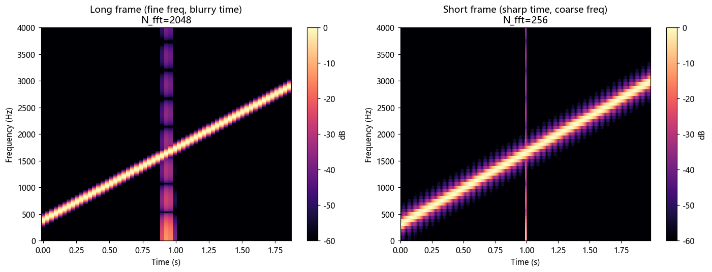

# 第 13 篇｜FFT 与 STFT：让声音"显形"为语谱图

> 一句话核心直觉：FFT 只是算 DFT 的**高速引擎**，答案分毫不差，只是快到离谱；而把声音切成一小片一小片、逐片做 FFT 再横着拼起来，就得到那张能"看见"声音的彩色图——**语谱图 (Spectrogram)**。

---

## 一、承上：上一篇留下的两个难题

第 12 篇结尾我们卡在两个问题上：

1. DFT 按定义直接算太慢，$N$ 个点要约 $N^2$ 次复数乘加；
2. 一整段声音只做一次 DFT，会把所有时刻的频率糊成一团，看不出"何时出现了什么频率"。

这一篇的两个主角，正好一人解一个：**FFT** 解决"慢"，**STFT** 解决"糊"。而它们联手的产物，就是你在几乎每个语音分析工具里都见过的那张彩色语谱图。

---

## 二、FFT：同一个答案，只是不再做重复功

先把一件事说清楚，免得你产生误解：**FFT（快速傅里叶变换）和 DFT 算出来的结果是完全一样的。** FFT 不是另一种变换，也不是近似，它就是 DFT，只不过用了一套聪明的算法，把计算量从 $N^2$ 砍到 $N\log_2 N$。

为什么能砍这么多？直觉上，直接算 DFT 时，不同频率 bin 之间存在大量**重复的乘法**在被反复计算。FFT（最经典的 Cooley–Tukey 算法）的核心思路是"分而治之"：把一个长度为 $N$ 的 DFT，拆成两个长度 $N/2$ 的 DFT（偶数点一组、奇数点一组），再用少量额外运算把两半的结果合并；而每个 $N/2$ 又能继续往下拆……一直拆到最小。这样一层层复用中间结果，就把重复功全省掉了。

这个加速有多夸张，看一眼就懂：

| $N$（点数） | DFT 直接算 ($N^2$) | FFT ($N\log_2 N$) | 快了约 |
|------------|-------------------|-------------------|--------|
| 1024 | ~100 万 | ~10240 | 100 倍 |
| 8192 | ~6700 万 | ~106 千 | 630 倍 |
| 65536 | ~43 亿 | ~105 万 | 4000 倍 |

$N$ 越大，FFT 的优势越离谱。**正是 FFT，才让实时频谱分析、实时语谱图、卷积混响（回顾第 5 篇结尾埋的钩子——频域乘法）在你的笔记本上成为可能。** 没有它，数字音频里几乎所有频域处理都会慢到不可用。

> **一个实用小贴士**：FFT 在 $N$ 是 2 的整数次幂时最快（512、1024、2048…）。这就是为什么音频分析里的帧长、FFT 点数几乎清一色是这些"整齐"的数字——不是迷信，是算法特性使然。在 NumPy 里，你永远不需要自己写 FFT，一句 `np.fft.rfft` 就调用了高度优化的实现。

---

## 三、STFT：一次 FFT 只是"一张快照"，我们需要连拍

现在解决第二个难题：糊。

问题的根源在于，一次 FFT 天然是"无时间"的。你给它一段 1 秒的音频，它告诉你"这 1 秒里总共有哪些频率、各有多强"，但它**绝口不提这些频率是什么时候出现的**。对一个稳定不变的音（比如持续的 440 Hz）这没问题；可语音、音乐里，频率每时每刻都在变——一句"你好"，声带频率在滑动，"你"和"好"的共振峰完全不同。把整句拍成一张频谱，等于把开头和结尾的频率全叠在一起，你看到的是一团糨糊。

解法朴素得近乎笨：**既然一次 FFT 只能给一张"快照"，那我就连拍。** 把长音频切成许多短小的片段（每片短到可以认为"这一小段里频率基本没变"），对**每一片**单独加窗、做 FFT，得到那一小段的频谱；然后把这些频谱**按时间顺序一列一列排好**，横轴是时间、纵轴是频率、颜色深浅表示能量强弱——一张随时间流动的频率地图就出来了。

这个"切片 + 逐片 FFT"的过程，就是**短时傅里叶变换 (Short-Time Fourier Transform, STFT)**。它产出的那张二维彩色图，就是**语谱图 (Spectrogram)**。

写成公式也就是把 DFT 加了个"从第 $m$ 帧起点开始、乘上窗 $w$"：

$$X[m, k] = \sum_{n=0}^{N-1} x[mH+n]\,w[n]\,e^{-j\frac{2\pi}{N}kn}$$

别被吓到，逐字翻译就是大白话：

- $m$：第几帧（第几张快照），决定这一列在时间轴的哪里；
- $H$：**帧移 (hop size)**，相邻两帧起点隔多少个采样——决定连拍的"帧率"；
- $w[n]$：窗函数（第 12 篇讲过，压泄漏用的，STFT 里几乎必加）；
- 里层那个求和：就是第 12 篇的 DFT，一字没变。

所以 STFT 没有任何新东西，它就是"**加窗 DFT，沿时间轴重复很多次**"。

---

## 四、怎么读懂一张语谱图

语谱图是语音算法工程师的"心电图"，先学会读它。三根轴：

- **横轴 = 时间**：从左到右，声音怎么随时间展开。
- **纵轴 = 频率**：从下到上，低频在下、高频在上。
- **颜色 = 能量**：越亮/越暖表示该时刻该频率的能量越强（通常用 dB 表示）。

拿到一张人声语谱图，你能一眼读出这些：

- **底部一条条水平的亮纹**：这是浊音（元音、有调音）的**谐波**——基频及其整数倍。纹路密集且平行，间距就是基频。
- **纹路整体上下滑动**：说明音高在变，这就是语调、声调（中文四声在语谱图上是肉眼可见的滑动轨迹）。
- **某几个频率区域持续偏亮的"团"**：这是**共振峰 (formant)**，由声道形状决定，是区分 a/i/u 等元音的关键。
- **竖直的、覆盖整个频率范围的宽带亮条**：这是爆破音、辅音或瞬态（比如 "p"、"t" 的冲击），能量瞬间铺满全频段。
- **高频区一片模糊的"雾"**：擦音（"s"、"sh"）或噪声，没有清晰谐波结构。

**你在 Praat、Audition、各种语音标注工具里看到的那张彩图，就是这么来的——一列列加窗 FFT 拼出来的。** 语音识别、说话人识别、声纹、TTS 声码器，绝大多数现代语音算法的第一步，都是先把波形变成这张（或它的近亲梅尔谱）图。

---

## 五、绕不开的取舍：时间清楚，频率就糊；反之亦然

第 12 篇埋的那个权衡，现在回来找你算账了，而且换了副更狠的面孔。

STFT 里，每一帧的长度 $N$ 直接决定两件互相打架的事：

- **帧越长**（$N$ 大）→ 频率分辨率越高（$\Delta f = f_s/N$ 越小，谐波看得越细），**但**这一帧覆盖的时间越长，时间上就越"糊"，快速变化的瞬态被抹平。
- **帧越短**（$N$ 小）→ 时间定位越准（能看清爆破音、瞬态的精确时刻），**但**频率分辨率越差（$\Delta f$ 变大，谐波挤成一团分不开）。

这不是工程师偷懒，这是物理定律级别的约束（本质是时频不确定性原理）：**你不可能同时把"某个频率出现在哪个精确时刻"两件事都测得无限准。** 一段信号越短，它的频率就越"测不准"，反之亦然。

所以做语谱图永远在选边站：

| 你想看清什么 | 该用 | 语谱图看起来 |
|-------------|------|-------------|
| 音高、谐波、共振峰的精细结构 | **长帧**（如 2048~4096 点，"窄带语谱图"） | 横向谐波纹路清晰，但瞬态发糊 |
| 爆破音、节奏、瞬态的精确时刻 | **短帧**（如 256~512 点，"宽带语谱图"） | 竖直瞬态锐利，但谐波糊成竖条 |

语音学里"窄带 (narrowband)"和"宽带 (wideband)"语谱图，说的就是长帧和短帧这两种选择。没有哪个更好，只有"你这次想看什么"。

还有个旋钮是**帧移 $H$**：通常取帧长的 25%~50%（帧之间重叠 50%~75%），重叠越多，时间轴上越平滑、相邻帧过渡越连贯，代价是算的帧数更多、更慢。

---

## 六、代码实战：亲手把一段声音变成语谱图

下面这段代码合成一个**频率随时间上升的啁啾 (chirp)** 外加一个中途插入的短促"咔哒"瞬态，然后用长帧和短帧各做一张语谱图，让你亲眼看到"时间-频率"取舍。

```python
import numpy as np
import matplotlib.pyplot as plt

fs = 16000                      # 采样率 16 kHz
dur = 2.0
t = np.arange(int(fs * dur)) / fs

# ---------- 造一段测试信号 ----------
# 1) 一个频率从 300Hz 线性扫到 3000Hz 的 chirp(会在语谱图上画出一条斜线)
f_start, f_end = 300, 3000
inst_phase = 2 * np.pi * (f_start * t + (f_end - f_start) / (2 * dur) * t**2)
x = 0.6 * np.sin(inst_phase)
# 2) 在 1.0s 处插一个短促"咔哒"瞬态(宽带、时间极短)
click_idx = int(1.0 * fs)
x[click_idx:click_idx + 30] += 1.0

# ---------- 手写一个 STFT(揭开黑箱) ----------
def stft(sig, n_fft, hop, fs):
    win = np.hanning(n_fft)
    frames = []
    for start in range(0, len(sig) - n_fft, hop):
        seg = sig[start:start + n_fft] * win     # 取一帧 + 加窗
        spec = np.fft.rfft(seg)                  # 这一帧的 FFT
        frames.append(np.abs(spec))
    S = np.array(frames).T                       # 每列一帧
    S_db = 20 * np.log10(S / S.max() + 1e-6)     # 转 dB
    freqs = np.fft.rfftfreq(n_fft, d=1/fs)
    times = np.arange(S.shape[1]) * hop / fs
    return S_db, freqs, times

# ---------- 长帧 vs 短帧,各画一张 ----------
fig, ax = plt.subplots(1, 2, figsize=(13, 5))

for a, (n_fft, name) in zip(ax, [(2048, "Long frame (fine freq, blurry time)"),
                                 (256,  "Short frame (sharp time, coarse freq)")]):
    S_db, freqs, times = stft(x, n_fft=n_fft, hop=n_fft // 4, fs=fs)
    im = a.pcolormesh(times, freqs, S_db, shading="auto",
                      vmin=-60, vmax=0, cmap="magma")
    a.set_title(f"{name}\nN_fft={n_fft}")
    a.set_xlabel("Time (s)"); a.set_ylabel("Frequency (Hz)")
    a.set_ylim(0, 4000)
    fig.colorbar(im, ax=a, label="dB")

plt.tight_layout()
plt.show()
```



**对比两张图，取舍一目了然**：

- **长帧（左图）**：那条 chirp 斜线又细又清晰（频率分辨率高），但 1.0s 处那个"咔哒"瞬态被抹成了一团宽宽的模糊竖带——时间定位差。
- **短帧（右图）**：1.0s 处的瞬态变成了一条锐利的竖线（时间定位准），但 chirp 斜线明显变粗、变糊——频率分辨率差。

同一个信号，同样的 FFT，只是帧长不同，就给你两张观感截然不同的图。这就是为什么调语谱图参数是门手艺活。

> **想用在真实录音上**：把 `x` 换成 `scipy.io.wavfile.read` 读进来的一段人声（记得转成单声道、归一化），跑同样的 `stft`。你会看到元音处一条条平行的谐波亮纹、辅音处的宽带竖条——真实语音的结构会在你眼前铺开。生产环境里可以直接用 `scipy.signal.stft` 或 `librosa.stft`，原理和上面手写的一模一样。

---

## 七、这在音频工程里，到底解决了什么问题

| 场景 | 背后就是 STFT / 语谱图 |
|------|----------------------|
| **语音识别 / 关键词唤醒的前端** | 波形先转成语谱图（或梅尔谱），再喂给声学模型——几乎所有现代 ASR 的第一步 |
| **声纹 / 说话人识别** | 说话人的共振峰、谐波结构在语谱图上有个体特征，是提取声纹嵌入的基础 |
| **降噪 / 回声消除** | 在 STFT 域逐帧逐 bin 地估计噪声、施加增益，处理完再逆 STFT 拼回波形 |
| **音高检测 / 自动修音（Auto-Tune）** | 从每帧频谱找基频，逐帧修正后重建——修音软件的核心流程 |
| **音乐可视化 / 频谱分析仪** | 播放器里那排随音乐跳动的彩色柱，就是实时 STFT 的一列 |

> **一句话记住**：现代语音/音频算法处理声音，极少直接啃原始波形，绝大多数都先用 STFT 把它摊成语谱图这张"二维图像"，再在图上做文章。看懂语谱图、会调它的时频取舍，是转行做语音算法的入场券。

---

## 八、埋一个钩子：想"设计"一个滤波器，光会分析还不够

到这里，你已经能把声音**分析**得明明白白了——拆成频率、画成语谱图。但工程师的活儿不止是"看"，更要"改"：我想做一个数字混响、一个梳状滤波器、一段均衡器，该怎么**设计**它们？

设计滤波器时，你会立刻面对一堆新问题：这个滤波器稳不稳定（会不会自激啸叫）？它在各个频率上到底放大还是衰减？反馈系数该怎么定？光靠频谱图回答不了这些——你需要一张能一眼看穿数字滤波器"性格"的地图。

那张地图，就是**Z 变换**的极点零点图。它之于数字信号，正如拉普拉斯变换之于模拟信号（还记得第 11 篇拉普拉斯埋下的钩子吗？）。下一篇（第 14 篇），我们就去拿这张导航图。

---

## 本篇小结

- **FFT**：算 DFT 的高速引擎，结果完全相同，计算量从 $N^2$ 降到 $N\log_2 N$；$N$ 取 2 的幂时最快。它是一切实时频域处理的前提。
- **STFT**：把长音频切成短帧，逐帧加窗做 FFT，沿时间轴排开——本质就是"重复很多次的加窗 DFT"。
- **语谱图**：STFT 的产物，横轴时间、纵轴频率、颜色能量。谐波、共振峰、瞬态、擦音都能一眼读出。
- **时频取舍**：帧长决定"频率清楚还是时间清楚"，二者不可兼得（时频不确定性）。窄带用长帧，宽带用短帧。
- **下一步**：从"分析声音"迈向"设计滤波器"——用 Z 变换的极点零点图看穿数字滤波器的行为与稳定性。

