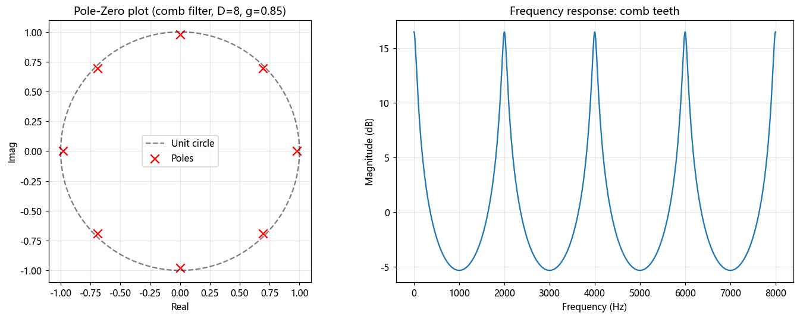

# 第 14 篇｜Z 变换：数字滤波器的"导航地图"

> 一句话核心直觉：Z 变换之于数字信号，就像拉普拉斯变换之于模拟信号（第 11 篇的钩子）——它把一堆看不出门道的差分方程，画成一张**极点零点图**，让你一眼看出这个数字滤波器会放大什么、压制什么、稳不稳定。

---

## 一、承上：模拟世界有拉普拉斯，数字世界呢

第 11 篇里，拉普拉斯变换帮我们把模拟系统的微分方程变成了 $s$ 平面上的极点零点图：极点在哪，系统就在哪个频率"共振"；极点跑到右半平面，系统就发散不稳定。那张 $s$ 平面图，是模拟滤波器工程师的导航地图。

现在我们全程都在数字世界里干活——音频进了电脑就是一串采样点，滤波器不再是电阻电容，而是一行行代码里的**差分方程**。那么，数字世界有没有属于它自己的那张地图？

有。它叫 **Z 变换**，对应的坐标平面叫 **z 平面**。这一篇，我们就把它讲成一张你能真正"读"的地图，而不是一堆求和公式。

---

## 二、数字滤波器长什么样：差分方程

先看清我们要分析的对象。一个数字滤波器，说到底就是一条规则：**当前的输出，由当前和过去的输入、以及过去的输出，加权组合而成。** 写出来就是差分方程：

$$y[n] = b_0 x[n] + b_1 x[n-1] + \dots - a_1 y[n-1] - a_2 y[n-2] - \dots$$

翻译成人话：

- $x[n], x[n-1], \dots$：现在和过去的**输入**采样，前面的系数 $b$ 决定"参考多少输入"；
- $y[n-1], y[n-2], \dots$：过去的**输出**采样，也就是**反馈**，系数 $a$ 决定"参考多少自己的历史"。

只看输入、没有反馈项（没有 $a$）的，是 **FIR**；带反馈项（有 $a$）的，是 **IIR**（这两个名字下一篇会展开）。

问题来了：给你一串 $a$、$b$ 系数，你能一眼说出这个滤波器是低通还是高通吗？它稳不稳定？会不会自激啸叫？光盯着这行方程，看不出来。我们需要把它变个形，变到一张能"看"的地图上去。

---

## 三、$z^{-1}$ 到底是什么：一个"延迟一拍"的积木

Z 变换的全部魔法，浓缩在一个符号里：$z^{-1}$。

**你只需要记住一件事：$z^{-1}$ 就是"延迟一个采样"这个动作。** 一个信号乘以 $z^{-1}$，就等于把它整体往后推一拍——$x[n]$ 变成 $x[n-1]$。$z^{-2}$ 就是延迟两拍，以此类推。

有了这块"延迟积木"，那条差分方程就能被彻底改写。因为延迟 = 乘 $z^{-1}$，我们可以把方程两边做 Z 变换，$y[n-1]$ 变成 $Y(z)z^{-1}$，整理一下就得到滤波器的**传递函数** $H(z)$——输出的 Z 变换除以输入的 Z 变换：

$$H(z) = \frac{Y(z)}{X(z)} = \frac{b_0 + b_1 z^{-1} + b_2 z^{-2} + \dots}{1 + a_1 z^{-1} + a_2 z^{-2} + \dots}$$

别被分式吓住。它的意义特别朴素：**$H(z)$ 是一个关于 $z$ 的分式（有理函数），而任何分式，都由它的分子零点和分母零点完全决定。** 这就引出了整张地图上仅有的两种地标。

---

## 四、极点与零点：地图上仅有的两种地标

$H(z)$ 这个分式，有两组特殊的点：

- **零点 (zeros)**：让**分子**等于 0 的那些 $z$ 值。此处 $H(z)=0$——滤波器在这些位置**极力压制、掏空**能量。
- **极点 (poles)**：让**分母**等于 0 的那些 $z$ 值。此处 $H(z)\to\infty$——滤波器在这些位置**极力放大、共振**。

把它们画在复平面（z 平面）上，零点用 ○、极点用 ×，这张图就是**极点零点图 (pole-zero plot)**。它就是差分方程的"性格画像"。

那怎么从这张图读出滤波器在**每个频率**上的行为？这就要请出 z 平面上最重要的一条线——**单位圆**。

### 单位圆 = 所有的频率

z 平面上以原点为心、半径为 1 的那个圆，叫**单位圆**。它的地位无可替代：

> **单位圆上的每一个点，恰好对应一个真实频率。** 从最右边那点（$z=1$）出发是 0 Hz（直流），逆时针转到最上方是奈奎斯特频率的一半，转到最左边（$z=-1$）是奈奎斯特频率（$f_s/2$）。绕圈一周，就扫过了这个数字系统能表示的全部频率。

有了这条线，读图规则简单到近乎作弊：

- 想知道某个频率处滤波器的增益？就站在单位圆上那个频率对应的点上，看它**离各个极点、零点有多近**。
- **离极点越近 → 增益越大**（极点在拉高附近的响应）；
- **离零点越近 → 增益越小**（零点在压低附近的响应）。

于是整条频率响应曲线，不过是你**沿单位圆走一圈，一路感受"被极点拉高、被零点压低"的过程**。低通滤波器？把极点放在 $z=1$（0 Hz）附近、把零点放在 $z=-1$（高频）附近就行——低频被拉高、高频被压死。这就是设计滤波器的几何直觉。

### 极点位置 = 稳不稳定

单位圆还管着另一件生死大事：稳定性。

- **所有极点都在单位圆内部**（离原点距离 < 1）→ 系统**稳定**，冲激响应会衰减到 0。
- **有极点跑到单位圆上或外部**（距离 ≥ 1）→ 系统**不稳定**，输出会越滚越大、自激啸叫、直到爆掉。

这和第 11 篇拉普拉斯的规矩是一对孪生兄弟：模拟世界看"极点在不在左半平面"，数字世界看"极点在不在单位圆内"。判据换了形状，逻辑一模一样——极点太靠外，反馈就失控。

| | 模拟世界（拉普拉斯，s 平面） | 数字世界（Z 变换，z 平面） |
|---|---|---|
| 频率轴 | 虚轴 $j\omega$ | **单位圆** |
| 稳定区域 | 左半平面 | **单位圆内部** |
| 极点作用 | 共振/放大 | 共振/放大 |
| 零点作用 | 陷波/压制 | 陷波/压制 |

---

## 五、把地图用在音频上：梳状滤波器与数字混响

抽象的地图讲完了，落到你的本行。音频里最能体现极点零点威力的，就是梳状滤波器和它撑起的数字混响。

### 梳状滤波器：一个延迟 + 一个反馈

回想第 5 篇：一次拍手在山洞里激起一串等间隔的回声。用差分方程描述"把声音延迟 $D$ 拍再按比例 $g$ 加回来"，就是最简单的**反馈梳状滤波器**：

$$y[n] = x[n] + g\,y[n-D]$$

它的传递函数是 $H(z) = \dfrac{1}{1 - g\,z^{-D}}$。分母为零（$z^D = g$）给出 **$D$ 个均匀分布在一个圆上的极点**。这些极点在单位圆内绕一圈均匀排开，于是沿单位圆走频率时，你会周期性地一次次逼近某个极点——增益就周期性地被拉高，频率响应长出一排等间距的尖峰，像一把梳子的齿。"梳状滤波器"这名字就是这么来的。

- 反馈量 $g$ 越接近 1，极点越贴近单位圆，梳齿越尖锐、回声拖得越久（混响越长）；
- $g \ge 1$，极点跑到单位圆上/外，回声不衰减反而越叠越响——**自激啸叫**，混响算法炸了。

这解释了一个你可能踩过的坑：为什么数字混响的反馈/衰减参数拉太满，声音会开始"发振"、嗡嗡失控。因为你把极点推出了单位圆。

### 数字混响：一堆梳状 + 全通的极点游戏

经典的 Schroeder 混响器，就是**几个不同延迟 $D$ 的反馈梳状滤波器并联，再串上几个全通滤波器**。每个梳状贡献一组极点、决定一组回声密度和衰减，全通滤波器则在不改变整体音色（幅频平坦）的前提下把回声打散、增加密度。整个混响的"性格"——余音长短、密度、有没有金属味——本质上就是这一大堆极点在单位圆内怎么摆的问题。

调混响，某种意义上就是在 z 平面上摆放极点。

---

## 六、代码实战：画出极点零点图，再听它对应的频率响应

下面这段代码做一个反馈梳状滤波器，画出它的极点零点图，并算出对应的频率响应，让你亲眼看到"单位圆内均匀排开的极点"如何造出"梳齿状"的频响。

```python
import numpy as np
import matplotlib.pyplot as plt

fs = 16000

# ---------- 反馈梳状滤波器: y[n] = x[n] + g*y[n-D] ----------
D = 8          # 延迟拍数(决定梳齿间距 = fs/D)
g = 0.85       # 反馈量(越接近1,极点越贴近单位圆,梳齿越尖)

# 传递函数 H(z) = 1 / (1 - g z^{-D})
# 分子系数 b, 分母系数 a (按 z^{-1} 的幂排列)
b = np.zeros(1); b[0] = 1.0
a = np.zeros(D + 1); a[0] = 1.0; a[D] = -g

# ---------- 求极点零点 ----------
zeros = np.roots(b) if len(b) > 1 else np.array([])
poles = np.roots(a)

# ---------- 求频率响应 H(e^{jw}) ----------
w = np.linspace(0, np.pi, 2048)          # 0 ~ 奈奎斯特
ejw = np.exp(1j * w)
# H(z) = b(z)/a(z) 在 z = e^{jw} 处取值; 直接按 sum(系数 * z^{-k}) 求和最不易错
num = sum(b[k] * ejw ** (-k) for k in range(len(b)))
den = sum(a[k] * ejw ** (-k) for k in range(len(a)))
H = num / den
freqs = w / np.pi * (fs / 2)

# ---------- 画图 ----------
fig, ax = plt.subplots(1, 2, figsize=(13, 5))

# (左) 极点零点图 + 单位圆
theta = np.linspace(0, 2 * np.pi, 400)
ax[0].plot(np.cos(theta), np.sin(theta), 'k--', alpha=0.5, label="Unit circle")
ax[0].scatter(poles.real, poles.imag, marker='x', s=90, c='r', label="Poles")
if len(zeros):
    ax[0].scatter(zeros.real, zeros.imag, marker='o', s=90,
                  facecolors='none', edgecolors='b', label="Zeros")
ax[0].set_aspect('equal'); ax[0].grid(True, alpha=0.3)
ax[0].set_title(f"Pole-Zero plot (comb filter, D={D}, g={g})")
ax[0].set_xlabel("Real"); ax[0].set_ylabel("Imag"); ax[0].legend()

# (右) 频率响应(幅度)
ax[1].plot(freqs, 20 * np.log10(np.abs(H) + 1e-9))
ax[1].set_title("Frequency response: comb teeth")
ax[1].set_xlabel("Frequency (Hz)"); ax[1].set_ylabel("Magnitude (dB)")
ax[1].grid(True, alpha=0.3)

plt.tight_layout()
plt.show()
```



**你会在两张图里看到清晰的对应关系**：

- 左图：$D=8$ 个极点（红叉）均匀分布在单位圆**内侧**一个圆上（半径约 $g^{1/D}$，小于 1，所以稳定）。
- 右图：频率响应长出一排等间距的尖峰——梳齿，间距正好是 $f_s/D = 2000$ Hz。每个尖峰，就对应单位圆上"最靠近某个极点"的那个频率。

把 `g` 改到 `0.98`，你会看到极点更贴近单位圆，梳齿变得又尖又高（回声拖得更长）；再把 `g` 改成 `1.02`（推出单位圆），滤波器就不稳定了——这在现实中就是混响自激。**改一个反馈参数，极点如何移动、频响如何变化、系统稳不稳定，全在这张图上一目了然。** 这就是 Z 变换作为"导航地图"的价值。

---

## 七、这在音频工程里，到底解决了什么问题

| 场景 | 背后就是 Z 变换 / 极点零点 |
|------|--------------------------|
| **数字混响调参** | 反馈量决定极点离单位圆多近，直接对应余音长短与稳定边界 |
| **梳状滤波器 / 镶边 (flanger)** | 一组均匀极点造出梳齿，延迟随时间变化就成了 flanger/chorus |
| **陷波器 (notch)** | 在要消除的频率（如 50Hz 工频哼声）处的单位圆位置放一对零点，精准掏空 |
| **EQ 峰值/搁架滤波器** | 极点零点成对摆放，控制某频段的提升/衰减量与带宽（第 15 篇会亲手设计） |
| **滤波器稳定性检查** | 设计出的 IIR 滤波器，先看极点是否全在单位圆内，再决定敢不敢上线 |

> **一句话记住**：数字音频里任何带反馈的处理（混响、IIR EQ、梳状/陷波器），它的行为和稳定性都写在极点零点图上。学会读这张图，你调参数时就不再是盲目试错，而是在 z 平面上"搬动"极点和零点。

---

## 八、埋一个钩子：地图有了，该动手画滤波器了

现在你有了导航地图（Z 变换），也知道极点拉高、零点压低、极点必须待在单位圆内。但真到了要做一个"能用的均衡器"时，还有一堆实操问题：

- FIR 和 IIR，这两种滤波器到底该怎么选？各自的性格和代价是什么？
- 给定一个目标（比如"200Hz 以下衰减 12dB"），系数 $a$、$b$ 到底怎么算出来？
- 怎么用 Python 从零设计低通、高通、峰值滤波器，处理一段真实录音，对比处理前后的频谱和听感？

下一篇（第 15 篇，本模块收官），我们就把前面所有的积累——卷积、频谱、STFT、极点零点——全部兑现成一件能跑的东西：**亲手撸一个 EQ**。

---

## 本篇小结

- **Z 变换**是数字世界的拉普拉斯：把差分方程变成 z 平面上的极点零点图。
- **$z^{-1}$** 就是"延迟一个采样"这块积木，靠它把差分方程改写成传递函数 $H(z)$（一个分式）。
- **零点**（分子为 0）压制能量，**极点**（分母为 0）放大/共振能量。
- **单位圆**上的每个点对应一个真实频率；频率响应 = 沿单位圆走一圈、感受被极点拉高、被零点压低。
- **稳定性**：所有极点在单位圆内 → 稳定；跑到圆上或圆外 → 自激失控（对应混响发振）。
- **梳状滤波器 / 数字混响**：延迟 + 反馈造出单位圆内均匀排开的极点，形成梳齿状频响，反馈量逼近 1 时余音变长、逼近失稳。
- **下一步**：把地图变成产品——亲手设计并实现 FIR/IIR 均衡器。

