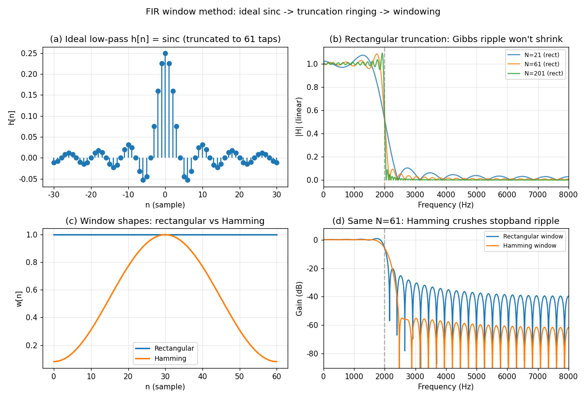
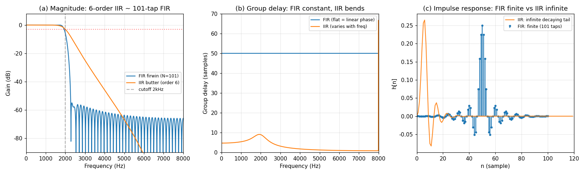

# 第 15 篇｜数字滤波器设计：把一条频响曲线变成能跑的系数

> 一句话核心直觉：设计滤波器，就是**把"我想要的那条频响曲线" $H$ 倒推成一串能喂给 CPU 的系数**。倒推的路只有两条——FIR 走"理想响应 → sinc → 截断加窗"，IIR 走"模拟原型 → 双线性变换 → 极零点"。这一篇是模块的收官落地篇，我们把前面攒下的 $h$、$H$、极点零点、$H(z)$ 全部收束成一件事：**我要一个低通，怎么把它造出来、跑起来、还不炸。**

---

## 一、先把教材那套"设计流程图"扔一边

翻开任何一本数字信号处理的书，讲到滤波器设计，扑面而来的是一张吓人的流程图：给定通带边缘、阻带边缘、通带纹波 $\delta_p$、阻带衰减 $\delta_s$，查表算阶数，选窗，做频率变换，双线性预畸变……一堆希腊字母和缩写糊在一起，看完只想合上书。

我当年也是这么被劝退的。但其实这整套流程，只在解决一件特别朴素的事：

**你心里有一条曲线，CPU 手里只有一串数。你要把前者翻译成后者。**

"我想要一条曲线"是什么意思？回顾第 10 篇：一个滤波器在你耳朵里的样子，就是它的**频率响应 $H$**——一条画着"哪个频率放大、哪个频率压制"的曲线，本质就是 EQ 界面上那条你用鼠标拖出来的线。你想去掉 3 kHz 以上的嘶嘶声，脑子里那条"3 kHz 以前平、之后往下掉"的曲线，就是你要的 $H$。

"CPU 手里只有一串数"是什么意思？回顾第 14 篇：数字滤波器落到代码里，就是一条差分方程

$$y[n] = b_0 x[n] + b_1 x[n-1] + \dots - a_1 y[n-1] - a_2 y[n-2] - \dots$$

CPU 只认这串 $b$ 和 $a$。给它系数，它就一个样本一个样本地乘加吐出结果。

所以**设计滤波器 = 已知想要的 $H$，反求出 $b$、$a$**。就这么一句话。教材那张流程图，只是把这句话在不同情况下的具体走法画了出来。这一篇我们不背流程图，我们把两条主路——FIR 和 IIR——各自"为什么必须这么走"想明白，然后真的造一个出来。

> **关键认知**：滤波器设计不是发明系数，是**翻译**。左边是你想要的频响曲线 $H$（第 10 篇的 EQ 曲线），右边是 CPU 能执行的差分方程系数 $b$、$a$（第 14 篇的 $H(z)$）。设计工具干的全部活，就是这个从"曲线"到"系数"的反向翻译。

---

## 二、两种滤波器的性格：FIR 与 IIR

在动手翻译之前，得先知道**翻译的目标有两种**。回顾第 14 篇那条差分方程，滤波器就两大门派，区别只在一个字：**反馈**（有没有用到过去的输出 $y[n-k]$）。

### 2.1 FIR：只看输入的老实人

FIR（Finite Impulse Response，有限冲激响应）**只用输入**：

$$y[n] = b_0 x[n] + b_1 x[n-1] + \dots + b_M x[n-M]$$

右边全是 $x$，没有一个 $y[n-k]$。它的性格由此完全确定：

- **绝对稳定**。没有反馈，输出不可能自己滚大。翻到第 14 篇的 z 平面：它**没有极点**（除了原点那几个平凡极点），而稳定性只由极点位置决定，所以 FIR 天生稳、永远不会自激。系数怎么取都稳。
- **可以做到完美线性相位**。只要系数左右对称，所有频率被延迟同样多个采样（第 10 篇 7.3：群延迟恒为 $(M)/2$ 常数），波形的相对时序纹丝不动，瞬态完整保留。这对音频（尤其母带、需要保护瞬态的场合）是硬优点。
- **代价是"笨重"**。想要陡峭的过渡带，得堆很多系数（几十上百个 $b$），每样本乘加多、延迟高。

还记得第 5 篇吗？**一个 FIR 滤波器的系数 $b$，本质上就是它的冲激响应 $h[n]$。** 你给系统送一个冲激 $\delta[n]=[1,0,0,\dots]$，FIR 吐出来的就是 $[b_0, b_1, \dots, b_M]$，一模一样。所以滤波就是输入和这串系数做卷积——**FIR 设计和卷积核设计是同一件事的两个名字。** 这也是为什么第 5 篇说"$h$ 是有限长数组"这句话只对 FIR 成立。

### 2.2 IIR：带反馈记忆的高效者

IIR（Infinite Impulse Response，无限冲激响应）**用了反馈**：

$$y[n] = b_0 x[n] + b_1 x[n-1] + \dots - a_1 y[n-1] - a_2 y[n-2] - \dots$$

多了 $y[n-k]$ 这些反馈项，性格立刻反转：

- **极其高效**。靠反馈，输出会自己"回响"，往往只需 2~4 个系数就能做出 FIR 要几十个系数才能达到的陡峭曲线。模拟滤波器（巴特沃斯、切比雪夫）的数字版几乎都是 IIR。
- **要操心稳定性**。有反馈就有极点（第 14 篇：让 $H(z)$ 分母为零的点），极点必须待在单位圆**内**，否则那个"回响"越滚越大直接自激。系数不是随便取的。
- **相位非线性**。不同频率延迟不同（第 10 篇 7.3：群延迟随频率弯曲，低频常拖后腿），会轻微抹糊瞬态。多数音频场合可接受，母带场合要当心。
- **冲激响应无限长**。因为有反馈，敲它一下的余响原则上永远衰减不到零（只是越来越小）——这就是名字里 "Infinite" 的来历，也印证了第 5 篇"IIR 的 $h$ 无限长"那句红线。

一句话对照：

| | FIR（老实人） | IIR（高效者） |
|---|---|---|
| 反馈项 $y[n-k]$ | 无 | 有 |
| 稳定性 | 天生稳定（无极点） | 需保证极点在单位圆内 |
| 系数数量 | 多（几十~上百） | 少（常 2~5 个） |
| 相位 | 可做到完美线性 | 一般非线性 |
| 冲激响应 $h$ | 有限长（就是系数本身） | 无限长（拖尾衰减） |
| 音频典型用途 | 线性相位 EQ、卷积混响、抗混叠 | 参数 EQ、实时低/高通、混响内核 |

这张表先记个大概，第七节的选型会把它落成"什么需求选哪个"。现在带着这两种性格，我们分头去看两条翻译路怎么走。

---

## 三、FIR 窗函数法：从"理想砖墙"一路被逼到"加窗"

先走 FIR 这条路，因为它的每一步都能用前面篇目的东西推出来，看完你会有种"原来如此"的通透感。我们的任务很具体：

> **造一个截止 2 kHz 的低通 FIR，采样率 16 kHz。** 要求 2 kHz 以下的频率原样通过、以上的全部压掉。求它的系数 $h[n]$。

不着急上代码，我们一步一步把 $h[n]$ 逼出来。

### 3.1 第一步：把"我想要的曲线"写成数学式

我想要的 $H$ 长什么样？一条**砖墙**：2 kHz 以前增益为 1（原样通过），以后增益为 0（压死）。在频率轴上就是一个矩形。

用第 10 篇的记法，频率响应写成 $H(e^{j\omega})$，其中 $\omega$ 是数字角频率（$\omega=\pi$ 对应奈奎斯特频率 $f_s/2=8$ kHz）。我的截止频率 2 kHz 对应

$$\omega_c = 2\pi \frac{f_c}{f_s} = 2\pi \cdot \frac{2000}{16000} = \frac{\pi}{4}$$

理想低通就是：$|\omega| < \omega_c$ 时 $H=1$，否则 $H=0$。一个干净的矩形。

### 3.2 第二步：矩形的频响，对应的 h 是什么？

这里要用到第 5 篇末尾那句话：**已知频响 $H$，做逆变换就得到冲激响应 $h$。** 频域是矩形，时域是什么？

我们不硬算积分，先借第 9 篇的现成结论。第 9 篇 6.3 讲 sinc 重建时点破过一件事：**频域的理想矩形（砖墙低通），时域正好是一条 sinc 曲线**，两者是同一件事的两面。那里是为了重建采样，这里是为了设计滤波器，但数学是同一个——矩形 $\leftrightarrow$ sinc 这对关系。

直接写出理想低通的冲激响应（逆 DTFT 的标准结果，推导第 9 篇做过一半，这里只取用结论）：

$$h_{\text{ideal}}[n] = \frac{\sin(\omega_c n)}{\pi n} = \frac{\omega_c}{\pi}\,\operatorname{sinc}\!\Big(\frac{\omega_c n}{\pi}\Big), \qquad n = \dots,-2,-1,0,1,2,\dots$$

读它：这是一条以 $n=0$ 为中心、向两边**无限延伸**的 sinc，越往两边波纹越小但永远不为零。代入 $\omega_c=\pi/4$，中心值 $h[0]=\omega_c/\pi=0.25$，两侧是逐渐衰减的正负波纹。

到这里，麻烦已经露头了。

### 3.3 第三步：撞墙——理想低通根本不可实现

看看这个 $h_{\text{ideal}}[n]$，它有两条致命毛病：

1. **无限长**。$n$ 从 $-\infty$ 到 $+\infty$，sinc 拖尾永不为零。CPU 存不下无限个系数。
2. **非因果**。$n<0$ 处也有值——意思是"要算当前输出，得用到未来的输入"。实时处理时未来的样本还没来，做不到。

这不是我们手笨，而是**理想砖墙滤波器在物理上就不可实现**。它和第 9 篇那个"理想重建需要无限长 sinc"、以及"$f_s=2f_{\max}$ 边界需要理想砖墙"是同一个不可能——完美的频域矩形，代价永远是无限长的时域拖尾。这是一条硬规律，不是能力问题。

> **关键认知**：**没有"完美滤波器"这回事。** 频域越接近砖墙（过渡带越窄、阻带压得越死），时域的 $h$ 就越长、拖尾越顽固。理想砖墙对应无限长且非因果的 $h$，永远造不出来。所有真实滤波器设计，都是在"曲线多陡"和"系数多长/延迟多大"之间做权衡。

既然无限长存不下，最笨的念头是：**那就切一段呗。** 只留中间 $N$ 个系数，两边的拖尾直接扔掉。这一切，就把我们带进了第一个真正的坑。

### 3.4 第四步：直接截断的代价——Gibbs 振铃

把 $h_{\text{ideal}}[n]$ 只保留中间 $N$ 个点、其余置零，这个动作叫**加矩形窗**（窗 = 一个"只在某段为 1、其余为 0"的乘子，矩形窗就是"一刀切")。

问题是：时域这一刀切下去，频域会出乱子。切断相当于把 $h_{\text{ideal}}$ 乘上一个矩形窗，而时域相乘 = 频域卷积（第 5 篇末尾、第 13 篇加窗都是这个道理）。理想的矩形频响，被矩形窗的频谱（一个 sinc 状的东西）一卷，原本笔直的砖墙边缘就长出了**波纹和过冲**——通带里冒起涟漪、阻带里压不干净、边缘还鼓一个包。

这个过冲有个反直觉的性质，叫 **Gibbs 现象**：**你增加系数个数 $N$，过冲的高度几乎不下降（顽固地停在约 9%），只是波纹变密、过渡带变窄。** 也就是说，靠"多切几个点"根本消不掉振铃。看下面配图 (b)：$N=21$、$61$、$201$ 三条矩形截断的曲线，边缘那个鼓包高度几乎一样，只是越来越密。

对音频来说，阻带里这 9% 的漏音（约 -21 dB）远远不够——你想压掉的高频还剩一大截。矩形窗这条路，撞墙了。

### 3.5 第五步：加窗——用"温柔的收尾"换掉"一刀切"

问题出在"一刀切"太生硬：矩形窗在边缘从 1 突然掉到 0，这个**跳变**才是频域波纹的根源（跳变 = 高频成分，抖出振铃）。

那就别硬切。换一个**两头平滑收拢到 0** 的窗——中间是 1、往两边慢慢降到 0，没有任何突变。这样的窗有一堆现成的（汉明窗、汉宁窗、布莱克曼窗、凯泽窗……），形状略有不同，但思路一致：**用平滑收尾消灭跳变，从而压平频域振铃。** 看配图 (c)：矩形窗是个方块，汉明窗是个平滑的钟形拱。

于是 FIR 窗函数法的完整配方就三步：

$$\boxed{\;h[n] = \underbrace{h_{\text{ideal}}[n]}_{\text{理想 sinc}} \times \underbrace{w[n]}_{\text{平滑窗}}, \quad n=0,1,\dots,N-1\;}$$

（把中心从 $n=0$ 挪到 $n=(N-1)/2$，让它变成因果的、全在 $n\ge 0$ 的系数；这只是整体延迟半个窗长，正是第 10 篇那个线性相位的固定群延迟。）

代价当然有：平滑收尾会让过渡带变宽一点（边缘没那么陡了）。看配图 (d)，同样 $N=61$，汉明窗把阻带振铃从 -21 dB 一路压到 -50 dB 以下，代价是过渡带比矩形窗宽了些。**这就是那个逃不掉的权衡：阻带压得越狠，过渡带越宽**——想两个都要，只能加长 $N$。天下没有免费的滤波器。



### 3.6 第六步：代码——一行 firwin，背后就是这三步

理解了原理，工程上不用手搓 sinc 和窗，`scipy.signal.firwin` 把这三步打包好了（它默认用汉明窗，内部就是"理想 sinc × 窗 + 归一化"）：

```python
import numpy as np
from scipy import signal

fs = 16000
fc = 2000.0

# firwin: 内部 = 理想低通 sinc × 窗 → 有限长线性相位系数
# numtaps=101 就是系数个数 N; 对称 → 天然线性相位
h = signal.firwin(numtaps=101, cutoff=fc, fs=fs)   # 窗默认 hamming

print(h.shape)        # (101,) —— 就是 101 个系数，也就是 h[n]
print(np.sum(h))      # ≈ 1.0 —— 直流增益归一化到 1（0Hz 原样通过）
```

`h` 就是那 101 个能直接喂给 CPU 的系数，同时也**就是这个 FIR 的冲激响应**（第 5 篇）。想换更陡的过渡带就加大 `numtaps`；想换阻带更深的窗就传 `window='blackman'` 之类。

真正把它用到信号上，一行卷积（`lfilter` 在 FIR 上就是纯卷积，因为分母只有 $a_0=1$）：

```python
# y = signal.lfilter(h, [1.0], x)   # x 是你的输入，y 是滤波后的输出
```

**旁支点名（不展开）**：窗函数法只是 FIR 设计的一条路，好懂但不是最优。工程里还有两条常见路——**频率采样法**（直接在频率轴上摆你要的采样点再逆变换）和 **等纹波法 / Parks-McClellan**（`scipy.signal.remez`，在给定阶数下让通带阻带纹波最小、最"划算"）。要在同样系数数量下榨出最陡的过渡带，一般用等纹波法；要快速搭个够用的低通，窗函数法足够。知道有这几条路、名字对得上就行。

---

## 四、IIR 设计：借模拟世界几十年的老本

FIR 那条路是"从零画一条曲线"。IIR 走的是完全不同的思路：**别重新发明，去抄模拟滤波器几十年攒下的成熟设计。**

### 4.1 为什么不从头设计 IIR，而要"从模拟抄"

模拟世界（第 11 篇的 $s$ 平面）里，工程师早就把低通滤波器研究透了，攒下几套经典**原型**：

- **巴特沃斯（Butterworth）**：通带最平坦，没有纹波，代价是过渡带不算最陡。最常用、最稳妥。
- **切比雪夫（Chebyshev）**：允许通带（或阻带）有一点纹波，换来更陡的过渡带。
- **椭圆（Elliptic / Cauer）**：通带阻带都允许纹波，同阶数下过渡带最陡，但相位最难看。

这些原型在 $s$ 平面上的极点零点位置都有闭式公式（比如巴特沃斯的极点均匀分布在一个半圆上）。既然模拟版已经完美，数字 IIR 设计就变成一个更省事的问题：**怎么把 $s$ 平面上这套现成的极零点，搬到 z 平面上去？**

这就需要一座连接两个平面的桥。

### 4.2 双线性变换：连接 s 平面与 z 平面的桥

回顾两张地图：第 11 篇的 $s$ 平面（模拟，稳定区是**左半平面**）、第 14 篇的 z 平面（数字，稳定区是**单位圆内**）。我们需要一个映射，把 $s$ 平面的每个点搬到 z 平面，而且**把"左半平面"整个塞进"单位圆内"**——这样模拟原型是稳定的，搬过来的数字版也一定稳定。

**双线性变换**就是干这个的一个代换：

$$s = \frac{2}{T}\cdot\frac{1 - z^{-1}}{1 + z^{-1}}$$

（$T$ 是采样周期。）你不需要背它，只需知道它这一手代换恰好满足上面那条要求：$s$ 的整个左半平面被不重不漏地映射进 z 的单位圆内、虚轴（$s=j\Omega$，模拟的频率轴）被映射到单位圆上（数字的频率轴）。于是——**模拟原型稳定 → 数字版一定稳定**，白捡了稳定性保证。

具体操作就是：拿到模拟原型的 $H(s)$，把每个 $s$ 用上面那个 $z$ 的表达式换掉，整理，就得到数字的 $H(z)$，读出分子分母系数就是 $b$、$a$。这活儿 scipy 一行搞定，不用手推。

### 4.3 一个必须提的坑：频率预畸变（warping）

双线性变换有个副作用：它把 $s$ 平面无限长的频率轴（$0$ 到 $\infty$）硬**压缩**进 z 平面有限长的单位圆（$0$ 到 $f_s/2$）。压缩就意味着不是线性对应——低频还基本对得上，越靠近奈奎斯特频率，频率被"挤"得越厉害。

后果很具体：你想要截止频率正好落在 2 kHz，直接套双线性变换，**真实截止会偏离 2 kHz**（尤其截止频率高时偏得明显）。这个现象叫**频率畸变（frequency warping）**。

解法叫**预畸变（pre-warping）**：设计前先把目标截止频率按双线性的压缩规律**反向拉一下**，让它经过变换后正好落回你要的 2 kHz。好消息是 `scipy.signal.butter` 这类函数**内部已经替你做了预畸变**，所以你直接填 2 kHz 就对。知道有这回事，是为了当你自己手推、或看到高截止频率处对不上时不至于抓瞎。

### 4.4 代码：一行 butter，极零点自动摆好

```python
from scipy import signal

fs = 16000
fc = 2000.0

# butter: 内部 = 巴特沃斯模拟原型 + 预畸变 + 双线性变换
# N=6 是阶数(极点个数); Wn 是归一化截止频率(相对奈奎斯特 fs/2)
b, a = signal.butter(N=6, Wn=fc / (fs / 2), btype="low")

print(len(b), len(a))    # 7 7 —— 6 阶，各 7 个系数（含 b0/a0）
# 看极零点是否都在单位圆内（第 14 篇：这就是稳定性）
z, p, k = signal.tf2zpk(b, a)
print("max |pole| =", max(abs(p)))   # < 1 → 稳定
```

`butter` 内部把"巴特沃斯原型 → 预畸变 → 双线性变换 → 读系数"全串好了。你只给它三件事：**类型（低通/高通/带通）、截止频率、阶数**。阶数 $N$ = 极点个数，越大过渡带越陡（代价：极点越多、越贴近单位圆、越容易因量化失稳，见下一节）。

在 z 平面上直观理解这组极零点（第 14 篇几何直觉）：低通就是**把极点摆在 $z=1$（0 Hz）附近**去拉高低频、**把零点摆在 $z=-1$（奈奎斯特）附近**去压死高频。`butter` 算出来的就是这么一个布局。

### 4.5 生产红线：高阶 IIR 别用 (b, a)，要用 SOS 级联

这是 IIR 落地最容易踩的坑，单独拎出来说。

前面 `butter` 返回的 `(b, a)` 是把 6 阶滤波器写成**一个**高阶差分方程。问题是：高阶多项式的系数对数值误差极其敏感——极点全挤在单位圆附近，float 量化时系数一抖，极点就可能被推出单位圆，**滤波器直接自激炸掉**。定点 DSP 或长信号链里这尤其致命。

生产做法是把高阶 IIR 拆成若干个**二阶节（biquad）串联**，术语叫 **SOS（Second-Order Sections）**。每个 biquad 只有两个极点两个零点，数值稳健得多，串起来等效于原高阶滤波器（串联 = 频域增益相加，第 5 篇卷积可结合）：

```python
# 生产写法：输出 SOS，用 sosfilt 跑
sos = signal.butter(N=6, Wn=fc / (fs / 2), btype="low", output="sos")
# y = signal.sosfilt(sos, x)   # 比 lfilter(b, a, x) 数值稳得多
print(sos.shape)   # (3, 6) —— 6 阶拆成 3 个 biquad，每行 6 个系数
```

> **关键认知**：IIR 设计 = **抄一个稳定的模拟原型 + 用双线性变换搬进单位圆**。稳定性是白送的（左半平面 → 圆内），但**只在数学上白送**；工程上系数量化会把贴近单位圆的极点推出去。所以高阶 IIR 一律拆成 biquad 级联（SOS）跑，别直接用高阶 $(b,a)$。

---

## 五、等等，是不是"阶数越高，滤波器越好"？

走到这里，你手里已经有两条造滤波器的路，也都见过"阶数越高、过渡带越陡"这句话。很自然会冒出一个念头：**那我把阶数往死里堆，不就得到一个逼近砖墙的完美滤波器了吗？**

这是这一篇最需要打的一个直觉。答案是响亮的**不**。"阶数越高越好"是初学者最常见的误区，它错在把滤波器当成一个只有"陡峭度"一个维度的东西。真实的滤波器是**一组互相打架的指标**，你按下一个，另一个就弹起来。

### 5.1 阶数堆高，你付出的四份代价

- **延迟涨。** FIR 的群延迟约 $(N-1)/2$ 个采样（第 10 篇 7.3），系数翻倍延迟翻倍。做实时监听、AEC 这种低延迟场合，一个 1001 抽头的"漂亮"低通带来的 30 ms 延迟能直接把整个链路拖垮。
- **算力涨。** 每样本的乘加次数正比于阶数。FIR 100 抽头就是每样本 100 次乘加，跑 48 kHz 立体声就是每秒近千万次。嵌入式芯片上这是真花不起的预算。
- **IIR 更容易失稳。** 阶数越高，极点越多、越往单位圆边缘挤（第 14 篇）。前面说过，贴边的极点在系数量化下极易被推出单位圆而自激。高阶 IIR 的"陡"是拿稳定裕度换的。
- **Gibbs 治不了根（对矩形窗 FIR）。** 第 3.4 节已经看到：靠加大 $N$ 压不掉通带过冲，只是把波纹变密。陡峭度和纹波是两个独立的病，加阶数只治一个。

### 5.2 三个逃不掉的权衡指标

真实滤波器设计，本质是在**四个指标**间做分配，它们构成一个"按下葫芦浮起瓢"的约束系统：

| 指标 | 含义（EQ/低通语境） | 想变好会牺牲谁 |
|---|---|---|
| **过渡带宽度** | 从通带到阻带下滑的那段有多陡 | 变窄 → 阶数涨、延迟涨 |
| **通带纹波** | 通带内增益的起伏（理想是纹丝不动的平） | 压小 → 过渡带变宽或阶数涨 |
| **阻带衰减** | 该压掉的频率压下去多少 dB | 压深 → 过渡带变宽或阶数涨 |
| **阶数 / 延迟 / 算力** | 系数个数，直接换来延迟和 CPU 成本 | 这是前三个的"账单" |

第 3.5 节那句"阻带压得越狠、过渡带越宽"就是这张表里的一格。**没有哪种设计能让四项同时最优**——巴特沃斯牺牲陡峭换平坦通带，椭圆牺牲纹波换陡峭，等纹波法在固定阶数下把纹波摊到最均匀。选滤波器就是选"我愿意在哪一项上让步"。

### 5.3 那"理想砖墙"这个直觉边界在哪

回到第 3.3 节：**理想砖墙滤波器根本不存在。** 它要求无限长且非因果的 $h$，违反因果性（要用到未来样本），物理上造不出来。所以我们能造的每一个滤波器，都是砖墙的**近似**——过渡带是必然存在的斜坡，纹波和衰减是必然要定的预算。

> **关键认知**：**"完美滤波器"是个伪命题，"阶数越高越好"是个陷阱。** 真实设计是在过渡带宽度、通带纹波、阻带衰减、阶数（延迟+算力+稳定裕度）之间做权衡。理想砖墙对应无限长非因果的 $h$，不可实现。工程师的活不是追求"最好"，而是**在给定的延迟和算力预算下，把频响做到够用**。堆阶数之前，先问"我真的需要这么陡吗、我付得起这份延迟吗"。

---

## 六、代码实战：把 FIR 和 IIR 摆在一起，看清它们的性格

理论讲完，眼见为实。我们造两个**目标一样**的低通——都是截止 2 kHz、采样率 16 kHz——一个用 FIR（101 抽头），一个用 IIR（6 阶巴特沃斯），然后把它们的幅频、群延迟、冲激响应画在一起。这张图就是前面所有对照表的可视化证据。

```python
import numpy as np
from scipy import signal

fs = 16000
fc = 2000.0

# ---------- 两个目标相同的低通 ----------
N_fir = 101
h_fir = signal.firwin(N_fir, cutoff=fc, fs=fs)                    # FIR：101 抽头
b_iir, a_iir = signal.butter(N=6, Wn=fc / (fs / 2), btype="low")  # IIR：6 阶

# ---------- 幅频响应 ----------
w_fir, H_fir = signal.freqz(h_fir, 1, worN=4096, fs=fs)
w_iir, H_iir = signal.freqz(b_iir, a_iir, worN=4096, fs=fs)

# ---------- 群延迟（第 10 篇 7.3：频率被延迟了多少个采样）----------
wg_fir, gd_fir = signal.group_delay((h_fir, 1), w=4096, fs=fs)
wg_iir, gd_iir = signal.group_delay((b_iir, a_iir), w=4096, fs=fs)

# ---------- 冲激响应：给系统敲一个 δ[n]，录下回响 ----------
imp = np.zeros(120); imp[0] = 1.0
h_iir_imp = signal.lfilter(b_iir, a_iir, imp)   # IIR：拖尾无限长（只是越来越小）
# FIR 的冲激响应就是 h_fir 本身（第 5 篇），有限长
```

跑完画出来（完整绘图代码见仓库 `_gen_fig_15.py`），得到这张对比图：



三张子图，三句话把两种性格说透：

1. **(a) 幅频——效率之差**：6 阶 IIR（7 个系数）做到了和 101 抽头 FIR（101 个系数）**相近的过渡带陡峭度**。IIR 用零头的系数量达到了 FIR 的效果，这就是"反馈换效率"最直观的证据。
2. **(b) 群延迟——相位之差**：FIR 是一条**恒定 50 采样**的水平线（$=(101-1)/2$），所有频率延迟一致，波形不变形（线性相位）；IIR 的群延迟**随频率弯曲**，在截止频率附近隆起——不同频率延迟不同，瞬态被轻微抹糊（非线性相位）。
3. **(c) 冲激响应——名字之差**：FIR 的 $h$ 是 101 个点后**干净截止**的有限序列（就是系数本身）；IIR 的 $h$ 是一条**永远衰减不到零**的拖尾——"Finite" 和 "Infinite" 的名字，就画在这张图上。

### 6.1 工程视角：一个 biquad 在 CPU 里到底怎么跑

`lfilter`、`sosfilt` 是黑盒，但你迟早要在没有 scipy 的嵌入式环境里自己实现。落到 CPU 上，一个 biquad（二阶 IIR）就是这么一段"抽头延迟线 + 反馈"的直接型 II 转置结构，逐样本推进：

```python
def biquad_process(b, a, x):
    """一个二阶 IIR (biquad) 逐样本处理，Direct Form II Transposed。
       b=[b0,b1,b2], a=[1,a1,a2]。z1/z2 是两个状态(延迟寄存器)。"""
    b0, b1, b2 = b
    _,  a1, a2 = a          # a0 已归一化为 1
    z1 = z2 = 0.0           # 状态：跨样本保留（实时里就是持久化的 ring 状态）
    y = np.empty_like(x)
    for n in range(len(x)):
        xn = x[n]
        yn = b0 * xn + z1                 # 当前输出
        z1 = b1 * xn - a1 * yn + z2       # 更新延迟寄存器
        z2 = b2 * xn - a2 * yn
        y[n] = yn
    return y
```

一个 biquad 每样本只要 **5 次乘、4 次加**，两个状态寄存器 `z1/z2`（就是那"过去两个样本的记忆"）。这就是为什么 IIR 便宜——一个专业 EQ 的一个频段，成本就这么点。对照 FIR：101 抽头的低通每样本要 **101 次乘加**，差了 20 倍。

**驱动味的两个坑**：

- **状态跨块保留**。实时处理是一块一块 buffer 来的，`z1/z2` 必须在块之间**持久化**（挂在滤波器对象上，别每块清零），否则每个 buffer 边界都会咯噔一下。这和第 5 篇 ring buffer 的抽头延迟线状态是同一类坑。
- **系数量化留余量**。前面反复说的，贴近单位圆的极点在 float32/定点下容易被推出去。生产里级联 biquad（SOS）、必要时抬到 float64 算系数，运行时再降精度。

### 6.2 EQ 的核心零件：峰值滤波器 (peaking biquad)

低通高通是"一刀切"，但真正的 EQ 要做的是**在某个中心频率把一段频率提升或衰减几个 dB**（"3 kHz 提升 6 dB 增清晰度"、"250 Hz 衰减 4 dB 去浑浊"）。这种"某频段隆起或凹陷"的滤波器叫**峰值滤波器（peaking filter）**，就是一个 biquad，由三个调音师语言的参数完全决定：

- **中心频率 $f_0$**：动哪个频率；
- **增益 $G$（dB）**：提升还是衰减、多少 dB（正提升、负衰减）；
- **品质因数 $Q$**：隆起/凹陷有多窄（$Q$ 越大越尖、影响频率范围越窄）。

它有一套业界公认的闭式公式（Robert Bristow-Johnson 的 Audio EQ Cookbook，几乎所有 EQ 插件都在用），直接算出 $b$、$a$：

```python
def peaking_eq(fs, f0, gain_db, Q):
    """RBJ Audio EQ Cookbook 峰值滤波器，返回 (b, a) biquad 系数"""
    A = 10 ** (gain_db / 40.0)          # 增益转线性（峰值型用 /40）
    w0 = 2 * np.pi * f0 / fs
    alpha = np.sin(w0) / (2 * Q)
    cosw = np.cos(w0)

    b0 = 1 + alpha * A
    b1 = -2 * cosw
    b2 = 1 - alpha * A
    a0 = 1 + alpha / A
    a1 = -2 * cosw
    a2 = 1 - alpha / A
    b = np.array([b0, b1, b2]) / a0     # 归一化（除以 a0）
    a = np.array([1.0, a1 / a0, a2 / a0])
    return b, a
```

短短几行就是一个专业 EQ 频段的全部数学。$G>0$ 在 $f_0$ 处隆一个峰、$G<0$ 挖一个坑，$Q$ 控宽窄。

### 6.3 组装成品：三频段 EQ 处理真实录音

把零件串起来。一个多频段 EQ 就是**把若干个 biquad 串联**（一个的输出喂下一个）——串联在频域等于各段增益相加（第 5 篇卷积可结合），正好实现"各频段独立提升/衰减"。下面这段完整可跑：读一段录音（没有就合成宽频信号兜底），造一个三频段 EQ，处理它，画处理前后的频谱对比，再写回文件用耳朵验收。

```python
import numpy as np
import matplotlib.pyplot as plt
from scipy import signal
from scipy.io import wavfile

fs = 16000

# ---------- 读真实录音；读不到就合成宽频测试信号 ----------
try:
    fs, x = wavfile.read("voice.wav")          # 换成你的录音路径
    if x.ndim > 1:                             # 立体声转单声道
        x = x.mean(axis=1)
    x = x.astype(np.float64)
    x /= np.max(np.abs(x)) + 1e-9              # 归一化
except Exception:
    print("未找到 voice.wav，改用白噪声演示")
    x = np.random.randn(fs * 3) * 0.1          # 白噪声：全频段能量，便于看清 EQ 曲线

# ---------- 定义三频段 EQ：(中心频率 Hz, 增益 dB, Q) ----------
bands = [
    (200,  -6.0, 0.9),    # 低频衰减 6dB：去浑浊
    (2500, +5.0, 1.2),    # 中高频提升 5dB：增清晰度/临场感
    (6000, +4.0, 1.0),    # 高频提升 4dB：增空气感
]

def apply_eq(sig, fs, bands):
    y = sig.copy()
    for f0, g, q in bands:
        b, a = peaking_eq(fs, f0, g, q)
        y = signal.lfilter(b, a, y)            # 逐段串联处理
    return y

y = apply_eq(x, fs, bands)

# ---------- 处理前后频谱对比 ----------
def avg_spectrum_db(sig, fs, nfft=2048):
    f, Pxx = signal.welch(sig, fs=fs, nperseg=nfft)   # 平滑的功率谱估计
    return f, 10 * np.log10(Pxx + 1e-12)

f1, S_in  = avg_spectrum_db(x, fs)
f2, S_out = avg_spectrum_db(y, fs)

# EQ 目标曲线（各段 freqz 的 dB 相加）
w = None; total = 0
for f0, g, q in bands:
    b, a = peaking_eq(fs, f0, g, q)
    w, h = signal.freqz(b, a, worN=2048, fs=fs)
    total = total + 20 * np.log10(np.abs(h) + 1e-9)

fig, ax = plt.subplots(2, 1, figsize=(10, 8))
ax[0].plot(w, total, 'g', lw=2); ax[0].axhline(0, color='gray', ls='--', alpha=0.5)
ax[0].set_title("EQ target curve (sum of 3 peaking bands)")
ax[0].set_xlim(20, fs/2); ax[0].set_xscale('log')
ax[0].set_xlabel("Frequency (Hz)"); ax[0].set_ylabel("Gain (dB)")
ax[0].grid(True, which='both', alpha=0.3)
ax[1].semilogx(f1, S_in, label="Before EQ", alpha=0.8)
ax[1].semilogx(f2, S_out, label="After EQ", lw=2)
ax[1].set_title("Signal spectrum: before vs after EQ")
ax[1].set_xlim(20, fs/2)
ax[1].set_xlabel("Frequency (Hz)"); ax[1].set_ylabel("Power (dB)")
ax[1].legend(); ax[1].grid(True, which='both', alpha=0.3)
plt.tight_layout(); plt.show()

# ---------- 写回文件，亲耳验收 ----------
y_out = y / (np.max(np.abs(y)) + 1e-9) * 0.95     # 防削波，留 headroom
wavfile.write("voice_eq.wav", fs, (y_out * 32767).astype(np.int16))
print("已输出 voice_eq.wav")
```

跑完你会看到：**处理后的频谱在 200 Hz 附近整体压低、在 2.5 kHz 和 6 kHz 附近抬高，形状与你设计的目标曲线严丝合缝**——这就是"滤波器真的按设计改变了声音频率成分"的铁证。`voice_eq.wav` 用耳朵验收：人声的低频浑浊减弱、咬字更清晰、高频更透亮。把 `bands` 换成任意组合，就能做"电话音效"（低通+高通只留 300~3400 Hz）、"去齿音陷波"（7~8 kHz 放个窄 Q 负增益峰值）——你手里这套 `peaking_eq` + `apply_eq` 加上前面的低通/高通，已经是一个五脏俱全的参数均衡器。

---

## 七、设计时怎么选：FIR 还是 IIR

两条路都会走了，最后一个实战问题：具体任务该选哪个？决策其实就落在第二节那张性格表上——**你更在乎相位和稳定，还是更在乎效率和延迟**。

| 需求场景 | 选 | 理由 |
|---|---|---|
| 多频段参数 EQ | **IIR（biquad）** | 每段 5 系数、每样本 5 乘 4 加，高效，业界标准 |
| 绝对不能改变波形相位（母带、相位敏感） | **FIR（线性相位）** | 只有对称 FIR 能做到完美线性相位、瞬态零变形 |
| 实时低延迟低/高通 | **IIR** | 低阶就够陡，群延迟小、算力省 |
| 卷积混响、用实测房间 IR 做滤波 | **FIR** | 实测 IR 本身就是一串 FIR 系数（第 5 篇） |
| 抗混叠 / 重采样的抽取插值滤波 | 常 **FIR** | 线性相位 + 恒稳定，重采样质量好 |
| 定点 DSP / 长信号链要极致稳定 | **FIR**，或 **IIR 走 SOS** | FIR 无极点永不失稳；IIR 必须级联 biquad |
| 逼近某条任意形状的目标曲线 | **FIR（频率采样/等纹波）** | 直接在频率轴上摆点，形状可控 |

对照着看两种性格的取舍：**FIR** 稳定、线性相位、形状可控，但系数多、延迟大、算力贵；**IIR** 系数少、延迟小、高效，但相位非线性、要盯紧极点在单位圆内、量化易失稳。

> **一句话记住**：EQ、实时低高通选 **IIR**（少系数、高效，盯紧极点在圈内、高阶走 SOS）；相位敏感、用实测 IR、或要极致稳定选 **FIR**（恒稳、线性相位，但系数多、延迟大）。这个选择的本质，就是在第 14 篇那张 z 平面地图上权衡一件事：**要不要用极点（反馈）来省系数**——省下的系数，用相位和稳定裕度来付账。

---

## 八、埋一个钩子：滤波器不一定是"设计"出来的，也能从声音里"估"出来

这一篇我们干的事，全是**正向设计**：心里先有一条目标曲线 $H$，再倒推出系数。这套路对做 EQ、做低通高通、做抗混叠都够用了。

但下一模块要进入语音的核心，那里有个更妙的转向。想想人是怎么发声的：声带振动产生一个"嗡嗡"的原始声源，这个声源穿过口腔、鼻腔这条**声道**，声道就像一个滤波器，把某些频率放大（那就是元音听起来不同的原因——第 10 篇的共振峰、极点）。

于是问题反过来了：**给你一段"啊"的录音，你能不能反推出此刻声道这个滤波器的系数？** 注意，这时你手里**没有目标曲线**，只有一段声音输出——你要从输出反推出那个"看不见的滤波器"。这已经不是设计，而是**估计（estimation）**。

这就是第 16 篇要讲的**源-滤波器模型与 LPC（线性预测编码）**：把语音看成"声源 × 声道滤波器"，然后用线性预测从波形里**估计出这个 IIR 滤波器的系数**。它是声码器、语音合成、语音识别特征（第 17 篇 MFCC）的共同地基。到那时你会发现，这一篇学的"滤波器就是一串系数、极点决定共振"，正是读懂 LPC 的钥匙——只不过系数的来路，从"我设计的"变成了"从声音里学到的"。

呼应第 5 篇那张表：$h$ 可以**测量**（房间 IR）、**计算**（本篇的 FIR/IIR 设计）、**学习**（自适应，第 19 篇 / LPC，第 16 篇）。本篇把"计算"这条路走透了，下一篇换"学习"。

---

## 本篇小结

- **设计 = 翻译**：把想要的频响曲线 $H$（第 10 篇）反求成 CPU 能跑的差分方程系数 $b$、$a$（第 14 篇 $H(z)$）。不是发明系数，是反向翻译。
- **FIR 窗函数法**：理想砖墙 → 逆变换得无限长 sinc（第 9 篇）→ 无限长且非因果不可实现 → 截断引出 Gibbs 振铃（加 $N$ 治不了）→ 加平滑窗压振铃（代价是过渡带变宽）。`firwin` 一行打包这三步。
- **IIR 设计**：抄成熟的模拟原型（巴特沃斯等）→ 双线性变换把 $s$ 左半平面搬进 z 单位圆内（稳定性白送）→ 注意频率预畸变（`butter` 已内置）。极点摆 $z=1$ 附近拉低频、零点摆 $z=-1$ 压高频。
- **拆掉"阶数越高越好"**：完美滤波器是伪命题、理想砖墙不可实现（无限长非因果 $h$）。真实设计是在过渡带宽度、通带纹波、阻带衰减、阶数（延迟+算力+稳定裕度）之间权衡，按下一个弹起一个。
- **FIR vs IIR**：FIR 无极点恒稳、线性相位（群延迟恒定），但系数多、延迟大；IIR 少系数、高效，但相位非线性、极点需在单位圆内、量化易失稳（高阶必走 SOS）。
- **工程落地**：biquad 每样本 5 乘 4 加、两个状态寄存器，状态要跨 buffer 持久化；peaking biquad 是参数 EQ 的核心零件，三个调音参数一组闭式公式出系数；多频段 EQ = 多个 biquad 串联。
- **选型**：EQ/实时滤波用 IIR，相位敏感/用实测 IR/要极致稳定用 FIR——本质是权衡"要不要用反馈（极点）省系数"。
- **下一步**：从"设计滤波器"转向"估计滤波器"——第 16 篇用 LPC 把语音里那个看不见的声道滤波器从波形中反推出来。

