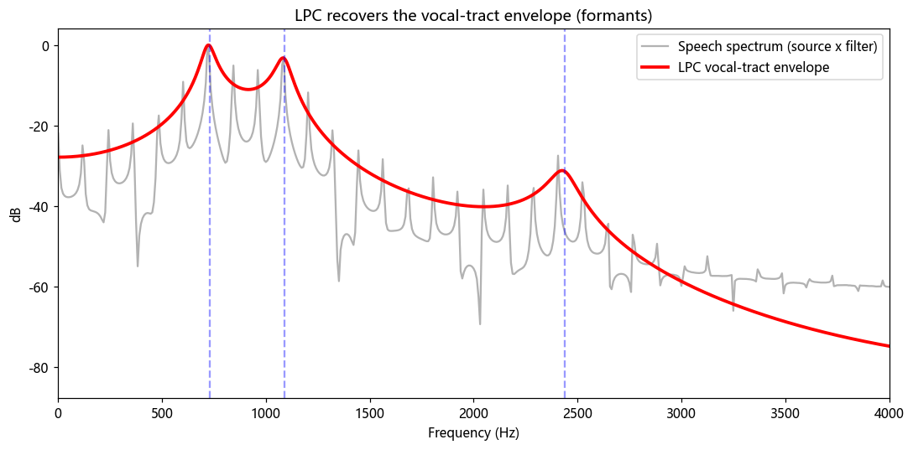

# 第 16 篇｜源-滤波器模型与 LPC：人是怎么"造"出声音的

> 一句话核心直觉：说话 = 声带产生"嗡嗡"的激励源 + 口腔舌头这个"可变形滤波器"给它塑形。把这两件事**分开**，就是几乎所有语音算法的世界观起点。

---

## 一、先别看公式，把手放在喉咙上

现在做个实验。把手指按在喉结上，先长长地念一个 "啊——"，再念一个 "咦——"。

你会发现两件事：

- 喉咙的**振动感几乎一样**——嗡嗡的，频率也差不多。
- 但**听起来完全不同**。"啊"是敞亮的，"咦"是扁扁的、靠前的。

再做第二个实验：念 "啊——" 的同时，慢慢把嘴从张大变成撅起。你没有动喉咙，声音却从 "啊" 滑向了 "呜"。

这两个实验合起来，就把人发声这件事的**全部机密**摊在你面前了：

- **有一个"声源"**：声带以某个基础频率周期性开合，把肺里的气流斩成一串脉冲，产生那个"嗡嗡"的原始嗓音。这个频率就是你嗓音的**基频 (Pitch, F0)**——男声约 100 Hz，女声约 200 Hz。
- **有一个"塑形器"**：从声带往上，咽腔、口腔、舌头、嘴唇构成一根**形状可变的管子**，叫**声道 (Vocal Tract)**。同一股嗡嗡声，穿过不同形状的管子，就被塑造成不同的元音。

**声源负责"音高"，声道负责"音色/内容"。** 你唱歌变调，动的是声源；你从"啊"念到"咦"，动的是声道。这两者是**解耦**的——这就是语音处理里分量最重的一个思想。

---

## 二、源-滤波器模型：把发声拆成两个盒子

上面这套直觉，正式的名字叫**源-滤波器模型 (Source-Filter Model)**。它说：

```
        激励源 e[n]            声道滤波器 h[n]
   ┌──────────────────┐    ┌──────────────────┐
   │ 声带产生的脉冲串  │──▶│ 口腔/舌头塑形    │──▶  语音 s[n]
   │ (决定音高 F0)     │    │ (决定元音/音色)  │
   └──────────────────┘    └──────────────────┘
```

用第 5 篇的语言，这个"塑形"过程正是一次**卷积**：

$$s[n] = e[n] * h[n]$$

- $e[n]$ 是**激励 (excitation)**。发浊音（元音、m/n 这类）时，它是一串以基频 F0 为周期的脉冲；发清音（s、f、这类摩擦音）时，声带不振动，它退化成**类似噪声**的乱流。
- $h[n]$ 是**声道的冲激响应**——没错，就是第 5 篇那个 $h$。你的口腔此刻就是一个 LTI 系统，它对声带那串脉冲做卷积塑形。
- $s[n]$ 是最终从嘴唇辐射出来、被话筒录到的语音。

到这一步，第 5 篇埋的"冲激响应刻画一个系统"的种子，在人体上开花了：**你的口腔在每一个发音瞬间，就是一段冲激响应。** 我们要做的，是从录到的 $s[n]$ 里，把 $h[n]$ 反推出来。

---

## 三、共振峰：声道这根管子的"偏爱频率"

声道是一根管子，管子都有**共鸣频率**——就像你对着空瓶子吹气会得到一个固定音高，往瓶里灌点水音高就变。声道这根管子的几个共鸣峰，在语音里叫**共振峰 (Formant)**，按频率从低到高记作 F1、F2、F3……

关键认知：**决定你听到的是哪个元音的，不是基频 F0，而是前两三个共振峰 F1、F2 的位置。**

- 张大嘴（"啊"）：F1 高。
- 舌头前顶、嘴扁（"咦"）：F1 低、F2 很高。
- 撅嘴（"呜"）：F1 低、F2 也低。

这解释了第一节的实验：你男声念 "啊" 和女声念 "啊"，F0 差一倍（音高不同），但 F1/F2 落在相近区域，所以大家都听成 "啊"。**语音识别要认的是内容（共振峰/声道形状），不是音高（基频）**——所以它天然想把声道那部分单独拎出来。这个"拎出来"的需求，就是下一篇倒谱要解决的核心任务，先记住这个钩子。

从频谱上看，这幅图长这样：

- 一把密集、等间距的**竖线**——间距等于基频 F0，这是激励源的印记（周期脉冲的频谱就是等间距谱线）。
- 一条起伏平滑的**包络**罩在这些竖线头顶——它的几个鼓包就是共振峰，这是声道滤波器的印记。

**竖线（源）×包络（滤波器）= 语音频谱。** 我们的目标：只要那条包络。

---

## 四、LPC：不测量口腔，也能猜出它的形状

现在是硬核需求：录音里我只有 $s[n]$，怎么估出声道滤波器 $h[n]$（也就是那条包络）？

总不能让说话人吞个探头进去量口腔。于是有了一个绝妙的思路——**线性预测 (Linear Prediction, LPC)**。

它的出发点是一个朴素观察：**语音波形是"惯性"很强的信号，此刻的采样值，很大程度上能被前面几个采样值线性组合预测出来。** 为什么？因为声道是个共鸣腔，共鸣意味着能量在腔里来回反射、缓慢衰减，波形不会突变——当前值和刚过去的值高度相关。

于是我们大胆假设：

$$\hat{s}[n] = a_1 s[n-1] + a_2 s[n-2] + \cdots + a_p s[n-p]$$

用前 $p$ 个样本（$p$ 通常取 10~16）去预测当前样本。预测得越准，说明这组系数 $a_k$ 越贴合声道的共鸣特性。我们让**预测误差**

$$e[n] = s[n] - \hat{s}[n]$$

在整帧上能量最小，解出来的那组 $\{a_k\}$，就定义了一个滤波器——它正是声道滤波器 $h[n]$ 的估计。

这里有个漂亮的收尾，正好呼应源-滤波器模型：

- 那组系数 $a_k$ 构成的滤波器 $H(z) = \dfrac{1}{1 - \sum_k a_k z^{-k}}$，就是**声道**（一个全极点滤波器，极点对应共振峰的鼓包，天然适合描述共鸣）。
- 而预测残差 $e[n]$——预测器"猜不到"的那部分——恰恰就是**激励源**！浊音时它是规整的脉冲串（脉冲正是最难预测的突变），清音时它是噪声。

**LPC 一箭双雕：系数 $a_k$ 给你声道，残差 $e[n]$ 给你声源。** 一次最小二乘，就把源和滤波器分开了。这就是早年数字语音编码（GSM 手机语音、G.729）的地基——传输时只传几个 LPC 系数加上激励参数，几十倍地压缩了码率，接收端再"源 × 滤波器"重新合成出来。

---

## 五、代码实战：从一段元音里挖出共振峰

光说不练假把式。我们合成一个 "啊" 元音（自己造源和滤波器，这样有标准答案可对照），再用 LPC 反推声道包络，看它能不能把共振峰找回来。

```python
import numpy as np
import matplotlib.pyplot as plt
from scipy.signal import lfilter, freqz

fs = 16000  # 采样率 16 kHz

# ---------- 1. 造"激励源"：基频 120Hz 的脉冲串(模拟声带开合) ----------
dur = 0.5
N = int(fs * dur)
f0 = 120
excitation = np.zeros(N)
period = int(fs / f0)
excitation[::period] = 1.0          # 每隔一个基音周期一个脉冲

# ---------- 2. 造"声道滤波器"：放几个共振峰(全极点) ----------
# 用一对共轭极点制造一个共振峰: 频率 f, 带宽 bw
def formant_filter(f, bw, fs):
    r = np.exp(-np.pi * bw / fs)
    theta = 2 * np.pi * f / fs
    a = [1, -2 * r * np.cos(theta), r * r]   # 分母(极点)
    return a

# 典型"啊"元音的共振峰: F1~730, F2~1090, F3~2440 Hz
a_all = [1.0]
for f, bw in [(730, 80), (1090, 90), (2440, 120)]:
    a_all = np.convolve(a_all, formant_filter(f, bw, fs))

# ---------- 3. 源 * 滤波器 = 合成语音 ----------
speech = lfilter([1.0], a_all, excitation)
speech += 0.001 * np.random.randn(N)         # 一点点本底噪声

# ---------- 4. 用 LPC 从合成语音里反推声道 ----------
def lpc(x, order):
    # 自相关法解 Yule-Walker 方程
    x = x * np.hamming(len(x))
    r = np.correlate(x, x, 'full')[len(x)-1:]
    R = r[:order+1]
    # Levinson-Durbin 递推
    a = np.zeros(order + 1); a[0] = 1.0
    e = R[0]
    for i in range(1, order + 1):
        k = -(a[:i] @ R[i:0:-1]) / e
        a[:i+1] += k * a[i::-1]
        e *= (1 - k * k)
    return a

order = 12
a_lpc = lpc(speech, order)

# ---------- 5. 画: 语音频谱 vs LPC 估计的声道包络 ----------
w, h_lpc = freqz([np.sqrt(np.abs(a_all[0]))], a_lpc, worN=2048, fs=fs)
S = np.abs(np.fft.rfft(speech * np.hamming(N), n=2048))
freqs = np.fft.rfftfreq(2048, 1/fs)

plt.figure(figsize=(10, 5))
plt.plot(freqs, 20*np.log10(S/S.max() + 1e-6),
         color='gray', alpha=0.6, label='Speech spectrum (source x filter)')
plt.plot(w, 20*np.log10(np.abs(h_lpc)/np.abs(h_lpc).max() + 1e-6),
         'r', lw=2.5, label='LPC vocal-tract envelope')
for f in [730, 1090, 2440]:
    plt.axvline(f, ls='--', color='b', alpha=0.4)
plt.xlim(0, 4000); plt.xlabel('Frequency (Hz)'); plt.ylabel('dB')
plt.title('LPC recovers the vocal-tract envelope (formants)')
plt.legend(); plt.tight_layout(); plt.show()
```

跑完你会看到：灰色的语音频谱上布满了间距 120 Hz 的**竖线毛刺**（激励源的印记），而**红色的 LPC 曲线像一条光滑的绸带压在毛刺头顶**，它的三个鼓包精准地落在蓝色虚线（我们埋进去的 730/1090/2440 Hz）上。



**LPC 做到的事，一句话说清：它无视源的毛刺，只把声道那条包络拟合出来了。** 只要把这条曲线的鼓包位置（共振峰）挪一挪，你就在做**元音转换**；把激励源的 F0 换掉，你就在做**变声**（保持内容不变、改音高）。声源变声、声道变元音——第一节手放喉咙上的两个实验，现在成了两行代码里可以分别拨动的旋钮。

---

## 六、这在语音工程里到底解决了什么问题

| 技术 | 背后就是源-滤波器 / LPC |
|------|------------------------|
| **低码率语音编码**（GSM、G.729、早期 VoIP） | 只传 LPC 系数 + 激励参数，接收端重新合成，码率降到几 kbps |
| **共振峰合成 / TTS 前身** | 直接设定 F0（源）和 F1~F3（声道）就能"画"出一个元音 |
| **变声器 / 变调不变速** | 改激励 F0 不动声道系数 → 音高变、音色内容不变 |
| **元音识别的老派前端** | 用共振峰位置区分 a/e/i/o/u |
| **声码器 (Vocoder)** | 现代神经声码器仍沿用"激励 + 声道"的解耦框架 |

> **一句话记住**：只要你面对的是人声，脑子里就该自动浮现"一个嗡嗡的源 × 一个塑形的声道"这幅画面。几乎所有语音算法，第一步都在琢磨怎么把这两者分开处理。

---

## 七、埋一个钩子：LPC 之外，还有更通用的分离术

LPC 很强，但它有个前提假设：声道是个**全极点**系统。这对元音很准，对鼻音、摩擦音就没那么贴了。而且它给的是一组滤波器系数，不是一个能直接喂给机器学习模型的、维度固定又"好看"的特征向量。

于是问题升级了：**有没有一种更通用、不依赖发声模型假设的办法，把"等间距竖线的源"和"平滑包络的声道"干净利落地切开？**

有。而且思路刁钻得很——**对频谱再做一次"傅里叶变换"**。频谱上那把密集竖线是"快变化"，那条平滑包络是"慢变化"，再变换一次，快慢就分到两头去了。这个操作叫**倒谱 (Cepstrum)**，再套上模仿人耳的梅尔刻度，就得到了统治整个语音识别领域几十年的特征——**MFCC**。

这正是下一篇（第 17 篇）的主角。

---

## 本篇小结

- **源-滤波器模型**：说话 = 声带激励源（定音高 F0）× 声道滤波器（定元音/音色）。两者解耦，是语音处理的世界观基石。
- **共振峰 (Formant)**：声道这根管子的共鸣峰 F1/F2/F3，决定你听到的是哪个元音；与基频无关。
- **LPC（线性预测）**：用前几个样本预测当前样本，解出的系数就是声道滤波器估计，预测残差就是激励源——一次求和同时拿到源和滤波器。
- **频谱视角**：等间距竖线（源）× 平滑包络（声道）= 语音频谱；LPC 拟合的就是那条包络。
- **下一步**：用倒谱这个"对频谱再变换一次"的巧招，做更通用的源-声道分离，走向 MFCC。
