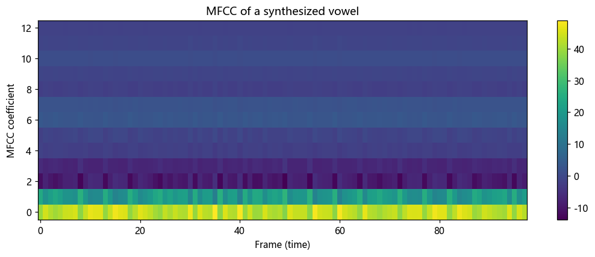

# 第 17 篇｜倒谱与 MFCC：语音识别用的"声音特征"

> 一句话核心直觉：想把激励源和声道滤波分开，就用倒谱这个"对频谱再做一次变换"的巧招——频谱上的密集竖线和平滑包络，会被这一下变换甩到两头去；再套上模仿人耳的梅尔刻度，就得到了几乎所有语音系统都在用的特征 MFCC。

---

## 一、上一篇留下的难题：怎么把"乘在一起"的东西掰开

第 16 篇我们看清了语音频谱的构造：

$$\text{语音频谱} = \underbrace{\text{等间距密集竖线}}_{\text{激励源，快变化}} \times \underbrace{\text{平滑起伏的包络}}_{\text{声道，慢变化}}$$

识别语音内容要的是那条**慢变化的包络**（共振峰藏在里头），而音高信息藏在**快变化的竖线间距**里。LPC 能拟合包络，但它绑定了"全极点声道"这个假设，也给不出一个规整的特征向量。

我们想要一个更通用的分离术。难点在于这两样东西是**乘**在一起的——在频谱这张图上，密集毛刺和平滑绸带纠缠在同一条曲线里，你没法用一把普通的剪刀把它们裁开。

有没有办法把"相乘"变成能分开的形式？有。这就是倒谱的第一招。

---

## 二、倒谱第一招：取对数，把"乘"变成"加"

小学就学过的一条性质，在这里成了关键武器：

$$\log(A \times B) = \log A + \log B$$

把语音频谱取对数，纠缠的乘积就变成了清清爽爽的**加法**：

$$\log|\text{语音频谱}| = \log|\text{源频谱}| + \log|\text{声道频谱}|$$

现在这两样东西是**叠加**关系了。而叠加的东西，只要它们"长得不一样"，就有希望分开。它们确实长得很不一样：

- $\log|\text{声道}|$：一条**平滑起伏**的曲线（几个宽鼓包，就是共振峰）——沿频率轴看，它变化**很慢**。
- $\log|\text{源}|$：一把**密集等间距的毛刺**，间距等于基频 F0——沿频率轴看，它变化**很快**。

看出门道了吗？在"对数频谱"这张图上，声道是**低频成分**，源是**高频成分**——注意，这里的"频率"不是声音的频率，而是"沿着频率轴起伏的快慢"。

**既然是快慢不同的成分叠加在一起，那把这条曲线本身当成一个"信号"，再做一次傅里叶（或余弦）变换，就能按快慢把它们分到两头去。** 这就是倒谱的第二招。

---

## 三、倒谱第二招：对频谱再变换一次

把上面那条对数频谱曲线，当作一段普通信号，再送进一次傅里叶变换（实际常用离散余弦变换 DCT）。得到的结果所在的域，既不是时域也不是频域，人们半开玩笑地把 "spectrum" 的前四个字母倒过来，叫它 **cepstrum（倒谱）**，横轴单位叫 **quefrency（倒频率）**，单位仍是**秒**。

结果如我们所料，干净利落地分成了两块：

```
   倒谱幅度
     │
     │ █                         ← 低倒频率区: 声道包络(慢变化)
     │ ██                          → 前十几个系数就够了
     │ █ █
     │ █  ▁ ▁ ▁ ▁ ▁      █      ← 高倒频率区: 一根尖峰
     └─────────────────┴────────    尖峰位置 = 基音周期 = 1/F0
       低 quefrency        高 quefrency (秒)
```

- **低倒频率区**（靠近 0 秒的那一小段）：装的是**声道包络**。前十几个倒谱系数就概括了共振峰结构——这正是识别内容要的东西。
- **高倒频率区**：会冒出**一根孤立的尖峰**，它的位置恰好等于基音周期（比如 F0=120 Hz，尖峰就在 1/120 ≈ 8.3 ms 处）。**这根尖峰直接把基频告诉了你**——所以倒谱也是经典的基频提取（音高检测）方法。

**只取低倒频率那十几个系数、扔掉高倒频率**，等于把源的信息干脆丢弃、只留下声道——这一步动作有个专门的词叫 **liftering**（把 "filtering" 的 filter 也倒过来拼）。至此，源和声道被真正分开了，而且不需要 LPC 那样的发声模型假设。第 16 篇结尾埋的钩子，到这里兑现了。

---

## 四、给倒谱装上"人耳"：梅尔刻度

倒谱已经能分离源和声道了，但要做**语音识别**，还差一步：让它更像人耳听到的东西。因为最终是人在说、模型在模拟人的听辨，特征越贴近听觉，越好用。

人耳有一个众所周知的特性：**对低频敏感、对高频迟钝，且不是线性的**。

- 200 Hz 和 400 Hz，你一耳朵就听出差了一倍，音程感很明显。
- 8000 Hz 和 8200 Hz，同样差 200 Hz，你几乎听不出区别。

也就是说，人耳的频率分辨率是"低频密、高频疏"。为了模拟它，人们定义了一把非线性的尺子——**梅尔刻度 (Mel scale)**：在低频区刻度密、高频区刻度疏，让"相等的梅尔间隔"对应"相等的听觉音高差"。

工程上落地为一组**梅尔滤波器组 (Mel filterbank)**：在频谱上摆一排三角形窗，低频处三角形又窄又密，高频处又宽又疏。用这排三角窗去"扫"频谱，每个三角窗输出一个能量值——就把成百上千根频率 bin，压缩成了二三十个符合人耳感知的能量值。

这一步顺带还解决了一个工程麻烦：原始频谱维度太高、且相邻 bin 高度相关，直接喂模型又冗余又占算力；梅尔滤波器组把它降到二三十维，紧凑又贴合听觉。

---

## 五、MFCC 全流程：把前面所有招式串起来

现在把倒谱和梅尔刻度合体，就得到了统治语音领域几十年的特征——**MFCC (Mel-Frequency Cepstral Coefficients，梅尔频率倒谱系数)**。整条流水线，每一步都是我们前面篇章的积木：

```
语音帧
  │  ① 分帧 + 加窗 (第 6/9 篇: 短时平稳、减少频谱泄漏)
  ▼
  │  ② FFT → 取幅度谱 (第 6~8 篇: 时域→频域)
  ▼
  │  ③ 过梅尔滤波器组 (本篇: 模仿人耳，降到 ~26 维能量)
  ▼
  │  ④ 取对数 (本篇: 把"源×声道"变成"源+声道")
  ▼
  │  ⑤ DCT (本篇: 对频谱再变换一次 = 倒谱，源/声道分到两头)
  ▼
  │  ⑥ 取前 12~13 个系数 (liftering: 只留声道，扔掉源)
  ▼
每帧 12~13 维 MFCC 特征向量
```

为什么语音识别、说话人识别都爱用它？因为它一次性满足了两个看似矛盾的需求：

- **语音识别**要认**内容**、忽略音高——MFCC 恰好扔掉了源（音高），只留声道（内容）。
- **紧凑好训练**——每帧十几维，比几百维的原始频谱好喂给 GMM-HMM、乃至早期神经网络太多。

顺带一提：说话人识别其实更在意声道的**个体差异**（每个人口腔形状不同，共振峰有个人印记），而它同样活在低倒频率区，所以 MFCC 一样好用——只是下游模型的用法不同。

---

## 六、代码实战：从一段语音提取 MFCC

我们不调现成的 `librosa.mfcc`，而是**从零手写**整条流水线，让上面每一步都变成能跑、能看的代码。

```python
import numpy as np
import matplotlib.pyplot as plt
from scipy.fftpack import dct

fs = 16000

# ---------- 0. 造一段测试语音: 基频120Hz + 三个共振峰的元音 ----------
from scipy.signal import lfilter
N = fs  # 1 秒
exc = np.zeros(N); exc[::int(fs/120)] = 1.0          # 源: 120Hz脉冲串
a = [1.0]
for f, bw in [(730, 80), (1090, 90), (2440, 120)]:   # 声道: "啊"的共振峰
    r = np.exp(-np.pi*bw/fs); th = 2*np.pi*f/fs
    a = np.convolve(a, [1, -2*r*np.cos(th), r*r])
sig = lfilter([1.0], a, exc)
sig += 0.001*np.random.randn(N)

# ---------- Mel 刻度换算 ----------
def hz2mel(f): return 2595*np.log10(1+f/700)
def mel2hz(m): return 700*(10**(m/2595)-1)

# ---------- 构造梅尔滤波器组 ----------
def mel_filterbank(n_filters, nfft, fs, fmin=0, fmax=None):
    fmax = fmax or fs/2
    mel_pts = np.linspace(hz2mel(fmin), hz2mel(fmax), n_filters+2)
    hz_pts = mel2hz(mel_pts)
    bins = np.floor((nfft+1)*hz_pts/fs).astype(int)
    fb = np.zeros((n_filters, nfft//2+1))
    for i in range(1, n_filters+1):
        l, c, r = bins[i-1], bins[i], bins[i+1]
        for k in range(l, c): fb[i-1, k] = (k-l)/(c-l+1e-9)      # 上升边
        for k in range(c, r): fb[i-1, k] = (r-k)/(r-c+1e-9)      # 下降边
    return fb

# ---------- MFCC 主流程 ----------
def extract_mfcc(sig, fs, frame_ms=25, hop_ms=10,
                 n_filters=26, n_mfcc=13, nfft=512):
    flen, hop = int(fs*frame_ms/1000), int(fs*hop_ms/1000)
    win = np.hamming(flen)
    fb = mel_filterbank(n_filters, nfft, fs)
    feats = []
    for start in range(0, len(sig)-flen, hop):
        frame = sig[start:start+flen] * win          # ① 分帧+加窗
        spec = np.abs(np.fft.rfft(frame, nfft))**2   # ② FFT 功率谱
        mel_e = fb @ spec                             # ③ 过梅尔滤波器组
        log_e = np.log(mel_e + 1e-10)                 # ④ 取对数
        c = dct(log_e, type=2, norm='ortho')          # ⑤ DCT = 倒谱
        feats.append(c[:n_mfcc])                      # ⑥ 取前13维
    return np.array(feats).T

mfcc = extract_mfcc(sig, fs)
print("MFCC 特征矩阵形状 (系数, 帧数):", mfcc.shape)

plt.figure(figsize=(10, 4))
plt.imshow(mfcc, aspect='auto', origin='lower', cmap='viridis')
plt.xlabel('Frame (time)'); plt.ylabel('MFCC coefficient')
plt.title('MFCC of a synthesized vowel'); plt.colorbar()
plt.tight_layout(); plt.show()
```

跑完你会得到一个 `(13, 帧数)` 的矩阵——**每一列就是那一帧语音浓缩成的 13 个数字**。因为我们造的是一个稳定不变的元音，你会看到各行的颜色沿时间轴基本恒定（内容没变）。真实语音里，当说话人从一个音过渡到下一个音，这张图的纹理就会随之流动——那就是语音识别模型真正"读"的东西。



> **想验证它抓住了内容而非音高**：把源那行的 `fs/120` 改成 `fs/200`（把男声换成女声，只动基频），保持共振峰不变，重新提取。你会发现 **MFCC 几乎不变**——这就是"扔掉源、只留声道"的威力，也正是语音识别想要的不变性。

---

## 七、这在语音工程里到底解决了什么问题

| 场景 | MFCC 的角色 |
|------|------------|
| **语音识别 (ASR)** | GMM-HMM 时代到早期 DNN，MFCC 是标准输入前端 |
| **说话人识别 / 声纹** | 提取声道个体特征，做 i-vector、GMM-UBM |
| **关键词唤醒 (KWS)** | 低算力设备上，MFCC + 小模型是经典方案 |
| **情感 / 语种识别** | MFCC 常与基频、能量等特征拼接使用 |
| **音频事件检测** | 非语音音频（如环境声分类）也常借用 MFCC |

> **一句话记住**：MFCC = "对频谱取对数后再变换一次（倒谱，分开源与声道）+ 一把模仿人耳的梅尔尺子"。它把一帧语音压成十几个数，既扔掉了无关的音高、又贴合人耳感知——这就是它几十年长盛不衰的原因。

---

## 八、埋一个钩子：从"手工特征"到"让模型自己学特征"

MFCC 无疑是聪明的手工设计。但现代深度学习语音系统里，你会发现越来越多的模型**直接吃梅尔频谱（Mel-spectrogram），甚至吃原始波形**，把最后那步 DCT 省掉——因为神经网络自己能学到比 DCT 更好的"分离与压缩"方式。

这不是说前面这些白学了，恰恰相反：**梅尔频谱正是 MFCC 流水线砍掉最后两步（DCT + liftering）的产物**。你只有真正理解了分帧、加窗、FFT、梅尔滤波这些积木，才能读懂现代模型的输入到底是什么、为什么长那样。

下一篇是全系列的收官之作：我们把前 17 篇的积木——分帧、加窗、FFT、频域处理、特征提取——亲手拼成一条真实可跑的**迷你语音处理 Pipeline**，处理一段带噪语音，并看清这套框架是如何一路延伸到今天的深度学习语音算法的。

---

## 本篇小结

- **核心难题**：语音频谱是"源（密集竖线）× 声道（平滑包络）"，两者相乘纠缠，难以分开。
- **倒谱第一招**：取对数，把"乘"变"加"——源和声道成为可分离的叠加成分。
- **倒谱第二招**：对对数频谱再做一次变换（DCT）——慢变化的声道跑到低倒频率、快变化的源跑到高倒频率，一根尖峰还顺带告诉你基频 F0。
- **梅尔刻度**：一把"低频密、高频疏"的尺子，模仿人耳分辨率，也顺便把频谱降维。
- **MFCC**：分帧 → 加窗 → FFT → 梅尔滤波器组 → 取对数 → DCT → 取前 13 维。扔掉音高、只留内容，紧凑又贴合听觉。
- **下一步**：把全系列积木拼成迷你 Pipeline，处理真实带噪语音，并承接到深度学习。
