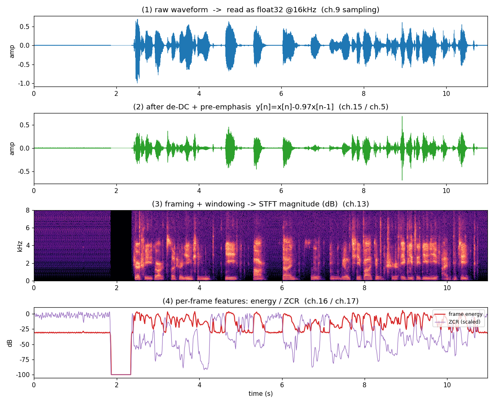
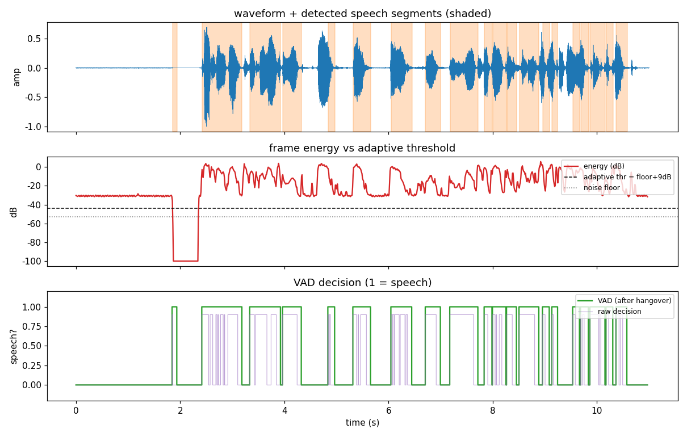

# 第 18 篇｜综合实战：亲手搭一条能跑的迷你语音 Pipeline

> 一句话核心直觉：前面十七篇造的每一块积木——采样、预加重、分帧加窗、FFT、频谱、MFCC——从来不是孤立的知识点。这一篇不讲新概念，只做一件事：把它们**串成一条真正能跑的流水线**，用它处理工作目录里那段真实录音 `Test-voice.wav`，判断出"哪几秒有人在说话"。当这条链在你手里从头跑通，你就从"会算每一块"跨进了"会拼一整个系统"。

---

## 一、收官之前，先把整张地图铺开

这是本系列语音实战模块的收官篇。走到这里，你手上其实已经攒齐了做一个语音前端所需的全部零件。问题从来不在"缺哪块积木"，而在**没人告诉你这些积木怎么咬合成一台机器**——教材把采样、卷积、傅里叶、滤波器、特征各讲一章，讲完就散了，你合上书，脑子里是一地零件，不是一条产线。

这一篇就是来收这个尾的。我们先把零件全摆到一张桌子上，看清每块是干什么的、出自哪一篇：

| 篇号 | 积木 | 在 Pipeline 里干的活 |
|------|------|---------------------|
| 第 9 篇 | 采样定理 | 把连续声波变成一串能计算的 `float32`，定死频率天花板 |
| 第 5 篇 | 卷积 / 差分 | 预加重那个 `[1, -0.97]` 就是一次两抽头卷积 |
| 第 15 篇 | 数字滤波器设计 | 预加重、去隆隆声这类一阶滤波的系数从哪来 |
| 第 13 篇 | FFT 与 STFT | 分帧、加窗、把每帧变成频谱 |
| 第 16 篇 | 源-滤波器模型 | 理解能量/共振峰为什么能区分语音和噪声 |
| 第 17 篇 | 倒谱与 MFCC | 把一帧语音浓缩成识别用的紧凑特征 |
| 第 19 篇 | 自适应滤波 / AEC | 真实设备上，麦克风里混进了扬声器自己的声音怎么办 |

> **关键认知**：这一篇不再教你任何新公式。它的全部价值在于**装配**——把散落在前十七篇里的运算，按真实系统的顺序接成一条链，让你亲眼看到"这些数学到底怎么拼成一个能跑的东西"。

### 18.1 一条真实语音前端，几乎永远是这套骨架

不管你打开的是 WebRTC、Kaldi 的特征提取代码，还是某个唤醒词 SDK，最前端那几道工序惊人地一致：

```
麦克风 / 一段 wav
   │
   ▼  ① 采样成 float 数组       (第 9 篇：奈奎斯特，别让高频折返)
   ▼  ② 去直流 + 预加重          (第 15 / 5 篇：一阶高通，抬中高频)
   ▼  ③ 分帧 + 加窗              (第 13 / 9 篇：语音只在 20~30ms 内近似平稳)
   ▼  ④ 每帧 FFT → 幅度谱        (第 13 篇：进频域)
   ▼  ⑤ 逐帧算特征              (能量 / 过零率 / MFCC，第 16 / 17 篇)
   ▼  ⑥ 下游任务：判决 / 识别 / 增强
   ▼
结果（VAD 标签 / MFCC 序列 / 干净语音）
```

前五步是**公用地基**——几乎所有语音任务都长在它上面。真正决定"你在做什么"的是第 ⑥ 步：填 VAD 就是端点检测，填分类器就是唤醒词，填神经网络就是 ASR，填谱减/维纳就是降噪。

本篇把第 ⑥ 步锁定为一个**具体、可跑、有据可查**的任务：**语音活动检测（VAD, Voice Activity Detection）**，也叫端点检测。为什么选它？

- 它是**几乎每个语音系统的第一道工序**：ASR 不想把静音和喘气送进模型浪费算力；录音软件要自动裁掉首尾空白；实时通话要在你不说话时省带宽；唤醒词要先知道"有人在说话"才值得往下算。
- 它**只用前五步的产物**（能量、过零率、频谱），不需要额外的大模型，正好把整条地基串一遍。
- 它的判决结果**看得见**——一条方波叠在波形上，对错一目了然，适合验证整条链真的通了。

下面我们就顺着这条骨架，从一个样本进入麦克风开始，一级一级往下走，每一级都标清它出自哪一篇。走完你会发现：所谓"搭 pipeline"，不过是把你早就学会的运算，按正确的顺序、用对的缓冲区接起来而已。

---

## 二、第一级：把声音读进来，摆平采样率和直流

### 18.2 读文件、转单声道、重采样——奈奎斯特这一关先过

工作目录里的 `Test-voice.wav` 是一段 44.1 kHz、立体声、int16 的真实录音。第一级要做三件毫不起眼、却坑最多的事：

```python
import numpy as np
from scipy.io import wavfile
from scipy.signal import resample_poly

fs_raw, x_raw = wavfile.read("Test-voice.wav")   # 不用 soundfile/librosa，scipy 就够
if x_raw.ndim == 2:
    x_raw = x_raw.mean(axis=1)                    # 立体声 -> 单声道：两路平均
x_raw = x_raw.astype(np.float64) / 32768.0        # int16 -> float [-1, 1)

FS = 16000
x = resample_poly(x_raw, FS, fs_raw)              # 44100 -> 16000
```

三件事，三个第 9 篇的知识点在暗处把关：

1. **int16 → float**：硬件送来的是 16 位整数（±32768），后面所有运算（加窗、FFT、取对数）都在浮点上做。除以 32768 归一到 `[-1,1)`，是为了后面阈值、`floor` 这些常数不必跟着采样位深变。这就是你在驱动层天天做的 PCM ↔ float 转换。
2. **立体声 → 单声道**：VAD 只关心"有没有人说话"，双声道信息用不上，两路一平均省一半算力。
3. **44.1k → 16k 重采样**：语音能量绝大部分在 8 kHz 以下，16 kHz 采样率（奈奎斯特频率 8 kHz）对语音任务足够，还能省 64% 的样本数。**但注意 `resample_poly` 而不是隔点抽取**——第 9 篇 7.2 节的红线：降采样前必须先低通，否则 8 kHz 以上的成分会**折返**成假的低频，自己给自己造混叠。`resample_poly` 内部就是"先低通再抽"，替你把这一关过了。

> **关键认知**：Pipeline 的第一级不是"读个文件"这么简单。采样率、声道、位深三者只要有一个和下游假设对不上，后面每一步都会静默地算错——而且错得不报错。工程里排查语音 bug，**第一件事永远是打印 `fs` 和 `shape`**。

### 18.3 去直流与预加重：两次一阶滤波，一次两抽头卷积

拿到干净的 float 数组，还不能直接分帧。语音信号进 FFT 之前，有两道近乎标配的预处理：

```python
def preemphasis(sig, a=0.97):
    """预加重：y[n] = x[n] - a*x[n-1]，一阶高通。"""
    return np.append(sig[0], sig[1:] - a * sig[:-1])

x_dc = x - np.mean(x)          # ① 去直流：减掉均值
x_pe = preemphasis(x_dc, 0.97) # ② 预加重
```

**① 去直流（DC removal）**。麦克风/ADC 常带一个微小的直流偏移——整段波形没有围绕 0 上下摆，而是整体抬高了一点点。这个 0 Hz 分量对听觉毫无意义，却会在 FFT 里变成 $X[0]$ 处一根巨大的尖峰（第 12 篇 code 里那行 `seg - seg.mean()` 就是防它），还会白占动态范围。减掉均值，或用一个截止频率极低的高通（第 14 篇提到的"一极点 DC 阻断"），都能干掉它。

**② 预加重（pre-emphasis）**。这就是第 5 篇讲过的那组"极短系数"$[1, -0.97]$——一次**两抽头卷积**，也是第 15 篇眼里一个最简单的一阶 FIR 高通。它把公式

$$y[n] = x[n] - 0.97\,x[n-1]$$

作用在信号上，效果是**抬高中高频、压低低频**。为什么语音要这么做？回到第 16 篇的源-滤波器模型：声带激励的频谱天生就是**每倍频程往下滚 6 dB** 的（-6 dB/oct），高频能量本来就弱。预加重正好补上这个斜率，让共振峰在高频那几个（F2、F3）不至于被 F1 的强低频淹没，后面提特征、算过零率时高频线索才看得清。

> **关键认知**：预加重不是玄学参数。它是一次两抽头卷积（第 5 篇）、一个一阶 FIR 高通（第 15 篇），目的是**抵消声带激励天生的 -6 dB/oct 下滑**（第 16 篇）。三篇的知识点在这一行 `x[1:] - 0.97*x[:-1]` 里咬合。系数 0.97 不是死的，0.95~0.97 都常见，越接近 1 抬得越狠。

到这里，第一级完成：`x_pe` 是一段 16 kHz、去了直流、抬过高频的单声道 float 数组。它就是喂给分帧器的"食材"。

---

## 三、第二级：分帧加窗——因为语音"只在一瞬间是稳的"

### 18.4 为什么必须切成帧：短时平稳这个前提假设

整段录音有十几秒，你能不能对它做一次 FFT 就完事？不能，而且这是整条 pipeline 里**最重要的一个前提假设**，值得单独点破。

语音是**非平稳**信号——它的频率成分每时每刻都在变（"啊"和"斯"的频谱天差地别）。对整段做一次 FFT，得到的是"这十几秒里所有频率的大杂烩"，时间信息全糊没了，你根本不知道哪个共振峰属于哪个音。

但语音有个救命的性质：**在很短的一小段时间里（20~30 ms），发声器官来不及大幅移动，信号近似平稳**。这就是第 13 篇 STFT 的立身之本——**短时平稳假设**。于是策略变成：把长信号切成一帧一帧，每帧短到能当平稳信号处理，逐帧做 FFT。

```python
def frame_signal(sig, flen, hop):
    """把一维信号切成 (帧数, flen) 的二维数组。"""
    n = 1 + (len(sig) - flen) // hop
    idx = np.arange(flen)[None, :] + hop * np.arange(n)[:, None]
    return sig[idx]                       # 花式索引，一次切完，无 Python 循环

FLEN = int(FS * 0.025)    # 帧长 25 ms -> 400 样本 @16kHz
HOP  = int(FS * 0.010)    # 帧移 10 ms -> 160 样本
WIN  = np.hamming(FLEN)   # 汉明窗
frames = frame_signal(x_pe, FLEN, HOP)    # (帧数, 400)
```

这里两个数字是语音领域的**事实标准**，背后各有道理：

- **帧长 25 ms**：短到能满足短时平稳，又长到装得下几个基音周期（男声 F0≈120 Hz，一个周期 8 ms，25 ms 里有 3 个周期），FFT 的频率分辨率才够（第 13 篇 5.3 节：窗越长频率越准，但时间越糊——测不准原理逼出来的取舍）。
- **帧移 10 ms**：相邻帧**重叠 15 ms（60%）**。为什么要重叠？因为加窗会压低帧两端的样本（见下），不重叠的话帧边界的信息就丢了；重叠让每个样本都被某帧的中段覆盖到。10 ms 也顺带定死了 VAD 的**时间分辨率**——判决每 10 ms 出一个。

### 18.5 为什么要乘一个窗：截断的代价与汉明窗

`frames` 每一帧是从长信号里"硬切"出来的一段。直接对它做 FFT 会出事——第 13 篇 7.1 节讲透的**频谱泄漏**：硬切等于给信号乘了一个矩形窗，矩形窗的边缘是垂直的断崖，这个断崖在频域会拖出一大片旁瓣，把邻近频率糊成一团。

解决办法是乘一个**两端平滑收拢到接近 0** 的窗，让每帧首尾"温柔地淡入淡出"，消除断崖。汉明窗是语音里最常用的一个：

$$w[n] = 0.54 - 0.46\cos\!\left(\frac{2\pi n}{N-1}\right), \quad n = 0,1,\dots,N-1$$

加窗就是逐帧逐点相乘 `frames * WIN`。代价是帧两端的样本被压低、贡献变小——**这正是帧移要小于帧长、让帧重叠的另一半理由**：被这一帧压低的样本，会落在下一帧的中段被补回来。

> **关键认知**：分帧 + 加窗是一对不能拆的操作。分帧是为了满足短时平稳（第 13 篇），加窗是为了压住分帧带来的泄漏（第 13 篇 7.1），而帧重叠同时服务于"补回被窗压低的样本"和"提高时间分辨率"两件事。三者环环相扣，少一个都会在频谱上留下毛病。

### 18.6 每帧一次 FFT：进频域

帧切好、窗加上，第二级的最后一步是逐帧 FFT，把每帧从时域波形变成频谱：

```python
NFFT = 512                                    # >= FLEN(400)，补零到 2 的幂，FFT 快
S = np.fft.rfft(frames * WIN, n=NFFT, axis=1) # (帧数, 257) 复数矩阵
mag = np.abs(S)                               # 幅度谱
```

几个工程细节：

- `rfft` 而不是 `fft`：实数信号的频谱共轭对称，只需算一半（0~奈奎斯特），`rfft` 输出 `NFFT/2+1 = 257` 个复数点，省一半算力。
- `NFFT=512`：补零到 2 的幂，让 FFT 走第 13 篇的分治快路（$O(N\log N)$）。补零不增加真实分辨率，只是让频谱看起来更平滑、且长度对齐到 2 的幂。
- `axis=1`：一次对整个 `(帧数, 400)` 矩阵按行做 FFT，NumPy 向量化，比 Python 逐帧循环快一两个数量级。

`S` 这个 `(帧数, 257)` 的复数矩阵，就是这段录音的 **STFT**——每一列（原文习惯是行）是一帧的频谱，横着看是时间、竖着看是频率。它取模就是**语谱图**（第 13 篇），是下面所有特征的共同原料。

第一张图把前三级的信号流转画在了一起：原始波形 → 去直流+预加重后的波形 → STFT 语谱图 → 逐帧特征。你能清楚看到声音怎样一级一级被"翻译"成频域和特征：



---

## 四、第三级：逐帧算特征——用什么线索区分"人声"和"静音"

帧和频谱都有了，现在给每帧算几个数，作为"这帧像不像人声"的证据。VAD 用两个最经典、最便宜的特征。

### 18.7 短时能量：说话时波形大，能量高

最直接的线索：说话时声波振幅大、能量高；静音时能量低。一帧的短时能量就是帧内样本平方和：

$$E = \sum_{n=0}^{N-1} \big(x[n]\,w[n]\big)^2$$

```python
energy = np.sum((frames * WIN) ** 2, axis=1)
energy_db = 10 * np.log10(energy + 1e-10)     # 转 dB，动态范围压缩、便于定阈值
```

两个工程细节：乘上窗 `WIN` 再平方，和后面 FFT 用的是同一帧数据，能量口径一致；转成 **dB** 是因为语音动态范围极大（静音和爆破音差几个数量级），线性能量画出来看不清，取对数后各段落差变成几十 dB 的台阶，定阈值直观得多。`+1e-10` 是防 `log(0)` 的护栏——静音帧能量可能真的是 0。

但光看能量会被骗：**低频轰隆的空调声、关门声，能量也不低**，纯按能量判决会把它们误判成语音。所以要再来一个特征。

### 18.8 过零率：清音和噪声穿零频繁，浊音低

**过零率（Zero-Crossing Rate, ZCR）**——一帧波形每秒穿过零点（正负号翻转）的次数：

```python
zcr = np.mean(np.abs(np.diff(np.sign(frames), axis=1)) > 0, axis=1)
```

`np.sign` 把波形变成 ±1，`np.diff` 找相邻符号变化，非零处就是一次穿零。它为什么补能量的短板？回到第 16 篇的源-滤波器直觉：

- **浊音**（元音 a/o/u，声带振动）：能量集中在低频共振峰，波形起伏慢，**过零率低、能量高**。
- **清音**（摩擦音 s/f/sh，声带不振、气流摩擦）：能量铺在高频，波形抖得快，**过零率高、能量偏低**。
- **稳定噪声**（空调、白噪声）：往往能量不低但过零率也高，或频谱形状不像语音。

能量 + 过零率两个一配合，就能把"低频轰隆噪声（能量高但不是语音）"和"清音（能量低但确实是语音）"这两类能量特征骗不过去的情况都兜住，比单看能量稳得多。这也是 WebRTC VAD 早期版本的核心思路。

### 18.9 更进一步：MFCC——如果下游要做识别

VAD 用能量+过零率就够了。但如果第 ⑥ 步不是"判断有没有人说话"，而是"这是哪个词/哪个音"，就需要更有区分力的特征——这时接上第 17 篇的 **MFCC** 流水线。它其实就是在我们已经算好的 `mag`（幅度谱）后面，再接几步：

```python
from scipy.fftpack import dct

def hz2mel(f):  return 2595 * np.log10(1 + f / 700)
def mel2hz(m):  return 700 * (10 ** (m / 2595) - 1)

def mel_filterbank(n_filters, nfft, fs):
    mel_pts = np.linspace(hz2mel(0), hz2mel(fs / 2), n_filters + 2)
    bins = np.floor((nfft + 1) * mel2hz(mel_pts) / fs).astype(int)
    fb = np.zeros((n_filters, nfft // 2 + 1))
    for i in range(1, n_filters + 1):
        l, c, r = bins[i - 1], bins[i], bins[i + 1]
        for k in range(l, c): fb[i - 1, k] = (k - l) / (c - l + 1e-9)
        for k in range(c, r): fb[i - 1, k] = (r - k) / (r - c + 1e-9)
    return fb

def frames_to_mfcc(mag, fs, nfft=512, n_filters=26, n_mfcc=13):
    fb = mel_filterbank(n_filters, nfft, fs)     # ③ 梅尔滤波器组
    mel_e = mag ** 2 @ fb.T                       # 功率谱过梅尔滤波器组
    log_e = np.log(mel_e + 1e-10)                 # ④ 取对数
    c = dct(log_e, type=2, norm="ortho", axis=1)  # ⑤ DCT = 倒谱
    return c[:, :n_mfcc]                           # ⑥ 取前 13 维

mfcc = frames_to_mfcc(mag, FS)                    # (帧数, 13)
```

注意这段代码**直接复用了前三级的 `mag`**——分帧、加窗、FFT 一步没重做。这就是"公用地基"的意义：VAD 和 MFCC 共享同一套前处理，只在最后分叉。第 17 篇那六步（分帧→加窗→FFT→梅尔滤波→取对数→DCT），前三步早在第二级做完了，这里只补后三步。

> **关键认知**：能量、过零率、MFCC 都长在同一份 STFT 上——它们不是三条独立流水线，而是**同一份频域原料上抽取的不同投影**。VAD 抽两个廉价标量，识别抽 13 维 MFCC。上一步的产物是下一步的输入，这种"接力供料"正是真实系统的常态（第 16→17 篇：源-滤波器的解耦思想被倒谱接手做成 MFCC，也是同一种接力）。

---

## 五、第四级：VAD 判决——把特征变成"语音/非语音"标签

特征算完，只剩最后一步：给每帧贴标签。这一步看似简单（不就是拿特征跟阈值比大小吗），却藏着 VAD 从"玩具"到"能用"的全部功夫。

### 18.10 阈值不能硬编码：自适应估计噪声本底

第一反应是 `energy_db > -40` 这样定个死阈值。**千万别**——录音环境千变万化：安静房间本底 -80 dB，嘈杂街边 -50 dB，同一个死阈值换个环境就全错。能用的 VAD 必须**自适应**：先估计"这段录音的噪声本底在哪"，再把阈值定在本底之上一个固定余量。

一个稳健的估法：假设**能量最低的那批帧就是噪声**（静音/背景），取它们的平均当本底：

```python
sorted_e = np.sort(energy_db)
noise_floor = np.mean(sorted_e[: max(1, len(sorted_e) // 7)])  # 最低 ~15% 帧
thr = noise_floor + 9.0        # 阈值 = 本底 + 9 dB
zcr_gate = 0.35                # 过零率上限，滤掉高频噪声毛刺
raw_vad = (energy_db > thr) & (zcr < zcr_gate)
```

这里两个特征**同时**把关：能量要高出本底 9 dB，**且**过零率不能太高（滤掉那些能量够但抖得像噪声的帧）。比起原始版本只看能量，加上 `zcr_gate` 这一刀，才是能量+过零率协同判决的完整形态。

比起"前 20 帧一定是噪声"的假设，用"能量最低的 15% 帧"更稳——它不要求录音开头一定是静音，中间任何一段安静都能贡献本底估计。这是工程里常见的手法：**不假设噪声在哪，只假设噪声是能量分布里最低的那一撮**。

### 18.11 差一帧的坑：hangover 平滑，别把一句话切成碎片

逐帧硬判决有个通病：一个词内部，元音能量高、辅音和停顿能量低，raw 判决会在一个词里反复跳 0/1，把一句连贯的话切成一地碎片。真实 VAD 都会加一道 **hangover（挂起/迟滞）**：一旦判为语音，就"惯性"多保持几帧，短暂的能量低谷不切断。

```python
def hangover(dec, hang=8):
    """判为语音后惯性保持 hang 帧，填平词内短空隙。"""
    out = dec.copy()
    count = 0
    for i, d in enumerate(dec):
        if d:
            count = hang          # 命中语音，充满计数器
        elif count > 0:
            out[i] = True         # 空隙期内仍判语音
            count -= 1
    return out

vad = hangover(raw_vad, hang=8)   # 8 帧 = 80 ms 挂起
```

`hang=8` 即 80 ms——短于一次正常停顿、长于词内的辅音间隙，正好填平词内空隙又不会把两句话粘死。这个"差几帧"的调节，和第 5 篇卷积延迟线、第 13 篇 ring buffer 的对齐坑是同一类工程手感：**边界上多一帧少一帧，结果体验天差地别**。

### 18.12 把整条链跑通：处理真实的 Test-voice.wav

现在把第一到第四级全部接起来，处理工作目录里那段真实录音，输出语音段的时间区间。**这段代码不依赖任何前文变量，复制即可运行**：

```python
import numpy as np
from scipy.io import wavfile
from scipy.signal import resample_poly

# ===== 第一级：读入 + 预处理 =====
fs_raw, x_raw = wavfile.read("Test-voice.wav")
if x_raw.ndim == 2:
    x_raw = x_raw.mean(axis=1)
x_raw = x_raw.astype(np.float64) / 32768.0
FS = 16000
x = resample_poly(x_raw, FS, fs_raw)
x = x[int(13 * FS): int(24 * FS)]                 # 取"先静音后语音"的一段
x = x / (np.max(np.abs(x)) + 1e-12)
x = x - np.mean(x)                                # 去直流
x = np.append(x[0], x[1:] - 0.97 * x[:-1])        # 预加重

# ===== 第二级：分帧 + 加窗 =====
FLEN, HOP = int(FS * 0.025), int(FS * 0.010)
n = 1 + (len(x) - FLEN) // HOP
idx = np.arange(FLEN)[None, :] + HOP * np.arange(n)[:, None]
frames = x[idx]
win = np.hamming(FLEN)

# ===== 第三级：逐帧特征 =====
energy = np.sum((frames * win) ** 2, axis=1)
energy_db = 10 * np.log10(energy + 1e-10)
zcr = np.mean(np.abs(np.diff(np.sign(frames), axis=1)) > 0, axis=1)

# ===== 第四级：自适应阈值 + hangover =====
noise_floor = np.mean(np.sort(energy_db)[: max(1, n // 7)])
thr = noise_floor + 9.0
raw_vad = (energy_db > thr) & (zcr < 0.35)

def hangover(dec, hang=8):
    out, cnt = dec.copy(), 0
    for i, d in enumerate(dec):
        if d: cnt = hang
        elif cnt > 0: out[i] = True; cnt -= 1
    return out

vad = hangover(raw_vad, 8)

# ===== 输出语音段（帧 -> 秒）=====
tf = np.arange(n) * HOP / FS
segs, i = [], 0
while i < len(vad):
    if vad[i]:
        j = i
        while j < len(vad) and vad[j]: j += 1
        if j - i >= 5:                            # 丢弃 <50ms 的碎段
            segs.append((tf[i], tf[min(j, n - 1)]))
        i = j
    else:
        i += 1

print(f"帧数 {n}，判为语音 {vad.sum()} 帧（{100*vad.mean():.0f}%）")
print(f"检出 {len(segs)} 个语音段：")
for s0, s1 in segs[:8]:
    print(f"  {s0:5.2f}s ~ {s1:5.2f}s  （时长 {s1-s0:.2f}s）")
```

跑这段，你会看到本底之上的能量峰被准确圈成若干语音段，静音段被判为 0。第二张图把判决结果叠在波形和能量曲线上——语音段被橙色阴影框住，能量曲线跨过那条自适应虚线阈值的地方，正好是判决跳到 1 的地方；下面还叠了 raw 判决和 hangover 后判决的对比，你能直接看到 hangover 怎样填平了词内的锯齿：



真实产品级 VAD（WebRTC VAD、Silero VAD）会用更多特征、甚至神经网络，但**内核逻辑一步没变：分帧 → 逐帧算特征 → 自适应判决 → 平滑**。你手写的这个，就是它们的骨架。

---

## 六、工程骨架：离线跑通只是起点，实时才是真战场

上面那条 pipeline 是**离线**的——一次把整段 wav 读进内存、`np.sort` 全局能量估本底、`argmax` 随便回看。真实设备上做 VAD，几乎都是**实时/流式**的：麦克风每隔几毫秒扔来一小块样本，你必须**边收边判**，还不能引入太多延迟。这一节讲清这条链变成实时时，工程上到底要处理哪些事——这也是本篇作为"实战篇"的灵魂。

### 18.13 ring buffer 按帧喂数据：帧长、帧移与"攒够一个 hop"

声卡不会一次给你整段音频，而是每隔几毫秒经回调交来一小块（几十到几百个样本，即"回调块 / callback block"）。但你的 pipeline 要的是 25 ms 一帧、10 ms 一跳。回调块大小和帧/跳几乎从不相等，中间必须垫一个**环形缓冲（ring buffer）**——这正是第 5 篇卷积延迟线、第 13 篇 7.4 节 STFT 都用过的老朋友。

思路：维护一个长度 `FLEN` 的历史窗，新样本不断写入；**每攒够 `HOP` 个新样本，就取最近 `FLEN` 个样本（含与上一帧重叠的 `FLEN-HOP` 个旧样本）判决一次**。

```python
import numpy as np

class StreamingVAD:
    """实时 VAD：ring buffer 攒够一个 hop 就出一个判决。"""
    def __init__(self, fs=16000, flen_ms=25, hop_ms=10, hang=8):
        self.FLEN = int(fs * flen_ms / 1000)
        self.HOP  = int(fs * hop_ms / 1000)
        self.win  = np.hamming(self.FLEN)
        self.buf  = np.zeros(self.FLEN)     # 长度 FLEN 的历史窗
        self.filled = 0                     # 距下一帧还差多少新样本
        self.floor = None                   # 在线估计的噪声本底
        self.cnt = 0                        # hangover 计数器
        self.hang = hang

    def push(self, block):                  # 声卡送来的一小块样本
        out = []
        for s in block:
            self.buf = np.roll(self.buf, -1)      # 示意：左移腾尾（实际用环形指针免拷贝）
            self.buf[-1] = s
            self.filled += 1
            if self.filled >= self.HOP:           # 攒够一个 hop -> 判一帧
                self.filled = 0
                out.append(self._decide())
        return out

    def _decide(self):
        f = self.buf * self.win
        e_db = 10 * np.log10(np.sum(f ** 2) + 1e-10)
        zc = np.mean(np.abs(np.diff(np.sign(self.buf))) > 0)
        # 在线更新本底：非语音时用慢速指数平滑跟踪环境噪声
        if self.floor is None:
            self.floor = e_db
        speech = (e_db > self.floor + 9.0) and (zc < 0.35)
        if not speech:
            self.floor = 0.95 * self.floor + 0.05 * e_db   # 只在静音期更新，跟着环境漂
        if speech:
            self.cnt = self.hang
        elif self.cnt > 0:
            speech = True; self.cnt -= 1
        return speech
```

对比离线版，实时版有两处质变：

- **本底改成在线估计**：离线可以 `np.sort` 全局；实时看不到未来，只能用**指数平滑**在静音期慢慢跟踪本底，让它随环境（有人开了空调、走进嘈杂区）缓慢漂移。这是自适应系统能在真实环境活下去的关键。
- **hangover 变成状态机**：离线一次性扫全序列，实时只能维护一个计数器，逐帧推进。

> **驱动视角的坑**：ring buffer 读写指针差一格，整条判决就在时间轴上错位；回调块大小和 `HOP` 除不尽（回调 480 样本、`HOP` 160 除得尽，但换成 `HOP` 128 就除不尽）时，要么内部再缓冲、要么帧率会抖。这类"差一个样本 / 对不齐"的 bug，和第 5 篇延迟线、第 19 篇 AEC 的时间对齐坑是同一种病——**语音工程一半的诡异 bug 都是对齐问题**。

### 18.14 延迟预算：这条链让你晚听到多久

实时系统最硬的约束是**延迟（latency）**。VAD 判决"这一帧是语音"时，帧的最后一个样本已经进来了，但判决基于整个 25 ms 帧。累加起来，一次判决的固有延迟大致是：

$$T_{\text{delay}} \approx \underbrace{T_{\text{block}}}_{\text{凑够回调块}} + \underbrace{T_{\text{frame}}}_{\text{25ms 帧}} + \underbrace{T_{\text{hangover}}}_{\text{挂起 80ms}}$$

其中 hangover 是把双刃剑：它填平词内空隙、避免碎段，但也意味着语音**结束后要再等 80 ms 才判定"说完了"**。做实时通话、低延迟唤醒时，这 80 ms 要盯着——第 10 篇 code 注释里提过的同一句话：低延迟场合（AEC、监听）必须盯紧每一级引入的延迟。帧长、帧移、hangover 每一个都是延迟旋钮，调它们本质是在"判决稳"和"响应快"之间取舍。

### 18.15 各级成本：哪一步最贵，实时扛不扛得住

把这条链的每帧成本摊开看（`FLEN=400`, `NFFT=512`, 每 10 ms 一帧）：

| 级 | 每帧运算 | 量级 | 贵不贵 |
|----|---------|------|-------|
| 预加重 | 400 次乘加 | $O(N)$ | 极廉价 |
| 加窗 | 400 次乘 | $O(N)$ | 极廉价 |
| FFT | $512\log_2 512 ≈ 4600$ | $O(N\log N)$ | **最贵的一步** |
| 能量 / 过零率 | 各 ~400 次 | $O(N)$ | 极廉价 |
| 判决 + hangover | 几次比较 | $O(1)$ | 忽略不计 |

**FFT 是整条链最贵的一步**，但纯 VAD 其实用不到频谱——能量和过零率都能直接在时域算！所以极致省算力的 VAD（如 MCU 上的唤醒前级）会**跳过 FFT**，只在时域算这两个特征，每帧成本压到近乎白送。只有下游要 MFCC/识别时才值得付 FFT 这笔钱。这解释了为什么低功耗设备普遍是"时域轻量 VAD 先把关 → 判为语音才唤醒重的 FFT+神经网络"的两级架构：**把最贵的一步挡在门后，只在真有人说话时才付费**。

### 18.16 定点还是浮点：MCU 上绕不开的一问

我们全程用 `float64`，PC 上无所谓。但很多 VAD 跑在**没有 FPU 的定点 DSP / MCU** 上，这时几个坑要认：

- **能量平方和会溢出**：`int16` 平方就是 `int32` 量级，400 个一加轻松爆 32 位，得用 `int64` 累加或右移定标（Q 格式）。
- **`log10` 很贵**：定点上没有硬件对数，常用查表或多项式近似替代；或者干脆比较线性能量、把阈值也放到线性域，绕开取对数。
- **归一化 headroom**：和第 5 篇卷积、第 15 篇 biquad 一样，中间量要留增益余量防削顶。

浮点省心、定点省电，选哪个取决于你的芯片——但**算法骨架完全一样**，变的只是数值表示。这也是为什么先在 PC 上用浮点把逻辑跑通、再移植到定点，是标准工作流。

---

## 七、等等，这条手写 pipeline 和工业级差在哪？

现在你手里有一条能跑的 VAD。但诚实地说——**它离产品级还有很远**，而说清"差在哪、为什么"，比多堆几个特征更有价值。

### 18.17 手写版会在哪些场景翻车

- **平稳噪声骗不倒它，非平稳噪声能**：能量+过零率对稳定的空调声有效（本底估得准），但对**突发噪声**（键盘声、关门、路上鸣笛）无能为力——那一下能量尖峰会被直接判成语音。我们的模型里没有任何"这不是人声的频谱形状"的判据。
- **低信噪比下本底和语音重叠**：嘈杂环境里，噪声能量和轻声说话的能量差不多，`+9 dB` 这条线两边都是混的，怎么调都顾此失彼。
- **阈值和 hangover 全靠手调**：换个设备、换个场景，`+9 dB`、`zcr<0.35`、`hang=8` 可能都要重调。这就是**手工特征 + 手工阈值**范式的根本天花板。

### 18.18 工业级怎么做：WebRTC / Silero / 端到端

- **WebRTC VAD**：仍是经典特征路线，但把频带分成多个子带、用**高斯混合模型（GMM）**分别对"语音/噪声"两类建模，比单一能量阈值稳得多。本质还是"分帧→特征→判决"，只是判决从"比大小"升级成"比两个概率模型谁更像"。
- **Silero VAD / 神经 VAD**：直接拿一个小神经网络吃特征（甚至吃原始波形或梅尔谱），**让模型从海量数据里学出"什么是人声"**，不再手工设阈值。它能扛突发噪声、低信噪比，代价是要训练数据、要推理算力。
- **端到端 ASR 里的隐式 VAD**：像 Whisper 这类模型，VAD 甚至不是独立一步——模型内部自己学会了"忽略静音"。

### 18.19 那传统特征流水线在端到端时代还有意义吗？

有，而且是决定性的。理由不是情怀，是三条实打实的：

1. **现代模型的输入还是它**。绝大多数语音大模型（ASR、TTS、声纹、增强）吃的仍是**梅尔谱 / MFCC**——正是第 17 篇、也是本篇第三级那条流水线的产物。第 17 篇说得很清楚：梅尔频谱就是 MFCC 砍掉最后两步（DCT + liftering）的产物。你今天亲手写的分帧、加窗、FFT、梅尔滤波，就是喂给 Transformer 的那份"食材"的做法。**不懂食材，读不懂模型输入的每一维意味着什么。**
2. **要先手写一遍，才诊断得了黑盒**。一个只会 `model.fit()` 的人，遇到"VAD 老是漏检句尾"时抓瞎；懂 hangover、懂延迟预算、懂本底估计的人，一眼知道该从哪查。**经典 pipeline 是你调通、定位现代模型的底层视力。**
3. **算力和成本约束下它仍是最优解**。MCU 唤醒前级、耳机降噪、超低功耗常开监听——这些场景养不起大模型，时域轻量 VAD 仍是唯一能实时跑的选择。18.15 那个"轻量 VAD 先把关、判为语音才唤醒重模型"的两级架构，至今是端侧语音的主流骨架。

> **关键认知**：教学要先手写一遍，不是因为手写版更好用，而是因为**你只有亲手把公式接成能跑的东西、亲眼看它在什么场景翻车，才真正理解现代模型在替你解决什么、以什么代价解决**。深度学习没有让这些知识过时，而是把它们变成了你读论文、调模型、定位 bug 的底层直觉。

---

## 八、三个角度回望整条链：同一件事的三个侧面

跟前面每一篇一样，我们从三个角度把这条 pipeline 再看一遍——它们不是三条链，是**同一条链的三个侧面**。

**物理角度：整条链在对声音做什么。** 它在做一件很朴素的事——**把连续的空气振动，逐级"看清楚"**。采样把振动变成数字；预加重补偿声带天生的高频衰减，让声音"亮"起来；分帧承认"人说话是变化的、只能一小段一小段看"；FFT 把每一小段拆成频率成分，看清是元音的低频共振峰还是清音的高频摩擦；能量和过零率则回答那个最原始的问题——"这一刻，到底有没有人在说话"。整条链就是把"一段空气抖动"翻译成"哪几秒有人说话"的过程。

**数学角度：每个模块背后那一个核心公式。** 不重新推导，只点名它们出自哪一篇：

| 模块 | 核心式子 | 出处 |
|------|---------|------|
| 采样 | $f_s > 2f_{\max}$（奈奎斯特） | 第 9 篇 |
| 预加重 | $y[n]=x[n]-0.97x[n-1]$（两抽头卷积） | 第 5 / 15 篇 |
| 分帧加窗 | $x[n]\,w[n]$，短时平稳 | 第 13 / 9 篇 |
| 每帧 FFT | $X[k]=\sum_n x[n]w[n]e^{-j2\pi kn/N}$ | 第 13 篇 |
| 短时能量 | $E=\sum_n (x[n]w[n])^2$ | 第 16 篇直觉 |
| MFCC | 幅度谱 → 梅尔 → log → DCT | 第 17 篇 |

每一行都是你在前面某一篇**推导过、跑过**的东西。pipeline 没引入任何新数学，它只是把这些式子按顺序串起来。

**工程角度：真正的实现与坑。** ring buffer 按帧喂数据、"攒够一个 hop 判一帧"的状态机、在线指数平滑估本底、hangover 填平词内碎段、延迟预算里那 80 ms、FFT 是最贵一步所以纯 VAD 干脆跳过它、定点上的溢出与 log 近似、以及那个贯穿全系列的"差一个样本"对齐坑。这些才是把"能算"变成"能用"的东西——**也是面试语音岗时，区分"背过公式"和"做过系统"的分水岭**。

> **关键认知**：物理、数学、工程不是三套知识，是同一条 pipeline 的三种读法。你能把任意一级同时用这三种语言讲清楚（它在对声音做什么、背后哪个公式、代码里怎么落地和会踩什么坑），才算真懂了这条链。

---

## 九、埋一个钩子：真实设备上，麦克风里混进了你自己的声音

我们这条 pipeline 有个悄悄成立的前提：**麦克风收到的，就是想处理的那个声音。** 离线处理一段干净录音时，这没问题。

但把它放进一台真实设备——智能音箱、视频会议、带通话的耳机——前提立刻崩了。设备一边用扬声器**放**对方的声音，一边用麦克风**收**你的声音。麦克风收进来的，不只是你说的话，还有**扬声器刚放出来、又被麦克风录回去的那部分**——这就是**回声（echo）**。对方会听到自己的话延迟一拍传回来，体验糟糕透顶。

你可能想：这不简单吗，从麦克风信号里减掉扬声器信号不就行了？——**没那么简单**。扬声器的声音传到麦克风，中间经过了房间的反射、衰减、延迟（正是第 5 篇那个"山洞回响"式的卷积！），传到麦克风时早已不是原样。你要减掉的，是"扬声器信号**卷积上一个未知、还随时在变的房间冲激响应**"之后的东西。这个冲激响应你没法预先测量——人一动、门一开，它就变了。

这就逼出了下一个工具：**自适应滤波器**。它不预先设计系数，而是**实时地、从数据里自己估计并追踪那个不断变化的回声路径**，边估边减。第 19 篇（加餐）就来解决这个真实设备上最难缠的问题——LMS/NLMS 怎么在线收敛、双讲（你和对方同时说话）时权重为什么会被踹飞、DTD 怎么救、以及驱动层那些"参考信号比麦克风晚几十毫秒""两个 ring buffer 时钟漂移"的时间对齐坑。

那一篇是这套信号处理直觉，在最挑剔的实时场景里的终极演练。

---

## 本篇小结

- **本篇不教新概念，只教装配**：把前十七篇的积木，按真实系统的顺序接成一条能跑的链，处理真实录音 `Test-voice.wav`，输出"哪几秒有人说话"。
- **公用地基五步**：采样成 float（第 9 篇）→ 去直流 + 预加重（第 15 / 5 / 16 篇）→ 分帧加窗（第 13 / 9 篇）→ 每帧 FFT（第 13 篇）→ 逐帧特征（第 16 / 17 篇）。几乎所有语音任务都长在这套地基上，只在最后一步分叉。
- **下游任务选 VAD**：短时能量 + 过零率两个廉价特征协同，自适应估噪声本底定阈值，hangover 平滑填平词内碎段。产品级 VAD 内核逻辑一致，只是特征更多、判决更强。
- **特征共享同一份 STFT**：能量、过零率、MFCC 都是同一份频域原料上的不同投影，上一步产物即下一步输入——真实系统的"接力供料"常态。
- **实时才是真战场**：ring buffer 按帧喂、"攒够一个 hop 判一帧"、在线本底估计、延迟预算（hangover 那 80 ms）、FFT 是最贵一步（纯 VAD 可跳过）、定点 vs 浮点、差一个样本的对齐坑。
- **诚实的边界**：手写版扛不住突发噪声和低信噪比，阈值全靠手调；WebRTC/Silero/端到端更强。但传统流水线没过时——现代模型的输入（梅尔谱/MFCC）、端侧算力约束、以及"调通/诊断黑盒的底层视力"都离不开它。
- **通向第 19 篇**：这条链假设"麦克风收到的就是想处理的声音"；真实设备上扬声器的声音会被麦克风录回成回声，且回声路径是未知且时变的卷积——这逼出自适应滤波器，下一篇（加餐）解决它。


