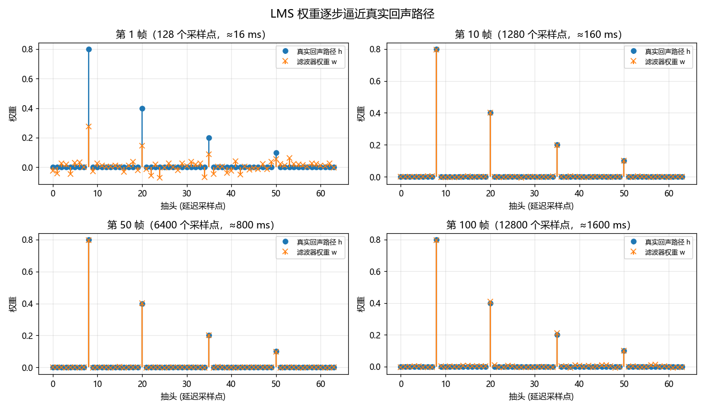
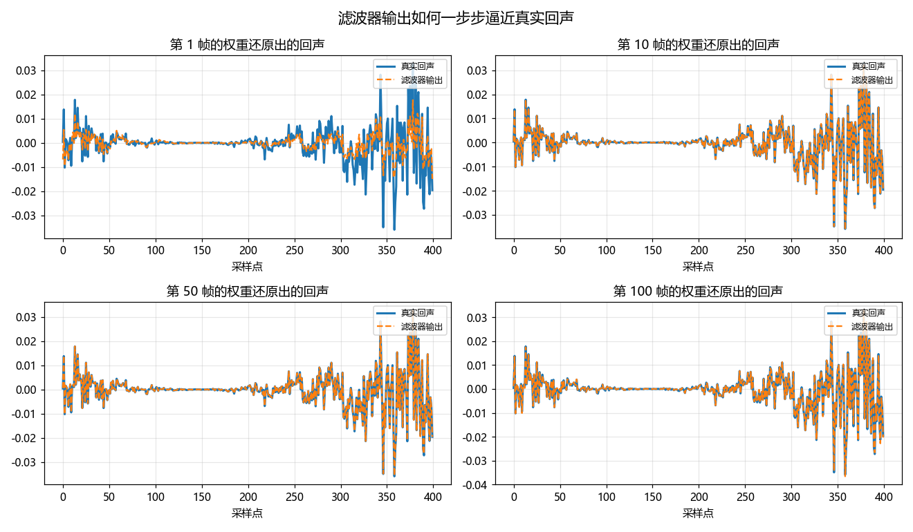
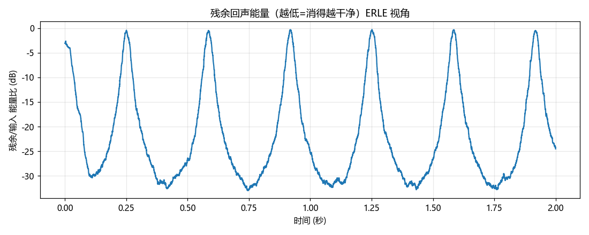
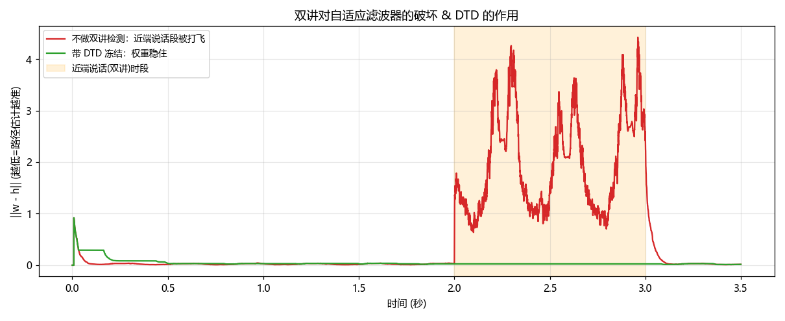

# 19 · 自适应滤波器与回声消除（LMS）

> 研究生时学过但没学懂、极度讨厌矩阵推导？这一篇我们把线性代数全部扔掉，只留一个公式、一段能跑的代码、几张能"看到收敛"的图，外加一节驱动工程师才懂的时间对齐坑。

---

## 一、只记这一个公式

$$w_{n+1} = w_n + \mu \cdot e \cdot x$$

别管矩阵。就把它当成"猜数游戏里不断修正猜测"的过程，逐项拆开：

- **$w$（权重）**：你对"回声路径长什么样"的当前猜测。物理上它就是一组延迟+衰减系数——比如"8 个采样点后来一个 0.8 倍的回声，20 个采样点后再来个 0.4 倍的"。$w$ 就是这一串系数。初始全 0，表示"我啥都不知道"。

- **$x$（参考信号）**：你**明确知道**的那路声音。在回声消除里，就是要从扬声器放出去的远端人声。关键点：这路信号你手里有原始副本，它就是"污染源"，所以能拿来预测污染。

- **$e$（误差）**：麦克风实际收到的信号 $d$，减去你用当前 $w$ 猜出来的回声 $y$，即 $e = d - y$。**这个 $e$ 有双重身份**：既是"我猜错了多少"的反馈信号，又正好是"消完回声后要送出去的干净信号"。这是回声消除最妙的一点——误差本身就是产品。

- **$\mu$（步长）**：每次修正迈多大步。大了收敛快但会震荡甚至发散，小了稳但慢。

一句话读懂整个公式：**"看我这次猜错了多少（$e$）；错误是朝哪个方向、由哪部分参考信号引起的（$x$）；那就往那个方向修一点点（$\mu$）。"** 猜错了就顺着输入的方向调权重，一遍遍逼近，直到 $e$ 趋近于 0。

为什么乘 $x$ 而不是别的？因为误差是 $x$ 经过路径产生的。哪个时刻的参考信号大，它对当前误差的"贡献嫌疑"就大，就该多调整对应那个抽头的权重。$e \cdot x$ 就是在按"嫌疑大小"分配修正量。

---

## 二、代码里发生了什么

完整脚本见同目录 `aec_lms_demo.py`，结构：

1. **远端人声 `x`**：浊音谐波（180/370/750Hz）+ 宽带噪声（清音/气声）+ 音节起伏包络。
2. **回声路径 `h_true`**：4 个抽头——延迟 8 点衰减 0.8（主回声）、20 点 0.4、35 点 0.2、50 点 0.1（模拟房间多次反射）。
3. **麦克风信号 `d`** = `x` 卷积 `h_true` + 本底噪声。
4. **LMS 循环**：逐采样点算 $y$、$e$，用上面那个公式更新 $w$。

核心就这三行，和公式一一对应：

```python
y[i] = np.dot(w, x_vec)              # 用当前猜测算回声
e[i] = d[i] - y[i]                   # 误差 = 麦克风 - 猜测(也是干净输出)
w = w + (mu / norm) * e[i] * x_vec   # w += μ·e·x
```

> 这里 `norm` 是把步长按参考信号能量归一化（NLMS），比裸 LMS 稳得多，原因见第三节坑 2。

---

## 三、这次实测撞到的两个真实的坑（比代码本身更值钱）

这份 demo 不是一次跑通的，中间踩了两个坑，恰好都是 AEC 工程里的经典问题，值得记住。

### 坑 1：参考信号频带太窄，权重根本不收敛到真实路径

最初用纯正弦当"人声"，结果 ERLE 有 15dB（听起来消掉了），但权重 $w$ 和真实 $h$ 差得很远。

原因：几个正弦只激励了几个频率点，LMS 只需找到"恰好抵消这几个频率"的解就行——无数个 $w$ 都能满足，它没动力去还原真实路径。理论上这叫**持续激励条件（persistent excitation）**不满足。

改成宽带信号（加噪声成分）后，每个抽头都被"照到"，$w$ 才真正逼近 $h$。

> **工程含义：** 远端一直放纯音调时，别指望滤波器学到真东西。

### 坑 2：远端静音时，权重被踹飞（发散）

`w += (mu/norm)·e·x` 里 `norm` 是参考信号能量。一开始用 `norm = x·x + 1e-6`。当远端静音（`x≈0`）时，`norm` 塌到 1e-6，`mu/norm` 暴涨到几十万倍，再乘上本底噪声，一步就把权重打乱。表现是权重误差不降反升到 3.5。

修法是把正则项按信号平均能量定：

```python
delta = 0.1 * M * np.mean(x**2)      # 正则项按能量走，不塌到 0
norm  = np.dot(x_vec, x_vec) + delta
```

这就是标准 NLMS 的做法。

> **工程含义：** 远端没声音时不该更新（或更新量要被压住），否则噪声会毁掉辛苦学到的权重。真实 AEC 里这靠 DTD（双讲检测）和能量门限来做。

---

## 四、可视化：你能"看到"的收敛

脚本会按"帧"（每帧 128 个采样点，16ms@8kHz，对齐音频驱动的一帧概念）处理，并在第 1 / 10 / 50 / 100 帧结束时给权重拍快照。



- **`aec_weights.png`**：第 1/10/50/100 帧的 $w$（橙 ×）叠在真实 $h$（蓝 o）上。第 1 帧橙点乱七八糟，到第 100 帧几乎完全落在蓝点上——4 个抽头的位置和高度都对上了。



- **`aec_output.png`**：滤波器输出的回声波形从"对不上"逐渐贴合真实回声波形。



- **`aec_converge.png`**：残余能量 dB 曲线一路往下掉，就是收敛过程。

**数值证据：** 权重与真实路径的误差范数，第 1 帧 **0.63** → 第 100 帧 **0.04**；最终 ERLE **27dB**。

**想直接听效果？** 脚本还会导出三段 wav，按顺序听即可感受回声被"抠掉"的过程：

- `aec_1_reference.wav`：远端参考（扬声器要放的原始人声）
- `aec_2_mic.wav`：麦克风收到的（叠了延迟+衰减的回声，听起来"发闷、带尾巴"）
- `aec_3_cleaned.wav`：LMS 消除后送出去的干净信号

> 提示：这个 demo 里近端**没有人说话**，所以消完基本只剩本底噪声，听感"过于干净"。真实通话中近端会说话，那就进入了下面第五节要讲的最难问题——双讲。

---

## 五、最难的问题：双讲（double-talk）与 DTD

前面一切顺利，是因为 demo 里**只有远端在说话**。真实通话里，两边经常同时开口——你在听对方、同时也在应答。这叫**双讲（double-talk）**，它是 AEC 里最难、最容易翻车的一环。

### 为什么双讲会毁掉滤波器

回到误差的定义 $e = d - y$。自适应滤波器的全部假设是：**$e$ 里剩下的就是"没消干净的回声"，所以顺着它调权重能让回声更小。**

但双讲时，麦克风信号 $d$ = 回声 + **近端语音**。此时 $e$ 里混进了大量近端语音，而近端语音和参考信号 $x$ **毫无关系**。滤波器却傻乎乎地把这团近端语音也当成"没消干净的回声"，拼命调整权重去抵消它——结果就是把辛辛苦苦收敛好的 $w$ 彻底带偏。表现是：对方那边突然回声变大、声音发飘。

### 解决办法：双讲检测（DTD）+ 冻结更新

对策很直接——**检测到双讲时，暂停更新权重**（$w$ 冻住不动，但照常输出、照常算 $e$ 送出去）。等双讲结束再恢复学习。检测靠的是一个朴素事实：**回声的幅度不可能超过远端信号太多**（它是远端经过衰减路径来的）。所以当"麦克风幅度 / 远端最近最大幅度"突然变大，说明混进了本地声源，即双讲。这就是经典的 **Geigel 算法**。

我写了个对比 demo（`aec_doubletalk_demo.py`）：远端全程说话，近端只在 2\~3 秒插入一段。对比"不检测"和"检测并冻结"两种策略下，权重离真实路径的距离 $\|w-h\|$。



- **红线（不做 DTD）**：2 秒前已收敛到近 0，近端一说话立刻飙到 **2.45**——权重被打飞。
- **绿线（带 DTD 冻结）**：整个双讲段稳在 **0.025**，纹丝不动。

### 调这个 DTD 时踩的三个真实坑（比结论值钱）

这个 demo 我不是一次调对的，三次翻车恰好对应 DTD 工程的三个核心难点：

1. **判据不能依赖还没收敛的东西。** 我最初用 $\|w\|$ 参与判据，冷启动时 $w=0$ 导致每一帧都被判成双讲、全程冻结、永远学不动。教训：DTD 判据要用**可直接测量的量**（远端幅度、麦克风幅度），不要用滤波器自己的中间状态。

2. **漏检比误检更致命，必须加 hangover（迟滞）。** 只看瞬时幅度时，近端语音的**过零点**那几个采样瞬间幅度很低，DTD 会误判"双讲结束"而恢复更新，一更新就中毒。解法是一旦触发双讲，就强制再冻结一小段（我用 30ms），跨过这些过零点。

3. **门限松紧是个两难，要靠实测定。** 门限太低 → 纯回声段自己就频繁误触发，滤波器没机会学（我一度全程冻结）；太高 → 双讲漏检、权重被打飞。我实测了两种状态下的幅度比分布（纯回声段 99% 在 0.87 以下，双讲段中位数 1.1），才把门限卡在 **0.8**。**这个值没有理论公式，就是拿真实信号量出来的。**

> 工程现实：真实产品里 DTD 远比 Geigel 复杂（用归一化互相关、双滤波器结构等），因为它直接决定通话体验——漏检则回声泄漏，误检则回声消不掉。这是 AEC 调优投入最大的一块。

---

## 六、为什么只有 LMS 还不够：两级架构（线性滤波 + 残余抑制）

即使 DTD 完美、滤波器充分收敛，**线性自适应滤波也消不干净回声**。原因是真实世界不满足"回声 = 参考信号的线性卷积"这个前提：

- **扬声器非线性**：小扬声器（尤其手机、蓝牙音箱）在中大音量下会产生谐波失真。回声里含有参考信号里根本没有的频率成分，线性滤波器无论怎么调都对不上——因为 $x$ 里没有那个成分可以拿来抵消。
- **路径时变**：人一动、手机一晃，回声路径就变了，滤波器永远在"追"一个动靶，残差消不到零。
- **背景噪声、混响拖尾**：这些也不是 $x$ 的线性函数。

所以工业级 AEC 几乎都是**两级结构**：

1. **线性自适应滤波（AEC 主体）**：就是本文的 NLMS/FDAF，消掉可预测的线性回声，是主力，能消掉大部分能量。
2. **残余回声抑制（RES / NLP，Residual Echo Suppression / Non-Linear Processing）**：跟在后面，处理线性滤波器消不掉的那部分（非线性、时变残差）。它不再"减去"回声，而是像降噪一样，在频域**按增益压制**那些"判断为残余回声"的时频点。最极端的 NLP 在检测到"只有远端说话、近端静音"时直接把输出**静音（comfort noise 补一点底噪）**，保证零回声泄漏。

一句话：**线性滤波负责"精确抵消能算出来的部分"，RES 负责"兜底压制算不出来的部分"。** 只有 LMS 的 AEC 在真机上是不够用的。

---

## 七、算法选型地图：LMS 只是入门

本文用时域 NLMS 是为了讲清原理。真实系统里几乎不用它，因为语音信号相邻采样点高度相关，时域 LMS 收敛慢。了解一下选型全景：

| 算法 | 一句话 | 用在哪 |
|---|---|---|
| **LMS** | 最朴素，本文的公式 | 教学、极简场景 |
| **NLMS** | LMS + 按能量归一化步长 | 入门实用，本文用的 |
| **RLS** | 用二阶统计量，收敛最快 | 收敛速度要求极高、算得起（$O(M^2)$）时 |
| **FDAF / 分块频域自适应** | 在频域分块做，用 FFT 加速 + 各频点独立步长 | **工业主流**（WebRTC AEC、Speex 等都是这类） |
| **AEC3 (WebRTC)** | 频域 + 多状态 + 强 RES 的完整方案 | 浏览器、大量 App 的实际 AEC |

为什么**频域**是主流：一是长滤波器用 FFT 做卷积比时域快得多（回声路径动辄几百上千抽头）；二是不同频段回声强弱不同，频域能给每个频点**独立的步长**，收敛更快更稳。你真要落地，起点应该是读 WebRTC AEC3 或 Speex 的实现，而不是手写时域 LMS。

**变步长（VSS）**：路径突变（人走动、拿起手机）时，滤波器要重新收敛。理想的步长应该"没收敛时大步快跑、收敛后小步求稳、路径突变时再放大"。这类**变步长**策略是让 AEC 又快又稳的关键旋钮之一。

---

## 八、AEC 在语音处理链路里的位置

AEC 不是孤立的，它是**上行（发送）链路**里的一环。典型顺序：

```
麦克风 → [AEC 回声消除] → [NS 降噪] → [AGC 自动增益] → 编码器 → 发到对端
                ↑
         参考信号 x（来自下行/扬声器要播的远端声音）
```

几个容易搞混的关系：

- **AEC 必须在最前面**（紧挨麦克风、降噪之前）。因为 AEC 需要"未经处理的原始麦克风信号"和"干净的参考信号"来对齐。如果先降噪，非线性的降噪会破坏回声与参考的线性关系，AEC 就没法工作了。
- **AEC ≠ 降噪（NS）**。AEC 消的是"**你自己扬声器放出去、又被麦克风收回来**的己方声音"，它有参考信号可用。NS 消的是"环境里的稳态噪声"（空调、风扇），没有参考、靠统计特性。两者互补，都要有。
- **AEC 与波束成形（beamforming）**：多麦克风设备里，波束成形靠麦克风阵列的空间信息压制特定方向的声音，AEC 靠参考信号消己方回声，维度不同、常常叠加使用（顺序视方案而定）。
- **和 AGC 的坑**：AGC 会动态改变增益，等效于给回声路径乘了个时变系数，会干扰 AEC 收敛。所以链路里各模块的增益要协同，不能各调各的。

记住这张图的价值：面试或排查问题时，"回声消不掉"和"噪声消不掉"是**两个不同模块**的责任，先分清是哪一路的问题。

---


## 九、驱动工程师视角：Ring Buffer 与时间对齐的坑

这是 AEC 在真机上最容易翻车、而算法书从来不讲的部分。核心矛盾：**公式假设 $x$（参考）和 $d$（麦克风）在同一个时间轴上，但在真实设备里它们来自两条独立的音频通路，时间基准不一样。**

### 坑 1：参考信号相对麦克风信号有几十毫秒的固有延迟

远端信号 $x$ 从被你拿到，到真正从扬声器振动出来、再被麦克风收回来，中间要经过：播放缓冲队列 → DAC → 功放 → 扬声器 → 空气传播 → 麦克风 → ADC → 录制缓冲队列。这条链路轻则 20ms、重则上百 ms。也就是说麦克风此刻收到的回声，对应的是几十 ms **之前**的那段 $x$。

后果直接致命：滤波器长度 $M$ 必须先"跨过"这段纯延迟，才能覆盖到真正的回声。若固有延迟 50ms@16kHz = 800 个采样点，而你 $M$ 只开 256，滤波器根本够不着回声，`e` 永远降不下来，你会以为算法坏了，其实是没对齐。工程上要么先做**粗延迟估计**（互相关找峰值）把参考信号对齐、砍掉这段纯延迟，要么把 $M$ 开到足够长（代价是计算量和收敛变慢）。

### 坑 2：两个 Ring Buffer 各读各的，读指针没有共同时间戳

播放和录制通常是两个独立的环形缓冲区，各自有读写指针，由不同的中断/回调驱动。你要喂给 LMS 的是"**同一时刻**的参考和麦克风采样对"。如果只是各自 `read()` 一帧就配对，两条链路的缓冲深度不一样，配出来的 $x$ 和 $d$ 根本不是同一时刻的，对齐误差还会随缓冲抖动而漂移。正确做法是给两个 buffer 的样本打上**统一时钟的时间戳**（帧计数或硬件时间），按时间戳配对，而不是按"各读一帧"配对。

### 坑 3：播放和录制时钟不同源，会缓慢漂移（clock drift）

如果扬声器 DAC 和麦克风 ADC 用的是两个独立晶振（蓝牙耳机、USB 声卡尤其常见），它们的实际采样率会有 ppm 级偏差，比如一个 48000Hz、另一个实际 48001Hz。短时间看不出来，但几十秒后参考和麦克风就错开了整数个采样点，之前收敛好的 $w$ 会慢慢失配、ERLE 掉下来。表现是"一开始消得好，越用越差"。解决要靠**重采样补偿**或自适应滤波器自己缓慢跟踪（但跟得慢就来不及）。这就是为什么蓝牙场景 AEC 特别难做。

### 坑 4：缓冲区 underrun/overrun 会瞬间打乱对齐

一旦某条链路发生 xrun（数据供不上或来不及取），系统可能丢帧或补零。丢几个采样点，参考和麦克风的对齐关系就整体错位，滤波器得从头重新收敛。所以工程上 AEC 模块通常要监听 xrun 事件，一旦发生就触发滤波器**部分重置或延迟重估**。

---

## 小结

- **算法侧**：LMS 就一句话——猜错了（$e$），顺着输入方向（$x$）修一点点（$\mu$）。收敛的前提是参考信号足够宽带（持续激励），静音时要停手（NLMS 正则）。
- **双讲**：两边同时说话时，$e$ 里混进近端语音会把权重打飞，必须靠 DTD 检测并冻结更新。DTD 的门限和迟滞没有理论公式，要拿真实信号量出来——这是 AEC 调优投入最大的一块。
- **只有 LMS 不够**：真实回声有非线性和时变成分，线性滤波消不干净，工业方案都是"线性自适应滤波 + 残余抑制(RES/NLP)"两级结构。
- **选型**：时域 LMS 只是教学起点，落地看频域分块自适应（FDAF），标杆是 WebRTC AEC3。
- **链路位置**：AEC 必须紧挨麦克风、在降噪之前；它消的是"己方扬声器回来的声音"，和降噪(消环境噪声)、波束成形(消特定方向)是不同模块、不同责任。
- **工程侧**：公式本身很简单，AEC 在真机上大量工作在"如何让 $x$ 和 $d$ 严丝合缝地对齐在同一时间轴上"——延迟估计、时间戳配对、时钟漂移补偿、xrun 处理。而这恰好是驱动工程师最懂、也最有优势的地方。

---

## 附：本文配套文件

| 文件 | 内容 |
|---|---|
| `aec_lms_demo.py` | 主 demo：NLMS 回声消除 + 三张收敛图 + 三段 wav 导出 |
| `aec_doubletalk_demo.py` | 双讲对比 demo：有/无 DTD 时权重是否被打飞 |
| `aec_weights.png` | 权重逐帧逼近真实回声路径 |
| `aec_output.png` | 滤波器输出波形逼近真实回声 |
| `aec_converge.png` | 残余能量收敛曲线 |
| `aec_doubletalk.png` | 双讲破坏 & DTD 守护对比 |
| `aec_1/2/3_*.wav` | 参考 / 被污染麦克风 / 消除后，三段对比听 |
