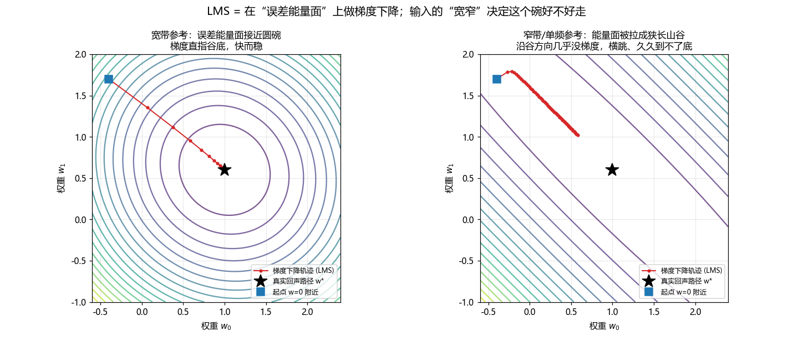

# 第 19 篇｜自适应滤波器与回声消除：让麦克风"听不见"自己的喇叭

> 一句话核心直觉：免提通话时，扬声器放出去的对方声音又被自己的麦克风收了回去——这就是**回声**。回声路径本质是**一段冲激响应 $h$**（第 5 篇讲过的那个 $h$），而回声消除就是让机器**一边猜这段 $h$、一边用误差自我纠正**，逐样本逼近它。这一篇是全系列最后一篇加餐，所以我们不满足于"记住一个公式"，而要把这件事从**物理直觉、数学骨架、工程落地**三个角度都吃透——尤其是把那条 $w \leftarrow w + \mu e x$ **一步步推出来**，让研究生时被矩阵劝退的你，第一次看懂它为什么长这样。

---

## 一、先把"讨厌矩阵"这件事解决掉

很多人（包括当年的我）在研究生的《自适应信号处理》课上第一次遇到 LMS，然后被劝退了。原因不是笨，是老师上来就甩：

$$\mathbf{w}_{n+1} = \mathbf{w}_n + \mu\,\mathbf{x}_n\,e_n, \qquad e_n = d_n - \mathbf{w}_n^{\mathsf T}\mathbf{x}_n$$

黑板右边紧跟着均方误差 $J = E[e^2]$、维纳解 $\mathbf{w}^\star = \mathbf{R}^{-1}\mathbf{p}$、自相关矩阵 $\mathbf{R}$ 的特征值分解……全是矩阵。会背、会做题、能过考试，但心里始终有个疙瘩：**这个更新式是从哪冒出来的？为什么偏偏是"误差乘输入"，不是误差的平方、不是除以输入？**

这一篇我给你一个交代。**我不甩矩阵，而是用标量、用一个两抽头的具体数字例子，把这条式子从"最小化误差能量"这一个朴素目标一步步逼出来。** 推完你会看到：$w + \mu e x$ 不是数学家拍脑袋发明的，它是"沿着误差能量下降最快的方向走一步"唯一能得到的结果。

先把场景钉死。你在用手机免提打电话：

- 对方的声音从**你的扬声器**放出来——这路信号你手里有原始副本，叫**远端参考信号 $x$**。
- 这个声音在房间里弹一圈，又钻进**你的麦克风**——这就是回声。
- 你的麦克风同时还可能收到**你自己说话**（近端语音）。
- 麦克风实际收到的东西叫 $d$，它 = 回声 + 你的话 + 环境噪声。

任务：从 $d$ 里把回声抠掉，只把"你自己的话"送给对方。**难点在于——回声是 $x$ 经过一条你不知道的路径变来的，你得先把这条路径估出来。**

> **关键认知**：回声路径就是第 5 篇里那个 $h$。"扬声器→空气→墙面反射→麦克风"是一个 LTI 系统，它的全部秘密藏在冲激响应 $h$ 里。回声 = 参考信号 $x$ 卷积 $h$。回声消除的核心，就是**在线估计这个 $h$**——用一个自适应 FIR 滤波器 $w$ 去逼近它。

---

## 二、只记这一个公式（先建直觉，别急着推）

估计 $h$ 的那个自适应 FIR，它的权重我们记作 $w$。核心更新式就一行：

$$w \leftarrow w + \mu \cdot e \cdot x$$

先别管它怎么来的（第三节推）。先把它当成"猜数游戏里不断修正猜测"，逐项拆开看：

- **$w$（权重）**：你对"回声路径长什么样"的当前猜测，是一组延迟+衰减系数——比如"8 个采样点后来个 0.8 倍的回声，20 个点后再来个 0.4 倍的"。$w$ 就是这一串系数，和第 5 篇的 $h$ 是**同一种东西**（一段有限长冲激响应）。初始全 0，表示"我啥都不知道"。

- **$x$（参考信号）**：你**明确知道**的那路声音——要从扬声器放出去的远端人声。关键点：这路信号你手里有原始副本，它就是"污染源"，所以能拿来预测污染。这里的 $x$ 严格说是一个向量：当前时刻往回看 $M$ 个参考采样点 $x=[x_n, x_{n-1}, \dots, x_{n-M+1}]$，正好对齐 $w$ 的 $M$ 个抽头。
- **$e$（误差）**：麦克风实际收到的 $d$，减去你用当前 $w$ 猜出来的回声 $y$，即 $e = d - y$。**这个 $e$ 有双重身份**：既是"我猜错了多少"的反馈信号，又正好是"消完回声后要送出去的干净信号"。这是回声消除最妙的地方——误差本身就是产品。

- **$\mu$（步长）**：每次修正迈多大步。大了收敛快但会震荡甚至发散，小了稳但慢。第三节末尾会推出它的稳定上限。

一句话读懂整个公式：**"看我这次猜错了多少（$e$）；错误是朝哪个方向、由哪部分参考信号引起的（$x$）；那就往那个方向修一点点（$\mu$）。"** 猜错了就顺着输入的方向调权重，一遍遍逼近，直到 $e$ 趋近于 0。

至于"为什么乘 $x$ 而不是别的"——这正是下一节要**推**出来的。这里先给个模糊的直觉打底：误差是 $x$ 经过路径产生的，哪个时刻的参考信号大，它对当前误差的"贡献嫌疑"就大，就该多调整对应那个抽头。$e\cdot x$ 是在按"嫌疑大小"分配修正量。但这只是直觉，凭什么正好是**乘法**、凭什么系数是 $\mu$？往下看。

---

## 三、数学角度：把 $w + \mu e x$ 一步步推出来

这一节是本篇的核心。我们不甩矩阵，只用标量和一个两抽头的小例子，把更新式从"最小化误差能量"这一个目标逼出来。全程慢走，一步一停。

### 3.1 第一步：先说清"我们到底想干嘛"

我们想让 $w$ 尽量准，"准"的意思是**误差 $e$ 尽量小**。但 $e$ 有正有负，直接最小化 $e$ 没意义（负得越多不代表越好）。所以我们最小化的是 $e$ 的**平方**——它恒非负，等于 0 才代表完全消掉：

$$J = e^2 = (d - y)^2 = \left(d - \sum_{k} w_k\, x_k\right)^2$$

这里 $J$ 就是"我此刻猜错的代价"，学名叫**瞬时误差能量**（或瞬时代价函数）。它是一个关于权重 $w=(w_0, w_1, \dots)$ 的函数——你把 $w$ 调到不同值，$J$ 就不同。

**把 $J$ 想象成一个地形。** 横轴是 $w$（先想象只有一个抽头，$w$ 是一个数），纵轴是代价 $J$。因为 $J$ 是 $w$ 的二次函数（平方展开后 $w$ 的最高次是 2 次），这个地形是一条**开口向上的抛物线**——一个碗。碗底就是让 $J$ 最小的那个 $w$，也就是我们要找的答案。

> **关键认知**：找最优 $w$ = 走到碗底。而"往碗底走"的通用办法，就是**梯度下降**：站在碗壁上，看哪个方向最陡、朝下走一步，反复走，迟早到底。LMS 的全部内容，就是"在误差能量这个碗上做梯度下降"。这句话记住，下面全是把它翻译成公式。

### 3.2 第二步：求"最陡下降方向"——先用单抽头，别上矩阵

梯度下降要"朝最陡的下坡方向走"。数学上，最陡上坡方向是**梯度**（对每个 $w_k$ 求偏导），那最陡下坡就是**负梯度**。所以我们要算 $J$ 对每个权重 $w_k$ 的偏导 $\dfrac{\partial J}{\partial w_k}$。

先只看**一个抽头** $w_k$，把其它权重当常数。$J = (d - y)^2$，其中 $y = \sum_j w_j x_j$ 里含 $w_k x_k$ 这一项。用链式法则，一层层剥：

**外层**：$J = e^2$，对 $e$ 求导得 $\dfrac{\partial J}{\partial e} = 2e$。

**中层**：$e = d - y$，$d$ 是麦克风收到的、和 $w_k$ 无关，所以 $\dfrac{\partial e}{\partial y} = -1$，即 $\dfrac{\partial e}{\partial w_k} = -\dfrac{\partial y}{\partial w_k}$。

**内层**：$y = w_0 x_0 + \dots + w_k x_k + \dots$，对 $w_k$ 求导，只有 $w_k x_k$ 这项留下，其余全是常数导数为 0，所以 $\dfrac{\partial y}{\partial w_k} = x_k$。

三层乘起来：

$$\frac{\partial J}{\partial w_k} = \underbrace{2e}_{\text{外}} \cdot \underbrace{(-1)}_{\text{中}} \cdot \underbrace{x_k}_{\text{内}} = -2\,e\,x_k$$

**停一下，盯住这个结果 $\dfrac{\partial J}{\partial w_k} = -2 e x_k$。** 回声消除那条更新式的核心 $e\cdot x$，就是从这里冒出来的——它不是发明，是"误差能量对权重的偏导"自然长出来的。那个负号和常数 2，下一步会自然被吸收。
### 3.3 第三步：梯度下降"走一步"，正好凑出 $w + \mu e x$

梯度下降的通用写法是"当前位置减去步长乘梯度"（减号是因为要往**下**坡走，即负梯度方向）：

$$w_k \leftarrow w_k - \alpha\,\frac{\partial J}{\partial w_k}$$

$\alpha$ 是学习率（你迈多大步）。把上一步算出的 $\dfrac{\partial J}{\partial w_k} = -2 e x_k$ 代进去：

$$w_k \leftarrow w_k - \alpha\,(-2\,e\,x_k) = w_k + 2\alpha\,e\,x_k$$

那个常数 2 和你自己挑的学习率 $\alpha$ 乘在一起，无非又是一个你可以自由挑的正数。**干脆把 $2\alpha$ 合并记成一个新符号 $\mu$**（这一步叫"把常数吸收进步长"，工程上天天这么干，因为 $\mu$ 反正是拿实测调的旋钮，差个因子 2 无所谓）：

$$\boxed{\,w_k \leftarrow w_k + \mu\,e\,x_k\,}$$

写成向量（对所有抽头同时做这件事，$k=0,1,\dots,M-1$），就是那条"只记一个公式"：

$$w \leftarrow w + \mu\,e\,x$$

**回头看这条路径**：我们只做了一件事——把"让误差能量最小"翻译成"在碗上往最陡下坡走一步"。$e\cdot x$ 是碗的坡度（负梯度），$\mu$ 是步子大小。式子里没有任何一处是硬凑的：乘 $x$ 是链式法则内层逼出来的，负号被负梯度方向消掉了，常数 2 被 $\mu$ 吸收了。**这就是为什么是 $w+\mu e x$，而不是别的。**

> **术语补一句（事后括注即可）**：严格说我们最小化的应该是**期望**误差能量 $E[e^2]$，它的真梯度要对整段信号统计平均才算得出。而我们这里用的是**当前这一个采样点的瞬时 $e^2$** 直接当梯度——这叫**随机梯度下降**，学名 LMS（Least Mean Squares）就是这么来的。用瞬时值代替期望是一个**近似**：单步方向有噪声、会抖，但平均下来仍朝碗底走。这个近似正是 LMS 又便宜又实用的原因（不用存历史、不用算矩阵，来一个样本更新一次），也是它有时会"抖着收敛"的根源——记住这点，第六节拆台时要用。

### 3.4 第四步：不信？手算一步给你看

抽象公式容易让人犯迷糊，我们拿具体数字走一遍，验证"走一步真的让误差变小"。

设回声路径只有两个抽头，真实值 $h = (1.0,\ 0.6)$（我们假装不知道）。当前参考向量 $x = (2,\ 1)$，麦克风此刻收到的（无噪声理想情况）：

$$d = 1.0\times 2 + 0.6\times 1 = 2.6$$

我们的猜测从零开始 $w = (0,\ 0)$，取步长 $\mu = 0.1$。逐步算：

- **算输出**：$y = w_0 x_0 + w_1 x_1 = 0\times2 + 0\times1 = 0$
- **算误差**：$e = d - y = 2.6 - 0 = 2.6$
- **更新每个抽头**：
  - $w_0 \leftarrow 0 + 0.1 \times 2.6 \times 2 = 0.52$
  - $w_1 \leftarrow 0 + 0.1 \times 2.6 \times 1 = 0.26$

新的 $w = (0.52,\ 0.26)$，比起点 $(0,0)$ 朝真值 $(1.0, 0.6)$ 挪近了。**验证一下误差真的变小了**：用新 $w$ 重算这个样本的输出 $y' = 0.52\times2 + 0.26\times1 = 1.30$，新误差 $e' = 2.6 - 1.30 = 1.30$。从 2.6 降到 1.30，一步砍掉一半。

再走一步（同一个 $x$、$d$）：$e' = 1.30$，$w_0 \leftarrow 0.52 + 0.1\times1.30\times2 = 0.78$，$w_1 \leftarrow 0.26 + 0.1\times1.30\times1 = 0.39$……你会看到 $w$ 一步步爬向 $(1.0, 0.6)$，$e$ 一步步趋近 0。**这就是"猜错了就顺着输入方向修一点、反复逼近"在数字上的样子。** 没有魔法，就是在碗壁上一步步往下挪。

### 3.5 第五步：步长 $\mu$ 能多大？——稳定收敛的上界

上面那个例子，$\mu=0.1$ 走得挺稳。但 $\mu$ 太大会怎样？直觉上：步子迈太大，一步跨过碗底、冲到对面更高的地方，下一步再冲回来还冲得更远——**发散**。

用刚才的单样本例子看得很清楚。一步更新后，误差从 $e$ 变成多少？新输出 $y' = \sum_k (w_k + \mu e x_k) x_k = y + \mu e \sum_k x_k^2 = y + \mu e \|x\|^2$。于是新误差：

$$e' = d - y' = (d - y) - \mu e\|x\|^2 = e\left(1 - \mu\|x\|^2\right)$$

要让误差**缩小**（$|e'| < |e|$），就需要 $|1 - \mu\|x\|^2| < 1$，解出来：

$$0 < \mu < \frac{2}{\|x\|^2}$$

**这就是步长的稳定上界，$\|x\|^2$ 是当前输入向量的能量。** 读三个信息：

1. $\mu$ 必须为正（往下坡走，不是往上）。
2. $\mu$ 有上限，超过 $2/\|x\|^2$ 就发散——步子跨过头。
3. **上限随输入能量变**。输入声音大（$\|x\|^2$ 大），安全步长就小；输入小，安全步长就大。这很麻烦：远端一会儿大声一会儿小声，固定 $\mu$ 要么大声时炸、要么小声时慢。

### 3.6 第六步：NLMS——把步长对输入能量归一化

上一步暴露的矛盾，解法呼之欲出：**既然安全上界正比于 $1/\|x\|^2$，那就让步长自己去除以 $\|x\|^2$**，这样不管输入大小，实际步子都落在安全区里。把 $\mu \to \dfrac{\mu}{\|x\|^2}$ 代入：

$$w \leftarrow w + \frac{\mu}{\|x\|^2}\,e\,x, \qquad 0 < \mu < 2$$

这就是 **NLMS（归一化 LMS）**。归一化之后 $\mu$ 变成一个和信号幅度无关的纯数，取值范围干净地落在 $(0, 2)$，实践常取 $0.2\sim1.0$。它不是新算法，就是"让步长对输入能量自适应"的 LMS——**同一个梯度下降，只是每步的步子按脚下坡度的陡峭程度自动缩放了一下。**

> **工程红线**：$\|x\|^2$ 可能为 0（远端静音），除零会炸。所以实际写成 $\dfrac{\mu}{\|x\|^2 + \delta}$，$\delta$ 是个小正数正则项。这个 $\delta$ 怎么取，是第五节"静音踹飞"那个坑的主角——先记着。

---

## 四、三个角度是同一件事

推完数学，回头把三个角度对齐一下。这正是全系列方法论要求的"同一个概念，三个侧面"：

| 角度 | 回声消除在做什么 | 关键对象 |
|---|---|---|
| **物理/直觉** | 不断猜测扬声器到麦克风的回声路径，用"猜错了多少"来修正猜测 | 回声路径 = 一段冲激响应 $h$（第 5 篇） |
| **数学** | 在"误差能量"这个碗上做梯度下降，一步步滑向碗底 | 代价 $J=e^2$，负梯度 $e\cdot x$，步长 $\mu$ |
| **工程** | 逐样本算 $y$、$e$、更新 $w$，配 ring buffer 存最近 $M$ 个参考采样 | 抽头延迟线 + 环形缓冲 + $x/d$ 时间对齐 |

三句话其实说的是**同一件事**：物理上"顺着输入方向修一点"，数学上就是"沿负梯度走一步"，工程上就是那三行逐样本代码。看懂了任意一个角度，另外两个都是它换了身衣服。



上图把 3.1 的"碗"画了出来（两抽头，等高线是 $J$ 的截面）。黑星是真实路径 $w^\star$（碗底），红线是从零附近出发的梯度下降轨迹。**左边**是宽带参考信号：碗接近圆形，负梯度几乎直指碗底，几步就到。**右边**是窄带/单频参考：碗被拉成一条狭长的山谷，沿谷底方向几乎没有坡度（梯度没信息），轨迹只能在谷两壁间来回横跳、迟迟到不了底。这张图正好预告了第六节要拆的第一个坑——记住"窄带 = 碗被拉平"这个画面。

---

## 五、工程角度：代码里逐样本发生了什么

完整脚本见同目录 `aec_lms_demo.py`。它的结构直接对应上面推的东西：

1. **远端人声 `x`**：浊音谐波（180/370/750Hz）+ 宽带噪声（清音/气声）+ 音节起伏包络。宽带是刻意的——第 3 节右图告诉我们，窄带会把误差能量面拉平、$w$ 收不到真解。
2. **回声路径 `h_true`**：4 个抽头——延迟 8 点衰减 0.8（主回声）、20 点 0.4、35 点 0.2、50 点 0.1（模拟房间多次反射）。这就是我们假装不知道、要估出来的那个 $h$。
3. **麦克风信号 `d`** = `x` 卷积 `h_true` + 本底噪声。
4. **NLMS 循环**：逐采样点算 $y$、$e$，用第 3 节推出的公式更新 $w$。

核心就这三行，和公式一一对应：

```python
y[i] = np.dot(w, x_vec)              # 用当前猜测算回声  (= 3.2 的 y = Σ w_k x_k)
e[i] = d[i] - y[i]                   # 误差 = 麦克风 - 猜测(也是干净输出)
w = w + (mu / norm) * e[i] * x_vec   # w += (μ/‖x‖²)·e·x  (= 3.6 的 NLMS)
```

对照第三节：`np.dot(w, x_vec)` 是 3.2 的 $y=\sum_k w_k x_k$；`d[i] - y[i]` 是误差 $e$；最后一行就是 3.6 的 NLMS 更新，`norm` 是 $\|x\|^2 + \delta$。**你在书上看到的矩阵推导，落到 CPU 上就是这三行标量数组运算，每样本 $O(M)$ 次乘加。**

### 5.1 因果形式与抽头延迟线

注意 `x_vec = x[i-M+1:i+1][::-1]`——取最近 $M$ 个参考采样、并倒序。这正是第 5 篇讲的**抽头延迟线**：当前样本对齐 $w_0$，前一个对齐 $w_1$……和卷积 $y[n]=\sum_k w_k x[n-k]$ 的因果形式完全一致。真机上这段就是一个**环形缓冲**：新样本写进去、读最近 $M$ 个出来点乘，不必每次搬数组。

> **成本账**：$M$ 抽头的时域 NLMS，每样本约 $2M$ 次乘加（一次点乘算 $y$，一次更新 $w$）。$M=256$、16kHz 下每秒约 800 万次乘加——单声道能实时，但回声路径一长（几百上千抽头），时域就吃力了，这是第八节要转频域的动机。

---

## 六、等等，"猜错了就往输入方向修一点"这个直觉，为什么有时会翻车？

第二节那个朴素直觉——"顺着输入方向修一点点，反复逼近"——听起来天衣无缝。但这份 demo 我不是一次跑通的，中间踩了两个坑。**关键在于：这两个坑不是随机 bug，而是"梯度下降"这个框架下完全可预测的现象。** 我们用第三节的碗和梯度，把它们从"撞到的坑"升格为"本该料到的事"。

### 6.1 坑一：参考信号频带太窄，权重根本不收敛到真实路径

最初我用纯正弦当"人声"，结果 ERLE 有 15dB（听起来消掉了），但权重 $w$ 和真实 $h$ 差得很远。

**用第三节的碗解释**：纯正弦只激励了几个频率点。在误差能量面上，这意味着碗**沿某些方向被彻底压平**（就是第 3.6 节配图的右边那条狭长山谷的极端版）——多个不同的 $w$ 给出几乎相同的 $J$。梯度在平坦方向上接近 0，**没有信息告诉 $w$ 该往哪走**，于是 $w$ 停在"恰好抵消这几个频率"的某个解上，不去还原真实路径。它消掉了那几个频率的回声（所以 ERLE 看着还行），但路径估计是错的。

学名叫**持续激励条件（persistent excitation）不满足**：要想唯一确定 $M$ 个抽头，输入必须"照亮"这 $M$ 个自由度对应的所有方向——频带够宽，碗在每个方向上才都有坡度。改成宽带信号（加噪声成分）后，每个抽头都被"照到"，$w$ 才真正逼近 $h$。

> **工程含义**：远端一直放纯音调（比如久等的等待音乐是纯和弦）时，别指望滤波器学到真东西。这不是算法坏了，是碗被拉平了、梯度没信息。

### 6.2 坑二：远端静音时，权重被踹飞（发散）

`w += (mu/norm)·e·x` 里 `norm` 是参考能量 $\|x\|^2+\delta$。我一开始用 `norm = x·x + 1e-6`。当远端静音（`x≈0`）时，$\|x\|^2\to 0$，`norm` 塌到 1e-6，`mu/norm` 暴涨到几十万倍，再乘上本底噪声，一步就把权重打乱。表现是权重误差不降反升到 3.5。

**用第三节的上界解释**：3.5 节推过，稳定要求 $\mu_{\text{实际}} < 2/\|x\|^2$。NLMS 本意是让 $\mu_{\text{实际}}=\mu/(\|x\|^2+\delta)$ 自动落进这个区间。可当 $\|x\|^2\approx 0$ 而 $\delta$ 又太小，分母塌了、实际步长冲破上界几个数量级——按 3.5 的公式，$|1-\mu_{\text{实际}}\|x\|^2|$ 远大于 1，**一步就发散**。所以这也不是玄学 bug，是步长上界被违反的必然结果。

修法是把正则项 $\delta$ 按信号平均能量定，托住分母不塌到 0：

```python
delta = 0.1 * M * np.mean(x**2)      # 正则项按能量走，不塌到 0
norm  = np.dot(x_vec, x_vec) + delta
```

这就是标准 NLMS 的做法（呼应 3.6 末尾埋的那个 $\delta$）。

> **工程含义**：远端没声音时不该更新（或更新量要被压住），否则噪声会毁掉辛苦学到的权重。真实 AEC 里这靠 DTD（双讲检测）和能量门限来做，下一节讲。

### 6.3 拆自己的台：LMS 作为"梯度下降"的边界在哪

把两个坑收拢成一句话：**LMS 的直觉之所以有时翻车，是因为"顺着 $e\cdot x$ 修"这件事只在特定前提下才对。** 具体是两个前提：

- **前提一：误差能量面是个"好走的碗"。** 需要输入宽带（持续激励），否则碗被拉平、梯度没信息——坑一。
- **前提二：$e$ 里剩下的确实是"没消干净的回声"。** 需要 $e$ 只由 $x$ 经过路径产生。静音时 $e$ 是纯噪声、双讲时 $e$ 混进近端语音，此时 $e\cdot x$ 指向的方向根本不是碗底——坑二与下一节的双讲。

还有一条更根本的边界：**梯度下降最小化的是 $e^2$，而 $e^2$ 最小 = 回声消干净，这个等价只在"回声 = $x$ 的线性卷积"时成立。** 真实回声有非线性（扬声器失真）和时变（人一动路径就变），此时线性 FIR 无论怎么调都对不上——碗底本身都不在零点。这就是为什么单靠 LMS 不够、需要第八节的两级结构。

> **关键认知**：LMS 不是万能求解器，它是"线性时不变假设 + 好走的误差碗"下的梯度下降。三个坑（窄带、静音、非线性）恰好对应这三个前提各破一个。理解了碗和梯度，这些现象都是可预测的，而不是运气。

---

## 七、可视化：你能"看到"的收敛

脚本按"帧"（每帧 128 个采样点，16ms@8kHz，对齐音频驱动的一帧概念）处理，并在第 1 / 10 / 50 / 100 帧结束时给权重拍快照。


- **`aec_weights.png`**：第 1/10/50/100 帧的 $w$（橙 ×）叠在真实 $h$（蓝 o）上。第 1 帧橙点乱七八糟，到第 100 帧几乎完全落在蓝点上——4 个抽头的位置和高度都对上了。**这就是第三节那条梯度下降轨迹在真实回声路径上的样子。**


- **`aec_output.png`**：滤波器输出的回声波形从"对不上"逐渐贴合真实回声波形。


- **`aec_converge.png`**：残余能量 dB 曲线一路往下掉，就是碗壁往碗底滑的过程。

**数值证据**（脚本实跑输出，可自行复现）：权重与真实路径的误差范数，第 1 帧 **0.63** → 第 100 帧 **0.04**；收敛后 ERLE **27dB**。

**想直接听效果？** 脚本还会导出三段 wav，按顺序听即可感受回声被"抠掉"的过程：

- `aec_1_reference.wav`：远端参考（扬声器要放的原始人声）
- `aec_2_mic.wav`：麦克风收到的（叠了延迟+衰减的回声，听起来"发闷、带尾巴"）
- `aec_3_cleaned.wav`：LMS 消除后送出去的干净信号

> 提示：这个 demo 里近端**没有人说话**，所以消完基本只剩本底噪声，听感"过于干净"。真实通话中近端会说话，那就进入了下面要讲的最难问题——双讲。

---

## 八、最难的问题：双讲（double-talk）与 DTD

前面一切顺利，是因为 demo 里**只有远端在说话**。真实通话里，两边经常同时开口——你在听对方、同时也在应答。这叫**双讲（double-talk）**，它是 AEC 里最难、最容易翻车的一环。

### 8.1 为什么双讲会毁掉滤波器

回到 6.3 的"前提二"。自适应滤波器的全部假设是：**$e$ 里剩下的就是"没消干净的回声"，所以顺着 $e\cdot x$ 调权重能让回声更小。**

但双讲时，麦克风信号 $d$ = 回声 + **近端语音**，于是 $e = d - y$ 里混进了大量近端语音，而近端语音和参考 $x$ **毫无关系**。滤波器却傻乎乎地把这团近端语音也当成"没消干净的回声"，拼命调 $w$ 去抵消它——**用第三节的话说：梯度 $e\cdot x$ 此刻指向的根本不是误差碗的底，而是被近端语音带偏的一个随机方向。** 结果就是把辛苦收敛好的 $w$ 彻底带偏。表现是：对方那边突然回声变大、声音发飘。

### 8.2 解决办法：双讲检测（DTD）+ 冻结更新

对策很直接——**检测到双讲时，暂停更新权重**（$w$ 冻住不动，但照常输出、照常算 $e$ 送出去）。等双讲结束再恢复学习。检测靠一个朴素事实：**回声的幅度不可能超过远端信号太多**（它是远端经过衰减路径来的）。所以当"麦克风幅度 / 远端最近最大幅度"突然变大，说明混进了本地声源，即双讲。这就是经典的 **Geigel 算法**。

我写了个对比 demo（`aec_doubletalk_demo.py`）：远端全程说话，近端只在 2\~3 秒插入一段。对比"不检测"和"检测并冻结"两种策略下，权重离真实路径的距离 $\|w-h\|$。


- **红线（不做 DTD）**：2 秒前已收敛到近 0，近端一说话立刻飙到 **2.45**——权重被打飞（梯度指错了方向，$w$ 冲出碗底）。
- **绿线（带 DTD 冻结）**：整个双讲段稳在 **0.025**，纹丝不动。

### 8.3 调这个 DTD 时踩的三个真实坑（比结论值钱）

这个 demo 我不是一次调对的，三次翻车恰好对应 DTD 工程的三个核心难点：

1. **判据不能依赖还没收敛的东西。** 我最初用 $\|w\|$ 参与判据，冷启动时 $w=0$ 导致每一帧都被判成双讲、全程冻结、永远学不动。教训：DTD 判据要用**可直接测量的量**（远端幅度、麦克风幅度），不要用滤波器自己的中间状态。

2. **漏检比误检更致命，必须加 hangover（迟滞）。** 只看瞬时幅度时，近端语音的**过零点**那几个采样瞬间幅度很低，DTD 会误判"双讲结束"而恢复更新，一更新就中毒。解法是一旦触发双讲，就强制再冻结一小段（我用 30ms），跨过这些过零点。

3. **门限松紧是个两难，要靠实测定。** 门限太低 → 纯回声段自己就频繁误触发，滤波器没机会学（我一度全程冻结）；太高 → 双讲漏检、权重被打飞。我实测了两种状态下的幅度比分布（纯回声段 99% 在 0.87 以下，双讲段中位数 1.1），才把门限卡在 **0.8**。**这个值没有理论公式，就是拿真实信号量出来的。**

> 工程现实：真实产品里 DTD 远比 Geigel 复杂（用归一化互相关、双滤波器结构等），因为它直接决定通话体验——漏检则回声泄漏，误检则回声消不掉。这是 AEC 调优投入最大的一块。

---

## 九、为什么只有 LMS 还不够：两级架构（线性滤波 + 残余抑制）

即使 DTD 完美、滤波器充分收敛，**线性自适应滤波也消不干净回声**。这正是 6.3 那条"更根本的边界"的兑现：真实世界不满足"回声 = 参考信号的线性卷积"这个前提：

- **扬声器非线性**：小扬声器（尤其手机、蓝牙音箱）在中大音量下会产生谐波失真。回声里含有参考信号里根本没有的频率成分，线性滤波器无论怎么调都对不上——因为 $x$ 里没有那个成分可以拿来抵消，误差碗的底根本不在零点。
- **路径时变**：人一动、手机一晃，回声路径就变了，滤波器永远在"追"一个动靶（碗底在移动），残差消不到零。
- **背景噪声、混响拖尾**：这些也不是 $x$ 的线性函数。

所以工业级 AEC 几乎都是**两级结构**：

1. **线性自适应滤波（AEC 主体）**：就是本文的 NLMS/FDAF，消掉可预测的线性回声，是主力，能消掉大部分能量。
2. **残余回声抑制（RES / NLP，Residual Echo Suppression / Non-Linear Processing）**：跟在后面，处理线性滤波器消不掉的那部分（非线性、时变残差）。它不再"减去"回声，而是像降噪一样，在频域**按增益压制**那些"判断为残余回声"的时频点。最极端的 NLP 在检测到"只有远端说话、近端静音"时直接把输出**静音（补一点 comfort noise 底噪）**，保证零回声泄漏。

一句话：**线性滤波负责"精确抵消能算出来的部分"，RES 负责"兜底压制算不出来的部分"。** 只有 LMS 的 AEC 在真机上是不够用的。

---

## 十、算法选型地图：LMS 只是入门

本文用时域 NLMS 是为了讲清原理。真实系统里几乎不用它，因为语音信号相邻采样点高度相关（回到第 3.6 节配图右边那条狭长山谷——相关就是碗被拉斜），时域 LMS 收敛慢。了解一下选型全景：

| 算法 | 一句话 | 用在哪 |
|---|---|---|
| **LMS** | 最朴素，本文推的公式 | 教学、极简场景 |
| **NLMS** | LMS + 按能量归一化步长（本文 3.6） | 入门实用，本文用的 |
| **RLS** | 用二阶统计量，收敛最快 | 收敛速度要求极高、算得起（$O(M^2)$）时 |
| **FDAF / 分块频域自适应** | 在频域分块做，用 FFT 加速 + 各频点独立步长 | **工业主流**（WebRTC AEC、Speex 等都是这类） |
| **AEC3 (WebRTC)** | 频域 + 多状态 + 强 RES 的完整方案 | 浏览器、大量 App 的实际 AEC |

为什么**频域**是主流：一是长滤波器用 FFT 做卷积比时域快得多（回声路径动辄几百上千抽头，呼应第 5 篇末尾"频域把卷积变逐点乘法"）；二是不同频段回声强弱不同，频域能给每个频点**独立的步长**——等于把一个被拉歪的大碗，拆成许多个各自好走的小碗，收敛更快更稳。你真要落地，起点应该是读 WebRTC AEC3 或 Speex 的实现，而不是手写时域 LMS。

**变步长（VSS）**：路径突变（人走动、拿起手机）时，滤波器要重新收敛。理想的步长应该"没收敛时大步快跑、收敛后小步求稳、路径突变时再放大"——这正是第 3.5 节那个"$\mu$ 是旋钮"的进阶用法。这类**变步长**策略是让 AEC 又快又稳的关键旋钮之一。

---

## 十一、AEC 在语音处理链路里的位置

AEC 不是孤立的，它是**上行（发送）链路**里的一环。典型顺序：

```
麦克风 → [AEC 回声消除] → [NS 降噪] → [AGC 自动增益] → 编码器 → 发到对端
                ↑
         参考信号 x（来自下行/扬声器要播的远端声音）
```

几个容易搞混的关系：

- **AEC 必须在最前面**（紧挨麦克风、降噪之前）。因为 AEC 需要"未经处理的原始麦克风信号"和"干净的参考信号"来对齐。如果先降噪，非线性的降噪会破坏回声与参考的线性关系（又是 6.3 的"前提二"被破坏），AEC 就没法工作了。
- **AEC ≠ 降噪（NS）**。AEC 消的是"**你自己扬声器放出去、又被麦克风收回来**的己方声音"，它有参考信号可用。NS 消的是"环境里的稳态噪声"（空调、风扇），没有参考、靠统计特性。两者互补，都要有。
- **AEC 与波束成形（beamforming）**：多麦克风设备里，波束成形靠麦克风阵列的空间信息压制特定方向的声音，AEC 靠参考信号消己方回声，维度不同、常常叠加使用（顺序视方案而定）。
- **和 AGC 的坑**：AGC 会动态改变增益，等效于给回声路径乘了个时变系数，会干扰 AEC 收敛（碗底又在动了）。所以链路里各模块的增益要协同，不能各调各的。

记住这张图的价值：面试或排查问题时，"回声消不掉"和"噪声消不掉"是**两个不同模块**的责任，先分清是哪一路的问题。

---

## 十二、驱动工程师视角：Ring Buffer 与时间对齐的坑

这是 AEC 在真机上最容易翻车、而算法书从来不讲的部分，也是你从驱动转算法**最有优势**的地方。核心矛盾：**公式假设 $x$（参考）和 $d$（麦克风）在同一个时间轴上，但在真实设备里它们来自两条独立的音频通路，时间基准不一样。** 第三节推的所有东西都建立在"$x$ 和 $d$ 对齐"这个前提上，一旦对不齐，梯度 $e\cdot x$ 算的就是两个不同时刻信号的相关，全盘失效。

### 12.1 坑一：参考信号相对麦克风信号有几十毫秒的固有延迟

远端信号 $x$ 从被你拿到，到真正从扬声器振动出来、再被麦克风收回来，中间要经过：播放缓冲队列 → DAC → 功放 → 扬声器 → 空气传播 → 麦克风 → ADC → 录制缓冲队列。这条链路轻则 20ms、重则上百 ms。也就是说麦克风此刻收到的回声，对应的是几十 ms **之前**的那段 $x$。

后果直接致命：滤波器长度 $M$ 必须先"跨过"这段纯延迟，才能覆盖到真正的回声。若固有延迟 50ms@16kHz = 800 个采样点，而你 $M$ 只开 256，滤波器根本够不着回声，$e$ 永远降不下来，你会以为算法坏了，其实是没对齐。工程上要么先做**粗延迟估计**（互相关找峰值）把参考信号对齐、砍掉这段纯延迟，要么把 $M$ 开到足够长（代价是计算量和收敛变慢）。

### 12.2 坑二：两个 Ring Buffer 各读各的，读指针没有共同时间戳

播放和录制通常是两个独立的环形缓冲区，各自有读写指针，由不同的中断/回调驱动。你要喂给 LMS 的是"**同一时刻**的参考和麦克风采样对"。如果只是各自 `read()` 一帧就配对，两条链路的缓冲深度不一样，配出来的 $x$ 和 $d$ 根本不是同一时刻的，对齐误差还会随缓冲抖动而漂移。正确做法是给两个 buffer 的样本打上**统一时钟的时间戳**（帧计数或硬件时间），按时间戳配对，而不是按"各读一帧"配对。

### 12.3 坑三：播放和录制时钟不同源，会缓慢漂移（clock drift）

如果扬声器 DAC 和麦克风 ADC 用的是两个独立晶振（蓝牙耳机、USB 声卡尤其常见），它们的实际采样率会有 ppm 级偏差，比如一个 48000Hz、另一个实际 48001Hz。短时间看不出来，但几十秒后参考和麦克风就错开了整数个采样点，之前收敛好的 $w$ 会慢慢失配、ERLE 掉下来。表现是"一开始消得好，越用越差"。解决要靠**重采样补偿**或自适应滤波器自己缓慢跟踪（但跟得慢就来不及）。这就是为什么蓝牙场景 AEC 特别难做。

### 12.4 坑四：缓冲区 underrun/overrun 会瞬间打乱对齐

一旦某条链路发生 xrun（数据供不上或来不及取），系统可能丢帧或补零。丢几个采样点，参考和麦克风的对齐关系就整体错位，滤波器得从头重新收敛。所以工程上 AEC 模块通常要监听 xrun 事件，一旦发生就触发滤波器**部分重置或延迟重估**。

---

## 埋一个钩子：从时域标量到频域、再到深度学习

这是全系列的最后一篇。我们从第 1 篇"声音只是气压的抖动"一路走到这里，最后落在一个能自己学习的滤波器上——它把前面所有零件都用上了：$h$ 是冲激响应（第 5 篇），FIR 是有限抽头（第 15 篇），频域自适应靠 FFT（第 13 篇）把卷积变成逐点乘法（第 5 篇末尾埋的那个坑，在这里兑现），归一化步长防溢出、ring buffer 存延迟线（贯穿全系列的工程味）。

那往后呢？两个方向自然延伸：

- **频域自适应（FDAF）**：把本文时域的一个大碗，拆成每个频点一个小碗，各自独立步长。这是工业主流，也是读 WebRTC AEC3 源码的起点。核心数学没变，还是"误差能量面上的梯度下降"，只是搬到了频域、分了块。
- **深度学习 AEC**：近几年的方向是用神经网络直接学"从麦克风+参考到干净语音"的映射，尤其擅长本文最头疼的**非线性回声**（扬声器失真）和残余抑制。它不再假设线性卷积，等于连第 6.3 节那条"最根本的边界"都想绕过去。但它的训练目标，本质仍是最小化某种误差——梯度下降的思想一路都在。

**看懂了本文这条 $w+\mu e x$ 是怎么从"最小化误差能量"推出来的，你就拿到了理解这两个进阶方向的钥匙**：它们都是同一件事的更强版本——在某个误差面上，往下走。

---

## 本篇小结

- **一条公式的三个角度**：$w \leftarrow w+\mu e x$。物理上是"不断猜回声路径、用猜错了多少来修正"；数学上是"在误差能量碗 $J=e^2$ 上沿负梯度 $e\cdot x$ 走一步、步长 $\mu$"；工程上是逐样本算 $y/e/w$ + 抽头延迟线 + ring buffer。三句话是同一件事。
- **公式不是甩的，是推的**：从瞬时误差能量 $J=(d-\sum w_k x_k)^2$ 出发，链式法则求偏导得 $\partial J/\partial w_k=-2ex_k$，梯度下降代入、把常数 2 吸进步长，唯一地得到 $w+\mu ex$。稳定要求 $0<\mu<2/\|x\|^2$，把步长除以 $\|x\|^2$ 就是 NLMS。
- **三个坑都是可预测的现象**：窄带→碗被拉平、梯度没信息（持续激励不满足）；静音→分母塌陷、步长冲破上界而发散（靠 $\delta$ 正则）；非线性/时变→碗底根本不在零点（线性 LMS 的根本边界）。它们各破坏了 LMS 成立的一个前提。
- **双讲**：$e$ 里混进近端语音时，梯度 $e\cdot x$ 指错方向、权重被打飞，必须靠 DTD 检测并冻结更新。门限和迟滞没有理论公式，要拿真实信号量出来——AEC 调优投入最大的一块。
- **只有 LMS 不够**：真实回声有非线性和时变成分，线性滤波消不干净，工业方案都是"线性自适应滤波 + 残余抑制(RES/NLP)"两级结构；落地看频域分块自适应（FDAF），标杆是 WebRTC AEC3。
- **链路位置**：AEC 紧挨麦克风、在降噪之前；消的是"己方扬声器回来的声音"，和降噪、波束成形是不同模块、不同责任。
- **工程侧**：公式很简单，AEC 在真机上大量工作在"如何让 $x$ 和 $d$ 严丝合缝地对齐在同一时间轴上"——延迟估计、时间戳配对、时钟漂移补偿、xrun 处理。这恰好是驱动工程师最懂、也最有优势的地方。
- **下一步**：频域自适应（FDAF/AEC3）与深度学习 AEC，都是同一件事的更强版本——在某个误差面上往下走。

---

## 附：本文配套文件

| 文件 | 内容 |
|---|---|
| `aec_lms_demo.py` | 主 demo：NLMS 回声消除 + 三张收敛图 + 三段 wav 导出 |
| `aec_doubletalk_demo.py` | 双讲对比 demo：有/无 DTD 时权重是否被打飞 |
| `_gen_fig_19.py` | 生成误差能量面/梯度下降配图（本次新增） |
| `fig_19_1_1.png` | 误差能量面 = 碗，LMS = 碗上梯度下降；宽带 vs 窄带对比 |
| `aec_weights.png` | 权重逐帧逼近真实回声路径 |
| `aec_output.png` | 滤波器输出波形逼近真实回声 |
| `aec_converge.png` | 残余能量收敛曲线 |
| `aec_doubletalk.png` | 双讲破坏 & DTD 守护对比 |
| `aec_1/2/3_*.wav` | 参考 / 被污染麦克风 / 消除后，三段对比听 |
